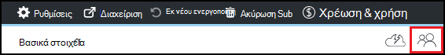

<properties
    pageTitle="Προσθήκη στους κατόχους και τους χρήστες στο Azure DevTest Labs | Microsoft Azure"
    description="Προσθήκη στους κατόχους και τους χρήστες στο Labs DevTest Azure χρησιμοποιώντας την πύλη του Azure ή PowerShell"
    services="devtest-lab,virtual-machines"
    documentationCenter="na"
    authors="tomarcher"
    manager="douge"
    editor=""/>

<tags
    ms.service="devtest-lab"
    ms.workload="na"
    ms.tgt_pltfrm="na"
    ms.devlang="na"
    ms.topic="article"
    ms.date="09/12/2016"
    ms.author="tarcher"/>

# Προσθήκη στους κατόχους και τους χρήστες στο Azure DevTest Labs

> [AZURE.VIDEO how-to-set-security-in-your-devtest-lab]

Πρόσβαση στο Azure DevTest Labs ελέγχεται από [Ελέγχου πρόσβασης Azure Role-Based (RBAC)](../active-directory/role-based-access-control-what-is.md). Χρήση RBAC, μπορείτε να segregate καθηκόντων με την ομάδα σας σε *ρόλους* , όπου μπορείτε να εκχωρήσετε μόνο το ποσό της access είναι απαραίτητο να στους χρήστες να εκτελούν τις εργασίες τους. Τρεις από αυτούς τους ρόλους RBAC είναι *κάτοχος*, *DevTest Labs χρήστη*και *συμβολής*. Σε αυτό το άρθρο, θα μάθετε ποιες ενέργειες μπορεί να εκτελεστεί σε κάθε έναν από τους τρεις κύριο ρόλους RBAC. Από εδώ, μπορείτε να μάθετε πώς μπορείτε να προσθέσετε χρήστες σε μια εργαστήριο - τόσο μέσω της πύλης και μέσω μια δέσμη ενεργειών PowerShell, καθώς και τον τρόπο για να προσθέσετε χρήστες στο επίπεδο της συνδρομής.

## Ενέργειες που μπορούν να εκτελεστούν σε κάθε ρόλο

Υπάρχουν τρία κύρια ρόλοι που μπορείτε να αντιστοιχίσετε ένα χρήστη:

- Κάτοχος
- DevTest Labs χρήστη
- Συμβολής

Ο παρακάτω πίνακας δείχνει τις ενέργειες που μπορούν να εκτελεστούν από τους χρήστες σε κάθε έναν από αυτούς τους ρόλους:

| **Μπορούν να εκτελούν ενέργειες χρηστών σε αυτόν το ρόλο** | **DevTest Labs χρήστη**            | **Κάτοχος** | **Συμβολής** |
|---|---|---|---|
| **Εργασίες εργαστήριο**                          |                              |       |             |
| Προσθήκη χρηστών σε ένα εργαστήριο                     | Όχι                           | Ναι   | Όχι          |
| Ενημέρωση ρυθμίσεων κόστους                   | Όχι                           | Ναι   | Ναι         |
| **Εικονική βασικές εργασίες**                      |                              |       |             |
| Προσθήκη και κατάργηση προσαρμοσμένων εικόνων           | Όχι                           | Ναι   | Ναι         |
| Προσθήκη, ενημέρωση και διαγραφή τύπων       | Ναι                          | Ναι   | Ναι         |
| Εικόνες Whitelist Azure Marketplace     | Όχι                           | Ναι   | Ναι         |
| **Εικονική εργασίες**                           |                              |       |             |
| Δημιουργία ΣΠΣ                             | Ναι                          | Ναι   | Ναι         |
| Έναρξη και διακοπή διαγραφή ΣΠΣ            | Μόνο οι ΣΠΣ που δημιουργήθηκαν από το χρήστη | Ναι   | Ναι         |
| Ενημέρωση των πολιτικών Εικονική                     | Όχι                           | Ναι   | Ναι         |
| Προσθήκη/κατάργηση δίσκων δεδομένων προς/από ΣΠΣ      | Μόνο οι ΣΠΣ που δημιουργήθηκαν από το χρήστη | Ναι   | Ναι         |
| **Αντικείμενο εργασίες**                     |                              |       |             |
| Προσθήκη και κατάργηση αποθετήρια αντικείμενο   | Όχι                           | Ναι   | Ναι         |
| Εφαρμογή αντικείμενα                        | Ναι                          | Ναι   | Ναι         |

> [AZURE.NOTE] Όταν ένας χρήστης δημιουργεί μια Εικονική, αυτός ο χρήστης εκχωρούνται αυτόματα στο ρόλο **κατόχου** της η Εικονική που έχουν δημιουργηθεί.

## Προσθήκη ο κάτοχος ή ο χρήστης στο επίπεδο εργαστήριο

Οι κάτοχοι και οι χρήστες μπορούν να προστεθούν στο επίπεδο εργαστήριο μέσω της πύλης Azure. Αυτό περιλαμβάνει εξωτερικούς χρήστες με έναν έγκυρο [λογαριασμό Microsoft (MSA)](devtest-lab-faq.md#what-is-a-microsoft-account).
Ακολουθήστε τα παρακάτω βήματα σας καθοδηγήσει τη διαδικασία προσθήκης ο κάτοχος ή ο χρήστης σε ένα εργαστήριο στο Azure DevTest Labs:

1. Είσοδος στην [πύλη του Azure](http://go.microsoft.com/fwlink/p/?LinkID=525040).

1. Επιλέξτε **περισσότερες υπηρεσίες**και, στη συνέχεια, επιλέξτε **DevTest Labs** από τη λίστα.

1. Από τη λίστα των labs, επιλέξτε το επιθυμητό εργαστήριο.

1. Στην blade το εργαστήριο, επιλέξτε **Ρύθμιση παραμέτρων**. 

1. Στην blade τη **Ρύθμιση παραμέτρων** , επιλέξτε **τους χρήστες**.

1. Στην το blade **χρήστες** , επιλέξτε **+ Add**.

    

1. Στην blade **Επιλέξτε ένα ρόλο** , επιλέξτε το επιθυμητό ρόλο. Στην ενότητα [Ενέργειες που μπορεί να εκτελεστεί σε κάθε ρόλο](#actions-that-can-be-performed-in-each-role) παραθέτει τις διάφορες ενέργειες που μπορούν να εκτελεστούν από τους χρήστες στην του κατόχου, DevTest χρήστη και τους ρόλους συμβολής.

1. Στην blade την **Προσθήκη χρηστών** , πληκτρολογήστε τη διεύθυνση ηλεκτρονικού ταχυδρομείου ή το όνομα του χρήστη που θέλετε να προσθέσετε στο ρόλο που καθορίσατε. Εάν ο χρήστης δεν μπορεί να βρεθεί, ένα μήνυμα σφάλματος που περιγράφει το ζήτημα. Εάν ο χρήστης βρίσκεται, αυτός ο χρήστης είναι που παρατίθενται και επιλεγμένο. 

1. Επιλέξτε " **επιλογή"**.

1. Επιλέξτε **OK** για να κλείσετε την **access Προσθήκη** blade.

1. Όταν επιστρέψετε το blade **χρήστες** , ο χρήστης έχει προστεθεί.  

## Προσθήκη ενός εξωτερικού χρήστη σε ένα εργαστήριο χρήση του PowerShell

Εκτός από την προσθήκη χρηστών στην πύλη του Azure, μπορείτε να προσθέσετε έναν εξωτερικό χρήστη σε εργαστήριο σας χρησιμοποιώντας μια δέσμη ενεργειών PowerShell. Στο παρακάτω παράδειγμα, απλώς τροποποιήστε τις τιμές παραμέτρων κάτω από το σχόλιο **τιμές για να αλλάξετε** .
Μπορείτε να ανακτήσετε τα `subscriptionId`, `labResourceGroup`, και `labName` τιμές από την blade εργαστήριο στην πύλη του Azure.

> [AZURE.NOTE]
> Το δείγμα δέσμης ενεργειών προϋποθέτει ότι ο καθορισμένος χρήστης έχει προστεθεί ως επισκέπτης υπηρεσία καταλόγου Active Directory και, εάν δεν είναι αυτή την περίπτωση θα αποτύχει. Για να προσθέσετε ένα χρήστη όχι στην υπηρεσία καταλόγου Active Directory ένα εργαστήριο, χρησιμοποιήστε την πύλη του Azure για να εκχωρήσετε στο χρήστη σε ένα ρόλο, όπως φαίνεται στην ενότητα [Προσθήκη έναν κάτοχο ή χρήστη στο επίπεδο εργαστήριο](#add-an-owner-or-user-at-the-lab-level).   

    # Add an external user in DevTest Labs user role to a lab
    # Ensure that guest users can be added to the Azure Active directory:
    # https://azure.microsoft.com/en-us/documentation/articles/active-directory-create-users/#set-guest-user-access-policies

    # Values to change
    $subscriptionId = "<Enter Azure subscription ID here>"
    $labResourceGroup = "<Enter lab's resource name here>"
    $labName = "<Enter lab name here>"
    $userDisplayName = "<Enter user's display name here>"

    # Log into your Azure account
    Login-AzureRmAccount
    
    # Select the Azure subscription that contains the lab. 
    # This step is optional if you have only one subscription.
    Select-AzureRmSubscription -SubscriptionId $subscriptionId
    
    # Retrieve the user object
    $adObject = Get-AzureRmADUser -SearchString $userDisplayName
    
    # Create the role assignment. 
    $labId = ('subscriptions/' + $subscriptionId + '/resourceGroups/' + $labResourceGroup + '/providers/Microsoft.DevTestLab/labs/' + $labName)
    New-AzureRmRoleAssignment -ObjectId $adObject.Id -RoleDefinitionName 'DevTest Labs User' -Scope $labId

## Προσθήκη ο κάτοχος ή ο χρήστης στο επίπεδο της συνδρομής

Azure δικαιώματα μεταβιβάζονται από γονική εμβέλεια στην εμβέλεια θυγατρικό στο Azure. Γι ' αυτό, οι κάτοχοι της συνδρομής Azure που περιέχει labs είναι αυτόματα οι κάτοχοι της αυτές τις labs. Τους ανήκουν επίσης του ΣΠΣ και άλλοι πόροι που δημιουργήθηκε από το εργαστήριο χρηστών και η υπηρεσία Azure DevTest Labs. 

Μπορείτε να προσθέσετε επιπλέον κάτοχοι σε ένα εργαστήριο μέσω του εργαστήριο blade στην [πύλη του Azure](http://go.microsoft.com/fwlink/p/?LinkID=525040). Ωστόσο, εμβέλεια του κατόχου που προστέθηκε διαχείρισης είναι πιο στενό από ο κάτοχος της συνδρομής του εύρους. Για παράδειγμα, οι κάτοχοι προστέθηκε δεν έχετε πλήρη πρόσβαση σε ορισμένους από τους πόρους που έχουν δημιουργηθεί στο τη συνδρομή από την υπηρεσία DevTest Labs. 

Για να προσθέσετε έναν κάτοχο σε μια συνδρομή του Azure, ακολουθήστε τα παρακάτω βήματα:

1. Είσοδος στην [πύλη του Azure](http://go.microsoft.com/fwlink/p/?LinkID=525040).

1. Επιλέξτε **Περισσότερες υπηρεσίες**και, στη συνέχεια, επιλέξτε **συνδρομές** από τη λίστα.

1. Επιλέξτε τη συνδρομή που θέλετε.

1. Επιλέξτε το εικονίδιο της **Access** . 

    

1. Στην το blade **χρήστες** , επιλέξτε **Προσθήκη**.

    

1. Στην blade **Επιλέξτε ένα ρόλο** , επιλέξτε **κατόχου**.

1. Στην blade την **Προσθήκη χρηστών** , πληκτρολογήστε τη διεύθυνση ηλεκτρονικού ταχυδρομείου ή το όνομα του χρήστη που θέλετε να προσθέσετε ως έναν κάτοχο. Εάν δεν είναι δυνατή η εύρεση του χρήστη, μπορείτε να λάβετε ένα μήνυμα σφάλματος που εξηγεί το πρόβλημα. Εάν ο χρήστης βρίσκεται, αυτόν το χρήστη εμφανίζεται κάτω από το πλαίσιο κειμένου του **χρήστη** .

1. Επιλέξτε το όνομα χρήστη βρίσκονται.

1. Επιλέξτε " **επιλογή"**.

1. Επιλέξτε **OK** για να κλείσετε την **access Προσθήκη** blade.

1. Όταν επιστρέψετε το blade **χρήστες** , ο χρήστης έχει προστεθεί ως έναν κάτοχο. Αυτός ο χρήστης είναι τώρα έναν κάτοχο της οποιαδήποτε labs δημιουργηθεί κάτω από αυτήν τη συνδρομή και, επομένως, θα μπορείτε να εκτελέσετε εργασίες κατόχου. 

[AZURE.INCLUDE [devtest-lab-try-it-out](../../includes/devtest-lab-try-it-out.md)]
