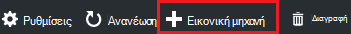

<properties
    pageTitle="Προσθήκη μια Εικονική με αντικείμενα σε ένα εργαστήριο στο Azure DevTest Labs | Microsoft Azure"
    description="Μάθετε πώς μπορείτε να προσθέσετε μια Εικονική με αντικείμενα σε Azure DevTest Labs"
    services="devtest-lab,virtual-machines"
    documentationCenter="na"
    authors="tomarcher"
    manager="douge"
    editor=""/>

<tags
    ms.service="devtest-lab"
    ms.workload="na"
    ms.tgt_pltfrm="na"
    ms.devlang="na"
    ms.topic="article"
    ms.date="08/30/2016"
    ms.author="tarcher"/>

# Προσθήκη μια Εικονική με αντικείμενα σε ένα εργαστήριο στο Azure DevTest Labs

> [AZURE.VIDEO how-to-create-vms-with-artifacts-in-a-devtest-lab]

Μπορείτε να δημιουργήσετε μια Εικονική σε ένα εργαστήριο από μια *βάση* που είναι μια [προσαρμοσμένη εικόνα](./devtest-lab-create-template.md), [τον τύπο](./devtest-lab-manage-formulas.md), ή [εικόνα Marketplace](./devtest-lab-configure-marketplace-images.md).

DevTest Labs *αντικείμενα* σάς επιτρέπουν να καθορίσετε *Ενέργειες* που εκτελούνται όταν δημιουργείται η Εικονική. 

Ενέργειες αντικείμενο μπορεί να εκτελέσει διαδικασίες όπως η εκτέλεση δεσμών ενεργειών του Windows PowerShell, εκτελώντας εντολές πάρτι και την εγκατάσταση του λογισμικού. 

Αντικείμενο *παράμετροι* σάς επιτρέπουν να προσαρμόσετε το αντικείμενο για δική σας περίπτωση.

Σε αυτό το άρθρο σάς δείχνει πώς μπορείτε να δημιουργήσετε μια Εικονική στο εργαστήριο σας με αντικείμενα.

## Προσθέστε μια Εικονική με αντικείμενα

1. Είσοδος στην [πύλη του Azure](http://go.microsoft.com/fwlink/p/?LinkID=525040).

1. Επιλέξτε **Περισσότερες υπηρεσίες**και, στη συνέχεια, επιλέξτε **DevTest Labs** από τη λίστα.

1. Από τη λίστα των labs, επιλέξτε εργαστήριο στο οποίο θέλετε να δημιουργήσετε την εικονική Μηχανή.  

1. Στην **Επισκόπηση** blade το εργαστήριο, επιλέξτε **+ εικονική μηχανή**.  
    

1. Στην την **επιλογή μια βάση** blade, επιλέξτε μια βάση για την εικονική Μηχανή.

1. Στην η **εικονική μηχανή** blade, πληκτρολογήστε ένα όνομα για τη νέα εικονική μηχανή στο πλαίσιο κειμένου **όνομα εικονική μηχανή** .

    

1. Πληκτρολογήστε ένα **Όνομα χρήστη** που θα εκχωρηθούν δικαιώματα διαχειριστή στον υπολογιστή εικονική.  

1. Εάν θέλετε να χρησιμοποιήσετε έναν κωδικό πρόσβασης που είναι αποθηκευμένα στο χώρο *αποθήκευσης μυστικού*, επιλέξτε **Χρήση απόρρητο από το μυστικό store**και, καθορίστε μια τιμή κλειδιού που αντιστοιχεί το μυστικό (κωδικός πρόσβασης). Διαφορετικά, απλώς πληκτρολογήστε έναν κωδικό πρόσβασης στο πεδίο κειμένου, **Πληκτρολογήστε μια τιμή**με την ετικέτα.
 
1. Επιλέξτε **μέγεθος εικονική μηχανή** και επιλέξτε ένα από τα προκαθορισμένα στοιχεία που καθορίζουν το πυρήνων επεξεργαστή, το μέγεθος RAM και το μέγεθος μονάδα σκληρού δίσκου του η Εικονική για να δημιουργήσετε.

1. Επιλέξτε **εικονικές δικτύου** και επιλέξτε την επιθυμητή εικονικού δικτύου.

1. Επιλέξτε **υποδικτύου** και επιλέξτε υποδικτύου.

1. Εάν η πολιτική εργαστήριο έχει ρυθμιστεί για να επιτρέψετε σε δημόσια διευθύνσεις IP για το επιλεγμένο υποδίκτυο, καθορίστε εάν θέλετε η διεύθυνση IP για να είναι δημόσια, επιλέγοντας **Ναι** ή **όχι**. Διαφορετικά, αυτή η επιλογή είναι απενεργοποιημένη και να επιλέξει ως **όχι**. 

1. Επιλέξτε **αντικείμενα** - από τη λίστα των αντικείμενα - επιλέξτε και ρύθμιση παραμέτρων τα αντικείμενα που θέλετε να προσθέσετε τη βασική εικόνα. 
**Σημείωση:** Εάν είστε νέος χρήστης του DevTest Labs ή τη ρύθμιση των παραμέτρων αντικείμενα, μεταβείτε στην ενότητα [Προσθήκη ενός υπάρχοντος αντικείμενο σε μια Εικονική](#add-an-existing-artifact-to-a-vm) και, στη συνέχεια, επιστρέψετε εδώ, όταν ολοκληρώσετε τη διαδικασία.

1. Εάν θέλετε να προβάλετε ή αντιγραφή του προτύπου για τη διαχείριση πόρων Azure, μεταβείτε στην ενότητα [Αποθήκευση από διαχειριστή πόρων Azure πρότυπο](#save-arm-template) και επιστροφής εδώ όταν ολοκληρώσετε τη διαδικασία.

1. Επιλέξτε **Δημιουργία** για να προσθέσετε την καθορισμένη εικονική Μηχανή εργαστήριο.

1. Το blade εργαστήριο εμφανίζει την κατάσταση της δημιουργίας η Εικονική; πρώτα ως **Δημιουργία**, στη συνέχεια, με την **Εκτέλεση** μετά την εικονική Μηχανή έχει ξεκινήσει.

1. Μεταβείτε στην ενότητα [Επόμενα βήματα](#next-steps) . 

## Προσθήκη ενός υπάρχοντος αντικείμενο σε μια εικονική Μηχανή

Κατά τη δημιουργία μια Εικονική, μπορείτε να προσθέσετε υπάρχοντα αντικείμενα. Κάθε εργαστήριο περιλαμβάνει αντικείμενα από τη δημόσια DevTest Labs αντικείμενο αποθετήριο, καθώς και αντικείμενα που έχετε δημιουργήσει και προσθέσει στη δική σας αποθετήριο αντικείμενο.
Για να ανακαλύψετε πώς μπορείτε να δημιουργήσετε αντικείμενα, ανατρέξτε στο άρθρο, [Μάθετε πώς μπορείτε να συντάκτης τη δική σας αντικείμενα για χρήση με DevTest Labs](devtest-lab-artifact-author.md).

1. Στην η **εικονική μηχανή** blade, επιλέξτε **αντικείμενα**. 

1. Στην blade την **Προσθήκη αντικείμενα** , επιλέξτε το αντικείμενο που θέλετε.  

    

1. Πληκτρολογήστε τις τιμές παραμέτρων απαιτείται και οποιεσδήποτε παραμέτρους προαιρετικό που χρειάζεστε.  

1. Επιλέξτε **Προσθήκη** για να προσθέσετε το αντικείμενο και να επιστρέψετε το blade **Προσθήκη αντικείμενα** .

1. Συνεχίστε να προσθέτετε αντικείμενα όπως απαιτείται για την Εικονική.

1. Αφού προσθέσετε το αντικείμενα, μπορείτε να [αλλάξετε τη σειρά με την οποία τα αντικείμενα που εκτελούνται](#change-the-order-in-which-artifacts-are-run). Μπορείτε επίσης να μεταβείτε ξανά για να [προβάλετε ή να τροποποιήσετε ένα αντικείμενο](#view-or-modify-an-artifact).

## Αλλαγή της σειράς με την οποία αντικείμενα που εκτελούνται

Από προεπιλογή, με τη σειρά με την οποία προστίθενται η Εικονική εκτελούνται οι ενέργειες από τα αντικείμενα. Ακολουθήστε τα παρακάτω βήματα περιγράφουν πώς μπορείτε να αλλάξετε τη σειρά με την οποία τα αντικείμενα που εκτελούνται.

1. Στο επάνω μέρος του blade **Προσθήκη αντικείμενα** , επιλέξτε τη σύνδεση που υποδεικνύει τον αριθμό των αντικείμενα που έχουν προστεθεί η Εικονική.

    

1. Για να καθορίσετε τη σειρά με την οποία τα αντικείμενα που εκτελούνται, σύρετε και αποθέστε τα αντικείμενα τη σειρά που θέλετε. **Σημείωση:** Εάν έχετε αντιμετωπίζετε προβλήματα με τη μεταφορά το αντικείμενο, βεβαιωθείτε ότι σύρετε από την αριστερή πλευρά της το αντικείμενο. 

1. Επιλέξτε **OK** όταν τελειώσετε.  

## Προβάλετε ή να τροποποιήσετε ένα αντικείμενο

Ακολουθήστε τα παρακάτω βήματα εξηγούν πώς μπορείτε να προβάλετε ή να τροποποιήσετε τις παραμέτρους ένα αντικείμενο:

1. Στο επάνω μέρος του blade **Προσθήκη αντικείμενα** , επιλέξτε τη σύνδεση που υποδεικνύει τον αριθμό των αντικείμενα που έχουν προστεθεί η Εικονική.

    

1. Στην blade τα **Επιλεγμένα αντικείμενα** , επιλέξτε το αντικείμενο που θέλετε να προβάλετε ή να επεξεργαστείτε.  

1. Στην blade την **Προσθήκη αντικείμενο** , κάντε τις απαραίτητες αλλαγές και επιλέξτε **OK** για να κλείσετε το blade **Προσθήκη αντικείμενο** .

1. Επιλέξτε **OK** για να κλείσετε το blade **Επιλεγμένα αντικείμενα** .

## Αποθήκευση προτύπου για τη διαχείριση πόρων Azure

Ένα πρότυπο από διαχειριστή πόρων Azure παρέχει δηλωτικό τρόπο για να ορίσετε μια επαναλαμβανόμενη ανάπτυξη. Ακολουθήστε τα παρακάτω βήματα εξηγούν τον τρόπο για να αποθηκεύσετε το πρότυπο διαχείρισης πόρων Azure για τη δημιουργία Εικονική.
Αφού αποθηκευτεί, μπορείτε να χρησιμοποιήσετε το πρότυπο διαχείρισης πόρων Azure για την [ανάπτυξη νέου ΣΠΣ με το Azure PowerShell](../azure-resource-manager/resource-group-overview.md#template-deployment).

1. Στην η **εικονική μηχανή** blade, επιλέξτε **Προβολή ARM πρότυπο**.

1. Στην **προβολή προτύπου για τη διαχείριση πόρων Azure blade**, επιλέξτε το κείμενο το πρότυπο.

1. Αντιγραφή του επιλεγμένου κειμένου στο Πρόχειρο.

1. Επιλέξτε **OK** για να κλείσετε το **πρότυπο διαχείρισης πόρων Azure προβολή blade**.

1. Ανοίξτε ένα πρόγραμμα επεξεργασίας κειμένου.

1. Επικολλήστε το κείμενο προτύπου από το Πρόχειρο.

1. Αποθηκεύστε το αρχείο για μελλοντική χρήση.

[AZURE.INCLUDE [devtest-lab-try-it-out](../../includes/devtest-lab-try-it-out.md)]

## Επόμενα βήματα

- Μόλις δημιουργηθεί η Εικονική, μπορείτε να συνδεθείτε για να την εικονική Μηχανή, επιλέγοντας **σύνδεση** στην blade την εικονική Μηχανή.
- Μάθετε πώς να [δημιουργείτε προσαρμοσμένα αντικείμενα για σας Εικονική Labs DevTest](devtest-lab-artifact-author.md).
- Εξερευνήστε τη [συλλογή προτύπων γρήγορη έναρξη ARM Labs DevTest](https://github.com/Azure/azure-devtestlab/tree/master/ARMTemplates)