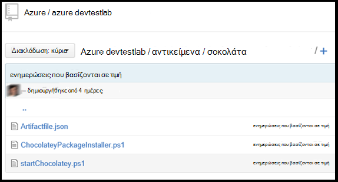

<properties 
    pageTitle="Δημιουργία προσαρμοσμένου αντικείμενα για σας Εικονική Labs DevTest | Microsoft Azure"
    description="Μάθετε πώς μπορείτε να συντάκτης τη δική σας αντικείμενα για χρήση με DevTest Labs"
    services="devtest-lab,virtual-machines"
    documentationCenter="na"
    authors="tomarcher"
    manager="douge"
    editor=""/>

<tags
    ms.service="devtest-lab"
    ms.workload="na"
    ms.tgt_pltfrm="na"
    ms.devlang="na"
    ms.topic="article"
    ms.date="08/25/2016"
    ms.author="tarcher"/>

#Δημιουργία προσαρμοσμένου αντικείμενα για σας Εικονική Labs DevTest

> [AZURE.VIDEO how-to-author-custom-artifacts] 

## Επισκόπηση
**Αντικείμενα** που χρησιμοποιούνται για την ανάπτυξη και ρύθμιση παραμέτρων την εφαρμογή σας μετά την παροχή της υπηρεσίας μια Εικονική. Ένα αντικείμενο αποτελείται από ένα αρχείο ορισμού αντικείμενο και άλλα αρχεία δέσμης ενεργειών που είναι αποθηκευμένες σε ένα φάκελο σε ένα αποθετήριο git. Αρχεία ορισμού αντικείμενο αποτελούνται από JSON και παραστάσεις που μπορείτε να χρησιμοποιήσετε για να καθορίσετε τι θέλετε να εγκαταστήσετε το σε μια Εικονική. Για παράδειγμα, μπορείτε να ορίσετε το όνομα του αντικείμενο, εντολή για να εκτελέσετε και οι παράμετροι που γίνονται διαθέσιμα κατά την εκτέλεση της εντολής. Μπορείτε να ανατρέξετε σε άλλα αρχεία δέσμης ενεργειών μέσα στο αρχείο ορισμού αντικείμενο με βάση το όνομα.

##Μορφή αρχείου ορισμού αντικείμενο
Το παρακάτω παράδειγμα δείχνει τις ενότητες που απαρτίζουν τη βασική δομή ενός αρχείου ορισμού.

    {
      "$schema": "https://raw.githubusercontent.com/Azure/azure-devtestlab/master/schemas/2015-01-01/dtlArtifacts.json",
      "title": "",
      "description": "",
      "iconUri": "",
      "targetOsType": "",
      "parameters": {
        "<parameterName>": {
          "type": "",
          "displayName": "",
          "description": ""
        }
      },
      "runCommand": {
        "commandToExecute": ""
      }
    }

| Όνομα στοιχείου | Απαιτείται; | Περιγραφή
| ------------ | --------- | -----------
| $schema      | Όχι        | Θέση του αρχείου σχήματος JSON που βοηθά στον έλεγχο της εγκυρότητας των το αρχείο ορισμού.
| Τίτλος        | Ναι       | Όνομα της το αντικείμενο εμφανίζεται στο εργαστήριο.
| Περιγραφή  | Ναι       | Περιγραφή το αντικείμενο εμφανίζεται στο εργαστήριο.
| iconUri      | Όχι        | URI από το εικονίδιο που εμφανίζεται στο εργαστήριο.
| targetOsType | Ναι       | Λειτουργικό σύστημα του η Εικονική όπου θα εγκατασταθούν αντικείμενο. Υποστηρίζονται οι επιλογές είναι: Windows και Linux.
| παράμετροι   | Όχι        | Τιμές που παρέχονται κατά την εκτέλεση της εντολής αντικείμενο εγκατάσταση σε υπολογιστή. Αυτό σας βοηθά στην προσαρμογή το αντικείμενο.
| Εκτέλεση εντολής   | Ναι       | Αντικείμενο εντολής που εκτελείται σε μια Εικονική εγκατάστασης.

###Παράμετροι αντικείμενο

Στην ενότητα τις παραμέτρους του αρχείου ορισμού, μπορείτε να καθορίσετε ποιες τιμές ένας χρήστης μπορεί να εισαγάγετε κατά την εγκατάσταση σε ένα αντικείμενο. Μπορείτε να ανατρέξετε σε αυτές τις τιμές στην εντολή εγκατάσταση αντικείμενο.

Μπορείτε να καθορίσετε τις παραμέτρους θα την ακόλουθη δομή.

    "parameters": {
        "<parameterName>": {
          "type": "<type-of-parameter-value>",
          "displayName": "<display-name-of-parameter>",
          "description": "<description-of-parameter>"
        }
      }

| Όνομα στοιχείου | Απαιτείται; | Περιγραφή
| ------------ | --------- | -----------
| Τύπος         | Ναι       | Τύπος τιμής παραμέτρου. Δείτε την παρακάτω λίστα για την επιτρεπόμενων τύπων:
| Εμφανιζόμενο όνομα Ναι       | Το όνομα της παραμέτρου που εμφανίζεται σε ένα χρήστη στο εργαστήριο.
| Περιγραφή  | Ναι       | Περιγραφή της παραμέτρου που εμφανίζεται στο εργαστήριο.

Οι επιτρεπόμενοι τύποι είναι:

- συμβολοσειρά – οποιαδήποτε έγκυρη συμβολοσειρά JSON
- Int – οποιαδήποτε έγκυρη JSON ακέραιο
- bool – οποιαδήποτε έγκυρη δυαδική JSON
- πίνακα – οποιαδήποτε έγκυρη πίνακας JSON

##Αντικείμενο παραστάσεις και τις συναρτήσεις

Μπορείτε να χρησιμοποιήσετε παράσταση και εντολής εγκατάστασης συναρτήσεις για να δημιουργήσετε το αντικείμενο.
Παραστάσεις βρίσκονται μέσα σε αγκύλες ([και]), και αξιολογούνται όταν είναι εγκατεστημένο το αντικείμενο. Οι παραστάσεις μπορούν να εμφανίζονται σε οποιοδήποτε σημείο στην τιμή συμβολοσειράς JSON και επιστρέφει πάντα μια άλλη τιμή JSON. Εάν πρέπει να χρησιμοποιήσετε μια συμβολοσειρά κειμένου που ξεκινά με μια αγκύλη [, πρέπει να χρησιμοποιήσετε δύο αγκύλες [[.
Συνήθως, χρησιμοποιείτε εκφράσεις με συναρτήσεις για να δημιουργήσετε μια τιμή. Όπως ακριβώς στο JavaScript, συνάρτηση κλήσεις έχουν μορφοποιηθεί ως functionName(arg1,arg2,arg3)

Η παρακάτω λίστα παρουσιάζει κοινές λειτουργίες.

- Parameters(parameterName) - επιστρέφει μια τιμή παραμέτρου που παρέχεται κατά την εκτέλεση της εντολής αντικείμενο.
- concat (arg1, arg2, όρισμα 3,...) - συνδυάζει πολλές τιμές συμβολοσειράς. Αυτή η συνάρτηση μπορεί να διαρκέσει οποιονδήποτε αριθμό ορισμάτων.

Το παρακάτω παράδειγμα δείχνει πώς μπορείτε να χρησιμοποιήσετε συναρτήσεις και παράσταση για να δημιουργήσετε μια τιμή.

    runCommand": {
         "commandToExecute": "[concat('powershell.exe -File startChocolatey.ps1'
    , ' -RawPackagesList ', parameters('packages')
    , ' -Username ', parameters('installUsername')
    , ' -Password ', parameters('installPassword'))]"
    }

##Δημιουργήστε ένα προσαρμοσμένο αντικείμενο

Δημιουργήσετε το προσαρμοσμένο αντικείμενο, ακολουθώντας τα παρακάτω βήματα:

1. Εγκαταστήστε ένα πρόγραμμα επεξεργασίας JSON - θα χρειαστείτε ένα πρόγραμμα επεξεργασίας JSON για να εργαστείτε με αρχεία ορισμού αντικείμενο. Συνιστάται να χρησιμοποιείτε τον [Κώδικα Visual Studio](https://code.visualstudio.com/), που είναι διαθέσιμη για Windows, Linux και OS X.

1. Λάβετε ένα δείγμα artifactfile.json - ανατρέξτε στο θέμα τα αντικείμενα που δημιουργήθηκε από την ομάδα Azure DevTest Labs στο μας [GitHub αποθετήριο](https://github.com/Azure/azure-devtestlab) όπου δημιουργήσαμε εμπλουτισμένου βιβλιοθήκης με αντικείμενα που θα σας βοηθήσει να δημιουργήσετε το δικό σας αντικείμενα. Κάντε λήψη ένα αρχείο ορισμού αντικείμενο και να κάνετε αλλαγές σε αυτό για να δημιουργήσετε το δικό σας αντικείμενα.

1. Κάντε χρήση του IntelliSense - αξιοποίηση IntelliSense για να δείτε έγκυρα στοιχεία που μπορούν να χρησιμοποιηθούν για να δημιουργήσετε ένα αρχείο ορισμού αντικείμενο. Μπορείτε επίσης να δείτε τις διαφορετικές επιλογές για τις τιμές ενός στοιχείου. Για παράδειγμα, IntelliSense δείχνουν τις δύο επιλογές των Windows ή Linux κατά την επεξεργασία του στοιχείου **targetOsType** .

1. Αποθηκεύστε το αντικείμενο σε ένα αποθετήριο git
    1. Δημιουργήστε ένα ξεχωριστό κατάλογο για κάθε αντικείμενο όπου το όνομα του καταλόγου είναι το ίδιο με το όνομα αντικείμενο.
    1. Αποθηκεύστε το αρχείο ορισμού αντικείμενο (artifactfile.json) στον κατάλογο που δημιουργήσατε.
    1. Αποθηκεύστε τις δέσμες ενεργειών που αναφέρονται από την εντολή εγκατάσταση αντικείμενο.

    Ακολουθεί ένα παράδειγμα ενός φακέλου αντικείμενο μπορεί να εμφάνισης:

    

1. Προσθήκη του αποθετηρίου αντικείμενα σε εργαστήριο - ανατρέξτε στο άρθρο, [Προσθήκη ένα αποθετήριο αντικείμενο Git σε ένα εργαστήριο](devtest-lab-add-artifact-repo.md).

[AZURE.INCLUDE [devtest-lab-try-it-out](../../includes/devtest-lab-try-it-out.md)]

## Σχετικές ιστολογίου
- [Τρόπος αντιμετώπισης προβλημάτων αποτυγχάνει εργαλεία σε AzureDevTestLabs](http://www.visualstudiogeeks.com/blog/DevOps/How-to-troubleshoot-failing-artifacts-in-AzureDevTestLabs)
- [Συμμετοχή σε μια Εικονική για υπάρχοντα τομέα AD χρησιμοποιώντας το πρότυπο ARM στο εργαστήριο δοκιμών αποκλίσεις Azure](http://www.visualstudiogeeks.com/blog/DevOps/Join-a-VM-to-existing-AD-domain-using-ARM-template-AzureDevTestLabs)

## Επόμενα βήματα

- Μάθετε πώς μπορείτε να [προσθέσετε ένα αποθετήριο αντικείμενο Git σε ένα εργαστήριο](devtest-lab-add-artifact-repo.md).
