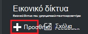
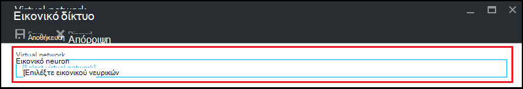
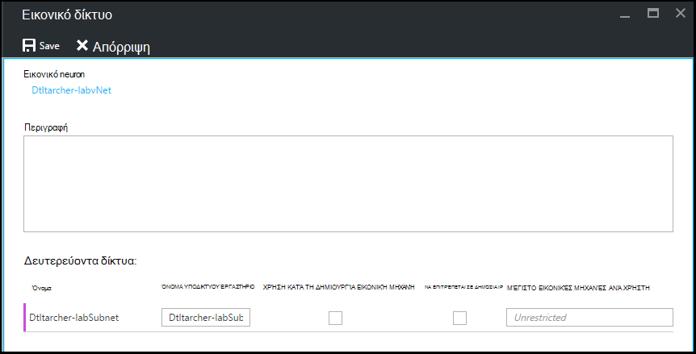

<properties
    pageTitle="Ρύθμιση παραμέτρων εικονικού δικτύου στο Azure DevTest Labs | Microsoft Azure"
    description="Μάθετε πώς να ρυθμίσετε τις παραμέτρους μιας υπάρχουσας εικονικού δικτύου και το δευτερεύον και να τις χρησιμοποιήσετε σε μια Εικονική με Azure DevTest Labs"
    services="devtest-lab,virtual-machines"
    documentationCenter="na"
    authors="tomarcher"
    manager="douge"
    editor=""/>

<tags
    ms.service="devtest-lab"
    ms.workload="na"
    ms.tgt_pltfrm="na"
    ms.devlang="na"
    ms.topic="article"
    ms.date="09/06/2016"
    ms.author="tarcher"/>

# Ρύθμιση παραμέτρων εικονικού δικτύου στο Azure DevTest Labs

Όπως εξηγείται στο άρθρο [Προσθήκη μια Εικονική με αντικείμενα σε ένα εργαστήριο](devtest-lab-add-vm-with-artifacts.md), όταν δημιουργείτε μια Εικονική σε ένα εργαστήριο, μπορείτε να καθορίσετε μια ρύθμιση παραμέτρων εικονικού δικτύου. Ένα σενάριο για αυτήν τη διαδικασία είναι εάν πρέπει να έχετε πρόσβαση τους πόρους σας corpnet από το ΣΠΣ χρησιμοποιώντας το εικονικό δίκτυο που έχει ρυθμιστεί με ExpressRoute ή VPN τοποθεσίας σε τοποθεσία. Οι παρακάτω ενότητες περιγράφουν πώς μπορείτε να προσθέσετε το υπάρχον εικονικού δικτύου σε ένα εργαστήριο εικονικού δικτύου ρυθμίσεις ώστε να είναι διαθέσιμες για να επιλέξετε κατά τη δημιουργία ΣΠΣ.

## Ρύθμιση παραμέτρων εικονικού δικτύου για ένα εργαστήριο με την πύλη Azure
Ακολουθήστε τα παρακάτω βήματα θα σας καθοδηγήσουν προσθέτοντας μια υπάρχουσα εικονικού δικτύου (και το δευτερεύον) σε ένα εργαστήριο, έτσι ώστε να μπορούν να χρησιμοποιηθούν κατά τη δημιουργία μια Εικονική στο ίδιο εργαστήριο. 

1. Είσοδος στην [πύλη του Azure](http://go.microsoft.com/fwlink/p/?LinkID=525040).

1. Επιλέξτε **Περισσότερες υπηρεσίες**και, στη συνέχεια, επιλέξτε **DevTest Labs** από τη λίστα.

1. Από τη λίστα των labs, επιλέξτε το επιθυμητό εργαστήριο. 

1. Στην blade το εργαστήριο, επιλέξτε **Ρύθμιση παραμέτρων**.

1. Στην blade **ρύθμισης παραμέτρων** του εργαστήριο, επιλέξτε **εικονικές δίκτυα**.

1. Στη το blade **εικονικές δίκτυα** , μπορείτε να δείτε μια λίστα με εικονικού δίκτυα έχουν ρυθμιστεί για το τρέχον εργαστήριο, καθώς και το προεπιλεγμένο εικονικό δίκτυο που δημιουργείται για το εργαστήριο. 

1. Επιλέξτε **+ Add**.

    
    
1. Στην το blade **εικονικές δικτύου** , επιλέξτε **[Επιλέξτε εικονικού δικτύου]**.

    
    
1. Στην blade την **Επιλογή εικονικού δικτύου** , επιλέξτε την επιθυμητή εικονικού δικτύου. Το blade εμφανίζει όλα τα δίκτυα εικονικού που βρίσκονται κάτω από την ίδια περιοχή στην συνδρομής ως εργαστήριο.  

1. Αφού επιλέξετε ένα εικονικό δίκτυο, επιστρέφετε στο το blade **εικονικές δικτύου** και περισσότερα από ένα πεδία είναι ενεργοποιημένες.  

    

1. Καθορίστε μια περιγραφή για το δίκτυό σας εικονικού / συνδυασμό εργαστήριο.

1. Για να επιτρέψετε ένα υποδίκτυο θα χρησιμοποιηθεί σε εργαστήριο Εικονική δημιουργίας, επιλέξτε **ΧΡΉΣΗ σε ΕΙΚΟΝΙΚΉ ΜΗΧΑΝΉ ΔΗΜΙΟΥΡΓΊΑΣ**.

1. Για να επιτρέψετε δημόσιες διευθύνσεις IP σε ένα υποδίκτυο, επιλέξτε **ΔΥΝΑΤΌΤΗΤΑ ΔΗΜΌΣΙΑΣ IP**.

1. Στο πεδίο **ΜΈΓΙΣΤΟ ΕΙΚΟΝΙΚΈΣ ΜΗΧΑΝΈΣ ΑΝΆ ΧΡΉΣΤΗ** , καθορίστε το μέγιστο ΣΠΣ ανά χρήστη για κάθε υποδίκτυο. Εάν θέλετε ένα απεριόριστη αριθμό ΣΠΣ, αφήστε κενό αυτό το πεδίο.

1. Επιλέξτε **Αποθήκευση**.

1. Τώρα που έχει ρυθμιστεί το εικονικό δίκτυο, μπορείτε να επιλέξετε όταν δημιουργείτε μια Εικονική. Για να δείτε πώς μπορείτε να δημιουργήσετε μια Εικονική και να καθορίσετε ένα εικονικό δίκτυο, ανατρέξτε στο άρθρο, [Προσθήκη μια Εικονική με αντικείμενα σε ένα εργαστήριο](devtest-lab-add-vm-with-artifacts.md). 

[AZURE.INCLUDE [devtest-lab-try-it-out](../../includes/devtest-lab-try-it-out.md)]

## Επόμενα βήματα

Αφού προσθέσετε το εικονικό δικτύου που επιθυμείτε να εργαστήριο σας, το επόμενο βήμα είναι να [προσθέσετε μια Εικονική σε εργαστήριο σας](devtest-lab-add-vm-with-artifacts.md).