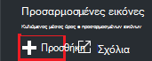
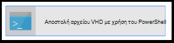
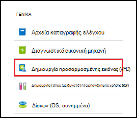
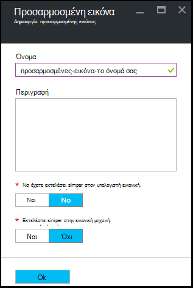

<properties
    pageTitle="Διαχείριση Azure DevTest Labs προσαρμοσμένες εικόνες για να δημιουργήσετε ΣΠΣ | Microsoft Azure"
    description="Μάθετε πώς μπορείτε να δημιουργήσετε μια προσαρμοσμένη εικόνα από ένα αρχείο VHD ή από μια υπάρχουσα Εικονική στα Azure DevTest Labs"
    services="devtest-lab,virtual-machines"
    documentationCenter="na"
    authors="tomarcher"
    manager="douge"
    editor=""/>

<tags
    ms.service="devtest-lab"
    ms.workload="na"
    ms.tgt_pltfrm="na"
    ms.devlang="na"
    ms.topic="article"
    ms.date="09/07/2016"
    ms.author="tarcher"/>

# Διαχείριση Azure DevTest Labs προσαρμοσμένες εικόνες για να δημιουργήσετε ΣΠΣ

Στο Azure DevTest Labs, προσαρμοσμένες εικόνες σάς επιτρέπουν να δημιουργήσετε ΣΠΣ γρήγορα χωρίς να περιμένει όλο το απαιτούμενο λογισμικό για να είναι εγκατεστημένο στον υπολογιστή προορισμού. Προσαρμοσμένες εικόνες σας επιτρέπει να προ-εγκαταστήσετε όλο το λογισμικό που χρειάζεστε σε ένα αρχείο VHD και, στη συνέχεια, χρησιμοποιήστε το αρχείο VHD για να δημιουργήσετε μια Εικονική. Επειδή το λογισμικό είναι ήδη εγκατεστημένο, της ώρας δημιουργίας Εικονική είναι πολύ πιο γρήγορα. Επιπλέον, προσαρμοσμένες εικόνες χρησιμοποιούνται για κλωνοποίηση ΣΠΣ, δημιουργώντας μια προσαρμοσμένη εικόνα από μια Εικονική και, στη συνέχεια, δημιουργία ΣΠΣ από αυτήν την προσαρμοσμένη εικόνα.

Σε αυτό το άρθρο, θα μάθετε πώς μπορείτε να:

- [Δημιουργία ενός προσαρμοσμένου ειδώλου από ένα αρχείο VHD](#create-a-custom-image-from-a-vhd-file) , έτσι ώστε να μπορείτε να δημιουργήσετε μια Εικονική από αυτήν την προσαρμοσμένη εικόνα. 
- [Δημιουργία ενός προσαρμοσμένου ειδώλου από μια Εικονική](#create-a-custom-image-from-a-vm) για γρήγορη κλωνοποίηση Εικονική.

## Δημιουργήστε μια προσαρμοσμένη εικόνα από αρχείο VHD

Σε αυτήν την ενότητα, μπορείτε να δείτε πώς μπορείτε να δημιουργήσετε μια προσαρμοσμένη εικόνα από αρχείο VHD.
Χρειάζεστε πρόσβαση σε ένα έγκυρο αρχείο VHD για να εκτελέσετε όλα τα βήματα σε αυτήν την ενότητα.   

1. Είσοδος στην [πύλη του Azure](http://go.microsoft.com/fwlink/p/?LinkID=525040).

1. Επιλέξτε **περισσότερες υπηρεσίες**και, στη συνέχεια, επιλέξτε **DevTest Labs** από τη λίστα.

1. Από τη λίστα των labs, επιλέξτε το επιθυμητό εργαστήριο.  

1. Στην blade το εργαστήριο, επιλέξτε **Ρύθμιση παραμέτρων**. 

1. Στην blade τη **ρύθμιση των παραμέτρων** εργαστήριο, επιλέξτε **προσαρμοσμένη εικόνες**.

1. Στην το blade **προσαρμοσμένες εικόνες** , επιλέξτε **+ προσαρμοσμένη εικόνα**.

    

1. Πληκτρολογήστε το όνομα της προσαρμοσμένης εικόνας. Αυτό το όνομα εμφανίζεται στη λίστα των βάσης εικόνες κατά τη δημιουργία μια Εικονική.

1. Εισαγάγετε την περιγραφή της προσαρμοσμένης εικόνας. Αυτή η περιγραφή εμφανίζεται στη λίστα των βάσης εικόνες κατά τη δημιουργία μια Εικονική.

1. Επιλέξτε **αρχείο VHD**.

1. Εάν έχετε πρόσβαση σε ένα αρχείο VHD που δεν παρατίθεται, προσθέσετε, ακολουθώντας τις οδηγίες στην ενότητα [Αποστολή αρχείου VHD](#upload-a-vhd-file) , και να επιστρέψετε εδώ όταν ολοκληρώσετε τη διαδικασία.

1. Επιλέξτε το επιθυμητό αρχείο VHD.

1. Επιλέξτε **OK** για να κλείσετε το **Αρχείο VHD** blade.

1. Επιλέξτε **Ρύθμιση παραμέτρων OS**.

1. Στην καρτέλα **Παράμετροι λειτουργικού Συστήματος** , επιλέξτε **Windows** ή **Linux**.

1. Εάν **τα Windows** είναι επιλεγμένο, καθορίστε μέσω το πλαίσιο ελέγχου αν έχει εκτελεστεί *Sysprep* στον υπολογιστή.

1. Επιλέξτε **OK** για να κλείσετε το blade **OS ρύθμισης παραμέτρων** .

1. Επιλέξτε **OK** για να δημιουργήσετε την προσαρμοσμένη εικόνα.

1. Μεταβείτε στην ενότητα [Επόμενα βήματα](#next-steps) .

###Αποστολή αρχείου VHD

Για να προσθέσετε μια προσαρμοσμένη εικόνα, πρέπει να έχετε πρόσβαση σε ένα αρχείο VHD.

1. Στην το **Αρχείο VHD** blade, επιλέξτε **Αποστολή αρχείου VHD με χρήση του PowerShell**.

    

1. Η επόμενη blade θα εμφανίσει οδηγίες για την τροποποίηση και εκτελεί μια δέσμη ενεργειών του PowerShell που στέλνει στη συνδρομή σας στο Azure ενός αρχείου VHD. 
**Σημείωση:** Αυτή η διαδικασία μπορεί να είναι χρονοβόρα, ανάλογα με το μέγεθος του αρχείου VHD και την ταχύτητα της σύνδεσης.

## Δημιουργήστε μια προσαρμοσμένη εικόνα από μια εικονική Μηχανή
Εάν έχετε μια Εικονική που έχει ήδη ρυθμιστεί, μπορείτε να δημιουργήσετε μια προσαρμοσμένη εικόνα από το συγκεκριμένο Εικονική και, στη συνέχεια χρησιμοποιήστε αυτήν την προσαρμοσμένη εικόνα για να δημιουργήσετε άλλες πανομοιότυπες ΣΠΣ. Ακολουθήστε τα παρακάτω βήματα εξηγούν τον τρόπο για να δημιουργήσετε μια προσαρμοσμένη εικόνα από μια Εικονική:

1. Είσοδος στην [πύλη του Azure](http://go.microsoft.com/fwlink/p/?LinkID=525040).

1. Επιλέξτε **περισσότερες υπηρεσίες**και, στη συνέχεια, επιλέξτε **DevTest Labs** από τη λίστα.

1. Από τη λίστα των labs, επιλέξτε το επιθυμητό εργαστήριο.  

1. Από το εργαστήριο blade, επιλέξτε **μου εικονικές μηχανές**.
 
1. Στην το blade **μου εικονικές μηχανές** , επιλέξτε την εικονική Μηχανή από την οποία θέλετε να δημιουργήσετε την προσαρμοσμένη εικόνα.

1. Στην την εικονική Μηχανή blade, επιλέξτε **Δημιουργία προσαρμοσμένου εικόνας (VHD)**.

    

1. Στην blade τη **Δημιουργία εικόνας** , πληκτρολογήστε ένα όνομα και μια περιγραφή για την προσαρμοσμένη εικόνα σας. Οι πληροφορίες εμφανίζονται στη λίστα των βάσεων, όταν δημιουργείτε μια Εικονική.

    

1. Επιλέξτε εάν sysprep έχει εκτελεστεί σε η Εικονική. Εάν η εντολή sysprep δεν έχει εκτελεστεί στο η Εικονική, καθορίστε εάν θέλετε sysprep εκτελούνται όταν δημιουργείται μια Εικονική από αυτήν την προσαρμοσμένη εικόνα.

1. Επιλέξτε **OK** όταν ολοκληρώσετε τη διαδικασία για να δημιουργήσετε την προσαρμοσμένη εικόνα.

[AZURE.INCLUDE [devtest-lab-try-it-out](../../includes/devtest-lab-try-it-out.md)]

## Σχετικές ιστολογίου

- [Προσαρμοσμένες εικόνες ή τύπους;](https://blogs.msdn.microsoft.com/devtestlab/2016/04/06/custom-images-or-formulas/)
- [Αντιγραφή προσαρμοσμένων εικόνων μεταξύ Azure DevTest Labs](http://www.visualstudiogeeks.com/blog/DevOps/How-To-Move-CustomImages-VHD-Between-AzureDevTestLabs#copying-custom-images-between-azure-devtest-labs)

##Επόμενα βήματα

Αφού προσθέσετε μια προσαρμοσμένη εικόνα για χρήση κατά τη δημιουργία μια Εικονική, το επόμενο βήμα είναι να [προσθέσετε μια Εικονική σε εργαστήριο σας](./devtest-lab-add-vm-with-artifacts.md).