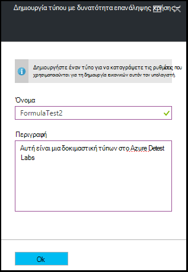

<properties
    pageTitle="Διαχείριση τύπων στο Azure Labs DevTest για να δημιουργήσετε ΣΠΣ | Microsoft Azure"
    description="Μάθετε πώς μπορείτε να δημιουργήσετε, ενημέρωση, και κατάργηση Azure DevTest Labs τύπους και χρησιμοποιήστε τα για να δημιουργήσετε νέα ΣΠΣ."
    services="devtest-lab,virtual-machines"
    documentationCenter="na"
    authors="tomarcher"
    manager="douge"
    editor=""/>

<tags
    ms.service="devtest-lab"
    ms.workload="na"
    ms.tgt_pltfrm="na"
    ms.devlang="na"
    ms.topic="article"
    ms.date="08/30/2016"
    ms.author="tarcher"/>

# Διαχείριση τύπων DevTest Labs για να δημιουργήσετε ΣΠΣ

Ένας τύπος σε Azure DevTest Labs είναι μια λίστα με προεπιλεγμένες τιμές ιδιοτήτων που χρησιμοποιούνται για να δημιουργήσετε μια εικονική μηχανή (Εικονική). Όταν δημιουργείτε μια Εικονική από έναν τύπο, οι προεπιλεγμένες τιμές μπορούν να χρησιμοποιηθούν ως- ή να τροποποιηθεί. Όπως [προσαρμοσμένες εικόνες](./devtest-lab-create-template.md) και [εικόνες Marketplace](./devtest-lab-configure-marketplace-images.md), τύπους παρέχουν ένα μηχανισμό για γρήγορη παροχή Εικονική.  

Σε αυτό το άρθρο, θα μάθετε πώς να εκτελείτε τις ακόλουθες εργασίες:

- [Δημιουργία ενός τύπου](#create-a-formula)
- [Χρήση τύπου για την παροχή μια εικονική Μηχανή](#use-a-formula-to-provision-a-vm)
- [Τροποποίηση τύπου](#modify-a-formula)
- [Διαγραφή τύπου](#delete-a-formula)

> [AZURE.NOTE] Τύποι - όπως [προσαρμοσμένες εικόνες](./devtest-lab-create-template.md) - σάς επιτρέπουν να δημιουργήσετε μια βασική εικόνα από αρχείο VHD. Τη βασική εικόνα, στη συνέχεια, μπορεί να χρησιμοποιηθεί για την παροχή του μια νέα Εικονική. Για να αποφασίσετε ποιο είναι κατάλληλο για το συγκεκριμένο περιβάλλον, ανατρέξτε στο άρθρο, [προσαρμοσμένες εικόνες σύγκριση και τύπους στο DevTest Labs](./devtest-lab-comparing-vm-base-image-types.md).

## Δημιουργία ενός τύπου
Οποιοσδήποτε χρήστης με δικαιώματα DevTest Labs *χρήστες* είναι μπορούν να δημιουργούν ΣΠΣ χρησιμοποιώντας έναν τύπο ως βάση. Υπάρχουν δύο τρόποι για να δημιουργήσετε τύπους: 

- Από μια βάση - Χρησιμοποιήστε όταν θέλετε να ορίσετε όλα τα χαρακτηριστικά του τύπου.
- Από μια υπάρχουσα εργαστήριο Εικονική - Χρησιμοποιήστε όταν θέλετε να δημιουργήσετε έναν τύπο με βάση τις ρυθμίσεις του υπάρχοντος Εικονική μηχανή.

### Δημιουργία ενός τύπου από μια βάση
Ακολουθήστε τα παρακάτω βήματα σας καθοδηγήσει στη διαδικασία δημιουργίας ενός τύπου από μια προσαρμοσμένη εικόνα, εικόνα Marketplace ή έναν άλλο τύπο.

1. Είσοδος στην [πύλη του Azure](http://go.microsoft.com/fwlink/p/?LinkID=525040).

1. Επιλέξτε **Περισσότερες υπηρεσίες**και, στη συνέχεια, επιλέξτε **DevTest Labs** από τη λίστα.

1. Από τη λίστα των labs, επιλέξτε το επιθυμητό εργαστήριο.  

1. Στην blade το εργαστήριο, επιλέξτε **τους τύπους (με δυνατότητα επανάληψης χρήσης βάσεις)**.

    

1. Στην το blade **εργαστήριο τύπους** , επιλέξτε **+ Add**.

    

1. Στην την **επιλογή μια βάση** blade, επιλέξτε τη βάση (προσαρμοσμένης εικόνας, εικόνα Marketplace ή τύπο) από την οποία θέλετε να δημιουργήσετε τον τύπο.

    

1. Στην τη **Δημιουργία τύπου** blade, καθορίστε τις ακόλουθες τιμές:

    - **Όνομα του τύπου** - πληκτρολογήστε ένα όνομα για τον τύπο σας. Αυτή η τιμή θα είναι εμφανίζεται στη λίστα βάσης εικόνων όταν δημιουργείτε μια Εικονική. Το όνομα είναι επικύρωση καθώς πληκτρολογείτε και αν δεν είναι έγκυρο, ένα μήνυμα αναφέρει τις απαιτήσεις για ένα έγκυρο όνομα.
    - **Περιγραφή** - πληκτρολογήστε μια χαρακτηριστική περιγραφή για τον τύπο σας. Αυτή η τιμή είναι διαθέσιμη από το μενού περιβάλλοντος του τύπου όταν δημιουργείτε μια Εικονική.
    - **Όνομα χρήστη** - πληκτρολογήστε ένα όνομα χρήστη που θα εκχωρηθούν δικαιώματα διαχειριστή.
    - **Κωδικός πρόσβασης** - πληκτρολογήστε - ή επιλέξτε από την αναπτυσσόμενη λίστα - μια τιμή που είναι συσχετισμένη με το μυστικό (κωδικός πρόσβασης) που θέλετε να χρησιμοποιήσετε για το συγκεκριμένο χρήστη.  
    - **Εικόνα** - αυτό το πεδίο εμφανίζει το όνομα του τη βασική εικόνα που έχετε επιλέξει στην την προηγούμενη blade. 
    - **Εικονική μηχανή μέγεθος** - επιλέξτε ένα από τα προκαθορισμένα στοιχεία που καθορίζουν το πυρήνων επεξεργαστή, το μέγεθος RAM και το μέγεθος μονάδα σκληρού δίσκου του η Εικονική για να δημιουργήσετε.
    - **Εικονική δικτύου** - Καθορίστε την επιθυμητή εικονικού δικτύου.
    - **Υποδικτύου** - Καθορίστε το επιθυμητό υποδίκτυο.
    - **Δημόσια διεύθυνση IP** - εάν η πολιτική εργαστήριο έχει ρυθμιστεί για να επιτρέψετε δημόσιων διευθύνσεων IP για το επιλεγμένο υποδίκτυο, καθορίστε εάν θέλετε η διεύθυνση IP για να είναι δημόσια, επιλέγοντας **Ναι** ή **όχι**. Διαφορετικά, αυτή η επιλογή είναι απενεργοποιημένη και να επιλέξει ως **όχι**.
    - **Αντικείμενα** - επιλέξτε και ρυθμίστε τα αντικείμενα που θέλετε να προσθέσετε τη βασική εικόνα. Ασφαλής συμβολοσειρά τιμές δεν αποθηκεύονται με τον τύπο. Επομένως, δεν εμφανίζονται παράμετροι αντικείμενο που είναι ασφαλής συμβολοσειρές. 

        

1. Επιλέξτε **Δημιουργία** για να δημιουργήσετε τον τύπο.

### Δημιουργία ενός τύπου από μια εικονική Μηχανή
Ακολουθήστε τα παρακάτω βήματα σας καθοδηγήσει στη διαδικασία δημιουργίας ενός τύπου που βασίζεται σε μια υπάρχουσα Εικονική. 

> [AZURE.NOTE] Για να δημιουργήσετε έναν τύπο από μια Εικονική, η Εικονική πρέπει να έχουν δημιουργηθεί μετά από 30 Μαρτίου 2016. 

1. Είσοδος στην [πύλη του Azure](http://go.microsoft.com/fwlink/p/?LinkID=525040).

1. Επιλέξτε **Περισσότερες υπηρεσίες**και, στη συνέχεια, επιλέξτε **DevTest Labs** από τη λίστα.

1. Από τη λίστα των labs, επιλέξτε το επιθυμητό εργαστήριο.  

1. Στην **Επισκόπηση** blade το εργαστήριο, επιλέξτε την εικονική Μηχανή από την οποία θέλετε να δημιουργήσετε τον τύπο.

    

1. Στην την εικονική Μηχανή blade, επιλέξτε **Δημιουργία τύπου (βάση με δυνατότητα επανάληψης χρήσης)**.

    

1. Στην blade τη **Δημιουργία τύπων** , πληκτρολογήστε ένα **όνομα** και μια **Περιγραφή** για τον νέο τύπο.

    

1. Επιλέξτε **OK** για να δημιουργήσετε τον τύπο.

## Χρήση τύπου για την παροχή μια εικονική Μηχανή
Αφού έχετε δημιουργήσει έναν τύπο, μπορείτε να δημιουργήσετε μια Εικονική που βασίζεται σε αυτόν τον τύπο. Στην ενότητα [Προσθήκη μια Εικονική με αντικείμενα](devtest-lab-add-vm-with-artifacts.md#add-a-vm-with-artifacts) σάς καθοδηγεί κατά τη διαδικασία.

## Τροποποίηση τύπου
Για να τροποποιήσετε έναν τύπο, ακολουθήστε τα παρακάτω βήματα:

1. Είσοδος στην [πύλη του Azure](http://go.microsoft.com/fwlink/p/?LinkID=525040).

1. Επιλέξτε **Περισσότερες υπηρεσίες**και, στη συνέχεια, επιλέξτε **DevTest Labs** από τη λίστα.

1. Από τη λίστα των labs, επιλέξτε το επιθυμητό εργαστήριο.  

1. Στην blade το εργαστήριο, επιλέξτε **τους τύπους (με δυνατότητα επανάληψης χρήσης βάσεις)**.

    

1. Στην το blade **εργαστήριο τύπους** , επιλέξτε τον τύπο που θέλετε να τροποποιήσετε.

1. Στην blade **Ενημέρωση τύπων** , πραγματοποιήστε τις επιθυμητές αλλαγές και επιλέξτε **Ενημέρωση**.

## Διαγραφή τύπου 
Για να διαγράψετε έναν τύπο, ακολουθήστε τα παρακάτω βήματα:

1. Είσοδος στην [πύλη του Azure](http://go.microsoft.com/fwlink/p/?LinkID=525040).

1. Επιλέξτε **Περισσότερες υπηρεσίες**και, στη συνέχεια, επιλέξτε **DevTest Labs** από τη λίστα.

1. Από τη λίστα των labs, επιλέξτε το επιθυμητό εργαστήριο.  

1. Στην το blade **Ρυθμίσεις** εργαστήριο, επιλέξτε **τους τύπους**.

    

1. Στην το blade **εργαστήριο τύπους** , επιλέξτε τα αποσιωπητικά στα δεξιά του τύπου που θέλετε να διαγράψετε.

    

1. Στο μενού περιβάλλοντος του τύπου, επιλέξτε **Διαγραφή**.

    

1. Επιλέξτε **Ναι** στο παράθυρο διαλόγου επιβεβαίωσης διαγραφής.

[AZURE.INCLUDE [devtest-lab-try-it-out](../../includes/devtest-lab-try-it-out.md)]

## Σχετικές ιστολογίου

- [Προσαρμοσμένες εικόνες ή τύπους;](https://blogs.msdn.microsoft.com/devtestlab/2016/04/06/custom-images-or-formulas/)

## Επόμενα βήματα
Αφού δημιουργήσετε έναν τύπο για χρήση κατά τη δημιουργία μια Εικονική, το επόμενο βήμα είναι να [προσθέσετε μια Εικονική σε εργαστήριο σας](./devtest-lab-add-vm-with-artifacts.md).