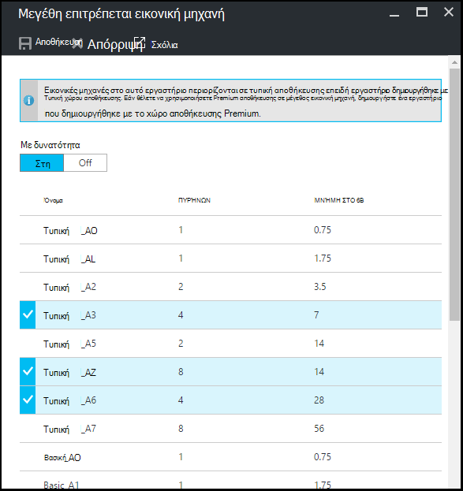

<properties
    pageTitle="Ορισμός πολιτικών εργαστήριο στο Azure DevTest Labs | Microsoft Azure"
    description="Μάθετε πώς μπορείτε να ορίσετε πολιτικές εργαστήριο όπως μεγέθη Εικονική, μέγιστο ΣΠΣ ανά χρήστη και τον τερματισμό αυτοματισμού."
    services="devtest-lab,virtual-machines"
    documentationCenter="na"
    authors="tomarcher"
    manager="douge"
    editor=""/>

<tags
    ms.service="devtest-lab"
    ms.workload="na"
    ms.tgt_pltfrm="na"
    ms.devlang="na"
    ms.topic="article"
    ms.date="09/12/2016"
    ms.author="tarcher"/>

# Ορισμός πολιτικών εργαστήριο σε Azure DevTest Labs

> [AZURE.VIDEO how-to-set-vm-policies-in-a-devtest-lab]

Azure DevTest Labs σάς επιτρέπει να καθορίσετε πολιτικές κλειδιού που σας βοηθούν να ελέγχετε κόστους και να ελαχιστοποιήσετε απορρίμματα σε labs σας. Οι πολιτικές αυτές εργαστήριο περιλαμβάνουν τον μέγιστο αριθμό ΣΠΣ δημιουργήθηκε ανά χρήστη και ανά εργαστήριο, και τις διάφορες επιλογές αυτόματης τερματισμού και αυτόματης έναρξης. 

## Πρόσβαση σε ένα εργαστήριο πολιτικές στο Azure DevTest Labs

Ακολουθήστε τα παρακάτω βήματα σας καθοδηγήσει στη ρύθμιση πολιτικών για ένα εργαστήριο στο Azure DevTest Labs:

Για να προβάλετε (και αλλαγή) τις πολιτικές για ένα εργαστήριο, ακολουθήστε τα παρακάτω βήματα:

1. Είσοδος στην [πύλη του Azure](http://go.microsoft.com/fwlink/p/?LinkID=525040).

1. Επιλέξτε **περισσότερες υπηρεσίες**και, στη συνέχεια, επιλέξτε **DevTest Labs** από τη λίστα.

1. Από τη λίστα των labs, επιλέξτε το επιθυμητό εργαστήριο.   

1. Επιλέξτε **ρυθμίσεις πολιτικής**.

1. Το blade **ρυθμίσεις πολιτικής** περιέχει ένα μενού με ρυθμίσεις που μπορείτε να καθορίσετε: 

    

    Για να μάθετε περισσότερα σχετικά με τη ρύθμιση μιας πολιτικής, επιλέξτε την από την παρακάτω λίστα:

    - [Μεγέθη εικονική μηχανή επιτρεπόμενων](#set-allowed-virtual-machine-sizes) - επιλέξτε τη λίστα των Εικονική μεγέθη επιτρέπεται στο εργαστήριο. Ένας χρήστης μπορεί να δημιουργήσει ΣΠΣ μόνο από αυτήν τη λίστα.

    - [Εικονικές μηχανές ανά χρήστη](#set-virtual-machines-per-user) - Καθορίστε τον μέγιστο αριθμό ΣΠΣ που μπορεί να δημιουργηθεί από το χρήστη. 

    - [Εικονικές μηχανές ανά εργαστήριο](#set-virtual-machines-per-lab) - Καθορίστε τον μέγιστο αριθμό ΣΠΣ που μπορούν να δημιουργηθούν για ένα εργαστήριο. 

    - [Αυτόματη τερματισμού](#set-auto-shutdown) - καθορίσετε το χρονικό διάστημα κατά το τρέχον εργαστήριο του ΣΠΣ τερματίζονται αυτόματα.

    - [Αυτόματη έναρξη](#set-auto-start) - καθορίσετε το χρονικό διάστημα κατά το τρέχον εργαστήριο ΣΠΣ αυτόματη εκκίνηση του.

## Ορισμός επιτρέπεται μεγέθη εικονικού υπολογιστή

Η πολιτική για τη ρύθμιση τα μεγέθη των επιτρεπόμενων Εικονική σάς βοηθά να ελαχιστοποιήσετε απορρίμματα εργαστήριο, δίνοντάς σας για να καθορίσετε ποια μεγέθη Εικονική επιτρέπονται στο εργαστήριο. Εάν αυτή η πολιτική είναι ενεργοποιημένη, μπορεί να χρησιμοποιηθεί μόνο τα μεγέθη Εικονική από αυτήν τη λίστα για να δημιουργήσετε ΣΠΣ.

1. Στην blade **ρυθμίσεις πολιτικής** του εργαστήριο, επιλέξτε **επιτρεπόμενων εικονικές μηχανές μεγέθη**.

    
 
1. Επιλέξτε **σε** για να ενεργοποιήσετε αυτήν την πολιτική και **Απενεργοποίηση** για να την απενεργοποιήσετε.

1. Εάν ενεργοποιήσετε αυτήν την πολιτική, επιλέξτε ένα ή περισσότερα μεγέθη Εικονική που μπορούν να δημιουργηθούν σε εργαστήριο σας.

1. Επιλέξτε **Αποθήκευση**.

## Ορισμός εικονικές μηχανές ανά χρήστη

Η πολιτική για **εικονικές μηχανές ανά χρήστη** σάς επιτρέπει να καθορίσετε τον μέγιστο αριθμό ΣΠΣ που μπορούν να δημιουργηθούν από ένα μεμονωμένο χρήστη. Εάν ένας χρήστης προσπαθήσει να δημιουργήσετε μια Εικονική όταν ικανοποιείται το όριο χρηστών, ένα μήνυμα σφάλματος δηλώνει ότι δεν μπορεί να δημιουργηθεί η Εικονική. 

1. Στην blade **ρυθμίσεις πολιτικής** του εργαστήριο, επιλέξτε **εικονικές μηχανές ανά χρήστη**.

    

1. Επιλέξτε **σε** για να ενεργοποιήσετε αυτήν την πολιτική και **Απενεργοποίηση** για να την απενεργοποιήσετε.

1. Εάν ενεργοποιήσετε αυτήν την πολιτική, εισαγάγετε μια αριθμητική τιμή που υποδεικνύει ότι ο μέγιστος αριθμός των ΣΠΣ που μπορεί να δημιουργηθεί από το χρήστη. Εάν εισαγάγετε έναν αριθμό που δεν είναι έγκυρο, το περιβάλλον εργασίας Χρήστη εμφανίζει τον μέγιστο αριθμό που επιτρέπονται για αυτό το πεδίο.

1. Επιλέξτε **Αποθήκευση**.

## Ορισμός εικονικές μηχανές ανά εργαστήριο

Η πολιτική για **εικονικές μηχανές ανά εργαστήριο** σάς επιτρέπει να καθορίσετε τον μέγιστο αριθμό ΣΠΣ που μπορούν να δημιουργηθούν για το τρέχον εργαστήριο. Εάν ένας χρήστης προσπαθήσει να δημιουργήσετε μια Εικονική όταν ικανοποιείται το όριο εργαστήριο, ένα μήνυμα σφάλματος δηλώνει ότι δεν μπορεί να δημιουργηθεί η Εικονική. 

1. Στην blade **ρυθμίσεις πολιτικής** του εργαστήριο, επιλέξτε **εικονικές μηχανές ανά εργαστήριο**.

    

1. Επιλέξτε **σε** για να ενεργοποιήσετε αυτήν την πολιτική και **Απενεργοποίηση** για να την απενεργοποιήσετε.

1. Εάν ενεργοποιήσετε αυτήν την πολιτική, εισαγάγετε μια αριθμητική τιμή που υποδεικνύει ότι ο μέγιστος αριθμός των ΣΠΣ που μπορούν να δημιουργηθούν για το τρέχον εργαστήριο. Εάν εισαγάγετε έναν αριθμό που δεν είναι έγκυρο, το περιβάλλον εργασίας Χρήστη εμφανίζει τον μέγιστο αριθμό που επιτρέπονται για αυτό το πεδίο.

1. Επιλέξτε **Αποθήκευση**.

## Ορισμός αυτόματης-τερματισμού

Η πολιτική αυτόματης τερματισμού σάς βοηθά να ελαχιστοποιήσετε απορρίμματα εργαστήριο, επιτρέποντάς σας να καθορίσετε το χρονικό διάστημα που αυτό εργαστήριο ΣΠΣ τερματίζονται.

1. Στην blade **ρυθμίσεις πολιτικής** του εργαστήριο, επιλέξτε **Αυτόματη τερματισμού**.

    

1. Επιλέξτε **σε** για να ενεργοποιήσετε αυτήν την πολιτική και **Απενεργοποίηση** για να την απενεργοποιήσετε.

1. Εάν ενεργοποιήσετε αυτή την πολιτική, καθορίστε την τοπική ώρα για να τερματίσετε όλα ΣΠΣ στο τρέχον εργαστήριο.

1. Επιλέξτε **Αποθήκευση**.

1. Από προεπιλογή, μόλις ενεργοποιηθεί, αυτή η πολιτική ισχύει για όλα τα ΣΠΣ στο τρέχον εργαστήριο. Για να καταργήσετε αυτήν τη ρύθμιση από μια συγκεκριμένη Εικονική, ανοίξτε την εικονική Μηχανή blade και αλλάξτε τη ρύθμιση **αυτόματης τερματισμού** 

## Ορισμός αυτόματης έναρξης

Η πολιτική αυτόματης έναρξης σάς επιτρέπει να καθορίσετε πότε θα πρέπει να ξεκινήσει το ΣΠΣ στο τρέχον εργαστήριο.  

1. Στην blade **ρυθμίσεις πολιτικής** του εργαστήριο, επιλέξτε **αυτόματης έναρξης**.

    

1. Επιλέξτε **σε** για να ενεργοποιήσετε αυτήν την πολιτική και **Απενεργοποίηση** για να την απενεργοποιήσετε.

1. Εάν ενεργοποιήσετε αυτήν την πολιτική, καθορίστε την τοπική προγραμματισμένη ώρα έναρξης και τις ημέρες της εβδομάδας για την οποία ισχύει την ώρα. 

1. Επιλέξτε **Αποθήκευση**.

1. Μόλις ενεργοποιηθεί, αυτή η πολιτική δεν εφαρμόζεται αυτόματα σε οποιαδήποτε ΣΠΣ στο τρέχον εργαστήριο. Για να εφαρμόσετε αυτήν τη ρύθμιση σε μια συγκεκριμένη Εικονική, ανοίξτε την εικονική Μηχανή blade και αλλάξτε τη ρύθμιση της **αυτόματης έναρξης** 

[AZURE.INCLUDE [devtest-lab-try-it-out](../../includes/devtest-lab-try-it-out.md)]

## Επόμενα βήματα

Αφού οριστεί και εφαρμόσει τις διάφορες ρυθμίσεις πολιτικής Εικονική για σας εργαστήριο, εδώ θα βρείτε ορισμένα πράγματα που πρέπει να δοκιμάσετε Επόμενο:

- [Διαχείριση κόστους ρύθμιση παραμέτρων](./devtest-lab-configure-cost-management.md) - παρουσιάζει πώς μπορείτε να χρησιμοποιήσετε το γράφημα **Τάσης μηνιαίο κόστος εκτιμώμενη**  
Για να προβάλετε τον τρέχοντα μήνα του εκτιμώμενη κόστος-προς-ημερομηνία και το προβλεπόμενο κόστος τέλος του μήνα.
- [Δημιουργία προσαρμοσμένης εικόνας](./devtest-lab-create-template.md) - όταν δημιουργείτε μια Εικονική, μπορείτε να καθορίσετε μια βάση, η οποία μπορεί να είναι μια προσαρμοσμένη εικόνα ή μια εικόνα Marketplace. Σε αυτό το άρθρο παρουσιάζει τον τρόπο για να δημιουργήσετε μια προσαρμοσμένη εικόνα από αρχείο VHD.
- [Ρύθμιση παραμέτρων Marketplace εικόνες](./devtest-lab-configure-marketplace-images.md) - Azure DevTest Labs υποστηρίζει τη δημιουργία ΣΠΣ που βασίζονται σε εικόνες Azure Marketplace. Σε αυτό το άρθρο παρουσιάζει τον τρόπο για να προσδιορίσετε, αν υπάρχουν, μπορεί να είναι εικόνες Azure Marketplace χρησιμοποιείται κατά τη δημιουργία ΣΠΣ σε ένα εργαστήριο.
- [Δημιουργία μια Εικονική στα ένα εργαστήριο](./devtest-lab-add-vm-with-artifacts.md) - παρουσιάζει τον τρόπο για να δημιουργήσετε μια Εικονική από μια βασική εικόνα (είτε προσαρμοσμένη ή Marketplace), και τον τρόπο εργασίας με αντικείμενα σε Εικονική σας.
