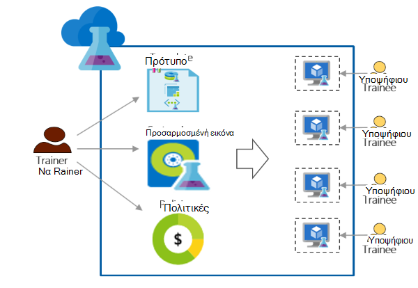

<properties
    pageTitle="Χρήση Azure DevTest Labs για την εκπαίδευση | Microsoft Azure"
    description="Μάθετε πώς να χρησιμοποιείτε Azure DevTest Labs για εκπαίδευση σενάρια."
    services="devtest-lab,virtual-machines"
    documentationCenter="na"
    authors="steved0x"
    manager="douge"
    editor=""/>

<tags
    ms.service="devtest-lab"
    ms.workload="na"
    ms.tgt_pltfrm="na"
    ms.devlang="na"
    ms.topic="article"
    ms.date="09/12/2016"
    ms.author="sdanie"/>

# Χρήση του Azure DevTest Labs για την εκπαίδευση

Azure DevTest Labs μπορεί να χρησιμοποιηθεί για την υλοποίηση πολλά βασικά σενάρια εκτός από την/έλεγχο. Ένα από αυτά τα σενάρια είναι για να ρυθμίσετε ένα εργαστήριο για την εκπαίδευση. Azure DevTest Labs σάς επιτρέπει να δημιουργήσετε ένα εργαστήριο όπου μπορείτε να παρέχετε προσαρμοσμένα πρότυπα που κάθε υποψήφιου να χρησιμοποιήσετε για να δημιουργήσετε πανομοιότυπες και απομόνωσης περιβάλλοντα για την εκπαίδευση. Μπορείτε να εξασφαλίσετε ότι περιβάλλοντα εκπαίδευση είναι διαθέσιμες σε κάθε υποψήφιου μόνο όταν τα χρειαστείτε και περιέχουν αρκετούς πόρους - όπως εικονικές μηχανές - απαιτείται για την εκπαίδευση. Τέλος, μπορείτε εύκολα να μοιραστείτε εργαστήριο με ασκουμένων, τα οποία μπορούν να έχουν πρόσβαση σε ένα μόνο κλικ.   

Azure DevTest Labs ικανοποιεί τις παρακάτω απαιτήσεις που απαιτούνται για τη διεξαγωγή εκπαίδευσης σε οποιαδήποτε εικονικό περιβάλλον: 

-   Ασκουμένων δεν μπορούν να δουν ΣΠΣ που έχουν δημιουργηθεί από άλλες ασκουμένων
-   Κάθε υπολογιστή εκπαίδευση πρέπει να είναι ταυτόσημες
-   Ασκουμένων μπορούν να προμηθεύσουν γρήγορα τα περιβάλλοντα εκπαίδευση
-   Στοιχείο ελέγχου κόστους, εξασφαλίζοντας ότι ασκουμένων δεν μπορούν να μεταβούν ΣΠΣ περισσότερες από αυτές που χρειάζονται για την εκπαίδευση και επίσης τερματισμού ΣΠΣ όταν δεν χρησιμοποιούν τους
-   Μοιραστείτε εύκολα εργαστήριο εκπαίδευση με κάθε υποψήφιου
-   Χρησιμοποιήσετε ξανά και ξανά εργαστήριο εκπαίδευσης

Σε αυτό το άρθρο, θα μάθετε σχετικά με τις διάφορες δυνατότητες Azure DevTest Labs που μπορούν να χρησιμοποιηθούν για να πληροί τις απαιτήσεις περιγράφεται παραπάνω εκπαίδευση και λεπτομερή βήματα που μπορείτε να ακολουθήσετε για να ρυθμίσετε ένα εργαστήριο για την εκπαίδευση.  

## Εφαρμογή εκπαίδευση με Azure DevTest Labs

1. **Δημιουργία εργαστήριο** 

    Labs είναι το σημείο έναρξης στο Azure DevTest Labs. Αφού δημιουργήσετε ένα εργαστήριο, μπορείτε να εκτελέσετε εργασίες όπως κατά την προσθήκη χρηστών (ασκουμένων) στο εργαστήριο, ορισμός πολιτικών για να ελέγξει το κόστος, ορισμός Εικονική εικόνες που μπορούν να δημιουργήσουν γρήγορα και πολλά άλλα.   

    Μάθετε περισσότερα, κάνοντας κλικ στις συνδέσεις στον παρακάτω πίνακα:

  	| Εργασία                                                            | Τι μάθατε                                                    |
|-----------------------------------------------------------------|----------------------------------------------------------------------|
| [Δημιουργήστε ένα εργαστήριο στο Azure DevTest Labs](devtest-lab-create-lab.md) | Μάθετε πώς μπορείτε να δημιουργήσετε ένα εργαστήριο στο Azure DevTest Labs στην πύλη του Azure. |

2. **Δημιουργία εκπαιδευτικού ΣΠΣ σε λεπτά με χρήση έτοιμων marketplace εικόνες και προσαρμοσμένες εικόνες** 
    
    Μπορείτε να επιλέξετε έτοιμων εικόνων από μια μεγάλη ποικιλία εικόνες από το Azure Marketplace και να είναι διαθέσιμα για το ασκουμένων στο εργαστήριο. Εάν οι έτοιμες εικόνες δεν πληροί τις απαιτήσεις σας, μπορείτε να δημιουργήσετε μια προσαρμοσμένη εικόνα, δημιουργώντας μια Εικονική με χρήση έτοιμων μια εικόνα από το Azure Marketplace, την εγκατάσταση του λογισμικού που χρειάζεστε για την εκπαίδευση και αποθηκεύοντας την εικονική Μηχανή ως προσαρμοσμένης εικόνας στο εργαστήριο εργαστήριο. 

    Μάθετε περισσότερα, κάνοντας κλικ στις συνδέσεις στον παρακάτω πίνακα:

  	| Εργασία                                                                              | Τι μάθατε                                                                                                                                  |
|-----------------------------------------------------------------------------------|-------------------------------------------------------------------------------------------------------------------------------------------------|
| [Ρύθμιση παραμέτρων εικόνες Azure Marketplace](devtest-lab-configure-marketplace-images.md) | Μάθετε πώς μπορείτε να whitelist εικόνες Azure Marketplace. διάθεση για την επιλογή μόνο τις εικόνες που θέλετε για την εκπαίδευση.                 |
| [Δημιουργία ενός προσαρμοσμένου ειδώλου](devtest-lab-create-template.md)                           | Δημιουργήσετε μια προσαρμοσμένη εικόνα, πριν από την εγκατάσταση του λογισμικού που χρειάζεστε για την εκπαίδευση, έτσι ώστε να ασκουμένων να δημιουργήσετε γρήγορα μια Εικονική χρησιμοποιώντας την προσαρμοσμένη εικόνα. |

3. **Δημιουργία προτύπων με δυνατότητα επανάληψης χρήσης για μηχανές εκπαίδευσης** 

    Ένας τύπος σε Azure DevTest Labs είναι μια λίστα με προεπιλεγμένες τιμές ιδιοτήτων που χρησιμοποιούνται για να δημιουργήσετε μια Εικονική. Μπορείτε να δημιουργήσετε έναν τύπο στο εργαστήριο, επιλέγοντας μια εικόνα, μια Εικονική μέγεθος (ένα συνδυασμό CPU και τη μνήμη RAM) και ένα εικονικό δίκτυο. Κάθε υποψήφιου μπορεί να δείτε τον τύπο στο εργαστήριο και να το χρησιμοποιήσετε για να δημιουργήσετε μια Εικονική. 

    Μάθετε περισσότερα, κάνοντας κλικ στις συνδέσεις στον παρακάτω πίνακα:

  	| Εργασία                                                                         | Τι μάθατε                                                                                                          |
|------------------------------------------------------------------------------|-------------------------------------------------------------------------------------------------------------------------|
| [Διαχείριση τύπων DevTest Labs για να δημιουργήσετε ΣΠΣ](devtest-lab-manage-formulas.md) | Μάθετε πώς μπορείτε να δημιουργήσετε έναν τύπο, επιλέγοντας μια εικόνα, Εικονική μέγεθος (συνδυασμό CPU και τη μνήμη RAM) και ένα εικονικό δίκτυο. |

4. **Στοιχείο ελέγχου κόστους**

    Azure DevTest Labs σάς επιτρέπει να ορίσετε μια πολιτική στο εργαστήριο για να καθορίσετε τον μέγιστο αριθμό ΣΠΣ που μπορούν να δημιουργηθούν με μια υποψήφιου στο εργαστήριο. 

    Εάν ξεκινήσει την εκπαίδευση πολλών ημερών και θέλετε να διακόψετε όλους του ΣΠΣ σε μια συγκεκριμένη χρονική στιγμή της ημέρας και, στη συνέχεια, αυτόματα επανεκκίνηση τους την επόμενη ημέρα, μπορείτε εύκολα εκπληρώσετε που ορίζοντας αυτόματη τερματισμού και πολιτικές στο εργαστήριο αυτόματης έναρξης. 

    Τέλος, όταν ολοκληρωθεί η εκπαίδευση μπορείτε να διαγράψετε όλα τα ΣΠΣ ταυτόχρονα, εκτελώντας μία δέσμη ενεργειών PowerShell. 

    Μάθετε περισσότερα, κάνοντας κλικ στις συνδέσεις στον παρακάτω πίνακα:

  	| Εργασία                                                                                                                                    | Τι μάθατε                                                      |
|-----------------------------------------------------------------------------------------------------------------------------------------|---------------------------------------------------------------------|
| [Ορίστε τις πολιτικές εργαστήριο](devtest-lab-set-lab-policy.md)                                                                                    | Ελέγχετε κόστους με τη ρύθμιση πολιτικών στο εργαστήριο.                       |
| [Διαγραφή όλων εργαστήριο ΣΠΣ χρησιμοποιώντας μια δέσμη ενεργειών PowerShell](devtest-lab-faq.md#how-can-i-automate-the-process-of-deleting-all-the-vms-in-my-lab) | Διαγράψτε όλα τα labs σε μια λειτουργία όταν ολοκληρωθεί η εκπαίδευση. |

5. **Κοινή χρήση εργαστήριο με κάθε υποψήφιου**

    Labs είναι δυνατή απευθείας πρόσβαση χρησιμοποιώντας μια σύνδεση που χρησιμοποιείτε από κοινού με ασκουμένων σας. Σας ασκουμένων ακόμα και δεν πρέπει να έχετε ένα λογαριασμό Azure, με την προϋπόθεση ότι έχουν ένα [λογαριασμό Microsoft που διαθέτετε](devtest-lab-faq.md#what-is-a-microsoft-account). Ασκουμένων δεν μπορεί να δείτε ΣΠΣ που έχουν δημιουργηθεί από άλλες ασκουμένων.  

    Μάθετε περισσότερα, κάνοντας κλικ στις συνδέσεις στον παρακάτω πίνακα:

  	| Εργασία                                                                                                                                | Τι μάθατε                                                   |
|-------------------------------------------------------------------------------------------------------------------------------------|------------------------------------------------------------------|
| [Προσθήκη ενός υποψήφιου σε ένα εργαστήριο στο Azure DevTest Labs](devtest-lab-add-devtest-user.md)                                                     | Χρησιμοποιήστε την πύλη του Azure για να προσθέσετε ασκουμένων εργαστήριο σας εκπαίδευσης.       |
| [Προσθήκη ασκουμένων εργαστήριο χρησιμοποιώντας μια δέσμη ενεργειών PowerShell](devtest-lab-add-devtest-user.md#add-an-external-user-to-a-lab-using-powershell) | Χρήση του PowerShell για την αυτοματοποίηση προσθέτοντας ασκουμένων για να σας εργαστήριο εκπαίδευσης. |
| [Λάβετε μια σύνδεση προς το εργαστήριο](devtest-lab-faq.md#how-do-i-share-a-direct-link-to-my-lab)                                                  | Μάθετε πώς ένα εργαστήριο δυνατότητα απευθείας πρόσβασης μέσω μιας υπερ-σύνδεσης.        |

6. **Χρησιμοποιήσετε ξανά και ξανά εργαστήριο** 

    Μπορείτε να αυτοματοποιήσετε τη δημιουργία εργαστήριο, συμπεριλαμβανομένων των προσαρμοσμένων ρυθμίσεων, κατά τη δημιουργία ενός προτύπου για τη διαχείριση πόρων και η χρήση της για να δημιουργήσετε πανομοιότυπες labs ξανά και ξανά. 

    Μάθετε περισσότερα, κάνοντας κλικ στις συνδέσεις στον παρακάτω πίνακα:

  	| Εργασία                                                                                                                               | Τι μάθατε                                                      |
|------------------------------------------------------------------------------------------------------------------------------------|---------------------------------------------------------------------|
| [Δημιουργήστε ένα εργαστήριο χρησιμοποιώντας ένα πρότυπο από διαχειριστή πόρων](devtest-lab-faq.md#how-do-i-create-a-lab-from-an-azure-resource-manager-template) | Δημιουργία labs στο Azure DevTest Labs με τη χρήση προτύπων από διαχειριστή πόρων. |

[AZURE.INCLUDE [devtest-lab-try-it-out](../../includes/devtest-lab-try-it-out.md)]  

