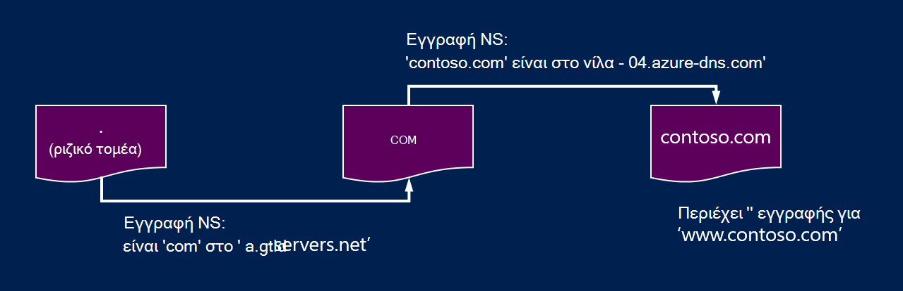
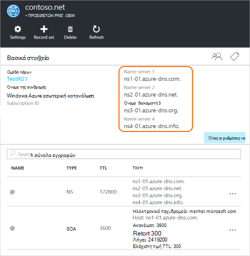

<properties
   pageTitle="Ανάθεση του τομέα σας στο Azure DNS | Microsoft Azure"
   description="Για να κατανοήσετε τον τρόπο αλλαγής ανάθεση τομέα και να χρησιμοποιήσετε τους διακομιστές ονομάτων Azure DNS για την παροχή φιλοξενίας τομέα."
   services="dns"
   documentationCenter="na"
   authors="sdwheeler"
   manager="carmonm"
   editor=""/>

<tags
   ms.service="dns"
   ms.devlang="na"
   ms.topic="get-started-article"
   ms.tgt_pltfrm="na"
   ms.workload="infrastructure-services"
   ms.date="06/30/2016"
   ms.author="sewhee"/>

# Πληρεξουσίου τομέα στο Azure DNS

Azure DNS σάς επιτρέπει να φιλοξενήσετε μια ζώνη DNS και να διαχειριστείτε τις εγγραφές DNS για έναν τομέα στο Azure. Με τη σειρά για ερωτήματα DNS για έναν τομέα για την επίτευξη Azure DNS, ο τομέας έχει να ανατεθεί σε Azure DNS από το γονικό τομέα. Λάβετε υπόψη σας Azure DNS δεν είναι το μητρώο καταχώρησης ονομάτων τομέων. Σε αυτό το άρθρο εξηγεί πώς λειτουργεί η ανάθεση τομέα και πώς μπορείτε να αναθέσετε τομείς σε Azure DNS.

## Πώς λειτουργεί η ανάθεση DNS

### Τομείς και ζώνες

Το σύστημα όνομα τομέα είναι μια ιεραρχία από τους τομείς. Ξεκινά την ιεραρχία από τον τομέα 'ρίζας', του οποίου το όνομα είναι απλώς '**.**'.  Κάτω από αυτό προέρχονται τομείς ανώτατου επιπέδου, όπως 'com', 'κίνηση', 'Οργανόγραμμα', 'ΗΒ' ή 'ΞΡ'.  Κάτω από αυτές είναι οι τομείς δεύτερου επιπέδου, όπως 'org.uk' ή 'co.jp'.  Και ούτω καθεξής. Οι τομείς στην ιεραρχία DNS φιλοξενούνται χρησιμοποιώντας ξεχωριστές ζώνες DNS. Καθολικά διανέμονται αυτές τις ζώνες, φιλοξενούνται από τους διακομιστές ονομάτων DNS όλο τον κόσμο.

**Ζώνη DNS**

Ο τομέας είναι ένα μοναδικό όνομα στο του συστήματος ονομάτων τομέα, για παράδειγμα 'contoso.com'. Μια ζώνη DNS χρησιμοποιείται για τη φιλοξενία τις εγγραφές DNS για έναν συγκεκριμένο τομέα. Για παράδειγμα, ο τομέας «contoso.com» μπορεί να περιέχει έναν αριθμό των εγγραφών DNS όπως 'mail.contoso.com' (για το διακομιστή ηλεκτρονικού ταχυδρομείου) και 'www.contoso.com' (για μια τοποθεσία Web).

**Μητρώο καταχώρησης ονομάτων τομέων**

Ένα μητρώο καταχώρησης ονομάτων τομέων είναι μια εταιρεία που μπορούν να παρέχουν ονόματα τομέα στο Internet. Αυτά θα επαληθεύσετε εάν τον τομέα Internet που θέλετε να χρησιμοποιήσετε είναι διαθέσιμη και σας επιτρέπει να το αγοράσετε. Αφού το όνομα τομέα έχει καταχωρηθεί, θα τον κάτοχο της νομικό για το όνομα τομέα. Εάν έχετε ήδη έναν τομέα Internet, θα μπορείτε να χρησιμοποιήσετε το τρέχον μητρώο καταχώρησης ονομάτων τομέων για να αναθέσετε σε Azure DNS.

>[AZURE.NOTE] Για να μάθετε περισσότερες πληροφορίες σε ποιος είναι ο κάτοχος ένα όνομα που δίνεται τομέα ή για πληροφορίες σχετικά με το πώς μπορείτε να αγοράσετε έναν τομέα, ανατρέξτε στο θέμα [Διαχείριση τομέα Internet στο Azure AD](https://msdn.microsoft.com/library/azure/hh969248.aspx).

### Ανάλυση και ανάθεση

Υπάρχουν δύο τύποι των διακομιστών DNS:

- Ένας _έγκυρος_ διακομιστής DNS φιλοξενεί ζώνες DNS. Το παρέχει απαντήσεις σε ερωτήματα DNS για εγγραφές σε αυτές τις ζώνες μόνο.
- Διακομιστής DNS _επαναλαμβανόμενες_ δεν φιλοξενεί ζώνες DNS. Το απαντά σε όλα τα ερωτήματα DNS, καλώντας έγκυρων διακομιστές DNS για να συγκεντρώσετε τα δεδομένα που χρειάζεται.

>[AZURE.NOTE] Azure DNS παρέχει μια υπηρεσία έγκυρων DNS.  Δεν παρέχει μια υπηρεσία DNS περιοδικότητας.

> Υπηρεσίες cloud και ΣΠΣ στο Azure ρυθμίζονται αυτόματα για να χρησιμοποιήσετε μια υπηρεσίες DNS περιοδικότητας που παρέχονται ξεχωριστά ως μέρος της υποδομής του Azure.  Για πληροφορίες σχετικά με τον τρόπο για να αλλάξετε αυτές τις ρυθμίσεις DNS, ανατρέξτε στο θέμα [Επίλυση ονομάτων στο Azure](../virtual-network/virtual-networks-name-resolution-for-vms-and-role-instances.md#name-resolution-using-your-own-dns-server).

Προγράμματα-πελάτες DNS σε PC ή κινητές συσκευές κλήση συνήθως μια επαναλαμβανόμενη διακομιστή DNS για να εκτελέσετε οποιαδήποτε ερωτήματα DNS που χρειάζονται οι εφαρμογές προγράμματος-πελάτη.

Όταν ένα διακομιστή DNS επαναλαμβανόμενες λαμβάνει ένα ερώτημα για μια εγγραφή DNS, όπως 'www.contoso.com', πρέπει πρώτα να βρείτε το όνομα του διακομιστή που φιλοξενεί τη ζώνη για τον τομέα 'contoso.com'. Για να το κάνετε αυτό, το ξεκινά από τους διακομιστές ονομάτων του ριζικού και από εκεί βρίσκει όνομα διακομιστές που φιλοξενούν τη ζώνη 'com'. Το ερώτημα, στη συνέχεια, τους διακομιστές ονομάτων του 'com' για να βρείτε το όνομα διακομιστές που φιλοξενούν τη ζώνη 'contoso.com'.  Τέλος, είναι μπορούν να ερωτήματος αυτών των διακομιστών ονομάτων για 'www.contoso.com'.

Αυτή η διαδικασία ονομάζεται επίλυση του ονόματος DNS. Στην πραγματικότητα, επίλυσης DNS περιλαμβάνει τα επιπλέον βήματα όπως παρακάτω CNAMEs, αλλά που δεν είναι σημαντικό να Κατανόηση πώς λειτουργεί η ανάθεση DNS.

Πώς μια ζώνη γονικού 'οδηγεί' τους διακομιστές ονομάτων για μια ζώνη θυγατρικό; Αυτό γίνεται με έναν ειδικό τύπο εγγραφής DNS που ονομάζεται εγγραφή NS (NS πόδι 'όνομα διακομιστή'). Για παράδειγμα, η ριζική ζώνη περιέχει τις εγγραφές NS για 'com' και εμφανίζει τους διακομιστές ονομάτων για τη ζώνη 'com'. Με τη σειρά της ζώνης 'com' περιέχει τις εγγραφές NS για 'contoso.com', η οποία εμφανίζει τους διακομιστές ονομάτων για τη ζώνη 'contoso.com'. Ρύθμιση των εγγραφών NS για μια ζώνη θυγατρικό σε μια ζώνη γονικό ονομάζεται ανάθεση του τομέα.

Κάθε ανάθεση έχει στην πραγματικότητα δύο αντίγραφα των εγγραφών NS; μία στη γονική ζώνη, που δείχνει το παιδί, και μια άλλη στη ζώνη θυγατρικό ίδια. Η 'contoso.com' ζώνη περιέχει τις εγγραφές NS για 'contoso.com' (εκτός από τις εγγραφές NS στο 'com'). Αυτά τα πεδία ονομάζονται έγκυρων τις εγγραφές NS και τους καθίσετε στην κορυφή της ζώνης θυγατρικό.

## Ανάθεση τομέα στο Azure DNS

Αφού δημιουργήσετε τη ζώνη DNS σε Azure DNS, πρέπει να ρυθμίσετε τις εγγραφές NS στη γονική ζώνη, για να κάνετε Azure DNS της έγκυρων προέλευσης για την επίλυση ονομάτων για τη ζώνη. Για τους τομείς που έχουν αγοράσει από ένα μητρώο καταχώρησης ονομάτων τομέων, μητρώο θα προσφέρει την επιλογή για να ρυθμίσετε αυτές τις εγγραφές NS.

>[AZURE.NOTE] Δεν χρειάζεται να κάτοχος ενός τομέα για να δημιουργήσετε μια ζώνη DNS με το συγκεκριμένο όνομα τομέα στο Azure DNS. Ωστόσο, πρέπει να ο κάτοχος του τομέα για να ρυθμίσετε την ανάθεση σε Azure DNS με το μητρώο καταχώρησης ονομάτων τομέων.

Για παράδειγμα, ας υποθέσουμε ότι αγοράσετε τον τομέα 'contoso.com' και να δημιουργήσετε μια ζώνη με το όνομα "contoso.com στο Azure DNS. Ως κάτοχος του τομέα, μητρώο θα προσφέρει την επιλογή για να ρυθμίσετε τις παραμέτρους των διευθύνσεων διακομιστή ονομάτων (δηλαδή, τις εγγραφές NS) για τον τομέα σας. Το μητρώο καταχώρησης ονομάτων τομέων θα αποθηκεύσει αυτές τις εγγραφές NS στο γονικό τομέα, σε αυτήν την περίπτωση '.com'. Προγράμματα-πελάτες όλο τον κόσμο, στη συνέχεια, θα κατευθύνεται για τον τομέα σας στο ζώνης Azure DNS όταν προσπαθείτε να επιλύσετε τις εγγραφές DNS σε 'contoso.com'.

### Μπορείτε να βρείτε τα ονόματα των διακομιστών ονομάτων

Πριν να αναθέσετε τη ζώνη DNS σε Azure DNS, πρέπει πρώτα να γνωρίζετε τα ονόματα των διακομιστών ονομάτων για τη ζώνη. Azure DNS εκχωρεί τους διακομιστές ονομάτων από ένα χώρο συγκέντρωσης κάθε φορά που δημιουργείται μια ζώνη.

Ο ευκολότερος τρόπος για να δείτε τους διακομιστές ονομάτων που έχουν εκχωρηθεί σε ζώνη σας είναι μέσω της πύλης Azure.  Σε αυτό το παράδειγμα, τη ζώνη 'contoso.net' έχει αντιστοιχιστεί τους διακομιστές ονομάτων ' ns1-01.azure-dns.com', 'ns2 01.azure dns .net', ' ns3-01.azure-dns.org', και ' ns4-01.azure-dns.info':

 

Azure DNS δημιουργεί αυτόματα έγκυρων τις εγγραφές NS της ζώνης που περιέχει τους διακομιστές ονομάτων που του έχουν ανατεθεί.  Για να δείτε τα ονόματα των διακομιστών ονομάτων μέσω του PowerShell Azure ή Azure CLI, πρέπει απλώς να ανακτήσετε αυτών των εγγραφών.

Χρήση του Azure PowerShell, τις εγγραφές NS έγκυρων μπορεί να ανακτηθεί ως εξής. Σημειώστε ότι το όνομα της καρτέλας “@” χρησιμοποιείται για να ανατρέξετε στις εγγραφές στην κορυφή της ζώνης.

    PS> $zone = Get-AzureRmDnsZone –Name contoso.net –ResourceGroupName MyResourceGroup
    PS> Get-AzureRmDnsRecordSet –Name “@” –RecordType NS –Zone $zone

    Name              : @
    ZoneName          : contoso.net
    ResourceGroupName : MyResourceGroup
    Ttl               : 3600
    Etag              : 5fe92e48-cc76-4912-a78c-7652d362ca18
    RecordType        : NS
    Records           : {ns1-01.azure-dns.com, ns2-01.azure-dns.net, ns3-01.azure-dns.org,
                        ns4-01.azure-dns.info}
    Tags              : {}

Μπορείτε επίσης να χρησιμοποιήσετε το CLI Azure πλατφόρμα για την ανάκτηση των εγγραφών NS έγκυρων και ως εκ τούτου Ανακαλύψτε τους διακομιστές ονομάτων που έχουν εκχωρηθεί σε της ζώνης:

    C:\> azure network dns record-set show MyResourceGroup contoso.net @ NS
    info:    Executing command network dns record-set show
        + Looking up the DNS Record Set "@" of type "NS"
    data:    Id                              : /subscriptions/.../resourceGroups/MyResourceGroup/providers/Microsoft.Network/dnszones/contoso.net/NS/@
    data:    Name                            : @
    data:    Type                            : Microsoft.Network/dnszones/NS
    data:    Location                        : global
    data:    TTL                             : 172800
    data:    NS records
    data:        Name server domain name     : ns1-01.azure-dns.com.
    data:        Name server domain name     : ns2-01.azure-dns.net.
    data:        Name server domain name     : ns3-01.azure-dns.org.
    data:        Name server domain name     : ns4-01.azure-dns.info.
    data:
    info:    network dns record-set show command OK

### Για να ρυθμίσετε ανάθεση

Κάθε μητρώο καταχώρησης ονομάτων τομέων περιλαμβάνει τα δικά τους εργαλεία διαχείρισης DNS για να αλλάξετε τις εγγραφές του διακομιστή ονομάτων για έναν τομέα. Στη σελίδα διαχείρισης DNS του μητρώου καταχώρησης τομέων, επεξεργαστείτε τις εγγραφές NS και αντικαταστήστε τις εγγραφές NS με αυτά που δημιουργήσατε Azure DNS.

Κατά την ανάθεση τομέα στο Azure DNS, πρέπει να χρησιμοποιήσετε τα ονόματα των διακομιστών ονομάτων που παρέχονται από Azure DNS.  Θα πρέπει να χρησιμοποιείτε πάντα όλα 4 όνομα διακομιστή ονομάτων, ανεξάρτητα από το όνομα του τομέα σας.  Ανάθεση τομέα δεν απαιτεί το όνομα του διακομιστή ονομάτων για να χρησιμοποιήσετε την ίδια τομέας ανώτατου επιπέδου ως τον τομέα σας.

Δεν πρέπει να χρησιμοποιείτε 'Επικόλληση εγγραφών' στην οποία θα οδηγεί το Azure όνομα DNS server διευθύνσεις IP, επειδή αυτές οι διευθύνσεις IP μπορεί να αλλάξει στο μέλλον. Αναθέσεις χρησιμοποιώντας ονόματα διακομιστών ονομάτων στη δική σας ζώνη, μερικές φορές ονομάζεται 'ματαιοδοξίας name servers', δεν υποστηρίζονται αυτήν τη στιγμή στο Azure DNS.

### Για να επαληθεύσετε επίλυση ονομάτων λειτουργεί

Μετά την ολοκλήρωση της ανάθεσης, μπορείτε να επαληθεύσετε ότι η επίλυση ονομάτων λειτουργεί, χρησιμοποιώντας ένα εργαλείο όπως 'nslookup' ερώτημα για την εγγραφή SOA για τη ζώνη (το οποίο επίσης δημιουργείται αυτόματα όταν δημιουργείται η ζώνη).

Σημειώστε ότι δεν χρειάζεται να καθορίσετε τους διακομιστές ονομάτων Azure DNS, επειδή η κανονική διαδικασία επίλυσης DNS θα εντοπίσει αυτόματα τους διακομιστές ονομάτων, εάν η ανάθεση έχει οριστεί σωστά.

    nslookup –type=SOA contoso.com

    Server: ns1-04.azure-dns.com
    Address: 208.76.47.4

    contoso.com
    primary name server = ns1-04.azure-dns.com
    responsible mail addr = msnhst.microsoft.com
    serial = 1
    refresh = 900 (15 mins)
    retry = 300 (5 mins)
    expire = 604800 (7 days)
    default TTL = 300 (5 mins)

## Ανάθεση υποτομείς στο Azure DNS

Εάν θέλετε να ρυθμίσετε ένα νέο θυγατρικό ζώνη, μπορείτε να αναθέσετε έναν δευτερεύοντα τομέα στο Azure DNS. Για παράδειγμα, χρειάζεται ρύθμιση και ανάθεση 'contoso.com' στο Azure DNS, ας υποθέσουμε ότι θέλετε να ρυθμίσετε ένα νέο θυγατρικό ζώνη, 'ο τομέας partners.contoso.com'.

Ρύθμιση ενός τομέα δευτερεύουσες ακολουθεί μια παρόμοια διαδικασία ως μια κανονική ανάθεση. Η μόνη διαφορά που βρίσκεται στο βήμα 3 τις εγγραφές NS πρέπει να δημιουργηθεί στη γονική ζώνη 'contoso.com' στο Azure DNS, αντί να τη ρυθμίσετε μέσω ένα μητρώο καταχώρησης ονομάτων τομέων.

1. Δημιουργήστε τη ζώνη θυγατρικό 'ο τομέας partners.contoso.com' στο Azure DNS.
2. Αναζήτηση τις έγκυρες εγγραφές NS στη ζώνη θυγατρικό για να αποκτήσετε όνομα διακομιστές που φιλοξενούν στη ζώνη θυγατρικό του Azure DNS.
3. Αναθέσετε τη ζώνη θυγατρικό ρυθμίζοντας τις εγγραφές NS στη γονική ζώνη, που δείχνει προς τη ζώνη θυγατρικό.

### Για να αναθέσετε έναν δευτερεύοντα τομέα

Το παρακάτω παράδειγμα PowerShell παρουσιάζει πώς λειτουργεί. Τα ίδια βήματα μπορεί να εκτελεστεί μέσω της πύλης Azure ή μέσω του CLI Azure πλατφόρμες.

#### Βήμα 1. Δημιουργήστε την γονικής και θυγατρικής ζώνες

Πρώτον, δημιουργούμε το γονικής και θυγατρικής ζώνες. Αυτά μπορεί να είναι στην ίδια ομάδα πόρων ή διαφορετικές ομάδες πόρων.

    $parent = New-AzureRmDnsZone -Name contoso.com -ResourceGroupName RG1
    $child = New-AzureRmDnsZone -Name partners.contoso.com -ResourceGroupName RG1

#### Βήμα 2. Εγγραφές NS ανάκτηση

Στη συνέχεια, θα σας ανακτήσει τις εγγραφές NS έγκυρων από θυγατρικό ζώνη, όπως φαίνεται στο επόμενο παράδειγμα.  Περιέχει τους διακομιστές ονομάτων που έχουν εκχωρηθεί στη ζώνη θυγατρικό.

    $child_ns_recordset = Get-AzureRmDnsRecordSet -Zone $child -Name "@" -RecordType NS

#### Βήμα 3. Στη ζώνη θυγατρικό πληρεξουσίου

Δημιουργία συνόλου στη γονική ζώνη, για να ολοκληρώσετε την ανάθεση αντίστοιχων εγγραφών NS. Σημειώστε ότι το όνομα του συνόλου εγγραφών στη γονική ζώνη συμφωνεί με το όνομα της ζώνης θυγατρικό, σε αυτήν την περίπτωση "Συνεργάτες".

    $parent_ns_recordset = New-AzureRmDnsRecordSet -Zone $parent -Name "partners" -RecordType NS -Ttl 3600
    $parent_ns_recordset.Records = $child_ns_recordset.Records
    Set-AzureRmDnsRecordSet -RecordSet $parent_ns_recordset

### Για να επαληθεύσετε επίλυση ονομάτων λειτουργεί

Μπορείτε να επαληθεύσετε ότι όλα τα στοιχεία έχει ρυθμιστεί σωστά αναζητώντας την εγγραφή SOA της ζώνης θυγατρικό.

    nslookup –type=SOA partners.contoso.com

    Server: ns1-08.azure-dns.com
    Address: 208.76.47.8

    partners.contoso.com
        primary name server = ns1-08.azure-dns.com
        responsible mail addr = msnhst.microsoft.com
        serial = 1
        refresh = 900 (15 mins)
        retry = 300 (5 mins)
        expire = 604800 (7 days)
        default TTL = 300 (5 mins)

## Επόμενα βήματα

[Διαχείριση ζώνες DNS](dns-operations-dnszones.md)

[Διαχείριση των εγγραφών DNS](dns-operations-recordsets.md)

