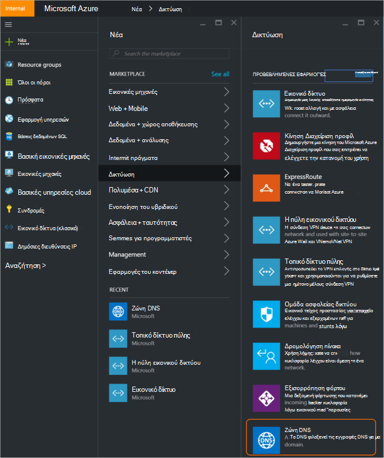
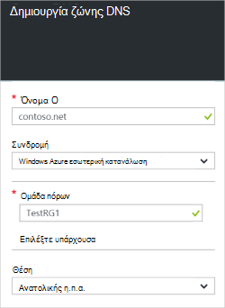
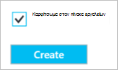
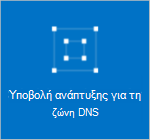
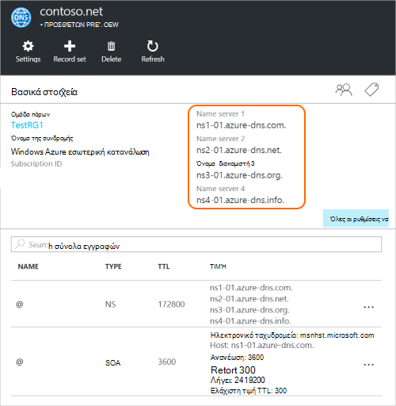
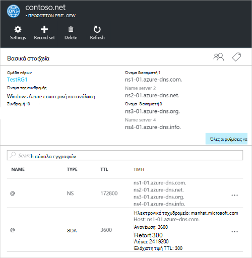

<properties
   pageTitle="Πώς μπορείτε να δημιουργήσετε και να διαχειριστείτε μια ζώνη DNS στην πύλη του Azure | Microsoft Azure"
   description="Μάθετε πώς μπορείτε να δημιουργήσετε ζώνες DNS για το Azure DNS. Πρόκειται για αναλυτικές οδηγίες για δημιουργία και διαχείριση DNS πρώτη και ξεκινήστε φιλοξενεί τον τομέα DNS με την πύλη Azure."
   services="dns"
   documentationCenter="na"
   authors="sdwheeler"
   manager="carmonm"
   editor=""
   tags="azure-resource-manager"/>

<tags
   ms.service="dns"
   ms.devlang="na"
   ms.topic="article"
   ms.tgt_pltfrm="na"
   ms.workload="infrastructure-services"
   ms.date="08/16/2016"
   ms.author="sewhee"/>

# Δημιουργήστε μια ζώνη DNS στην πύλη του Azure

> [AZURE.SELECTOR]
- [Πύλη του Azure](dns-getstarted-create-dnszone-portal.md)
- [PowerShell](dns-getstarted-create-dnszone.md)
- [Azure CLI](dns-getstarted-create-dnszone-cli.md)

Σε αυτό το άρθρο θα σας καθοδηγήσει τα βήματα για να δημιουργήσετε μια ζώνη DNS, χρησιμοποιώντας την πύλη του Azure. Μπορείτε επίσης να δημιουργήσετε μια ζώνη DNS με τη χρήση του PowerShell ή CLI.

[AZURE.INCLUDE [dns-create-zone-about](../../includes/dns-create-zone-about-include.md)]

### Πληροφορίες σχετικά με ετικέτες για Azure DNS

Ετικέτες είναι μια λίστα με ζεύγη ονόματος-τιμής και χρησιμοποιούνται από τη διαχείριση πόρων Azure με ετικέτα πόρους για σκοπούς χρέωσης ή ομαδοποίησης. Για περισσότερες πληροφορίες σχετικά με τις ετικέτες, ανατρέξτε στο άρθρο [Χρήση ετικετών για να οργανώσετε το Azure πόρους](../resource-group-using-tags.md).

Μπορείτε να προσθέσετε ετικέτες στην πύλη του Azure χρησιμοποιώντας το blade **ρυθμίσεων** για τη ζώνη DNS.

## Δημιουργήστε μια ζώνη DNS

1. Είσοδος στην πύλη του Azure

2. Στο μενού διανομέα, κάντε κλικ στην επιλογή και κάντε κλικ στην επιλογή **Δημιουργία > δίκτυο >** και, στη συνέχεια, κάντε κλικ στην επιλογή **ζώνης DNS** για να ανοίξετε το blade ζώνης DNS.

    

3. Στην το blade **ζώνης DNS** , κάντε κλικ στην επιλογή **Δημιουργία** στο κάτω μέρος. Αυτό θα ανοίξει το blade **ζώνη δημιουργία DNS** .

    

4. Στην blade τη **Δημιουργία DNS zone** , δώστε ένα όνομα της ζώνης DNS. Για παράδειγμα, *contoso.com*. Ανατρέξτε στο θέμα [Σχετικά με το DNS Zone ονόματα](#names) στην προηγούμενη ενότητα.

5. Στη συνέχεια, καθορίστε την ομάδα πόρων που θέλετε να χρησιμοποιήσετε. Μπορείτε να δημιουργήσετε μια νέα ομάδα πόρων, ή να επιλέξετε ένα που υπάρχει ήδη.

6. Από την αναπτυσσόμενη λίστα **θέση** , καθορίστε τη θέση της ομάδας πόρων. Σημειώστε ότι αυτή η ρύθμιση αναφέρεται στη θέση της ομάδας πόρων, όχι με τη θέση για τη ζώνη DNS. Η πραγματική πόρων ζώνης DNS είναι αυτόματα "Καθολικός" και δεν είναι κάτι που μπορείτε να (ή πρέπει να) καθορίστε στην πύλη.

7. Μπορείτε να αφήσετε το πλαίσιο ελέγχου **Pin στον πίνακα εργαλείων** επιλεγμένο, εάν θέλετε να εντοπίσετε εύκολα τη νέα ζώνη στον πίνακα εργαλείων σας. Στη συνέχεια, κάντε κλικ στην επιλογή **Δημιουργία**.

    

8. Αφού κάνετε κλικ στο κουμπί "Δημιουργία", θα δείτε τη νέα ζώνη που έχει ρυθμιστεί στον πίνακα εργαλείων.

    

9. Αφού δημιουργηθεί το νέο ζώνη, θα ανοίξει το blade για τη νέα ζώνη στον πίνακα εργαλείων.

## Προβολή εγγραφών

Δημιουργία μιας ζώνης DNS δημιουργεί επίσης οι ακόλουθες εγγραφές:

- Η καρτέλα "Έναρξη από αρχή έκδοσης πιστοποιητικών" (SOA). Το SOA υπάρχει στη ρίζα της κάθε ζώνης DNS.
- Το έγκυρων εγγραφές διακομιστή ονομάτων (NS). Αυτές εμφανίζουν ποιες όνομα διακομιστές που φιλοξενούν της ζώνης. Azure DNS χρησιμοποιεί ένα χώρο συγκέντρωσης των διακομιστών ονομάτων και επομένως διαφορετικούς διακομιστές ονομάτων μπορεί να εκχωρηθεί σε διαφορετικές ζώνες στο Azure DNS. Για περισσότερες πληροφορίες, ανατρέξτε στο θέμα [πληρεξουσίου τομέα στο Azure DNS](dns-domain-delegation.md) .

Μπορείτε να προβάλετε τις εγγραφές από την πύλη του Azure

1. Από το blade **ζώνης DNS** , κάντε κλικ σε **όλες τις ρυθμίσεις** για να ανοίξετε το **blade ρυθμίσεων** για τη ζώνη DNS.

    

2. Στο κάτω μέρος του παραθύρου Essentials, μπορείτε να δείτε ορίζει την εγγραφή για τη ζώνη DNS.

    

## Έλεγχος

Μπορείτε να ελέγξετε τη ζώνη DNS χρησιμοποιώντας DNS εργαλεία όπως το nslookup, Σκάψιμο ή το [cmdlet του PowerShell επίλυση DnsName](https://technet.microsoft.com/library/jj590781.aspx).

Εάν έχετε ακόμη δεν έχετε αναθέσει τον τομέα σας για να χρησιμοποιήσετε τη νέα ζώνη στο Azure DNS, θα πρέπει να κατευθύνει το ερώτημα DNS απευθείας σε έναν από τους διακομιστές ονομάτων για τη ζώνη. Τους διακομιστές ονομάτων για τη ζώνη παρέχονται στις εγγραφές NS, όπως αναφέρονται από `Get-AzureRmDnsRecordSet` παραπάνω. Βεβαιωθείτε ότι η substitute τις σωστές τιμές για τη ζώνη σε την παρακάτω εντολή.

    nslookup
    > set type=SOA
    > server ns1-01.azure-dns.com
    > contoso.com

    Server: ns1-01.azure-dns.com
    Address:  208.76.47.1

    contoso.com
            primary name server = ns1-01.azure-dns.com
            responsible mail addr = msnhst.microsoft.com
            serial  = 1
            refresh = 900 (15 mins)
            retry   = 300 (5 mins)
            expire  = 604800 (7 days)
            default TTL = 300 (5 mins)

## Διαγραφή μιας ζώνης DNS

Μπορείτε να διαγράψετε τη ζώνη DNS απευθείας από την πύλη. Πριν από τη διαγραφή μιας ζώνης DNS σε Azure DNS, θα πρέπει να διαγράψετε όλα τα σύνολα εγγραφών, με εξαίρεση τις εγγραφές NS και SOA στη ρίζα της ζώνης που δημιουργήθηκαν αυτόματα κατά τη δημιουργία της ζώνης.

1. Εντοπίστε το blade **ζώνης DNS** για τη ζώνη που θέλετε να διαγράψετε και, στη συνέχεια, κάντε κλικ στην επιλογή " **Διαγραφή** " στο επάνω μέρος του blade.

2. Θα εμφανιστεί ένα μήνυμα που σας ενημερώνει ότι πρέπει να διαγράψετε όλα τα σύνολα εγγραφών, εκτός από τις εγγραφές NS και SOA που έχουν δημιουργηθεί αυτόματα. Εάν έχετε διαγράψει τα σύνολα των εγγραφών σας, κάντε κλικ στο κουμπί **Ναι**. Σημειώστε ότι κατά τη διαγραφή μιας ζώνης DNS από την πύλη, την ομάδα πόρων που της ζώνης DNS είναι συσχετισμένη με το δεν θα διαγραφούν.

## Επόμενα βήματα

Αφού δημιουργήσετε μια ζώνη DNS, δημιουργήστε [σύνολα εγγραφής και εγγραφές](dns-getstarted-create-recordset-portal.md) για να ξεκινήσετε επίλυση ονομάτων για τον τομέα σας στο Internet.
