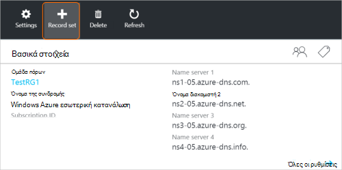
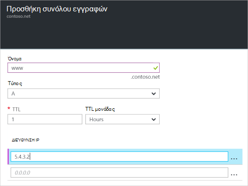

<properties
   pageTitle="Δημιουργήστε ένα σύνολο εγγραφών και εγγραφών για μια ζώνη DNS με την πύλη Azure | Microsoft Azure"
   description="Δημιουργία εγγραφών κεντρικού υπολογιστή για το Azure DNS και δημιουργία σύνολα εγγραφών και εγγραφές με την πύλη Azure"
   services="dns"
   documentationCenter="na"
   authors="sdwheeler"
   manager="carmonm"
   editor=""
   tags="azure-resource-manager"/>

<tags
   ms.service="dns"
   ms.devlang="na"
   ms.topic="article"
   ms.tgt_pltfrm="na"
   ms.workload="infrastructure-services"
   ms.date="08/16/2016"
   ms.author="sewhee"/>

# Δημιουργία σύνολα εγγραφών DNS και εγγραφές με την πύλη του Azure

> [AZURE.SELECTOR]
- [Πύλη του Azure](dns-getstarted-create-recordset-portal.md)
- [PowerShell](dns-getstarted-create-recordset.md)
- [Azure CLI](dns-getstarted-create-recordset-cli.md)

Σε αυτό το άρθρο σάς καθοδηγεί στη διαδικασία δημιουργίας εγγραφών και τα σύνολα εγγραφών χρησιμοποιώντας την πύλη του Azure. Μετά τη δημιουργία της ζώνης DNS, μπορείτε να προσθέσετε τις εγγραφές DNS για τον τομέα σας. Για να κάνετε αυτό, πρέπει πρώτα να κατανοήσετε τις εγγραφές DNS και σύνολα εγγραφών.

[AZURE.INCLUDE [dns-about-records-include](../../includes/dns-about-records-include.md)]

## Δημιουργήστε ένα σύνολο εγγραφών και εγγραφής

Το παρακάτω παράδειγμα σάς καθοδηγεί στη διαδικασία δημιουργίας ένα σύνολο εγγραφών και μια εγγραφή χρησιμοποιώντας την πύλη του Azure. Θα χρησιμοποιήσουμε τον τύπο εγγραφής DNS "Α".

1. Πραγματοποιήστε είσοδο πύλη του.

2. Μεταβείτε στο το blade **ζώνης DNS** στην οποία θέλετε να δημιουργήσετε ένα σύνολο εγγραφών.

3. Στο επάνω μέρος του blade **ζώνης DNS** , επιλέξτε **Ρύθμιση εγγραφή** για να ανοίξετε το blade **Ορισμός Add record** .

    

4. Στην blade **Ορισμός Add record** , ονομάστε το σύνολο εγγραφών. Για παράδειγμα, ενδέχεται να μπορείτε να ονομάσετε το σύνολο εγγραφών "**www**".

    

5. Επιλέξτε τον τύπο εγγραφής που θέλετε να δημιουργήσετε. Για παράδειγμα, επιλέξτε **μια**.

6. Ορίστε την **τιμή TTL**. Η προεπιλεγμένη διάρκεια ζωής στην πύλη του είναι μία ώρα.

7. Προσθέστε τις διευθύνσεις IP, μια διεύθυνση IP ανά γραμμή. Όταν χρησιμοποιείτε το σύνολο εγγραφών προτεινόμενο όνομα και τον τύπο εγγραφής που περιγράφεται παραπάνω, μπορείτε να προσθέσετε τις διευθύνσεις IPv4 IP για την εγγραφή **Α** για το σύνολο εγγραφών www.

8. Αφού ολοκληρώσετε την προσθήκη διευθύνσεις IP, επιλέξτε **OK** στο κάτω μέρος του blade. Το σύνολο εγγραφών DNS θα δημιουργηθεί.

## Επόμενα βήματα

Για να διαχειριστείτε το σύνολο εγγραφών και εγγραφών, ανατρέξτε στο θέμα [Διαχείριση DNS εγγραφών και εγγραφή συνόλων, χρησιμοποιώντας την πύλη του Azure](dns-operations-recordsets-portal.md).

Για περισσότερες πληροφορίες σχετικά με το Azure DNS, ανατρέξτε στο θέμα η [Επισκόπηση Azure DNS](dns-overview.md).
