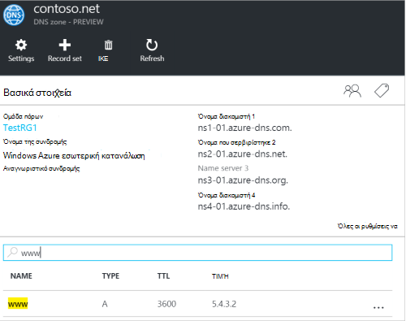
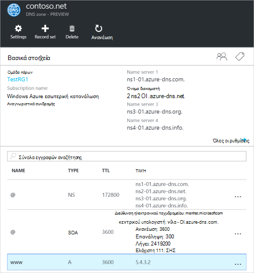
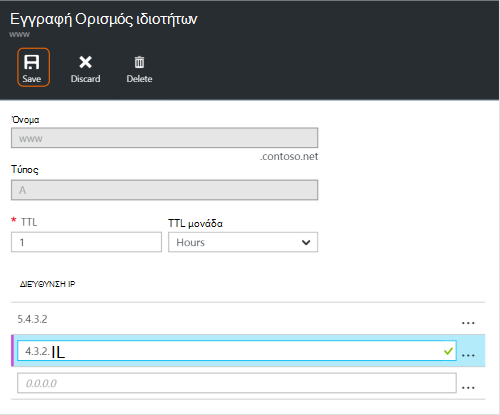
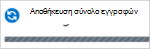
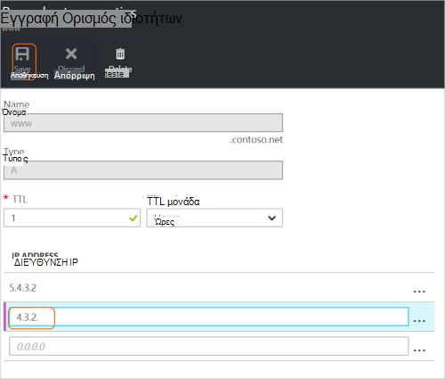
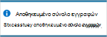
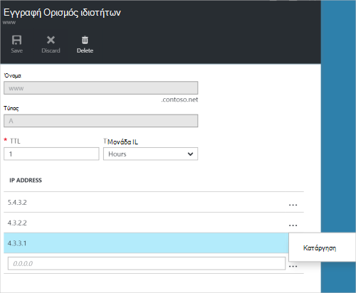
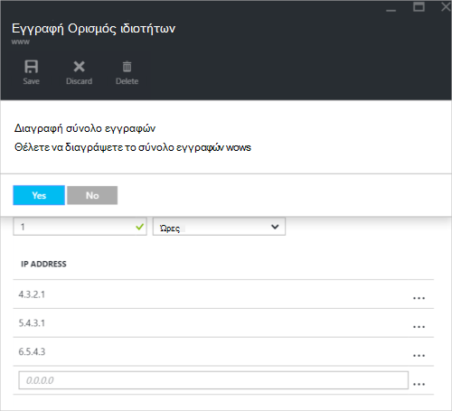

<properties
   pageTitle="Διαχείριση σύνολα εγγραφών DNS και εγγραφές με την πύλη Azure | Microsoft Azure"
   description="Διαχειρίζεστε το DNS record ορίζει και εγγραφών όταν φιλοξενεί τον τομέα σας στο Azure DNS."
   services="dns"
   documentationCenter="na"
   authors="sdwheeler"
   manager="carmonm"
   editor=""
   tags="azure-resource-manager"/>

<tags
   ms.service="dns"
   ms.devlang="na"
   ms.topic="article"
   ms.tgt_pltfrm="na"
   ms.workload="infrastructure-services"
   ms.date="08/16/2016"
   ms.author="sewhee"/>

# Διαχείριση των εγγραφών DNS και ρυθμίζει εγγραφής, χρησιμοποιώντας την πύλη του Azure

> [AZURE.SELECTOR]
- [Πύλη του Azure](dns-operations-recordsets-portal.md)
- [Azure CLI](dns-operations-recordsets-cli.md)
- [PowerShell](dns-operations-recordsets.md)

Αυτό το άρθρο σας δείχνει πώς μπορείτε να διαχειριστείτε εγγραφή σύνολα και τις εγγραφές για τη ζώνη DNS, χρησιμοποιώντας την πύλη του Azure.

Είναι σημαντικό να κατανοήσετε τη διαφορά μεταξύ σύνολα εγγραφών DNS και μεμονωμένες εγγραφές DNS. Ένα σύνολο εγγραφών είναι μια συλλογή εγγραφών σε μια ζώνη που έχουν το ίδιο όνομα και είναι του ίδιου τύπου. Για περισσότερες πληροφορίες, ανατρέξτε στο θέμα [Δημιουργία DNS σύνολα εγγραφών και εγγραφών χρησιμοποιώντας την πύλη του Azure](dns-getstarted-create-recordset-portal.md).

## Δημιουργήστε ένα νέο σύνολο εγγραφών και εγγραφής

Για να δημιουργήσετε μια εγγραφή που έχει οριστεί στην πύλη του Azure, ανατρέξτε στο θέμα [Δημιουργία εγγραφών DNS, χρησιμοποιώντας την πύλη του Azure](dns-getstarted-create-recordset-portal.md).

## Δείτε ένα σύνολο εγγραφών

1. Στην πύλη του Azure, μεταβείτε στο το blade **ζώνης DNS** .

2. Αναζήτηση για το σύνολο εγγραφών και επιλέξτε την. Έτσι ανοίγει τις ιδιότητες σύνολο εγγραφών.

    

## Προσθήκη νέας εγγραφής σε ένα σύνολο εγγραφών

Μπορείτε να προσθέσετε έως και 20 εγγραφές σε κάθε σύνολο εγγραφών. Ένα σύνολο εγγραφών δεν μπορεί να περιέχει δύο πανομοιότυπες εγγραφές. Κενή σύνολα εγγραφών (με μηδέν records) μπορεί να δημιουργηθεί, αλλά δεν εμφανίζονται στο τους διακομιστές ονομάτων του Azure DNS. Σύνολα εγγραφών CNAME του τύπου μπορεί να περιέχει έως μία εγγραφή.

1. Στην blade **εγγραφή Ορισμός ιδιοτήτων** για τη ζώνη DNS, επιλέξτε το σύνολο εγγραφών που θέλετε να προσθέσετε μια εγγραφή για να.

    

2. Καθορίστε την εγγραφή ορίστε ιδιότητες συμπληρώνοντας τα πεδία.

    

2. Κάντε κλικ στην επιλογή **Αποθήκευση** στο επάνω μέρος του blade για να αποθηκεύσετε τις ρυθμίσεις σας. Στη συνέχεια, κλείστε το blade.

3. Στην γωνία, θα δείτε ότι η εγγραφή αποθήκευση.

    

Μετά την αποθήκευση της εγγραφής, οι τιμές στην το blade **ζώνης DNS** θα απεικονίζουν τη νέα εγγραφή.

## Ενημέρωση μιας εγγραφής

Όταν ενημερώνετε μια εγγραφή σε ένα υπάρχον σύνολο εγγραφών, τα πεδία που μπορείτε να ενημερώσετε εξαρτώνται από τον τύπο της εγγραφής με την οποία εργάζεστε.

1. Στην blade **εγγραφή Ορισμός ιδιοτήτων** για το σύνολο εγγραφών, αναζητήστε την εγγραφή.

2. Τροποποίηση της εγγραφής. Όταν τροποποιείτε μια εγγραφή, μπορείτε να αλλάξετε τις διαθέσιμες ρυθμίσεις για την εγγραφή. Στο παρακάτω παράδειγμα, είναι επιλεγμένο το πεδίο **διεύθυνση IP** και η διεύθυνση IP είναι σε διαδικασία τροποποίηση.

    

3. Κάντε κλικ στην επιλογή **Αποθήκευση** στο επάνω μέρος του blade για να αποθηκεύσετε τις ρυθμίσεις σας. Στην επάνω δεξιά γωνία, θα δείτε την ειδοποίηση που έχει αποθηκευτεί η εγγραφή.

    

Μετά την αποθήκευση της εγγραφής, οι τιμές για τη ρύθμιση σε το blade **ζώνης DNS** εγγραφή θα αντανακλούν την ενημερωμένη εγγραφή.

## Κατάργηση εγγραφής από ένα σύνολο εγγραφών

Μπορείτε να χρησιμοποιήσετε την πύλη του Azure για να καταργήσετε εγγραφές από ένα σύνολο εγγραφών. Σημειώστε ότι η κατάργηση της τελευταίας εγγραφής από ένα σύνολο εγγραφών δεν διαγράφει το σύνολο εγγραφών.

1. Στην blade **εγγραφή Ορισμός ιδιοτήτων** για το σύνολο εγγραφών, αναζητήστε την εγγραφή.

2. Κάντε κλικ στην εγγραφή που θέλετε να καταργήσετε. Στη συνέχεια, επιλέξτε **Κατάργηση**.

    

3. Κάντε κλικ στην επιλογή **Αποθήκευση** στο επάνω μέρος του blade για να αποθηκεύσετε τις ρυθμίσεις σας.

3. Μετά την εγγραφή έχει καταργηθεί, οι τιμές για την εγγραφή στην το blade **ζώνης DNS** θα αντανακλούν την κατάργηση.

## Διαγράψτε ένα σύνολο εγγραφών

1. Στην **εγγραφή Ορισμός ιδιοτήτων** του blade για την εγγραφή ρύθμιση, κάντε κλικ στην επιλογή **Διαγραφή**.

    

2. Εμφανίζεται ένα μήνυμα που σας ρωτά εάν θέλετε να διαγράψετε το σύνολο εγγραφών.

3. Βεβαιωθείτε ότι το όνομα συμφωνεί με το σύνολο εγγραφών που θέλετε να διαγράψετε και, στη συνέχεια, κάντε κλικ στο κουμπί **Ναι**.

4. Στη το blade **ζώνης DNS** , βεβαιωθείτε ότι το σύνολο εγγραφών δεν είναι πλέον ορατό.

## Εργασία με εγγραφές NS και SOA

Εγγραφές NS και SOA που δημιουργούνται αυτόματα πραγματοποιείται διαφορετικά από άλλους τύπους εγγραφών.

### Τροποποίηση SOA εγγραφών

Δεν είναι δυνατό να προσθέσετε ή καταργήσετε εγγραφές από την δημιουργείται αυτόματα εγγραφή SOA ρύθμιση στην κορυφή ζώνη (όνομα = "@"). Ωστόσο, μπορείτε να τροποποιήσετε οποιαδήποτε από τις παραμέτρους εντός της εγγραφής SOA (εκτός από τα "κεντρικός υπολογιστής") και την εγγραφή ρύθμιση TTL.

### Τροποποιήστε τις εγγραφές NS στην κορυφή ζώνης

Δεν μπορείτε να προσθέσετε, να καταργήσετε ή να τροποποιήσετε τις εγγραφές στην εγγραφή NS δημιουργείται αυτόματα ρύθμιση στην κορυφή ζώνη (όνομα = "@"). Είναι η μόνη αλλαγή που επιτρέπεται να τροποποιήσετε το σύνολο εγγραφών TTL.

### Διαγραφή SOA ή NS σύνολα εγγραφών

Δεν μπορείτε να διαγράψετε το SOA και εγγραφή NS ορίζει στην κορυφή ζώνη (όνομα = "@") που δημιουργούνται αυτόματα όταν δημιουργείται της ζώνης. Διαγράφονται αυτόματα όταν διαγράφετε τη ζώνη.

## Επόμενα βήματα

-   Για περισσότερες πληροφορίες σχετικά με το Azure DNS, ανατρέξτε στο θέμα η [Επισκόπηση Azure DNS](dns-overview.md).
-   Για περισσότερες πληροφορίες σχετικά με την αυτοματοποίηση DNS, ανατρέξτε στο θέμα [Δημιουργία DNS ζώνες και εγγραφή συνόλων χρησιμοποιώντας το .NET SDK](dns-sdk.md).
-   Για περισσότερες πληροφορίες σχετικά με αντίστροφη εγγραφές DNS, δείτε [πώς μπορείτε να διαχειριστείτε αντίστροφη εγγραφές DNS για τις υπηρεσίες σας με χρήση του PowerShell](dns-reverse-dns-record-operations-ps.md).
