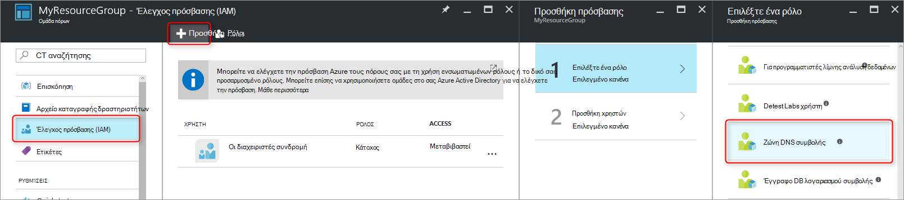
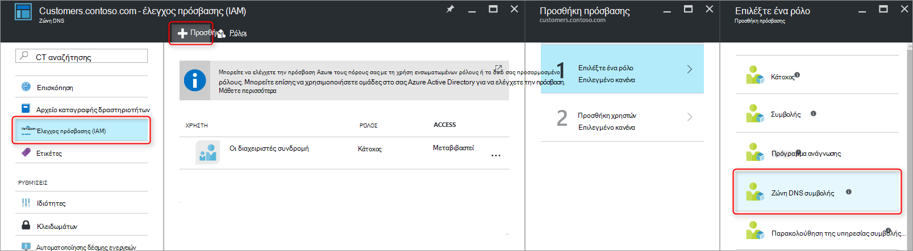
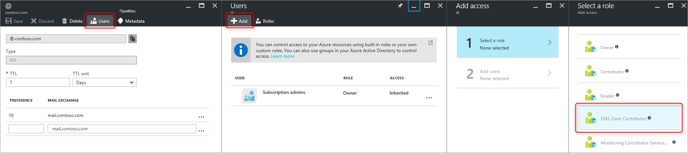
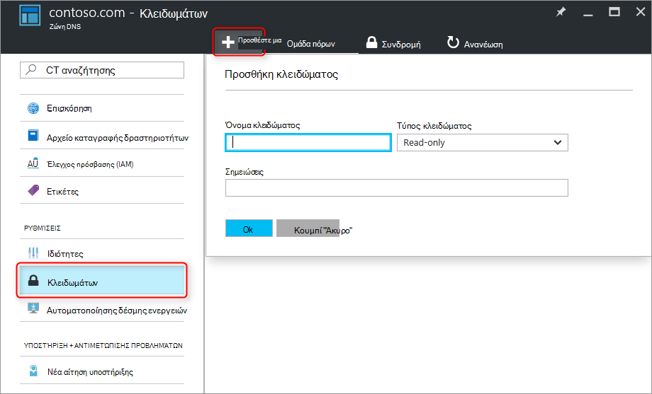

<properties 
   pageTitle="Προστασία ζώνες DNS και εγγραφές | Microsoft Azure" 
   description="Πώς να προστατεύσετε ζώνες DNS και σύνολα εγγραφών στο Microsoft Azure DNS." 
   services="dns" 
   documentationCenter="na" 
   authors="jtuliani" 
   manager="carmonm" 
   editor=""/>

<tags
   ms.service="dns"
   ms.devlang="na"
   ms.topic="article"
   ms.tgt_pltfrm="na"
   ms.workload="infrastructure-services" 
   ms.date="10/20/2016"
   ms.author="jtuliani"/>

# Πώς να προστατεύσετε ζώνες DNS και εγγραφές

Ζώνες DNS και εγγραφές είναι κρίσιμης πόρους. Διαγραφή μιας ζώνης DNS ή ακόμα και μόνο μία εγγραφή DNS μπορεί να οδηγήσει σε μια μη διαθεσιμότητα συνολικό υπηρεσίας.  Επομένως, είναι σημαντικό ότι δεν είναι προστατευμένο κρίσιμα ζώνες DNS και εγγραφές σε σχέση με μη εξουσιοδοτημένη ή τυχαίες αλλαγές.

Σε αυτό το άρθρο εξηγεί πώς Azure DNS σάς επιτρέπει να προστατεύσετε το ζώνες DNS και εγγραφές σε σχέση με αυτές τις αλλαγές.  Θα σας εφαρμογή δύο ισχυρή ασφάλεια δυνατότητες που παρέχονται από τη διαχείριση πόρων Azure: [Έλεγχος πρόσβασης βάσει ρόλων](../active-directory/role-based-access-control-what-is.md) και [κλειδωμάτων πόρων](../resource-group-lock-resources.md).

## Έλεγχος πρόσβασης βάσει ρόλων

Azure βάσει ρόλων πρόσβασης ελέγχου (RBAC) επιτρέπει λεπτομερή πρόσβασης διαχείρισης για το Azure χρηστών, ομάδων και πόρων. Χρήση RBAC, μπορείτε να εκχωρήσετε επακριβώς το ποσό της access ότι οι χρήστες πρέπει να εκτελέσετε τις εργασίες τους. Για περισσότερες πληροφορίες σχετικά με τον τρόπο RBAC σάς βοηθά να διαχειριστείτε την πρόσβαση, ανατρέξτε στο θέμα [Τι είναι ο έλεγχος πρόσβασης βάσει ρόλων](../active-directory/role-based-access-control-what-is.md).

### Ο ρόλος 'DNS Zone συμβολής'

Ο ρόλος 'DNS Zone συμβολής' είναι ένα ενσωματωμένο ρόλο που παρέχεται από Azure για τη διαχείριση των πόρων DNS.  Εκχώρηση δικαιωμάτων DNS Zone συμβολής σε ένα χρήστη ή την ομάδα σας επιτρέπει αυτήν την ομάδα για να διαχειριστείτε πόρους DNS, αλλά δεν πόρους από οποιονδήποτε άλλο τύπο.

Για παράδειγμα, ας υποθέσουμε ότι η ομάδα πόρων 'myzones' περιέχει πέντε ζώνες για την εταιρεία Contoso. Εκχώρηση ο διαχειριστής DNS 'DNS Zone συμβολής' δικαιώματα για αυτήν την ομάδα πόρων, επιτρέπει πλήρη έλεγχο σε αυτές τις ζώνες DNS. Αποφεύγονται επίσης εκχώρηση δεν είναι απαραίτητα δικαιώματα, για παράδειγμα, ο διαχειριστής DNS δεν είναι δυνατό να δημιουργήσετε ή να διακόψετε εικονικές μηχανές.

Ο πιο απλός τρόπος για να εκχωρήσετε δικαιώματα RBAC είναι [μέσω της πύλης Azure](../active-directory/role-based-access-control-configure.md).  Ανοίξτε το blade 'Έλεγχος πρόσβασης (IAM)' για την ομάδα πόρων, στη συνέχεια, κάντε κλικ στην επιλογή 'Προσθήκη', στη συνέχεια, επιλέξτε το ρόλο 'DNS Zone συμβολής' και επιλέξτε απαιτείται χρήστες ή ομάδες για την εκχώρηση δικαιωμάτων.

Δικαιώματα μπορεί να είναι επίσης [εκχωρηθεί χρησιμοποιώντας το Azure PowerShell](../active-directory/role-based-access-control-manage-access-powershell.md):

    # Grant 'DNS Zone Contributor' permissions to all zones in a resource group
    New-AzureRmRoleAssignment -SignInName <user email address> -RoleDefinitionName "DNS Zone Contributor" -ResourceGroupName <resource group name>

Στην ισοδύναμη εντολή είναι επίσης [διαθέσιμο μέσω του Azure CLI](../active-directory/role-based-access-control-manage-access-azure-cli.md):

    # Grant 'DNS Zone Contributor' permissions to all zones in a resource group
    azure role assignment create --signInName  <user email address> --roleName "DNS Zone Contributor" --resourceGroup <resource group name>

### Ζώνη επίπεδο RBAC

Azure RBAC κανόνες μπορούν να εφαρμοστούν σε μια συνδρομή, μια ομάδα πόρων ή ένας μεμονωμένος πόρος. Στην περίπτωση Azure DNS, αυτόν τον πόρο μπορεί να είναι ένα μεμονωμένο ζώνης DNS ή ακόμη και ένα μεμονωμένο σύνολο εγγραφών.

Για παράδειγμα, ας υποθέσουμε ότι η ομάδα πόρων 'myzones' περιέχει τη ζώνη 'contoso.com' και μια subzone 'customers.contoso.com' στην οποία δημιουργούνται εγγραφές CNAME για κάθε λογαριασμό του πελάτη.  Ο λογαριασμός που χρησιμοποιείται για τη Διαχείριση αυτές τις εγγραφές CNAME πρέπει να ανατεθούν δικαιώματα για τη δημιουργία εγγραφών στη ζώνη 'customers.contoso.com' μόνο, δεν θα πρέπει να έχει πρόσβαση στις άλλες ζώνες.

Ζώνη επιπέδου RBAC δικαιώματα μπορούν να εκχωρηθούν μέσω της πύλης Azure.  Ανοίξτε το blade 'Έλεγχος πρόσβασης (IAM)' για τη ζώνη, στη συνέχεια, κάντε κλικ στην επιλογή 'Προσθήκη', στη συνέχεια, επιλέξτε το ρόλο 'DNS Zone συμβολής' και επιλέξτε απαιτείται χρήστες ή ομάδες για την εκχώρηση δικαιωμάτων.

Δικαιώματα μπορεί να είναι επίσης [παραχωρηθεί χρησιμοποιώντας το Azure PowerShell](../active-directory/role-based-access-control-manage-access-powershell.md):

    # Grant 'DNS Zone Contributor' permissions to a specific zone
    New-AzureRmRoleAssignment -SignInName <user email address> -RoleDefinitionName "DNS Zone Contributor" -ResourceGroupName <resource group name> -ResourceName <zone name> -ResourceType Microsoft.Network/DNSZones

Στην ισοδύναμη εντολή είναι επίσης [διαθέσιμο μέσω του Azure CLI](../active-directory/role-based-access-control-manage-access-azure-cli.md):

    # Grant 'DNS Zone Contributor' permissions to a specific zone
    azure role assignment create --signInName <user email address> --roleName "DNS Zone Contributor" --resource-name <zone name> --resource-type Microsoft.Network/DNSZones --resource-group <resource group name>

### Επίπεδο RBAC σύνολο εγγραφών

Θα σας μπορεί να επιστρέψετε στο προηγούμενο βήμα περαιτέρω. Μπορείτε να το διαχειριστή της αλληλογραφίας για την εταιρεία Contoso, που χρειάζονται πρόσβαση στις εγγραφές MX και TXT στην κορυφή της ζώνης 'contoso.com'.  Ότι δεν πρέπει να έχετε πρόσβαση σε άλλες εγγραφές MX ή TXT ή σε οποιεσδήποτε εγγραφές από οποιονδήποτε άλλο τύπο.  Azure DNS σάς επιτρέπει να εκχωρήσετε δικαιώματα σε επίπεδο σύνολο εγγραφών, με ακρίβεια τις εγγραφές που ο διαχειριστής του ηλεκτρονικού ταχυδρομείου πρέπει πρόσβαση.  Ο διαχειριστής της αλληλογραφίας παρέχεται ακριβώς το στοιχείο ελέγχου κάνει πρέπει και δεν είναι δυνατό να κάνετε άλλες αλλαγές.
  
Εγγραφή-Ορισμός επιπέδου δικαιωμάτων RBAC μπορεί να ρυθμιστεί μέσω της πύλης Azure, χρησιμοποιώντας το κουμπί 'Χρήστες' στην blade το σύνολο εγγραφών:

Σύνολο καρτελών επιπέδου δικαιωμάτων RBAC μπορεί επίσης να [παραχωρηθεί χρησιμοποιώντας το Azure PowerShell](../active-directory/role-based-access-control-manage-access-powershell.md):

    # Grant permissions to a specific record set
    New-AzureRmRoleAssignment -SignInName <user email address> -RoleDefinitionName "DNS Zone Contributor" -Scope "/subscriptions/<subscription id>/resourceGroups/<resource group name>/providers/Microsoft.Network/dnszones/<zone name>/<record type>/<record name>" 

Στην ισοδύναμη εντολή είναι επίσης [διαθέσιμο μέσω του Azure CLI](../active-directory/role-based-access-control-manage-access-azure-cli.md):

    # Grant permissions to a specific record set
    azure role assignment create --signInName <user email address> --roleName "DNS Zone Contributor" --scope "/subscriptions/<subscription id>/resourceGroups/<resource group name>/providers/Microsoft.Network/dnszones/<zone name>/<record type>/<record name>"

### Προσαρμοσμένοι ρόλοι

Το ενσωματωμένο ρόλο 'DNS Zone συμβολής' επιτρέπει πλήρη έλεγχο σε έναν πόρο DNS. Είναι επίσης πιθανό για να δημιουργήσετε το δικό σας πελατών Azure ρόλους, για την παροχή ακόμα πιο ομαλή γίνει έλεγχος.

Εξετάστε το ενδεχόμενο να ξανά το παράδειγμα στην οποία δημιουργείται μια εγγραφή CNAME στη ζώνη 'customers.contoso.com' για κάθε λογαριασμό πελάτη Contoso Corporation.  Το λογαριασμό που χρησιμοποιείται για να διαχειριστείτε αυτά τα CNAMEs θα πρέπει να έχετε το δικαίωμα να διαχειρίζεστε μόνο τις εγγραφές CNAME.  Στη συνέχεια, είναι δεν είναι δυνατή η για να τροποποιήσετε τις εγγραφές από τους άλλους τύπους (όπως η αλλαγή των εγγραφών MX) ή να εκτελέσετε εργασίες ζώνη επιπέδου, όπως η διαγραφή ζώνης.

Το παρακάτω παράδειγμα εμφανίζει έναν προσαρμοσμένο ρόλο ορισμό για τη διαχείριση εγγραφών CNAME μόνο:

    {
        "Name": "DNS CNAME Contributor",
        "Id": "",
        "IsCustom": true,
        "Description": "Can manage DNS CNAME records only.",
        "Actions": [
            "Microsoft.Network/dnsZones/CNAME/*",
            "Microsoft.Network/dnsZones/read",
            "Microsoft.Authorization/*/read",
            "Microsoft.Insights/alertRules/*",
            "Microsoft.ResourceHealth/availabilityStatuses/read",
            "Microsoft.Resources/deployments/*",
            "Microsoft.Resources/subscriptions/resourceGroups/read",
            "Microsoft.Support/*"
        ],
        "NotActions": [
        ],
        "AssignableScopes": [
            "/subscriptions/ c276fc76-9cd4-44c9-99a7-4fd71546436e"
        ]
    }

Η ιδιότητα ενέργειες ορίζει τα ακόλουθα δικαιώματα αφορούν συγκεκριμένα το DNS:

- `Microsoft.Network/dnsZones/CNAME/*`επιχορηγήσεις πλήρη έλεγχο εγγραφών CNAME
- `Microsoft.Network/dnsZones/read`εκχωρεί δικαιώματα ανάγνωσης ζώνες DNS, αλλά όχι να τα τροποποιήσετε, μπορείτε να δείτε τη ζώνη στην οποία δημιουργείται στην εγγραφή CNAME.

Οι υπόλοιπες ενέργειες αντιγράφονται από το [ρόλο ενσωματωμένη συμβολής ζώνης DNS](../active-directory/role-based-access-built-in-roles.md#dns-zone-contributor).

>[AZURE.NOTE] Χρήση ενός προσαρμοσμένου ρόλου RBAC για να αποτρέψετε τη διαγραφή σύνολα εγγραφών, ενώ εξακολουθείτε να επιτρέποντάς τους να ενημερωθούν δεν είναι ένα στοιχείο ελέγχου αποτελεσματικές. Εμποδίζει σύνολα εγγραφής που διαγράφεται, αλλά δεν εμποδίζει τους από τροποποίηση.  Τροποποιήσεις επιτρέπονται περιλαμβάνουν Προσθήκη και κατάργηση εγγραφές από το σύνολο εγγραφών, συμπεριλαμβανομένων των κατάργηση όλες τις εγγραφές για να αποχωρήσετε από μια 'empty' σύνολο εγγραφών. Αυτό έχει το ίδιο αποτέλεσμα με τη διαγραφή του συνόλου από άποψη επίλυσης DNS εγγραφών.

Προς το παρόν δεν μπορούν να οριστούν ορισμών προσαρμοσμένης ρόλων μέσω της πύλης Azure. Ένα προσαρμοσμένο ρόλο που βασίζεται σε αυτόν τον ορισμό ρόλων μπορούν να δημιουργηθούν με χρήση του Azure PowerShell:

    # Create new role definition based on input file
    New-AzureRmRoleDefinition -InputFile <file path>

Μπορεί επίσης να δημιουργηθεί μέσω του Azure CLI:

    # Create new role definition based on input file
    azure role create –inputfile <file path>

Ο ρόλος, στη συνέχεια, μπορείτε να αντιστοιχίσετε με τον ίδιο τρόπο ως ενσωματωμένο ρόλους, όπως περιγράφεται παραπάνω σε αυτό το άρθρο.

Για περισσότερες πληροφορίες σχετικά με τη δημιουργία, διαχείριση, και αναθέσετε ρόλους προσαρμοσμένο, ανατρέξτε στο θέμα [Προσαρμοσμένες τους ρόλους στο Azure RBAC](../active-directory/role-based-access-control-custom-roles.md).

## Κλείδωμα του πόρου

Εκτός από την RBAC, διαχείριση πόρων Azure υποστηρίζει άλλο τύπο στοιχείου ελέγχου ασφαλείας, δηλαδή η δυνατότητα 'lock' πόρους. Όπου RBAC κανόνες σας επιτρέπουν να ελέγχου ενεργειών που οφείλονται σε συγκεκριμένους χρήστες και ομάδες, κλειδωμάτων πόρων εφαρμόζονται στον πόρο και είναι αποτελεσματικές σε όλους τους χρήστες και τους ρόλους. Για περισσότερες πληροφορίες, ανατρέξτε στο θέμα [πόροι κλείδωμα με τη διαχείριση πόρων Azure](../resource-group-lock-resources.md).

Υπάρχουν δύο τύποι πόρων κλειδώματος: **DoNotDelete** και **μόνο για ανάγνωση**. Αυτές μπορούν να εφαρμοστούν είτε σε μια ζώνη DNS ή σε ένα μεμονωμένο σύνολο εγγραφών.  Οι παρακάτω ενότητες περιγράφουν διάφορες συνηθισμένα σενάρια και πώς να υποστηρίζουν τους χρήση κλειδωμάτων πόρων.

### Προστασία σε σχέση με όλες τις αλλαγές

Για να αποτρέψετε τις αλλαγές που γίνονται, εφαρμόστε ένα κλείδωμα μόνο για ανάγνωση στη ζώνη.  Αυτό αποτρέπει την νέα σύνολα εγγραφών που έχουν δημιουργηθεί και υπάρχοντα σύνολα εγγραφών από τροποποίηση ή διαγραφή.

Ζώνη ισοστάθμιση πόρων κλειδωμάτων μπορούν να δημιουργηθούν μέσω της πύλης Azure.  Από το blade ζώνης DNS, κάντε κλικ στην επιλογή 'Κλειδωμάτων', στη συνέχεια, 'Προσθήκη':

Ζώνη επιπέδου πόρου κλειδωμάτων μπορεί επίσης να δημιουργηθεί μέσω του Azure PowerShell:

    # Lock a DNS zone
    New-AzureRmResourceLock -LockLevel <lock level> -LockName <lock name> -ResourceName <zone name> -ResourceType Microsoft.Network/DNSZones -ResourceGroupName <resource group name> 

Ρύθμιση παραμέτρων κλειδωμάτων Azure πόρων δεν υποστηρίζεται αυτήν τη στιγμή μέσω του Azure CLI.

### Προστασία μεμονωμένων εγγραφών
Για να αποτρέψετε μια υπάρχουσα εγγραφή DNS που έχει οριστεί σε σχέση με την τροποποίηση, εφαρμόστε ένα κλείδωμα μόνο για ανάγνωση στο σύνολο εγγραφών.

>[AZURE.NOTE] Εφαρμογή ενός κλειδώματος DoNotDelete σε ένα σύνολο εγγραφών δεν είναι ένα στοιχείο ελέγχου αποτελεσματικές. Εμποδίζει το σύνολο από τη διαγραφή εγγραφών, αλλά αυτό δεν εμποδίζει την τροποποίηση.  Τροποποιήσεις επιτρέπονται περιλαμβάνουν Προσθήκη και κατάργηση εγγραφές από το σύνολο εγγραφών, συμπεριλαμβανομένων των κατάργηση όλες τις εγγραφές για να αποχωρήσετε από μια 'empty' σύνολο εγγραφών. Αυτό έχει το ίδιο αποτέλεσμα με τη διαγραφή του συνόλου από άποψη επίλυσης DNS εγγραφών.

Σύνολο εγγραφών κλειδωμάτων ισοστάθμιση πόρων τη συγκεκριμένη στιγμή να είναι μόνο έχει ρυθμιστεί με χρήση του PowerShell Azure.  Δεν υποστηρίζονται στην πύλη του Azure ή Azure CLI.

    # Lock a DNS record set
    New-AzureRmResourceLock -LockLevel <lock level> -LockName <lock name> -ResourceName <zone name>/<record set name> -ResourceType Microsoft.Network/DNSZones/<record type> -ResourceGroupName <resource group name> 

### Προστασία από διαγραφή ζώνης

Όταν διαγράφεται μια ζώνη στο Azure DNS, διαγράφονται επίσης όλα τα σύνολα εγγραφών στη ζώνη.  Αυτή η λειτουργία δεν είναι δυνατή η αναίρεση.  Διαγραφή κατά λάθος μια ζώνη κρίσιμες έχει τη δυνατότητα να έχουν επίδραση σημαντική επιχειρήσεις.  Επομένως, είναι πολύ σημαντικό για να προστατευτείτε από τυχαίες ζώνη διαγραφής.

Εφαρμογή ενός κλειδώματος DoNotDelete σε μια ζώνη δεν επιτρέπει τη ζώνη από τη διαγραφή.  Ωστόσο, επειδή κλειδωμάτων μεταβιβάζονται από τους πόρους θυγατρικό, εμποδίζει επίσης οποιαδήποτε σύνολα εγγραφών στη ζώνη από τη διαγραφή, που μπορεί να είναι ανεπιθύμητες.  Επιπλέον, όπως περιγράφεται στην παραπάνω σημείωση, είναι επίσης ανενεργή εφόσον εγγραφές εξακολουθούν να μπορούν να καταργηθούν από τα υπάρχοντα σύνολα εγγραφών.

Ως εναλλακτική λύση, εξετάστε το ενδεχόμενο εφαρμογή κλείδωμα DoNotDelete σε ένα σύνολο στη ζώνη, όπως το σύνολο εγγραφών SOA εγγραφών.  Εφόσον δεν μπορούν να διαγραφούν τη ζώνη χωρίς να διαγράψει επίσης τα σύνολα εγγραφών, αυτό προστατεύει από διαγραφή ζώνη, ενώ εξακολουθείτε να επιτρέπετε σε σύνολα εγγραφών μέσα στη ζώνη να τροποποιηθούν ελεύθερα. Εάν γίνεται προσπάθεια για να διαγράψετε τη ζώνη, διαχείριση πόρων Azure εντοπίζουν αυτό θα διαγραφούν και το σύνολο εγγραφών SOA και αποκλείει την κλήση, επειδή το SOA είναι κλειδωμένο.  Χωρίς σύνολα εγγραφών διαγράφονται.

Η παρακάτω εντολή PowerShell δημιουργεί μια κλειδαριά DoNotDelete σε σχέση με την εγγραφή SOA της δεδομένης ζώνης:

    # Protect against zone delete with DoNotDelete lock on the record set
    New-AzureRmResourceLock -LockLevel DoNotDelete -LockName <lock name> -ResourceName <zone name>/@ -ResourceType Microsoft.Network/DNSZones/SOA -ResourceGroupName <resource group name> 

Ένας άλλος τρόπος για να αποτρέψετε τυχαίες ζώνη διαγραφή είναι να χρησιμοποιήσετε έναν προσαρμοσμένο ρόλο για να βεβαιωθείτε ότι ο τελεστής και λογαριασμούς υπηρεσίας που χρησιμοποιούνται για να διαχειριστείτε τις ζώνες δεν έχουν δικαιώματα διαγραφής ζώνη. Όταν πρέπει να διαγράψετε μια ζώνη, μπορείτε να επιβάλετε μια διαγραφή δύο βημάτων, πρώτη χορήγηση δικαιωμάτων διαγραφή ζώνης (στο το εύρος ζώνης, για να αποτρέψετε τη διαγραφή λάθος ζώνη) και δευτερόλεπτα για να διαγράψετε τη ζώνη.

Αυτή η προσέγγιση δεύτερο έχει το πλεονέκτημα που λειτουργεί για όλες τις ζώνες προσβάσιμη από αυτούς τους λογαριασμούς, χωρίς να χρειάζεται να θυμάστε να δημιουργήσετε τα κλειδώματα. Έχει το μειονέκτημα ότι κάθε λογαριασμό με δικαιώματα διαγραφής ζώνη, όπως ο κάτοχος της συνδρομής, εξακολουθεί να κατά λάθος να διαγράψετε μια ζώνη κρίσιμη.

Είναι δυνατό να χρησιμοποιήσετε και τις δύο αυτές προσεγγίσεις - κλειδωμάτων πόρων και Προσαρμοσμένοι ρόλοι - την ίδια στιγμή, ως μια προστασία σε βάθος προσέγγιση για την προστασία ζώνης DNS.

## Επόμενα βήματα

- Για περισσότερες πληροφορίες σχετικά με την εργασία με RBAC, ανατρέξτε στο θέμα [Γρήγορα αποτελέσματα με τη Διαχείριση πρόσβαση στην πύλη του Azure](../active-directory/role-based-access-control-what-is.md). 
- Για περισσότερες πληροφορίες σχετικά με την εργασία με κλειδώματα πόρων, ανατρέξτε στο θέμα [πόροι κλείδωμα με τη διαχείριση πόρων Azure](../resource-group-lock-resources.md).
- Για περισσότερες πληροφορίες σχετικά με την ασφάλεια Azure τους πόρους σας, ανατρέξτε στο θέμα [ζητήματα ασφαλείας για τη διαχείριση πόρων Azure](../best-practices-resource-manager-security.md).
