<properties 
    pageTitle="DocumentDB αλλαγή ειδοποιήσεις χρήση λογικής εφαρμογών | Microsoft Azure" 
    description="." 
    keywords="ειδοποίηση αλλαγής"
    services="documentdb" 
    authors="hedidin" 
    manager="jhubbard" 
    editor="mimig" 
    documentationCenter=""/>

<tags 
    ms.service="documentdb" 
    ms.workload="data-services" 
    ms.tgt_pltfrm="na" 
    ms.devlang="rest-api" 
    ms.topic="article" 
    ms.date="09/23/2016" 
    ms.author="b-hoedid"/>

# <a name="notifications-for-new-or-changed-documentdb-resources-using-logic-apps"></a>Ειδοποιήσεις για νέα ή τροποποιημένα πόρους DocumentDB χρήση λογικής εφαρμογών

Σε αυτό το άρθρο προήλθε σχετικά με μια ερώτηση που είδατε δημοσιεύσει ένα από τα φόρουμ της Κοινότητας του Azure DocumentDB. Η ερώτηση έχει **κάνει DocumentDB υποστηρίζει τις ειδοποιήσεις για τους πόρους που έχουν τροποποιηθεί**;

Να έχετε εργαστεί BizTalk Server για πολλά χρόνια και αυτό είναι ένα πολύ συνηθισμένο σενάριο κατά τη χρήση του [Προσαρμογέα LOB WCF](https://msdn.microsoft.com/library/bb798128.aspx). Επομένως, αποφασίσει για να δείτε εάν να μπορεί να αναπαραγάγετε αυτήν τη λειτουργικότητα στο DocumentDB για νέα ή/και έχουν τροποποιηθεί έγγραφα.

Σε αυτό το άρθρο παρέχει μια επισκόπηση των στοιχείων της λύσης αλλαγή ειδοποίησης, που περιλαμβάνει ένα [έναυσμα](documentdb-programming.md#trigger) και μια [Εφαρμογή λογικής](../app-service-logic/app-service-logic-what-are-logic-apps.md). Σημαντικά τμήματα κώδικα παρέχονται ενσωματωμένα και ολόκληρη η λύση είναι διαθέσιμη στο [GitHub](https://github.com/HEDIDIN/DocDbNotifications).

## <a name="use-case"></a>Χρήση πεζών-κεφαλαίων

Το παρακάτω κείμενο είναι το περίπτωσης χρήσης για αυτό το άρθρο.

DocumentDB είναι το αποθετήριο δεδομένων για τα έγγραφα εύρυθμης λειτουργίας επίπεδο επτά διεθνούς (HL7) γρήγορα υπηρεσίες υγείας διαλειτουργικότητα πόρων (FHIR). Ας υποθέσουμε ότι η βάση δεδομένων DocumentDB σε συνδυασμό με το API και εφαρμογή λογικής αποτελούν ένα διακομιστή FHIR HL7.  Μια υπηρεσία υγείας αποθήκευση ασθενών δεδομένων σε το DocumentDB βάσης δεδομένων "Ασθενών". Υπάρχουν πολλές συλλογές εντός της ασθενών βάσης δεδομένων. Κλινικής, αναγνώριση, κ.λπ. Πληροφορίες ασθενών εμπίπτει αναγνώρισης.  Έχετε μια συλλογή με το όνομα "Υπομονή".

Το τμήμα Καρδιολογικός εξοπλισμός είναι παρακολούθησης προσωπικά δεδομένα χερσότοποι και άσκηση. Αναζήτηση για νέα ή τροποποιημένα ασθενών εγγραφές είναι χρονοβόρα. Τους ζητηθεί από το τμήμα IT εάν υπήρχε κάποιο τρόπο ώστε να μπορεί να λαμβάνουν μια ειδοποίηση για νέα ή τροποποιημένα ασθενών εγγραφές.  

Το τμήμα IT said ότι εύκολα μπορεί να παρέχουν αυτό. Αυτά said ότι αυτές θα μπορούσε να προωθήσετε τα έγγραφα σε [Χώρο αποθήκευσης Blob του Azure](https://azure.microsoft.com/services/storage/) , ώστε το τμήμα Καρδιολογικός εξοπλισμός μπορεί να έχετε εύκολα πρόσβαση.

## <a name="how-the-it-department-solved-the-problem"></a>Πώς το τμήμα IT επιλυθεί το πρόβλημα

Για να δημιουργήσετε αυτήν την εφαρμογή, το τμήμα IT αποφασίσει να μοντέλου αυτό πρώτα.  Το ωραία σχετικά με τη χρήση Business Process Model and Notation (BPMN) είναι ότι τόσο τεχνική και μη τεχνικές άτομα μπορούν να εύκολα το κατανοήσει. Αυτή η διαδικασία ολόκληρη ειδοποίηση θεωρείται μια επιχειρηματική διαδικασία. 

## <a name="high-level-view-of-notification-process"></a>Προβολή υψηλού επιπέδου της διαδικασίας ειδοποίησης

1. Μπορείτε να ξεκινήσετε με μια εφαρμογή της λογικής που έχει ένα έναυσμα χρονόμετρο. Από προεπιλογή, το έναυσμα εκτελείται κάθε ώρα.
2. Στη συνέχεια μπορείτε να κάνετε μια ΔΗΜΟΣΊΕΥΣΗ HTTP στην εφαρμογή λογικής.
3. Η εφαρμογή λογικής κάνει όλη την εργασία.

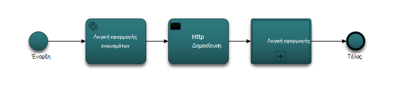

### <a name="lets-take-a-look-at-what-this-logic-app-does"></a>Ας ρίξουμε μια ματιά στο τι κάνει αυτή η εφαρμογή λογικής
Αν κοιτάξετε στην παρακάτω εικόνα υπάρχουν αρκετά βήματα στη ροή εργασίας LogicApp.

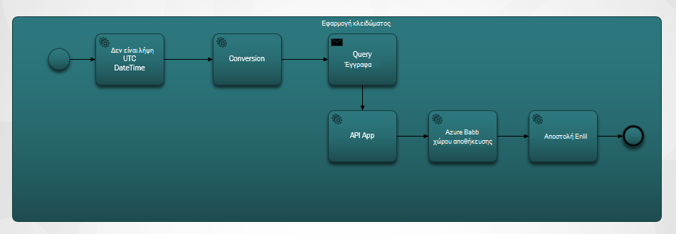

Τα βήματα είναι τα εξής:

1. Πρέπει να λάβετε την τρέχουσα ημερομηνία/ώρα UTC από μια εφαρμογή API.  Η προεπιλεγμένη τιμή είναι προηγούμενο και μία ώρα.

2. Το DateTime UTC μετατρέπεται σε μια μορφή της χρονικής σήμανσης Unix. Αυτή είναι η προεπιλεγμένη μορφή για χρονικές σημάνσεις στο DocumentDB.

3. Μπορείτε να ΚΑΤΑΧΩΡΉΣΕΤΕ την τιμή σε μια εφαρμογή API, η οποία κάνει μια DocumentDB ερωτήματος. Χρησιμοποιείται η τιμή σε ένα ερώτημα.

    ```SQL
        SELECT * FROM Patients p WHERE (p._ts >= @unixTimeStamp)
    ```

    > [AZURE.NOTE] Το _ts αντιπροσωπεύει τα μετα-δεδομένα χρονικής σήμανσης για όλους τους πόρους DocumentDB.

4. Εάν υπάρχουν εγγράφων που βρέθηκαν, ο οργανισμός απόκριση αποστέλλεται χώρο αποθήκευσης αντικειμένων Blob του Azure.

    > [AZURE.NOTE] Χώρος αποθήκευσης αντικειμένων blob απαιτεί ένα λογαριασμό αποθήκευσης Azure. Πρέπει να προμήθεια λογαριασμού χώρου αποθήκευσης αντικειμένων Blob του Azure και να προσθέσετε ένα νέο Blob που ονομάζεται ασθενών. Για περισσότερες πληροφορίες, ανατρέξτε στο θέμα [σχετικά με το Azure αποθήκευσης λογαριασμών](../storage/storage-create-storage-account.md) και [Γρήγορα αποτελέσματα με το χώρο αποθήκευσης αντικειμένων Blob του Azure](../storage/storage-dotnet-how-to-use-blobs.md).

5. Τέλος, ένα μήνυμα ηλεκτρονικού ταχυδρομείου αποστέλλεται που ειδοποιεί τον παραλήπτη του αριθμού των εγγράφων που βρέθηκαν. Εάν δεν βρέθηκαν έγγραφα, τον οργανισμό ηλεκτρονικού ταχυδρομείου θα είναι "βρέθηκε 0 έγγραφα". 

Τώρα που έχετε μια ιδέα του τι κάνει αυτή η ροή εργασίας, ας ρίξουμε μια ματιά πώς να την εφαρμόσετε.

### <a name="lets-start-with-the-main-logic-app"></a>Ας ξεκινήσουμε με την κύρια εφαρμογή λογικής

Εάν δεν είστε εξοικειωμένοι με τις εφαρμογές λογικής, είναι διαθέσιμες σε το [Azure Marketplace](https://portal.azure.com/)και μπορείτε να μάθετε περισσότερα σχετικά με τους στο [Τι είναι οι εφαρμογές λογικής;](../app-service-logic/app-service-logic-what-are-logic-apps.md)

Όταν δημιουργείτε μια νέα εφαρμογή λογικής, σας ζητείται **Πώς θα θέλατε να ξεκινήσετε;**

Όταν κάνετε κλικ μέσα στο πλαίσιο κειμένου, μπορείτε να επιλέξετε συμβάντων. Για αυτήν την εφαρμογή λογικής, επιλέξτε **λήψη εγχειρίδιο - αίτηση όταν μια HTTP** όπως φαίνεται παρακάτω.

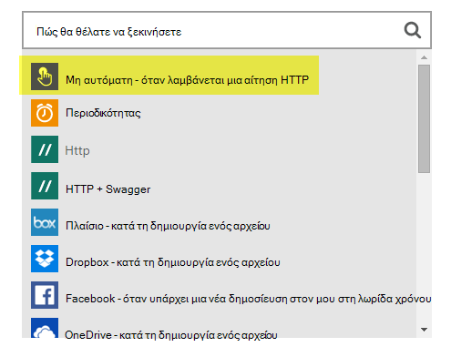

### <a name="design-view-of-your-completed-logic-app"></a>Προβολή σχεδίασης για την εφαρμογή σας ολοκληρωμένες λογικής
Ας μετάβαση προς τα εμπρός και εξετάστε την προβολή ολοκληρωμένων σχεδίασης για την εφαρμογή λογική, η οποία ονομάζεται DocDB.


Κατά την επεξεργασία τις ενέργειες στη σχεδίαση εφαρμογής λογικής, έχετε τη δυνατότητα επιλογής **εξόδους** από την αίτηση HTTP ή από την προηγούμενη ενέργεια, όπως φαίνεται στην παρακάτω sendMail ενέργεια.

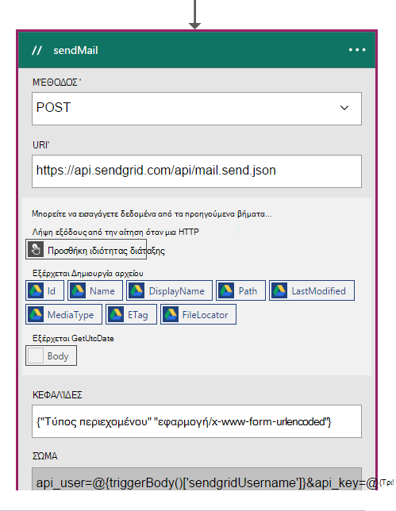

Πριν από κάθε ενέργεια στη ροή εργασίας σας, μπορείτε να κάνετε μια δική σας απόφαση; **Προσθήκη μιας ενέργειας** ή **Προσθήκη μιας συνθήκης** όπως φαίνεται στην παρακάτω εικόνα.

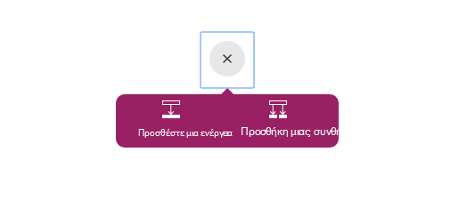

Εάν επιλέξετε **Προσθήκη μια συνθήκη**, εμφανίζεται με μια φόρμα, όπως φαίνεται στην παρακάτω εικόνα, για να εισαγάγετε λογική σας.  Αυτός είναι στην πραγματικότητα, ένας κανόνας επιχειρήσεις.  Εάν κάνετε κλικ μέσα σε ένα πεδίο, μπορείτε να επιλέξετε επιλογή παράμετροι από την προηγούμενη ενέργεια. Μπορείτε επίσης να εισαγάγετε τις τιμές απευθείας.

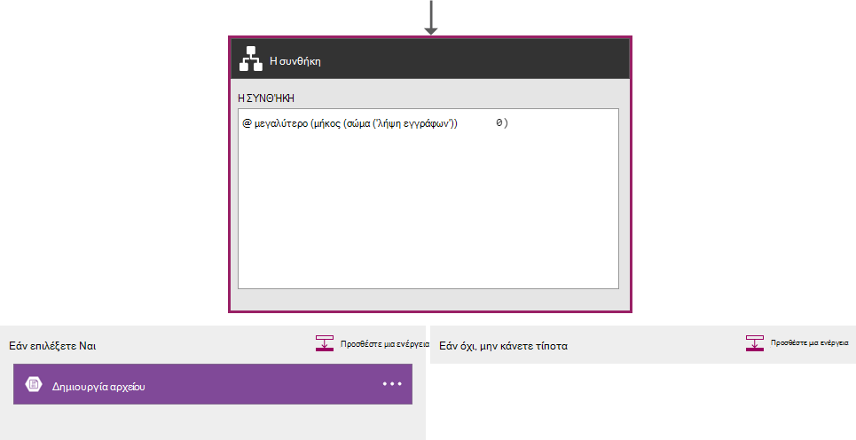

> [AZURE.NOTE] Μπορείτε επίσης να έχετε τη δυνατότητα να εισαγάγετε τα πάντα σε προβολή κώδικα.

Ας ρίξουμε μια ματιά στο την ολοκληρωμένη εφαρμογή λογικής σε προβολή κώδικα.  

```JSON
   
    "$schema": "https://schema.management.azure.com/providers/Microsoft.Logic/schemas/2015-08-01-preview/workflowdefinition.json#",
    "actions": {
        "Conversion": {
            "conditions": [
                {
                    "dependsOn": "GetUtcDate"
                }
            ],
            "inputs": {
                "method": "post",
                "queries": {
                    "currentdateTime": "@{body('GetUtcDate')}"
                },
                "uri": "https://docdbnotificationapi-debug.azurewebsites.net/api/Conversion"
            },
            "metadata": {
                "apiDefinitionUrl": "https://docdbnotificationapi-debug.azurewebsites.net/swagger/docs/v1",
                "swaggerSource": "custom"
            },
            "type": "Http"
        },
        "Createfile": {
            "conditions": [
                {
                    "expression": "@greater(length(body('GetDocuments')), 0)"
                },
                {
                    "dependsOn": "GetDocuments"
                }
            ],
            "inputs": {
                "body": "@body('GetDocuments')",
                "host": {
                    "api": {
                        "runtimeUrl": "https://logic-apis-westus.azure-apim.net/apim/azureblob"
                    },
                    "connection": {
                        "name": "@parameters('$connections')['azureblob']['connectionId']"
                    }
                },
                "method": "post",
                "path": "/datasets/default/files",
                "queries": {
                    "folderPath": "/patients",
                    "name": "Patient_@{guid()}.json"
                }
            },
            "type": "ApiConnection"
        },
        "GetDocuments": {
            "conditions": [
                {
                    "dependsOn": "Conversion"
                }
            ],
            "inputs": {
                "method": "post",
                "queries": {
                    "unixTimeStamp": "@body('Conversion')"
                },
                "uri": "https://docdbnotificationapi-debug.azurewebsites.net/api/Patient"
            },
            "metadata": {
                "apiDefinitionUrl": "https://docdbnotificationapi-debug.azurewebsites.net/swagger/docs/v1",
                "swaggerSource": "custom"
            },
            "type": "Http"
        },
        "GetUtcDate": {
            "conditions": [],
            "inputs": {
                "method": "get",
                "queries": {
                    "hoursBack": "@{int(triggerBody()['GetUtcDate_HoursBack'])}"
                },
                "uri": "https://docdbnotificationapi-debug.azurewebsites.net/api/Authorization"
            },
            "metadata": {
                "apiDefinitionUrl": "https://docdbnotificationapi-debug.azurewebsites.net/swagger/docs/v1",
                "swaggerSource": "custom"
            },
            "type": "Http"
        },
        "sendMail": {
            "conditions": [
                {
                    "dependsOn": "GetDocuments"
                }
            ],
            "inputs": {
                "body": "api_user=@{triggerBody()['sendgridUsername']}&api_key=@{triggerBody()['sendgridPassword']}&from=@{parameters('fromAddress')}&to=@{triggerBody()['EmailTo']}&subject=@{triggerBody()['Subject']}&text=@{int(length(body('GetDocuments')))} Documents Found",
                "headers": {
                    "Content-type": "application/x-www-form-urlencoded"
                },
                "method": "POST",
                "uri": "https://api.sendgrid.com/api/mail.send.json"
            },
            "type": "Http"
        }
    },
    "contentVersion": "1.0.0.0",
    "outputs": {
        "Results": {
            "type": "String",
            "value": "@{int(length(body('GetDocuments')))} Records Found"
        }
    },
    "parameters": {
        "$connections": {
            "defaultValue": {},
            "type": "Object"
        },
        "fromAddress": {
            "defaultValue": "user@msn.com",
            "type": "String"
        },
        "toAddress": {
            "defaultValue": "XXXXX@XXXXXXX.net",
            "type": "String"
        }
    },
    "triggers": {
        "manual": {
            "inputs": {
                "schema": {
                    "properties": {},
                    "required": [],
                    "type": "object"
                }
            },
            "type": "Manual"
        }
    
```

Εάν δεν είστε εξοικειωμένοι με το τι αντιπροσωπεύει το διαφορετικές ενότητες στον κώδικα, μπορείτε να προβάλετε την τεκμηρίωση [Definition Language λογική εφαρμογής ροής εργασίας](http://aka.ms/logicappsdocs) .

Για αυτήν τη ροή εργασίας που χρησιμοποιούν ένα [Έναυσμα Webhook HTTP](https://sendgrid.com/blog/whats-webhook/). Αν κοιτάξετε τον παραπάνω κώδικα, θα δείτε τις παραμέτρους όπως το παρακάτω παράδειγμα.

```C#

    =@{triggerBody()['Subject']}

```

Το `triggerBody()` αντιπροσωπεύει τις παραμέτρους που περιλαμβάνονται στο σώμα του μια ΚΑΤΑΧΏΡΗΣΗ ΥΠΌΛΟΙΠΟ για να το REST API λογική εφαρμογής. Το `()['Subject']` αντιπροσωπεύει το πεδίο. Όλες αυτές οι παράμετροι που απαρτίζουν το JSON μορφοποιηθεί σώμα. 

> [AZURE.NOTE] Χρησιμοποιώντας ένα άγκιστρο Web, μπορείτε να έχετε πλήρη πρόσβαση στην κεφαλίδα και το κυρίως κείμενο της αίτησης του εναύσματος. Σε αυτήν την εφαρμογή που θέλετε στο σώμα.

Όπως προαναφέρθηκε, μπορείτε να χρησιμοποιήσετε το εργαλείο σχεδίασης για να εκχωρήσετε παραμέτρους ή να το κάνετε στην προβολή κώδικα.
Εάν το κάνετε αυτό στην προβολή code, στη συνέχεια, μπορείτε να καθορίσετε τις ιδιότητες που απαιτεί μια τιμή, όπως φαίνεται στο ακόλουθο δείγμα κώδικα. 

```JSON

    "triggers": {
        "manual": {
            "inputs": {
            "schema": {
                "properties": {
            "Subject": {
                "type" : "String"   

            }
            },
                "required": [
            "Subject"
                 ],
                "type": "object"
            }
            },
            "type": "Manual"
        }
        }
```

Τι κάνετε δημιουργεί ένα σχήμα JSON που θα περάσουν σε από το σώμα της ΚΑΤΑΧΏΡΗΣΗΣ HTTP.
Για να ξεκινήσετε το έναυσμα, χρειάζεστε μια διεύθυνση URL επιστροφής κλήσης.  Θα μάθετε πώς μπορείτε να δημιουργήσετε το αργότερα από το πρόγραμμα εκμάθησης.  

## <a name="actions"></a>Ενέργειες
Ας δούμε Τι σημαίνει κάθε ενέργεια στην εφαρμογή μας λογικής.

### <a name="getutcdate"></a>GetUTCDate

**Προβολή σχεδίασης**

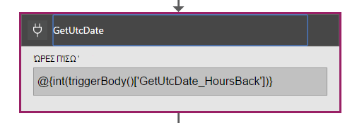

**Προβολή κώδικα**

```JSON

    "GetUtcDate": {
            "conditions": [],
            "inputs": {
            "method": "get",
            "queries": {
                "hoursBack": "@{int(triggerBody()['GetUtcDate_HoursBack'])}"
            },
            "uri": "https://docdbnotificationapi-debug.azurewebsites.net/api/Authorization"
            },
            "metadata": {
            "apiDefinitionUrl": "https://docdbnotificationapi-debug.azurewebsites.net/swagger/docs/v1"
            },
            "type": "Http"
        },

```

Αυτή η ενέργεια HTTP εκτελεί μια λειτουργία ΛΉΨΗ.  Καλεί τη μέθοδο GetUtcDate Εφαρμογή API. Το Uri χρησιμοποιεί την ιδιότητα 'GetUtcDate_HoursBack' περνά στο κύριο σώμα του εναύσματος.  Η τιμή 'GetUtcDate_HoursBack' έχει οριστεί στην πρώτη εφαρμογή λογικής. Θα μάθετε περισσότερα σχετικά με την εφαρμογή λογικής έναυσμα αργότερα στην εκμάθηση.

Αυτή η ενέργεια κλήσεις την εφαρμογή σας API για να επιστρέψει την τιμή συμβολοσειράς UTC ημερομηνία.

#### <a name="operations"></a>Λειτουργίες

**Αίτηση**

```JSON

    {
        "uri": "https://docdbnotificationapi-debug.azurewebsites.net/api/Authorization",
        "method": "get",
        "queries": {
          "hoursBack": "24"
        }
    }

```

**Απόκριση**

```JSON

    {
        "statusCode": 200,
        "headers": {
          "pragma": "no-cache",
          "cache-Control": "no-cache",
          "date": "Fri, 26 Feb 2016 15:47:33 GMT",
          "server": "Microsoft-IIS/8.0",
          "x-AspNet-Version": "4.0.30319",
          "x-Powered-By": "ASP.NET"
        },
        "body": "Fri, 15 Jan 2016 23:47:33 GMT"
    }

```

Το επόμενο βήμα είναι να μετατρέψετε την τιμή ημερομηνίας/ώρας UTC για τη χρονική σήμανση Unix, που είναι ένας τύπος διπλά .NET.

### <a name="conversion"></a>Μετατροπή

##### <a name="designer-view"></a>Προβολή σχεδίασης

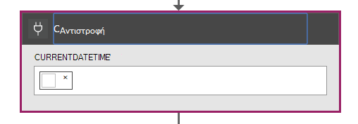

##### <a name="code-view"></a>Προβολή κώδικα

```JSON

    "Conversion": {
        "conditions": [
        {
            "dependsOn": "GetUtcDate"
        }
        ],
        "inputs": {
        "method": "post",
        "queries": {
            "currentDateTime": "@{body('GetUtcDate')}"
        },
        "uri": "https://docdbnotificationapi-debug.azurewebsites.net/api/Conversion"
        },
        "metadata": {
        "apiDefinitionUrl": "https://docdbnotificationapi-debug.azurewebsites.net/swagger/docs/v1"
        },
        "type": "Http"
    },

```

Σε αυτό το βήμα περάσετε την τιμή που επιστρέφεται από το GetUTCDate.  Υπάρχει μια συνθήκη dependsOn, γεγονός που σημαίνει ότι η ενέργεια GetUTCDate πρέπει να ολοκληρωθεί με επιτυχία. Εάν όχι, στη συνέχεια, παραλείπεται αυτή η ενέργεια. 

Αυτή η ενέργεια κλήσεις σας εφαρμογή API για να χειριστείτε τη μετατροπή.

#### <a name="operations"></a>Λειτουργίες

##### <a name="request"></a>Αίτηση

```JSON

    {
        "uri": "https://docdbnotificationapi-debug.azurewebsites.net/api/Conversion",
        "method": "post",
        "queries": {
        "currentDateTime": "Fri, 15 Jan 2016 23:47:33 GMT"
        }
    }   
```

##### <a name="response"></a>Απόκριση

```JSON

    {
        "statusCode": 200,
        "headers": {
          "pragma": "no-cache",
          "cache-Control": "no-cache",
          "date": "Fri, 26 Feb 2016 15:47:33 GMT",
          "server": "Microsoft-IIS/8.0",
          "x-AspNet-Version": "4.0.30319",
          "x-Powered-By": "ASP.NET"
        },
        "body": 1452901653
    }
```

Στην επόμενη ενέργεια, θα μπορείτε να κάνετε μια λειτουργία ΔΗΜΟΣΊΕΥΣΗ μας εφαρμογή API.

### <a name="getdocuments"></a>GetDocuments 

##### <a name="designer-view"></a>Προβολή σχεδίασης


##### <a name="code-view"></a>Προβολή κώδικα

```JSON

    "GetDocuments": {
        "conditions": [
        {
            "dependsOn": "Conversion"
        }
        ],
        "inputs": {
        "method": "post",
        "queries": {
            "unixTimeStamp": "@{body('Conversion')}"
        },
        "uri": "https://docdbnotificationapi-debug.azurewebsites.net/api/Patient"
        },
        "metadata": {
        "apiDefinitionUrl": "https://docdbnotificationapi-debug.azurewebsites.net/swagger/docs/v1"
        },
        "type": "Http"
    },

```

Για την ενέργεια GetDocuments που πρόκειται να μεταβιβάσετε στο σώμα απάντηση από την ενέργεια μετατροπής. Αυτή είναι μια παράμετρος στο Uri:

 
```C#

    unixTimeStamp=@{body('Conversion')}

```

Η ενέργεια QueryDocuments κάνει μια λειτουργία HTTP ΔΗΜΟΣΊΕΥΣΗ στην εφαρμογή API. 

Η μέθοδος που ονομάζεται είναι **QueryForNewPatientDocuments**.

#### <a name="operations"></a>Λειτουργίες

##### <a name="request"></a>Αίτηση

```JSON

    {
        "uri": "https://docdbnotificationapi-debug.azurewebsites.net/api/Patient",
        "method": "post",
        "queries": {
        "unixTimeStamp": "1452901653"
        }
    }
```

##### <a name="response"></a>Απόκριση

```JSON

    {
        "statusCode": 200,
        "headers": {
        "pragma": "no-cache",
        "cache-Control": "no-cache",
        "date": "Fri, 26 Feb 2016 15:47:35 GMT",
        "server": "Microsoft-IIS/8.0",
        "x-AspNet-Version": "4.0.30319",
        "x-Powered-By": "ASP.NET"
        },
        "body": [
        {
            "id": "xcda",
            "_rid": "vCYLAP2k6gAXAAAAAAAAAA==",
            "_self": "dbs/vCYLAA==/colls/vCYLAP2k6gA=/docs/vCYLAP2k6gAXAAAAAAAAAA==/",
            "_ts": 1454874620,
            "_etag": "\"00007d01-0000-0000-0000-56b79ffc0000\"",
            "resourceType": "Patient",
            "text": {
            "status": "generated",
            "div": "<div>\n      \n      <p>Henry Levin the 7th</p>\n    \n    </div>"
            },
            "identifier": [
            {
                "use": "usual",
                "type": {
                "coding": [
                    {
                    "system": "http://hl7.org/fhir/v2/0203",
                    "code": "MR"
                    }
                ]
                },
                "system": "urn:oid:2.16.840.1.113883.19.5",
                "value": "12345"
            }
            ],
            "active": true,
            "name": [
            {
                    "family": [
                        "Levin"
                    ],
                    "given": [
                        "Henry"
                    ]
                }
            ],
            "gender": "male",
            "birthDate": "1932-09-24",
            "managingOrganization": {
                "reference": "Organization/2.16.840.1.113883.19.5",
                "display": "Good Health Clinic"
            }
        },

```

Η επόμενη ενέργεια είναι να αποθηκεύσετε τα έγγραφα με το [χώρο αποθήκευσης Azure ιστολογίου](https://azure.microsoft.com/services/storage/). 

> [AZURE.NOTE] Χώρος αποθήκευσης αντικειμένων blob απαιτεί ένα λογαριασμό αποθήκευσης Azure. Πρέπει να προμήθεια λογαριασμού χώρου αποθήκευσης αντικειμένων Blob του Azure και να προσθέσετε ένα νέο Blob που ονομάζεται ασθενών. Για περισσότερες πληροφορίες, ανατρέξτε στο θέμα [Γρήγορα αποτελέσματα με το χώρο αποθήκευσης αντικειμένων Blob του Azure](../storage/storage-dotnet-how-to-use-blobs.md).

### <a name="create-file"></a>Δημιουργία αρχείου

##### <a name="designer-view"></a>Προβολή σχεδίασης

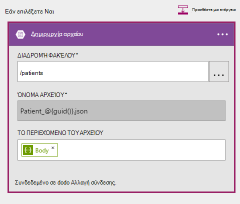

##### <a name="code-view"></a>Προβολή κώδικα

```JSON

    {
    "host": {
        "api": {
            "runtimeUrl": "https://logic-apis-westus.azure-apim.net/apim/azureblob"
        },
        "connection": {
            "name": "subscriptions/fxxxxxc079-4e5d-b002-xxxxxxxxxx/resourceGroups/Api-Default-Central-US/providers/Microsoft.Web/connections/azureblob"
        }
    },
    "method": "post",
    "path": "/datasets/default/files",
    "queries": {
        "folderPath": "/patients",
        "name": "Patient_17513174-e61d-4b56-88cb-5cf383db4430.json"
    },
    "body": [
        {
            "id": "xcda",
            "_rid": "vCYLAP2k6gAXAAAAAAAAAA==",
            "_self": "dbs/vCYLAA==/colls/vCYLAP2k6gA=/docs/vCYLAP2k6gAXAAAAAAAAAA==/",
            "_ts": 1454874620,
            "_etag": "\"00007d01-0000-0000-0000-56b79ffc0000\"",
            "resourceType": "Patient",
            "text": {
                "status": "generated",
                "div": "<div>\n      \n      <p>Henry Levin the 7th</p>\n    \n    </div>"
            },
            "identifier": [
                {
                    "use": "usual",
                    "type": {
                        "coding": [
                            {
                                "system": "http://hl7.org/fhir/v2/0203",
                                "code": "MR"
                            }
                        ]
                    },
                    "system": "urn:oid:2.16.840.1.113883.19.5",
                    "value": "12345"
                }
            ],
            "active": true,
            "name": [
                {
                    "family": [
                        "Levin"
                    ],
                    "given": [
                        "Henry"
                    ]
                }
            ],
            "gender": "male",
            "birthDate": "1932-09-24",
            "managingOrganization": {
                "reference": "Organization/2.16.840.1.113883.19.5",
                "display": "Good Health Clinic"
            }
        },

```

Ο κώδικας δημιουργείται από ενέργεια στη σχεδίαση. Δεν χρειάζεται να τροποποιήσετε τον κώδικα.

Εάν δεν είστε εξοικειωμένοι με τη χρήση του API αντικειμένων Blob του Azure, ανατρέξτε στο θέμα [Γρήγορα αποτελέσματα με το χώρο αποθήκευσης αντικειμένων blob του Azure API](../connectors/connectors-create-api-azureblobstorage.md).

#### <a name="operations"></a>Λειτουργίες

##### <a name="request"></a>Αίτηση

```JSON

    "host": {
        "api": {
            "runtimeUrl": "https://logic-apis-westus.azure-apim.net/apim/azureblob"
        },
        "connection": {
            "name": "subscriptions/fxxxxxc079-4e5d-b002-xxxxxxxxxx/resourceGroups/Api-Default-Central-US/providers/Microsoft.Web/connections/azureblob"
        }
    },
    "method": "post",
    "path": "/datasets/default/files",
    "queries": {
        "folderPath": "/patients",
        "name": "Patient_17513174-e61d-4b56-88cb-5cf383db4430.json"
    },
    "body": [
        {
            "id": "xcda",
            "_rid": "vCYLAP2k6gAXAAAAAAAAAA==",
            "_self": "dbs/vCYLAA==/colls/vCYLAP2k6gA=/docs/vCYLAP2k6gAXAAAAAAAAAA==/",
            "_ts": 1454874620,
            "_etag": "\"00007d01-0000-0000-0000-56b79ffc0000\"",
            "resourceType": "Patient",
            "text": {
                "status": "generated",
                "div": "<div>\n      \n      <p>Henry Levin the 7th</p>\n    \n    </div>"
            },
            "identifier": [
                {
                    "use": "usual",
                    "type": {
                        "coding": [
                            {
                                "system": "http://hl7.org/fhir/v2/0203",
                                "code": "MR"
                            }
                        ]
                    },
                    "system": "urn:oid:2.16.840.1.113883.19.5",
                    "value": "12345"
                }
            ],
            "active": true,
            "name": [
                {
                    "family": [
                        "Levin"
                    ],
                    "given": [
                        "Henry"
                    ]
                }
            ],
            "gender": "male",
            "birthDate": "1932-09-24",
            "managingOrganization": {
                "reference": "Organization/2.16.840.1.113883.19.5",
                "display": "Good Health Clinic"
            }
        },….


```

##### <a name="response"></a>Απόκριση

```JSON

    {
        "statusCode": 200,
        "headers": {
        "pragma": "no-cache",
        "x-ms-request-id": "2b2f7c57-2623-4d71-8e53-45c26b30ea9d",
        "cache-Control": "no-cache",
        "date": "Fri, 26 Feb 2016 15:47:36 GMT",
        "set-Cookie": "ARRAffinity=29e552cea7db23196f7ffa644003eaaf39bc8eb6dd555511f669d13ab7424faf;Path=/;Domain=127.0.0.1",
        "server": "Microsoft-HTTPAPI/2.0",
        "x-AspNet-Version": "4.0.30319",
        "x-Powered-By": "ASP.NET"
        },
        "body": {
        "Id": "0B0nBzHyMV-_NRGRDcDNMSFAxWFE",
        "Name": "Patient_47a2a0dc-640d-4f01-be38-c74690d085cb.json",
        "DisplayName": "Patient_47a2a0dc-640d-4f01-be38-c74690d085cb.json",
        "Path": "/Patient/Patient_47a2a0dc-640d-4f01-be38-c74690d085cb.json",
        "LastModified": "2016-02-26T15:47:36.215Z",
        "Size": 65647,
        "MediaType": "application/octet-stream",
        "IsFolder": false,
        "ETag": "\"c-g_a-1OtaH-kNQ4WBoXLp3Zv9s/MTQ1NjUwMTY1NjIxNQ\"",
        "FileLocator": "0B0nBzHyMV-_NRGRDcDNMSFAxWFE"
        }
    }
```

Το τελευταίο βήμα είναι να στείλετε μια ειδοποίηση ηλεκτρονικού ταχυδρομείου

### <a name="sendemail"></a>αποστολή ηλεκτρονικής αλληλογραφίας

##### <a name="designer-view"></a>Προβολή σχεδίασης

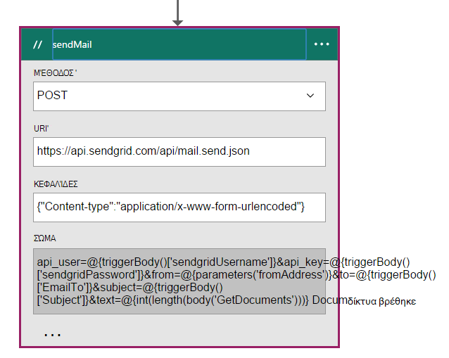

##### <a name="code-view"></a>Προβολή κώδικα

```JSON


    "sendMail": {
        "conditions": [
        {
            "dependsOn": "GetDocuments"
        }
        ],
        "inputs": {
        "body": "api_user=@{triggerBody()['sendgridUsername']}&api_key=@{triggerBody()['sendgridPassword']}&from=@{parameters('fromAddress')}&to=@{triggerBody()['EmailTo']}&subject=@{triggerBody()['Subject']}&text=@{int(length(body('GetDocuments')))} Documents Found",
        "headers": {
            "Content-type": "application/x-www-form-urlencoded"
        },
        "method": "POST",
        "uri": "https://api.sendgrid.com/api/mail.send.json"
        },
        "type": "Http"
    }
```

Σε αυτήν την ενέργεια μπορείτε να στείλετε μια ειδοποίηση ηλεκτρονικού ταχυδρομείου.  Χρησιμοποιείτε [SendGrid](https://sendgrid.com/marketing/sendgrid-services?cvosrc=PPC.Bing.sendgrib&cvo_cid=SendGrid%20-%20US%20-%20Brand%20-%20&mc=Paid%20Search&mcd=BingAds&keyword=sendgrib&network=o&matchtype=e&mobile=&content=&search=1&utm_source=bing&utm_medium=cpc&utm_term=%5Bsendgrib%5D&utm_content=%21acq%21v2%2134335083397-8303227637-1649139544&utm_campaign=SendGrid+-+US+-+Brand+-+%28English%29).   

Τον κώδικα για αυτό δημιουργήθηκε χρησιμοποιώντας ένα πρότυπο για εφαρμογή λογικής και SendGrid που βρίσκεται στο [αποθετήριο δεδομένων Github 101-λογικής-εφαρμογή-sendgrid](https://github.com/Azure/azure-quickstart-templates/tree/master/101-logic-app-sendgrid).
 
Η λειτουργία HTTP είναι μια ΚΑΤΑΧΏΡΗΣΗ. 

Οι παράμετροι εξουσιοδότησης είναι στις ιδιότητες εναυσμάτων

```JSON

    },
        "sendgridPassword": {
             "type": "SecureString"
         },
         "sendgridUsername": {
            "type": "String"
         }

        In addition, other parameters are static values set in the Parameters section of the Logic App. These are:
        },
        "toAddress": {
            "defaultValue": "XXXX@XXXX.com",
            "type": "String"
        },
        "fromAddress": {
            "defaultValue": "XXX@msn.com",
            "type": "String"
        },
        "emailBody": {
            "defaultValue": "@{string(concat(int(length(actions('QueryDocuments').outputs.body)) Records Found),'/n', actions('QueryDocuments').outputs.body)}",
            "type": "String"
        },

```

Το emailBody είναι συνένωση τον αριθμό των εγγράφων που επιστρέφονται από το ερώτημα, το οποίο μπορεί να είναι "0" ή περισσότερα, μαζί με, "Βρέθηκε εγγραφών". Τα υπόλοιπα οι παράμετροι έχουν οριστεί από τις παραμέτρους έναυσμα.

Αυτή η ενέργεια εξαρτάται από την ενέργεια **GetDocuments** .

#### <a name="operations"></a>Λειτουργίες

##### <a name="request"></a>Αίτηση
```JSON

    {
        "uri": "https://api.sendgrid.com/api/mail.send.json",
        "method": "POST",
        "headers": {
        "Content-type": "application/x-www-form-urlencoded"
        },
        "body": "api_user=azureuser@azure.com&api_key=Biz@Talk&from=user@msn.com&to=XXXX@XXXX.com&subject=New Patients&text=37 Documents Found"
    }

```

##### <a name="response"></a>Απόκριση

```JSON

    {
        "statusCode": 200,
        "headers": {
        "connection": "keep-alive",
        "x-Frame-Options": "DENY,DENY",
        "access-Control-Allow-Origin": "https://sendgrid.com",
        "date": "Fri, 26 Feb 2016 15:47:35 GMT",
        "server": "nginx"
        },
        "body": {
        "message": "success"
        }
    }
```

Τέλος που θέλετε να έχετε τη δυνατότητα να δείτε τα αποτελέσματα από την εφαρμογή λογικής στην πύλη του Azure. Για να το κάνετε αυτό, μπορείτε να προσθέσετε μια παράμετρο στην ενότητα εξόδους.


```JSON

    "outputs": {
        "Results": {
            "type": "String",
            "value": "@{int(length(actions('QueryDocuments').outputs.body))} Records Found"
        }

```

Αυτή η διαδικασία επιστρέφει την ίδια τιμή που αποστέλλεται στο κύριο σώμα του μηνύματος ηλεκτρονικού ταχυδρομείου. Η παρακάτω εικόνα παρουσιάζει ένα παράδειγμα όπου 29 εγγραφών "Εύρεση".

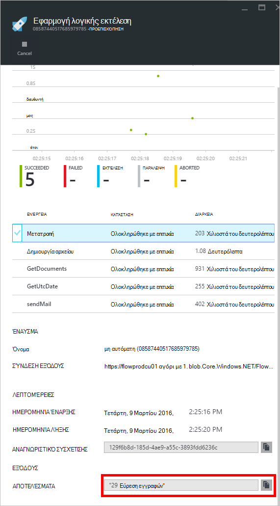

## <a name="metrics"></a>Μετρήσεις
Μπορείτε να ρυθμίσετε τις παραμέτρους παρακολούθησης για την κύρια εφαρμογή λογικής στην πύλη. Αυτό σας επιτρέπει να προβάλετε το λανθάνων χρόνος εκτέλεσης και άλλα συμβάντα όπως εμφανίζονται στην παρακάτω εικόνα.

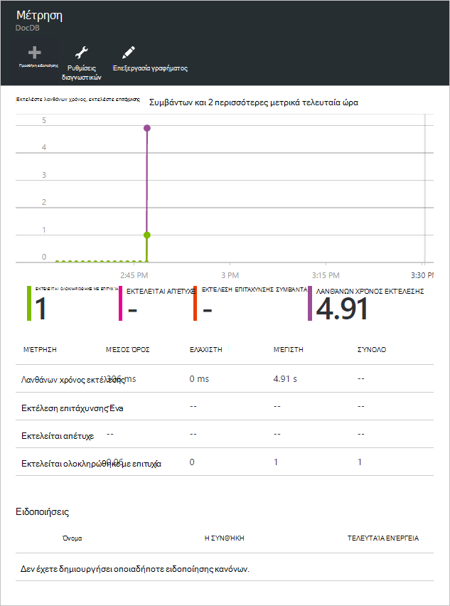

## <a name="docdb-trigger"></a>Έναυσμα DocDb

Αυτή η εφαρμογή λογικής είναι το έναυσμα που ξεκινά τη ροή εργασίας στην εφαρμογή σας κύριο λογικής.

Η παρακάτω εικόνα δείχνει την προβολή σχεδίασης.

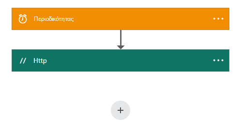

```JSON

    {
        "$schema": "https://schema.management.azure.com/providers/Microsoft.Logic/schemas/2015-08-01-preview/workflowdefinition.json#",
        "actions": {
        "Http": {
            "conditions": [],
            "inputs": {
            "body": {
                "EmailTo": "XXXXXX@XXXXX.net",
                "GetUtcDate_HoursBack": "24",
                "Subject": "New Patients",
                "sendgridPassword": "********",
                "sendgridUsername": "azureuser@azure.com"
            },
            "method": "POST",
            "uri": "https://prod-01.westus.logic.azure.com:443/workflows/12a1de57e48845bc9ce7a247dfabc887/triggers/manual/run?api-version=2015-08-01-preview&sp=%2Ftriggers%2Fmanual%2Frun&sv=1.0&sig=ObTlihr529ATIuvuG-dhxOgBL4JZjItrvPQ8PV6973c"
            },
            "type": "Http"
        }
        },
        "contentVersion": "1.0.0.0",
        "outputs": {
        "Results": {
            "type": "String",
            "value": "@{body('Http')['status']}"
        }
        },
        "parameters": {},
        "triggers": {
        "recurrence": {
            "recurrence": {
            "frequency": "Hour",
            "interval": 24
            },
            "type": "Recurrence"
        }
        }
    }

```

Ορίστε το έναυσμα για περιοδικότητας των 24 ωρών. Η ενέργεια είναι μια ΔΗΜΟΣΊΕΥΣΗ HTTP που χρησιμοποιεί τη διεύθυνση URL επιστροφής κλήσης για την κύρια εφαρμογή λογικής. Το κυρίως κείμενο περιέχει τις παραμέτρους που καθορίζονται στο σχήμα JSON. 

#### <a name="operations"></a>Λειτουργίες

##### <a name="request"></a>Αίτηση

```JSON

    {
        "uri": "https://prod-01.westus.logic.azure.com:443/workflows/12a1de57e48845bc9ce7a247dfabc887/triggers/manual/run?api-version=2015-08-01-preview&sp=%2Ftriggers%2Fmanual%2Frun&sv=1.0&sig=ObTlihr529ATIuvuG-dhxOgBL4JZjItrvPQ8PV6973c",
        "method": "POST",
        "body": {
        "EmailTo": "XXXXXX@XXXXX.net",
        "GetUtcDate_HoursBack": "24",
        "Subject": "New Patients",
        "sendgridPassword": "********",
        "sendgridUsername": "azureuser@azure.com"
        }
    }

```

##### <a name="response"></a>Απόκριση

```JSON

    {
        "statusCode": 202,
        "headers": {
        "pragma": "no-cache",
        "x-ms-ratelimit-remaining-workflow-writes": "7486",
        "x-ms-ratelimit-burst-remaining-workflow-writes": "1248",
        "x-ms-request-id": "westus:2d440a39-8ba5-4a9c-92a6-f959b8d2357f",
        "cache-Control": "no-cache",
        "date": "Thu, 25 Feb 2016 21:01:06 GMT"
        }
    }
```

Τώρα ας ρίξουμε μια ματιά στην εφαρμογή API.

## <a name="docdbnotificationapi"></a>DocDBNotificationApi

Παρόλο που υπάρχουν περισσότερες από μία εργασίες στην εφαρμογή, μπορείτε μόνο πρόκειται να χρησιμοποιήσετε τρεις.

* GetUtcDate
* ConvertToTimeStamp
* QueryForNewPatientDocuments

### <a name="docdbnotificationapi-operations"></a>Λειτουργίες DocDBNotificationApi
Ας ρίξουμε μια ματιά στην τεκμηρίωση της Swagger

> [AZURE.NOTE] Για να μπορείτε να καλέσετε τις λειτουργίες εξωτερικά, πρέπει να προσθέσετε μια CORS επιτρεπόμενη τιμή origin "*" (χωρίς τα εισαγωγικά) στις ρυθμίσεις της εφαρμογής σας API, όπως φαίνεται στην παρακάτω εικόνα.

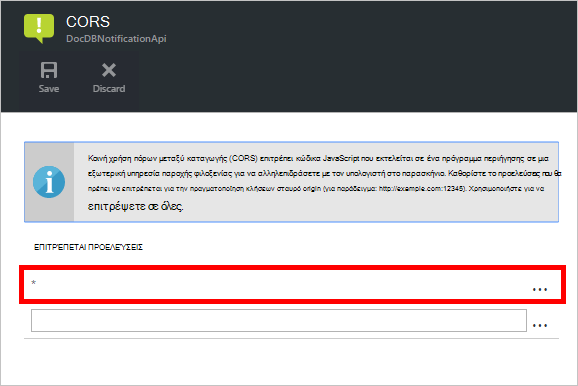

#### <a name="getutcdate"></a>GetUtcDate

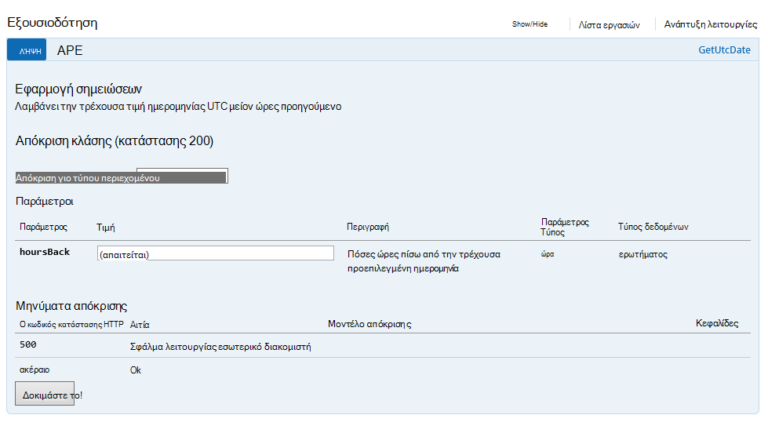

#### <a name="converttotimestamp"></a>ConvertToTimeStamp

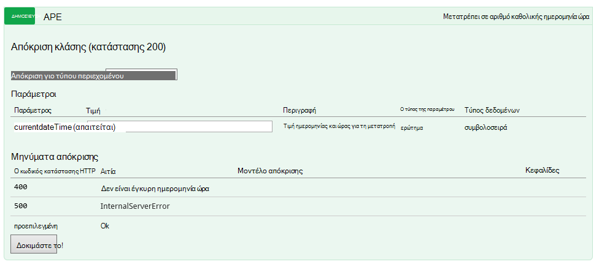

#### <a name="queryfornewpatientdocuments"></a>QueryForNewPatientDocuments

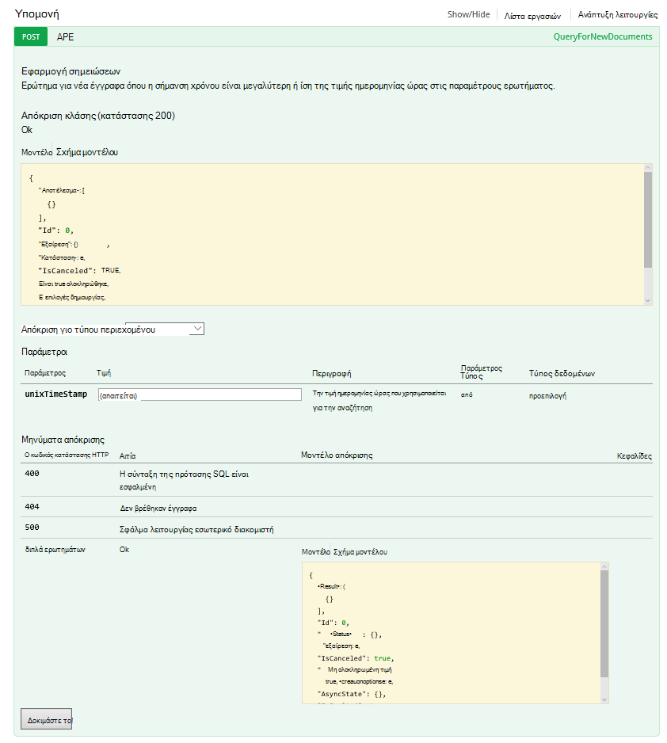

Ας ρίξουμε μια ματιά τον κώδικα πίσω από αυτήν τη λειτουργία.

#### <a name="getutcdate"></a>GetUtcDate

```C#

    /// <summary>
    /// Gets the current UTC Date value
    /// </summary>
    /// <returns></returns>
    [H ttpGet]
    [Metadata("GetUtcDate", "Gets the current UTC Date value minus the Hours Back")]
    [SwaggerOperation("GetUtcDate")]
    [SwaggerResponse(HttpStatusCode.OK, type: typeof (string))]
    [SwaggerResponse(HttpStatusCode.InternalServerError, "Internal Server Operation Error")]
    public string GetUtcDate(
       [Metadata("Hours Back", "How many hours back from the current Date Time")] int hoursBack)
    {


        return DateTime.UtcNow.AddHours(-hoursBack).ToString("r");
    }
```

Αυτή η λειτουργία επιστρέφει απλώς η επιστρέφει την τρέχουσα ημερομηνία/ώρα UTC μείον την τιμή HoursBack.

#### <a name="converttotimestamp"></a>ConvertToTimeStamp

``` C#

        /// <summary>
        ///     Converts DateTime to double
        /// </summary>
        /// <param name="currentdateTime"></param>
        /// <returns></returns>
        [Metadata("Converts Universal DateTime to number")]
        [SwaggerResponse(HttpStatusCode.OK, null, typeof (double))]
        [SwaggerResponse(HttpStatusCode.BadRequest, "DateTime is invalid")]
        [SwaggerResponse(HttpStatusCode.InternalServerError)]
        [SwaggerOperation(nameof(ConvertToTimestamp))]
        public double ConvertToTimestamp(
            [Metadata("currentdateTime", "DateTime value to convert")] string currentdateTime)
        {
            double result;

            try
            {
                var uncoded = HttpContext.Current.Server.UrlDecode(currentdateTime);

                var newDateTime = DateTime.Parse(uncoded);
                //create Timespan by subtracting the value provided from the Unix Epoch
                var span = newDateTime - new DateTime(1970, 1, 1, 0, 0, 0, 0).ToLocalTime();

                //return the total seconds (which is a UNIX timestamp)
                result = span.TotalSeconds;
            }
            catch (Exception e)
            {
                throw new Exception("unable to convert to Timestamp", e.InnerException);
            }

            return result;
        }

```

Αυτή η λειτουργία μετατρέπει την απάντηση από τη λειτουργία GetUtcDate σε μια διπλή τιμή.

#### <a name="queryfornewpatientdocuments"></a>QueryForNewPatientDocuments

```C#

        /// <summary>
        ///     Query for new Patient Documents
        /// </summary>
        /// <param name="unixTimeStamp"></param>
        /// <returns>IList</returns>
        [Metadata("QueryForNewDocuments",
            "Query for new Documents where the Timestamp is greater than or equal to the DateTime value in the query parameters."
            )]
        [SwaggerOperation("QueryForNewDocuments")]
        [SwaggerResponse(HttpStatusCode.OK, type: typeof (Task<IList<Document>>))]
        [SwaggerResponse(HttpStatusCode.BadRequest, "The syntax of the SQL Statement is incorrect")]
        [SwaggerResponse(HttpStatusCode.NotFound, "No Documents were found")]
        [SwaggerResponse(HttpStatusCode.InternalServerError, "Internal Server Operation Error")]
        // ReSharper disable once ConsiderUsingAsyncSuffix
        public IList<Document> QueryForNewPatientDocuments(
            [Metadata("UnixTimeStamp", "The DateTime value used to search from")] double unixTimeStamp)
        {
            var context = new DocumentDbContext();
            var filterQuery = string.Format(InvariantCulture, "SELECT * FROM Patient p WHERE p._ts >=  {0}",
                unixTimeStamp);
            var options = new FeedOptions {MaxItemCount = -1};


            var collectionLink = UriFactory.CreateDocumentCollectionUri(DocumentDbContext.DatabaseId,
                DocumentDbContext.CollectionId);

            var response =
                context.Client.CreateDocumentQuery<Document>(collectionLink, filterQuery, options).AsEnumerable();

            return response.ToList();
    }

```

Αυτή η λειτουργία χρησιμοποιεί το [DocumentDB.NET SDK](documentdb-sdk-dotnet.md) για να δημιουργήσετε ένα ερώτημα εγγράφου. 

```C#
     CreateDocumentQuery<Document>(collectionLink, filterQuery, options).AsEnumerable();
```

Η απόκριση από τη λειτουργία ConvertToTimeStamp (unixTimeStamp) μεταβιβάζεται σε. Η λειτουργία επιστρέφει μια λίστα με τα έγγραφα, `IList<Document>`.

Προηγουμένως θα σας συνομιλία σχετικά με το CallbackURL. Για να ξεκινήσετε τη ροή εργασίας στην εφαρμογή σας κύριο λογικής, θα πρέπει να καλέσετε χρησιμοποιώντας το CallbackURL.

## <a name="callbackurl"></a>CallbackURL

Για να ξεκινήσετε, θα χρειαστεί το Azure AD διακριτικού.  Μπορεί να είναι δύσκολο να λάβετε διακριτικού. Να αναζητάτε μια εύκολη μέθοδο και Jeff Hollan, που είναι ένας διαχειριστής πρόγραμμα εφαρμογής λογικής Azure, συνιστάται χρησιμοποιώντας το [armclient](http://blog.davidebbo.com/2015/01/azure-resource-manager-client.html) του PowerShell.  Μπορείτε να το εγκαταστήσετε ακολουθώντας τις οδηγίες που παρέχονται.

Οι λειτουργίες που θέλετε να χρησιμοποιήσετε είναι σύνδεσης και κλήση API ARM.
 
Σύνδεση: Χρησιμοποιείτε τα ίδια διαπιστευτήρια για τη σύνδεση με την πύλη Azure. 

Η λειτουργία κλήσεων Api ARM είναι εκείνη που θα δημιουργήσει το CallBackURL.

Στο PowerShell, καλείτε ως εξής:  

```powershell

    ArmClient.exe post https://management.azure.com/subscriptions/[YOUR SUBSCRIPTION ID/resourcegroups/[YOUR RESOURCE GROUP]/providers/Microsoft.Logic/workflows/[YOUR LOGIC APP NAME/triggers/manual/listcallbackurl?api-version=2015-08-01-preview

```

Το αποτέλεσμα θα πρέπει να μοιάζει ως εξής:

```powershell

    https://prod-02.westus.logic.azure.com:443/workflows/12a1de57e48845bc9ce7a247dfabc887/triggers/manual/run?api-version=2015-08-01-prevaiew&sp=%2Ftriggers%2Fmanual%2Frun&sv=1.0&sig=XXXXXXXXXXXXXXXXXXX

```

Μπορείτε να χρησιμοποιήσετε ένα εργαλείο, όπως [postman](http://www.getpostman.com/) για να ελέγξετε κύριο λογική εφαρμογής όπως φαίνεται στην παρακάτω εικόνα.

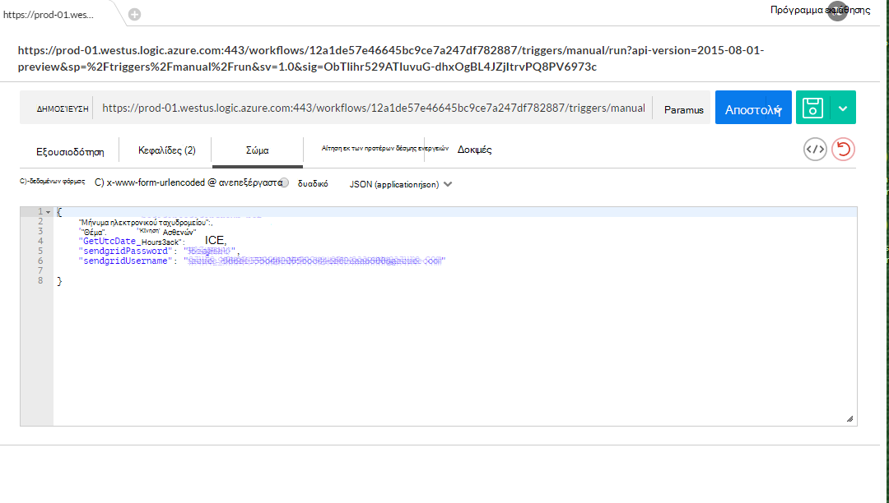

Ο παρακάτω πίνακας παραθέτει τις παραμέτρους έναυσμα που απαρτίζουν στο σώμα της εφαρμογής DocDB έναυσμα λογικής.

Παράμετρος | Περιγραφή 
--- | --- 
GetUtcDate_HoursBack | Χρησιμοποιείται για να ορίσετε τον αριθμό των ωρών για την ημερομηνία έναρξης της αναζήτησης
sendgridUsername | Χρησιμοποιείται για να ορίσετε τον αριθμό των ωρών για την ημερομηνία έναρξης της αναζήτησης
sendgridPassword | Το όνομα χρήστη για το ηλεκτρονικό ταχυδρομείο αποστολή πλέγματος
Ηλεκτρονικό ταχυδρομείο για να | Η διεύθυνση ηλεκτρονικού ταχυδρομείου που θα λάβουν την ειδοποίηση μέσω ηλεκτρονικού ταχυδρομείου
Θέμα | Το θέμα για το μήνυμα ηλεκτρονικού ταχυδρομείου

## <a name="viewing-the-patient-data-in-the-azure-blob-service"></a>Προβολή των ασθενών δεδομένων στην υπηρεσία αντικειμένων Blob του Azure

Μεταβείτε στο λογαριασμό σας χώρο αποθήκευσης Azure και επιλέξτε αντικείμενα BLOB στην περιοχή υπηρεσίες, όπως φαίνεται στην παρακάτω εικόνα.

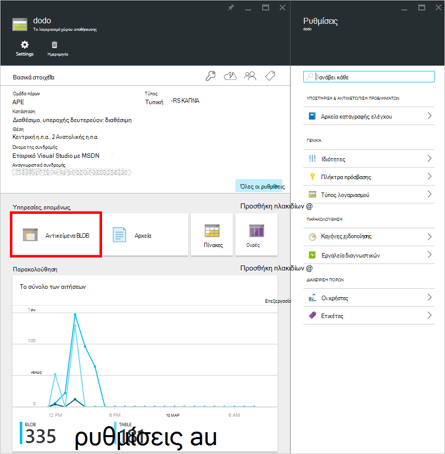 

Θα μπορούν να δουν τις πληροφορίες του αρχείου ασθενών blob, όπως φαίνεται παρακάτω.

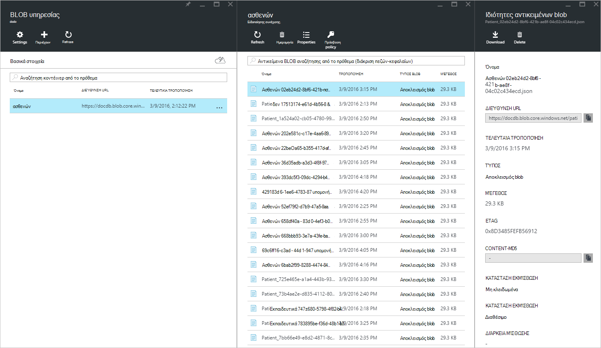


## <a name="summary"></a>Σύνοψη

Σε αυτές τις οδηγίες, μάθατε τα εξής:

* Είναι δυνατό να εφαρμόζετε ειδοποιήσεις στον DocumentDB.
* Με τη χρήση λογικής εφαρμογών, μπορείτε να αυτοματοποιήσετε τη διαδικασία.
* Με τη χρήση λογικής εφαρμογών, μπορείτε να μειώσετε το χρόνο που χρειάζεται για την παράδοση μιας εφαρμογής.
* Με τη χρήση HTTP που μπορεί να εκμετάλλευση εύκολη εφαρμογής API μέσα σε μια εφαρμογή λογικής.
* Μπορείτε να δημιουργήσετε εύκολα μια CallBackURL που αντικαθιστά της ακρόασης HTTP.
* Μπορείτε εύκολα να δημιουργήσετε προσαρμοσμένες ροές εργασιών με τη σχεδίαση εφαρμογών λογικής.

Το κλειδί είναι σχεδιασμού προς τα εμπρός και τη ροή εργασίας του μοντέλου.

## <a name="next-steps"></a>Επόμενα βήματα
Κάντε λήψη και χρήση του κώδικα εφαρμογής λογικής που παρέχονται στη [Github](https://github.com/HEDIDIN/DocDbNotifications). Μπορώ να προσκαλέσω να δημιουργήσετε σχετικά με την εφαρμογή και να υποβάλετε τις αλλαγές για να το repo. 

Για να μάθετε περισσότερα σχετικά με το DocumentDB, επισκεφθείτε τη [Διαδρομή εκμάθησης](https://azure.microsoft.com/documentation/learning-paths/documentdb/).
