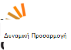

<properties
  pageTitle="DocumentDB Κοινότητας και συζητήσεων | Microsoft Azure"
  description="Συμμετοχή σε Κοινότητα Azure DocumentDB για να δημιουργήσετε σχέσεις, επιδεικνύουν την εργασία σας και πιο εύστοχα τις ικανότητές σας."
  services="documentdb"
  documentationCenter=""
  authors="aliuy"
  manager="johnmac"
  editor="mimig"/>

<tags
  ms.service="documentdb"
  ms.devlang="na"
  ms.topic="article"
  ms.tgt_pltfrm="na"
  ms.workload="data-services"
  ms.date="09/26/2016"
  ms.author="andrl"/>

# Πύλη Κοινότητας

## Ανάδειξη Κοινότητας

Επιτρέψτε μας να προωθήσετε το έργο σας! Εμφάνιση μας εκπληκτική έργου που εργάζεστε με DocumentDB και θα σας βοηθήσουμε κοινή χρήση σας genius με όλο τον κόσμο. Για να υποβάλετε το έργο σας, στείλτε μας ένα μήνυμα ηλεκτρονικού ταχυδρομείου στο: [askdocdb@microsoft.com](mailto:askdocdb@microsoft.com).

### documentdb-lumenize

*από τον Larry Maccherone*

Συναθροίσεις (Ομαδοποίηση κατά, Συγκεντρωτικού πίνακα και N διαστάσεων κύβου) και χρονισμού μετασχηματισμοί σειρά ως αποθηκευμένες διαδικασίες στο DocumentDB.

Δείτε το [Github](https://github.com/lmaccherone/documentdb-lumenize) και [npm](https://www.npmjs.com/package/lumenize).

### DocumentDB Studio

*με Liu Δημήτρης*

Ένα πρόγραμμα-πελάτη διαχείρισης προβολής/explorer για την υπηρεσία Microsoft Azure DocumentDB.

Δείτε το στην [Github](https://github.com/mingaliu/DocumentDBStudio).

### DoQmentDB

*με Ariel Mashraki*

DoQmentDB είναι ένα Node.js Υπόσχεση πρόγραμμα-πελάτη, που παρέχει ένα επίπεδο μοιάζει με MongoDB επάνω σε DocumentDB.

Δείτε το [Github](https://github.com/a8m/doqmentdb) και [npm](https://www.npmjs.com/package/doqmentdb).

### Swagger REST API για DocumentDB

*με Howard Edidin*

Ένα αρχείο DocumentDB REST API Swagger που μπορούν να αναπτυχθούν εύκολα ως εφαρμογής API.

Δείτε το στην [Github](https://github.com/HEDIDIN/DocumentDB-REST/tree/master/DocumentDBRestApi).

### documentdb Fluent προσθήκης

*με Yoichi Kawasaki*

Fluent προσθήκης documentdb είναι μια προσθήκη Fluentd για την παραγωγή των να Azure DocumentDB.

Δείτε το [Github](https://github.com/yokawasa/fluent-plugin-documentdb) και [rubygems](https://rubygems.org/gems/fluent-plugin-documentdb).

*Βρείτε περισσότερες Άνοιγμα αρχείου προέλευσης DocumentDB έργων σε [GitHub](https://github.com/search?p=4&q=documentdb&type=Repositories).*

## Ειδήσεις, ιστολόγια και άρθρα

Μπορείτε να παραμείνετε ενημερωμένο με τις πιο πρόσφατες ειδήσεις DocumentDB και δυνατότητες με [το ιστολόγιο του](https://azure.microsoft.com/blog/tag/documentdb/)παρακάτω.

**Δημοσιεύσεις Κοινότητα:**

- [**Ξεκινήστε κοινωνικών με DocumentDB**](https://blogs.msdn.microsoft.com/mvpawardprogram/2016/03/15/going-social-with-documentdb/) - *με Matias Quarantaas*

- [**UWP, τις υπηρεσίες εφαρμογών Azure και Σούπα DocumentDB: μια εφαρμογή κοινής χρήσης φωτογραφιών**](https://blogs.windows.com/buildingapps/2016/03/17/uwp-azure-app-services-and-documentdb-soup-a-photo-sharing-app/) - *από τον Langland*

- [**Ειδοποιήσεις για νέα ή τροποποιημένα πόρους DocumentDB χρήση λογικής εφαρμογών**](documentdb-change-notification.md) - *με Howard Edidin*

- [**Τη συλλογή αρχείων καταγραφής της DocumentDB Azure χρησιμοποιώντας fluent προσθήκης documentdb**](http://unofficialism.info/posts/collecting-logs-into-azure-documentdb-using-fluent-plugin-documentdb/) - *με Yoichi Kawasaki*

- [**DocumentDB επανεξετάζονται μέρος 1/2 – η θεωρία**](https://peterintheazuresky.wordpress.com/2016/02/19/documentdb-revisited-part-12-the-theory/) - *με Peter Mannerhult*

- [**Τι θα χαρούμε πολύ και θέλω σχετικά με την DocumentDB του Azure**](http://blog.falafel.com/4-what-to-love-and-hate-about-azures-documentdb/) - *με Saadeh Γιώργος*

- [**Azure DocumentDB διακομιστή δέσμες ενεργειών**](https://www.simple-talk.com/cloud/cloud-data/azure-documentdb-server-side-scripting/) - *με Robert Sheldon*

- [**Δέκτη DocumentDB ως δεδομένων για ανάλυση ροή Azure**](http://janatdevelopment.com/2015/12/11/documentdb-as-a-data-sink-for-azure-stream-analytics/?utm_source=twitterfeed&utm_medium=twitter) - *, Ιαν Hentschel*

- [**Azure DocumentDB παραγωγή!** ](http://blog.nexapp.ca/2015/11/30/azure-documentdb-in-production/)  -  *Alexandre Walsh και Duval στεμφύλων Olivier*

- [**Οι δεικτοδότες Azure αναζήτησης – DocumentDB ερωτήματα (Ισπανικά)**](http://www.ealsur.com.ar/wp/index.php/2015/11/19/azure-search-indexers-documentdb-queries/) - *με Matthias Quaranta*

- [**Azure DocumentDB SQL ερωτήματος βασικά στοιχεία (Ιαπωνικά)**](http://beachside.hatenablog.com/entry/2015/12/06/000045) - *με Atsushi Yokohama*

- [**Σημεία δεδομένων - Aurelia πληροί DocumentDB: Ταξίδι μια Matchmaker**](https://msdn.microsoft.com/magazine/mt620011.aspx) - *με Julie Lerman*

- [**Υποδομή ως κωδικό και συνεχούς ανάπτυξης ενός Node.js + Azure λύση DocumentDB**](http://www.talmeida.net/blog/2015/10/26/infrastructure-as-code-and-continuous-deployment-of-a-nodejs-azure-documentdb-solution) - *με Thiago Almedia*

- [**Γιατί DocumentDb έχει νόημα σωστές επιχειρηματικές για ορισμένα έργα**](http://www.iquestllc.com/blogs/read/405/why-documentdb-makes-good-business-sense-for-some-projects) - *με Samuel Uresin*

- [**Azure DocumentDB ανάπτυξης Μετακίνηση προς τα εμπρός – ανάπτυξη της κλάσης προγράμματος-πελάτη (1 από 2) (Ιαπωνικά)**](http://beachside.hatenablog.com/entry/2015/10/01/202734) - *με Atsushi Yokohama*

- [**Πράγματα που πρέπει να γνωρίζετε κατά τη χρήση Azure DocumentDB (Ιαπωνικά)**](http://beachside.hatenablog.com/entry/2015/10/01/202734) - *με Atsushi Yokohama*

- [**Χειρισμός σφαλμάτων RequestRateTooLarge σε Azure DocumentDB και να ελέγχετε τις επιδόσεις**](http://blogs.msdn.com/b/bigdatasupport/archive/2015/09/02/dealing-with-requestratetoolarge-errors-in-azure-documentdb-and-testing-documentdb-performance.aspx) - *με Azim Uddin*

- [**Σημεία δεδομένων - μια επισκόπηση του Microsoft Azure DocumentDB**](https://msdn.microsoft.com/magazine/mt147238.aspx) - *με Julie Lerman*

- [**Χρήση DocumentDB με F #**](https://jamessdixon.wordpress.com/2014/12/30/using-documentdb-with-f/) - *, ο Δημήτρης Dixon*

- [**Αρχεία καταγραφής εφαρμογών ανάλυσης με DocumentDB**](http://vincentlauzon.com/2015/09/06/analysing-application-logs-with-documentdb/) - *με Lauzon Βικέντιος Philippe*

- [**Azure DocumentDB – σημείο στο χρόνο δημιουργίας αντιγράφων ασφαλείας**](http://softwarejuancarlos.com/2015/09/06/azure-documentdb-point-in-time-backups/) - *με Sanchez Νάνσυ Χουάν*

*Έχετε μια δημοσίευση ιστολογίου, δείγματα κώδικα ή μελέτη περίπτωσης που θέλετε να κάνετε κοινή χρήση; [Ενημερώστε μας](mailto:askdocdb@microsoft.com)!*

## Εγγραφές και συμβάντα

### Πρόσφατες και προσεχή συμβάντα

| Όνομα συμβάντος                                                                                                                 | Ηχείο                                                     | Θέση             | Ημερομηνία                     | Hashtag |
| -------------------------------------------------------------------------------------------------------------------------- | ----------------------------------------------------------- | -------------------- | ------------------------ | ------- |
| [Αναφλέγονται 2016](https://myignite.microsoft.com/sessions?q=documentdb)  [Keynote: Ενεργοποίηση ψηφιακού μετασχηματισμό χρησιμοποιώντας υπερβολική αποτελεσματικότητα A.C.I.D με Joseph Sirosh](https://myignite.microsoft.com/sessions/34953)  [Περίοδος λειτουργίας: Azure DocumentDB σε μεγάλους κλίμακα: μοτίβα επιτυχίας και σχεδίαση πελατών με Syam Kumar Nair και Liu τον Andrew](https://myignite.microsoft.com/sessions/3066)  [Περίοδος λειτουργίας: Διαχείριση στοιχείων IoT με Node.js και DocumentDB με Ανδρέας Κωστίδου](https://myignite.microsoft.com/sessions/39704)  [Περίοδος λειτουργίας: Δημιουργία εφαρμογές αποδοτικότερα και με χρήση του Microsoft Azure βάσης δεδομένων υπηρεσιών με Tara Jana και Moshe Gutman](https://myignite.microsoft.com/sessions/2633)| Ανδρέας Liu Syam Kumar Nair και Tara Jana | Ατλάντα, GA | 26-30 Σεπτεμβρίου 2016 | [#MSIgnite](https://twitter.com/MS_Ignite) |
| [Meetup στο Ignite: DocumentDB: δυνατότητες για προχωρημένους για τις εφαρμογές ευρείας κλίμακας](http://www.meetup.com/Azure-in-the-ATL/events/234252070/) | Ανδρέας Liu, Syam Kumar Nair |  Ατλάντα, GA | 27 Σεπτεμβρίου 2016 | [#MSIgnite](https://twitter.com/MS_Ignite)[@FlatironCity](https://twitter.com/FlatironCity) |
| [Στρώματα + Hadoop κόσμο](http://conferences.oreilly.com/strata/hadoop-big-data-ny/?cmp=kn-data-confreg-home-stny16_bing_branded) | Ελάτε επισκεφθείτε μας περίπτερου! | Νέα Υόρκη, NY | 26-29 Σεπτεμβρίου 2016 | [#StrataConf](https://twitter.com/strataconf) |
| [Ομάδα χρηστών .NET Πόλη κεφαλαίο](http://www.meetup.com/tally-dot-net/events/233768568/) | Santosh Hari | Tallahassee, FL | 3 Νοεμβρίου 2016 | δ/υ |

*Είναι που μιλούν στο ή φιλοξενίας συμβάντος; [Ενημερώστε μας](mailto:askdocdb@microsoft.com) πώς μπορούμε να σας βοηθήσουμε!*

### Εγγραφές και προηγούμενα συμβάντα

| Όνομα συμβάντος                                                                                                                 | Ηχείο                                                     | Θέση             | Ημερομηνία                   | Εγγραφή |
| -------------------------------------------------------------------------------------------------------------------------- | ----------------------------------------------------------- | -------------------- | ---------------------- | --------- |
| [DevTeach](http://devteach.com/) | Ken Cenerelli  | Καναδά Μόντρεαλ | 4-8 Ιουλίου 2016 | [NoSQL, χωρίς πρόβλημα, χρησιμοποιώντας Azure DocumentDB](http://www.slideshare.net/KenCenerelli) |
| [Ενοποίηση και IoT](http://www.btug.be/events) | Eldert Grootenboer | Kontich, Βέλγιο | 30 Ιουνίου 2016 | δ/υ |
| [MongoDB κόσμο 2016](https://www.mongodb.com/world16) | Kirill Gavrylyuk | Νέα Υόρκη, Νέα Υόρκη | 2016 28-29 Ιουνίου | δ/υ |
| [Ενοποίηση του χρήστη ομάδας](http://www.integrationusergroup.com/do-logic-apps-support-error-handling/) | Howard S. Edidin | Εκπομπή | 20 Ιουνίου 2016 | [Εφαρμογές λογικής υποστηρίζουν χειρισμού σφαλμάτων;](http://www.integrationusergroup.com/do-logic-apps-support-error-handling/) |
| [Meetup: Ομάδα χρηστών Azure ΗΒ](http://www.meetup.com/UKAzureUserGroup/events/229673468/)| Liu τον Andrew  | Λονδίνο, ΗΒ | 12 Μαΐου 2016 | δ/υ
|[Meetup: ONETUG - Orlando .NET χρήστη ομάδας](http://www.meetup.com/ONETUG/events/230797164/)| Santosh Hari| Orlando, FL| 12 Μαΐου 2016| δ/υ 
| [SQLBits XV](https://sqlbits.com/)                                                                                         | Ανδρέας Liu, Aravind Ramachandran                            | Λίβερπουλ, ΗΒ        | 4-7 Μαΐου 2016            | δ/υ| 
| [Meetup: Ομάδα προγραμματιστές .NET νέα ΥΌΡΚΗ](http://www.meetup.com/NYC-NET-Developers/events/230396260/)                            | Leonard Lobel                                               | Νέα Υόρκη    | 21 Απριλίου 2016           | δ/υ |
| [Ενοποίηση του χρήστη ομάδας](http://www.integrationusergroup.com/#)                                                            | Howard Edidin                                               | Webinar              | 25 Απριλίου 2016           | δ/υ |
| [Καθολικό Azure Bootcamp: SoCal](http://xprs.imcreator.com/free/vishalishere/gab2016)                                        | Leonard Lobel                                               | Πορτοκαλί, αρχή έκδοσης Πιστοποιητικών           | 16 Απριλίου 2016           | δ/υ |
| [Καθολικό Azure Bootcamp: Redmond](https://www.eventbrite.com/e/2016-global-azure-bootcamp-redmond-wa-tickets-21387752343)   | Ο Γιώργος κάνει Makogon                                               | Redmond, Αττικη          | 16 Απριλίου 2016           | δ/υ |
| [SQL Σάββατο 481 # - 2016 Ισραήλ](http://www.sqlsaturday.com/481/Sessions/Details.aspx?sid=40912)                          | Leonard Lobel                                               | HaMerkaz, Ισραήλ     | 04 Απριλίου 2016         | δ/υ |
| [Δόμηση 2016](https://build.microsoft.com/)                                                                                 | John Macintyre                                              | Σαν Φρανσίσκο, αρχή έκδοσης Πιστοποιητικών    | 31 Μαρτίου 2016         | [Παράδοση εφαρμογών σε κλίμακα με DocumentDB, βάση δεδομένων του Azure NoSQL εγγράφου](https://channel9.msdn.com/Events/Build/2016/B840)
| [SQL Σάββατο #505 - Βέλγιο 2016](http://www.sqlsaturday.com/505/Sessions/Details.aspx?sid=44217)                         | Mihail Mateev                                               | Αμβέρσα, Βέλγιο     | 19 Μαρτίου 2016         | δ/υ |
| [Meetup: CloudTalk](http://www.meetup.com/CloudTalk/events/227963695/)                                                     | Kirat Pandya                                                | Μπέλβιου, Αττικη         | 3 Μαρτίου 2016          | δ/υ |
| [Meetup: Azure Ώστιν](http://www.meetup.com/azureaustin/events/228209275/)                                                | Merwan Chinta                                               | Ώστιν, TX           | 28 Ιανουαρίου 2016       | δ/υ |
| [Meetup: msdevmtl](http://www.meetup.com/msdevmtl/events/223839818/)                                                       | Lauzon Βικέντιος Philippe                                     | QC, Καναδά Μόντρεαλ | 1η Δεκεμβρίου 2015       | δ/υ |
| [Meetup: SeattleJS](http://www.meetup.com/seattlejs/events/220102664/)                                                     | Ο Γιώργος κάνει Makogon                                               | Σιάτλ          | 12 Νοεμβρίου 2015      | δ/υ |
| [ΜΕΤΑΒΊΒΑΣΗ ΚΟΡΥΦΗΣ της Advisor 2015](http://www.sqlpass.org/summit/2015/)                                                                    | Jeff Renz, Ανδρέας Hoh, Aravind Ramachandran, John Macintyre | Σιάτλ          | 27-30 Οκτωβρίου 2015    | [Ανάπτυξη σύγχρονο εφαρμογών στο Azure](https://www.youtube.com/watch?v=k5Z24HX-RyQ) |
| [CloudDevelop 2015](http://www.clouddevelop.org/)                                                                          | Ο Γιώργος κάνει Makogon, Ryan Crawcour                                | Του Κολόμβου, OH         | 23 Οκτωβρίου 2015       | δ/υ |
| [SQL Σάββατο 454 # - Τουρίνο 2015](http://www.sqlsaturday.com/454/Sessions/Details.aspx?sid=40130)                           | Marco De Nittis                                             | Τουρίνο Ιταλίας         | 10 Οκτωβρίου 2015       | δ/υ |
| [SQL Σάββατο 430 # - Σόφια 2015](http://www.sqlsaturday.com/430/Sessions/Details.aspx?sid=36090)                           | Leonard Lobel                                               | Σόφια, Βουλγαρία      | 10 Οκτωβρίου 2015       | δ/υ |
| [SQL Σάββατο #444 - Πόλη Kansas 2015](http://www.sqlsaturday.com/444/Sessions/Details.aspx?sid=38576)                     | Jeff Renz                                                   | Πόλη Kansas, μ      | 3 Οκτωβρίου 2015        | δ/υ |
| [SQL Σάββατο 429 # - Oporto 2015](http://www.sqlsaturday.com/429/Sessions/Details.aspx?sid=36089)                          | Leonard Lobel                                               | Oporto, Πορτογαλία     | 3 Οκτωβρίου 2015        | δ/υ |
| [AzureCon](https://azure.microsoft.com/azurecon/)                                                                          | Ο Γιώργος κάνει Makogon, Ryan Crawcour, John Macintyre                | Εικονική εκδήλωση        | 29 Σεπτεμβρίου 2015     | [Azure πλατφόρμα και ανάλυση δεδομένων](https://channel9.msdn.com/events/Microsoft-Azure/AzureCon-2015/ACON207) [Εργασία με δεδομένα NoSQL σε DocumentDB](https://channel9.msdn.com/Events/Microsoft-Azure/AzureCon-2015/ACON338) |
| [SQL Σάββατο #434 - Ολλανδία 2015](http://www.sqlsaturday.com/434/Sessions/Details.aspx?sid=36413)                         | Leonard Lobel                                               | Utrecht, Ολλανδίας | 26 Σεπτεμβρίου 2015     | [Εισαγωγή στις Azure DocumentDB](https://channel9.msdn.com/Blogs/Windows-Azure/SQL-Saturday-Holland-2015-Introduction-to-Azure-DocumentDB) |
| [SQL Σάββατο #441 - Denver 2015](http://www.sqlsaturday.com/441/Sessions/Details.aspx?sid=39191)                          | Jeff Renz                                                   | Denver, από Κοινού           | 19 Σεπτεμβρίου 2015     | δ/υ |
| [Meetup: Περιοχή σαν Φρανσίσκο υποδοχή Azure προγραμματιστές](http://www.meetup.com/bayazure/events/223943785/)                        | Liu τον Andrew                                                  | Σαν Φρανσίσκο, αρχή έκδοσης Πιστοποιητικών    | 15 Σεπτεμβρίου 2015     | δ/υ |
| [Άμεσης Λευκορωσία Azure χρήστη ομάδας ασφαλείας](https://www.facebook.com/events/786540124800276/)                                       | Τον Αλέξη Zyl                                                    | Μίνσκ, Λευκορωσία       | 9 Σεπτεμβρίου 2015      | [Εισαγωγή στην Επισκόπηση έννοια DocumentDB, επίπεδα συνέπειας, στρατηγικές sharding](https://www.youtube.com/watch?v=Uc_qwWzJKH8) |
| [NoSQL τώρα!](http://nosql2015.dataversity.net/)                                                                            | Ο Γιώργος κάνει Makogon, Ryan Crawcour                                | Σαν Κώστα, αρχή έκδοσης Πιστοποιητικών         | 18-20 Αυγούστου 2015     | δ/υ |
| [@ScaleΣιάτλ](http://www.atscaleconference.com/)                                                                        | Θρησκευτικό σύμβολο Shukla                                               | Σιάτλ          | 17 Ιουνίου 2015          | [Δημιουργία ευρετηρίου με Azure DocumentDB Agnostic σχήματος](https://www.youtube.com/watch?v=VJQ_5qFFVP4) |
| [Ανανέωση Tech 2015](https://channel9.msdn.com/Events/DXPortugal/Tech-Refresh-2015)                                         | Bruno Lopes                                                 | Λισσαβόνα, Πορτογαλία     | 15 Ιουνίου 2015          | [DocumentDB 101](https://channel9.msdn.com/Events/DXPortugal/Tech-Refresh-2015/DPDEV01) |
| [SQL Σάββατο 417 # - Σρι Λάνκα 2015](http://www.sqlsaturday.com/417/Sessions/Details.aspx?sid=21415)                       | Mihail Mateev                                               | Colombo, Σρι Λάνκα   | 06 Ιουνίου 2015          | δ/υ |
| [Meetup: Meetup κλιμάκωση Σιάτλ](http://www.meetup.com/Seattle-Scalability-Meetup/events/204010442/)                    | Θρησκευτικό σύμβολο Shukla                                               | Σιάτλ          | 27 Μάιος 2015           | δ/υ |
| [SQL Σάββατο 377 # - Κίεβο 2015](http://www.sqlsaturday.com/377/Sessions/Details.aspx?sid=20322)                            | Mihail Mateev                                               | Κίεβο, Ουκρανία        | 23 Μάιος 2015           | δ/υ |
| [Βάση δεδομένων μήνα](http://www.databasemonth.com/database/azure-documentdb)                                                   | Θρησκευτικό σύμβολο Shukla                                               | Νέα Υόρκη, NY         | 19 Μάιος 2015           | [Azure DocumentDB: Υπηρεσία βάσεων δεδομένων μαζικά μεταβλητού μεγέθους, πολλών μισθωτών έγγραφο](https://www.youtube.com/watch?v=iZsqBc3Dkbk) |
| [Meetup: Λονδίνο ομάδα χρήστη του SQL Server](http://www.meetup.com/London-SQL-Server-User-Group/events/221525058/)               | Allan Ξυλαράς                                              | Λονδίνο, ΗΒ           | 19 Μάιος 2015           | δ/υ |
| [DevIntersection](https://devintersection.com/)                                                                            | Liu τον Andrew                                                  | Scottsdale Βοιωτίας       | 18 και 21 Μάιος 2015        | δ/υ |
| [Meetup: Ομάδα προγραμματιστές εφαρμογών Web Σιάτλ](http://www.meetup.com/Seattle-Web-App-Developers-Group/events/220591071/)       | Liu τον Andrew                                                  | Σιάτλ          | 14 Μάιος 2015           | δ/υ |
| [Αναφλέγονται](http://ignite.microsoft.com/)                                                                                     | Ανδρέας Hoh, John Macintyre                                  | Σικάγο, IL          | 4-8 Μάιος 2015          | [ΕΠΙΛΈΞΤΕ πιο πρόσφατη από DocumentDB βίντεο](https://azure.microsoft.com/documentation/videos/microsoft-ignite-2015-select-latest-from-microsoft-azure-documentdb/) [DocumentDB και το Azure HDInsight: καλύτερα μαζί βίντεο](https://azure.microsoft.com/documentation/videos/microsoft-ignite-2015-microsoft-azure-documentdb-and-azure-hdinsight-better-together/) |
| [Δόμηση 2015](http://www.buildwindows.com/)                                                                                 | Ryan Crawcour                                               | Σαν Φρανσίσκο, αρχή έκδοσης Πιστοποιητικών    | 29 Απριλίου - 1 Μάιος 2015 | [Δημιουργήστε την επόμενη ενέργεια μεγάλο με την υπηρεσία του Azure NoSQL: DocumentDB](https://channel9.msdn.com/Events/Build/2015/2-729) |
| [Καθολικό Azure 2015 Bootcamp - Ισπανία](http://azurebootcamp.es/)                                                             | Ο Λευτέρης Φωτίου Pavon, Roberto Gonzalez                           | Μαδρίτη, Ισπανία        | 25 Απριλίου 2015         | [#DEAN DocumentDB + Express + AngularJS + NodeJS εκτελείται σε Azure](https://channel9.msdn.com/events/Developers-Spain-Events/Global-Azure-Bootcamp-2015/DEAN-DocumentDB--Express--AngularJS--NodeJS-running-on-Azure) |
| [Meetup: Δανίας Azure Usergroup](http://www.meetup.com/Azure-Usergroup-Denmark/events/221026670/)                         | Diget Christian Holm                                        | Κοπεγχάγη, Δανία  | 16 Απριλίου 2015         | δ/υ |
| [Meetup: Charlotte Microsoft Cloud](http://www.meetup.com/Charlotte-Microsoft-Cloud/events/221503519/)                     | Ο Δημήτρης Rance                                                 | Charlotte, NC        | 8 Απριλίου 2015          | δ/υ |
| [SQL Σάββατο #375 - κοίλο πυριτίου 2015](http://www.sqlsaturday.com/375/Sessions/Details.aspx?sid=15289)                  | IKE Ellis                                                   | Προβολή βουνό, αρχή έκδοσης Πιστοποιητικών    | 28 Μαρτίου 2015         | δ/υ |
| [Meetup: Κωνσταντινούπολη Azure Meetup](http://www.meetup.com/istanbul-azure-meetup/events/220325538/)                             | Daron Yondem                                                | Κωνσταντινούπολη, Τουρκία     | 7 Μαρτίου 2015          | δ/υ |
| [Meetup: ομάδα χρηστών .net περιοχή λίμνες εξαιρετικά](http://www.meetup.com/Great-Lakes-Area-NET-User-Group-MIGANG/events/220364576/) | Michael Collier                                             | Southfield, MI       | 18 Φεβρουαρίου 2015      | δ/υ |
| [TechX Azure](https://www.youtube.com/channel/UCDRlI2E4z5qmHsBXTrFOE2Q)                                                    | Magnus Mårtensson                                           | Στοκχόλμης, Σουηδία    | 28-29 Ιανουαρίου 2015    | [DocumentDB στο Azure το νέο NoSQL την επιλογή για το Cloud](https://www.youtube.com/watch?v=Hw7hDYoChNI) |

### Βίντεο και Podcasts

| Εμφάνιση                                        | Ηχείο                     | Ημερομηνία               | Επεισοδίου |
| ------------------------------------------- | --------------------------- | ------------------ | ------- |
| Κανάλι 9: Microsoft + Άνοιγμα αρχείου προέλευσης          | Parrella Μιγκέλ Κώστα         | 14 Απριλίου 2016    | [Από τον ΜΈΣΟ για να DEAN στο Azure με Bitnami, Εικονική κλίμακα σύνολα και DocumentDB](https://channel9.msdn.com/Blogs/Open/From-MEAN-to-DEAN-in-Azure-with-Bitnami-VM-Scale-Sets-and-DocumentDB) |
| Wired2WinWebinar                            | SAI Sankar Kunnathukuzhiyil | 9 Μαρτίου 2016      | [Ανάπτυξη λύσεων με Azure DocumentDB](https://www.youtube.com/watch?v=xKttEwXv_bs)
| Ενοποίηση του χρήστη ομάδας                      | Μετατροπή Βονγκ                    | 17 Φεβρουαρίου 2016  | [Ανάλυση και την απεικόνιση μη σχεσιακών δεδομένων με DocumentDB + Power BI](http://www.integrationusergroup.com/analyze-visualize-non-relational-data-documentdb-power-bi/) |
| Το Azure Podcast                           | Teeter λίμακα                 | 14 Ιανουαρίου 2016   | [Επεισοδίου 110: Χρήση DocumentDB & αναζήτησης](http://azpodcast.azurewebsites.net/post/Episode-110-Using-DocumentDB-Search) |
| Κανάλι 9: Μοντέρνα εφαρμογές              | Tara Shankar Jana           | 13 Δεκεμβρίου 2016  | [Ρίξτε μια σύγχρονη προσέγγιση με τα δεδομένα στο εφαρμογές σας](https://channel9.msdn.com/Series/Modern-Applications/Take-a-modern-approach-to-data-in-your-apps) |
| NinjaTips                                   | Quintero Μιγκέλ             | 10 Δεκεμβρίου 2015  | [DocumentDB - vistazo Un Γενικά](https://channel9.msdn.com/Series/Ninja-Tips/31-NinjaTips-Desarrollo-DocumentDB-1-Vistazo-general) |
| Ενοποίηση του χρήστη ομάδας                      | Howard Edidin               | 9 Νοεμβρίου 2015   | [Azure DocumentDB για την ενοποίηση υγείας-μέρος 2](http://www.integrationusergroup.com/azure-documentdb-for-healthcare-integration-part-2/) |
| Ενοποίηση του χρήστη ομάδας                      | Howard Edidin               | 5 Οκτωβρίου 2015    | [Azure DocumentDB για την ενοποίηση υγείας](http://www.integrationusergroup.com/?event=azure-documentdb-and-biztalk) |
| DX Ιταλία - #TecHeroes                       | Alessandro Melchiori        | 2 Οκτωβρίου 2015    | [#TecHeroes - DocumentDB](https://channel9.msdn.com/Shows/TecHeroes/TecHeroes-DocumentDB) |
| Εμφάνιση Cloud της Microsoft - Podcast              | Liu τον Andrew                  | 30 Σεπτεμβρίου 2015 | [099 επεισοδίου - Azure DocumentDB με Liu τον Andrew](http://www.microsoftcloudshow.com/podcast/Episodes/099-azure-documentdb-with-andrew-liu) |
| .NET από!  -Podcast                      | Ryan Crawcour               | 29 Σεπτεμβρίου 2015 | [Δεδομένα σε DocumentDB με Ryan CrawCour](https://www.dotnetrocks.com/?show=1197) |
| Δεδομένα που εμφανίζονται                                | Ryan Crawcour               | 28 Σεπτεμβρίου 2015 | [Τι νέο υπάρχει στο Azure DocumentDB από GA](https://channel9.msdn.com/Shows/Data-Exposed/Whats-New-with-Azure-DocumentDB-Since-GA) |
| Το Azure Podcast                           | Teeter λίμακα                 | 17 Σεπτεμβρίου 2015 | [94 επεισοδίου: Επανάληψη-αρχιτεκτονική azpodcast.com](http://azpodcast.azurewebsites.net/post/Episode-94-azpodcastcom-re-architecture) |
| Εξώφυλλο cloud                                 | Ryan Crawcour               | 4 Σεπτεμβρίου 2015  | [Επεισοδίου 185: Ενημερώσεις DocumentDB με Ryan CrawCour](https://channel9.msdn.com/Shows/Cloud+Cover/Episode-185-DocDB-Updates-with-Ryan-CrawCour) |
| CodeChat 033                                | Greg Doerr                  | 28 ΙΟΥΛΙΟΥ 2015      | [Greg Doerr στην Azure DocumentDB](https://channel9.msdn.com/Shows/codechat/033) |
| Κεντρική NoSql                               | Wilder ρήγα                 | 25 Μάιος 2015       | [Παρακολούθηση Γκολφ - μια επισκόπηση του βίντεο σχετικά με τον τρόπο για να δημιουργήσετε μια εφαρμογή web επάνω σε AngularJS, WebApi 2 και DocumentDB.](http://www.nosqlcentral.net/Story/Details/videos/kahanu/1-documentdb-golf-tracker-overview) |
| Εικονικό κεφάλαιο ΠΈΡΑΣΜΑ τεχνολογίες στη μνήμη | Stephen Baron               | 25 Μάιος 2015       | [Γεια σας DocumentDB](https://www.youtube.com/watch?v=itFXQCd9-dI) |
| Δεδομένα που εμφανίζονται                                | Ryan Crawcour               | 8 Απριλίου 2015      | [Διαθεσιμότητα γενικά DocumentDB και τι νέο υπάρχει!](https://channel9.msdn.com/Shows/Data-Exposed/DocumentDB-General-Availability-and-Whats-New) |
| Δεδομένα που εμφανίζονται                                | Liu τον Andrew                  | 17 Μαρτίου 2015     | [Java SDK για DocumentDB](https://channel9.msdn.com/Shows/Data-Exposed/Java-SDK-for-DocumentDB) |
| #DevHangout                                 | Gustavo Alzate Sandoval     | 11 Μαρτίου 2015     | [DocumentDB, λα βάσης datos de NoSql de Microsoft Azure](https://www.youtube.com/watch?v=8Ud3jB8KOBA) |
| ΦΆΣΗ κεφάλαιο εικονικού αρχιτεκτονική δεδομένων      | IKE Ellis                   | 25 Φεβρουαρίου 2015  | [Εισαγωγή στις DocumentDB](https://www.youtube.com/watch?v=7BQYdFUkz6s) |

### Online κλάσεις

| Εκμάθηση συνεργάτη                                                                                                                                                                      | Περιγραφή |
| ------------------------------------------------------------------------------------------------------------------------------------------------------------------------------------- | ----------- |
|  | [**Microsoft Virtual Academy**](https://mva.microsoft.com/en-US/training-courses/deploying-web-apps-to-azure-app-service-16629) προσφέρει εκπαίδευση από τα άτομα που θα σας βοηθήσει να δημιουργήσετε Azure DocumentDB. |
|                                                       | [**Pluralsight**](http://www.pluralsight.com/courses/azure-documentdb-introduction) είναι ένα πλήκτρο συνεργάτη της Microsoft σας δίνει τη δυνατότητα Azure εκπαίδευσης. Εάν είστε συνδρομητή MSDN, χρήση των πλεονεκτημάτων σας για πρόσβαση εκπαίδευση του Microsoft Azure. |
|                                                  | [**OpsGility**](https://www.opsgility.com/courses/player/introduction_to_azure_documentdb) παρέχει τεχνική βαθύ εκπαίδευση στο Microsoft Azure. Λάβετε εκπαιδευτή εκπαίδευση επιτόπου ή μέσω ενός απομακρυσμένου τάξης από τους εκπαιδευτές αναγνωρίζεται κλάδο. |

## Συζήτηση

### Twitter

Ακολουθήστε μας στο twitter [@DocumentDB](https://twitter.com/DocumentDB) και παραμείνετε ενημερωμένοι με την πιο πρόσφατη συνομιλίας στο το hashtag [#DocumentDB](https://twitter.com/hashtag/DocumentDB) .

### Ηλεκτρονικά φόρουμ

| Υπηρεσία παροχής φόρουμ                                                                                                                  | Περιγραφή |
| ------------------------------------------------------------------------------------------------------------------------------- | ----------- |
|  | Μια γλώσσα ανεξάρτητο επεξεργασία σχολείου ερώτηση και απάντηση τοποθεσίας για τους προγραμματιστές. Παρακολούθηση ετικέτας μας: [azure documentdb](http://stackoverflow.com/questions/tagged/azure-documentdb) |
|                                 | Ένα καλό σημείο για υποστήριξη και σχόλια για το Microsoft Azure δυνατότητες και υπηρεσίες, όπως τοποθεσίες Web, DocumentDB, κ.λπ. |

## Επικοινωνήστε με την ομάδα

Χρειάζεστε τεχνική βοήθεια; Έχετε ερωτήσεις; Αναρωτιέστε εάν NoSQL είναι κατάλληλες για εσάς; Μπορείτε να κάνετε [μια συνομιλία 1:1 απευθείας με την ομάδα των υπηρεσιών μηχανικής DocumentDB χρονοδιάγραμμα](http://www.askdocdb.com/). Μπορείτε επίσης να πάρετε όλα μαζί μας ένα [μήνυμα ηλεκτρονικού ταχυδρομείου](mailto:askdocdb@microsoft.com) ή να tweet μαζί μας στη [@DocumentDB](https://twitter.com/DocumentDB). 

## Άνοιγμα αρχείου προέλευσης έργα

Αυτά τα έργα ενεργά αναπτύσσονται από την ομάδα Azure DocumentDB σε συνεργασία με την κοινότητά μας άνοιγμα αρχείου προέλευσης.

### SDK

| Πλατφόρμα | Github                                                                      | Πακέτο |
| -------- | --------------------------------------------------------------------------- | ------- |
| Node.js  | [Azure documentdb κόμβου](https://github.com/Azure/azure-documentdb-node)     | [npm](https://www.npmjs.com/package/documentdb) |
| Java     | [Azure-documentdb-java](https://github.com/Azure/azure-documentdb-java)     | [Maven](http://search.maven.org/#search%7Cga%7C1%7Ca%3A%22azure-documentdb%22) |
| Python   | [Azure-documentdb-python](https://github.com/Azure/azure-documentdb-python) | [PyPI](https://pypi.python.org/pypi/pydocumentdb) |

### Άλλα έργα

| Όνομα                | Github                                                                                            | Τοποθεσία Web |
| ------------------- | ------------------------------------------------------------------------------------------------- | ------- |
| Τεκμηρίωση       | [Azure περιεχομένου](https://github.com/Azure/azure-content/tree/master/articles/documentdb)           | [Τεκμηρίωση τοποθεσίας Web](https://azure.microsoft.com/documentation/services/documentdb/) |
| Hadoop σύνδεσης    | [Azure-documentdb-hadoop](https://github.com/Azure/azure-documentdb-hadoop)                       | [Maven](http://search.maven.org/#search%7Cga%7C1%7Ca%3A%22azure-documentdb-hadoop%22) |
| Εργαλείο μετεγκατάστασης δεδομένων | [Azure-documentdb-datamigrationtool](https://github.com/Azure/azure-documentdb-datamigrationtool) | [Κέντρο λήψης της Microsoft](http://www.microsoft.com/en-us/download/details.aspx?id=46436) |

## Οδηγοί DocumentDB

Οι οδηγοί DocumentDB είναι επικεφαλής Κοινότητας που έχετε παρουσιάζεται μια αποζημίωση δέσμευσης σε άλλους χρήστες να αξιοποιήσετε στο έπακρο την εμπειρία τους με το Azure DocumentDB βοήθεια στην. Τους κοινή χρήση τους εξαιρετικές πάθος ρεαλιστικό γνώσεων και τεχνικές γνώσεις με την Κοινότητα και με την ομάδα DocumentDB.

Οδηγός | Εικόνα 
 --- | --- 
 [Allan Ξυλαράς](https://twitter.com/allansqlis) |  
 [Jen αναβολέα](https://twitter.com/jenstirrup) |             
 [Lenni Lobel](https://twitter.com/lennilobel) |  |          
 [Mihail Mateev](https://twitter.com/mihailmateev) |  |
 [Τον Larry Maccherone](https://twitter.com/lmaccherone) |  
 [Howard Edidin](https://twitter.com/hsedidin) |  
 [Santosh Hari](https://twitter.com/_s_hari) |  

Θέλετε να γίνει έναν οδηγό DocumentDB; Ενώ δεν υπάρχει σημείο αναφοράς για το πώς να γίνετε έναν οδηγό DocumentDB, ορισμένα από τα κριτήρια που θα σας αξιολόγηση περιλαμβάνουν την επίδραση των εισφορών μια nominee στα φόρουμ online όπως StackOverflow και MSDN; wiki και ηλεκτρονικό περιεχόμενο; διασκέψεις και τις ομάδες χρηστών; podcasts, τοποθεσίες Web, ιστολόγια και μέσα κοινωνικής δικτύωσης; και άρθρα και βιβλία. Μπορείτε να να χαρακτηρίζουν σε εσάς ή για κάποιον άλλο στέλνοντας [μας ένα μήνυμα ηλεκτρονικού ταχυδρομείου](mailto:askdocdb@microsoft.com).
