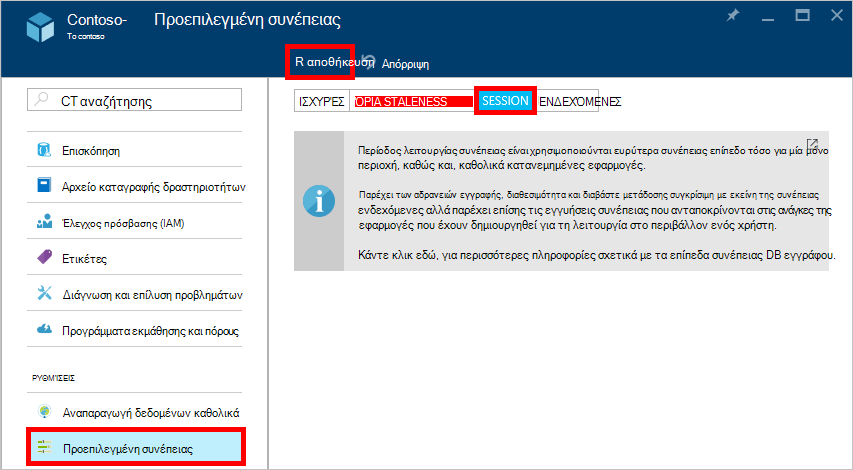

<properties
    pageTitle="Επίπεδα συνέπειας στο DocumentDB | Microsoft Azure"
    description="DocumentDB έχει τέσσερα επίπεδα συνέπειας για να σας βοηθήσει υπολοίπου ενδεχόμενη συνέπειας, διαθεσιμότητα και τα ανταλλάγματα λανθάνοντος χρόνου."
    keywords="ενδεχόμενη συνέπειας, documentdb, azure, Microsoft azure"
    services="documentdb"
    authors="syamkmsft"
    manager="jhubbard"
    editor="cgronlun"
    documentationCenter=""/>

<tags
    ms.service="documentdb"
    ms.workload="data-services"
    ms.tgt_pltfrm="na"
    ms.devlang="na"
    ms.topic="article"
    ms.date="08/24/2016"
    ms.author="syamk"/>

# Επίπεδα συνέπειας στο DocumentDB

Azure DocumentDB έχει σχεδιαστεί από το μηδέν του καθολικού κατανομή θυμάστε. Έχει σχεδιαστεί για να παρέχουν εγγυήσεις προβλέψιμα λανθάνων χρόνος χαμηλή, μια SLA διαθεσιμότητα 99,99% και πολλά μοντέλα ευδιάκριτο χαλαρή συνέπειας. Προς το παρόν, DocumentDB παρέχει τέσσερα επίπεδα συνέπειας: ισχυρή, δεσμεύεται-staleness, περίοδο λειτουργίας, και ενδεχόμενες. Εκτός από το **ισχυρό** και τη **συνέπεια ενδεχόμενη** μοντέλα συνήθως προσφέρεται από άλλες βάσεις δεδομένων NoSQL, DocumentDB επίσης προσφέρει δύο υποδείγματα προσεκτικά κωδικοποιηθεί και operationalized συνέπειας – **δεσμεύεται staleness** και **την περίοδο λειτουργίας**, και έχει επικύρωση χρησιμότητα τους σε σχέση με περιπτώσεις χρήσης πραγματικό κόσμο. Αποτελούν συνολικά αυτά τα τέσσερα συνέπειας επίπεδα σάς επιτρέπουν να κάνετε αιτιολογηθεί τα ανταλλάγματα μεταξύ συνέπειας, διαθεσιμότητα και λανθάνοντος χρόνου. 

## Πεδίο εφαρμογής της συνέπειας

Το επίπεδο λεπτομερειών της συνέπειας έχει εύρος σε μια πρόσκληση σε μεμονωμένο χρήστη. Μια αίτηση εγγραφής μπορεί να αντιστοιχούν σε μια εισαγωγή, αντικατάσταση, upsert ή να διαγράψετε συναλλαγών (με ή χωρίς την εκτέλεση της ένα συσχετισμένο έναυσμα pre ή δημοσίευση). Ή μια αίτηση εγγραφής μπορεί να αντιστοιχούν στις της συναλλαγών εκτέλεσης μιας διαδικασίας JavaScript που είναι αποθηκευμένα λειτουργικό πάνω από πολλά έγγραφα από ένα διαμερίσματα. Όπως με οι εγγραφές, συναλλαγή ανάγνωση/ερώτημα έχει επίσης εύρος σε μια πρόσκληση σε μεμονωμένο χρήστη. Ο χρήστης μπορεί να χρειάζεται για να μεταβείτε σε μια μεγάλη σύνολο αποτελεσμάτων, που εκτείνονται σε περισσότερα από ένα διαμερίσματα, αλλά κάθε Διαβάστε συναλλαγής είναι ρυθμισμένο για να κάνει μια μεμονωμένη σελίδα και που σερβιρίστηκε από μέσα σε ένα μεμονωμένο διαμερίσματα.

## Επίπεδα συνέπειας

Μπορείτε να ρυθμίσετε ένα προεπιλεγμένο επίπεδο συνέπειας στο λογαριασμό σας βάση δεδομένων που ισχύει για όλες τις συλλογές (σε όλες τις βάσεις δεδομένων) στην περιοχή ο λογαριασμός σας βάση δεδομένων. Από προεπιλογή, όλα διαβάζει και τα ερωτήματα που εκδίδονται σε σχέση με τους πόρους που ορίζονται από το χρήστη θα χρησιμοποιήσει το προεπιλεγμένο επίπεδο συνέπειας που καθορίζεται στον λογαριασμό βάσης δεδομένων. Ωστόσο, μπορείτε να απαλλαγείτε το επίπεδο συνέπειας της πρόσκλησης σε συγκεκριμένο ανάγνωση/ερώτημα, καθορίζοντας την κεφαλίδα αίτησης [[x-ms-συνέπειας-επίπεδο]](https://msdn.microsoft.com/library/azure/mt632096.aspx) . Υπάρχουν τέσσερις τύπους συνέπειας επίπεδα υποστηρίζεται από το πρωτόκολλο DocumentDB αναπαραγωγής που παρέχουν μια Απαλοιφή συσχετισμό μεταξύ εγγυήσεις συγκεκριμένες συνέπειας και επιδόσεων, όπως περιγράφεται παρακάτω.

![DocumentDB προσφέρει πολλές, καλά που ορίζονται από το μοντέλα συνέπειας (χαλαρή) για να επιλέξετε από][1]

**Ισχυρές**: 

- Ισχυρός συνέπειας προσφέρει εγγύηση [linearizability](https://aphyr.com/posts/313-strong-consistency-models) με το διαβάζει εγγυάται για να λάβετε την πιο πρόσφατη έκδοση ενός εγγράφου. 
- Ισχυρός συνέπειας εγγυάται ότι μια εγγραφή είναι ορατό μόνο αφού δεσμεύεται κατάταξή από το μεγαλύτερο μέρος απαρτία αντίγραφα. Μια εγγραφή είτε σύγχρονο δεσμεύεται κατάταξή, κύρια και την απαρτία secondaries ή είναι ματαιώθηκε. Ένα αναγνωσμένο πάντα αναγνωρίζεται από το μεγαλύτερο μέρος Διαβάστε απαρτίας, ένα πρόγραμμα-πελάτη ποτέ μπορεί να δει μια μη ολοκληρωμένη ή μερική εγγραφής και είναι πάντα εγγυημένη για να διαβάσετε το πιο πρόσφατο αναγνωρισμένων εγγραφής. 
- DocumentDB τους λογαριασμούς που έχουν ρυθμιστεί για να χρησιμοποιήσετε ισχυρό συνέπειας δεν είναι δυνατό να συσχετίσετε περισσότερες από μία περιοχή Azure με το λογαριασμό της DocumentDB. 
- Το κόστος των μια λειτουργία ανάγνωσης (όσον αφορά τις [μονάδες αίτηση](documentdb-request-units.md) που καταναλώθηκε) με ισχυρό συνέπειας είναι υψηλότερα από την περίοδο λειτουργίας και ενδεχόμενες, αλλά το ίδιο με τα όρια staleness.
 

**Staleness που περιορίζεται**: 

- Δεσμεύεται staleness τις εγγυήσεις της συνέπειας που διαβάζει το μπορεί να χρονική υστέρηση πίσω από εγγραφές με πολύ εκδόσεις *K* ή προθέματα ενός εγγράφου ή *t* χρονικό διάστημα. 
- Επομένως, κατά την επιλογή δεσμεύεται staleness, "staleness" μπορούν να ρυθμιστούν με δύο τρόπους: 
    - Αριθμός των εκδόσεων *K* του εγγράφου με την οποία το διαβάζει χρονική υστέρηση πίσω από το εγγραφές
    - Χρονικό διάστημα *t* 
- Δεσμεύεται staleness προσφορές συνολικό καθολικού σειρά εκτός από μέσα στο παράθυρο"staleness". Σημειώστε ότι η ανάγνωση μονότονη εγγυάται υπάρχει μέσα σε μια περιοχή τόσο εσωτερικά και έξω "staleness παράθυρο". 
- Όρια staleness παρέχει εγγύηση συνέπειας ισχυρότερη από την περίοδο λειτουργίας ή ενδεχόμενη συνέπειας. Για καθολικά κατανεμημένες εφαρμογές, συνιστάται να χρησιμοποιείτε όρια staleness για σενάρια όπου θέλετε να έχετε ισχυρό συνέπειας, αλλά θέλετε επίσης και χαμηλής λανθάνων χρόνος διαθεσιμότητα 99,99%. 
- DocumentDB τους λογαριασμούς που έχουν ρυθμιστεί με συνέπεια όρια staleness να συσχετίσετε οποιονδήποτε αριθμό Azure περιοχές με το λογαριασμό της DocumentDB. 
- Το κόστος των μια λειτουργία ανάγνωσης (όσον αφορά RUs που καταναλώθηκε) με όρια staleness είναι μεγαλύτερη από την περίοδο λειτουργίας και ενδεχόμενες συνέπειας, αλλά το ίδιο με συνέπεια ισχυρό.

**Περίοδος λειτουργίας**: 

- Σε αντίθεση με τα μοντέλα καθολικού συνέπειας προσφέρεται από staleness ισχυρό και ορίζεται συνέπειας επίπεδα, συνέπειας περιόδου λειτουργίας έχει εύρος σε μια περίοδο λειτουργίας του προγράμματος-πελάτη. 
- Περίοδος λειτουργίας συνέπειας είναι ιδανική για όλα τα σενάρια όπου εμπλέκεται μια περίοδο λειτουργίας συσκευή ή χρήστη, επειδή εγγυάται μονότονη διαβάζει, μονότονη εγγραφές και ανάγνωση εγγυάται τις δικές σας εγγραφές (RYW). 
- Περίοδος λειτουργίας συνέπειας παρέχει προβλέψιμα συνέπειας για μια περίοδο λειτουργίας και μέγιστη Διαβάστε μετάδοσης ενώ προσφέρει τη χαμηλότερη λανθάνων χρόνος εγγράφει και διαβάζει. 
- DocumentDB τους λογαριασμούς που έχουν ρυθμιστεί με συνέπεια περίοδο λειτουργίας να συσχετίσετε οποιονδήποτε αριθμό Azure περιοχές με το λογαριασμό της DocumentDB. 
- Το κόστος των μια λειτουργία ανάγνωσης (όσον αφορά RUs που καταναλώθηκε) με το επίπεδο συνέπειας περιόδου λειτουργίας είναι μικρότερη από ισχυρό και ορίζεται staleness, αλλά περισσότερες από ενδεχόμενη συνέπεια
 

**Ενδεχόμενη**: 

- Ενδεχόμενη συνέπειας εγγυάται ότι δεν υπάρχουν όλες οι εγγραφές περαιτέρω, τα αντίγραφα εντός της ομάδας θα εμφανίσει προσέγγιση. 
- Ενδεχόμενη συνέπειας είναι αδύναμος μορφή συνέπειας όπου ένα πρόγραμμα-πελάτη ενδέχεται να λάβετε τις τιμές που είναι παλαιότερα από αυτά το είχατε δείτε πριν.
- Ενδεχόμενη συνέπειας παρέχει τη συνέπεια αδύναμος ανάγνωσης αλλά προσφέρει τη χαμηλότερη λανθάνων χρόνος για ανάγνωσης και εγγραφής.
- DocumentDB τους λογαριασμούς που έχουν ρυθμιστεί με ενδεχόμενη συνέπεια να συσχετίσετε οποιονδήποτε αριθμό Azure περιοχές με το λογαριασμό της DocumentDB. 
- Το κόστος των μια λειτουργία ανάγνωσης (όσον αφορά RUs που καταναλώθηκε) με τη ενδεχόμενη συνέπεια είναι η μικρότερη από όλα τα επίπεδα συνέπειας DocumentDB επίπεδο.

## Τις εγγυήσεις της συνέπειας

Ο παρακάτω πίνακας καταγράφει διάφορες συνέπειας εγγυήσεις αντιστοιχεί στα επίπεδα τέσσερις συνέπειας.

| Εγγύηση                                                         |    Ισχυρές                                       |    Όρια Staleness                                                                           |    Την περίοδο λειτουργίας                                       |    Ενδεχόμενη                                 |
|----------------------------------------------------------|-------------------------------------------------|------------------------------------------------------------------------------------------------|--------------------------------------------------|--------------------------------------------------|
|    **Συνολικό καθολικού σειρά**                                |    Ναι                                          |    Ναι, εκτός του παραθύρου"staleness"                                                      |    Όχι, σειρά μερική "περίοδος λειτουργίας"                   |    Όχι                                            |
|    **Εγγύηση συνεπή πρόθεμα**                       |    Ναι                                          |    Ναι                                                                                         |    Ναι                                           |    Ναι                                           |
|    **Μονότονη διαβάζει**                                   |    Ναι                                          |    Ναι, σε περιοχές εκτός του παραθύρου staleness και μέσα σε μια περιοχή πάντα.     |    Ναι, για την δεδομένη περίοδο λειτουργίας                    |    Όχι                                            |
|    **Μονότονη εγγραφών**                                  |    Ναι                                          |    Ναι                                                                                         |    Ναι                                           |    Ναι                                           |
|    **Διαβάστε τις εγγραφές**                                  |    Ναι                                          |    Ναι                                                                                         |    Ναι (στην περιοχή εγγραφής)                      |    Όχι                                            |

## Ρύθμιση παραμέτρων το προεπιλεγμένο επίπεδο συνέπειας

1.  Στην [πύλη του Azure](https://portal.azure.com/), με το Jumpbar, κάντε κλικ στην επιλογή **DocumentDB (NoSQL)**.

2. Στο το blade **DocumentDB (NoSQL)** , επιλέξτε το λογαριασμό της βάσης δεδομένων για να τροποποιήσετε.

3. Στο blade το λογαριασμό, κάντε κλικ στην επιλογή **προεπιλεγμένο συνέπειας**.

4. Στο η **Προεπιλεγμένη συνέπειας** blade, επιλέξτε το νέο επίπεδο συνέπειας και κάντε κλικ στην επιλογή **Αποθήκευση**.

    

## Επίπεδα συνέπειας για ερωτήματα

Από προεπιλογή, για τους πόρους που ορίζονται από το χρήστη, το επίπεδο συνέπειας για ερωτήματα είναι το ίδιο με το επίπεδο συνέπειας για ανάγνωση. Από προεπιλογή, το ευρετήριο ενημερώνεται σύγχρονη σε κάθε εισαγωγή, αντικατάσταση ή διαγραφή ενός εγγράφου στη συλλογή. Αυτή η δυνατότητα επιτρέπει τα ερωτήματα να εκτελέσει το ίδιο επίπεδο συνέπειας της διαβάζει το έγγραφο. Ενώ DocumentDB είναι βελτιστοποιημένη εγγραφής και υποστηρίζει σταθερή όγκους εγγραφές εγγράφου, συντήρησης σύγχρονη ευρετηρίου και σερβίρισμα συνεπή ερωτημάτων, μπορείτε να ρυθμίσετε συγκεκριμένες συλλογές για να ενημερώσετε το ευρετήριο αμέριμνα. Περαιτέρω τεμπέλη δημιουργίας ευρετηρίου ενισχύει την απόδοση εγγραφής και είναι ιδανική για μαζική κατάποσης σενάρια όταν ένα φόρτο εργασίας είναι κυρίως ανάγνωση χοντρό.  

Λειτουργία δημιουργίας ευρετηρίου|  Διαβάζει|  Ερωτήματα  
-------------|-------|---------
Συνεπής (προεπιλογή)|   Επιλογή από την ισχυρό, όρια staleness, την περίοδο λειτουργίας, ή ενδεχόμενη|    Επιλογή από την ισχυρό, όρια staleness, την περίοδο λειτουργίας, ή ενδεχόμενη|
Τεμπέλη|   Επιλογή από την ισχυρό, όρια staleness, την περίοδο λειτουργίας, ή ενδεχόμενη|    Ενδεχόμενη  

Όπως και με αιτήσεων ανάγνωσης, μπορείτε να μειώσετε το επίπεδο συνέπειας της πρόσκλησης σε συγκεκριμένο ερώτημα, καθορίζοντας την κεφαλίδα αίτησης [x ms-συνέπειας-επιπέδου](https://msdn.microsoft.com/library/azure/mt632096.aspx) .

## Επόμενα βήματα

Εάν θέλετε να κάνετε περισσότερες ανάγνωσης σχετικά με τα επίπεδα συνέπειας και ισορροπιών, συνιστάται να στους παρακάτω πόρους:

-   Θηλειωτά Doug. Επεξήγηση από αναπαραγωγή συνέπεια δεδομένων μέσω μπέιζμπολ (βίντεο).   
[https://www.YouTube.com/watch?v=gluIh8zd26I](https://www.youtube.com/watch?v=gluIh8zd26I)
-   Θηλειωτά Doug. Επεξήγηση από αναπαραγωγή συνέπεια δεδομένων μέσω μπέιζμπολ.   
[http://Research.Microsoft.com/Pubs/157411/ConsistencyAndBaseballReport.PDF](http://research.microsoft.com/pubs/157411/ConsistencyAndBaseballReport.pdf)
-   Θηλειωτά Doug. Εγγυήσεις περίοδο λειτουργίας για ελαφρά συνεπή δεδομένων από αναπαραγωγή.   
[http://DL.ACM.org/citation.cfm?id=383631](http://dl.acm.org/citation.cfm?id=383631)
-   Χρήστος Abadi. Ισορροπιών συνέπειας σε Μοντέρνο κατανεμημένο συστήματα σχεδίαση της βάσης δεδομένων: ΚΑΠΈΛΟ είναι μόνο ένα μέρος του κειμένου ".   
[http://Computer.org/csdl/mags/CO/2012/02/mco2012020037-ABS.HTML](http://computer.org/csdl/mags/co/2012/02/mco2012020037-abs.html)
-   Peter Bailis, Shivaram Venkataraman, Michael ι. Franklin, Joseph Hellerstein λ., ιόντων Stoica. Probabilistic δεσμεύεται Staleness (PBS) για πρακτικές μερική Quorums.   
[http://vldb.org/pvldb/vol5/p776_peterbailis_vldb2012.PDF](http://vldb.org/pvldb/vol5/p776_peterbailis_vldb2012.pdf)
-   Werner Vogels. Ενδεχόμενη συνεπή - επανεξετάζονται.    
[http://allthingsdistributed.com/2008/12/eventually_consistent.HTML](http://allthingsdistributed.com/2008/12/eventually_consistent.html)

[1]: ./media/documentdb-consistency-levels/consistency-tradeoffs.png
