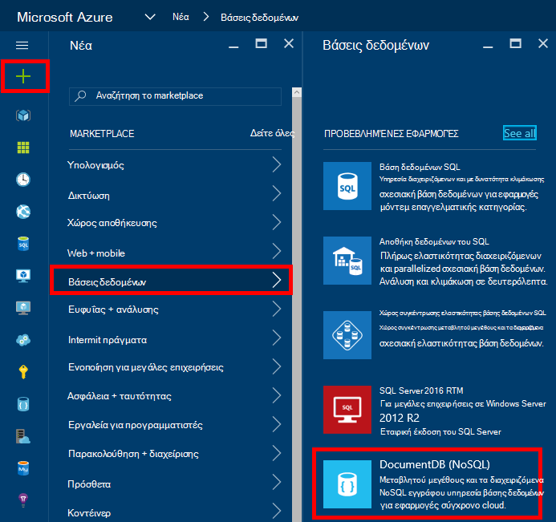
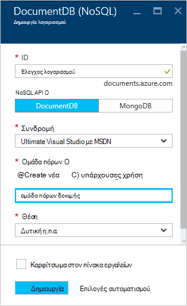
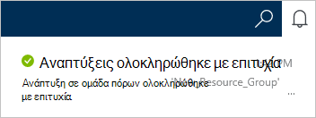
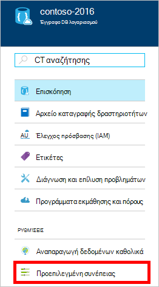
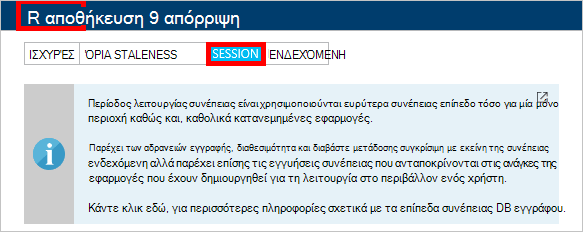

<properties
    pageTitle="Πώς μπορείτε να δημιουργήσετε ένα λογαριασμό DocumentDB | Microsoft Azure"
    description="Δημιουργία βάσης δεδομένων NoSQL με Azure DocumentDB. Ακολουθήστε αυτές τις οδηγίες για να δημιουργήσετε ένα λογαριασμό DocumentDB και να ξεκινήσετε τη δημιουργία εξαιρετική γρήγορη, παγκόσμια κλίμακα NoSQL βάση δεδομένων σας." 
    keywords="Δημιουργία μιας βάσης δεδομένων"
    services="documentdb"
    documentationCenter=""
    authors="mimig1"
    manager="jhubbard"
    editor="monicar"/>

<tags
    ms.service="documentdb"
    ms.workload="data-services"
    ms.tgt_pltfrm="na"
    ms.devlang="na"
    ms.topic="get-started-article"
    ms.date="10/17/2016"
    ms.author="mimig"/>

# Πώς μπορείτε να δημιουργήσετε ένα λογαριασμό DocumentDB NoSQL με την πύλη Azure

> [AZURE.SELECTOR]
- [Πύλη του Azure](documentdb-create-account.md)
- [Azure CLI και Azure από διαχειριστή πόρων](documentdb-automation-resource-manager-cli.md)

Για να δημιουργήσετε μια βάση δεδομένων με το Microsoft Azure DocumentDB, πρέπει:

- Έχουν λογαριασμό Azure. Μπορείτε να αποκτήσετε ένα [δωρεάν λογαριασμός Azure](https://azure.microsoft.com/free) , εάν δεν έχετε ήδη. 
- Δημιουργήστε ένα λογαριασμό DocumentDB.  

Μπορείτε να δημιουργήσετε ένα λογαριασμό DocumentDB χρησιμοποιώντας είτε την πύλη του Azure, πρότυπα διαχείρισης πόρων Azure ή Azure περιβάλλον γραμμής εντολών (CLI). Σε αυτό το άρθρο περιγράφει τον τρόπο δημιουργίας ενός λογαριασμού DocumentDB με την πύλη Azure. Για να δημιουργήσετε ένα λογαριασμό χρησιμοποιώντας τη διαχείριση πόρων Azure ή Azure CLI, ανατρέξτε στο θέμα [Δημιουργία λογαριασμού αυτοματοποίηση DocumentDB βάσης δεδομένων](documentdb-automation-resource-manager-cli.md).

Είστε νέος χρήστης του DocumentDB; Παρακολουθήστε [αυτό](https://azure.microsoft.com/documentation/videos/create-documentdb-on-azure/) το βίντεο τεσσάρων λεπτών από Scott Hanselman για να δείτε πώς μπορείτε να ολοκληρώσετε τις πιο συνηθισμένες εργασίες στην ηλεκτρονική πύλη.

1.  Είσοδος στην [πύλη του Azure](https://portal.azure.com/).
2.  Στο Jumpbar το, κάντε κλικ στην επιλογή **Δημιουργία**, κάντε κλικ στην επιλογή **βάσεις δεδομένων**και, στη συνέχεια, κάντε κλικ στην επιλογή **DocumentDB (NoSQL)**. 

      

3. Στο blade του **νέου λογαριασμού** , καθορίστε την επιθυμητή ρύθμιση παραμέτρων για το λογαριασμό DocumentDB.

    

    - Στο πλαίσιο **ID** , πληκτρολογήστε ένα όνομα για να αναγνωρίζετε το λογαριασμό DocumentDB.  Όταν επαληθευτεί το **Αναγνωριστικό** , εμφανίζεται ένα πράσινο σημάδι ελέγχου στο πλαίσιο **Αναγνωριστικό** . Η τιμή **Αναγνωριστικού** γίνεται το όνομα κεντρικού υπολογιστή μέσα σε URI. Το **Αναγνωριστικό** μπορεί να περιέχει μόνο πεζά γράμματα, αριθμούς και το '-' χαρακτήρας και πρέπει να είναι μεταξύ 3 και 50 χαρακτήρες. Σημείωση που *documents.azure.com* τοποθετείται δίπλα στο όνομα τελικού σημείου που επιλέγετε, το αποτέλεσμα της οποίας γίνεται το τελικό σημείο DocumentDB λογαριασμού.

    - Στο πλαίσιο **NoSQL API** , επιλέξτε το μοντέλο προγραμματισμού για να χρησιμοποιήσετε:
        - **DocumentDB**: το API DocumentDB είναι διαθέσιμο μέσω .NET, Java, Node.js, Python και JavaScript [SDK](documentdb-sdk-dotnet.md), καθώς και HTTP [ΥΠΌΛΟΙΠΟ](https://msdn.microsoft.com/library/azure/dn781481.aspx)και προσφέρει πρόσβαση μέσω προγραμματισμού σε όλες τις λειτουργίες του DocumentDB. 
       
        - **MongoDB**: DocumentDB προσφέρει επίσης [πρωτόκολλο επίπεδο υποστήριξης](documentdb-protocol-mongodb.md) για **MongoDB** APIs. Όταν επιλέγετε την επιλογή MongoDB API, μπορείτε να χρησιμοποιήσετε υπάρχουσες MongoDB SDK και [Εργαλεία](documentdb-mongodb-mongochef.md) για να συνομιλήσετε με DocumentDB. Μπορείτε να [μετακινήσετε](documentdb-import-data.md) τις υπάρχουσες εφαρμογές MongoDB για να χρησιμοποιήσετε DocumentDB, με [καμία αλλαγή κώδικα είναι απαραίτητο](documentdb-connect-mongodb-account.md), και να αξιοποιήσετε πλήρως διαχειριζόμενων βάσης δεδομένων ως υπηρεσία, με απεριόριστες κλίμακα, καθολικού αναπαραγωγής και άλλες δυνατότητες.

    - Για **τη συνδρομή**, επιλέξτε τη συνδρομή Azure που θέλετε να χρησιμοποιήσετε για το λογαριασμό DocumentDB. Εάν ο λογαριασμός σας έχει μόνο μία συνδρομή, αυτόν το λογαριασμό είναι ενεργοποιημένη από προεπιλογή.

    - Στην **Ομάδα πόρων**, επιλέξτε ή δημιουργήστε μια ομάδα πόρων για το λογαριασμό σας DocumentDB.  Από προεπιλογή, δημιουργείται μια νέα ομάδα πόρων. Για περισσότερες πληροφορίες, ανατρέξτε στο θέμα [με την πύλη Azure για να διαχειριστείτε τους πόρους σας Azure](../articles/azure-portal/resource-group-portal.md).

    - Χρησιμοποιήστε **θέση** για να καθορίσετε τη γεωγραφική θέση στην οποία θέλετε να φιλοξενήσετε το λογαριασμό σας DocumentDB. 

4.  Όταν έχουν ρυθμιστεί οι παράμετροι των νέων επιλογών του DocumentDB λογαριασμού, κάντε κλικ στην επιλογή **Δημιουργία**. Για να ελέγξετε την κατάσταση της ανάπτυξης, επιλέξτε την ενότητα ειδοποιήσεις.  

      

    

5.  Αφού δημιουργηθεί ο λογαριασμός DocumentDB, είναι έτοιμη για χρήση με τις προεπιλεγμένες ρυθμίσεις. Η προεπιλεγμένη συνέπεια του λογαριασμού DocumentDB έχει οριστεί σε **περίοδο λειτουργίας**.  Μπορείτε να προσαρμόσετε το προεπιλεγμένο συνέπειας κάνοντας κλικ στην επιλογή **Προεπιλεγμένο συνέπειας** στο μενού του πόρου. Για να μάθετε περισσότερα σχετικά με τα επίπεδα συνέπειας προσφέρεται από DocumentDB, ανατρέξτε στο θέμα [συνέπειας επίπεδα στο DocumentDB](documentdb-consistency-levels.md).

      

      

[How to: Create a DocumentDB account]: #Howto
[Next steps]: #NextSteps
[documentdb-manage]:../articles/documentdb/documentdb-manage.md

## Επόμενα βήματα

Τώρα που έχετε ένα λογαριασμό DocumentDB, το επόμενο βήμα είναι να δημιουργήσετε μια συλλογή DocumentDB και βάση δεδομένων. 

Μπορείτε να δημιουργήσετε μια νέα συλλογή και βάσεων δεδομένων, χρησιμοποιώντας ένα από τα εξής:

- Η πύλη Azure, όπως περιγράφεται στο θέμα [Δημιουργία συλλογής DocumentDB με την πύλη Azure](documentdb-create-collection.md).
- Ολοκληρωμένη προγραμμάτων εκμάθησης, που περιλαμβάνει το δείγμα δεδομένων: [.NET](documentdb-get-started.md), [.NET MVC](documentdb-dotnet-application.md), [Java](documentdb-java-application.md), [Node.js](documentdb-nodejs-application.md)ή [Python](documentdb-python-application.md).
- Το [.NET](documentdb-dotnet-samples.md#database-examples), [Node.js](documentdb-nodejs-samples.md#database-examples)ή [Python](documentdb-python-samples.md#database-examples) δείγμα κώδικα διαθέσιμες στο GitHub.
- Το [.NET](documentdb-sdk-dotnet.md), [Node.js](documentdb-sdk-node.md), [Java](documentdb-sdk-java.md), [Python](documentdb-sdk-python.md)και SDK [ΥΠΌΛΟΙΠΟ](https://msdn.microsoft.com/library/azure/mt489072.aspx) .

Μετά τη δημιουργία της βάσης δεδομένων και τη συλλογή, πρέπει να [προσθέσετε έγγραφα](documentdb-view-json-document-explorer.md) των συλλογών.

Αφού έχετε έγγραφα σε μια συλλογή, μπορείτε να χρησιμοποιήσετε [DocumentDB SQL](documentdb-sql-query.md) για την [Εκτέλεση ερωτημάτων](documentdb-sql-query.md#executing-queries) σε σχέση με τα έγγραφά σας. Μπορείτε να εκτελείτε ερωτήματα χρησιμοποιώντας την [Εξερεύνηση ερωτήματος](documentdb-query-collections-query-explorer.md) στην πύλη, το [REST API](https://msdn.microsoft.com/library/azure/dn781481.aspx)ή ένα από τα [SDK](documentdb-sdk-dotnet.md).

### Μάθε περισσότερα

Για να μάθετε περισσότερα σχετικά με το DocumentDB, εξερευνήστε αυτούς τους πόρους:

-   [Διαδρομή εκμάθησης για DocumentDB](https://azure.microsoft.com/documentation/learning-paths/documentdb/)
-   [Μοντέλο ιεραρχική πόρων DocumentDB και έννοιες](documentdb-resources.md)
