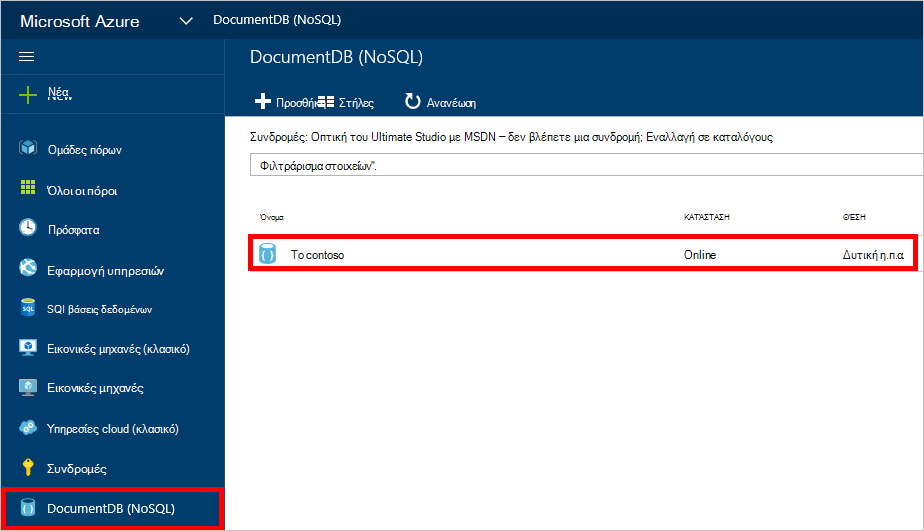
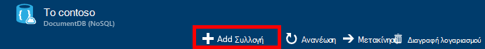
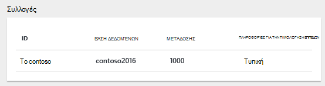
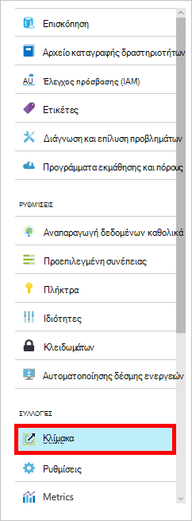

<properties 
    pageTitle="Δημιουργία βάσης δεδομένων DocumentDB και συλλογή | Microsoft Azure" 
    description="Μάθετε πώς να δημιουργείτε βάσεις δεδομένων NoSQL και συλλογές εγγράφων JSON με την πύλη ηλεκτρονικής υπηρεσίας για Azure DocumentDB, έγγραφο βάσης δεδομένων με βάση ένα σύννεφο. Λήψη δωρεάν δοκιμαστικής έκδοσης σήμερα." 
    services="documentdb" 
    authors="mimig1" 
    manager="jhubbard" 
    editor="monicar" 
    documentationCenter=""/>

<tags 
    ms.service="documentdb" 
    ms.workload="data-services" 
    ms.tgt_pltfrm="na" 
    ms.devlang="na" 
    ms.topic="article" 
    ms.date="10/17/2016" 
    ms.author="mimig"/>

# Πώς μπορείτε να δημιουργήσετε μια συλλογή DocumentDB και βάση δεδομένων χρησιμοποιώντας την πύλη του Azure

Για να χρησιμοποιήσετε το Microsoft Azure DocumentDB, πρέπει να έχετε ένα [λογαριασμό DocumentDB](documentdb-create-account.md), μια βάση δεδομένων, μια συλλογή και έγγραφα. Αυτό το θέμα περιγράφει πώς μπορείτε να δημιουργήσετε μια συλλογή DocumentDB στην πύλη του Azure. 

Δεν είστε βέβαιοι ποια μια συλλογή είναι; Ανατρέξτε στο θέμα [Τι είναι μια συλλογή DocumentDB;](#what-is-a-documentdb-collection)

1.  Στην [πύλη του Azure](https://portal.azure.com/), με το Jumpbar, κάντε κλικ στην επιλογή **DocumentDB (NoSQL)**και, στη συνέχεια, στο το blade **DocumentDB (NoSQL)** , επιλέξτε το λογαριασμό στο οποίο θέλετε να προσθέσετε μια συλλογή. Εάν δεν έχετε τυχόν λογαριασμούς που παρατίθενται, θα χρειαστεί να [δημιουργήσετε ένα λογαριασμό DocumentDB](documentdb-create-account.md).

    
    
    Εάν δεν είναι ορατή στο το Jumpbar **DocumentDB (NoSQL)** , κάντε κλικ στην επιλογή **Περισσότερες υπηρεσίες** και, στη συνέχεια, κάντε κλικ στην επιλογή **DocumentDB (NoSQL)**. Εάν δεν έχετε τυχόν λογαριασμούς που παρατίθενται, θα χρειαστεί να [δημιουργήσετε ένα λογαριασμό DocumentDB](documentdb-create-account.md).

2. Στο το blade **DocumentDB λογαριασμού** για τον επιλεγμένο λογαριασμό, κάντε κλικ στην επιλογή **Προσθήκη συλλογής**.

    

3. Στο η **Προσθήκη συλλογής** blade, στο πλαίσιο **ID** , πληκτρολογήστε το Αναγνωριστικό για τη νέα συλλογή. Συλλογή ονόματα πρέπει να είναι από 1 έως 255 χαρακτήρες και δεν μπορούν να περιέχουν `/ \ # ?` ή ένα κενό διάστημα. Όταν επαληθευτεί το όνομα, ένα πράσινο σημάδι ελέγχου εμφανίζεται στο πλαίσιο Αναγνωριστικό.

    

4. Από προεπιλογή, **Τιμολόγηση επίπεδο** έχει οριστεί σε **Τυπική** , έτσι ώστε να μπορείτε να προσαρμόσετε την απόδοση και χώρου αποθήκευσης για τη συλλογή. Για περισσότερες πληροφορίες σχετικά με τη σειρά τιμολόγησης, ανατρέξτε στο θέμα [επιδόσεις επίπεδα στο DocumentDB](documentdb-performance-levels.md).  

5. Επιλέξτε μια **λειτουργία διαμέριση** για τη συλλογή, **Μία διαμερίσματα** ή **Partitioned**. 

    Ένα **μεμονωμένο διαμερίσματα** έχει χωρητικότητα δεσμευμένη αποθήκευσης των 10 GB και μπορούν να έχουν επίπεδα μετάδοσης από 10.000 400 αίτηση μονάδες/δευτερόλεπτο (RU/s). Μία RU αντιστοιχεί με την ταχύτητα μεταγωγής για μια ανάγνωση ενός εγγράφου 1KB. Για περισσότερες πληροφορίες σχετικά με την πρόσκληση σε μονάδες, ανατρέξτε στο θέμα [αίτηση μονάδες](documentdb-request-units.md). 

    Μια **συλλογή διαμερίσματα** μπορεί να περιορίσετε το μέγεθος για το χειρισμό απεριόριστο χώρο αποθήκευσης πάνω από περισσότερα από ένα διαμερίσματα και μπορούν να έχουν μετάδοσης επίπεδα ξεκινώντας από το 10,100 RU/s. Στην πύλη, το μεγαλύτερο χώρο αποθήκευσης, μπορείτε να δεσμεύσετε είναι 250 GB και τα περισσότερα μετάδοσης που μπορείτε να δεσμεύσετε είναι 250.000 RU/s. Για να αυξήσετε κάποιο όριο, υποβάλετε μια αίτηση όπως περιγράφεται στην [αίτηση αυξημένη DocumentDB ορίων λογαριασμού](documentdb-increase-limits.md). Για περισσότερες πληροφορίες σχετικά με τις συλλογές διαμερίσματα, ανατρέξτε στο θέμα [μόνο διαμερίσματα και διαμερίσματα συλλογών](documentdb-partition-data.md#single-partition-and-partitioned-collections).

    Από προεπιλογή, η ταχύτητα μετάδοσης για μια νέα συλλογή μόνο διαμερίσματα έχει οριστεί σε RU 1000/s με χωρητικότητα αποθήκευσης των 10 GB. Για μια συλλογή διαμερίσματα, τη μετάδοση συλλογής έχει οριστεί σε 10100 RU/s με χωρητικότητα αποθήκευσης 250 GB. Μπορείτε να αλλάξετε την ταχύτητα και χώρου αποθήκευσης για τη συλλογή μετά τη δημιουργία της συλλογής. 

6. Εάν θέλετε να δημιουργήσετε μια συλλογή διαμερίσματα, επιλέξτε το **Κλειδί διαμερίσματα** για τη συλλογή. Επιλέγοντας τον αριθμό-κλειδί σωστή διαμερίσματα είναι σημαντικό να τη δημιουργία μιας συλλογής performant. Για περισσότερες πληροφορίες σχετικά με την επιλογή έναν αριθμό-κλειδί διαμερίσματα, ανατρέξτε στο θέμα [Σχεδιασμός για τη δημιουργία διαμερισμάτων](documentdb-partition-data.md#designing-for-partitioning).

7. Στο blade τη **βάση δεδομένων** , δημιουργήστε μια νέα βάση δεδομένων ή χρησιμοποιήστε ένα υπάρχον. Ονόματα βάσης δεδομένων πρέπει να είναι από 1 έως 255 χαρακτήρες και δεν μπορούν να περιέχουν `/ \ # ?` ή ένα κενό διάστημα. Για να επικυρώσει το όνομα, κάντε κλικ έξω από το πλαίσιο κειμένου. Όταν επαληθευτεί το όνομα, εμφανίζεται ένα πράσινο σημάδι επιλογής στο πλαίσιο.

8. Κάντε κλικ στο **κουμπί OK** στο κάτω μέρος της οθόνης για να δημιουργήσετε τη νέα συλλογή. 

9. Η νέα συλλογή τώρα εμφανίζεται στο φακού **συλλογές** στην το blade **Επισκόπηση** .
 
    

10. **Προαιρετικά:** Για να τροποποιήσετε την απόδοση της συλλογής στην πύλη, κάντε κλικ στην επιλογή **κλίμακας** στο μενού πόρων. 

    

## Τι είναι μια συλλογή DocumentDB; 

Μια συλλογή είναι ένα κοντέινερ JSON εγγράφων και τη συσχετισμένη λογική εφαρμογής JavaScript. Μια συλλογή είναι χρεώσιμων οντότητα, όπου το [κόστος](documentdb-performance-levels.md) προσδιορίζεται από την προμήθεια του φακέλου μετάδοσης της συλλογής. Συλλογές μπορεί να εκτείνεται σε έναν ή περισσότερους διαμερίσματα/διακομιστές και να περιορίσετε το μέγεθος των χειρισμού όγκους σχεδόν απεριόριστο χώρο αποθήκευσης ή μετάδοσης.

Συλλογές δημιουργούνται αυτόματα διαμερίσματα σε έναν ή περισσότερους φυσικής διακομιστές με DocumentDB. Όταν δημιουργείτε μια συλλογή, μπορείτε να καθορίσετε την προμήθεια του φακέλου μετάδοσης όσον αφορά τις μονάδες αίτηση ανά δευτερόλεπτο και μια ιδιότητα κλειδιού διαμερίσματα. Η τιμή αυτής της ιδιότητας θα χρησιμοποιηθεί από DocumentDB για τη διανομή εγγράφων μεταξύ διαμερίσματα και δρομολόγηση αιτήσεις όπως ερωτήματα. Η τιμή του κλειδιού partition λειτουργεί επίσης ως το όριο συναλλαγής για αποθηκευμένες διαδικασίες και εναύσματα. Κάθε συλλογή έχει δεσμευμένη ποσότητα μετάδοσης ειδικά για συγκεκριμένη συλλογή, η οποία δεν είναι κοινόχρηστα με άλλες συλλογές στον ίδιο λογαριασμό. Γι ' αυτό, μπορείτε να κλιμάκωση την εφαρμογή τόσο όσον αφορά χώρου αποθήκευσης και απόδοση. 

Συλλογές δεν είναι ίδια με πίνακες σε σχεσιακές βάσεις δεδομένων. Συλλογές επιβάλλει σχήματος, στην πραγματικότητα DocumentDB δεν επιβάλλει οποιαδήποτε σχήματα, είναι μια βάση δεδομένων χωρίς σχήματος. Επομένως, μπορείτε να αποθηκεύσετε διαφορετικούς τύπους εγγράφων με διαφορετικά σχήματα στην ίδια συλλογή. Μπορείτε να επιλέξετε να χρησιμοποιήσετε συλλογές για την αποθήκευση αντικειμένων ενός μόνο τύπου όπως θα κάνατε με πίνακες. Το μοντέλο βέλτιστη εξαρτάται μόνο πώς εμφανίζονται τα δεδομένα μαζί σε ερωτήματα και συναλλαγές.

## Άλλοι τρόποι για να δημιουργήσετε μια συλλογή DocumentDB

Συλλογές δεν χρειάζεται να δημιουργηθούν με την πύλη, μπορείτε επίσης να δημιουργήσετε τους χρησιμοποιώντας το [SDK DocumentDB](documentdb-sdk-dotnet.md) και το REST API. 

- Για ένα δείγμα C# κώδικα, ανατρέξτε στο θέμα τα [δείγματα συλλογής C#](documentdb-dotnet-samples.md#collection-examples). 
- Για ένα δείγμα κώδικα Node.js, ανατρέξτε στο θέμα τα [δείγματα συλλογής Node.js](documentdb-nodejs-samples.md#collection-examples).
- Για ένα δείγμα κώδικα Python, ανατρέξτε στο θέμα [δείγματα συλλογής Python](documentdb-python-samples.md#collection-examples).
- Για ένα δείγμα REST API, ανατρέξτε στο θέμα [Δημιουργία μιας συλλογής](https://msdn.microsoft.com/library/azure/mt489078.aspx).

## Αντιμετώπιση προβλημάτων

Εάν **Προσθέσετε συλλογής** είναι απενεργοποιημένη στην πύλη του Azure, αυτό σημαίνει ότι ο λογαριασμός σας αυτήν τη στιγμή είναι απενεργοποιημένη, που συνήθως προκύπτει όταν χρησιμοποιούνται όλα τα πλεονεκτήματα πιστώσεων του μήνα.   

## Επόμενα βήματα

Τώρα που έχετε μια συλλογή, το επόμενο βήμα είναι να προσθέσετε έγγραφα ή εισαγωγή εγγράφων στη συλλογή. Όταν θέλετε να προσθέσετε έγγραφα σε μια συλλογή, έχετε μερικές επιλογές:

- Μπορείτε να [προσθέσετε έγγραφα](documentdb-view-json-document-explorer.md) χρησιμοποιώντας την Εξερεύνηση εγγράφων στην πύλη.
- Μπορείτε να κάνετε [Εισαγωγή έγγραφα και δεδομένα](documentdb-import-data.md) , χρησιμοποιώντας το εργαλείο μετεγκατάστασης δεδομένων DocumentDB, που σας επιτρέπει να εισαγάγετε αρχεία JSON και CSV, καθώς και δεδομένα από SQL Server, MongoDB, χώρος αποθήκευσης πινάκων του Azure και άλλες συλλογές DocumentDB. 
- Ή μπορείτε να προσθέσετε έγγραφα χρησιμοποιώντας ένα από τα [DocumentDB SDK](documentdb-sdk-dotnet.md). DocumentDB έχει .NET, Java, Python, Node.js και JavaScript API SDK. Για C# που δείχνει πώς μπορείτε να εργαστείτε με έγγραφα, χρησιμοποιώντας το SDK .NET DocumentDB δείγματα κώδικα, ανατρέξτε στο θέμα τα [δείγματα εγγράφου C#](documentdb-dotnet-samples.md#document-examples). Για δείγματα κώδικα Node.js που δείχνει πώς μπορείτε να εργαστείτε με έγγραφα, χρησιμοποιώντας το SDK Node.js DocumentDB, ανατρέξτε στο θέμα τα [δείγματα Node.js εγγράφου](documentdb-nodejs-samples.md#document-examples).

Αφού έχετε έγγραφα σε μια συλλογή, μπορείτε να χρησιμοποιήσετε [DocumentDB SQL](documentdb-sql-query.md) για την [Εκτέλεση ερωτημάτων](documentdb-sql-query.md#executing-queries) σε σχέση με τα έγγραφά σας, χρησιμοποιώντας την [Εξερεύνηση ερωτήματος](documentdb-query-collections-query-explorer.md) στην πύλη, το [REST API](https://msdn.microsoft.com/library/azure/dn781481.aspx)ή ένα από τα [SDK](documentdb-sdk-dotnet.md). 
