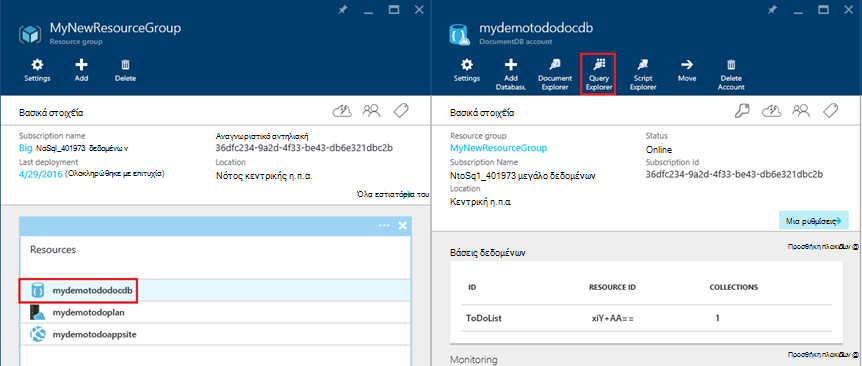

<properties 
    pageTitle="Ανάπτυξη DocumentDB και Azure εφαρμογής υπηρεσίας Web Apps με χρήση ενός προτύπου για τη διαχείριση πόρων Azure | Microsoft Azure" 
    description="Μάθετε πώς μπορείτε να αναπτύξετε ένα λογαριασμό DocumentDB Azure εφαρμογής υπηρεσίας Web Apps και δείγμα εφαρμογής web με χρήση ενός προτύπου για τη διαχείριση πόρων Azure." 
    services="documentdb, app-service\web" 
    authors="h0n" 
    manager="jhubbard" 
    editor="monicar" 
    documentationCenter=""/>

<tags 
    ms.service="documentdb" 
    ms.workload="data-services" 
    ms.tgt_pltfrm="na" 
    ms.devlang="na" 
    ms.topic="article" 
    ms.date="08/02/2016" 
    ms.author="hawong"/>

# Ανάπτυξη DocumentDB και Azure εφαρμογής υπηρεσίας Web Apps με χρήση ενός προτύπου για τη διαχείριση πόρων Azure

Αυτό το πρόγραμμα εκμάθησης δείχνει πώς μπορείτε να χρησιμοποιήσετε ένα πρότυπο από διαχειριστή πόρων Azure για να αναπτύξετε και να ενοποιήσετε το [Microsoft Azure DocumentDB](https://azure.microsoft.com/services/documentdb/), μια εφαρμογή web της [Εφαρμογής υπηρεσίας Azure](http://go.microsoft.com/fwlink/?LinkId=529714) και ένα δείγμα εφαρμογής web.

Με τη χρήση προτύπων από διαχειριστή πόρων Azure, μπορείτε εύκολα να αυτοματοποιήσετε τα ανάπτυξης και ρύθμισης παραμέτρων Azure τους πόρους σας.  Αυτό το πρόγραμμα εκμάθησης δείχνει πώς μπορείτε να αναπτύξετε μια εφαρμογή web και αυτόματη ρύθμιση παραμέτρων DocumentDB πληροφορίες σύνδεσης λογαριασμού.

Αφού ολοκληρώσετε αυτό το πρόγραμμα εκμάθησης, θα μπορούν να απαντούν στα παρακάτω ερωτήματα:  

-   Πώς μπορώ να χρησιμοποιήσω ένα πρότυπο από διαχειριστή πόρων Azure για να αναπτύξετε και να ενοποιήσετε ένα λογαριασμό DocumentDB και μια εφαρμογή web στο Azure εφαρμογής υπηρεσίας;
-   Πώς μπορώ να χρησιμοποιήσω ένα πρότυπο από διαχειριστή πόρων Azure για να αναπτύξετε και να ενσωματώσετε ένα λογαριασμό DocumentDB, μια εφαρμογή web στις εφαρμογές Web της εφαρμογής υπηρεσίας και μια εφαρμογή Webdeploy;

## Προαπαιτούμενα στοιχεία
> [AZURE.TIP] Ενώ αναλάβετε προηγούμενη εμπειρία με τα πρότυπα διαχείρισης πόρων Azure ή JSON αυτό το πρόγραμμα εκμάθησης, θα πρέπει να που θέλετε να τροποποιήσετε το πρότυπα αναφοράς ή επιλογές ανάπτυξης, στη συνέχεια, γνώσεις για κάθε μία από αυτές τις περιοχές θα σας ζητηθεί.

Πριν να ακολουθήσετε τις οδηγίες σε αυτό το πρόγραμμα εκμάθησης, βεβαιωθείτε ότι έχετε τα εξής:

- Μια συνδρομή του Azure. Azure είναι μια πλατφόρμα που βασίζεται σε συνδρομή.  Για περισσότερες πληροφορίες σχετικά με την απόκτηση μια συνδρομή, ανατρέξτε στο θέμα [Επιλογές αγοράς](https://azure.microsoft.com/pricing/purchase-options/), [Προσφέρει μέλος](https://azure.microsoft.com/pricing/member-offers/)ή [Δωρεάν δοκιμαστικής έκδοσης](https://azure.microsoft.com/pricing/free-trial/).

##Βήμα 1: Λήψη των αρχείων του προτύπου ##
Ας ξεκινήσουμε με τη λήψη των αρχείων προτύπου, θα χρησιμοποιήσουμε σε αυτό το πρόγραμμα εκμάθησης.

1. Λήψη του προτύπου [Δημιουργία λογαριασμού DocumentDB, εφαρμογές Web, και να αναπτύξετε ένα δείγμα εφαρμογής επίδειξη](https://portalcontent.blob.core.windows.net/samples/DocDBWebsiteTodo.json) σε έναν τοπικό φάκελο (π.χ., C:\DocumentDBTemplates). Αυτό το πρότυπο θα αναπτύξετε ένα λογαριασμό DocumentDB, μια εφαρμογή web της εφαρμογής υπηρεσίας και μια εφαρμογή web.  Το αυτόματα θα ρυθμίσετε τις παραμέτρους της εφαρμογής web για να συνδεθείτε με το λογαριασμό DocumentDB.

2. Λήψη του προτύπου [Δημιουργία λογαριασμού DocumentDB και δείγματα Web Apps](https://portalcontent.blob.core.windows.net/samples/DocDBWebSite.json) σε έναν τοπικό φάκελο (π.χ., C:\DocumentDBTemplates). Αυτό το πρότυπο θα αναπτύξετε ένα λογαριασμό DocumentDB, μια εφαρμογή web της εφαρμογής υπηρεσίας, και θα τροποποίηση ρυθμίσεων εφαρμογής της τοποθεσίας για να εντοπίσει εύκολα DocumentDB πληροφορίες σύνδεσης, αλλά δεν περιλαμβάνει μια εφαρμογή web.  

##Βήμα 2: Ανάπτυξη το λογαριασμό DocumentDB, εφαρμογής υπηρεσίας web app και επίδειξη εφαρμογή δείγματος

Τώρα ας ανάπτυξη μας πρώτο πρότυπο.

> [AZURE.TIP] Το πρότυπο δεν επαληθεύει ότι το όνομα εφαρμογής web και εισάγονται κάτω από το όνομα του λογαριασμού DocumentDB είναι α) έγκυρες και b) διαθέσιμες.  Συνιστάται ιδιαίτερα να επαληθεύετε τη διαθεσιμότητα των ονομάτων που σκοπεύετε να παρέχετε πριν από την υποβολή της ανάπτυξης.

1. Συνδεθείτε στην [Πύλη Azure](https://portal.azure.com), κάντε κλικ στο δημιουργία και αναζήτησης για "Ανάπτυξη προτύπου".
    

2. Επιλέξτε το στοιχείο ανάπτυξη προτύπου και κάντε κλικ στην επιλογή **Δημιουργία**
    

3.  Κάντε κλικ στην επιλογή **Επεξεργασία προτύπου**, επικολλήστε τα περιεχόμενα του αρχείου του προτύπου DocDBWebsiteTodo.json και κάντε κλικ στην επιλογή **Αποθήκευση**.
    

4. Κάντε κλικ στην επιλογή **Επεξεργασία παραμέτρους**, παρέχουν τιμές για κάθε μία από τις παραμέτρους υποχρεωτικό, και κάντε κλικ στο κουμπί **OK**.  Οι παράμετροι έχουν ως εξής:

    1. Όνομα ΤΟΠΟΘΕΣΊΑΣ: Καθορίζει το όνομα της εφαρμογής υπηρεσίας web app και χρησιμοποιείται για να δημιουργήσετε τη διεύθυνση URL που θα χρησιμοποιήσετε για να αποκτήσετε πρόσβαση στην εφαρμογή web (π.χ. Εάν καθορίσετε "mydemodocdbwebapp" και, στη συνέχεια, τη διεύθυνση URL με την οποία θα έχετε πρόσβαση στην εφαρμογή web θα είναι mydemodocdbwebapp.azurewebsites.net).

    2. HOSTINGPLANNAME: Καθορίζει το όνομα της εφαρμογής υπηρεσίας φιλοξενίας πρόκειται να δημιουργήσετε.

    3. ΘΈΣΗ: Καθορίζει το Azure θέση στην οποία θέλετε να δημιουργήσετε το web και DocumentDB πόροι της εφαρμογής.

    4. DATABASEACCOUNTNAME: Καθορίζει το όνομα του λογαριασμού DocumentDB για να δημιουργήσετε.   

    

5. Επιλέξτε μια υπάρχουσα ομάδα πόρων ή δώστε ένα όνομα για να κάνετε μια νέα ομάδα πόρων, και επιλέξτε μια θέση για την ομάδα πόρων.
    
  
6.  Κάντε κλικ στην επιλογή **Αναθεώρηση νομική όρους**, **την αγορά**, και, στη συνέχεια, κάντε κλικ στην επιλογή **Δημιουργία** για να ξεκινήσετε την ανάπτυξη.  Επιλέξτε **Καρφίτσωμα στον πίνακα εργαλείων** , ώστε να ανάπτυξης που προκύπτουν είναι εύκολα ορατό στην Azure πύλης αρχική σελίδα σας.
    

7.  Όταν ολοκληρωθεί η ανάπτυξη, θα ανοίξει το blade ομάδα πόρων.
      

8.  Για να χρησιμοποιήσετε την εφαρμογή, απλώς μεταβείτε στη διεύθυνση URL της εφαρμογής web (στο παραπάνω παράδειγμα, η διεύθυνση URL θα ήταν http://mydemodocdbwebapp.azurewebsites.net).  Θα δείτε την ακόλουθη εφαρμογή web:

    

9. Προχωρήστε και δημιουργία ορισμένες εργασίες στην εφαρμογή web και, στη συνέχεια, επιστρέψετε το blade ομάδα πόρων στην πύλη του Azure. Κάντε κλικ στον πόρο λογαριασμό DocumentDB στη λίστα πόροι και, στη συνέχεια, κάντε κλικ στην επιλογή **Εξερεύνηση ερωτήματος**.
      

10. Εκτέλεση το προεπιλεγμένο ερώτημα, "ΕΠΙΛΟΓΉ c από *" και να ελέγξετε τα αποτελέσματα.  Παρατηρήστε ότι το ερώτημα έχει ανάκτηση του JSON αναπαράσταση των στοιχείων todo που δημιουργήσατε στο βήμα 7 παραπάνω.  Μην διστάσεις να πειραματιστείτε με τα ερωτήματα; Για παράδειγμα, προσπαθήστε να εκτελέσετε ΕΠΙΛΈΞΤΕ* από c ΠΟΎ c.isComplete = true για να επαναφέρετε όλα τα στοιχεία todo που έχουν σημανθεί ως ολοκληρωμένο.

    

11. Είστε ευπρόσδεκτοι να εξερευνήσετε την εμπειρία πύλης DocumentDB ή να τροποποιήσετε το δείγμα εφαρμογής Todo.  Όταν είστε έτοιμοι, ας ανάπτυξη άλλο πρότυπο.
    
 
## Βήμα 3: Ανάπτυξη το έγγραφο δείγμα εφαρμογής web και λογαριασμού

Τώρα ας αναπτύξετε το δεύτερο πρότυπο.  Αυτό το πρότυπο είναι χρήσιμη για να εμφανίσετε τον τρόπο που μπορεί να εισαγάγει πληροφορίες σύνδεσης DocumentDB όπως τελικού σημείου λογαριασμό και το πρωτεύον κλειδί στην μια εφαρμογή web ως ρυθμίσεις εφαρμογής ή μιας προσαρμοσμένης συμβολοσειράς σύνδεσης. Για παράδειγμα, ίσως έχετε τη δική σας εφαρμογή web που θέλετε να αναπτύξετε με ένα λογαριασμό DocumentDB και έχετε τις πληροφορίες σύνδεσης συμπληρώνονται αυτόματα κατά την ανάπτυξη.

> [AZURE.TIP] Το πρότυπο δεν επαληθεύει ότι το όνομα εφαρμογής web και εισάγονται κάτω από το όνομα του λογαριασμού DocumentDB είναι α) έγκυρες και b) διαθέσιμες.  Συνιστάται ιδιαίτερα να επαληθεύετε τη διαθεσιμότητα των ονομάτων που σκοπεύετε να παρέχετε πριν από την υποβολή της ανάπτυξης.

1. Στην [Πύλη του Azure](https://portal.azure.com), κάντε κλικ στην επιλογή Δημιουργία και κάντε αναζήτηση για "Ανάπτυξη προτύπου".
    

2. Επιλέξτε το στοιχείο ανάπτυξη προτύπου και κάντε κλικ στην επιλογή **Δημιουργία**
    

3.  Κάντε κλικ στην επιλογή **Επεξεργασία προτύπου**, επικολλήστε τα περιεχόμενα του αρχείου του προτύπου DocDBWebSite.json και κάντε κλικ στην επιλογή **Αποθήκευση**.
    

4. Κάντε κλικ στην επιλογή **Επεξεργασία παραμέτρους**, παρέχουν τιμές για κάθε μία από τις παραμέτρους υποχρεωτικό, και κάντε κλικ στο κουμπί **OK**.  Οι παράμετροι έχουν ως εξής:

    1. Όνομα ΤΟΠΟΘΕΣΊΑΣ: Καθορίζει το όνομα της εφαρμογής υπηρεσίας web app και χρησιμοποιείται για να δημιουργήσετε τη διεύθυνση URL που θα χρησιμοποιήσετε για να αποκτήσετε πρόσβαση στην εφαρμογή web (π.χ. Εάν καθορίσετε "mydemodocdbwebapp" και, στη συνέχεια, τη διεύθυνση URL με την οποία θα έχετε πρόσβαση στην εφαρμογή web θα είναι mydemodocdbwebapp.azurewebsites.net).

    2. HOSTINGPLANNAME: Καθορίζει το όνομα της εφαρμογής υπηρεσίας φιλοξενίας πρόκειται να δημιουργήσετε.

    3. ΘΈΣΗ: Καθορίζει το Azure θέση στην οποία θέλετε να δημιουργήσετε το web και DocumentDB πόροι της εφαρμογής.

    4. DATABASEACCOUNTNAME: Καθορίζει το όνομα του λογαριασμού DocumentDB για να δημιουργήσετε.   

    

5. Επιλέξτε μια υπάρχουσα ομάδα πόρων ή δώστε ένα όνομα για να κάνετε μια νέα ομάδα πόρων, και επιλέξτε μια θέση για την ομάδα πόρων.
    
  
6.  Κάντε κλικ στην επιλογή **Αναθεώρηση νομική όρους**, **την αγορά**, και, στη συνέχεια, κάντε κλικ στην επιλογή **Δημιουργία** για να ξεκινήσετε την ανάπτυξη.  Επιλέξτε **Καρφίτσωμα στον πίνακα εργαλείων** , ώστε να ανάπτυξης που προκύπτουν είναι εύκολα ορατό στην Azure πύλης αρχική σελίδα σας.
    

7.  Όταν ολοκληρωθεί η ανάπτυξη, θα ανοίξει το blade ομάδα πόρων.
      

8. Κάντε κλικ στον πόρο Web App από τη λίστα πόρων και, στη συνέχεια, κάντε κλικ στην επιλογή **Ρυθμίσεις εφαρμογής**
      

9. Σημειώστε τον τρόπο υπάρχουν παρουσίαση για το τελικό σημείο DocumentDB και κάθε ένα από τα πρωτεύοντα κλειδιά DocumentDB ρυθμίσεις εφαρμογής.
      

10. Μην διστάσεις να συνεχίσετε την Εξερεύνηση της πύλης Azure ή ακολουθήστε μας DocumentDB [δείγματα](http://go.microsoft.com/fwlink/?LinkID=402386) για να δημιουργήσετε τη δική σας εφαρμογή DocumentDB.

    
    

## Επόμενα βήματα

Συγχαρητήρια! Έχετε αναπτύξει DocumentDB, εφαρμογής υπηρεσίας web app και το δείγμα εφαρμογής web με τη χρήση προτύπων από διαχειριστή πόρων Azure.

- Για να μάθετε περισσότερα σχετικά με την DocumentDB, κάντε κλικ [εδώ](http://azure.com/docdb).
- Για να μάθετε περισσότερα σχετικά με τις εφαρμογές Azure εφαρμογής υπηρεσίας Web, κάντε κλικ [εδώ](http://go.microsoft.com/fwlink/?LinkId=325362).
- Για να μάθετε περισσότερα σχετικά με τα πρότυπα Azure διαχείριση πόρων, κάντε κλικ [εδώ](https://msdn.microsoft.com/library/azure/dn790549.aspx).

## Τι έχει αλλάξει
* Για οδηγίες για την αλλαγή από τοποθεσίες Web App υπηρεσία ανατρέξτε στο θέμα: [Azure εφαρμογής υπηρεσίας και τον αντίκτυπο σχετικά με τις υπάρχουσες υπηρεσίες Azure](http://go.microsoft.com/fwlink/?LinkId=529714)
* Για έναν οδηγό για την αλλαγή της πύλης παλιά νέα πύλη ανατρέξτε στο θέμα: [αναφορά για την περιήγηση σε κλασική πύλη του Azure](http://go.microsoft.com/fwlink/?LinkId=529715)

>[AZURE.NOTE] Εάν θέλετε να γρήγορα αποτελέσματα με το Azure εφαρμογής υπηρεσίας πριν από την εγγραφή για λογαριασμό Azure, μεταβείτε στο [Δοκιμάστε εφαρμογής υπηρεσίας](http://go.microsoft.com/fwlink/?LinkId=523751), όπου μπορείτε να αμέσως δημιουργήσετε μια εφαρμογή web μικρής διάρκειας starter στην εφαρμογή υπηρεσίας. Δεν υπάρχει πιστωτικές κάρτες υποχρεωτικό, χωρίς δεσμεύσεις.
 
