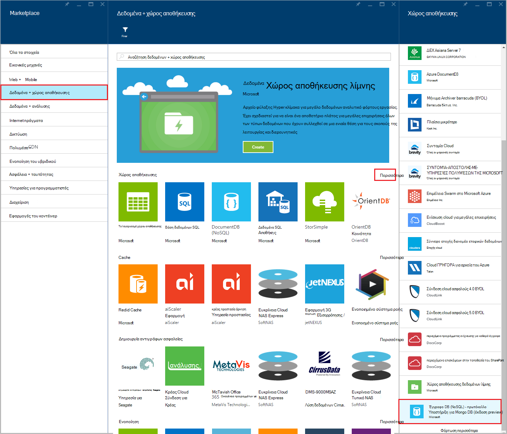

<properties 
    pageTitle="Δημιουργία λογαριασμού DocumentDB με πρωτόκολλο υποστήριξη για MongoDB | Microsoft Azure" 
    description="Μάθετε πώς μπορείτε να δημιουργήσετε ένα λογαριασμό DocumentDB με πρωτόκολλο υποστήριξη για MongoDB, τώρα διαθέσιμη για προεπισκόπηση." 
    services="documentdb" 
    authors="AndrewHoh" 
    manager="jhubbard" 
    editor="" 
    documentationCenter=""/>

<tags 
    ms.service="documentdb" 
    ms.workload="data-services" 
    ms.tgt_pltfrm="na" 
    ms.devlang="na" 
    ms.topic="article" 
    ms.date="10/20/2016" 
    ms.author="anhoh"/>

# Πώς μπορείτε να δημιουργήσετε ένα λογαριασμό DocumentDB με πρωτόκολλο υποστήριξη για MongoDB με την πύλη Azure

Για να δημιουργήσετε ένα λογαριασμό Azure DocumentDB με πρωτόκολλο υποστήριξη για MongoDB, πρέπει:

- Έχουν λογαριασμό Azure. Μπορείτε να αποκτήσετε ένα [δωρεάν λογαριασμός Azure](https://azure.microsoft.com/free/) , εάν δεν έχετε ήδη.

## Δημιουργήστε το λογαριασμό  

Για να δημιουργήσετε ένα λογαριασμό DocumentDB με πρωτόκολλο υποστήριξη για MongoDB, ακολουθήστε τα παρακάτω βήματα.

1. Σε ένα νέο παράθυρο, πραγματοποιήστε είσοδο στο [Azure πύλη](https://portal.azure.com).
2. Κάντε κλικ στην επιλογή **ΔΗΜΙΟΥΡΓΊΑ**, κάντε κλικ στην επιλογή **δεδομένα + χώρος αποθήκευσης**, κάντε κλικ στο κουμπί **δείτε όλες**και στη συνέχεια, αναζητήστε την κατηγορία **δεδομένων + χώρος αποθήκευσης** για το "Πρωτόκολλο DocumentDB". Κάντε κλικ στην επιλογή **DocumentDB - υποστήριξη πρωτοκόλλου για MongoDB**.

    

3. Εναλλακτικά, στην κατηγορία **δεδομένων + χώρος αποθήκευσης** , στην περιοχή **χώρος αποθήκευσης**, κάντε κλικ στην επιλογή **περισσότερα**και, στη συνέχεια, κάντε κλικ στην επιλογή **Φόρτωση περισσότερων** μία ή περισσότερες φορές για να εμφανίσετε **DocumentDB - υποστήριξη πρωτοκόλλου για MongoDB**. Κάντε κλικ στην επιλογή **DocumentDB - υποστήριξη πρωτοκόλλου για MongoDB**.

    

4. Στο το blade **DocumentDB - υποστήριξη πρωτοκόλλου για MongoDB (έκδοση preview)** , κάντε κλικ στην επιλογή **Δημιουργία** για να ξεκινήσετε τη διαδικασία εγγραφής preview.

    

5. Στο το blade **DocumentDB λογαριασμού** , κάντε κλικ στην επιλογή **εγγραφείτε για να κάνετε προεπισκόπηση**. Διαβάστε τις πληροφορίες και, στη συνέχεια, κάντε κλικ στο κουμπί **OK**.

    

6.  Μετά την αποδοχή των όρων preview, θα επιστρέψετε για τη δημιουργία blade.  Στο το **λογαριασμό DocumentDB** blade, καθορίστε την επιθυμητή ρύθμιση παραμέτρων για το λογαριασμό.

    

    - Στο πλαίσιο **ID** , πληκτρολογήστε ένα όνομα για να αναγνωρίζετε το λογαριασμό.  Όταν επαληθευτεί το **Αναγνωριστικό** , εμφανίζεται ένα πράσινο σημάδι ελέγχου στο πλαίσιο **Αναγνωριστικό** . Η τιμή **Αναγνωριστικού** γίνεται το όνομα κεντρικού υπολογιστή μέσα σε URI. Το **Αναγνωριστικό** μπορεί να περιέχει μόνο πεζά γράμματα, αριθμούς και το '-' χαρακτήρας και πρέπει να είναι μεταξύ 3 και 50 χαρακτήρες. Σημείωση που *documents.azure.com* τοποθετείται δίπλα στο όνομα τελικού σημείου που επιλέγετε, το αποτέλεσμα της οποίας θα γίνουν το τελικό σημείο σας λογαριασμό.

    - Για **τη συνδρομή**, επιλέξτε τη συνδρομή Azure που θέλετε να χρησιμοποιήσετε για το λογαριασμό. Εάν ο λογαριασμός σας έχει μόνο μία συνδρομή, αυτόν το λογαριασμό είναι ενεργοποιημένη από προεπιλογή.

    - Στην **Ομάδα πόρων**, επιλέξτε ή δημιουργήστε μια ομάδα πόρων για το λογαριασμό.  Από προεπιλογή, θα επιλεγεί μια υπάρχουσα ομάδα πόρων κάτω από το Azure συνδρομής.  Ωστόσο, μπορείτε να επιλέξετε για να δημιουργήσετε μια νέα ομάδα πόρων στην οποία θέλετε να προσθέσετε το λογαριασμό. Για περισσότερες πληροφορίες, ανατρέξτε στο θέμα [με την πύλη Azure για να διαχειριστείτε τους πόρους σας Azure](resource-group-portal.md).

    - Χρησιμοποιήστε **θέση** για να καθορίσετε τη γεωγραφική θέση στην οποία θέλετε να φιλοξενήσετε το λογαριασμό.
    
    - Προαιρετικά: Έλεγχος **Pin στον πίνακα εργαλείων**. Εάν καρφιτσωμένο στον πίνακα εργαλείων, ακολουθήστε το **βήμα 8** παρακάτω για να προβάλετε τον νέο λογαριασμό αριστερό πλαίσιο περιήγησης.

7.  Όταν έχουν ρυθμιστεί οι παράμετροι των νέων επιλογών του λογαριασμού, κάντε κλικ στην επιλογή **Δημιουργία**.  Μπορεί να χρειαστούν μερικά λεπτά για να δημιουργήσετε το λογαριασμό.  Εάν καρφιτσωμένο στον πίνακα εργαλείων, μπορείτε να παρακολουθήσετε την πρόοδο παροχής στην το Startboard.  
      

    Εάν δεν καρφιτσωμένο στον πίνακα εργαλείων, μπορείτε να παρακολουθήσετε την πρόοδό σας από την ενότητα ειδοποιήσεις.  

      

    

8.  Για να αποκτήσετε πρόσβαση σε νέο λογαριασμό σας, κάντε κλικ στην επιλογή **DocumentDB (NoSQL)** από το αριστερό μενού. Στη λίστα των κανονική DocumentDB και DocumentDB με λογαριασμούς υποστήριξη Mongo πρωτόκολλο, κάντε κλικ στο όνομα του νέου λογαριασμού σας.

9.  Τώρα είναι έτοιμη για χρήση με τις προεπιλεγμένες ρυθμίσεις. 

    
    

## Επόμενα βήματα

- Μάθετε πώς να [συνδεθείτε](documentdb-connect-mongodb-account.md) σε ένα λογαριασμό DocumentDB με πρωτόκολλο υποστήριξης για MongoDB.

 
