<properties 
    pageTitle="Πρόγραμμα εκμάθησης ASP.NET MVC για DocumentDB: ανάπτυξη εφαρμογών Web | Microsoft Azure" 
    description="Πρόγραμμα εκμάθησης ASP.NET MVC για να δημιουργήσετε μια εφαρμογή web MVC χρησιμοποιώντας DocumentDB. Θα αποθηκεύσετε JSON και πρόσβαση σε δεδομένα από μια εφαρμογή todo φιλοξενούνται σε τοποθεσίες Web Azure - ASP Καθαρής MVC εκμάθηση βήμα προς βήμα." 
    keywords="πρόγραμμα εκμάθησης mvc ASP.NET, ανάπτυξη εφαρμογών web, εφαρμογή web mvc, asp καθαρή mvc εκμάθηση βήμα προς βήμα"
    services="documentdb" 
    documentationCenter=".net" 
    authors="syamkmsft" 
    manager="jhubbard" 
    editor="cgronlun"/>

<tags 
    ms.service="documentdb" 
    ms.workload="data-services" 
    ms.tgt_pltfrm="na" 
    ms.devlang="dotnet" 
    ms.topic="hero-article" 
    ms.date="08/25/2016" 
    ms.author="syamk"/>

# ASP.NET MVC πρόγραμμα εκμάθησης: Ανάπτυξη εφαρμογών Web με DocumentDB

> [AZURE.SELECTOR]
- [.NET](documentdb-dotnet-application.md)
- [Node.js](documentdb-nodejs-application.md)
- [Java](documentdb-java-application.md)
- [Python](documentdb-python-application.md) 

Για να επισημάνετε το πώς μπορείτε να αξιοποιήσετε αποτελεσματικά Azure DocumentDB για την αποθήκευση και ερωτήματος JSON έγγραφα, αυτό το άρθρο παρέχει μια Γνωρίστε-τελικών που δείχνει πώς μπορείτε να δημιουργήσετε μια εφαρμογή todo χρησιμοποιώντας Azure DocumentDB. Οι εργασίες θα αποθηκευτούν ως JSON εγγράφων στο Azure DocumentDB.

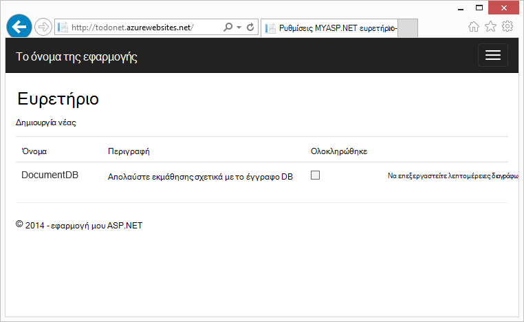

Γνωρίστε αυτό δείχνει πώς μπορείτε να χρησιμοποιήσετε την υπηρεσία DocumentDB που παρέχεται από Azure για την αποθήκευση και την πρόσβαση σε δεδομένα από μια εφαρμογή web ASP.NET MVC που φιλοξενούνται στο Azure. Εάν αναζητάτε ένα πρόγραμμα εκμάθησης που εστιάζει μόνο στις DocumentDB και όχι τα στοιχεία ASP.NET MVC, ανατρέξτε στο θέμα [Δημιουργία μιας εφαρμογής κονσόλας DocumentDB C#](documentdb-get-started.md).

> [AZURE.TIP] Αυτό το πρόγραμμα εκμάθησης προϋποθέτει ότι έχετε εκ των προτέρων εμπειρία με χρήση του ASP.NET MVC και τοποθεσίες Web Azure. Εάν είστε νέος χρήστης του ASP.NET ή τα [Εργαλεία προαπαιτούμενες](#_Toc395637760), συνιστάται να πραγματοποιεί λήψη του έργου ολοκληρωμένο δείγμα από [GitHub][] και ακολουθώντας τις οδηγίες σε αυτό το δείγμα. Μόλις το ενσωματωμένο, μπορείτε να δείτε αυτό το άρθρο για να αποκτήσετε πληροφορίες για τον κωδικό στο περιβάλλον του έργου.

## Προαπαιτούμενα στοιχεία για αυτό το πρόγραμμα εκμάθησης βάσης δεδομένων

Πριν να ακολουθήσετε τις οδηγίες σε αυτό το άρθρο, θα πρέπει να εξασφαλίσετε ότι έχετε τα εξής:

- Λογαριασμού Azure active. Εάν δεν έχετε ένα λογαριασμό, μπορείτε να δημιουργήσετε ένα δωρεάν λογαριασμό της δοκιμαστικής έκδοσης σε λίγα λεπτά. Για λεπτομέρειες, ανατρέξτε στο θέμα [Azure δωρεάν δοκιμαστικής έκδοσης](https://azure.microsoft.com/pricing/free-trial/).
- [Visual Studio 2015](http://www.visualstudio.com/) ή του Visual Studio 2013 ενημέρωση 4 ή νεότερη έκδοση. Εάν το Visual Studio 2013, θα πρέπει να εγκαταστήσετε το [πακέτο nuget Microsoft.Net.Compilers](https://www.nuget.org/packages/Microsoft.Net.Compilers/) για να προσθέσετε υποστήριξη για το C# 6.0. 
- Azure SDK για .NET έκδοση 2.5.1 ή νεότερη έκδοση, μέσω του [Προγράμματος εγκατάστασης πλατφόρμας Web της Microsoft][].

Όλα τα στιγμιότυπα οθόνης σε αυτό το άρθρο έχουν ληφθεί με χρήση του Visual Studio 2013 με 4 ενημέρωση εφαρμόζονται και στο SDK Azure για .NET έκδοση 2.5.1. Εάν το σύστημά σας έχει ρυθμιστεί με διαφορετικές εκδόσεις είναι πιθανό ότι τις επιλογές για τις οθόνες και δεν θα ταιριάζουν με εντελώς, αλλά εάν πληροίτε τις προϋποθέσεις παραπάνω θα πρέπει να λειτουργούν αυτήν τη λύση.

## Βήμα 1: Δημιουργία λογαριασμού DocumentDB βάσης δεδομένων

Ας ξεκινήσουμε με τη δημιουργία ενός λογαριασμού DocumentDB. Εάν έχετε ήδη ένα λογαριασμό, μπορείτε να μεταβείτε στο θέμα [Δημιουργία νέας εφαρμογής ASP.NET MVC](#_Toc395637762).

[AZURE.INCLUDE [documentdb-create-dbaccount](../../includes/documentdb-create-dbaccount.md)]

[AZURE.INCLUDE [documentdb-keys](../../includes/documentdb-keys.md)]

 
Τώρα θα θα καθοδηγήσουμε με τη διαδικασία για να δημιουργήσετε μια νέα εφαρμογή ASP.NET MVC από το έδαφος προς τα επάνω. 

## Βήμα 2: Δημιουργία νέας εφαρμογής ASP.NET MVC

Τώρα που έχετε ρυθμίσει ένα λογαριασμό, ας δημιουργήσουμε το νέο έργο ASP.NET.

1. Στο Visual Studio, στο μενού **αρχείο** , επιλέξτε **Δημιουργία**και, στη συνέχεια, κάντε κλικ στην επιλογή **έργο**.

    Εμφανίζεται το παράθυρο διαλόγου **Νέο έργο** .
2. Στο παράθυρο **τύπους έργων** , αναπτύξτε **πρότυπα**, **Visual C#**, **Web**και, στη συνέχεια, επιλέξτε **Την εφαρμογή Web ASP.NET**.

    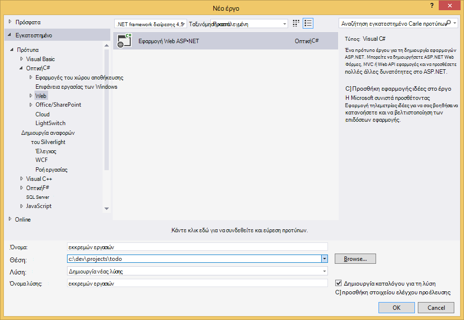

3. Στο πλαίσιο **όνομα** , πληκτρολογήστε το όνομα του έργου. Αυτό το πρόγραμμα εκμάθησης χρησιμοποιεί το όνομα "todo". Εάν επιλέξετε να χρησιμοποιήσετε κάποιο στοιχείο εκτός από αυτό, στη συνέχεια, όπου και αν αυτό το πρόγραμμα εκμάθησης ακρόασης σχετικά με το χώρο ονομάτων todo, πρέπει να προσαρμόσετε τα δείγματα κώδικα που παρέχεται για να χρησιμοποιήσετε ό, τι με την εφαρμογή σας. 

4. Κάντε κλικ στο κουμπί **Αναζήτηση** για να μεταβείτε στο φάκελο όπου θέλετε να δημιουργήσετε το έργο και, στη συνέχεια, κάντε κλικ στο κουμπί **OK**.

    Εμφανίζεται το παράθυρο διαλόγου **Νέο έργο ASP.NET** .

    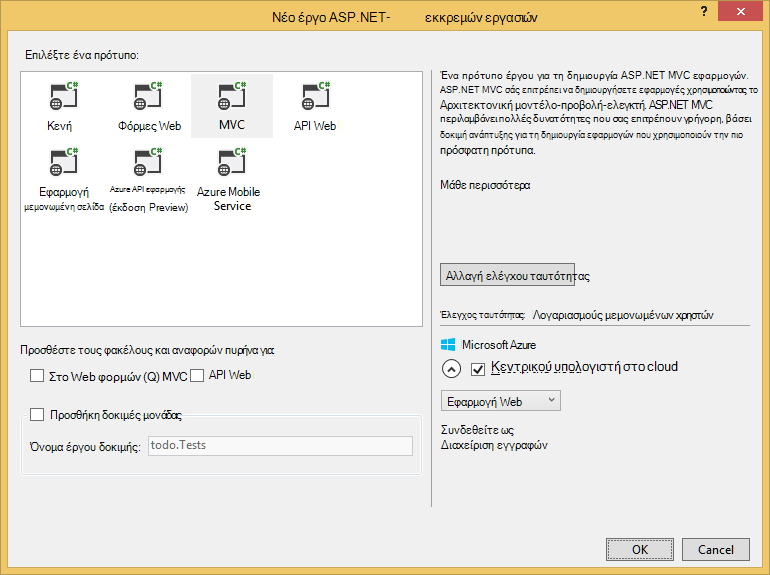

5. Στο παράθυρο πρότυπα, επιλέξτε **MVC**.

6. Εάν σχεδιάζετε να κάνετε την εφαρμογή σε Azure, στη συνέχεια, επιλέξτε **κεντρικού υπολογιστή στο cloud** σε στην κάτω δεξιά γωνία για να έχετε Azure που φιλοξενεί την εφαρμογή. Θα σας έχετε επιλέξει να φιλοξενήσετε στο cloud και να εκτελέσετε την εφαρμογή που φιλοξενούνται σε μια τοποθεσία Web του Azure. Αυτή η επιλογή θα preprovision μια τοποθεσία Web του Azure για εσάς και διευκολύνουν ζωής πολύ όταν έρθει η ώρα για να αναπτύξετε την τελική εφαρμογή εργασία. Εάν θέλετε να φιλοξενήσετε αυτό σε άλλη θέση ή δεν θέλετε να ρυθμίσετε τις παραμέτρους Azure προκαταβολικά, στη συνέχεια, απλώς καταργήστε **κεντρικού υπολογιστή στο Cloud**.

7. Κάντε κλικ στο κουμπί **OK** και επιτρέψτε Visual Studio κάνετε το πράγμα γύρω από ικριωμάτων το κενό πρότυπο ASP.NET MVC. 

8. Εάν επιλέξατε να φιλοξενήσετε αυτό στο cloud θα δείτε τουλάχιστον μία επιπλέον οθόνη που σας ζητά να συνδεθείτε στο λογαριασμό σας Azure και παρέχει ορισμένες τιμές για τη νέα τοποθεσία Web. Παρέχετε όλες τις πρόσθετες τιμές και να συνεχίσετε. 

    Να έχετε επιλέξει "διακομιστή βάσης δεδομένων" εδώ, επειδή θα σας δεν χρησιμοποιείτε ένα διακομιστή βάσης δεδομένων SQL Azure εδώ, θα κάνουμε για να δημιουργήσετε ένα νέο λογαριασμό Azure DocumentDB αργότερα στην πύλη του Azure.

    Για περισσότερες πληροφορίες σχετικά με την επιλογή μιας **εφαρμογής υπηρεσίας σχεδίου** και **ομάδας πόρων**, ανατρέξτε στο θέμα [Επισκόπηση αναλυτικά σχέδια Azure εφαρμογής υπηρεσίας](../app-service/azure-web-sites-web-hosting-plans-in-depth-overview.md).

    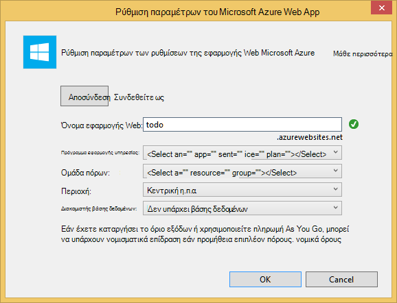

9. Μόλις ολοκληρωθεί η δημιουργία το μόνιμο κείμενο MVC εφαρμογή Visual Studio έχετε μια κενή εφαρμογή ASP.NET που μπορείτε να εκτελέσετε τοπικά.

    Θα γίνει παράλειψη εκτελείται το έργο τοπικά επειδή είμαι βέβαιος μας έχετε όλα φαίνονται τα ASP.NET "Γεια" εφαρμογή. Ας εξετάσουμε απευθείας με την προσθήκη DocumentDB σε αυτό το έργο και δημιουργία μας εφαρμογής.

## Βήμα 3: Προσθήκη DocumentDB το έργο εφαρμογής web MVC

Τώρα που έχουμε μεγαλύτερο μέρος του υδραυλικών ASP.NET MVC που χρειαζόμαστε για αυτήν τη λύση, ας ξεκινήσουμε το πραγματικό σκοπό αυτού του προγράμματος εκμάθησης, προσθήκη Azure DocumentDB μας MVC εφαρμογή web.

1. Το .NET SDK DocumentDB είναι συσκευαστούν και διανέμεται ως ένα πακέτο NuGet. Για να λάβετε το πακέτο NuGet στο Visual Studio, χρησιμοποιήστε τη Διαχείριση πακέτου NuGet στο Visual Studio, κάνοντας δεξί κλικ στο έργο στο **Εξερεύνηση λύσεων** και, στη συνέχεια, κάνοντας κλικ στην επιλογή **Διαχείριση πακέτων NuGet**.

    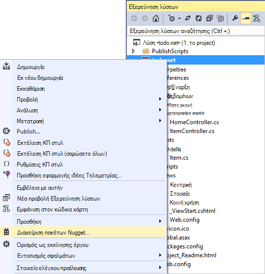

    Εμφανίζεται το παράθυρο διαλόγου **Διαχείριση πακέτων NuGet** .

2. Στο πλαίσιο NuGet **Αναζήτηση** , πληκτρολογήστε ***Azure DocumentDB***.
    
    Από τα αποτελέσματα, εγκαταστήστε το πακέτο **Βιβλιοθήκης προγράμματος-πελάτη του Microsoft Azure DocumentDB** . Θα κάνετε λήψη και εγκατάσταση του πακέτου DocumentDB, καθώς και όλων των εξαρτήσεων, όπως Newtonsoft.Json. Κάντε κλικ στο **κουμπί OK** στο παράθυρο **προεπισκόπησης** , και **να αποδοχή** στο παράθυρο **Αποδοχή άδειας χρήσης** για να ολοκληρώσετε την εγκατάσταση.

    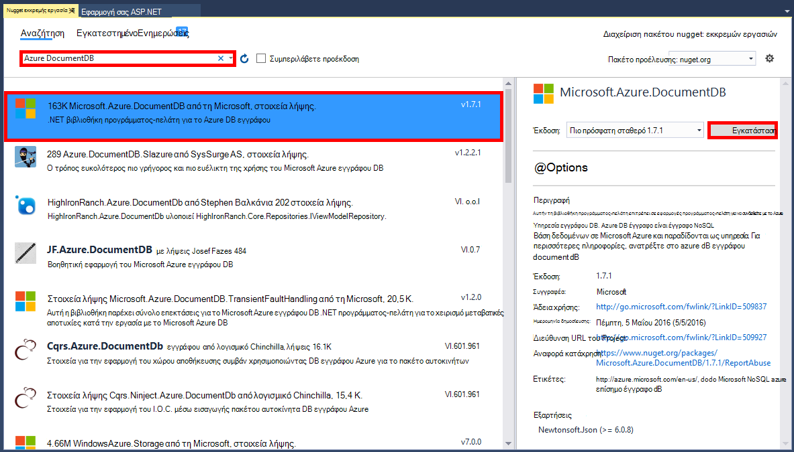

    Εναλλακτικά, μπορείτε να χρησιμοποιήσετε την Κονσόλα διαχείρισης πακέτου για να εγκαταστήσετε το πακέτο. Για να κάνετε αυτό, στο μενού **Εργαλεία** , κάντε κλικ στην επιλογή **Διαχείριση πακέτου NuGet**και, στη συνέχεια, κάντε κλικ στην επιλογή **Κονσόλα διαχείρισης πακέτου**. Στη γραμμή εντολών, πληκτρολογήστε τα εξής.

        Install-Package Microsoft.Azure.DocumentDB

3. Μόλις εγκαταστήσετε το πακέτο, η λύση Visual Studio θα πρέπει να μοιάζει με τα εξής με τις δύο νέες αναφορές προσθέσει, Microsoft.Azure.Documents.Client και Newtonsoft.Json.

    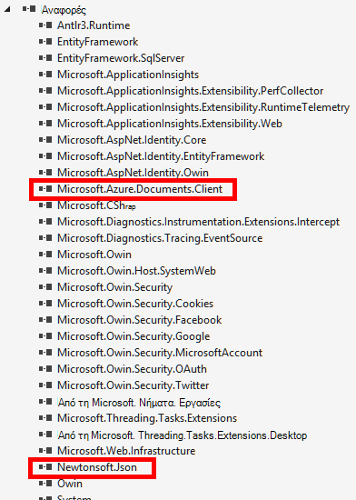

##Βήμα 4: Ρύθμιση της εφαρμογής ASP.NET MVC
 
Τώρα ας προσθέσουμε τα μοντέλα, προβολών και ελεγκτές σε αυτήν την εφαρμογή MVC:

- [Προσθήκη ενός μοντέλου](#_Toc395637764).
- [Προσθήκη ενός ελεγκτή](#_Toc395637765).
- [Προσθήκη προβολών](#_Toc395637766).

### Προσθέστε ένα μοντέλο δεδομένων JSON

Ας ξεκινήσουμε δημιουργώντας το **M** σε MVC, το μοντέλο. 

1. Στην **Εξερεύνηση λύσεων**, κάντε δεξί κλικ στο φάκελο **μοντέλα** , κάντε κλικ στην επιλογή **Προσθήκη**και, στη συνέχεια, κάντε κλικ στην επιλογή **τάξης**.

    Εμφανίζεται το παράθυρο διαλόγου **Προσθήκη νέου στοιχείου** .

2. Ονομάστε το νέο κλάσης **Item.cs** και κάντε κλικ στην επιλογή **Προσθήκη**. 

3. Σε αυτό το νέο αρχείο **Item.cs** , προσθέστε τα εξής μετά την τελευταία *χρησιμοποιώντας πρόταση*.
        
        using Newtonsoft.Json;
    
4. Αντικατάσταση τώρα αυτόν τον κωδικό 
        
        public class Item
        {
        }

    με τον ακόλουθο κώδικα.

        public class Item
        {
            [JsonProperty(PropertyName = "id")]
            public string Id { get; set; }
             
            [JsonProperty(PropertyName = "name")]
            public string Name { get; set; }

            [JsonProperty(PropertyName = "description")]
            public string Description { get; set; }

            [JsonProperty(PropertyName = "isComplete")]
            public bool Completed { get; set; }
        }

    Όλα τα δεδομένα στο DocumentDB είναι μεταβιβάζεται μέσω σύρματος και έχουν αποθηκευτεί ως JSON. Για να ελέγξετε τον τρόπο τα αντικείμενα είναι σειριοποιημένο/αποσειριοποιηθούν από JSON.NET μπορείτε να χρησιμοποιήσετε το χαρακτηριστικό **JsonProperty** , όπως φαίνεται στην τάξη **στοιχείου** που δημιουργήσαμε. Που δεν **πρέπει** να το κάνετε αυτό αλλά θέλω να διασφαλίσετε ότι οι ιδιότητες ακολουθήστε τις συμβάσεις ονομασίας camelCase JSON. 
    
    Όχι μόνο να ελέγχετε η μορφή για το όνομα της ιδιότητας όταν μεταβαίνετε σε JSON, αλλά μπορείτε να μετονομάσετε το .NET ιδιότητες εντελώς, όπως έκανα με την ιδιότητα **Περιγραφή** . 
    

### Προσθέστε έναν ελεγκτή

Που αναλαμβάνει **M**; τώρα ας δημιουργία το **C** σε MVC, κλάση ελεγκτή.

1. Στην **Εξερεύνηση λύσεων**, κάντε δεξί κλικ στο φάκελο **ελεγκτές** , κάντε κλικ στην επιλογή **Προσθήκη**και, στη συνέχεια, κάντε κλικ στην επιλογή **ελεγκτή**.

    Εμφανίζεται το παράθυρο διαλόγου **Προσθήκη Scaffold** .

2. Επιλέξτε **MVC ελεγκτή 5 - είναι κενή** και, στη συνέχεια, κάντε κλικ στην επιλογή **Προσθήκη**.

    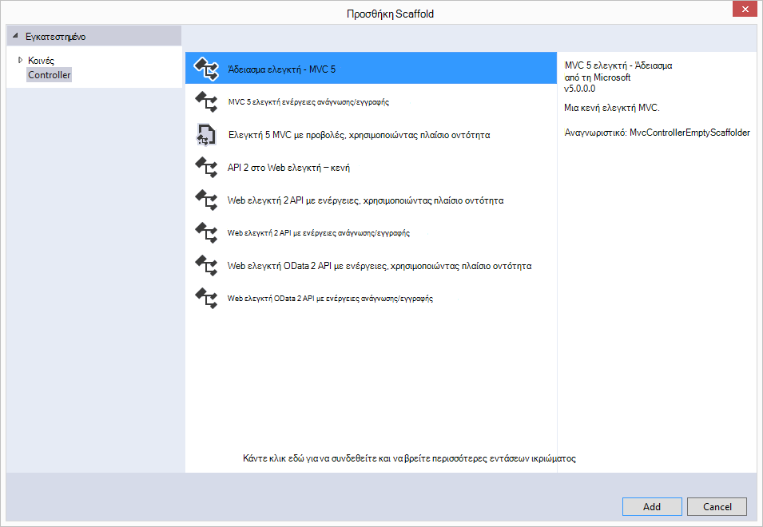

3. Ονομάστε το νέο ελεγκτή, **ItemController.**

    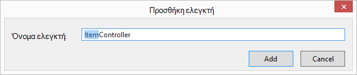

    Αφού δημιουργηθεί το αρχείο, η λύση Visual Studio θα πρέπει να μοιάζει με την ακόλουθη με το νέο αρχείο ItemController.cs στην **Εξερεύνηση λύσεων**. Εμφανίζεται επίσης το νέο αρχείο Item.cs που δημιουργήσατε νωρίτερα.

    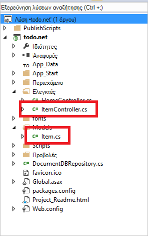

    Μπορείτε να κλείσετε ItemController.cs, θα σας θα επιστρέψει σε αυτό αργότερα. 

### Προσθήκη προβολών

Τώρα, ας δημιουργήσουμε το **V** στο MVC, τις προβολές:

- [Προσθήκη μιας προβολής στοιχείο ευρετηρίου](#AddItemIndexView).
- [Προσθήκη νέου στοιχείου προβολής](#AddNewIndexView).
- [Προσθήκη μιας προβολής Επεξεργασία στοιχείου](#_Toc395888515).

#### Προσθήκη μιας προβολής στοιχείο ευρετηρίου

1. Στην **Εξερεύνηση λύσεων**, αναπτύξτε το φάκελο **προβολές** , κάντε δεξί κλικ στο κενό φάκελο **στοιχείου** που δημιουργείται Visual Studio για εσάς όταν που προσθέσατε προηγουμένως το **ItemController** , κάντε κλικ στην επιλογή **Προσθήκη**και, στη συνέχεια, κάντε κλικ στην επιλογή **Προβολή**.

    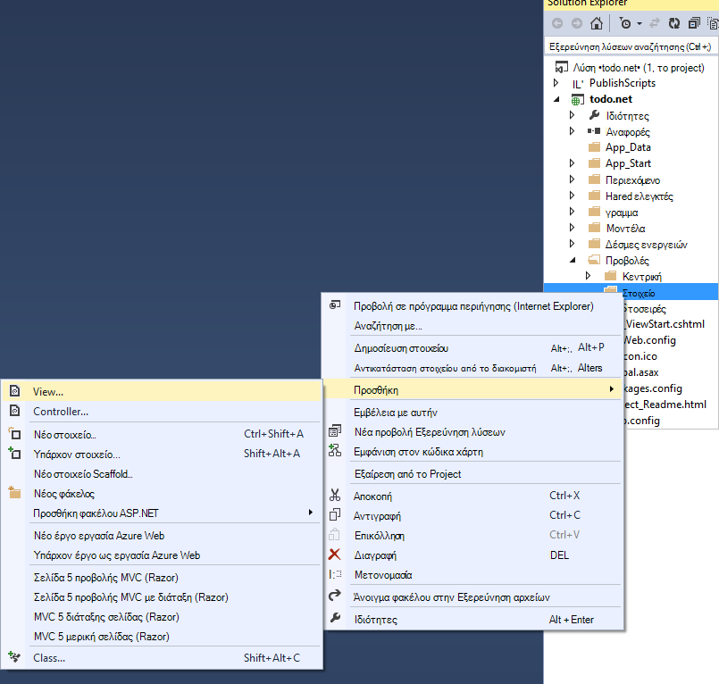

2. Στο παράθυρο διαλόγου **Προσθήκη προβολής** , κάντε τα εξής:
    - Στο πλαίσιο **όνομα προβολής** , πληκτρολογήστε ***ευρετηρίου***.
    - Στο πλαίσιο **προτύπου** , επιλέξτε ***τη λίστα***.
    - Στο πλαίσιο **κλάση μοντέλου** , επιλέξτε ***στοιχείου (todo. Μοντέλα)***.
    - Αφήστε κενό το πλαίσιο **κλάσης περιβάλλον δεδομένων** . 
    - Στο πλαίσιο "διάταξη σελίδας", πληκτρολογήστε ***~/Views/Shared/_Layout.cshtml***.
    
    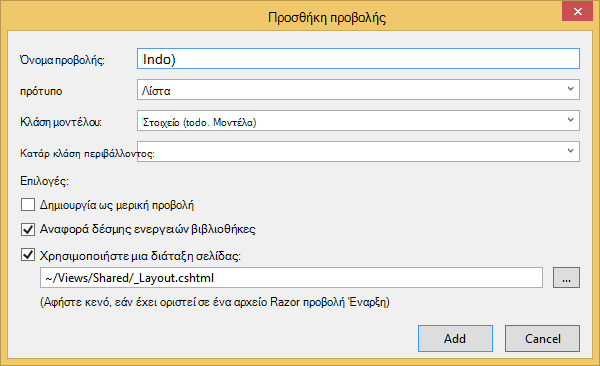

3. Μόλις όλες αυτές τις τιμές που έχουν οριστεί, κάντε κλικ στην επιλογή **Προσθήκη** και επιτρέψτε Visual Studio Δημιουργήστε μια νέα προβολή προτύπου. Μετά την ολοκλήρωση, θα ανοίξει το αρχείο cshtml που δημιουργήθηκε. Θα σας να κλείσετε αυτό το αρχείο στο Visual Studio, όπως θα σας θα επιστρέψει σε αυτό αργότερα.

#### Προσθήκη νέου στοιχείου προβολής

Παρόμοια με τον τρόπο που δημιουργήσαμε μια προβολή **Στοιχείο ευρετηρίου** , θα τώρα δημιουργήσουμε μια νέα προβολή για να δημιουργήσετε νέα **στοιχεία**.

1. Στην **Εξερεύνηση λύσεων**, κάντε ξανά δεξί κλικ στο φάκελο του **στοιχείου** , κάντε κλικ στην επιλογή **Προσθήκη**και, στη συνέχεια, κάντε κλικ στην επιλογή **Προβολή**.

2. Στο παράθυρο διαλόγου **Προσθήκη προβολής** , κάντε τα εξής:
    - Στο πλαίσιο **όνομα προβολής** , πληκτρολογήστε " ***Δημιουργία***".
    - Στο πλαίσιο **προτύπου** , επιλέξτε ***Δημιουργία***.
    - Στο πλαίσιο **κλάση μοντέλου** , επιλέξτε ***στοιχείου (todo. Μοντέλα)***.
    - Αφήστε κενό το πλαίσιο **κλάσης περιβάλλον δεδομένων** .
    - Στο πλαίσιο "διάταξη σελίδας", πληκτρολογήστε ***~/Views/Shared/_Layout.cshtml***.
    - Κάντε κλικ στην επιλογή **Προσθήκη**.

#### Προσθήκη μιας προβολής Επεξεργασία στοιχείου

Και τέλος, προσθέστε μία τελευταία προβολή για επεξεργασία ενός **στοιχείου** με τον ίδιο τρόπο όπως πριν.

1. Στην **Εξερεύνηση λύσεων**, κάντε ξανά δεξί κλικ στο φάκελο του **στοιχείου** , κάντε κλικ στην επιλογή **Προσθήκη**και, στη συνέχεια, κάντε κλικ στην επιλογή **Προβολή**.

2. Στο παράθυρο διαλόγου **Προσθήκη προβολής** , κάντε τα εξής:
    - Στο πλαίσιο **όνομα προβολής** , πληκτρολογήστε ***Επεξεργασία***.
    - Στο πλαίσιο του **προτύπου** , επιλέξτε ***Επεξεργασία***.
    - Στο πλαίσιο **κλάση μοντέλου** , επιλέξτε ***στοιχείου (todo. Μοντέλα)***.
    - Αφήστε κενό το πλαίσιο **κλάσης περιβάλλον δεδομένων** . 
    - Στο πλαίσιο "διάταξη σελίδας", πληκτρολογήστε ***~/Views/Shared/_Layout.cshtml***.
    - Κάντε κλικ στην επιλογή **Προσθήκη**.

Αφού το κάνετε αυτό, κλείστε όλα τα έγγραφα cshtml Visual Studio ως θα σας θα επιστρέψετε αργότερα αυτές τις προβολές.

## Βήμα 5: Καλωδίωσης του DocumentDB

Τώρα που είναι πραγματοποιήθηκε φροντίσει την τυπική στοιχείων MVC, ας δούμε την προσθήκη του κώδικα για DocumentDB. 

Σε αυτήν την ενότητα, θα προσθέσουμε κώδικα για να χειριστείτε τα εξής:

- [Καταχώρηση στοιχείων δεν ολοκληρώθηκε](#_Toc395637770).
- [Προσθήκη στοιχείων](#_Toc395637771).
- [Επεξεργασία στοιχείων](#_Toc395637772).

### Καταχώρηση στοιχείων δεν ολοκληρώθηκε στην εφαρμογή web σας MVC

Το πρώτο πράγμα που πρέπει να κάνετε εδώ είναι να προσθέσετε μια κλάση που περιέχει όλα τα λογική για να συνδεθείτε και να χρησιμοποιήσετε DocumentDB. Για αυτό το πρόγραμμα εκμάθησης, θα σας θα συμπύκνωση όλα αυτό λογικής στο αποθετήριο δεδομένων κλάσης που ονομάζεται DocumentDBRepository. 

1. Στην **Εξερεύνηση λύσεων**, κάντε δεξί κλικ στο έργο, κάντε κλικ στην επιλογή **Προσθήκη**και, στη συνέχεια, κάντε κλικ στην επιλογή **τάξης**. Δώστε ένα όνομα τη νέα κλάση **DocumentDBRepository** και κάντε κλικ στην επιλογή **Προσθήκη**.
 
2. Στο το πρόσφατα δημιουργημένο **DocumentDBRepository** κλάση και προσθέστε το παρακάτω *Χρήση προτάσεων* επάνω από τη δήλωση *χώρου ονομάτων*
        
        using Microsoft.Azure.Documents; 
        using Microsoft.Azure.Documents.Client; 
        using Microsoft.Azure.Documents.Linq; 
        using System.Configuration;
        using System.Linq.Expressions;
        using System.Threading.Tasks;

    Αντικατάσταση τώρα αυτόν τον κωδικό 

        public class DocumentDBRepository
        {
        }

    με τον ακόλουθο κώδικα.

        public static class DocumentDBRepository<T> where T : class
        {
            private static readonly string DatabaseId = ConfigurationManager.AppSettings["database"];
            private static readonly string CollectionId = ConfigurationManager.AppSettings["collection"];
            private static DocumentClient client;
    
            public static void Initialize()
            {
                client = new DocumentClient(new Uri(ConfigurationManager.AppSettings["endpoint"]), ConfigurationManager.AppSettings["authKey"]);
                CreateDatabaseIfNotExistsAsync().Wait();
                CreateCollectionIfNotExistsAsync().Wait();
            }
    
            private static async Task CreateDatabaseIfNotExistsAsync()
            {
                try
                {
                    await client.ReadDatabaseAsync(UriFactory.CreateDatabaseUri(DatabaseId));
                }
                catch (DocumentClientException e)
                {
                    if (e.StatusCode == System.Net.HttpStatusCode.NotFound)
                    {
                        await client.CreateDatabaseAsync(new Database { Id = DatabaseId });
                    }
                    else
                    {
                        throw;
                    }
                }
            }
    
            private static async Task CreateCollectionIfNotExistsAsync()
            {
                try
                {
                    await client.ReadDocumentCollectionAsync(UriFactory.CreateDocumentCollectionUri(DatabaseId, CollectionId));
                }
                catch (DocumentClientException e)
                {
                    if (e.StatusCode == System.Net.HttpStatusCode.NotFound)
                    {
                        await client.CreateDocumentCollectionAsync(
                            UriFactory.CreateDatabaseUri(DatabaseId),
                            new DocumentCollection { Id = CollectionId },
                            new RequestOptions { OfferThroughput = 1000 });
                    }
                    else
                    {
                        throw;
                    }
                }
            }
        }

    > [AZURE.TIP] Κατά τη δημιουργία ενός νέου DocumentCollection μπορείτε να δώσετε μια προαιρετική παράμετρος RequestOptions της OfferType, η οποία σας επιτρέπει να καθορίσετε το επίπεδο απόδοσης της νέας συλλογής. Εάν η παράμετρος αυτή δεν μεταβιβάζεται θα χρησιμοποιηθεί ο προεπιλεγμένος τύπος την προσφορά. Για περισσότερες πληροφορίες σχετικά με τους τύπους προσφορά DocumentDB, ανατρέξτε στα [Επίπεδα επιδόσεων DocumentDB](documentdb-performance-levels.md)

3. Θα σας διαβάζετε ορισμένες τιμές από τη ρύθμιση παραμέτρων, επομένως, ανοίξτε το αρχείο **Web.config** της εφαρμογής σας και προσθέστε τις ακόλουθες γραμμές στην περιοχή του `<AppSettings>` ενότητας.
    
        <add key="endpoint" value="enter the URI from the Keys blade of the Azure Portal"/>
        <add key="authKey" value="enter the PRIMARY KEY, or the SECONDARY KEY, from the Keys blade of the Azure  Portal"/>
        <add key="database" value="ToDoList"/>
        <add key="collection" value="Items"/>
    
4. Τώρα, ενημερώστε τις τιμές για το *τελικό σημείο* και *authKey* χρησιμοποιώντας τα πλήκτρα blade της πύλης Azure. Χρησιμοποιήστε το **URI** από τα πλήκτρα blade ως η τιμή της ρύθμισης τελικού σημείου και χρησιμοποιήστε το **ΠΡΩΤΕΎΟΝ ΚΛΕΙΔΊ**ή **ΔΕΥΤΕΡΕΎΟΝ ΚΛΕΙΔΊ** από τα πλήκτρα blade ως η τιμή της ρύθμισης authKey.

    Που παίρνει περίθαλψη καλωδίωσης ασφαλείας του αποθετηρίου DocumentDB, τώρα ας προσθέσουμε μας λογική της εφαρμογής.

5. Το πρώτο πράγμα που θέλουμε να έχετε τη δυνατότητα να κάνετε με μια εφαρμογή λίστα todo είναι να εμφανίσετε τα στοιχεία δεν ολοκληρώθηκε.  Αντιγράψτε και επικολλήστε το εξής τμήμα κώδικα σε οποιοδήποτε σημείο μέσα σε τάξη **DocumentDBRepository** .

        public static async Task<IEnumerable<T>> GetItemsAsync(Expression<Func<T, bool>> predicate)
        {
            IDocumentQuery<T> query = client.CreateDocumentQuery<T>(
                UriFactory.CreateDocumentCollectionUri(DatabaseId, CollectionId))
                .Where(predicate)
                .AsDocumentQuery();

            List<T> results = new List<T>();
            while (query.HasMoreResults)
            {
                results.AddRange(await query.ExecuteNextAsync<T>());
            }

            return results;
        }

6. Ανοίξτε το **ItemController** χρησιμοποιούμε προσθέσατε προηγουμένως και προσθέστε το παρακάτω *Χρήση προτάσεων* επάνω από τη δήλωση χώρου ονομάτων.

        using System.Net;
        using System.Threading.Tasks;
        using todo.Models;

    Εάν το έργο σας δεν ονομάζεται "todo", στη συνέχεια, πρέπει να ενημερώσετε χρησιμοποιώντας "todo. Μοντέλα"; Για να απεικονίσει το όνομα του έργου σας.

    Αντικατάσταση τώρα αυτόν τον κωδικό

        //GET: Item
        public ActionResult Index()
        {
            return View();
        }

    με τον ακόλουθο κώδικα.

        [ActionName("Index")]
        public async Task<ActionResult> IndexAsync()
        {
            var items = await DocumentDBRepository<Item>.GetItemsAsync(d => !d.Completed);
            return View(items);
        }
    
7. Ανοίξτε **Global.asax.cs** και προσθέστε την ακόλουθη γραμμή για τη μέθοδο **Application_Start** 
 
        DocumentDBRepository<todo.Models.Item>.Initialize();
    
Σε αυτό το σημείο τη λύση σας πρέπει να μπορείτε να δημιουργήσετε χωρίς σφάλματα.

Εάν εκτελέσατε η εφαρμογή τώρα, μπορείτε να μεταβείτε στο το **HomeController** και στην προβολή **ευρετηρίου** αυτού του ελεγκτή. Αυτή είναι η προεπιλεγμένη συμπεριφορά για το έργο πρότυπο MVC επιλέγουμε κατά την εκκίνηση, αλλά δεν θέλουμε που! Ας αλλάξουμε τη δρομολόγηση σε αυτήν την εφαρμογή MVC για να αλλάξετε αυτήν τη συμπεριφορά.

Άνοιγμα ***εφαρμογή\_Start\RouteConfig.cs*** και εντοπίστε τη γραμμή που ξεκινά με "προεπιλογές:" και να μοιάζει με την ακόλουθη αλλαγή.

        defaults: new { controller = "Item", action = "Index", id = UrlParameter.Optional }

Σε αυτό τώρα ενημερώνει MVC ASP.NET που Εάν δεν έχετε καθορίσει μια τιμή στη διεύθυνση URL για να ελέγξετε τη συμπεριφορά δρομολόγησης που αντί της **κεντρική**, χρησιμοποιήστε **στοιχείου** ως ελεγκτή και χρήστης **ευρετηρίου** ως στην προβολή.

Τώρα, εάν εκτελείτε την εφαρμογή, αυτό θα καλούν σας **ItemController** που θα καλέσετε την κλάση αποθετήριο και χρησιμοποιήστε τη μέθοδο GetItems για να επιστρέψετε όλα τα στοιχεία δεν ολοκληρώθηκε στις **προβολές**\\**στοιχείο**\\προβολή**ευρετηρίου** . 

Εάν μπορείτε να δημιουργήσετε και να εκτελέσετε αυτό το έργο τώρα, μπορείτε τώρα θα πρέπει να δείτε κάτι που έχει την εξής.    

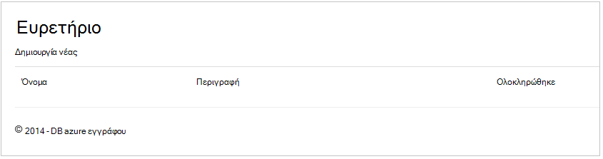

### Προσθήκη στοιχείων

Ας τοποθέτηση ορισμένα στοιχεία στη βάση δεδομένων μας, ώστε να έχουμε κάτι περισσότερο από ένα κενό πλέγμα για να τη δείτε.

Ας προσθέσουμε ορισμένα κώδικα για DocumentDBRepository και ItemController για να παραμένει την εγγραφή στο DocumentDB.

1.  Προσθέστε την ακόλουθη μέθοδο για την τάξη σας **DocumentDBRepository** .

        public static async Task<Document> CreateItemAsync(T item)
        {
            return await client.CreateDocumentAsync(UriFactory.CreateDocumentCollectionUri(DatabaseId, CollectionId), item);
        }

    Αυτή η μέθοδος λαμβάνει ένα αντικείμενο που του μεταβιβάστηκε, απλώς και αυτό παραμένει στο DocumentDB.

2. Ανοίξτε το αρχείο ItemController.cs και προσθέστε το παρακάτω τμήμα κώδικα μέσα σε τάξη. Πρόκειται για τον τρόπο ASP.NET MVC γνωρίζει τι πρέπει να κάνετε για την ενέργεια **Δημιουργία** . Σε αυτήν την περίπτωση απόδοση απλώς τη συσχετισμένη προβολή Create.cshtml που δημιουργήσατε νωρίτερα.

        [ActionName("Create")]
        public async Task<ActionResult> CreateAsync()
        {
            return View();
        }

    Τώρα είναι απαραίτητη ορισμένες περισσότερες κώδικα σε αυτόν τον ελεγκτή που θα αποδεχτεί την υποβολή από τη **Δημιουργία** προβολής.

2. Προσθήκη του επόμενου μπλοκ κώδικα στην κλάση ItemController.cs που σας ενημερώνει για το ASP.NET MVC τι πρέπει να κάνετε με μια φόρμα ΚΑΤΑΧΏΡΗΣΗΣ για αυτόν τον ελεγκτή.
    
        [HttpPost]
        [ActionName("Create")]
        [ValidateAntiForgeryToken]
        public async Task<ActionResult> CreateAsync([Bind(Include = "Id,Name,Description,Completed")] Item item)
        {
            if (ModelState.IsValid)
            {
                await DocumentDBRepository<Item>.CreateItemAsync(item);
                return RedirectToAction("Index");
            }

            return View(item);
        }

    Αυτός ο κωδικός καλεί σε για να το DocumentDBRepository και χρησιμοποιεί τη μέθοδο CreateItemAsync για να παραμένει το νέο στοιχείο todo στη βάση δεδομένων. 
 
    **Σημείωση ασφαλείας**: το χαρακτηριστικό **ValidateAntiForgeryToken** χρησιμοποιείται εδώ για να συμβάλετε στην προστασία αυτής της εφαρμογής από επιθέσεις πλαστογράφησης διατοποθεσιακή αίτηση. Υπάρχει και συνέχεια σε αυτήν από την προσθήκη μόνο αυτό το χαρακτηριστικό, προβολές σας πρέπει να συνεργαστεί με το διακριτικό καταπολέμησης της πλαστογράφησης καθώς και. Για περισσότερες πληροφορίες σχετικά με το θέμα και παραδείγματα για την υλοποίηση αυτό σωστά, ανατρέξτε στο θέμα [Αποτροπή πλαστογράφησης αίτηση διατοποθεσιακή][]. Ο κωδικός προέλευσης που παρέχονται στη [GitHub][] περιλαμβάνει την πλήρη εφαρμογή στη θέση.

    **Σημείωση ασφαλείας**: χρησιμοποιούμε επίσης το χαρακτηριστικό **δεσμεύσετε** την παράμετρο μέθοδο για την προστασία σε σχέση με υπερ-καταχώρησης επιθέσεις. Για περισσότερες λεπτομέρειες ανατρέξτε στο θέμα [Βασικές λειτουργίες CRUD στο ASP.NET MVC][].

Έτσι ολοκληρώνεται τον κώδικα που απαιτείται για την προσθήκη νέων στοιχείων με τη βάση δεδομένων.

### Επεξεργασία στοιχείων

Υπάρχει κάτι τελευταία για μας για να το κάνετε και αυτό είναι να προσθέσετε τη δυνατότητα να επεξεργαστείτε **τα στοιχεία** στη βάση δεδομένων και να τις επισημάνετε ως ολοκληρωμένες. Στην προβολή για επεξεργασία ήδη προστέθηκε στο έργο, ώστε μόνο πρέπει να προσθέσετε κάποιον κώδικα για να μας ελεγκτή και να την κλάση **DocumentDBRepository** ξανά.

1. Προσθέστε τα εξής για να την κλάση **DocumentDBRepository** .

        public static async Task<Document> UpdateItemAsync(string id, T item)
        {
            return await client.ReplaceDocumentAsync(UriFactory.CreateDocumentUri(DatabaseId, CollectionId, id), item);
        }

        public static async Task<T> GetItemAsync(string id)
        {
            try
            {
                Document document = await client.ReadDocumentAsync(UriFactory.CreateDocumentUri(DatabaseId, CollectionId, id));
                return (T)(dynamic)document;
            }
            catch (DocumentClientException e)
            {
                if (e.StatusCode == HttpStatusCode.NotFound)
                {
                    return null;
                }
                else
                {
                    throw;
                }
            }
        }
    
    Το πρώτο από τις παρακάτω μεθόδους, **GetItem** fetches ένα στοιχείο από DocumentDB που μεταβιβάζεται ξανά για να το **ItemController** και, στη συνέχεια, με την προβολή **επεξεργασίας** .
    
    Η δεύτερη από τις μεθόδους που μόλις Προσθέσαμε αντικαθιστά το **έγγραφο** στο DocumentDB με την έκδοση του **εγγράφου** μεταβιβάστηκε από το **ItemController**.

2. Προσθέστε τα εξής για να την κλάση **ItemController** .

        [HttpPost]
        [ActionName("Edit")]
        [ValidateAntiForgeryToken]
        public async Task<ActionResult> EditAsync([Bind(Include = "Id,Name,Description,Completed")] Item item)
        {
            if (ModelState.IsValid)
            {
                await DocumentDBRepository<Item>.UpdateItemAsync(item.Id, item);
                return RedirectToAction("Index");
            }

            return View(item);
        }

        [ActionName("Edit")]
        public async Task<ActionResult> EditAsync(string id)
        {
            if (id == null)
            {
                return new HttpStatusCodeResult(HttpStatusCode.BadRequest);
            }

            Item item = await DocumentDBRepository<Item>.GetItemAsync(id);
            if (item == null)
            {
                return HttpNotFound();
            }

            return View(item);
        }
    
    Η πρώτη μέθοδος χειρίζεται το Http GET που συμβαίνει όταν ο χρήστης κάνει κλικ στη σύνδεση **Επεξεργασία** από την προβολή **ευρετηρίου** . Αυτή η μέθοδος λαμβάνει ένα [**έγγραφο**](http://msdn.microsoft.com/library/azure/microsoft.azure.documents.document.aspx) από DocumentDB και μεταβιβάζει την προβολή **επεξεργασίας** .

    Την προβολή **επεξεργασίας** , στη συνέχεια, θα κάνετε μια ΔΗΜΟΣΊΕΥΣΗ Http για να το **IndexController**. 
    
    Η δεύτερη μέθοδος έχουμε προσθέσει χειρίζεται διαβίβαση το ενημερωμένο αντικείμενο σε DocumentDB να διατηρούνται στη βάση δεδομένων.

Τώρα, που είναι όλα όσα πρέπει να εκτελέσετε μας εφαρμογή, λίστα ελλιπή **στοιχεία**, να προσθέσετε νέα **στοιχεία**και επεξεργασία **στοιχείων**.

## Βήμα 6: Εκτελέστε την εφαρμογή τοπικά

Για να ελέγξετε την εφαρμογή στον τοπικό υπολογιστή σας, κάντε τα εξής:

1. Πατήστε F5 στο Visual Studio για να δημιουργήσετε την εφαρμογή σε λειτουργία εντοπισμού σφαλμάτων. Αυτό θα πρέπει να δημιουργήσετε την εφαρμογή και εκκίνηση ενός προγράμματος περιήγησης με τη σελίδα κενό πλέγμα μας είδατε πριν από την:

    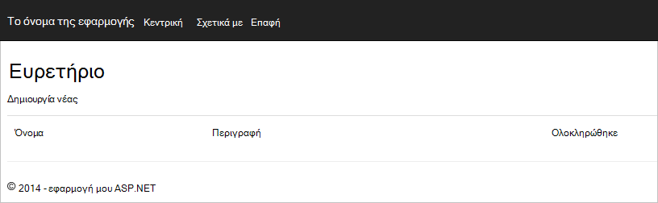

    Εάν χρησιμοποιείτε το Visual Studio 2013 και λάβετε το μήνυμα σφάλματος "Δεν είναι δυνατή η αναμένει στο σώμα ενός όρου προϊόντα." πρέπει να εγκαταστήσετε το [πακέτο nuget Microsoft.Net.Compilers](https://www.nuget.org/packages/Microsoft.Net.Compilers/). Μπορείτε επίσης να συγκρίνετε τον κωδικό σε σχέση με το δείγμα έργου σε [GitHub][]. 

2. Κάντε κλικ στη σύνδεση **Δημιουργία νέου** και προσθέστε τιμές στα πεδία **όνομα** και μια **Περιγραφή** . Αποχώρηση από την **ολοκλήρωση της** επιλογή του πλαισίου ελέγχου μη επιλεγμένο διαφορετικά το νέο **στοιχείο** θα προστεθούν σε μια κατάσταση ολοκλήρωσης και δεν θα εμφανίζονται στην αρχική λίστα.

    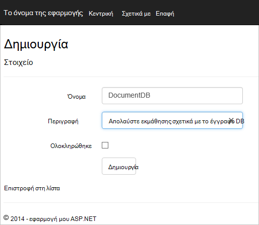

3. Κάντε κλικ στην επιλογή **Δημιουργία** και ανακατευθύνεστε στην προβολή **ευρετηρίου** και το **στοιχείο** εμφανίζεται στη λίστα.

    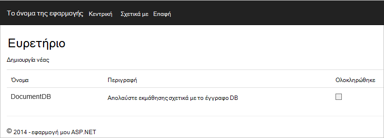

    Μπορείτε να προσθέσετε μερικά περισσότερα **στοιχεία** στη λίστα todo.

3. Κάντε κλικ στην επιλογή " **Επεξεργασία** " δίπλα σε ένα **στοιχείο** στη λίστα και που έχουν ληφθεί για την προβολή **επεξεργασίας** όπου μπορείτε να ενημερώσετε τυχόν ιδιότητας του αντικειμένου σας, συμπεριλαμβανομένης της σημαίας **ολοκληρώθηκε** . Εάν επισημάνετε τη σήμανση **ολοκλήρωσης** και κάντε κλικ στην επιλογή **Αποθήκευση**, το **στοιχείο** έχει καταργηθεί από τη λίστα των μη ολοκληρωμένες εργασίες.

    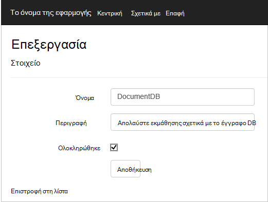

4. Μία φορά που έχετε δοκιμή της εφαρμογής, πατήστε το συνδυασμό πλήκτρων Ctrl + F5 για να διακόψετε τον εντοπισμό σφαλμάτων της εφαρμογής. Είστε έτοιμοι να αναπτύξετε το!

## Βήμα 7: Ανάπτυξη της εφαρμογής στις τοποθεσίες Web Azure

Τώρα που έχετε εγκαταστήσει την πλήρη εφαρμογή λειτουργούν σωστά με το DocumentDB θα κάνουμε για την ανάπτυξη αυτής της εφαρμογής web στις τοποθεσίες Web Azure. Εάν έχετε επιλέξει **κεντρικού υπολογιστή στο cloud** , όταν δημιουργήσατε το κενό έργο ASP.NET MVC, στη συνέχεια, Visual Studio διευκολύνει πραγματικά και κάνει πιο των εργασιών για εσάς. 

1. Για να δημοσιεύσετε αυτήν την εφαρμογή μόνο που πρέπει να κάνετε είναι να κάντε δεξί κλικ στο έργο στην **Εξερεύνηση λύσεων** και κάντε κλικ στην επιλογή **Δημοσίευση**.

    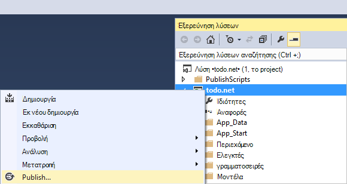

2. Όλα όσα πρέπει να ρυθμιστεί ήδη σύμφωνα με τα διαπιστευτήριά σας; για την ακρίβεια της τοποθεσίας Web έχει ήδη δημιουργηθεί στο Azure για εσάς σε **Διεύθυνση URL προορισμού** φαίνεται, μόνο που πρέπει να κάνετε είναι να κάντε κλικ στο κουμπί **Δημοσίευση**.

    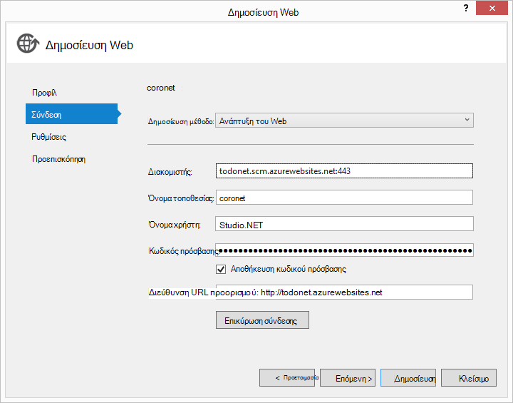

Σε μερικά δευτερόλεπτα, Visual Studio θα λήξης δημοσίευσης της εφαρμογής web και εκκίνηση ενός προγράμματος περιήγησης όπου μπορείτε να δείτε εύχρηστο εργασίας εκτελείται στο Azure!

## Επόμενα βήματα

Συγχαρητήρια! Μόλις δημιουργηθεί το πρώτο MVC ASP.NET εφαρμογής web με χρήση Azure DocumentDB και τη δημοσίευσή του Azure τοποθεσίες Web. Ο κωδικός προέλευσης για την πλήρη εφαρμογή, όπως οι λειτουργίες λεπτομερειών και διαγραφή που δεν περιλαμβάνονται σε αυτό το πρόγραμμα εκμάθησης λήψης ή κλωνοποιηθεί από [GitHub][]. Επομένως, εάν σας ενδιαφέρει που προσθέτοντας την εφαρμογή, χρησιμοποιήσετε τον κωδικό και προσθέστε το αυτής της εφαρμογής.

Για να προσθέσετε πρόσθετες λειτουργίες στην εφαρμογή σας, εξετάστε τα διαθέσιμα στη [Βιβλιοθήκη .NET DocumentDB](https://msdn.microsoft.com/library/azure/dn948556.aspx) API και μην διστάσεις να συμβάλει στη βιβλιοθήκη .NET DocumentDB στην [GitHub][]. 

[\*]: https://microsoft.sharepoint.com/teams/DocDB/Shared%20Documents/Documentation/Docs.LatestVersions/PicExportError
[Visual Studio Express]: http://www.visualstudio.com/products/visual-studio-express-vs.aspx
[Πρόγραμμα εγκατάστασης πλατφόρμας Microsoft στο Web]: http://www.microsoft.com/web/downloads/platform.aspx
[Αποτροπή πλαστογράφησης διατοποθεσιακή αίτηση]: http://go.microsoft.com/fwlink/?LinkID=517254
[Βασικές CRUD πράξεις σε ASP.NET MVC]: http://go.microsoft.com/fwlink/?LinkId=317598
[GitHub]: https://github.com/Azure-Samples/documentdb-net-todo-app
