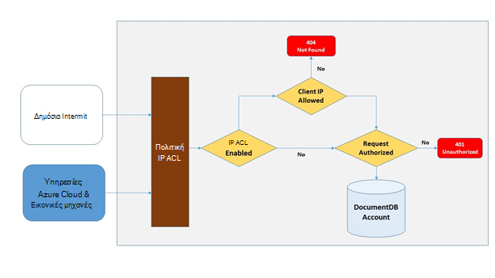
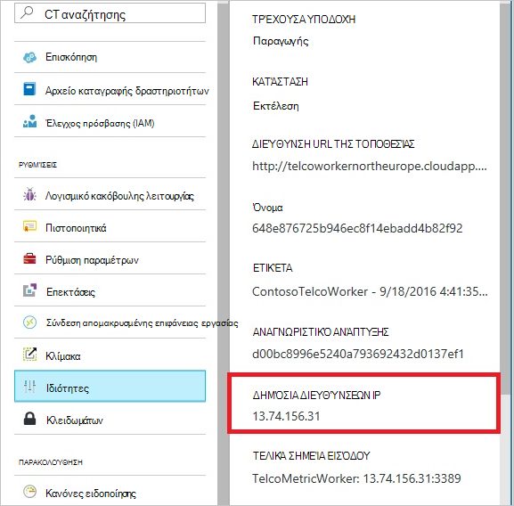
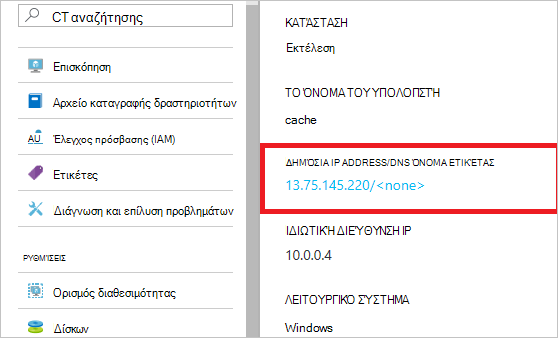
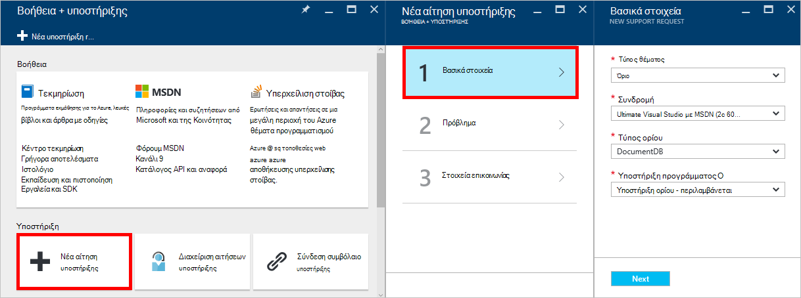
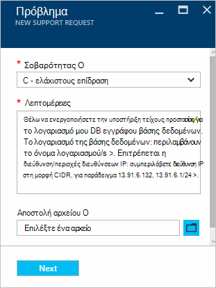

<properties
    pageTitle="Υποστήριξη τείχους προστασίας DocumentDB | Microsoft Azure"
    description="Μάθετε πώς μπορείτε να χρησιμοποιήσετε πολιτικές ελέγχου πρόσβασης IP για την υποστήριξη τείχος προστασίας Azure DocumentDB λογαριασμούς βάσης δεδομένων."
    keywords="Έλεγχος πρόσβασης IP, υποστήριξη τείχους προστασίας"
    services="documentdb"
    authors="shahankur11"
    manager="jhubbard"
    editor=""
    tags="azure-resource-manager"
    documentationCenter=""/>

<tags 
    ms.service="documentdb" 
    ms.workload="data-services" 
    ms.tgt_pltfrm="na" 
    ms.devlang="na" 
    ms.topic="article" 
    ms.date="10/17/2016" 
    ms.author="ankshah; kraman"/>

# Υποστήριξη DocumentDB τείχους προστασίας

Για να ασφαλίσετε δεδομένα αποθηκευμένα σε ένα λογαριασμό Azure DocumentDB βάσης δεδομένων, DocumentDB έχει παρέχει υποστήριξη για μυστικού που βασίζεται σε [μοντέλο εξουσιοδότησης](https://msdn.microsoft.com/library/azure/dn783368.aspx) που χρησιμοποιεί έναν κωδικό ελέγχου ταυτότητας ισχυρό βάσει κατακερματισμός μηνύματος (HMAC). Τώρα, εκτός από το μοντέλο μυστικού με βάση εξουσιοδότησης, DocumentDB υποστηρίζει πολιτικής βάσει βάσει IP πρόσβαση σε στοιχεία ελέγχου για την υποστήριξη εισερχομένων του τείχους προστασίας. Αυτό το μοντέλο είναι παρόμοια με τους κανόνες τείχους προστασίας ενός συστήματος παραδοσιακή βάση δεδομένων και παρέχει ένα πρόσθετο επίπεδο ασφαλείας για το λογαριασμό DocumentDB βάσης δεδομένων. Με αυτό το μοντέλο, τώρα μπορείτε να ρυθμίσετε ένα λογαριασμό DocumentDB βάσης δεδομένων να είναι δυνατή η πρόσβαση μόνο από ένα σύνολο εγκεκριμένο μηχανές ή/και στο cloud services. Πρόσβαση σε πόρους DocumentDB από αυτά τα σύνολα εγκεκριμένο μηχανές και υπηρεσιών εξακολουθούν να απαιτούν από τον καλούντα για την παρουσίαση ενός διακριτικού έγκυρη άδεια.

## Επισκόπηση του ελέγχου πρόσβασης IP

Από προεπιλογή, ένα λογαριασμό DocumentDB βάση δεδομένων είναι προσβάσιμα από δημόσια στο internet με την προϋπόθεση ότι η αίτηση συνοδεύεται από ένα διακριτικό έγκυρη άδεια. Για να ρυθμίσετε τις παραμέτρους έλεγχο πρόσβασης βάσει πολιτικής IP, ο χρήστης πρέπει να παρέχει το σύνολο των διευθύνσεων IP ή περιοχές διευθύνσεων IP στη φόρμα CIDR που θα συμπεριληφθούν στη λίστα επιτρεπόμενων του προγράμματος-πελάτη διευθύνσεις IP για ένα λογαριασμό που δίνεται βάσης δεδομένων. Όταν εφαρμόζεται αυτή η ρύθμιση παραμέτρων, θα αποκλειστούν όλες τις αιτήσεις που προέρχονται από μηχανές έξω από αυτήν τη λίστα επιτρεπόμενων από το διακομιστή.  Η σύνδεση επεξεργασίας ροής για τον έλεγχο πρόσβασης βάσει IP περιγράφεται στο παρακάτω διάγραμμα.

## Συνδέσεις από τις υπηρεσίες cloud

Στο Azure, τις υπηρεσίες cloud είναι πολύ συνηθισμένο τρόπο για τη φιλοξενία μεσαίας λογικής υπηρεσία χρησιμοποιώντας DocumentDB. Για να ενεργοποιήσετε την πρόσβαση σε ένα λογαριασμό DocumentDB βάσης δεδομένων από μια υπηρεσία cloud, πρέπει να προστεθεί στη δημόσια διεύθυνση IP της υπηρεσίας cloud στη λίστα επιτρεπόμενων διευθύνσεων IP που σχετίζεται με το λογαριασμό σας DocumentDB βάσης δεδομένων με [επικοινωνία με την υποστήριξη του Azure](#configure-ip-policy).  Αυτό εξασφαλίζει ότι όλες τις εμφανίσεις του ρόλου των υπηρεσιών cloud έχουν πρόσβαση στο λογαριασμό σας DocumentDB βάσης δεδομένων. Μπορείτε να ανακτήσετε διευθύνσεις IP για τις υπηρεσίες cloud σας στην πύλη του Azure, όπως φαίνεται στο παρακάτω στιγμιότυπο οθόνης. 

Όταν κλίμακα ανάληψη την υπηρεσία cloud, προσθέτοντας επιπλέον ρόλο των παρουσιών, αυτές τις νέες παρουσίες αυτόματα θα έχουν πρόσβαση στο λογαριασμό DocumentDB βάσης δεδομένων, επειδή αποτελούν μέρος του την ίδια υπηρεσία cloud.

## Συνδέσεις από εικονικές μηχανές

[Εικονικές μηχανές](https://azure.microsoft.com/services/virtual-machines/) ή τα [σύνολα κλίμακα εικονική μηχανή](../virtual-machine-scale-sets/virtual-machine-scale-sets-overview.md) μπορεί επίσης να χρησιμοποιηθεί για τη φιλοξενία μεσαίας υπηρεσίες χρησιμοποιώντας DocumentDB.  Για να ρυθμίσετε τις παραμέτρους του DocumentDB λογαριασμό της βάσης δεδομένων για να επιτρέψετε την πρόσβαση από εικονικές μηχανές, δημόσιες διευθύνσεις IP του εικονική μηχανή ή/και σύνολο κλίμακα εικονική μηχανή πρέπει να ρυθμιστεί ως μία των επιτρεπόμενων διευθύνσεων IP για το λογαριασμό σας DocumentDB βάσης δεδομένων με [επικοινωνία με την υποστήριξη του Azure](#configure-ip-policy). Μπορείτε να ανακτήσετε διευθύνσεις IP για εικονικές μηχανές στην πύλη του Azure, όπως φαίνεται στο παρακάτω στιγμιότυπο οθόνης.

Όταν προσθέτετε επιπλέον εικονική μηχανή παρουσίες στην ομάδα, παρέχονται αυτόματα πρόσβαση στο λογαριασμό σας DocumentDB βάσης δεδομένων.

## Συνδέσεις από το internet

Κατά την πρόσβαση σε ένα λογαριασμό DocumentDB βάσης δεδομένων από έναν υπολογιστή στο internet, τη διεύθυνση IP υπολογιστή-πελάτη ή τη διεύθυνση IP του υπολογιστή πρέπει να προστεθεί στη λίστα επιτρεπόμενων διευθύνσεων IP για το λογαριασμό DocumentDB βάσης δεδομένων. 

## Ρύθμιση παραμέτρων της πολιτικής ελέγχου πρόσβασης IP

Χρησιμοποιήστε την πύλη του Azure για να υποβάλετε μια αίτηση με την [Υποστήριξη Azure](https://portal.azure.com/?#blade/Microsoft_Azure_Support/HelpAndSupportBlade) για να ενεργοποιήσετε την πολιτική ελέγχου πρόσβασης IP στο λογαριασμό σας βάση δεδομένων.

1. Στο blade [Βοήθεια + υποστήριξης](https://portal.azure.com/?#blade/Microsoft_Azure_Support/HelpAndSupportBlade) , επιλέξτε **Δημιουργία υποστηρίζει την αίτηση**.
2. Στο blade **Δημιουργία υποστηρίζει την αίτηση** , επιλέξτε **βασικά στοιχεία**.
3. Στο blade τα **βασικά στοιχεία** , επιλέξτε ένα από τα εξής:
    - **Τύπος θέματος**: ορίου
    - **Συνδρομή**: τη συνδρομή που σχετίζεται με το λογαριασμό στο οποίο θέλετε να προσθέσετε την πολιτική ελέγχου πρόσβασης IP.
    - **Τύπος ορίου**: DocumentDB
    - **Σχεδιασμός υποστήριξης**: υποστήριξη ορίου - περιλαμβάνεται.
4. Στο blade το **πρόβλημα** , κάντε τα εξής:
    - **Σοβαρότητας**: Επιλέξτε το στοιχείο C - ελάχιστους επίδραση
    - **Λεπτομέρειες**: αντιγράψτε το ακόλουθο κείμενο στο πλαίσιο και, συμπεριλάβετε το όνομα λογαριασμού/s και τη διεύθυνση IP/ες: "που θέλετε να ενεργοποιήσετε την υποστήριξη τείχους προστασίας για το λογαριασμό μου DocumentDB βάσης δεδομένων. Το λογαριασμό της βάσης δεδομένων: *Συμπερίληψη λογαριασμού όνομα/s*. Επιτρέπεται η διεύθυνση/περιοχές διευθύνσεων IP: *συμπεριλάβετε περιοχής διευθύνσεων IP/στη μορφή CIDR, για παράδειγμα 13.91.6.132, 13.91.6.1/24*. "
    - Κάντε κλικ στο κουμπί **Επόμενο**. 
5. Στο blade **στοιχεία επικοινωνίας** , συμπληρώστε τις πληροφορίες επικοινωνίας και κάντε κλικ στην επιλογή **Δημιουργία**. 

Μετά τη λήψη της αίτησής σας, θα πρέπει να είναι ενεργοποιημένη έλεγχος πρόσβασης IP μέσα σε 24 ώρες. Μόλις ολοκληρωθεί η αίτηση, θα ειδοποιηθείτε.

## Αντιμετώπιση προβλημάτων της πολιτικής ελέγχου πρόσβασης IP

### Λειτουργίες πύλης

Με την ενεργοποίηση μιας πολιτικής ελέγχου πρόσβασης IP για το λογαριασμό σας DocumentDB βάσης δεδομένων, όλοι πρόσβαση στο λογαριασμό σας βάσης δεδομένων DocumentDB από μηχανές έξω από το καθορισμένο επιτρέπεται αποκλείονται λίστα περιοχές διευθύνσεων IP. Σύμφωνα με αυτό το μοντέλο, περιήγηση της λειτουργίας επίπεδο δεδομένων από την πύλη θα αποκλείονται επίσης για να βεβαιωθείτε ότι η ακεραιότητα ελέγχου πρόσβασης. 

### SDK & Rest API

Για λόγους ασφαλείας, access μέσω SDK ή REST API από μηχανές δεν περιλαμβάνεται στη λίστα επιτρεπόμενων θα επιστρέψει ένα γενικό 404 δεν βρέθηκε απόκρισης, με πρόσθετες λεπτομέρειες. Βεβαιωθείτε ότι το IP επιτρέπεται λίστα που έχει ρυθμιστεί για το λογαριασμό σας DocumentDB βάσης δεδομένων για να βεβαιωθείτε ότι η ρύθμιση παραμέτρων σωστή πολιτικής εφαρμόζεται στο λογαριασμό σας DocumentDB βάσης δεδομένων.

## Επόμενα βήματα

Για πληροφορίες σχετικά με το δίκτυό συμβουλές σχετικά επιδόσεων, ανατρέξτε στο θέμα [συμβουλές επιδόσεων](documentdb-performance-tips.md).