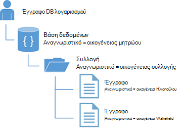

<properties
    pageTitle="Πρόγραμμα εκμάθησης NoSQL: DocumentDB .NET SDK | Microsoft Azure"
    description="Ένα πρόγραμμα εκμάθησης NoSQL που δημιουργεί μια βάση δεδομένων με σύνδεση και C# εφαρμογής κονσόλας χρησιμοποιώντας το .NET SDK DocumentDB. DocumentDB είναι μια βάση δεδομένων NoSQL για JSON."
    keywords="πρόγραμμα εκμάθησης nosql, βάση δεδομένων με σύνδεση, εφαρμογής κονσόλας c#"
    services="documentdb"
    documentationCenter=".net"
    authors="AndrewHoh"
    manager="jhubbard"
    editor="monicar"/>

<tags
    ms.service="documentdb"
    ms.workload="data-services"
    ms.tgt_pltfrm="na"
    ms.devlang="dotnet"
    ms.topic="hero-article"
    ms.date="08/29/2016"
    ms.author="anhoh"/>

# NoSQL πρόγραμμα εκμάθησης: δημιουργία ενός DocumentDB C# εφαρμογής κονσόλας

> [AZURE.SELECTOR]
- [.NET](documentdb-get-started.md)
- [Node.js](documentdb-nodejs-get-started.md)

Καλώς ορίσατε για το πρόγραμμα εκμάθησης NoSQL για το .NET SDK DocumentDB Azure! Μετά την εκτέλεση αυτού του προγράμματος εκμάθησης, θα έχετε μια εφαρμογή κονσόλας που δημιουργεί και ερωτήματα DocumentDB πόρους.

Θα ασχοληθούμε με:

- Δημιουργία και τη σύνδεση σε ένα λογαριασμό DocumentDB
- Ρύθμιση των παραμέτρων σας λύση Visual Studio
- Δημιουργία μια ηλεκτρονική βάση δεδομένων
- Δημιουργία μιας συλλογής
- Δημιουργία εγγράφων JSON
- Υποβολή ερωτημάτων στη συλλογή
- Αντικατάσταση ενός εγγράφου
- Διαγραφή ενός εγγράφου
- Διαγραφή της βάσης δεδομένων

Δεν έχετε το χρόνο; Μην ανησυχείς! Η ολοκληρωμένη λύση είναι διαθέσιμη στο [GitHub](https://github.com/Azure-Samples/documentdb-dotnet-getting-started). Μεταπήδηση για να το [λάβετε την ενότητα ολοκληρωμένη λύση](#GetSolution) για γρήγορη οδηγίες.

Στη συνέχεια, χρησιμοποιήστε τα κουμπιά εκλογής στο επάνω ή το κάτω μέρος αυτής της σελίδας για να στείλτε μας τα σχόλιά. Εάν θέλετε να επικοινωνήσουμε μαζί σας απευθείας, μην διστάσεις να συμπεριλάβετε τη διεύθυνση ηλεκτρονικού ταχυδρομείου στο τα σχόλιά σας.

Τώρα ας ξεκινήσουμε!

## Προαπαιτούμενα στοιχεία

Βεβαιωθείτε ότι έχετε τα εξής:

- Λογαριασμού Azure active. Εάν δεν έχετε, μπορείτε να εγγραφείτε για έναν [δωρεάν λογαριασμό](https://azure.microsoft.com/free/).
- [Visual Studio 2013 / Visual Studio 2015](http://www.visualstudio.com/).
- .NET framework 4.6

## Βήμα 1: Δημιουργία λογαριασμού DocumentDB

Ας δημιουργήσουμε ένα λογαριασμό DocumentDB. Εάν έχετε ήδη ένα λογαριασμό που θέλετε να χρησιμοποιήσετε, μπορείτε να παραλείψετε στο μέλλον να [ρυθμίσετε τη λύση σας Visual Studio](#SetupVS).

[AZURE.INCLUDE [documentdb-create-dbaccount](../../includes/documentdb-create-dbaccount.md)]

## Βήμα 2: Ρύθμιση του Visual Studio λύσης

1. Ανοίξτε το **Visual Studio 2015** στον υπολογιστή σας.
2. Στο μενού **αρχείο** , επιλέξτε **Δημιουργία**και, στη συνέχεια, επιλέξτε το **έργο**.
3. Στο παράθυρο διαλόγου **Νέο έργο** , επιλέξτε **πρότυπα** / **Visual C#** / **Εφαρμογής κονσόλας**, ονομάστε το έργο σας και, στη συνέχεια, κάντε κλικ στο κουμπί **OK**.

4. Στην **Εξερεύνηση λύσεων**, κάντε δεξί κλικ στη νέα κονσόλα την εφαρμογή σας, που βρίσκεται στην περιοχή η λύση Visual Studio.
5. Στη συνέχεια, χωρίς να κλείσετε το μενού, κάντε κλικ στην εντολή **Διαχείριση NuGet πακέτων...** 
 
6. Στην καρτέλα **Nuget** , κάντε κλικ στην επιλογή **Αναζήτηση**και πληκτρολογήστε **azure documentdb** στο πλαίσιο αναζήτησης.
7. Μέσα στα αποτελέσματα, βρείτε **Microsoft.Azure.DocumentDB** και κάντε κλικ στην επιλογή **εγκατάσταση**.
Το Αναγνωριστικό πακέτου για τη βιβλιοθήκη προγράμματος-πελάτη DocumentDB είναι [Microsoft.Azure.DocumentDB](https://www.nuget.org/packages/Microsoft.Azure.DocumentDB)

Μεγάλο! Τώρα που θα σας ολοκληρώσετε τη ρύθμιση, ας ξεκινήσουμε να γράφετε ορισμένες κώδικα. Μπορείτε να βρείτε ένα έργο ολοκληρωμένη κώδικα αυτού του προγράμματος εκμάθησης στο [GitHub](https://github.com/Azure-Samples/documentdb-dotnet-getting-started/blob/master/src/Program.cs).

## Βήμα 3: Σύνδεση με ένα λογαριασμό DocumentDB

Πρώτα, προσθέστε αυτές τις αναφορές στην αρχή της C# την εφαρμογή σας, στο αρχείο Program.cs:

    using System;
    using System.Linq;
    using System.Threading.Tasks;

    // ADD THIS PART TO YOUR CODE
    using System.Net;
    using Microsoft.Azure.Documents;
    using Microsoft.Azure.Documents.Client;
    using Newtonsoft.Json;

> [AZURE.IMPORTANT] Για να ολοκληρώσετε αυτό το πρόγραμμα εκμάθησης NoSQL, βεβαιωθείτε ότι μπορείτε να προσθέσετε τις εξαρτήσεις παραπάνω.

Τώρα, προσθέστε αυτές τις δύο σταθερές και τη μεταβλητή *προγράμματος-πελάτη* κάτω από δημόσια τάξη σας *πρόγραμμα*.

    public class Program
    {
        // ADD THIS PART TO YOUR CODE
        private const string EndpointUri = "<your endpoint URI>";
        private const string PrimaryKey = "<your key>";
        private DocumentClient client;

Επόμενο, κεφαλή στην [Πύλη του Azure](https://portal.azure.com) για να ανακτήσετε το URI και το πρωτεύον κλειδί. Το DocumentDB URI και πρωτεύον κλειδί είναι απαραίτητες για την εφαρμογή σας για να κατανοήσετε πού μπορείτε να συνδεθείτε, καθώς και για DocumentDB να θεωρήσετε αξιόπιστη σύνδεση της εφαρμογής σας.

Στην πύλη του Azure, μεταβείτε στο λογαριασμό σας DocumentDB και, στη συνέχεια, κάντε κλικ στην επιλογή **πλήκτρα**.

Αντιγράψτε το URI από την πύλη και να το επικολλήσετε στο `<your endpoint URI>` του αρχείου program.cs. Στη συνέχεια, αντιγράψτε το ΠΡΩΤΕΎΟΝ ΚΛΕΙΔΊ από την πύλη και επικολλήστε τα σε `<your key>`.

![Στιγμιότυπο οθόνης από την πύλη Azure που χρησιμοποιούνται από το πρόγραμμα εκμάθησης NoSQL για τη δημιουργία μιας εφαρμογής κονσόλας C#. Εμφανίζει ένα λογαριασμό DocumentDB, με την ΕΝΕΡΓΉ ενότητα επισήμανση, το κουμπί ΚΛΕΙΔΙΆ με επισήμανση στις το blade λογαριασμό DocumentDB και τις τιμές URI, ΠΡΩΤΕΎΟΝ ΚΛΕΙΔΊ και ΔΕΥΤΕΡΕΎΟΝ ΚΛΕΙΔΊ με επισήμανση στις τα πλήκτρα blade][keys]

Ας ξεκινήσουμε την εφαρμογή γρήγορα αποτελέσματα με τη δημιουργία μιας νέας παρουσίας του το **DocumentClient**.

Κάτω από τη μέθοδο **κύριες** , προσθέστε αυτήν τη νέα ασύγχρονης εργασία που ονομάζεται **GetStartedDemo**, που θα ξεκινήσει το νέο **DocumentClient**.

    static void Main(string[] args)
    {
    }

    // ADD THIS PART TO YOUR CODE
    private async Task GetStartedDemo()
    {
        this.client = new DocumentClient(new Uri(EndpointUri), PrimaryKey);
    }

Προσθέστε τον ακόλουθο κώδικα για την εκτέλεση ασύγχρονης εργασίας σας από τη μέθοδο **κύριες** . Η μέθοδος **κύριες** θα ενημερωθείτε εξαιρέσεις και εγγραφής τους στην κονσόλα.

    static void Main(string[] args)
    {
            // ADD THIS PART TO YOUR CODE
            try
            {
                    Program p = new Program();
                    p.GetStartedDemo().Wait();
            }
            catch (DocumentClientException de)
            {
                    Exception baseException = de.GetBaseException();
                    Console.WriteLine("{0} error occurred: {1}, Message: {2}", de.StatusCode, de.Message, baseException.Message);
            }
            catch (Exception e)
            {
                    Exception baseException = e.GetBaseException();
                    Console.WriteLine("Error: {0}, Message: {1}", e.Message, baseException.Message);
            }
            finally
            {
                    Console.WriteLine("End of demo, press any key to exit.");
                    Console.ReadKey();
            }

Πατήστε το πλήκτρο **F5** για να εκτελέσετε την εφαρμογή σας.

Συγχαρητήρια! Έχετε συνδεθεί με επιτυχία σε ένα λογαριασμό DocumentDB, τώρα ρίξουμε μια ματιά στην εργασία με πόρους DocumentDB.  

## Βήμα 4: Δημιουργία μιας βάσης δεδομένων
Πριν από την προσθήκη του κώδικα για τη δημιουργία μιας βάσης δεδομένων, προσθέστε μια μέθοδο Βοήθειας για την εγγραφή στην κονσόλα.

Αντιγράψτε και επικολλήστε τη μέθοδο **WriteToConsoleAndPromptToContinue** κάτω από τη μέθοδο **GetStartedDemo** .

    // ADD THIS PART TO YOUR CODE
    private void WriteToConsoleAndPromptToContinue(string format, params object[] args)
    {
            Console.WriteLine(format, args);
            Console.WriteLine("Press any key to continue ...");
            Console.ReadKey();
    }

Μπορούν να δημιουργηθούν σας DocumentDB [βάσης δεδομένων](documentdb-resources.md#databases) , χρησιμοποιώντας τη μέθοδο [CreateDatabaseAsync](https://msdn.microsoft.com/library/microsoft.azure.documents.client.documentclient.createdatabaseasync.aspx) της κλάσης **DocumentClient** . Μια βάση δεδομένων είναι το λογικό κοντέινερ χώρου αποθήκευσης εγγράφων JSON διαμερίσματα σε συλλογές.

Αντιγράψτε και επικολλήστε τη μέθοδο **CreateDatabaseIfNotExists** κάτω από τη μέθοδο **WriteToConsoleAndPromptToContinue** .

    // ADD THIS PART TO YOUR CODE
    private async Task CreateDatabaseIfNotExists(string databaseName)
    {
            // Check to verify a database with the id=FamilyDB does not exist
            try
            {
                    await this.client.ReadDatabaseAsync(UriFactory.CreateDatabaseUri(databaseName));
                    this.WriteToConsoleAndPromptToContinue("Found {0}", databaseName);
            }
            catch (DocumentClientException de)
            {
                    // If the database does not exist, create a new database
                    if (de.StatusCode == HttpStatusCode.NotFound)
                    {
                            await this.client.CreateDatabaseAsync(new Database { Id = databaseName });
                            this.WriteToConsoleAndPromptToContinue("Created {0}", databaseName);
                    }
                    else
                    {
                            throw;
                    }
            }
    }

Αντιγράψτε και επικολλήστε τον ακόλουθο κώδικα για την μέθοδο **GetStartedDemo** κάτω από τη δημιουργία του προγράμματος-πελάτη. Αυτό θα δημιουργήσει μια βάση δεδομένων με το όνομα *FamilyDB*.

    private async Task GetStartedDemo()
    {
        this.client = new DocumentClient(new Uri(EndpointUri), PrimaryKey);

        // ADD THIS PART TO YOUR CODE
        await this.CreateDatabaseIfNotExists("FamilyDB_oa");

Πατήστε το πλήκτρο **F5** για να εκτελέσετε την εφαρμογή σας.

Συγχαρητήρια! Έχετε δημιουργήσει με επιτυχία μια βάση δεδομένων DocumentDB.  

## Βήμα 5: Δημιουργία συλλογής  

> [AZURE.WARNING] **CreateDocumentCollectionAsync** θα δημιουργήσει μια νέα συλλογή με δεσμευμένες μετάδοσης, που έχει τις τιμές συνέπειες. Για περισσότερες λεπτομέρειες, επισκεφθείτε την τοποθεσία μας [τις τιμές σελίδας](https://azure.microsoft.com/pricing/details/documentdb/).

Μια [συλλογή](documentdb-resources.md#collections) μπορούν να δημιουργηθούν, χρησιμοποιώντας τη μέθοδο [CreateDocumentCollectionAsync](https://msdn.microsoft.com/library/microsoft.azure.documents.client.documentclient.createdocumentcollectionasync.aspx) της κλάσης **DocumentClient** . Μια συλλογή είναι ένα κοντέινερ JSON εγγράφων και σχετικές λογική εφαρμογής JavaScript.

Αντιγράψτε και επικολλήστε τη μέθοδο **CreateDocumentCollectionIfNotExists** κάτω από τη μέθοδο **CreateDatabaseIfNotExists** .

    // ADD THIS PART TO YOUR CODE
    private async Task CreateDocumentCollectionIfNotExists(string databaseName, string collectionName)
    {
        try
        {
            await this.client.ReadDocumentCollectionAsync(UriFactory.CreateDocumentCollectionUri(databaseName, collectionName));
            this.WriteToConsoleAndPromptToContinue("Found {0}", collectionName);
        }
        catch (DocumentClientException de)
        {
            // If the document collection does not exist, create a new collection
            if (de.StatusCode == HttpStatusCode.NotFound)
            {
                DocumentCollection collectionInfo = new DocumentCollection();
                collectionInfo.Id = collectionName;

                // Configure collections for maximum query flexibility including string range queries.
                collectionInfo.IndexingPolicy = new IndexingPolicy(new RangeIndex(DataType.String) { Precision = -1 });

                // Here we create a collection with 400 RU/s.
                await this.client.CreateDocumentCollectionAsync(
                    UriFactory.CreateDatabaseUri(databaseName),
                    collectionInfo,
                    new RequestOptions { OfferThroughput = 400 });

                this.WriteToConsoleAndPromptToContinue("Created {0}", collectionName);
            }
            else
            {
                throw;
            }
        }
    }

Αντιγράψτε και επικολλήστε τον ακόλουθο κώδικα για την μέθοδο **GetStartedDemo** κάτω από τη δημιουργία βάσης δεδομένων. Αυτό θα δημιουργήσει μια συλλογή εγγράφων με το όνομα *FamilyCollection_oa*.

        this.client = new DocumentClient(new Uri(EndpointUri), PrimaryKey);

        await this.CreateDatabaseIfNotExists("FamilyDB_oa");

        // ADD THIS PART TO YOUR CODE
        await this.CreateDocumentCollectionIfNotExists("FamilyDB_oa", "FamilyCollection_oa");

Πατήστε το πλήκτρο **F5** για να εκτελέσετε την εφαρμογή σας.

Συγχαρητήρια! Έχετε δημιουργήσει με επιτυχία μια συλλογή εγγράφων DocumentDB.  

## Βήμα 6: Δημιουργία JSON εγγράφων
Ένα [έγγραφο](documentdb-resources.md#documents) μπορούν να δημιουργηθούν, χρησιμοποιώντας τη μέθοδο [CreateDocumentAsync](https://msdn.microsoft.com/library/microsoft.azure.documents.client.documentclient.createdocumentasync.aspx) της κλάσης **DocumentClient** . Τα έγγραφα είναι (αυθαίρετο) περιεχόμενο JSON ορίζονται από το χρήστη. Θα σας τώρα μπορεί να εισαγάγει ένα ή περισσότερα έγγραφα. Εάν έχετε ήδη δεδομένα που θέλετε να αποθηκεύσετε στη βάση δεδομένων σας, μπορείτε να χρησιμοποιήσετε DocumentDB του [εργαλείου μετεγκατάστασης δεδομένων](documentdb-import-data.md).

Αρχικά, πρέπει να δημιουργήσετε ένα εκπαιδευτικό **οικογένεια** που θα αντιπροσωπεύει αντικείμενα που είναι αποθηκευμένα σε DocumentDB σε αυτό το δείγμα. Επίσης θα δημιουργήσουμε **γονικό**, **θυγατρικό**, **Pet**, υποκατηγορίες **διεύθυνση** που χρησιμοποιούνται στην **οικογένεια**. Σημειώστε ότι τα έγγραφα πρέπει να διαθέτουν μια ιδιότητα **αναγνωριστικό** σειριοποιηθεί ως **αναγνωριστικό** στο JSON. Δημιουργία αυτές οι κλάσεις προσθέτοντας τις ακόλουθες εσωτερικές δευτερεύουσες κλάσεις μετά τη μέθοδο **GetStartedDemo** .

Αντιγράψτε και επικολλήστε την **οικογένεια**, **γονικό**, **θυγατρικό**, **Pet**και κλάσεις **διευθύνσεων** κάτω από τη μέθοδο **WriteToConsoleAndPromptToContinue** .

    private void WriteToConsoleAndPromptToContinue(string format, params object[] args)
    {
        Console.WriteLine(format, args);
        Console.WriteLine("Press any key to continue ...");
        Console.ReadKey();
    }

    // ADD THIS PART TO YOUR CODE
    public class Family
    {
        [JsonProperty(PropertyName = "id")]
        public string Id { get; set; }
        public string LastName { get; set; }
        public Parent[] Parents { get; set; }
        public Child[] Children { get; set; }
        public Address Address { get; set; }
        public bool IsRegistered { get; set; }
        public override string ToString()
        {
                return JsonConvert.SerializeObject(this);
        }
    }

    public class Parent
    {
        public string FamilyName { get; set; }
        public string FirstName { get; set; }
    }

    public class Child
    {
        public string FamilyName { get; set; }
        public string FirstName { get; set; }
        public string Gender { get; set; }
        public int Grade { get; set; }
        public Pet[] Pets { get; set; }
    }

    public class Pet
    {
        public string GivenName { get; set; }
    }

    public class Address
    {
        public string State { get; set; }
        public string County { get; set; }
        public string City { get; set; }
    }

Αντιγράψτε και επικολλήστε τη μέθοδο **CreateFamilyDocumentIfNotExists** κάτω από τη μέθοδο **CreateDocumentCollectionIfNotExists** .

    // ADD THIS PART TO YOUR CODE
    private async Task CreateFamilyDocumentIfNotExists(string databaseName, string collectionName, Family family)
    {
        try
        {
            await this.client.ReadDocumentAsync(UriFactory.CreateDocumentUri(databaseName, collectionName, family.Id));
            this.WriteToConsoleAndPromptToContinue("Found {0}", family.Id);
        }
        catch (DocumentClientException de)
        {
            if (de.StatusCode == HttpStatusCode.NotFound)
            {
                await this.client.CreateDocumentAsync(UriFactory.CreateDocumentCollectionUri(databaseName, collectionName), family);
                this.WriteToConsoleAndPromptToContinue("Created Family {0}", family.Id);
            }
            else
            {
                throw;
            }
        }
    }

Και εισαγάγετε δύο έγγραφα, μία για την οικογένεια Ηλιοπούλου και της οικογένειας Wakefield.

Αντιγράψτε και επικολλήστε τον ακόλουθο κώδικα για την μέθοδο **GetStartedDemo** κάτω από τη δημιουργία συλλογή εγγράφων.

    await this.CreateDatabaseIfNotExists("FamilyDB_oa");

    await this.CreateDocumentCollectionIfNotExists("FamilyDB_oa", "FamilyCollection_oa");

    // ADD THIS PART TO YOUR CODE
    Family andersenFamily = new Family
    {
            Id = "Andersen.1",
            LastName = "Andersen",
            Parents = new Parent[]
            {
                    new Parent { FirstName = "Thomas" },
                    new Parent { FirstName = "Mary Kay" }
            },
            Children = new Child[]
            {
                    new Child
                    {
                            FirstName = "Henriette Thaulow",
                            Gender = "female",
                            Grade = 5,
                            Pets = new Pet[]
                            {
                                    new Pet { GivenName = "Fluffy" }
                            }
                    }
            },
            Address = new Address { State = "WA", County = "King", City = "Seattle" },
            IsRegistered = true
    };

    await this.CreateFamilyDocumentIfNotExists("FamilyDB_oa", "FamilyCollection_oa", andersenFamily);

    Family wakefieldFamily = new Family
    {
            Id = "Wakefield.7",
            LastName = "Wakefield",
            Parents = new Parent[]
            {
                    new Parent { FamilyName = "Wakefield", FirstName = "Robin" },
                    new Parent { FamilyName = "Miller", FirstName = "Ben" }
            },
            Children = new Child[]
            {
                    new Child
                    {
                            FamilyName = "Merriam",
                            FirstName = "Jesse",
                            Gender = "female",
                            Grade = 8,
                            Pets = new Pet[]
                            {
                                    new Pet { GivenName = "Goofy" },
                                    new Pet { GivenName = "Shadow" }
                            }
                    },
                    new Child
                    {
                            FamilyName = "Miller",
                            FirstName = "Lisa",
                            Gender = "female",
                            Grade = 1
                    }
            },
            Address = new Address { State = "NY", County = "Manhattan", City = "NY" },
            IsRegistered = false
    };

    await this.CreateFamilyDocumentIfNotExists("FamilyDB_oa", "FamilyCollection_oa", wakefieldFamily);

Πατήστε το πλήκτρο **F5** για να εκτελέσετε την εφαρμογή σας.

Συγχαρητήρια! Έχετε δημιουργήσει με επιτυχία δύο DocumentDB εγγράφων.  

##Βήμα 7: Ερωτήματος DocumentDB πόροι

DocumentDB υποστηρίζει JSON έγγραφα που είναι αποθηκευμένα σε κάθε συλλογή εμπλουτισμένου [ερωτήματα](documentdb-sql-query.md) .  Ο ακόλουθος κώδικας δείγμα εμφανίζει διάφορα ερωτήματα - με δύο σύνταξη DocumentDB SQL καθώς και LINQ - ότι θα σας μπορεί να εκτελεστεί σε σχέση με τα έγγραφα που θα σας που έχουν εισαχθεί στο προηγούμενο βήμα.

Αντιγράψτε και επικολλήστε τη μέθοδο **ExecuteSimpleQuery** κάτω από τη μέθοδο **CreateFamilyDocumentIfNotExists** .

    // ADD THIS PART TO YOUR CODE
    private void ExecuteSimpleQuery(string databaseName, string collectionName)
    {
        // Set some common query options
        FeedOptions queryOptions = new FeedOptions { MaxItemCount = -1 };

            // Here we find the Andersen family via its LastName
            IQueryable<Family> familyQuery = this.client.CreateDocumentQuery<Family>(
                    UriFactory.CreateDocumentCollectionUri(databaseName, collectionName), queryOptions)
                    .Where(f => f.LastName == "Andersen");

            // The query is executed synchronously here, but can also be executed asynchronously via the IDocumentQuery<T> interface
            Console.WriteLine("Running LINQ query...");
            foreach (Family family in familyQuery)
            {
                    Console.WriteLine("\tRead {0}", family);
            }

            // Now execute the same query via direct SQL
            IQueryable<Family> familyQueryInSql = this.client.CreateDocumentQuery<Family>(
                    UriFactory.CreateDocumentCollectionUri(databaseName, collectionName),
                    "SELECT * FROM Family WHERE Family.LastName = 'Andersen'",
                    queryOptions);

            Console.WriteLine("Running direct SQL query...");
            foreach (Family family in familyQueryInSql)
            {
                    Console.WriteLine("\tRead {0}", family);
            }

            Console.WriteLine("Press any key to continue ...");
            Console.ReadKey();
    }

Αντιγράψτε και επικολλήστε τον ακόλουθο κώδικα για την μέθοδο **GetStartedDemo** κάτω από τη δεύτερη Δημιουργία εγγράφου.

    await this.CreateFamilyDocumentIfNotExists("FamilyDB_oa", "FamilyCollection_oa", wakefieldFamily);

    // ADD THIS PART TO YOUR CODE
    this.ExecuteSimpleQuery("FamilyDB_oa", "FamilyCollection_oa");

Πατήστε το πλήκτρο **F5** για να εκτελέσετε την εφαρμογή σας.

Συγχαρητήρια! Που έχουν ερώτημα με επιτυχία σε σχέση με μια συλλογή DocumentDB.

Το παρακάτω διάγραμμα παρουσιάζει πώς το SQL DocumentDB ονομάζεται σύνταξη του ερωτήματος σε σχέση με τη συλλογή που δημιουργήσατε και την ίδια λογική ισχύει για το ερώτημα LINQ καθώς και.

Τη λέξη-κλειδί [από](documentdb-sql-query.md#from-clause) είναι προαιρετική του ερωτήματος, επειδή τα ερωτήματα DocumentDB ήδη περιορίζονται σε μια ενιαία συλλογή. Επομένως, "Από οικογένειες f" μπορεί να γίνει αντιμετάθεση με "Από το ριζικό κατάλογο r" ή άλλα οποιαδήποτε μεταβλητή όνομα που επιλέξτε. DocumentDB θα υπολογίσει που οικογένειες, ρίζας ή το όνομα της μεταβλητής που επιλέξατε, αναφορά της τρέχουσας συλλογής από προεπιλογή.

##Βήμα 8: Αντικατάσταση JSON εγγράφου

DocumentDB υποστηρίζει αντικατάσταση JSON έγγραφα.  

Αντιγράψτε και επικολλήστε τη μέθοδο **ReplaceFamilyDocument** κάτω από τη μέθοδο **ExecuteSimpleQuery** .

    // ADD THIS PART TO YOUR CODE
    private async Task ReplaceFamilyDocument(string databaseName, string collectionName, string familyName, Family updatedFamily)
    {
        try
        {
            await this.client.ReplaceDocumentAsync(UriFactory.CreateDocumentUri(databaseName, collectionName, familyName), updatedFamily);
            this.WriteToConsoleAndPromptToContinue("Replaced Family {0}", familyName);
        }
        catch (DocumentClientException de)
        {
            throw;
        }
    }

Αντιγράψτε και επικολλήστε τον ακόλουθο κώδικα για την μέθοδο **GetStartedDemo** κάτω από την εκτέλεση του ερωτήματος. Αφού αντικαταστήσετε το έγγραφο, αυτό θα εκτελείται το ίδιο ερώτημα ξανά για να προβάλετε το τροποποιημένο έγγραφο.

    await this.CreateFamilyDocumentIfNotExists("FamilyDB_oa", "FamilyCollection_oa", wakefieldFamily);

    this.ExecuteSimpleQuery("FamilyDB_oa", "FamilyCollection_oa");

    // ADD THIS PART TO YOUR CODE
    // Update the Grade of the Andersen Family child
    andersenFamily.Children[0].Grade = 6;

    await this.ReplaceFamilyDocument("FamilyDB_oa", "FamilyCollection_oa", "Andersen.1", andersenFamily);

    this.ExecuteSimpleQuery("FamilyDB_oa", "FamilyCollection_oa");

Πατήστε το πλήκτρο **F5** για να εκτελέσετε την εφαρμογή σας.

Συγχαρητήρια! Έχετε αντικαταστήσει ένα έγγραφο DocumentDB με επιτυχία.

##Βήμα 9: Διαγραφή JSON εγγράφου

DocumentDB υποστηρίζει τη διαγραφή JSON έγγραφα.  

Αντιγράψτε και επικολλήστε τη μέθοδο **DeleteFamilyDocument** κάτω από τη μέθοδο **ReplaceFamilyDocument** .

    // ADD THIS PART TO YOUR CODE
    private async Task DeleteFamilyDocument(string databaseName, string collectionName, string documentName)
    {
        try
        {
            await this.client.DeleteDocumentAsync(UriFactory.CreateDocumentUri(databaseName, collectionName, documentName));
            Console.WriteLine("Deleted Family {0}", documentName);
        }
        catch (DocumentClientException de)
        {
            throw;
        }
    }

Αντιγράψτε και επικολλήστε τον ακόλουθο κώδικα για την μέθοδο **GetStartedDemo** κάτω από τη δεύτερη εκτέλεση του ερωτήματος.

    await this.ReplaceFamilyDocument("FamilyDB_oa", "FamilyCollection_oa", "Andersen.1", andersenFamily);

    this.ExecuteSimpleQuery("FamilyDB_oa", "FamilyCollection_oa");

    // ADD THIS PART TO CODE
    await this.DeleteFamilyDocument("FamilyDB_oa", "FamilyCollection_oa", "Andersen.1");

Πατήστε το πλήκτρο **F5** για να εκτελέσετε την εφαρμογή σας.

Συγχαρητήρια! Έχετε διαγράψει ένα έγγραφο DocumentDB με επιτυχία.

##Βήμα 10: Διαγραφή της βάσης δεδομένων

Διαγραφή της βάσης δεδομένων που έχουν δημιουργηθεί θα καταργήσει τη βάση δεδομένων και όλους τους πόρους θυγατρικά στοιχεία (συλλογές, έγγραφα, κ.λπ.).

Αντιγράψτε και επικολλήστε τον ακόλουθο κώδικα για την μέθοδο **GetStartedDemo** κάτω από το έγγραφο delete για να διαγράψετε ολόκληρη τη βάση δεδομένων και όλους τους πόρους θυγατρικά στοιχεία.

    this.ExecuteSimpleQuery("FamilyDB_oa", "FamilyCollection_oa");

    await this.DeleteFamilyDocument("FamilyDB_oa", "FamilyCollection_oa", "Andersen.1");

    // ADD THIS PART TO CODE
    // Clean up/delete the database
    await this.client.DeleteDatabaseAsync(UriFactory.CreateDatabaseUri("FamilyDB_oa"));

Πατήστε το πλήκτρο **F5** για να εκτελέσετε την εφαρμογή σας.

Συγχαρητήρια! Έχετε διαγράψει με επιτυχία μια βάση δεδομένων DocumentDB.

##Βήμα 11: Εκτέλεση σας C# εφαρμογής κονσόλας όλα μαζί!

Πατήστε F5 στο Visual Studio για να δημιουργήσετε την εφαρμογή σε λειτουργία εντοπισμού σφαλμάτων.

Θα πρέπει να μπορείτε να δείτε το αποτέλεσμα της εφαρμογής γρήγορα αποτελέσματα. Το αποτέλεσμα θα εμφανιστούν τα αποτελέσματα των ερωτημάτων σας προσθέσει και θα πρέπει να συμφωνεί με το παρακάτω παράδειγμα κείμενο.

    Created FamilyDB_oa
    Press any key to continue ...
    Created FamilyCollection_oa
    Press any key to continue ...
    Created Family Andersen.1
    Press any key to continue ...
    Created Family Wakefield.7
    Press any key to continue ...
    Running LINQ query...
        Read {"id":"Andersen.1","LastName":"Andersen","District":"WA5","Parents":[{"FamilyName":null,"FirstName":"Thomas"},{"FamilyName":null,"FirstName":"Mary Kay"}],"Children":[{"FamilyName":null,"FirstName":"Henriette Thaulow","Gender":"female","Grade":5,"Pets":[{"GivenName":"Fluffy"}]}],"Address":{"State":"WA","County":"King","City":"Seattle"},"IsRegistered":true}
    Running direct SQL query...
        Read {"id":"Andersen.1","LastName":"Andersen","District":"WA5","Parents":[{"FamilyName":null,"FirstName":"Thomas"},{"FamilyName":null,"FirstName":"Mary Kay"}],"Children":[{"FamilyName":null,"FirstName":"Henriette Thaulow","Gender":"female","Grade":5,"Pets":[{"GivenName":"Fluffy"}]}],"Address":{"State":"WA","County":"King","City":"Seattle"},"IsRegistered":true}
    Replaced Family Andersen.1
    Press any key to continue ...
    Running LINQ query...
        Read {"id":"Andersen.1","LastName":"Andersen","District":"WA5","Parents":[{"FamilyName":null,"FirstName":"Thomas"},{"FamilyName":null,"FirstName":"Mary Kay"}],"Children":[{"FamilyName":null,"FirstName":"Henriette Thaulow","Gender":"female","Grade":6,"Pets":[{"GivenName":"Fluffy"}]}],"Address":{"State":"WA","County":"King","City":"Seattle"},"IsRegistered":true}
    Running direct SQL query...
        Read {"id":"Andersen.1","LastName":"Andersen","District":"WA5","Parents":[{"FamilyName":null,"FirstName":"Thomas"},{"FamilyName":null,"FirstName":"Mary Kay"}],"Children":[{"FamilyName":null,"FirstName":"Henriette Thaulow","Gender":"female","Grade":6,"Pets":[{"GivenName":"Fluffy"}]}],"Address":{"State":"WA","County":"King","City":"Seattle"},"IsRegistered":true}
    Deleted Family Andersen.1
    End of demo, press any key to exit.

Συγχαρητήρια! Έχετε ολοκληρώσει αυτό το πρόγραμμα εκμάθησης NoSQL και έχετε μια εργασία C# εφαρμογής κονσόλας!

##Αποκτήστε την πλήρη λύση προγραμμάτων εκμάθησης NoSQL
Για να δημιουργήσετε τη λύση GetStarted που περιέχει όλα τα δείγματα σε αυτό το άρθρο, θα χρειαστείτε τα εξής:

- Λογαριασμού Azure active. Εάν δεν έχετε, μπορείτε να εγγραφείτε για έναν [δωρεάν λογαριασμό](https://azure.microsoft.com/free/).
-   Ένα [λογαριασμό DocumentDB][documentdb-create-account].
-   Η λύση [GetStarted](https://github.com/Azure-Samples/documentdb-dotnet-getting-started) διαθέσιμα σε GitHub.

Για να επαναφέρετε τις αναφορές στο SDK .NET DocumentDB στο Visual Studio, κάντε δεξί κλικ της λύσης **GetStarted** στην Εξερεύνηση λύσεων και, στη συνέχεια, κάντε κλικ στην επιλογή **Ενεργοποίηση Επαναφορά πακέτου NuGet**. Στη συνέχεια, στο αρχείο App.config, ενημερώστε τις τιμές EndpointUrl και AuthorizationKey όπως περιγράφεται στο [παράθυρο σύνδεση με ένα λογαριασμό DocumentDB](#Connect).

## Επόμενα βήματα

- Θέλετε μια πιο σύνθετη ASP.NET MVC NoSQL το πρόγραμμα εκμάθησης; Ανατρέξτε στο θέμα [Δημιουργία μιας εφαρμογής web με χρήση DocumentDB MVC ASP.NET](documentdb-dotnet-application.md).
- Θέλετε να εκτελέσετε κλίμακα και επιδόσεων δοκιμών με DocumentDB; Ανατρέξτε στο θέμα [επιδόσεις και την κλίμακα δοκιμών με Azure DocumentDB](documentdb-performance-testing.md)
-   Μάθετε πώς μπορείτε να [οθόνη ένα λογαριασμό DocumentDB](documentdb-monitor-accounts.md).
-   Εκτέλεση ερωτημάτων σε σχέση με μας δείγμα dataset στο το [Ερώτημα Αναδειχτείτε](https://www.documentdb.com/sql/demo).
-   Μάθετε περισσότερα σχετικά με το μοντέλο προγραμματισμού στην ενότητα ανάπτυξη της [σελίδας τεκμηρίωση DocumentDB](https://azure.microsoft.com/documentation/services/documentdb/).

[documentdb-create-account]: documentdb-create-account.md
[documentdb-manage]: documentdb-manage.md
[keys]: media/documentdb-get-started/nosql-tutorial-keys.png
