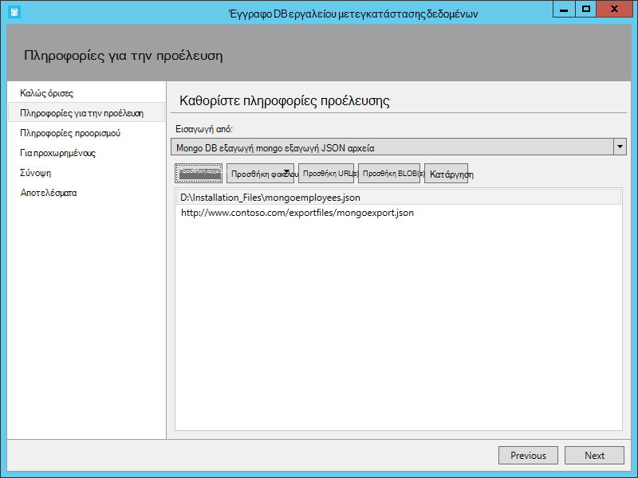
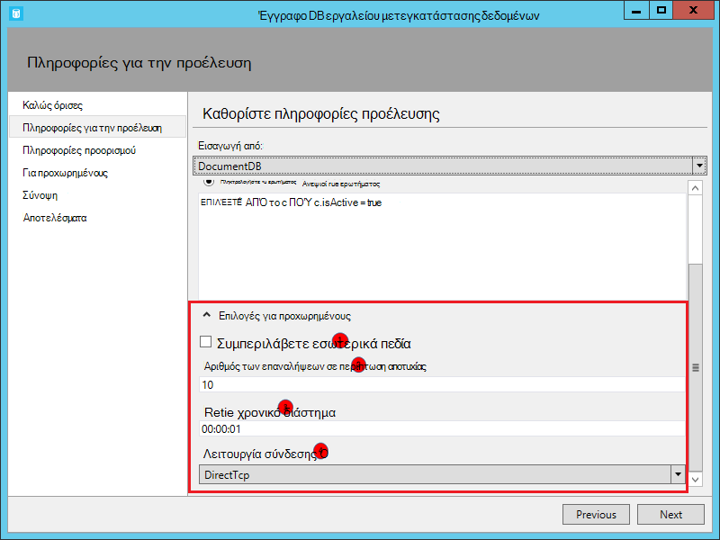

<properties
    pageTitle="Εργαλείο βάσης δεδομένων μετεγκατάστασης για DocumentDB | Microsoft Azure"
    description="Μάθετε πώς μπορείτε να χρησιμοποιήσετε τα εργαλεία μετεγκατάστασης δεδομένων DocumentDB Άνοιγμα αρχείου προέλευσης για την εισαγωγή δεδομένων σε DocumentDB από διάφορες προελεύσεις, συμπεριλαμβανομένων των αρχείων MongoDB, SQL Server, πίνακα χώρου αποθήκευσης, Amazon DynamoDB, CSV και JSON. CSV JSON μετατροπή."
    keywords="CSV σε json, εργαλεία μετεγκατάστασης βάσης δεδομένων, μετατροπή csv json"
    services="documentdb"
    authors="andrewhoh"
    manager="jhubbard"
    editor="monicar"
    documentationCenter=""/>

<tags
    ms.service="documentdb"
    ms.workload="data-services"
    ms.tgt_pltfrm="na"
    ms.devlang="na"
    ms.topic="article"
    ms.date="10/06/2016"
    ms.author="anhoh"/>

# Εισαγωγή δεδομένων σε DocumentDB με το εργαλείο μετεγκατάστασης βάσης δεδομένων

Σε αυτό το άρθρο σάς δείχνει πώς μπορείτε να χρησιμοποιήσετε το εργαλείο μετεγκατάστασης δεδομένων DocumentDB επίσημη Άνοιγμα αρχείου προέλευσης για την εισαγωγή δεδομένων στο [Microsoft Azure DocumentDB](https://azure.microsoft.com/services/documentdb/) από διάφορες προελεύσεις, όπως αρχεία JSON, αρχεία CSV, SQL, MongoDB, χώρος αποθήκευσης πινάκων του Azure, Amazon DynamoDB και DocumentDB συλλογές.

Μετά την ανάγνωση αυτό το άρθρο, θα έχετε τη δυνατότητα να απαντούν στα παρακάτω ερωτήματα:  

-   Πώς μπορώ να εισάγω αρχείο JSON, αρχείο CSV, δεδομένα του SQL Server ή MongoDB δεδομένων για να DocumentDB;
-   Πώς μπορώ να εισάγω δεδομένα από το χώρο αποθήκευσης, Amazon DynamoDB και HBase Azure πίνακα για να DocumentDB;
-   Πώς μπορώ να μετεγκαταστήσω δεδομένα μεταξύ συλλογών DocumentDB;

##Προαπαιτούμενα στοιχεία

Πριν να ακολουθήσετε τις οδηγίες σε αυτό το άρθρο, βεβαιωθείτε ότι έχετε εγκαταστήσει τα εξής:

- [Microsoft .NET Framework 4.51](https://www.microsoft.com/download/developer-tools.aspx) ή νεότερη έκδοση.

##Επισκόπηση του εργαλείου μετεγκατάστασης DocumentDB δεδομένων

Το εργαλείο μετεγκατάστασης δεδομένων DocumentDB είναι μια λύση Άνοιγμα αρχείου προέλευσης που εισάγει δεδομένα σε DocumentDB από μια ποικιλία προελεύσεων, όπως:

- Αρχεία JSON
- MongoDB
- SQL Server
- Αρχεία CSV
- Χώρος αποθήκευσης πινάκων του Azure
- Amazon DynamoDB
- HBase
- Συλλογές DocumentDB

Ενώ το εργαλείο εισαγωγής περιλαμβάνει ένα περιβάλλον εργασίας χρήστη (dtui.exe), να βάσει επίσης από τη γραμμή εντολών (dt.exe). Στην πραγματικότητα, υπάρχει μια επιλογή για να εξαγάγετε τη σχετική εντολή μετά τη ρύθμιση μιας εισαγωγής μέσω του περιβάλλοντος εργασίας Χρήστη. Δεδομένα σε μορφή πίνακα προέλευσης (π.χ. αρχεία SQL Server ή CSV) μπορούν να μετατραπούν, ώστε να μπορούν να δημιουργηθούν ιεραρχικές σχέσεις (δευτερεύοντα έγγραφα) κατά την εισαγωγή. Συνεχίστε να διαβάζετε για να μάθετε περισσότερα σχετικά με τις επιλογές προέλευσης, δείγμα γραμμές εντολών για την εισαγωγή από κάθε προέλευση, επιλογές προορισμού και εισαγωγή προβολή αποτελεσμάτων.

##Κατά την εγκατάσταση του εργαλείου μετεγκατάστασης δεδομένων DocumentDB

Ο κωδικός προέλευσης εργαλείου μετεγκατάστασης είναι διαθέσιμα σε GitHub σε [αυτό το αποθετήριο δεδομένων](https://github.com/azure/azure-documentdb-datamigrationtool) και μεταγλωττισμένη έκδοση είναι διαθέσιμη από το [Κέντρο λήψης της Microsoft](http://www.microsoft.com/downloads/details.aspx?FamilyID=cda7703a-2774-4c07-adcc-ad02ddc1a44d). Μπορείτε είτε μεταγλώττιση της λύσης ή απλώς κάντε λήψη και εξαγάγετε τη μεταγλωττισμένη έκδοση σε έναν κατάλογο της επιλογής σας. Στη συνέχεια, εκτελέστε μία:

- **Dtui.exe**: γραφικό περιβάλλον εργασίας έκδοση του εργαλείου
- **DT.exe**: γραμμής εντολών έκδοση του εργαλείου

##Εισαγωγή JSON αρχείων

Η επιλογή Εισαγωγή JSON αρχείο προέλευσης σάς επιτρέπει να εισαγωγή μία ή περισσότερες μεμονωμένο έγγραφο JSON ή JSON αρχείων κάθε περιέχει έναν πίνακα με τα έγγραφα που JSON. Κατά την προσθήκη φακέλους που περιλαμβάνουν JSON αρχεία για να εισαγάγετε, έχετε την επιλογή να σταδιακά αναζήτηση για αρχεία σε υποφακέλους.

Εδώ θα βρείτε ορισμένα δείγματα γραμμής εντολών για να εισαγάγετε αρχεία JSON:

    #Import a single JSON file
    dt.exe /s:JsonFile /s.Files:.\Sessions.json /t:DocumentDBBulk /t.ConnectionString:"AccountEndpoint=<DocumentDB Endpoint>;AccountKey=<DocumentDB Key>;Database=<DocumentDB Database>;" /t.Collection:Sessions /t.CollectionThroughput:2500

    #Import a directory of JSON files
    dt.exe /s:JsonFile /s.Files:C:\TESessions\*.json /t:DocumentDBBulk /t.ConnectionString:" AccountEndpoint=<DocumentDB Endpoint>;AccountKey=<DocumentDB Key>;Database=<DocumentDB Database>;" /t.Collection:Sessions /t.CollectionThroughput:2500

    #Import a directory (including sub-directories) of JSON files
    dt.exe /s:JsonFile /s.Files:C:\LastFMMusic\**\*.json /t:DocumentDBBulk /t.ConnectionString:" AccountEndpoint=<DocumentDB Endpoint>;AccountKey=<DocumentDB Key>;Database=<DocumentDB Database>;" /t.Collection:Music /t.CollectionThroughput:2500

    #Import a directory (single), directory (recursive), and individual JSON files
    dt.exe /s:JsonFile /s.Files:C:\Tweets\*.*;C:\LargeDocs\**\*.*;C:\TESessions\Session48172.json;C:\TESessions\Session48173.json;C:\TESessions\Session48174.json;C:\TESessions\Session48175.json;C:\TESessions\Session48177.json /t:DocumentDBBulk /t.ConnectionString:"AccountEndpoint=<DocumentDB Endpoint>;AccountKey=<DocumentDB Key>;Database=<DocumentDB Database>;" /t.Collection:subs /t.CollectionThroughput:2500

    #Import a single JSON file and partition the data across 4 collections
    dt.exe /s:JsonFile /s.Files:D:\\CompanyData\\Companies.json /t:DocumentDBBulk /t.ConnectionString:"AccountEndpoint=<DocumentDB Endpoint>;AccountKey=<DocumentDB Key>;Database=<DocumentDB Database>;" /t.Collection:comp[1-4] /t.PartitionKey:name /t.CollectionThroughput:2500

##Εισαγωγή από το MongoDB

Η επιλογή MongoDB προέλευσης πρόγραμμα εισαγωγής σάς επιτρέπει να εισαγάγετε από μια συλλογή μεμονωμένα MongoDB και προαιρετικά φιλτράρισμα εγγράφων με χρήση ενός ερωτήματος ή/και τροποποίηση τη δομή του εγγράφου με χρήση μιας προβολής.  

Η συμβολοσειρά σύνδεσης είναι με την τυπική μορφή MongoDB:

    mongodb://<dbuser>:<dbpassword>@<host>:<port>/<database>

> [AZURE.NOTE] Χρησιμοποιήστε την εντολή επαλήθευση για να βεβαιωθείτε ότι η παρουσία MongoDB που καθορίζεται στο πεδίο συμβολοσειρά σύνδεσης είναι δυνατή η πρόσβαση.

Πληκτρολογήστε το όνομα της συλλογής από την οποία θα εισαχθούν δεδομένα. Ενδέχεται να καθορίσετε ή να παρέχουν ένα αρχείο για ένα ερώτημα προαιρετικά (π.χ. {pop: {$gt: 5000}}) ή/και προβολής (π.χ. {loc:0}) για να φιλτράρετε και να διαμορφώσετε τα δεδομένα για εισαγωγή.

Εδώ θα βρείτε ορισμένα δείγματα γραμμής εντολών για την εισαγωγή από MongoDB:

    #Import all documents from a MongoDB collection
    dt.exe /s:MongoDB /s.ConnectionString:mongodb://<dbuser>:<dbpassword>@<host>:<port>/<database> /s.Collection:zips /t:DocumentDBBulk /t.ConnectionString:"AccountEndpoint=<DocumentDB Endpoint>;AccountKey=<DocumentDB Key>;Database=<DocumentDB Database>;" /t.Collection:BulkZips /t.IdField:_id /t.CollectionThroughput:2500

    #Import documents from a MongoDB collection which match the query and exclude the loc field
    dt.exe /s:MongoDB /s.ConnectionString:mongodb://<dbuser>:<dbpassword>@<host>:<port>/<database> /s.Collection:zips /s.Query:{pop:{$gt:50000}} /s.Projection:{loc:0} /t:DocumentDBBulk /t.ConnectionString:"AccountEndpoint=<DocumentDB Endpoint>;AccountKey=<DocumentDB Key>;Database=<DocumentDB Database>;" /t.Collection:BulkZipsTransform /t.IdField:_id/t.CollectionThroughput:2500

##Εισαγωγή MongoDB εξαγωγή αρχείων

Η επιλογή Εισαγωγή MongoDB εξαγωγή JSON αρχείο προέλευσης σας επιτρέπει να εισαγάγετε ένα ή περισσότερα αρχεία JSON που παράγονται από το βοηθητικό πρόγραμμα mongoexport.  

Κατά την προσθήκη τους φακέλους που περιέχουν MongoDB εξαγωγή JSON αρχείων για εισαγωγή, έχετε την επιλογή να σταδιακά αναζήτηση για αρχεία σε υποφακέλους.

Ακολουθεί ένα δείγμα γραμμής εντολών για την εισαγωγή από MongoDB εξαγωγή JSON αρχεία:

    dt.exe /s:MongoDBExport /s.Files:D:\mongoemployees.json /t:DocumentDBBulk /t.ConnectionString:"AccountEndpoint=<DocumentDB Endpoint>;AccountKey=<DocumentDB Key>;Database=<DocumentDB Database>;" /t.Collection:employees /t.IdField:_id /t.Dates:Epoch /t.CollectionThroughput:2500

##Εισαγωγή από SQL Server

Στην επιλογή πρόγραμμα εισαγωγής προέλευσης SQL σάς επιτρέπει να εισαγάγετε από μια μεμονωμένη βάση δεδομένων SQL Server και προαιρετικά φιλτράρετε τις εγγραφές που θα εισαχθεί με χρήση ενός ερωτήματος. Επιπλέον, μπορείτε να τροποποιήσετε τη δομή του εγγράφου, καθορίζοντας ένθεσης διαχωριστικό (περισσότερες πληροφορίες για που σε λίγο).  

Η μορφή της συμβολοσειράς σύνδεσης είναι η τυπική μορφή της συμβολοσειράς σύνδεσης SQL.

> [AZURE.NOTE] Χρησιμοποιήστε την εντολή επαλήθευση για να βεβαιωθείτε ότι η παρουσία του SQL Server που καθορίζεται στο πεδίο συμβολοσειρά σύνδεσης είναι δυνατή η πρόσβαση.

Η ιδιότητα ένθεσης διαχωριστικό χρησιμοποιείται για να δημιουργήσετε ιεραρχικές σχέσεις (δευτερεύοντα έγγραφα) κατά την εισαγωγή. Εξετάστε το ακόλουθο ερώτημα SQL:

*Επιλέξτε CAST (BusinessEntityID AS varchar) ως αναγνωριστικό, όνομα, AddressType ως [Address.AddressType], AddressLine1 ως [Address.AddressLine1], Πόλη ως [Address.Location.City], Όνομα_πολιτείας_επαρχίας ως [Address.Location.StateProvinceName], "Ταχυδρομικός κώδικας" ως [Address.PostalCode], CountryRegionName ως [Address.CountryRegionName] από Sales.vStoreWithAddresses όπου AddressType = 'Κύριες Office'*

Που επιστρέφει τα ακόλουθα αποτελέσματα (μερική):

Σημείωση τα ψευδώνυμα όπως Address.AddressType και Address.Location.StateProvinceName. Καθορίζοντας ένα διαχωριστικό ένθεσης της '.', το εργαλείο εισαγωγής δημιουργεί διεύθυνση και Address.Location δευτερεύοντα έγγραφα κατά την εισαγωγή. Ακολουθεί ένα παράδειγμα ενός εγγράφου που προκύπτουν στο DocumentDB:

*{"αναγνωριστικό": "956", "όνομα": "Καλύτερο πωλήσεων και υπηρεσίας", "Διεύθυνση": {"AddressType": "Κύριες Office", "AddressLine1": "#500 75 O'Connor οδός", "Θέση": {"Πόλη": "Οτάβα", "Όνομα_πολιτείας_επαρχίας": "Ontario"}, "ΤαχυδρομικόςΚώδικας": "K4B 1S2", "CountryRegionName": "Καναδάς"}}*

Εδώ θα βρείτε ορισμένα δείγματα γραμμής εντολών για την εισαγωγή από SQL Server:

    #Import records from SQL which match a query
    dt.exe /s:SQL /s.ConnectionString:"Data Source=<server>;Initial Catalog=AdventureWorks;User Id=advworks;Password=<password>;" /s.Query:"select CAST(BusinessEntityID AS varchar) as Id, * from Sales.vStoreWithAddresses WHERE AddressType='Main Office'" /t:DocumentDBBulk /t.ConnectionString:" AccountEndpoint=<DocumentDB Endpoint>;AccountKey=<DocumentDB Key>;Database=<DocumentDB Database>;" /t.Collection:Stores /t.IdField:Id /t.CollectionThroughput:2500

    #Import records from sql which match a query and create hierarchical relationships
    dt.exe /s:SQL /s.ConnectionString:"Data Source=<server>;Initial Catalog=AdventureWorks;User Id=advworks;Password=<password>;" /s.Query:"select CAST(BusinessEntityID AS varchar) as Id, Name, AddressType as [Address.AddressType], AddressLine1 as [Address.AddressLine1], City as [Address.Location.City], StateProvinceName as [Address.Location.StateProvinceName], PostalCode as [Address.PostalCode], CountryRegionName as [Address.CountryRegionName] from Sales.vStoreWithAddresses WHERE AddressType='Main Office'" /s.NestingSeparator:. /t:DocumentDBBulk /t.ConnectionString:" AccountEndpoint=<DocumentDB Endpoint>;AccountKey=<DocumentDB Key>;Database=<DocumentDB Database>;" /t.Collection:StoresSub /t.IdField:Id /t.CollectionThroughput:2500

##Εισαγωγή αρχείων CSV - CSV μετατροπή σε JSON

Η επιλογή πρόγραμμα εισαγωγής CSV αρχείο προέλευσης σάς επιτρέπει να εισαγάγετε ένα ή περισσότερα αρχεία CSV. Κατά την προσθήκη τους φακέλους που περιέχουν τα αρχεία CSV για εισαγωγή, έχετε την επιλογή να σταδιακά αναζήτηση για αρχεία σε υποφακέλους.

Παρόμοια με την προέλευση SQL, η ιδιότητα ένθεσης διαχωριστικό μπορεί να χρησιμοποιηθούν για τη δημιουργία ιεραρχικές σχέσεις (δευτερεύοντα έγγραφα) κατά την εισαγωγή. Εξετάστε την ακόλουθη κεφαλίδα CSV γραμμών γραμμής και δεδομένων:

Σημείωση τα ψευδώνυμα όπως DomainInfo.Domain_Name και RedirectInfo.Redirecting. Καθορίζοντας ένα διαχωριστικό ένθεσης της '.', το εργαλείο εισαγωγής θα δημιουργήσει δευτερεύοντα έγγραφα DomainInfo και RedirectInfo κατά την εισαγωγή. Ακολουθεί ένα παράδειγμα ενός εγγράφου που προκύπτουν στο DocumentDB:

*{"DomainInfo": {"Όνομα_τομέα": "ACUS.GOV", "Domain_Name_Address": "http://www.ACUS.GOV"}, "Ομοσπονδιακή αρχή": "διαχείρισης διάσκεψης του το Ηνωμένες Πολιτείες", "RedirectInfo": {"Ανακατεύθυνση": "0", "Redirect_Destination": ""}, "αναγνωριστικό": "9cc565c5-ebcd-1c03-ebd3-cc3e2ecd814d"}*

Το εργαλείο εισαγωγής θα επιχειρήσει να υπολογίσει πληροφορίες τύπου για χρηματιστήριο τιμές σε αρχεία CSV (τιμές εισαγωγικά θεωρούνται πάντα ως συμβολοσειρές).  Τύποι προσδιορίζονται με την εξής σειρά: αριθμός, ημερομηνία/ώρα, δυαδική τιμή.  

Υπάρχουν δύο άλλα πράγματα που πρέπει να λάβετε υπόψη σχετικά με την εισαγωγή CSV:

1.  Από προεπιλογή, χρηματιστήριο τιμές είναι πάντα περικοπές για στηλοθέτες και διαστήματα, ενώ εισαγωγικά τιμές διατηρούνται ως-είναι. Αυτή η συμπεριφορά μπορεί να αντικατασταθεί με την επιλογή γραμμής εντολών /s.TrimQuoted ή το πλαίσιο ελέγχου Trim εισαγωγικά τιμές.

2.  Από προεπιλογή, μια τιμή null χρηματιστήριο εκλαμβάνεται ως μια τιμή null. Αυτή η συμπεριφορά είναι δυνατό να αγνοηθεί (δηλαδή χειρισμός ένα χρηματιστήριο null ως συμβολοσειρά "null") με το χειρισμός χωρίς NULL ως συμβολοσειρά το πλαίσιο ελέγχου ή την επιλογή γραμμής εντολών /s.NoUnquotedNulls.

Ακολουθεί ένα δείγμα γραμμής εντολών για εισαγωγή CSV:

    dt.exe /s:CsvFile /s.Files:.\Employees.csv /t:DocumentDBBulk /t.ConnectionString:"AccountEndpoint=<DocumentDB Endpoint>;AccountKey=<DocumentDB Key>;Database=<DocumentDB Database>;" /t.Collection:Employees /t.IdField:EntityID /t.CollectionThroughput:2500

##Εισαγωγή από το χώρο αποθήκευσης πινάκων του Azure

Στην επιλογή Εισαγωγή πίνακα Azure αποθήκευσης προέλευσης σάς επιτρέπει να εισαγάγετε από έναν μεμονωμένο πίνακα πίνακα Azure στο χώρο αποθήκευσης και προαιρετικά φιλτράρισμα των οντοτήτων πίνακα προς εισαγωγή.  

Η μορφή της συμβολοσειράς σύνδεσης πίνακα Azure χώρου αποθήκευσης είναι:

    DefaultEndpointsProtocol=<protocol>;AccountName=<Account Name>;AccountKey=<Account Key>;

> [AZURE.NOTE] Χρησιμοποιήστε την εντολή επαλήθευση για να βεβαιωθείτε ότι η παρουσία αποθήκευσης πίνακα Azure που καθορίζεται στο πεδίο συμβολοσειρά σύνδεσης είναι δυνατή η πρόσβαση.

Πληκτρολογήστε το όνομα του Azure πίνακα από την οποία θα εισαχθούν δεδομένα. Προαιρετικά, μπορείτε να καθορίσετε ένα [φίλτρο](https://msdn.microsoft.com/library/azure/ff683669.aspx).

Η επιλογή Εισαγωγή πίνακα Azure χώρου αποθήκευσης προέλευσης περιλαμβάνει τις ακόλουθες πρόσθετες επιλογές:

1. Συμπεριλάβετε εσωτερικά πεδία
    2. Όλα - περιλαμβάνει όλα τα εσωτερικό πεδία (PartitionKey, RowKey και χρονικής σήμανσης)
    3. Κανένα - αποκλείσετε όλα τα πεδία εσωτερικό
    4. RowKey - περιλαμβάνει μόνο το πεδίο RowKey
3. Επιλέξτε στήλες
    1. Azure φίλτρα αποθήκευσης πίνακα δεν υποστηρίζουν προβλέψεις. Εάν θέλετε να εισαγάγετε μόνο συγκεκριμένες ιδιότητες οντότητα Azure πίνακα, προσθέστε τους στη λίστα επιλογή στηλών. Όλες οι άλλες ιδιότητες οντότητα θα αγνοούνται.

Ακολουθεί ένα δείγμα γραμμής εντολών για την εισαγωγή από χώρο αποθήκευσης πινάκων του Azure:

    dt.exe /s:AzureTable /s.ConnectionString:"DefaultEndpointsProtocol=https;AccountName=<Account Name>;AccountKey=<Account Key>" /s.Table:metrics /s.InternalFields:All /s.Filter:"PartitionKey eq 'Partition1' and RowKey gt '00001'" /s.Projection:ObjectCount;ObjectSize  /t:DocumentDBBulk /t.ConnectionString:" AccountEndpoint=<DocumentDB Endpoint>;AccountKey=<DocumentDB Key>;Database=<DocumentDB Database>;" /t.Collection:metrics /t.CollectionThroughput:2500

##Εισαγωγή από το Amazon DynamoDB

Στην επιλογή Εισαγωγή προέλευσης Amazon DynamoDB σάς επιτρέπει να εισαγάγετε από έναν μεμονωμένο πίνακα Amazon DynamoDB και προαιρετικά φιλτράρισμα των οντοτήτων για εισαγωγή. Πολλά πρότυπα παρέχονται, έτσι ώστε η ρύθμιση μιας εισαγωγής είναι τόσο εύκολη όσο το δυνατόν πιο.

Η μορφή της συμβολοσειράς σύνδεσης Amazon DynamoDB είναι:

    ServiceURL=<Service Address>;AccessKey=<Access Key>;SecretKey=<Secret Key>;

> [AZURE.NOTE] Χρησιμοποιήστε την εντολή επαλήθευση για να βεβαιωθείτε ότι η παρουσία Amazon DynamoDB που καθορίζεται στο πεδίο συμβολοσειρά σύνδεσης είναι δυνατή η πρόσβαση.

Ακολουθεί ένα δείγμα γραμμής εντολών για την εισαγωγή από το Amazon DynamoDB:

    dt.exe /s:DynamoDB /s.ConnectionString:ServiceURL=https://dynamodb.us-east-1.amazonaws.com;AccessKey=<accessKey>;SecretKey=<secretKey> /s.Request:"{   """TableName""": """ProductCatalog""" }" /t:DocumentDBBulk /t.ConnectionString:"AccountEndpoint=<DocumentDB Endpoint>;AccountKey=<DocumentDB Key>;Database=<DocumentDB Database>;" /t.Collection:catalogCollection /t.CollectionThroughput:2500

##Εισαγωγή αρχείων από χώρο αποθήκευσης αντικειμένων Blob του Azure

Το αρχείο JSON αρχείου εξαγωγής MongoDB και επιλογές εισαγωγή προέλευση αρχείου CSV σας επιτρέπει να εισαγάγετε ένα ή περισσότερα αρχεία από το χώρο αποθήκευσης αντικειμένων Blob του Azure. Αφού ορίσετε μια διεύθυνση URL Blob κοντέινερ και κλειδί λογαριασμού, απλώς παρέχουν μια κανονική έκφραση για να επιλέξετε τα αρχεία για να εισαγάγετε.

Δείγμα γραμμής εντολών για την εισαγωγή JSON αρχείων από χώρο αποθήκευσης αντικειμένων Blob του Azure είναι οι εξής:

    dt.exe /s:JsonFile /s.Files:"blobs://<account key>@account.blob.core.windows.net:443/importcontainer/.*" /t:DocumentDBBulk /t.ConnectionString:"AccountEndpoint=<DocumentDB Endpoint>;AccountKey=<DocumentDB Key>;Database=<DocumentDB Database>;" /t.Collection:doctest

##Εισαγωγή από το DocumentDB

Στην επιλογή Εισαγωγή προέλευσης DocumentDB σάς επιτρέπει να εισαγάγετε δεδομένα από μία ή περισσότερες συλλογές DocumentDB και προαιρετικά φιλτράρετε έγγραφα με χρήση ενός ερωτήματος.  

Η μορφή της συμβολοσειράς σύνδεσης DocumentDB είναι:

    AccountEndpoint=<DocumentDB Endpoint>;AccountKey=<DocumentDB Key>;Database=<DocumentDB Database>;

Η συμβολοσειρά σύνδεσης λογαριασμού μπορεί να ανακτηθεί από τα πλήκτρα blade της πύλης Azure DocumentDB, όπως περιγράφεται στο [πώς μπορείτε να διαχειριστείτε ένα λογαριασμό DocumentDB](documentdb-manage-account.md), ωστόσο το όνομα της βάσης δεδομένων πρέπει να προσαρτηθεί στη συμβολοσειρά σύνδεσης με την εξής μορφή:

    Database=<DocumentDB Database>;

> [AZURE.NOTE] Χρησιμοποιήστε την εντολή επαλήθευση για να βεβαιωθείτε ότι η παρουσία DocumentDB που καθορίζεται στο πεδίο συμβολοσειρά σύνδεσης είναι δυνατή η πρόσβαση.

Για να εισαγάγετε από μια ενιαία συλλογή DocumentDB, πληκτρολογήστε το όνομα της συλλογής από την οποία θα εισαχθούν δεδομένα. Για να εισαγάγετε από πολλές συλλογές DocumentDB, παρέχουν μια κανονική έκφραση ώστε να ταιριάζει με ένα ή περισσότερα ονόματα συλλογής (π.χ. collection01 | collection02 | collection03). Μπορείτε προαιρετικά μπορεί να καθορίσετε ή να παρέχουν ένα αρχείο για ένα ερώτημα για να φιλτράρετε και σχήμα τα δεδομένα που θα εισαχθούν.

> [AZURE.NOTE] Εφόσον το πεδίο συλλογής δέχεται κανονικές εκφράσεις, εάν κάνετε εισαγωγή από μια συλλογή μόνο του οποίου το όνομα περιέχει χαρακτήρες κανονική έκφραση, στη συνέχεια, αυτούς τους χαρακτήρες πρέπει να είναι διαφυγής αντίστοιχα.

Η επιλογή Εισαγωγή προέλευσης DocumentDB περιλαμβάνει τις ακόλουθες επιλογές για προχωρημένους:

1. Συμπεριλάβετε εσωτερικά πεδία: Καθορίζει εάν θέλετε να συμπεριλάβετε Ιδιότητες συστήματος DocumentDB εγγράφου στην εξαγωγή (π.χ., _rid, _ts) ή όχι.
2. Αριθμός των επαναλήψεων σε περίπτωση αποτυχίας: Καθορίζει τον αριθμό των επαναλήψεων της σύνδεσης με DocumentDB σε περίπτωση μεταβατικές αποτυχίες (π.χ. διακοπή συνδεσιμότητας δικτύου).
3. Χρονικό διάστημα επανάληψης: Καθορίζει το χρόνο αναμονής μεταξύ επανάληψη της σύνδεσης με DocumentDB σε περίπτωση μεταβατικές αποτυχίες (π.χ. διακοπή συνδεσιμότητας δικτύου).
4. Λειτουργία σύνδεσης: Καθορίζει τη λειτουργία σύνδεσης για να χρησιμοποιήσετε με DocumentDB. Οι διαθέσιμες επιλογές είναι DirectTcp, DirectHttps και πύλη. Τα απευθείας σύνδεση είναι γρηγορότερο, ενώ στη λειτουργία πύλης είναι περισσότερες τείχος προστασίας φιλικό όπως χρησιμοποιεί μόνο θύρα 443.

> [AZURE.TIP] Το εργαλείο εισαγωγής προεπιλεγμένη κατάσταση σύνδεσης DirectTcp. Εάν αντιμετωπίζετε ζητήματα τείχους προστασίας, μεταβείτε σε λειτουργία σύνδεσης πύλης, όπως απαιτεί μόνο θύρα 443.

Εδώ θα βρείτε ορισμένα δείγματα γραμμής εντολών για την εισαγωγή από DocumentDB:

    #Migrate data from one DocumentDB collection to another DocumentDB collections
    dt.exe /s:DocumentDB /s.ConnectionString:"AccountEndpoint=<DocumentDB Endpoint>;AccountKey=<DocumentDB Key>;Database=<DocumentDB Database>;" /s.Collection:TEColl /t:DocumentDBBulk /t.ConnectionString:" AccountEndpoint=<DocumentDB Endpoint>;AccountKey=<DocumentDB Key>;Database=<DocumentDB Database>;" /t.Collection:TESessions /t.CollectionThroughput:2500

    #Migrate data from multiple DocumentDB collections to a single DocumentDB collection
    dt.exe /s:DocumentDB /s.ConnectionString:"AccountEndpoint=<DocumentDB Endpoint>;AccountKey=<DocumentDB Key>;Database=<DocumentDB Database>;" /s.Collection:comp1|comp2|comp3|comp4 /t:DocumentDBBulk /t.ConnectionString:"AccountEndpoint=<DocumentDB Endpoint>;AccountKey=<DocumentDB Key>;Database=<DocumentDB Database>;" /t.Collection:singleCollection /t.CollectionThroughput:2500

    #Export a DocumentDB collection to a JSON file
    dt.exe /s:DocumentDB /s.ConnectionString:"AccountEndpoint=<DocumentDB Endpoint>;AccountKey=<DocumentDB Key>;Database=<DocumentDB Database>;" /s.Collection:StoresSub /t:JsonFile /t.File:StoresExport.json /t.Overwrite /t.CollectionThroughput:2500

##Εισαγωγή από το HBase

Η επιλογή HBase προέλευσης πρόγραμμα εισαγωγής σάς επιτρέπει να εισαγάγετε δεδομένα από έναν πίνακα HBase και προαιρετικά φιλτράρισμα των δεδομένων. Πολλά πρότυπα παρέχονται, έτσι ώστε η ρύθμιση μιας εισαγωγής είναι τόσο εύκολη όσο το δυνατόν πιο.

Η μορφή της συμβολοσειράς σύνδεσης HBase Stargate είναι:

    ServiceURL=<server-address>;Username=<username>;Password=<password>

> [AZURE.NOTE] Χρησιμοποιήστε την εντολή επαλήθευση για να βεβαιωθείτε ότι η παρουσία HBase που καθορίζεται στο πεδίο συμβολοσειρά σύνδεσης είναι δυνατή η πρόσβαση.

Ακολουθεί ένα δείγμα γραμμής εντολών για την εισαγωγή από HBase:

    dt.exe /s:HBase /s.ConnectionString:ServiceURL=<server-address>;Username=<username>;Password=<password> /s.Table:Contacts /t:DocumentDBBulk /t.ConnectionString:"AccountEndpoint=<DocumentDB Endpoint>;AccountKey=<DocumentDB Key>;Database=<DocumentDB Database>;" /t.Collection:hbaseimport

##Εισαγωγή για να DocumentDB (μαζικής εισαγωγής)

Το πρόγραμμα DocumentDB μαζικής εισαγωγής σάς επιτρέπει να εισαγάγετε από οποιαδήποτε από τις επιλογές διαθέσιμες προέλευσης, χρησιμοποιώντας μια DocumentDB αποθηκευμένη διαδικασία για της αποδοτικότητας. Το εργαλείο υποστηρίζει εισαγωγή σε ένα απλό διαμερίσματα συλλογή DocumentDB, καθώς και sharded εισαγωγής με την οποία έχει διαμερίσματα δεδομένων σε πολλές συλλογές DocumentDB μίας διαμερίσματα. Για περισσότερες πληροφορίες σχετικά με τη δημιουργία διαμερισμάτων δεδομένων, ανατρέξτε στο θέμα [διαμέριση και κλίμακας στο Azure DocumentDB](documentdb-partition-data.md). Το εργαλείο θα δημιουργήσετε εκτέλεση και, στη συνέχεια, διαγράψτε την αποθηκευμένη διαδικασία από τις συλλογές προορισμού.  

Η μορφή της συμβολοσειράς σύνδεσης DocumentDB είναι:

    AccountEndpoint=<DocumentDB Endpoint>;AccountKey=<DocumentDB Key>;Database=<DocumentDB Database>;

Η συμβολοσειρά σύνδεσης λογαριασμού μπορεί να ανακτηθεί από τα πλήκτρα blade της πύλης Azure DocumentDB, όπως περιγράφεται στο [πώς μπορείτε να διαχειριστείτε ένα λογαριασμό DocumentDB](documentdb-manage-account.md), ωστόσο το όνομα της βάσης δεδομένων πρέπει να προσαρτηθεί στη συμβολοσειρά σύνδεσης με την εξής μορφή:

    Database=<DocumentDB Database>;

> [AZURE.NOTE] Χρησιμοποιήστε την εντολή επαλήθευση για να βεβαιωθείτε ότι η παρουσία DocumentDB που καθορίζεται στο πεδίο συμβολοσειρά σύνδεσης είναι δυνατή η πρόσβαση.

Για να εισαγάγετε σε μια ενιαία συλλογή, πληκτρολογήστε το όνομα της συλλογής στην οποία θα εισαχθούν δεδομένα και κάντε κλικ στο κουμπί Προσθήκη. Για να εισαγάγετε σε πολλές συλλογές, πληκτρολογήστε κάθε όνομα συλλογής μεμονωμένα ή χρησιμοποιήστε την ακόλουθη σύνταξη για να καθορίσετε πολλές συλλογές: *collection_prefix*[Έναρξη index - ευρετήριο λήξης]. Κατά τον καθορισμό πολλές συλλογές μέσω η παραπάνω σύνταξη, έχετε υπόψη τα εξής:

1. Υποστηρίζονται μόνο ακέραιο μοτίβα όνομα περιοχής. Για παράδειγμα, καθορίζοντας τη συλλογή [0-3] θα δημιουργήσουν τις ακόλουθες συλλογές: collection0, collection1, collection2, collection3.
2. Μπορείτε να χρησιμοποιήσετε μια συντομογραφία σύνταξη: συλλογή [3] θα εκπέμπει το ίδιο σύνολο των συλλογών που αναφέρεται στο βήμα 1.
3. Μπορεί να παρέχεται περισσότερες από μία υποκατάστασης. Για παράδειγμα, συλλογή [0-1] [0-9] θα δημιουργήσει 20 συλλογής ονόματα με μηδενικά στην αρχή (collection01,... 02... 03).

Αφού έχουν καθοριστεί τα ονόματα συλλογής, επιλέξτε την επιθυμητή μετάδοσης από τις συλλογές (400 RUs 10.000 RUs). Για καλύτερες επιδόσεις εισαγωγή, επιλέξτε μια μεγαλύτερη ταχύτητα μετάδοσης. Για περισσότερες πληροφορίες σχετικά με τα επίπεδα επιδόσεων, ανατρέξτε στο θέμα [επιδόσεις επίπεδα στο DocumentDB](documentdb-performance-levels.md).

> [AZURE.NOTE] Η ρύθμιση επιδόσεων μετάδοσης ισχύει μόνο για δημιουργία συλλογής. Εάν η καθορισμένη συλλογή υπάρχει ήδη, δεν θα αλλάξει τη μεταγωγή.

Κατά την εισαγωγή σε πολλές συλλογές, ο κατακερματισμός υποστηρίζει εργαλείο εισαγωγής βάσει sharding. Σε αυτό το σενάριο, καθορίστε την ιδιότητα εγγράφου που θέλετε να χρησιμοποιήσετε ως το κλειδί διαμερίσματα (εάν κλειδί διαμερίσματα είναι κενή, έγγραφα θα sharded τυχαία κατά μήκος των συλλογών προορισμού).

Προαιρετικά, μπορείτε να καθορίσετε ποια πεδίου στο αρχείο προέλευσης εισαγωγής πρέπει να χρησιμοποιείται με την ιδιότητα αναγνωριστικό εγγράφου DocumentDB κατά την εισαγωγή (Σημειώστε ότι εάν εγγράφων δεν περιέχουν αυτήν την ιδιότητα, στη συνέχεια, το εργαλείο εισαγωγής θα δημιουργήσει ένα GUID ως η τιμή της ιδιότητας id).

Υπάρχουν αρκετές επιλογές για προχωρημένους διαθέσιμες κατά την εισαγωγή. Πρώτα, ενώ το εργαλείο περιλαμβάνει ένα προεπιλεγμένο μαζικής εισαγωγής αποθηκευμένη διαδικασία (BulkInsert.js), μπορείτε να επιλέξετε για να καθορίσετε τη διαδικασία εισαγωγής που είναι αποθηκευμένο το δικό σας:

 

Επιπλέον, κατά την εισαγωγή τύπων ημερομηνίας (π.χ. από SQL Server ή MongoDB), μπορείτε να επιλέξετε μεταξύ τριών επιλογών εισαγωγής:

 

-   Συμβολοσειρά: Παραμένει ως μια τιμή συμβολοσειράς
-   Χρονική σήμανση: Παραμένει ως μια τιμή αριθμού χρονική σήμανση
-   Και τα δύο: Παραμένει συμβολοσειράς και αριθμητικών τιμών χρονική σήμανση. Αυτή η επιλογή θα δημιουργήσει ένα δευτερεύον έγγραφο, για παράδειγμα: "date_joined": {"Τιμή": "2013-10-21T21:17:25.2410000Z", "χρονική σήμανση": 1382390245}

Το πρόγραμμα DocumentDB μαζικής εισαγωγής περιλαμβάνει τα παρακάτω πρόσθετες επιλογές για προχωρημένους:

1. Μέγεθος δέσμης: Τις προεπιλογές εργαλείο σε μέγεθος δέσμης 50.  Εάν τα έγγραφα που θα εισαχθεί είναι μεγάλο, μπορείτε να μειώσετε το μέγεθος της δέσμης. Αντίθετα, εάν τα έγγραφα που θα εισαχθεί είναι μικρά, εξετάστε το ενδεχόμενο αύξηση του μεγέθους της δέσμης.
2. Μέγιστο μέγεθος δέσμης ενεργειών (byte): το εργαλείο προεπιλογών σε μέγεθος Μεγ δέσμης ενεργειών 512 KB
3. Απενεργοποίηση αυτόματης δημιουργίας αναγνωριστικό: Εάν κάθε έγγραφο που θα εισαχθεί περιέχει ένα πεδίο "αναγνωριστικό", στη συνέχεια, επιλέγοντας αυτήν την επιλογή να αυξήσετε επιδόσεων. Έγγραφα που λείπει ένα πεδίο "Μοναδικό αναγνωριστικό" δεν θα εισαχθούν.
4. Ενημέρωση υπάρχοντα έγγραφα: Το εργαλείο από προεπιλογή δεν αντικατάσταση υπαρχόντων εγγράφων με το αναγνωριστικό διενέξεων. Αυτή η επιλογή θα σας επιτρέψει να αντικατάσταση υπαρχόντων εγγράφων με αναγνωριστικά αντίστοιχα. Αυτή η δυνατότητα είναι χρήσιμη για μετεγκαταστάσεις προγραμματισμένη δεδομένων που ενημερώνετε υπάρχοντα έγγραφα.
5. Αριθμός των επαναλήψεων σε περίπτωση αποτυχίας: Καθορίζει τον αριθμό των επαναλήψεων της σύνδεσης με DocumentDB σε περίπτωση μεταβατικές αποτυχίες (π.χ. διακοπή συνδεσιμότητας δικτύου).
6. Χρονικό διάστημα επανάληψης: Καθορίζει το χρόνο αναμονής μεταξύ επανάληψη της σύνδεσης με DocumentDB σε περίπτωση μεταβατικές αποτυχίες (π.χ. διακοπή συνδεσιμότητας δικτύου).
7. Λειτουργία σύνδεσης: Καθορίζει τη λειτουργία σύνδεσης για να χρησιμοποιήσετε με DocumentDB. Οι διαθέσιμες επιλογές είναι DirectTcp, DirectHttps και πύλη. Τα απευθείας σύνδεση είναι γρηγορότερο, ενώ στη λειτουργία πύλης είναι περισσότερες τείχος προστασίας φιλικό όπως χρησιμοποιεί μόνο θύρα 443.

> [AZURE.TIP] Το εργαλείο εισαγωγής προεπιλεγμένη κατάσταση σύνδεσης DirectTcp. Εάν αντιμετωπίζετε ζητήματα τείχους προστασίας, μεταβείτε σε λειτουργία σύνδεσης πύλης, όπως απαιτεί μόνο θύρα 443.

##Της εισαγωγής DocumentDB (εισαγωγή διαδοχικές εγγραφή)

Το πρόγραμμα εισαγωγής διαδοχικές εγγραφή DocumentDB σάς επιτρέπει να εισαγάγετε από οποιαδήποτε από τις επιλογές διαθέσιμες προέλευσης σε βάση ανά εγγραφή. Μπορείτε να επιλέξετε αυτήν την επιλογή εάν εισάγετε σε μια υπάρχουσα συλλογή που έχει φτάσει το όριο των αποθηκευμένες διαδικασίες. Το εργαλείο υποστηρίζει ένα μόνο (διαμερισμάτων μίας και πολλών partition) Εισαγωγή συλλογής DocumentDB, καθώς και ως sharded με τις οποίες έχει διαμερίσματα δεδομένων σε πολλές συλλογές DocumentDB διαμερισμάτων μίας ή/και πολλών διαμερίσματα της εισαγωγής. Για περισσότερες πληροφορίες σχετικά με τη δημιουργία διαμερισμάτων δεδομένων, ανατρέξτε στο θέμα [διαμέριση και κλίμακας στο Azure DocumentDB](documentdb-partition-data.md).

Η μορφή της συμβολοσειράς σύνδεσης DocumentDB είναι:

    AccountEndpoint=<DocumentDB Endpoint>;AccountKey=<DocumentDB Key>;Database=<DocumentDB Database>;

Η συμβολοσειρά σύνδεσης λογαριασμού μπορεί να ανακτηθεί από τα πλήκτρα blade της πύλης Azure DocumentDB, όπως περιγράφεται στο [πώς μπορείτε να διαχειριστείτε ένα λογαριασμό DocumentDB](documentdb-manage-account.md), ωστόσο το όνομα της βάσης δεδομένων πρέπει να προσαρτηθεί στη συμβολοσειρά σύνδεσης με την εξής μορφή:

    Database=<DocumentDB Database>;

> [AZURE.NOTE] Χρησιμοποιήστε την εντολή επαλήθευση για να βεβαιωθείτε ότι η παρουσία DocumentDB που καθορίζεται στο πεδίο συμβολοσειρά σύνδεσης είναι δυνατή η πρόσβαση.

Για να εισαγάγετε σε μια ενιαία συλλογή, πληκτρολογήστε το όνομα της συλλογής στην οποία θα εισαχθούν δεδομένα και κάντε κλικ στο κουμπί Προσθήκη. Για να εισαγάγετε σε πολλές συλλογές, πληκτρολογήστε κάθε όνομα συλλογής μεμονωμένα ή χρησιμοποιήστε την ακόλουθη σύνταξη για να καθορίσετε πολλές συλλογές: *collection_prefix*[Έναρξη index - ευρετήριο λήξης]. Κατά τον καθορισμό πολλές συλλογές μέσω η παραπάνω σύνταξη, έχετε υπόψη τα εξής:

1. Υποστηρίζονται μόνο ακέραιο μοτίβα όνομα περιοχής. Για παράδειγμα, καθορίζοντας τη συλλογή [0-3] θα δημιουργήσουν τις ακόλουθες συλλογές: collection0, collection1, collection2, collection3.
2. Μπορείτε να χρησιμοποιήσετε μια συντομογραφία σύνταξη: συλλογή [3] θα εκπέμπει το ίδιο σύνολο των συλλογών που αναφέρεται στο βήμα 1.
3. Μπορεί να παρέχεται περισσότερες από μία υποκατάστασης. Για παράδειγμα, συλλογή [0-1] [0-9] θα δημιουργήσει 20 συλλογής ονόματα με μηδενικά στην αρχή (collection01,... 02... 03).

Αφού έχουν καθοριστεί τα ονόματα συλλογής, επιλέξτε την επιθυμητή μετάδοσης από τις συλλογές (400 RUs 250.000 RUs). Για καλύτερες επιδόσεις εισαγωγή, επιλέξτε μια μεγαλύτερη ταχύτητα μετάδοσης. Για περισσότερες πληροφορίες σχετικά με τα επίπεδα επιδόσεων, ανατρέξτε στο θέμα [επιδόσεις επίπεδα στο DocumentDB](documentdb-performance-levels.md). Οποιαδήποτε εισαγωγή σε συλλογές με μεταγωγή > 10.000 RUs θα απαιτούν έναν αριθμό-κλειδί διαμερίσματα. Εάν επιλέξετε να έχετε περισσότερες από 250.000 RUs, ανατρέξτε στο θέμα [αίτηση αυξημένη DocumentDB όρια λογαριασμών](documentdb-increase-limits.md).

> [AZURE.NOTE] Η ρύθμιση μετάδοσης ισχύει μόνο για δημιουργία συλλογής. Εάν η καθορισμένη συλλογή υπάρχει ήδη, δεν θα αλλάξει τη μεταγωγή.

Κατά την εισαγωγή σε πολλές συλλογές, ο κατακερματισμός υποστηρίζει εργαλείο εισαγωγής βάσει sharding. Σε αυτό το σενάριο, καθορίστε την ιδιότητα εγγράφου που θέλετε να χρησιμοποιήσετε ως το κλειδί διαμερίσματα (εάν κλειδί διαμερίσματα είναι κενή, έγγραφα θα sharded τυχαία κατά μήκος των συλλογών προορισμού).

Προαιρετικά, μπορείτε να καθορίσετε ποια πεδίου στο αρχείο προέλευσης εισαγωγής πρέπει να χρησιμοποιείται με την ιδιότητα αναγνωριστικό εγγράφου DocumentDB κατά την εισαγωγή (Σημειώστε ότι εάν εγγράφων δεν περιέχουν αυτήν την ιδιότητα, στη συνέχεια, το εργαλείο εισαγωγής θα δημιουργήσει ένα GUID ως η τιμή της ιδιότητας id).

Υπάρχουν αρκετές επιλογές για προχωρημένους διαθέσιμες κατά την εισαγωγή. Πρώτα, κατά την εισαγωγή τύπων ημερομηνίας (π.χ. από SQL Server ή MongoDB), μπορείτε να επιλέξετε μεταξύ τριών επιλογών εισαγωγής:

 

-   Συμβολοσειρά: Παραμένει ως μια τιμή συμβολοσειράς
-   Χρονική σήμανση: Παραμένει ως μια τιμή αριθμού χρονική σήμανση
-   Και τα δύο: Παραμένει συμβολοσειράς και αριθμητικών τιμών χρονική σήμανση. Αυτή η επιλογή θα δημιουργήσει ένα δευτερεύον έγγραφο, για παράδειγμα: "date_joined": {"Τιμή": "2013-10-21T21:17:25.2410000Z", "χρονική σήμανση": 1382390245}

Το DocumentDB - πρόγραμμα εισαγωγής διαδοχικές εγγραφή περιλαμβάνει τις ακόλουθες πρόσθετες επιλογές για προχωρημένους:

1. Ο αριθμός των αιτήσεων παράλληλες: το εργαλείο να 2 παράλληλες αιτήσεις προεπιλεγμένες ρυθμίσεις. Εάν τα έγγραφα που θα εισαχθεί είναι μικρά, εξετάστε το ενδεχόμενο ανύψωση ο αριθμός των αιτήσεων παράλληλες. Λάβετε υπόψη ότι εάν αυτό υψώνεται πάρα πολύ, η εισαγωγή ενδέχεται να αντιμετωπίσετε περιορισμού.
2. Απενεργοποίηση αυτόματης δημιουργίας αναγνωριστικό: Εάν κάθε έγγραφο που θα εισαχθεί περιέχει ένα πεδίο "αναγνωριστικό", στη συνέχεια, επιλέγοντας αυτήν την επιλογή να αυξήσετε επιδόσεων. Έγγραφα λείπει ένα πεδίο "Μοναδικό αναγνωριστικό" δεν θα εισαχθούν.
3. Ενημέρωση υπάρχοντα έγγραφα: Το εργαλείο από προεπιλογή δεν αντικατάσταση υπαρχόντων εγγράφων με το αναγνωριστικό διενέξεων. Αυτή η επιλογή θα σας επιτρέψει να αντικατάσταση υπαρχόντων εγγράφων με αναγνωριστικά αντίστοιχα. Αυτή η δυνατότητα είναι χρήσιμη για μετεγκαταστάσεις προγραμματισμένη δεδομένων που ενημερώνετε υπάρχοντα έγγραφα.
4. Αριθμός των επαναλήψεων σε περίπτωση αποτυχίας: Καθορίζει τον αριθμό των επαναλήψεων της σύνδεσης με DocumentDB σε περίπτωση μεταβατικές αποτυχίες (π.χ. διακοπή συνδεσιμότητας δικτύου).
5. Χρονικό διάστημα επανάληψης: Καθορίζει το χρόνο αναμονής μεταξύ επανάληψη της σύνδεσης με DocumentDB σε περίπτωση μεταβατικές αποτυχίες (π.χ. διακοπή συνδεσιμότητας δικτύου).
6. Λειτουργία σύνδεσης: Καθορίζει τη λειτουργία σύνδεσης για να χρησιμοποιήσετε με DocumentDB. Οι διαθέσιμες επιλογές είναι DirectTcp, DirectHttps και πύλη. Τα απευθείας σύνδεση είναι γρηγορότερο, ενώ στη λειτουργία πύλης είναι περισσότερες τείχος προστασίας φιλικό όπως χρησιμοποιεί μόνο θύρα 443.

> [AZURE.TIP] Το εργαλείο εισαγωγής προεπιλεγμένη κατάσταση σύνδεσης DirectTcp. Εάν αντιμετωπίζετε ζητήματα τείχους προστασίας, μεταβείτε σε λειτουργία σύνδεσης πύλης, όπως απαιτεί μόνο θύρα 443.

##Καθορίστε μια πολιτική δημιουργίας ευρετηρίου κατά τη δημιουργία DocumentDB συλλογές

Όταν επιτρέπετε το εργαλείο μετεγκατάστασης για να δημιουργήσετε συλλογές κατά την εισαγωγή, μπορείτε να καθορίσετε την πολιτική δημιουργίας ευρετηρίου των συλλογών. Στις επιλογές για προχωρημένους του Εισαγωγή ενότητας της μαζικής DocumentDB και DocumentDB διαδοχικές επιλογές εγγραφής, μεταβείτε στην ενότητα Δημιουργία ευρετηρίου πολιτικής.

Χρησιμοποιώντας την πολιτική δημιουργίας ευρετηρίου για την επιλογή για προχωρημένους, που μπορούν να επιλέξετε ένα αρχείο πολιτικής δημιουργίας ευρετηρίου, με μη αυτόματο τρόπο εισαγάγετε μια πολιτική δημιουργίας ευρετηρίου ή επιλέξτε από ένα σύνολο προεπιλεγμένων προτύπων (κάνοντας δεξί κλικ στο πλαίσιο κειμένου δημιουργίας ευρετηρίου πολιτικής).

Τα πρότυπα πολιτικής το εργαλείο παρέχει είναι οι εξής:

- Από προεπιλογή. Αυτή η πολιτική είναι καλύτερη όταν εκτέλεση ερωτημάτων ισότητας έναντι συμβολοσειρές και χρησιμοποιείτε ΚΑΤΆΤΑΞΗ κατά περιοχή και ερωτήματα ισότητας για τους αριθμούς. Αυτή η πολιτική έχει ένα κάτω επιβάρυνσης ευρετήριο στο χώρο αποθήκευσης από περιοχή.
- Περιοχή. Αυτή η πολιτική είναι καλύτερο χρησιμοποιείτε ORDER BY, περιοχή και ισότητας ερωτήματα σε συμβολοσειρές και αριθμούς. Αυτή η πολιτική έχει μια υψηλότερη επιβάρυνσης αποθήκευσης ευρετηρίου από προεπιλογή ή ο κατακερματισμός.

> [AZURE.NOTE] Εάν δεν καθορίσετε μια πολιτική δημιουργίας ευρετηρίου, στη συνέχεια, την προεπιλεγμένη πολιτική θα εφαρμοστεί. Για περισσότερες πληροφορίες σχετικά με τις πολιτικές δημιουργίας ευρετηρίου, ανατρέξτε στο θέμα [DocumentDB πολιτικές δημιουργίας ευρετηρίου](documentdb-indexing-policies.md).

## Εξαγωγή σε αρχείο JSON

Το εξαγωγής DocumentDB JSON σάς επιτρέπει να εξαγάγετε οποιαδήποτε από τις επιλογές διαθέσιμες προέλευσης σε ένα αρχείο JSON που περιέχει έναν πίνακα με τα έγγραφα που JSON. Το εργαλείο θα χειρίζεται την εξαγωγή για εσάς ή μπορείτε να επιλέξετε για να προβάλετε την εντολή μετεγκατάστασης που προκύπτει και εκτελέστε την εντολή στον εαυτό σας. Το αρχείο που προκύπτει JSON μπορεί να είναι αποθηκευμένα τοπικά ή στο χώρο αποθήκευσης αντικειμένων Blob του Azure.

Προαιρετικά, μπορείτε να επιλέξετε να prettify την προκύπτουσα JSON, που θα αυξήσει το μέγεθος του εγγράφου που προκύπτουν κατά τη δημιουργία των περιεχομένων περισσότερα αναγνώσιμο.

    Standard JSON export
    [{"id":"Sample","Title":"About Paris","Language":{"Name":"English"},"Author":{"Name":"Don","Location":{"City":"Paris","Country":"France"}},"Content":"Don's document in DocumentDB is a valid JSON document as defined by the JSON spec.","PageViews":10000,"Topics":[{"Title":"History of Paris"},{"Title":"Places to see in Paris"}]}]

    Prettified JSON export
    [
    {
    "id": "Sample",
    "Title": "About Paris",
    "Language": {
      "Name": "English"
    },
    "Author": {
      "Name": "Don",
      "Location": {
        "City": "Paris",
        "Country": "France"
      }
    },
    "Content": "Don's document in DocumentDB is a valid JSON document as defined by the JSON spec.",
    "PageViews": 10000,
    "Topics": [
      {
        "Title": "History of Paris"
      },
      {
        "Title": "Places to see in Paris"
      }
    ]
    }]

## Ρύθμιση παραμέτρων για προχωρημένους

Στην οθόνη ρύθμιση παραμέτρων για προχωρημένους, καθορίστε τη θέση του αρχείου καταγραφής στο οποίο θα θέλατε σφάλματα γραμμένο. Οι ακόλουθοι κανόνες ισχύουν για αυτήν τη σελίδα:

1.  Εάν δεν παρέχεται ένα όνομα αρχείου, στη συνέχεια, θα επιστραφούν όλα τα σφάλματα στη σελίδα αποτελεσμάτων.
2.  Εάν παρέχεται ένα όνομα αρχείου χωρίς έναν κατάλογο, στη συνέχεια, το αρχείο θα δημιουργηθεί (ή αντικατάσταση) στο τρέχον περιβάλλον κατάλογο.
3.  Εάν επιλέξετε ένα υπάρχον αρχείο και στη συνέχεια, το αρχείο θα αντικατασταθούν, δεν υπάρχει επιλογή Προσάρτηση.

Στη συνέχεια, επιλέξτε εάν θέλετε να συνδεθείτε, κρίσιμες, ή χωρίς μηνύματα σφάλματος. Τέλος, αποφασίσετε πόσο συχνά θα ενημερωθεί στην οθόνη μεταφοράς μηνύματος με την πρόοδο του έργου.

    

## Επιβεβαίωση ρυθμίσεων εισαγωγής και προβολή γραμμή εντολών

1. Αφού ορίσετε πληροφορίες προέλευσης, πληροφορίες προορισμού και ρύθμιση παραμέτρων για προχωρημένους, αναθεώρηση της σύνοψης μετεγκατάστασης και, προαιρετικά, προβολή/αντιγράφου της εντολής που προκύπτει μετεγκατάστασης (την εντολή αντιγραφή είναι χρήσιμη για την αυτοματοποίηση Λειτουργίες εισαγωγής):

    

    

2. Όταν είστε ικανοποιημένοι με τις επιλογές προέλευσης και προορισμού, κάντε κλικ στην επιλογή **Εισαγωγή**. Το χρόνο που πέρασε, μεταφερθέντων count και πληροφορίες αποτυχία (Εάν δεν μπορείτε να δώσετε ένα όνομα αρχείου στη ρύθμιση παραμέτρων για προχωρημένους) θα ενημερωθεί κατά την εισαγωγή βρίσκεται σε εξέλιξη. Μόλις ολοκληρωθεί η εγκατάσταση, μπορείτε να εξαγάγετε τα αποτελέσματα (π.χ. για να αντιμετωπίσετε τυχόν αποτυχίες εισαγωγής).

    

3. Μπορείτε, επίσης, ενδέχεται να ξεκινήσετε μια νέα εισαγωγή, είτε διατηρώντας τις υπάρχουσες ρυθμίσεις (π.χ., επιλογή πληροφορίες, προέλευσης και προορισμού συμβολοσειρά σύνδεσης, κ.λπ.) ή την επαναφορά όλων των τιμών.

    

## Επόμενα βήματα

- Για να μάθετε περισσότερα σχετικά με το DocumentDB, ανατρέξτε στο θέμα [Διαδρομή εκμάθησης](https://azure.microsoft.com/documentation/learning-paths/documentdb/).
