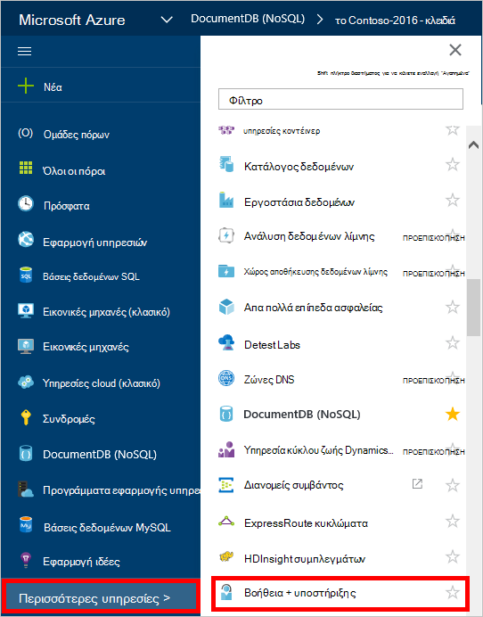
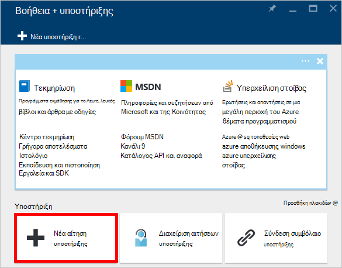
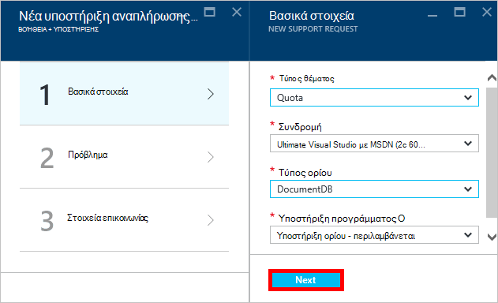
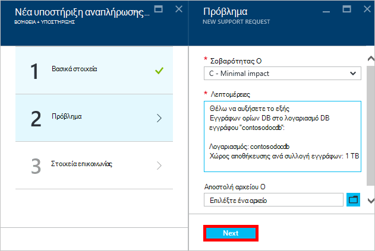
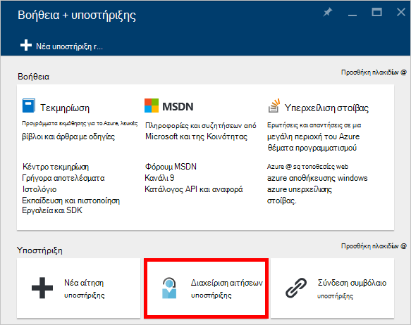

<properties
    pageTitle="Αίτηση αυξημένη ορίων λογαριασμού DocumentDB | Microsoft Azure"
    description="Μάθετε πώς μπορείτε να ζητήσετε Προσαρμογή DocumentDB βάση δεδομένων ορίων όπως αποθήκευση εγγράφων και απόδοση ανά συλλογή."
    services="documentdb"
    authors="AndrewHoh"
    manager="jhubbard"
    editor="monicar"
    documentationCenter=""/>

<tags
    ms.service="documentdb"
    ms.workload="data-services"
    ms.tgt_pltfrm="na"
    ms.devlang="na"
    ms.topic="article"
    ms.date="08/25/2016"
    ms.author="anhoh"/>

# Αίτηση για αυξημένη όρια λογαριασμών DocumentDB

[Microsoft Azure DocumentDB](https://azure.microsoft.com/services/documentdb/) περιλαμβάνει ένα σύνολο από προεπιλογή ορίων που μπορούν να ρυθμιστούν με επικοινωνία με την υποστήριξη του Azure.  Σε αυτό το άρθρο παρουσιάζει πώς μπορείτε να ζητήσετε μια αύξηση ορίου.

Μετά την ανάγνωση αυτό το άρθρο, θα έχετε τη δυνατότητα να απαντούν στα παρακάτω ερωτήματα:  

-   Ποια DocumentDB ορίων βάσης δεδομένων μπορεί να προσαρμοστεί με επικοινωνία με την υποστήριξη του Azure;
-   Πώς μπορώ να ζητήσω μια προσαρμογή ορίου λογαριασμό DocumentDB;

##DocumentDB λογαριασμού ορίων

Ο παρακάτω πίνακας περιγράφει τα όρια DocumentDB. Τα όρια που έχουν έναν αστερίσκο (*) μπορούν να ρυθμιστούν με επικοινωνία με την υποστήριξη του Azure:

[AZURE.INCLUDE [azure-documentdb-limits](../../includes/azure-documentdb-limits.md)]

##Πρόσκληση σε ένα όριο προσαρμογής
Τα ακόλουθα βήματα δείχνουν πώς μπορείτε να ζητήσετε μια προσαρμογή ορίου.

1. Στην [πύλη του Azure](https://portal.azure.com), κάντε κλικ στην επιλογή **Περισσότερες υπηρεσίες**και, στη συνέχεια, κάντε κλικ στην επιλογή **Βοήθεια + υποστήριξης**.

    

2. Στο blade **Βοήθεια + υποστήριξης** , κάντε κλικ στην επιλογή **Δημιουργία υποστηρίζει την αίτηση**.

    

3. Στο blade **Δημιουργία υποστηρίζει την αίτηση** , κάντε κλικ στην επιλογή **βασικά στοιχεία**. Επόμενο, ορίστε **τύπο θέματος** **ορίου**, **συνδρομή** για τη συνδρομή σας που φιλοξενεί το DocumentDB λογαριασμού, **τύπος ορίου** για **DocumentDB**και **σχέδιο υποστήριξης** για την **ΥΠΟΣΤΉΡΙΞΗ του ορίου - περιλαμβάνεται**. Στη συνέχεια, κάντε κλικ στο κουμπί **Επόμενο**.

    

4. Στο blade το **πρόβλημα** , επιλέξτε μια σοβαρότητας και περιλαμβάνουν πληροφορίες σχετικά με το όριο αύξηση στις **Λεπτομέρειες**. Κάντε κλικ στο κουμπί **Επόμενο**.

    

5. Τέλος, συμπληρώστε τις πληροφορίες επαφής σας στο το blade **πληροφορίες επικοινωνίας** και κάντε κλικ στην επιλογή **Δημιουργία**.

Αφού δημιουργηθεί το δελτίο υποστήριξης, θα πρέπει να λάβετε τον αριθμό αίτηση υποστήριξης μέσω ηλεκτρονικού ταχυδρομείου.  Μπορείτε επίσης να προβάλετε την αίτηση υποστήριξης κάνοντας κλικ στην επιλογή **Διαχείριση υποστήριξη αιτήσεις** το blade **Βοήθεια + υποστήριξης** .

##Επόμενα βήματα
- Για να μάθετε περισσότερα σχετικά με την DocumentDB, κάντε κλικ [εδώ](http://azure.com/docdb).
