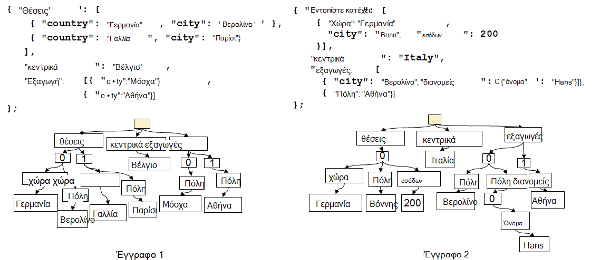
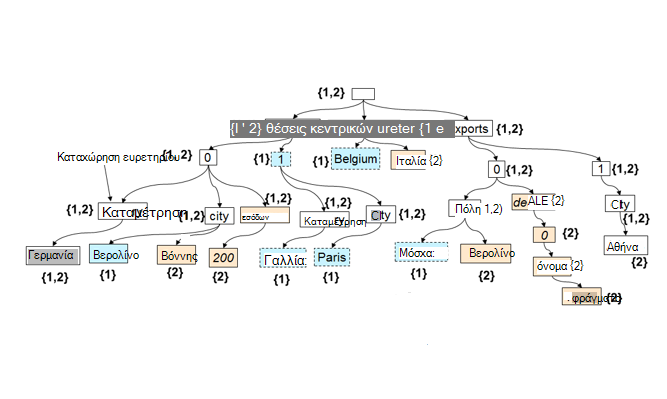

<properties 
    pageTitle="Αυτόματη δημιουργία ευρετηρίου στο DocumentDB | Microsoft Azure" 
    description="Μάθετε περισσότερα σχετικά με τον τρόπο αυτόματης δημιουργίας ευρετηρίου λειτουργεί στο Azure DocumentDB." 
    services="documentdb" 
    authors="arramac" 
    manager="jhubbard" 
    editor="mimig" 
    documentationCenter=""/>

<tags 
    ms.service="documentdb" 
    ms.workload="data-services" 
    ms.tgt_pltfrm="na" 
    ms.devlang="na" 
    ms.topic="article" 
    ms.date="10/27/2016" 
    ms.author="arramac"/>
    
# Αυτόματη δημιουργία ευρετηρίου στο Azure DocumentDB

Σε αυτό το άρθρο είναι απόσπασμα από το χαρτί ["σχήμα Agnostic δημιουργίας ευρετηρίου με Azure DocumentDB"](http://www.vldb.org/pvldb/vol8/p1668-shukla.pdf) , το οποίο θα παρουσιάζονται στο [41st εσωτερικό διάσκεψη για πολύ μεγάλες βάσεις δεδομένων](http://www.vldb.org/2015/) μεταξύ 31 Αυγούστου - 4 Σεπτεμβρίου 2015, και είναι μια εισαγωγή στο τον τρόπο δημιουργίας ευρετηρίου λειτουργεί στο Azure DocumentDB. 

Μετά την ανάγνωση αυτό, θα απαντούν στα παρακάτω ερωτήματα:

- Πώς γνωρίζει το DocumentDB να υπολογίσει το σχήμα από ένα έγγραφο JSON;
- Πώς DocumentDB δημιουργούν ένα ευρετήριο σε ανόμοιες έγγραφα;
- Πώς το DocumentDB εκτέλεση αυτόματης δημιουργίας ευρετηρίου με κλίμακα;

##Πώς λειτουργεί η δημιουργία ευρετηρίου DocumentDB

[Microsoft Azure DocumentDB](https://azure.microsoft.com/services/documentdb/) είναι σχεδιασμένες για JSON σκοπό true χωρίς σχήματος βάσης δεδομένων. Να μην περιμένετε ή απαιτούν οποιοδήποτε σχήμα ή ορισμούς δευτερεύοντα ευρετηρίου για το ευρετήριο δεδομένων στην κλίμακα. Αυτό σας επιτρέπει να ορίσετε γρήγορα και να επαναλάβετε στην εφαρμογή μοντέλα δεδομένων με χρήση DocumentDB. Καθώς προσθέτετε έγγραφα σε μια συλλογή, DocumentDB δημιουργεί αυτόματα ένα ευρετήριο όλες τις ιδιότητες εγγράφου, ώστε να είναι διαθέσιμα για εσάς στο ερώτημα. Αυτόματη δημιουργία ευρετηρίου σάς επιτρέπει να αποθηκεύετε τα έγγραφα που ανήκουν σε πλήρως αυθαίρετο σχήματα χωρίς να ανησυχείτε για σχήματα ή δευτερεύων ευρετήρια.

Με ένα στόχο για να αποφύγετε την αντίσταση ασυμφωνία μεταξύ της βάσης δεδομένων και τα μοντέλα προγραμματισμού εφαρμογών, DocumentDB εκμεταλλεύεται την απλότητα του JSON ενώ η έλλειψη προδιαγραφή σχήματος. Μετατρέπει χωρίς υποθέσεις σχετικά με τα έγγραφα και επιτρέπει σε έγγραφα μέσα σε μια συλλογή DocumentDB να διαφέρουν στο σχήμα, εκτός από την παρουσία συγκεκριμένες τιμές. Σε αντίθεση με άλλες βάσεις δεδομένων του εγγράφου, του μηχανισμού βάσεων δεδομένων της DocumentDB συνεπάγεται απευθείας στο επίπεδο της γραμματικής JSON, υπόλοιπη είναι ανεξάρτητο για την έννοια της ένα σχήμα εγγράφου και θόλωμα το όριο μεταξύ των τιμών δομή και την παρουσία των εγγράφων. Σε αυτό, στο-ενεργοποίηση, παρέχει τη δυνατότητα να αυτόματα ευρετήριο έγγραφα χωρίς να απαιτείται σχήματος ή δευτερεύων ευρετήρια.

Η δημιουργία ευρετηρίου στο DocumentDB αξιοποιεί το γεγονός ότι γραμματικής JSON επιτρέπει σε έγγραφα για να **αναπαριστώνται ως δέντρα**. Για ένα έγγραφο JSON που θα εμφανίζονται ως ένα δέντρο, μια εικονική ριζικό κόμβο πρέπει να δημιουργηθεί που parents τα υπόλοιπα την πραγματική κόμβους στο έγγραφο κάτω από. Κάθε ετικέτας, συμπεριλαμβανομένων των δεικτών πίνακα σε ένα έγγραφο JSON μετατρέπεται σε έναν κόμβο του δέντρου. Η παρακάτω εικόνα παρουσιάζει ένα παράδειγμα έγγραφο JSON και το αντίστοιχο αναπαράσταση δέντρου.

>[AZURE.NOTE] Επειδή το JSON είναι αυτο-που περιγράφει δηλαδή κάθε έγγραφο περιλαμβάνει σχήματος (μετα-δεδομένα) και τα δεδομένα, π.χ. `{"locationId": 5, "city": "Moscow"}` αποκαλύπτει ότι υπάρχουν δύο ιδιότητες `locationId` και `city`, και ότι έχουν μια αριθμητικές τιμές και συμβολοσειρές ιδιότητα. DocumentDB είναι σε θέση να υπολογίσει το σχήμα των εγγράφων και δημιουργία ευρετηρίου τους όταν να εισαχθεί ή να αντικατασταθούν, χωρίς να χρειάζεται ποτέ να ορίσετε σχήματα ή δευτερεύων ευρετήρια.

**JSON εγγράφων ως δέντρα:**

Για παράδειγμα, στο παράδειγμα που φαίνεται παραπάνω:

- Η ιδιότητα JSON `{"headquarters": "Belgium"}` η ιδιότητα στο παραπάνω παράδειγμα αντιστοιχεί διαδρομή/headquarters/Βέλγιο.
- Ο πίνακας JSON `{"exports": [{"city": “Moscow"}`, `{"city": Athens"}]}` αντιστοιχεί στις διαδρομές `/exports/[]/city/Moscow` και `/exports/[]/city/Athens`.

Με την αυτόματη δημιουργία ευρετηρίου (1) σε ευρετήριο κάθε διαδρομή σε μια δομή εγγράφου (εκτός αν ο προγραμματιστής ρητά έχει ρυθμίσει τις παραμέτρους της πολιτικής δημιουργίας ευρετηρίου για να αποκλείσετε ορισμένες μοτίβα διαδρομή). (2) κάθε ενημερωμένη έκδοση ενός εγγράφου σε μια συλλογή DocumentDB υποψήφιων πελατών για την ενημέρωση της δομής του ευρετηρίου (π.χ., αιτίες για την προσθήκη ή κατάργηση κόμβοι). Μία από τις απαιτήσεις πρωτεύοντος της αυτόματης δημιουργίας ευρετηρίου με τα έγγραφα που είναι να διασφαλιστεί ότι το κόστος για να δημιουργήσετε ευρετήριο και υποβολή ερωτήματος σε ένα έγγραφο με δομή ένθεσης, πείτε 10 επίπεδα, είναι το ίδιο με το επίπεδο JSON εγγράφου που αποτελείται από πολλά επίπεδα ένα μόνο επίπεδο ζεύγη κλειδιού-τιμής. Επομένως, μια αναπαράσταση κανονικοποιημένη διαδρομή είναι η βάση κατά την οποία δημιουργούνται οι δύο αυτόματης δημιουργίας ευρετηρίου και ερώτημα υποσυστημάτων.

Ένα σημαντικό συνέπειες της επεξεργασίας και τα δύο τις τιμές του σχήματος και την παρουσία ομοιόμορφα όσον αφορά διαδρομές είναι που λογικά, ακριβώς όπως τα μεμονωμένα έγγραφα, ένα ευρετήριο με τα δύο έγγραφα εμφανίζονται που διατηρεί μια αντιστοίχιση μεταξύ διαδρομών και τα αναγνωριστικά εγγράφων που περιέχει τη διαδρομή μπορεί επίσης να αναπαρίσταται ως ένα δέντρο. DocumentDB χρησιμοποιεί αυτό το γεγονός για να δημιουργήσετε ένα δέντρο ευρετηρίου που έχει συνταχθεί από την ένωση όλων των δέντρα που αντιπροσωπεύει μεμονωμένα έγγραφα μέσα στη συλλογή. Το δέντρο ευρετήριο σε συλλογές DocumentDB μεγαλώνει με τον καιρό, όπως τα νέα έγγραφα γρήγορα που προστέθηκε ή ενημερώθηκε στη συλλογή.

**Ευρετήριο DocumentDB ως ένα δέντρο:**

Παρά τη δωρεάν σχήματος, του DocumentDB SQL και JavaScript ερωτήματος γλώσσες παρέχουν σχεσιακές προβλέψεις και φίλτρα, ιεραρχική περιήγησης σε έγγραφα, χώρου λειτουργίες και κλήση του UDF συνταχθεί εντελώς σε JavaScript. Το DocumentDB χρόνου εκτέλεσης ερωτήματος είναι σε θέση να υποστηρίζουν αυτά τα ερωτήματα, επειδή μπορεί να λειτουργήσει ως απευθείας σε σχέση με αυτό αναπαράσταση δέντρου ευρετηρίου των δεδομένων.

Η προεπιλεγμένη πολιτική δημιουργίας ευρετηρίου ευρετήρια όλες τις ιδιότητες όλα τα έγγραφα αυτόματα και παρέχει συνεπή ερωτήματα (που σημαίνει το ευρετήριο ενημερώνεται σύγχρονη με την εγγραφή εγγράφου). Πώς υποστηρίζει DocumentDB συνεπείς ενημερώσεις για το δέντρο ευρετήριο σε κλίμακα; DocumentDB χρησιμοποιεί εγγραφής βελτιστοποιηθεί, κλειδώματος δωρεάν και καταγραφής δομημένες τεχνικές συντήρηση ευρετηρίου. Αυτό σημαίνει ότι DocumentDB μπορεί να υποστηρίξει μια σταθερή ένταση fast εγγραφών ενώ εξακολουθείτε να εξυπηρετούν συνεπή ερωτήματα. 

Η δημιουργία ευρετηρίου της DocumentDB έχει σχεδιαστεί για το χώρο αποθήκευσης της αποδοτικότητας και χειρισμού πολλαπλή μίσθωση. Για το κόστος αποτελεσματικότητα, το χώρο αποθήκευσης στο δίσκο επιβάρυνσης του ευρετηρίου είναι χαμηλή και προβλέψιμα. Ενημερώσεις ευρετηρίου επίσης εκτελούνται μέσα στον προϋπολογισμό του έχει εκχωρηθεί ανά συλλογή DocumentDB πόρους του συστήματος.

##Επόμενα βήματα
- Κάντε λήψη του ["σχήμα Agnostic δημιουργίας ευρετηρίου με Azure DocumentDB"](http://www.vldb.org/pvldb/vol8/p1668-shukla.pdf), πρέπει να υποβάλλονται στο εσωτερικό 41st διάσκεψη σε πολύ μεγάλες βάσεις δεδομένων, 31 Αυγούστου - 4 Σεπτεμβρίου 2015.
- [Ερώτημα με DocumentDB SQL](documentdb-sql-query.md)
- Μάθετε πώς μπορείτε να προσαρμόσετε το ευρετήριο DocumentDB [εδώ](documentdb-indexing-policies.md)
 
