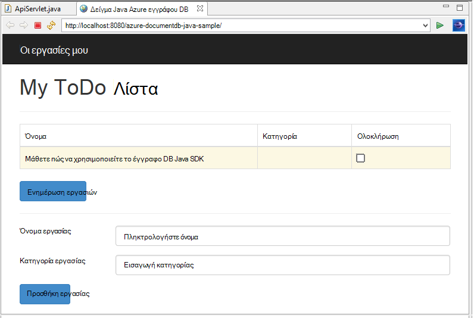
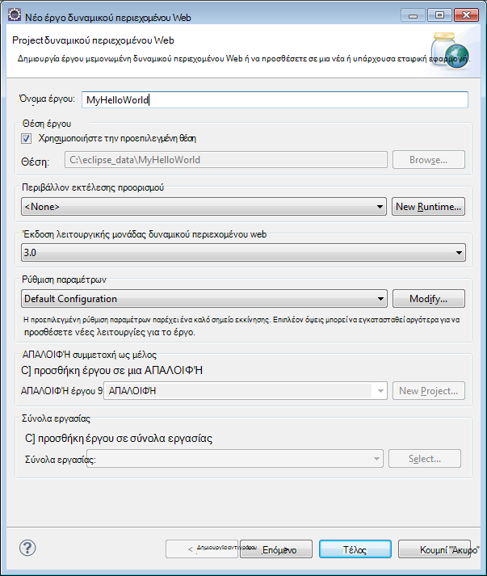
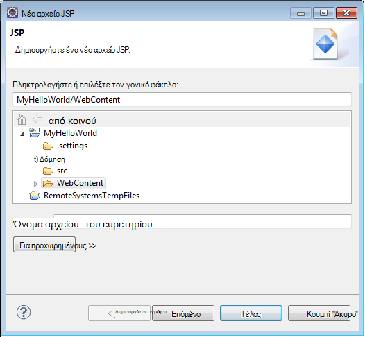
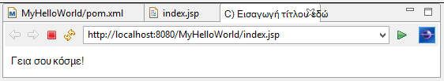
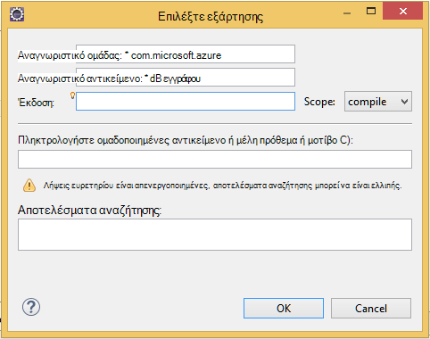

<properties
    pageTitle="Χρήση DocumentDB πρόγραμμα εκμάθησης ανάπτυξης εφαρμογής Java | Microsoft Azure"
    description="Αυτό το πρόγραμμα εκμάθησης Java web εφαρμογής σας δείχνει πώς μπορείτε να χρησιμοποιήσετε την υπηρεσία Azure DocumentDB για την αποθήκευση και δεδομένων της access από μια εφαρμογή Java φιλοξενούνται σε τοποθεσίες Web Azure."
    keywords="Ανάπτυξη της εφαρμογής, εκμάθηση βάσης δεδομένων, εφαρμογή java, πρόγραμμα εκμάθησης εφαρμογής web java, documentdb, azure, Microsoft azure"
    services="documentdb"
    documentationCenter="java"
    authors="dennyglee"
    manager="jhubbard"
    editor="mimig"/>

<tags
    ms.service="documentdb"
    ms.devlang="java"
    ms.topic="hero-article"
    ms.tgt_pltfrm="NA"
    ms.workload="data-services"
    ms.date="08/24/2016"
    ms.author="denlee"/>

# Δημιουργία μιας εφαρμογής web Java χρησιμοποιώντας DocumentDB

> [AZURE.SELECTOR]
- [.NET](documentdb-dotnet-application.md)
- [Node.js](documentdb-nodejs-application.md)
- [Java](documentdb-java-application.md)
- [Python](documentdb-python-application.md)

Αυτό το πρόγραμμα εκμάθησης Java web εφαρμογής σας δείχνει πώς μπορείτε να χρησιμοποιήσετε την υπηρεσία [Microsoft Azure DocumentDB](https://portal.azure.com/#gallery/Microsoft.DocumentDB) για την αποθήκευση και δεδομένων της access από μια εφαρμογή Java φιλοξενούνται σε τοποθεσίες Web Azure. Σε αυτό το θέμα, θα μάθετε:

- Μάθετε πώς μπορείτε να δημιουργήσετε μια βασική εφαρμογή JSP στο Έκλειψη.
- Μάθετε πώς μπορείτε να εργαστείτε με την υπηρεσία Azure DocumentDB χρησιμοποιώντας το [DocumentDB Java SDK](https://github.com/Azure/azure-documentdb-java).

Αυτό το πρόγραμμα εκμάθησης εφαρμογής Java δείχνει πώς μπορείτε να δημιουργήσετε μια εφαρμογή Διαχείριση εργασιών που βασίζεται στο web που σας επιτρέπει να δημιουργείτε, να ανακτήσετε και επισημάνετε ως ολοκληρωμένο, εργασίες, όπως φαίνεται στην παρακάτω εικόνα. Κάθε μία από τις εργασίες στη λίστα ToDo αποθηκεύονται ως JSON εγγράφων στο Azure DocumentDB.

> [AZURE.TIP] Αυτό το πρόγραμμα εκμάθησης ανάπτυξης εφαρμογής προϋποθέτει ότι έχετε προηγούμενη εμπειρία με χρήση Java. Εάν είστε νέος χρήστης του Java ή τα [Εργαλεία προαπαιτούμενες](#Prerequisites), συνιστάται να τη λήψη του έργου ολοκλήρωσης [todo](https://github.com/Azure-Samples/documentdb-java-todo-app) από GitHub και τη δημιουργία χρησιμοποιώντας [τις οδηγίες στο τέλος αυτού του άρθρου](#GetProject). Μόλις το ενσωματωμένο, μπορείτε να δείτε το άρθρο για να αποκτήσετε πληροφορίες για τον κωδικό στο περιβάλλον του έργου.  

##Προαπαιτούμενα στοιχεία για αυτό το πρόγραμμα εκμάθησης Java web εφαρμογής
Προτού ξεκινήσετε αυτό το πρόγραμμα εκμάθησης ανάπτυξης εφαρμογής, πρέπει να έχετε τα εξής:

- Λογαριασμού Azure active. Εάν δεν έχετε ένα λογαριασμό, μπορείτε να δημιουργήσετε ένα δωρεάν λογαριασμό της δοκιμαστικής έκδοσης σε λίγα λεπτά. Για λεπτομέρειες, ανατρέξτε στο θέμα [Azure δωρεάν δοκιμαστικής έκδοσης](https://azure.microsoft.com/pricing/free-trial/).
- [Java Development Kit (JDK) 7 +](http://www.oracle.com/technetwork/java/javase/downloads/index.html).
- [Έκλειψη IDE για τους προγραμματιστές ΕΕ Java.](http://www.eclipse.org/downloads/packages/eclipse-ide-java-ee-developers/lunasr1)
- [Μια τοποθεσία Web Azure με Java χρόνου εκτέλεσης περιβάλλον (π.χ., Tomcat ή Jetty) με δυνατότητα.](../app-service-web/web-sites-java-get-started.md)

Εάν εγκαθιστάτε αυτά τα εργαλεία για πρώτη φορά, coreservlets.com παρέχει μια Γνωρίστε της διαδικασίας εγκατάστασης στην ενότητα γρήγορης εκκίνησης του τους [πρόγραμμα εκμάθησης: κατά την εγκατάσταση TomCat7 και η χρήση της με έκλειψη](http://www.coreservlets.com/Apache-Tomcat-Tutorial/tomcat-7-with-eclipse.html) το άρθρο.

##Βήμα 1: Δημιουργία λογαριασμού DocumentDB βάσης δεδομένων

Ας ξεκινήσουμε με τη δημιουργία ενός λογαριασμού DocumentDB. Εάν έχετε ήδη ένα λογαριασμό, μπορείτε να μεταβείτε στο [βήμα 2: δημιουργία της εφαρμογής Java JSP](#CreateJSP).

[AZURE.INCLUDE [documentdb-create-dbaccount](../../includes/documentdb-create-dbaccount.md)]

[AZURE.INCLUDE [documentdb-keys](../../includes/documentdb-keys.md)]

##Βήμα 2: Δημιουργία της εφαρμογής Java JSP

Για να δημιουργήσετε την εφαρμογή JSP:

1. Πρώτα, ας ξεκινήσουμε με τη δημιουργία ενός έργου Java. Έναρξη Έκλειψη, στη συνέχεια, κάντε κλικ στο **αρχείο**, κάντε κλικ στην επιλογή **Δημιουργία**και, στη συνέχεια, κάντε κλικ στην επιλογή **Δυναμικής Project Web**. Εάν δεν βλέπετε **Δυναμικής Project Web** που αναφέρονται ως διαθέσιμη έργο, κάντε τα εξής: κάντε κλικ στο **αρχείο**, κάντε κλικ στην επιλογή **Δημιουργία**, κάντε κλικ στην επιλογή **Project**..., αναπτύξτε το στοιχείο **Web**, κάντε κλικ στην επιλογή **Δυναμικής Project Web**και κάντε κλικ στο κουμπί **Επόμενο**.

    

2. Πληκτρολογήστε ένα όνομα έργου, στο πλαίσιο **όνομα έργου** και, στο αναπτυσσόμενο μενού του **Χρόνου εκτέλεσης προορισμού** , προαιρετικά, επιλέξτε μια τιμή (π.χ. έκδοση 7.0 Apache Tomcat) και, στη συνέχεια, κάντε κλικ στο κουμπί **Τέλος**. Επιλογή προορισμού χρόνο εκτέλεσης σάς επιτρέπει να εκτελέσετε το έργο σας τοπικά μέσω Έκλειψη.
3. Στο Έκλειψη, στην προβολή Εξερεύνησης έργου, αναπτύξτε το έργο σας. Κάντε δεξί κλικ **WebContent**, κάντε κλικ στην επιλογή **Δημιουργία**και, στη συνέχεια, κάντε κλικ στην επιλογή **Αρχείο JSP**.
4. Στο παράθυρο διαλόγου **Νέο αρχείο JSP** , ονομάστε το αρχείο **index.jsp**. Διατήρηση στο γονικό φάκελο ως **WebContent**, όπως φαίνεται στην παρακάτω εικόνα και, στη συνέχεια, κάντε κλικ στο κουμπί **Επόμενο**.

    

5. Στο παράθυρο διαλόγου **Επιλέξτε το πρότυπο JSP** , για αυτό το πρόγραμμα εκμάθησης, επιλέξτε **Νέο αρχείο JSP (html)**και, στη συνέχεια, κάντε κλικ στο κουμπί **Τέλος**.

6. Όταν ανοίξει το αρχείο index.jsp στο Έκλειψη, προσθέστε κείμενο προς εμφάνιση **Γεια!** κατά την υπάρχουσα <body> στοιχείο. Το ενημερωμένο <body> περιεχόμενο θα πρέπει να μοιάζει με τον ακόλουθο κώδικα:

        <body>
            <% out.println("Hello World!"); %>
        </body>

8. Αποθηκεύστε το αρχείο index.jsp.
9. Εάν ορίσετε έναν χρόνο εκτέλεσης προορισμού στο βήμα 2, μπορείτε να κάνετε κλικ **έργου** και, στη συνέχεια, **εκτελέστε** για να εκτελέσετε την εφαρμογή σας JSP τοπικά:

    

##Βήμα 3: Εγκαταστήστε το DocumentDB Java SDK ##

Ο ευκολότερος τρόπος για να έλκει το SDK Java DocumentDB και τις εξαρτήσεις είναι μέσω [Apache Maven](http://maven.apache.org/).

Για να το κάνετε αυτό, θα πρέπει να μετατρέψετε το έργο σας σε ένα έργο maven ολοκληρώνοντας τα παρακάτω βήματα:

1. Κάντε δεξιό κλικ στο έργο σας στην Εξερεύνηση έργου, κάντε κλικ στην επιλογή **Ρύθμιση παραμέτρων**, κάντε κλικ στην επιλογή **Μετατροπή σε Maven έργου**.
2. Στο παράθυρο **Δημιουργία νέου POM** , αποδεχτείτε τις προεπιλογές και κάντε κλικ στο κουμπί **Τέλος**.
3. Στην **Εξερεύνηση έργου**, ανοίξτε το αρχείο pom.xml.
4. Στην καρτέλα **εξαρτήσεις** , στο παράθυρο **εξαρτήσεις** , κάντε κλικ στην επιλογή **Προσθήκη**.
4. Στο παράθυρο **Επιλέξτε εξάρτηση** , κάντε τα εξής:
 - Στο πλαίσιο **αναγνωριστικό ομάδας** , πληκτρολογήστε com.microsoft.azure.
 - Στο πλαίσιο **Αντικείμενο Id** , πληκτρολογήστε azure documentdb.
 - Στο πλαίσιο **έκδοση** πληκτρολογήστε 1.5.1.

    

    Ή να προσθέσετε την εξάρτηση XML για το αναγνωριστικό ομάδας και ArtifactId απευθείας το pom.xml μέσω ένα πρόγραμμα επεξεργασίας κειμένου:

        <dependency>
            <groupId>com.microsoft.azure</groupId>
            <artifactId>azure-documentdb</artifactId>
            <version>1.5.1</version>
        </dependency>

5. Κάντε κλικ στο κουμπί **Ok** και Maven θα εγκαταστήσετε το SDK Java DocumentDB.
6. Αποθηκεύστε το αρχείο pom.xml.

##Βήμα 4: Με την υπηρεσία DocumentDB σε μια εφαρμογή Java

1. Πρώτα, ας ορίζουν το αντικείμενο TodoItem:

        @Data
        @Builder
        public class TodoItem {
            private String category;
            private boolean complete;
            private String id;
            private String name;
        }

    Σε αυτό το έργο, χρησιμοποιούμε [Lombok έργου](http://projectlombok.org/) για να δημιουργήσετε την κατασκευή, στοιχεία επικέντρωσης, setters και ένα εργαλείο δόμησης. Εναλλακτικά, μπορείτε να γράψετε αυτόν τον κωδικό με μη αυτόματο τρόπο ή έχει δημιουργηθεί IDE.

2. Για να καλέσετε την υπηρεσία DocumentDB, πρέπει να ξεκινήσει μια νέα **DocumentClient**. Σε γενικές γραμμές, είναι καλύτερο να επαναχρησιμοποιήσετε **DocumentClient** - αντί να δημιουργήσετε ένα νέο πρόγραμμα-πελάτη για κάθε αίτηση οι επόμενες. Θα σας να χρησιμοποιήσετε ξανά το πρόγραμμα-πελάτη με αναδίπλωση του προγράμματος-πελάτη σε ένα **DocumentClientFactory**. Αυτό είναι επίσης όπου πρέπει να επικολλήστε την τιμή URI και ΠΡΩΤΕΎΟΝ ΚΛΕΙΔΊ που έχετε αποθηκεύσει στο Πρόχειρο στο [βήμα 1](#CreateDB). Αντικατάσταση [ΣΑΣ\_τελικού ΣΗΜΕΊΟΥ\_ΕΔΏ] με το URI και αντικατάσταση [ΣΑΣ\_ΚΛΕΙΔΊ\_ΕΔΏ] με το ΠΡΩΤΕΎΟΝ ΚΛΕΙΔΊ.

        private static final String HOST = "[YOUR_ENDPOINT_HERE]";
        private static final String MASTER_KEY = "[YOUR_KEY_HERE]";

        private static DocumentClient documentClient;

        public static DocumentClient getDocumentClient() {
            if (documentClient == null) {
                documentClient = new DocumentClient(HOST, MASTER_KEY,
                        ConnectionPolicy.GetDefault(), ConsistencyLevel.Session);
            }

            return documentClient;
        }

3. Τώρα ας δημιουργήσουμε ένα αντικείμενο πρόσβασης δεδομένων (DAO) σε συνοπτική συνεχίζεται μας στοιχεία ToDo για DocumentDB.

    Για να αποθηκεύσετε ToDo στοιχείων σε μια συλλογή, ο υπολογιστής-πελάτης πρέπει να γνωρίζετε ποιες βάσης δεδομένων και να παραμένει σε συλλογή (ως αναφοράς με αυτο-συνδέσεων). Σε γενικές γραμμές, είναι καλύτερα να cache τη βάση δεδομένων και τη συλλογή όταν είναι δυνατό να αποφύγετε επιπλέον επικοινωνία με τη βάση δεδομένων.

    Ο ακόλουθος κώδικας απεικονίζει τον τρόπο για να ανακτήσετε τη βάση δεδομένων και συλλογή, εάν υπάρχει, ή δημιουργήστε ένα νέο, εάν δεν υπάρχει:

        public class DocDbDao implements TodoDao {
            // The name of our database.
            private static final String DATABASE_ID = "TodoDB";

            // The name of our collection.
            private static final String COLLECTION_ID = "TodoCollection";

            // The DocumentDB Client
            private static DocumentClient documentClient = DocumentClientFactory
                    .getDocumentClient();

            // Cache for the database object, so we don't have to query for it to
            // retrieve self links.
            private static Database databaseCache;

            // Cache for the collection object, so we don't have to query for it to
            // retrieve self links.
            private static DocumentCollection collectionCache;

            private Database getTodoDatabase() {
                if (databaseCache == null) {
                    // Get the database if it exists
                    List<Database> databaseList = documentClient
                            .queryDatabases(
                                    "SELECT * FROM root r WHERE r.id='" + DATABASE_ID
                                            + "'", null).getQueryIterable().toList();

                    if (databaseList.size() > 0) {
                        // Cache the database object so we won't have to query for it
                        // later to retrieve the selfLink.
                        databaseCache = databaseList.get(0);
                    } else {
                        // Create the database if it doesn't exist.
                        try {
                            Database databaseDefinition = new Database();
                            databaseDefinition.setId(DATABASE_ID);

                            databaseCache = documentClient.createDatabase(
                                    databaseDefinition, null).getResource();
                        } catch (DocumentClientException e) {
                            // TODO: Something has gone terribly wrong - the app wasn't
                            // able to query or create the collection.
                            // Verify your connection, endpoint, and key.
                            e.printStackTrace();
                        }
                    }
                }

                return databaseCache;
            }

            private DocumentCollection getTodoCollection() {
                if (collectionCache == null) {
                    // Get the collection if it exists.
                    List<DocumentCollection> collectionList = documentClient
                            .queryCollections(
                                    getTodoDatabase().getSelfLink(),
                                    "SELECT * FROM root r WHERE r.id='" + COLLECTION_ID
                                            + "'", null).getQueryIterable().toList();

                    if (collectionList.size() > 0) {
                        // Cache the collection object so we won't have to query for it
                        // later to retrieve the selfLink.
                        collectionCache = collectionList.get(0);
                    } else {
                        // Create the collection if it doesn't exist.
                        try {
                            DocumentCollection collectionDefinition = new DocumentCollection();
                            collectionDefinition.setId(COLLECTION_ID);

                            collectionCache = documentClient.createCollection(
                                    getTodoDatabase().getSelfLink(),
                                    collectionDefinition, null).getResource();
                        } catch (DocumentClientException e) {
                            // TODO: Something has gone terribly wrong - the app wasn't
                            // able to query or create the collection.
                            // Verify your connection, endpoint, and key.
                            e.printStackTrace();
                        }
                    }
                }

                return collectionCache;
            }
        }

4. Το επόμενο βήμα είναι να συντάξετε ορισμένες κώδικα για να διατηρηθεί η TodoItems στη συλλογή. Σε αυτό το παράδειγμα, θα χρησιμοποιήσουμε [Gson](https://code.google.com/p/google-gson/) σειριοποίηση και καταργήστε την σειριοποιεί TodoItem απλό παλιά Java αντικείμενα (POJOs) για να JSON έγγραφα. [Jackson](http://jackson.codehaus.org/) ή το δικό σας προσαρμοσμένο πρόγραμμα σειριοποίησης είναι επίσης εξαιρετική εναλλακτικές λύσεις για σειριοποίησης POJOs.

        // We'll use Gson for POJO <=> JSON serialization for this example.
        private static Gson gson = new Gson();

        @Override
        public TodoItem createTodoItem(TodoItem todoItem) {
            // Serialize the TodoItem as a JSON Document.
            Document todoItemDocument = new Document(gson.toJson(todoItem));

            // Annotate the document as a TodoItem for retrieval (so that we can
            // store multiple entity types in the collection).
            todoItemDocument.set("entityType", "todoItem");

            try {
                // Persist the document using the DocumentClient.
                todoItemDocument = documentClient.createDocument(
                        getTodoCollection().getSelfLink(), todoItemDocument, null,
                        false).getResource();
            } catch (DocumentClientException e) {
                e.printStackTrace();
                return null;
            }

            return gson.fromJson(todoItemDocument.toString(), TodoItem.class);
        }

5. Όπως DocumentDB βάσεις δεδομένων και συλλογών, αναφέρονται επίσης έγγραφα με αυτο-συνδέσεων. Η ακόλουθη συνάρτηση βοηθός σας επιτρέπει να μας ανάκτηση εγγράφων από το άλλο χαρακτηριστικό (π.χ. "αναγνωριστικό") και όχι με σύνδεση:

        private Document getDocumentById(String id) {
            // Retrieve the document using the DocumentClient.
            List<Document> documentList = documentClient
                    .queryDocuments(getTodoCollection().getSelfLink(),
                            "SELECT * FROM root r WHERE r.id='" + id + "'", null)
                    .getQueryIterable().toList();

            if (documentList.size() > 0) {
                return documentList.get(0);
            } else {
                return null;
            }
        }

6. Μπορούμε να χρησιμοποιήσουμε τη μέθοδο Βοήθειας στο βήμα 5 για να ανακτήσετε ένα έγγραφο TodoItem JSON κατά αναγνωριστικό και, στη συνέχεια, αποσειριοποίηση το σε μια POJO:

        @Override
        public TodoItem readTodoItem(String id) {
            // Retrieve the document by id using our helper method.
            Document todoItemDocument = getDocumentById(id);

            if (todoItemDocument != null) {
                // De-serialize the document in to a TodoItem.
                return gson.fromJson(todoItemDocument.toString(), TodoItem.class);
            } else {
                return null;
            }
        }

7. Θα σας επίσης να χρησιμοποιήσετε το DocumentClient για να λάβετε μια συλλογή ή μια λίστα των TodoItems χρησιμοποιώντας DocumentDB SQL:

        @Override
        public List<TodoItem> readTodoItems() {
            List<TodoItem> todoItems = new ArrayList<TodoItem>();

            // Retrieve the TodoItem documents
            List<Document> documentList = documentClient
                    .queryDocuments(getTodoCollection().getSelfLink(),
                            "SELECT * FROM root r WHERE r.entityType = 'todoItem'",
                            null).getQueryIterable().toList();

            // De-serialize the documents in to TodoItems.
            for (Document todoItemDocument : documentList) {
                todoItems.add(gson.fromJson(todoItemDocument.toString(),
                        TodoItem.class));
            }

            return todoItems;
        }

8. Υπάρχουν πολλοί τρόποι για την ενημέρωση ενός εγγράφου με την DocumentClient. Στην εφαρμογή μας λίστα Todo, θέλουμε να έχετε τη δυνατότητα να κάνετε εναλλαγή εάν μια TodoItem έχει ολοκληρωθεί. Αυτό μπορεί να είναι δυνατό με την ενημέρωση το χαρακτηριστικό "ολοκληρώθηκε" μέσα στο έγγραφο:

        @Override
        public TodoItem updateTodoItem(String id, boolean isComplete) {
            // Retrieve the document from the database
            Document todoItemDocument = getDocumentById(id);

            // You can update the document as a JSON document directly.
            // For more complex operations - you could de-serialize the document in
            // to a POJO, update the POJO, and then re-serialize the POJO back in to
            // a document.
            todoItemDocument.set("complete", isComplete);

            try {
                // Persist/replace the updated document.
                todoItemDocument = documentClient.replaceDocument(todoItemDocument,
                        null).getResource();
            } catch (DocumentClientException e) {
                e.printStackTrace();
                return null;
            }

            return gson.fromJson(todoItemDocument.toString(), TodoItem.class);
        }

9. Τέλος, θέλουμε τη δυνατότητα να διαγράψετε μια TodoItem από τη λίστα. Για να το κάνετε αυτό, χρησιμοποιούμε τη μέθοδο Βοήθειας θα σας συντάξατε παραπάνω για να ανακτήσετε τα αυτο-σύνδεση και, στη συνέχεια, ενημερώστε το πρόγραμμα-πελάτη για να τον διαγράψετε:

        @Override
        public boolean deleteTodoItem(String id) {
            // DocumentDB refers to documents by self link rather than id.

            // Query for the document to retrieve the self link.
            Document todoItemDocument = getDocumentById(id);

            try {
                // Delete the document by self link.
                documentClient.deleteDocument(todoItemDocument.getSelfLink(), null);
            } catch (DocumentClientException e) {
                e.printStackTrace();
                return false;
            }

            return true;
        }

##Βήμα 5: Καλωδίωσης το υπόλοιπο του έργου ανάπτυξης εφαρμογής Java μαζί

Τώρα που θα σας έχετε ολοκληρώσει τη διασκέδαση bit - όλα που αριστερά είναι να δημιουργήσετε μια γρήγορη χρήστη το περιβάλλον εργασίας και το σύρματος έως μας DAO.

1. Πρώτα, ας ξεκινήσουμε με την κατασκευή ενός ελεγκτή για να καλέσετε DAO μας:

        public class TodoItemController {
            public static TodoItemController getInstance() {
                if (todoItemController == null) {
                    todoItemController = new TodoItemController(TodoDaoFactory.getDao());
                }
                return todoItemController;
            }

            private static TodoItemController todoItemController;

            private final TodoDao todoDao;

            TodoItemController(TodoDao todoDao) {
                this.todoDao = todoDao;
            }

            public TodoItem createTodoItem(@NonNull String name,
                    @NonNull String category, boolean isComplete) {
                TodoItem todoItem = TodoItem.builder().name(name).category(category)
                        .complete(isComplete).build();
                return todoDao.createTodoItem(todoItem);
            }

            public boolean deleteTodoItem(@NonNull String id) {
                return todoDao.deleteTodoItem(id);
            }

            public TodoItem getTodoItemById(@NonNull String id) {
                return todoDao.readTodoItem(id);
            }

            public List<TodoItem> getTodoItems() {
                return todoDao.readTodoItems();
            }

            public TodoItem updateTodoItem(@NonNull String id, boolean isComplete) {
                return todoDao.updateTodoItem(id, isComplete);
            }
        }

    Σε μια πιο σύνθετη εφαρμογή, του ελεγκτή μπορεί να τοποθετήσετε το σύνθετη επιχειρηματική λογική επάνω από το DAO.

2. Στη συνέχεια, θα δημιουργήσουμε μια servlet να δρομολογούν τις αιτήσεις HTTP στον ελεγκτή:

        public class TodoServlet extends HttpServlet {
            // API Keys
            public static final String API_METHOD = "method";

            // API Methods
            public static final String CREATE_TODO_ITEM = "createTodoItem";
            public static final String GET_TODO_ITEMS = "getTodoItems";
            public static final String UPDATE_TODO_ITEM = "updateTodoItem";

            // API Parameters
            public static final String TODO_ITEM_ID = "todoItemId";
            public static final String TODO_ITEM_NAME = "todoItemName";
            public static final String TODO_ITEM_CATEGORY = "todoItemCategory";
            public static final String TODO_ITEM_COMPLETE = "todoItemComplete";

            public static final String MESSAGE_ERROR_INVALID_METHOD = "{'error': 'Invalid method'}";

            private static final long serialVersionUID = 1L;
            private static final Gson gson = new Gson();

            @Override
            protected void doGet(HttpServletRequest request,
                    HttpServletResponse response) throws ServletException, IOException {

                String apiResponse = MESSAGE_ERROR_INVALID_METHOD;

                TodoItemController todoItemController = TodoItemController
                        .getInstance();

                String id = request.getParameter(TODO_ITEM_ID);
                String name = request.getParameter(TODO_ITEM_NAME);
                String category = request.getParameter(TODO_ITEM_CATEGORY);
                boolean isComplete = StringUtils.equalsIgnoreCase("true",
                        request.getParameter(TODO_ITEM_COMPLETE)) ? true : false;

                switch (request.getParameter(API_METHOD)) {
                case CREATE_TODO_ITEM:
                    apiResponse = gson.toJson(todoItemController.createTodoItem(name,
                            category, isComplete));
                    break;
                case GET_TODO_ITEMS:
                    apiResponse = gson.toJson(todoItemController.getTodoItems());
                    break;
                case UPDATE_TODO_ITEM:
                    apiResponse = gson.toJson(todoItemController.updateTodoItem(id,
                            isComplete));
                    break;
                default:
                    break;
                }

                response.getWriter().println(apiResponse);
            }

            @Override
            protected void doPost(HttpServletRequest request,
                    HttpServletResponse response) throws ServletException, IOException {
                doGet(request, response);
            }
        }

3. Θα χρειαστούμε ένα περιβάλλον εργασίας χρήστη Web για να εμφανίσετε στο χρήστη. Ας εκ νέου γράψετε το index.jsp που δημιουργήσαμε παλαιότερη έκδοση:

        <html>
        <head>
          <meta http-equiv="Content-Type" content="text/html; charset=ISO-8859-1">
          <meta http-equiv="X-UA-Compatible" content="IE=edge;" />
          <title>Azure DocumentDB Java Sample</title>

          <!-- Bootstrap -->
          <link href="//ajax.aspnetcdn.com/ajax/bootstrap/3.2.0/css/bootstrap.min.css" rel="stylesheet">

          
        </head>
        <body>
          <!-- Nav Bar -->
          

            

              

                <a class="navbar-brand" href="#">My Tasks</a>
              

            

          

          <!-- Body -->
          

            <h1>My ToDo List</h1>

            

            <!-- The ToDo List -->
            

              <table class="table table-bordered table-striped" id="todoItems">
                <thead>
                  <tr>
                    <th>Name</th>
                    <th>Category</th>
                    <th>Complete</th>
                  </tr>
                </thead>
                <tbody>
                </tbody>
              </table>

              <!-- Update Button -->
              

                <form class="form-horizontal" role="form">
                  <button type="button" class="btn btn-primary">Update Tasks</button>
                </form>
              

            

            

            <!-- Item Input Form -->
            

              <form class="form-horizontal" role="form">
                

                  <label for="inputItemName" class="col-sm-2">Task Name</label>
                  

                    <input type="text" class="form-control" id="inputItemName" placeholder="Enter name">
                  

                

                

                  <label for="inputItemCategory" class="col-sm-2">Task Category</label>
                  

                    <input type="text" class="form-control" id="inputItemCategory" placeholder="Enter category">
                  

                

                <button type="button" class="btn btn-primary">Add Task</button>
              </form>
            

          

          <!-- Placed at the end of the document so the pages load faster -->
          
          
          
        </body>
        </html>

4. Και τέλος, εγγραφής ορισμένες Javascript πλευρά του προγράμματος-πελάτη για να συνδέσετε το περιβάλλον εργασίας χρήστη web και το servlet:

        var todoApp = {
          /*
           * API methods to call Java backend.
           */
          apiEndpoint: "api",

          createTodoItem: function(name, category, isComplete) {
            $.post(todoApp.apiEndpoint, {
                "method": "createTodoItem",
                "todoItemName": name,
                "todoItemCategory": category,
                "todoItemComplete": isComplete
              },
              function(data) {
                var todoItem = data;
                todoApp.addTodoItemToTable(todoItem.id, todoItem.name, todoItem.category, todoItem.complete);
              },
              "json");
          },

          getTodoItems: function() {
            $.post(todoApp.apiEndpoint, {
                "method": "getTodoItems"
              },
              function(data) {
                var todoItemArr = data;
                $.each(todoItemArr, function(index, value) {
                  todoApp.addTodoItemToTable(value.id, value.name, value.category, value.complete);
                });
              },
              "json");
          },

          updateTodoItem: function(id, isComplete) {
            $.post(todoApp.apiEndpoint, {
                "method": "updateTodoItem",
                "todoItemId": id,
                "todoItemComplete": isComplete
              },
              function(data) {},
              "json");
          },

          /*
           * UI Methods
           */
          addTodoItemToTable: function(id, name, category, isComplete) {
            var rowColor = isComplete ? "active" : "warning";

            todoApp.ui_table().append($("<tr>")
              .append($("<td>").text(name))
              .append($("<td>").text(category))
              .append($("<td>")
                .append($("<input>")
                  .attr("type", "checkbox")
                  .attr("id", id)
                  .attr("checked", isComplete)
                  .attr("class", "isComplete")
                ))
              .addClass(rowColor)
            );
          },

          /*
           * UI Bindings
           */
          bindCreateButton: function() {
            todoApp.ui_createButton().click(function() {
              todoApp.createTodoItem(todoApp.ui_createNameInput().val(), todoApp.ui_createCategoryInput().val(), false);
              todoApp.ui_createNameInput().val("");
              todoApp.ui_createCategoryInput().val("");
            });
          },

          bindUpdateButton: function() {
            todoApp.ui_updateButton().click(function() {
              // Disable button temporarily.
              var myButton = $(this);
              var originalText = myButton.text();
              $(this).text("Updating...");
              $(this).prop("disabled", true);

              // Call api to update todo items.
              $.each(todoApp.ui_updateId(), function(index, value) {
                todoApp.updateTodoItem(value.name, value.value);
                $(value).remove();
              });

              // Re-enable button.
              setTimeout(function() {
                myButton.prop("disabled", false);
                myButton.text(originalText);
              }, 500);
            });
          },

          bindUpdateCheckboxes: function() {
            todoApp.ui_table().on("click", ".isComplete", function(event) {
              var checkboxElement = $(event.currentTarget);
              var rowElement = $(event.currentTarget).parents('tr');
              var id = checkboxElement.attr('id');
              var isComplete = checkboxElement.is(':checked');

              // Toggle table row color
              if (isComplete) {
                rowElement.addClass("active");
                rowElement.removeClass("warning");
              } else {
                rowElement.removeClass("active");
                rowElement.addClass("warning");
              }

              // Update hidden inputs for update panel.
              todoApp.ui_updateForm().children("input[name='" + id + "']").remove();

              todoApp.ui_updateForm().append($("<input>")
                .attr("type", "hidden")
                .attr("class", "updateComplete")
                .attr("name", id)
                .attr("value", isComplete));

            });
          },

          /*
           * UI Elements
           */
          ui_createNameInput: function() {
            return $(".todoForm #inputItemName");
          },

          ui_createCategoryInput: function() {
            return $(".todoForm #inputItemCategory");
          },

          ui_createButton: function() {
            return $(".todoForm button");
          },

          ui_table: function() {
            return $(".todoList table tbody");
          },

          ui_updateButton: function() {
            return $(".todoUpdatePanel button");
          },

          ui_updateForm: function() {
            return $(".todoUpdatePanel form");
          },

          ui_updateId: function() {
            return $(".todoUpdatePanel .updateComplete");
          },

          /*
           * Install the TodoApp
           */
          install: function() {
            todoApp.bindCreateButton();
            todoApp.bindUpdateButton();
            todoApp.bindUpdateCheckboxes();

            todoApp.getTodoItems();
          }
        };

        $(document).ready(function() {
          todoApp.install();
        });

5. Τρομερό! Τώρα που απομένει είναι να ελέγξετε την εφαρμογή. Εκτελέστε την εφαρμογή τοπικά και προσθέστε μερικά στοιχεία Todo συμπληρώνοντας το όνομα του στοιχείου και κατηγορία και κάνοντας κλικ στην επιλογή **Προσθήκη εργασίας**.

6. Όταν εμφανιστεί το στοιχείο, μπορείτε να ενημερώσετε είτε πρόκειται να ολοκληρωθεί, εναλλαγή το πλαίσιο ελέγχου και κάνοντας κλικ στην επιλογή **Ενημέρωση εργασιών**.

##Βήμα 6: Ανάπτυξη την εφαρμογή Java με το Azure τοποθεσίες Web

Azure τοποθεσίες Web κάνει την ανάπτυξη εφαρμογών Java τόσο απλή όσο η εξαγωγή την εφαρμογή σας ως αρχείο ΠΟΛΈΜΟΥ και είτε αποστολή του μέσω του στοιχείου ελέγχου προέλευσης (π.χ., GIT) ή FTP.

1. Για να εξαγάγετε την εφαρμογή ως ένα ΠΟΛΈΜΟΥ, κάντε δεξί κλικ στο έργο σας στην **Εξερεύνηση έργου**, κάντε κλικ στην επιλογή **Εξαγωγή**και, στη συνέχεια, κάντε κλικ στην επιλογή **Αρχείο ΠΟΛΈΜΟΥ**.
2. Στο παράθυρο **Εξαγωγή ΠΟΛΈΜΟΥ** , κάντε τα εξής:
 - Στο πλαίσιο έργου Web, πληκτρολογήστε azure documentdb-java-δείγματα.
 - Στο πλαίσιο προορισμού, επιλέξτε έναν προορισμό για να αποθηκεύσετε το αρχείο ΠΟΛΈΜΟΥ.
 - Κάντε κλικ στο κουμπί **Τέλος**.

3. Τώρα που έχετε ένα αρχείο ΠΟΛΈΜΟΥ με μη αυτόματο τρόπο, μπορείτε απλώς να το αποστείλετε στον κατάλογο της τοποθεσίας Web σας Azure **webapps** . Για οδηγίες σχετικά με την αποστολή του αρχείου, ανατρέξτε στο θέμα [Προσθήκη μια εφαρμογή στην τοποθεσία Web σας Java σε Azure](../app-service-web/web-sites-java-add-app.md).

    Εφόσον το αρχείο ΠΟΛΈΜΟΥ αποσταλεί στον κατάλογο webapps, του περιβάλλοντος χρόνου εκτέλεσης θα εντοπίσει ότι έχετε προσθέσει το και θα αυτόματα τη φόρτωση.
4. Για να προβάλετε το τελικό προϊόν, μεταβείτε στο http://YOUR\_ΤΟΠΟΘΕΣΊΑ\_NAME.azurewebsites.net/azure-documentdb-java-sample/ και να ξεκινήσετε να προσθέσετε τις εργασίες σας!

##Λήψη του έργου από GitHub

Όλα τα δείγματα σε αυτό το πρόγραμμα εκμάθησης περιλαμβάνονται στο έργο [todo](https://github.com/Azure-Samples/documentdb-java-todo-app) στην GitHub. Για να εισαγάγετε το έργο todo στο Έκλειψη, βεβαιωθείτε ότι έχετε το λογισμικό και τους πόρους που παρατίθενται στην ενότητα [τις προϋποθέσεις](#Prerequisites) και, στη συνέχεια, κάντε τα εξής:

1. Εγκαταστήστε το [Lombok έργου](http://projectlombok.org/). Lombok χρησιμοποιείται για τη δημιουργία κατασκευές, στοιχεία επικέντρωσης, setters του έργου. Αφού έχετε κάνει λήψη του αρχείου lombok.jar, κάντε διπλό κλικ για να εγκαταστήσετε ή να το εγκαταστήσετε από τη γραμμή εντολών.
2. Εάν Έκλειψη είναι ανοιχτό, κλείστε το και επανεκκινήστε το για να φορτώσετε Lombok.
3. Στο Έκλειψη, στο μενού **αρχείο** , κάντε κλικ στην επιλογή **Εισαγωγή**.
4. Στο παράθυρο " **Εισαγωγή** ", κάντε κλικ στην επιλογή **Git**, κάντε κλικ στην επιλογή **έργα από Git**και, στη συνέχεια, κάντε κλικ στο κουμπί **Επόμενο**.
5. Στην οθόνη **Επιλογή αποθετήριο δεδομένων προέλευσης** , κάντε κλικ στην επιλογή **Κλωνοποίηση URI**.
6. Στην οθόνη **Αποθετήριο Git προέλευσης** , στο πλαίσιο **URI** , πληκτρολογήστε https://github.com/Azure-Samples/documentdb-java-todo-app.git και, στη συνέχεια, κάντε κλικ στο κουμπί **Επόμενο**.
7. Στην οθόνη **Επιλογής κλάδο** , βεβαιωθείτε ότι αυτό **κύρια** είναι επιλεγμένο και, στη συνέχεια, κάντε κλικ στο κουμπί **Επόμενο**.
8. Στην οθόνη του **Τοπικού προορισμού** , κάντε κλικ στο κουμπί **Αναζήτηση** για να επιλέξετε ένα φάκελο όπου είναι δυνατή η αντιγραφή του αποθετηρίου και, στη συνέχεια, κάντε κλικ στο κουμπί **Επόμενο**.
9. Στην οθόνη **Επιλέξτε έναν οδηγό για να χρησιμοποιήσετε για την εισαγωγή έργα** , βεβαιωθείτε ότι **Εισαγωγή υπάρχοντα έργα** είναι επιλεγμένο και, στη συνέχεια, κάντε κλικ στο κουμπί **Επόμενο**.
10. Στην οθόνη **Εισαγωγής έργων** , κατάργηση επιλογής του έργου **DocumentDB** και, στη συνέχεια, κάντε κλικ στο κουμπί **Τέλος**. Το έργο DocumentDB περιέχει το DocumentDB Java SDK, το οποίο θα προσθέσουμε ως εξάρτηση αντί για αυτό.
11. Στην **Εξερεύνηση έργου**, μεταβείτε στο azure-documentdb-java-sample\src\com.microsoft.azure.documentdb.sample.dao\DocumentClientFactory.java και αντικαταστήστε τις τιμές του κεντρικού ΥΠΟΛΟΓΙΣΤΉ και MASTER_KEY με το URI και ΠΡΩΤΕΎΟΝΤΟΣ ΚΛΕΙΔΙΟΎ για το λογαριασμό σας DocumentDB και, στη συνέχεια, αποθηκεύστε το αρχείο. Για περισσότερες πληροφορίες, ανατρέξτε στο θέμα [βήμα 1. Δημιουργία λογαριασμού βάσης δεδομένων DocumentDB](#CreateDB).
12. Στην **Εξερεύνηση έργου**, κάντε δεξί κλικ το **azure documentdb-java-δειγμάτων**, κάντε κλικ στην επιλογή **Δημιουργία διαδρομή**και, στη συνέχεια, κάντε κλικ στην επιλογή **Ρύθμιση παραμέτρων Δόμηση διαδρομή**.
13. Στην οθόνη **Java Δημιουργία διαδρομής** , στο δεξιό παράθυρο, επιλέξτε την καρτέλα **βιβλιοθήκες** και, στη συνέχεια, κάντε κλικ στην επιλογή **Προσθήκη εξωτερικών JARs**. Μεταβείτε στη θέση του αρχείου lombok.jar, και κάντε κλικ στην επιλογή **Άνοιγμα**και, στη συνέχεια, κάντε κλικ στο κουμπί **OK**.
14. Χρησιμοποιήστε βήμα 12 για να ανοίξετε ξανά το παράθυρο " **Ιδιότητες** " και, στη συνέχεια, στο αριστερό παράθυρο, κάντε κλικ στην επιλογή **Στοχευμένες χρόνους εκτέλεσης**.
15. Στην οθόνη **Στοχευμένες χρόνους εκτέλεσης** , κάντε κλικ στην επιλογή **Δημιουργία**, επιλέξτε **Apache Tomcat έκδοση 7.0**και, στη συνέχεια, κάντε κλικ στο κουμπί **OK**.
16. Χρησιμοποιήστε βήμα 12 για να ανοίξετε ξανά το παράθυρο " **Ιδιότητες** " και, στη συνέχεια, στο αριστερό παράθυρο, κάντε κλικ στην επιλογή **Project όψεις**.
17. Στην οθόνη **Όψεις έργου** , επιλέξτε **Δυναμική λειτουργική μονάδα Web** και **Java**και, στη συνέχεια, κάντε κλικ στο κουμπί **OK**.
18. Στην καρτέλα **διακομιστές** , στο κάτω μέρος της οθόνης, κάντε δεξί κλικ σε **έκδοση 7.0 Tomcat διακομιστή στο τοπικού κεντρικού υπολογιστή** και, στη συνέχεια, κάντε κλικ στην επιλογή **Προσθήκη και κατάργηση**.
19. Στο παράθυρο **Προσθήκη και κατάργηση** , μετακίνηση **azure documentdb-java-δειγμάτων** στο πλαίσιο **Ρύθμιση παραμέτρων** και, στη συνέχεια, κάντε κλικ στο κουμπί **Τέλος**.
20. Στην καρτέλα " **διακομιστής** ", κάντε δεξί κλικ σε **έκδοση 7.0 Tomcat διακομιστή στο τοπικού κεντρικού υπολογιστή**και, στη συνέχεια, κάντε κλικ στην επιλογή **επανεκκίνηση**.
21. Στο πρόγραμμα περιήγησης, μεταβείτε στις επιλογές http://localhost:8080/azure-documentdb-java-δείγμα / και ξεκινήστε να προσθέτετε στη λίστα εργασιών σας. Σημειώστε ότι εάν έχετε αλλάξει τις προεπιλεγμένες τιμές θύρας, αλλαγή 8080 στην τιμή που επιλέξατε.
22. Για να αναπτύξετε το έργο σας σε μια τοποθεσία web Azure, ανατρέξτε στο θέμα [βήμα 6. Ανάπτυξη εφαρμογής σας σε τοποθεσίες Web Azure](#Deploy).

[1]: media/documentdb-java-application/keys.png
