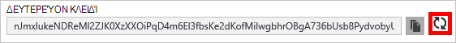

<properties
    pageTitle="Διαχείριση ενός λογαριασμού DocumentDB μέσω της πύλης Azure | Microsoft Azure"
    description="Μάθετε πώς μπορείτε να διαχειριστείτε το λογαριασμό DocumentDB μέσω της πύλης Azure. Δείτε έναν οδηγό σχετικά με τη χρήση της πύλης Azure για να προβάλετε, να αντιγράψετε, να διαγράψετε και πρόσβαση σε λογαριασμούς."
    keywords="Azure πύλη, documentdb, azure, Microsoft azure"
    services="documentdb"
    documentationCenter=""
    authors="kirillg"
    manager="jhubbard"
    editor="cgronlun"/>

<tags
    ms.service="documentdb"
    ms.workload="data-services"
    ms.tgt_pltfrm="na"
    ms.devlang="na"
    ms.topic="article"
    ms.date="10/14/2016"
    ms.author="kirillg"/>

# Πώς μπορείτε να διαχειριστείτε ένα λογαριασμό DocumentDB

Μάθετε πώς μπορείτε να ορίσετε καθολικού συνέπειας, εργασία με αριθμούς-κλειδιά και να διαγράψετε ένα λογαριασμό DocumentDB στην πύλη του Azure.

## Διαχείριση ρυθμίσεων συνέπειας DocumentDB

Επιλέγοντας το επίπεδο δεξιά συνέπειας εξαρτάται από τη σημασιολογία της εφαρμογής σας. Θα πρέπει να εξοικειωθείτε με τα επίπεδα διαθέσιμη συνέπειας στο DocumentDB διαβάζοντας [επίπεδα συνέπειας χρήση για να μεγιστοποιήσετε τη διαθεσιμότητα και απόδοση σε DocumentDB] [consistency]. DocumentDB παρέχει συνέπειας, διαθεσιμότητα και τις εγγυήσεις της απόδοσης, σε κάθε επίπεδο συνέπειας που είναι διαθέσιμες για το λογαριασμό σας βάση δεδομένων. Ρύθμιση παραμέτρων λογαριασμού βάσης δεδομένων με ένα επίπεδο συνέπειας ισχυρές απαιτεί ότι τα δεδομένα σας είναι περιορίζονται σε μία μόνο περιοχή Azure και δεν είναι διαθέσιμη καθολικά. Αντιθέτως, τα επίπεδα χαλαρή συνέπειας - όρια staleness, περίοδο λειτουργίας ή ενδεχόμενη ενεργοποίηση μπορείτε να συσχετίσετε οποιονδήποτε αριθμό Azure περιοχές με το λογαριασμό σας βάση δεδομένων. Τα παρακάτω βήματα απλή εμφάνιση πώς μπορείτε να επιλέξετε το προεπιλεγμένο επίπεδο συνέπειας για το λογαριασμό σας βάση δεδομένων. 

### Για να καθορίσετε τη συνέπεια προεπιλογή για ένα λογαριασμό DocumentDB

1. Στην [πύλη του Azure](https://portal.azure.com/), πρόσβαση στο λογαριασμό σας DocumentDB.
2. Στο blade το λογαριασμό, κάντε κλικ στην επιλογή **προεπιλεγμένο συνέπειας**.
3. Στο η **Προεπιλεγμένη συνέπειας** blade, επιλέξτε το νέο επίπεδο συνέπειας και κάντε κλικ στην επιλογή **Αποθήκευση**.
    ![Προεπιλεγμένη συνέπειας την περίοδο λειτουργίας][5]

## Προβολή και αντιγραφή αναδημιουργήσετε πλήκτρων πρόσβασης
Όταν δημιουργείτε ένα λογαριασμό DocumentDB, η υπηρεσία δημιουργεί δύο πλήκτρα κύρια πρόσβασης που μπορούν να χρησιμοποιηθούν για έλεγχο ταυτότητας, όταν είναι δυνατή η πρόσβαση στο λογαριασμό DocumentDB. Παρέχοντας δύο πλήκτρα πρόσβασης, DocumentDB σάς επιτρέπει να δημιουργήσετε ξανά τα πλήκτρα με καμία διακοπή στο λογαριασμό σας DocumentDB. 

Στην [πύλη του Azure](https://portal.azure.com/), πρόσβαση τα **πλήκτρα** blade από το μενού του blade **DocumentDB λογαριασμό** για να προβάλετε, να αντιγράψετε και να αναδημιουργήσετε τα πλήκτρα πρόσβασης που χρησιμοποιούνται για την πρόσβαση στο λογαριασμό σας DocumentDB πόρων.

> [AZURE.NOTE] Τα **πλήκτρα** blade περιλαμβάνει επίσης συμβολοσειρές κύριας και δευτερεύουσας σύνδεσης που μπορούν να χρησιμοποιηθούν για να συνδεθείτε στο λογαριασμό σας από το [Εργαλείο μετεγκατάστασης δεδομένων](documentdb-import-data.md).

Μόνο για ανάγνωση πλήκτρα είναι επίσης διαθέσιμες στην αυτό blade. Διαβάζει και είναι λειτουργίες μόνο για ανάγνωση, ενώ δημιουργεί, διαγράφει, και δεν είναι αντικαθιστά τα ερωτήματα.

### Αντιγράψτε ένα πλήκτρο πρόσβασης στην πύλη του Azure

Στην blade τα **πλήκτρα** , κάντε κλικ στο κουμπί **Αντιγραφή** δεξιά από τον αριθμό-κλειδί που θέλετε να αντιγράψετε.

### Αναδημιουργήσετε πλήκτρων πρόσβασης

Θα πρέπει να αλλάξετε τα πλήκτρα πρόσβασης στο λογαριασμό σας DocumentDB περιοδικά για να διατηρήσετε τις συνδέσεις σας πιο ασφαλή. Για να διατηρήσετε συνδέσεις με το λογαριασμό DocumentDB, χρησιμοποιώντας ένα πλήκτρο πρόσβασης, ενώ μπορείτε να αναδημιουργήσετε το άλλο πλήκτρο πρόσβασης εκχωρούνται δύο πλήκτρων πρόσβασης.

> [AZURE.WARNING] Αναδημιουργία σας πλήκτρα πρόσβασης επηρεάζει όλες τις εφαρμογές που εξαρτώνται από το τρέχον κλειδί. Όλοι οι πελάτες που χρησιμοποιούν το πλήκτρο πρόσβασης για να αποκτήσετε πρόσβαση στο λογαριασμό DocumentDB πρέπει να ενημερωθούν ώστε να χρησιμοποιούν το νέο κλειδί.

Εάν έχετε εφαρμογές ή τις υπηρεσίες cloud χρησιμοποιώντας το λογαριασμό DocumentDB, θα χάσετε τις συνδέσεις αν αναδημιουργήσετε πλήκτρα, εκτός εάν φέρετε των αριθμών-κλειδιών. Ακολουθήστε τα παρακάτω βήματα περιγράφουν τη διαδικασία που εμπλέκονται στη σάρωση των αριθμών-κλειδιών.

1. Ενημερώστε το πλήκτρο πρόσβασης στον κώδικα της εφαρμογής σας για το πλήκτρο δευτερεύοντα πρόσβασης του λογαριασμού DocumentDB αναφορά.
2. Αναδημιουργήσετε το κλειδί πρωτεύοντος πρόσβασης για το λογαριασμό σας DocumentDB. Στην [Πύλη του Azure](https://portal.azure.com/), πρόσβαση στο λογαριασμό σας DocumentDB.
3. Στο το blade **DocumentDB λογαριασμού** , κάντε κλικ στην επιλογή **πλήκτρα**.
4. Στην blade τα **πλήκτρα** , κάντε κλικ στο κουμπί regenerate και, στη συνέχεια, κάντε κλικ στο κουμπί **Ok** για να επιβεβαιώσετε ότι θέλετε να δημιουργήσετε ένα νέο αριθμό-κλειδί.
    

5. Αφού επαληθεύσετε ότι το νέο κλειδί είναι διαθέσιμη για χρήση (περίπου 5 λεπτά μετά την αναδημιουργία), ενημερώστε το πλήκτρο πρόσβασης στον κώδικα της εφαρμογής σας για το νέο κλειδί πρωτεύοντος access αναφορά.
6. Αναδημιουργήσετε το κλειδί δευτερεύοντα πρόσβασης.

    

> [AZURE.NOTE] Μπορεί να χρειαστούν αρκετά λεπτά πριν από έναν αριθμό-κλειδί που δημιουργήθηκε πρόσφατα μπορεί να χρησιμοποιηθεί για πρόσβαση στο λογαριασμό σας DocumentDB.

## Λάβετε τη συμβολοσειρά σύνδεσης

Για να ανακτήσετε τη συμβολοσειρά σύνδεσης, κάντε τα εξής: 

1. Στην [πύλη του Azure](https://portal.azure.com), πρόσβαση στο λογαριασμό σας DocumentDB.
2. Στο μενού πόρων, κάντε κλικ στην επιλογή **πλήκτρα**.
3. Κάντε κλικ στο κουμπί **Αντιγραφή** δίπλα στο πλαίσιο **Κύρια συμβολοσειρά σύνδεσης** ή **Δευτερεύουσα συμβολοσειρά σύνδεσης** . 

Εάν χρησιμοποιείτε τη συμβολοσειρά σύνδεσης στο [Εργαλείο μετεγκατάστασης DocumentDB βάσης δεδομένων](documentdb-import-data.md), προσαρτήσετε το όνομα της βάσης δεδομένων στο τέλος της συμβολοσειράς σύνδεσης. `AccountEndpoint=< >;AccountKey=< >;Database=< >`.

## Διαγραφή ενός λογαριασμού DocumentDB
Για να καταργήσετε ένα λογαριασμό DocumentDB από την πύλη Azure που χρησιμοποιείτε δεν είναι πλέον, χρησιμοποιήστε την εντολή **Διαγραφή λογαριασμού** στο το blade **DocumentDB λογαριασμού** .

1. Στην [πύλη του Azure](https://portal.azure.com/), αποκτάτε πρόσβαση στο λογαριασμό DocumentDB που θέλετε να διαγράψετε.
2. Στην το blade **DocumentDB λογαριασμού** , κάντε κλικ στην επιλογή **περισσότερα**και, στη συνέχεια, κάντε κλικ στην επιλογή **Διαγραφή λογαριασμού**. Εναλλακτικά, κάντε δεξί κλικ στο όνομα της βάσης δεδομένων και κάντε κλικ στην επιλογή **Διαγραφή λογαριασμού**.
3. Στην την προκύπτουσα blade επιβεβαίωσης, πληκτρολογήστε το όνομα λογαριασμού DocumentDB για να επιβεβαιώσετε ότι θέλετε να διαγράψετε το λογαριασμό.
4. Κάντε κλικ στο κουμπί **Διαγραφή** .

## Επόμενα βήματα

Μάθετε πώς μπορείτε να [ξεκινήσετε με το λογαριασμό σας DocumentDB](http://go.microsoft.com/fwlink/p/?LinkId=402364).

Για να μάθετε περισσότερα σχετικά με το DocumentDB, ανατρέξτε στην τεκμηρίωση Azure DocumentDB στο [azure.com](http://go.microsoft.com/fwlink/?LinkID=402319&clcid=0x409).

<!--Image references-->
[1]: ./media/documentdb-manage-account/documentdb_add_region-1.png
[2]: ./media/documentdb-manage-account/documentdb_add_region-2.png
[3]: ./media/documentdb-manage-account/documentdb_change_write_region-1.png
[4]: ./media/documentdb-manage-account/documentdb_change_write_region-2.png
[5]: ./media/documentdb-manage-account/documentdb_change_consistency-1.png
[6]: ./media/documentdb-manage-account/chooseandsaveconsistency.png

<!--Reference style links - using these makes the source content way more readable than using inline links-->
[bcdr]: https://azure.microsoft.com/documentation/articles/best-practices-availability-paired-regions/
[consistency]: https://azure.microsoft.com/documentation/articles/documentdb-consistency-levels/
[azureregions]: https://azure.microsoft.com/en-us/regions/#services
[offers]: https://azure.microsoft.com/en-us/pricing/details/documentdb/
