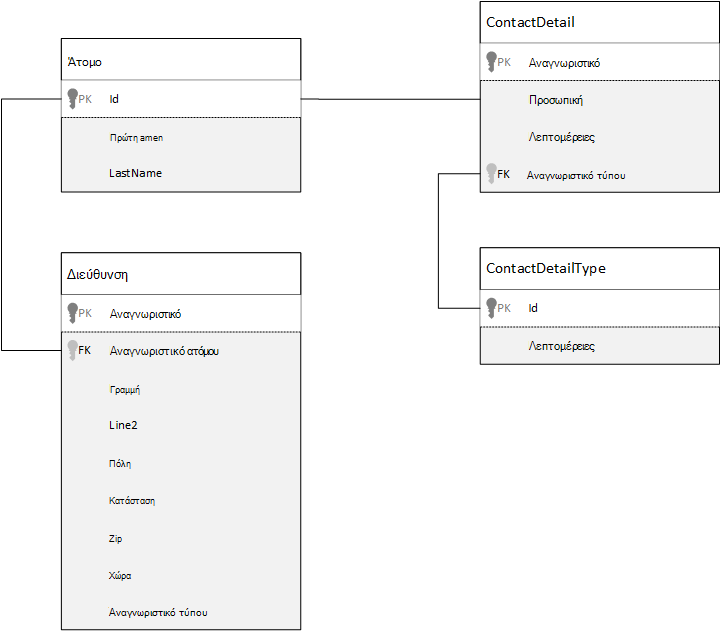
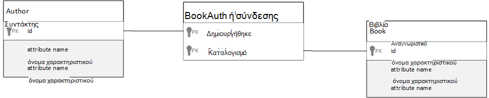

<properties 
    pageTitle="Μοντελοποίηση δεδομένων στο Azure DocumentDB | Microsoft Azure" 
    description="Μάθετε περισσότερα σχετικά με μοντελοποίηση δεδομένων για DocumentDB, μια βάση δεδομένων NoSQL εγγράφου." 
    keywords="μοντελοποίηση δεδομένων"
    services="documentdb" 
    authors="kiratp" 
    manager="jhubbard" 
    editor="mimig1" 
    documentationCenter=""/>

<tags 
    ms.service="documentdb" 
    ms.workload="data-services" 
    ms.tgt_pltfrm="na" 
    ms.devlang="na" 
    ms.topic="article" 
    ms.date="08/05/2016" 
    ms.author="kipandya"/>

#Μοντελοποίηση δεδομένων στο DocumentDB#
Ενώ βάσεις δεδομένων χωρίς σχήματος, όπως το Azure DocumentDB, να είναι super εύκολη η αξιοποίηση αλλαγές στο μοντέλο δεδομένων που θα πρέπει να εξακολουθεί να αφιερώνετε ορισμένες σκέψη χρόνο σχετικά με τα δεδομένα σας. 

Πώς είναι δεδομένων θα αποθηκευτεί; Πώς θα την εφαρμογή σας για να ανακτήσετε και ερωτήματος δεδομένων; Είναι το εφαρμογή χοντρό ανάγνωσης ή εγγραφής έντονη; 

Μετά την ανάγνωση αυτό το άρθρο, θα μπορούν να απαντούν στα παρακάτω ερωτήματα:

- Πώς θα πρέπει να σκεφτείτε ένα έγγραφο σε μια βάση δεδομένων του εγγράφου;
- Τι είναι η μοντελοποίηση δεδομένων και γιατί θα πρέπει να να φροντίσει; 
- Σε τι διαφέρει μοντελοποίηση δεδομένων σε μια βάση δεδομένων του εγγράφου σε μια σχεσιακή βάση δεδομένων;
- Πώς μπορώ να εκφράσετε σχέσεις δεδομένων σε μια μη σχεσιακή βάση δεδομένων;
- Πότε να να ενσωματώσετε δεδομένα και όταν η σύνδεση δεδομένων;

##Ενσωμάτωση δεδομένων##
Κατά την εκκίνηση του μοντελοποίηση δεδομένων στο χώρο αποθήκευσης εγγράφων, όπως DocumentDB, δοκιμάστε να να χειριστείτε τις οντοτήτων ως **αυτόνομη έγγραφα** , που αντιπροσωπεύονται σε JSON.

Πριν μας εμβάθυνση πάρα πολύ περαιτέρω, ενημερώστε μας ανάκτηση μερικά βήματα και έχετε ανατρέξτε στο θέμα Πώς θα σας ενδέχεται να κάτι σε μια σχεσιακή βάση δεδομένων, ένα θέμα πολλούς από εμάς είστε ήδη εξοικειωμένοι με το μοντέλο. Το παρακάτω παράδειγμα εμφανίζει πώς ένα άτομο μπορεί να αποθηκεύονται σε μια σχεσιακή βάση δεδομένων. 

Όταν εργάζεστε με σχεσιακές βάσεις δεδομένων, θα σας έχετε έχουν διδασκόμενες για ετών κανονικοποιηθεί, κανονικοποιηθεί, κανονικοποιηθεί.

Κανονικοποίηση των δεδομένων σας συνήθως περιλαμβάνει διαρκεί μια οντότητα, όπως ένα άτομο, και διακοπή προς τα κάτω σε ξεχωριστά στοιχεία δεδομένων. Στο παραπάνω παράδειγμα, ένα άτομο μπορεί να έχει πολλές εγγραφές λεπτομερειών επαφών, καθώς και πολλές εγγραφές διεύθυνση. Χρησιμοποιούμε ακόμα και περαιτέρω επιστρέψετε στο προηγούμενο βήμα και αναλύστε τις πληροφορίες επικοινωνίας από περαιτέρω την εξαγωγή κοινά πεδία, όπως έναν τύπο. Ίδια διεύθυνση, εδώ κάθε εγγραφή έχει έναν τύπο όπως *οικιακή χρήση* ή για *επιχειρήσεις* 

Το καθοδήγησης εσωτερικής εγκατάστασης όταν κανονικοποίηση των δεδομένων είναι να **αποφεύγετε την αποθήκευση περιττά δεδομένα** σε κάθε εγγραφή και προτιμάτε να χρησιμοποιείτε αναφορές σε δεδομένα. Σε αυτό το παράδειγμα, για να διαβάσετε ένα άτομο, με όλα τα στοιχεία επαφής και τις διευθύνσεις, πρέπει να χρησιμοποιήσετε ΣΎΝΔΕΣΜΟΙ για την αποτελεσματική συγκέντρωση των δεδομένων σας κατά το χρόνο εκτέλεσης.

    SELECT p.FirstName, p.LastName, a.City, cd.Detail
    FROM Person p
    JOIN ContactDetail cd ON cd.PersonId = p.Id
    JOIN ContactDetailType on cdt ON cdt.Id = cd.TypeId
    JOIN Address a ON a.PersonId = p.Id

Ενημέρωση ένα μόνο άτομο με τις πληροφορίες επικοινωνίας και τις διευθύνσεις απαιτεί λειτουργίες εγγραφής σε πολλούς πίνακες μεμονωμένα. 

Τώρα ας δούμε πώς θα σας θα μοντέλου τα ίδια δεδομένα με μια ανεξάρτητη οντότητα σε μια βάση δεδομένων του εγγράφου.
        
    {
        "id": "1",
        "firstName": "Thomas",
        "lastName": "Andersen",
        "addresses": [
            {            
                "line1": "100 Some Street",
                "line2": "Unit 1",
                "city": "Seattle",
                "state": "WA",
                "zip": 98012
            }
        ],
        "contactDetails": [
            {"email: "thomas@andersen.com"},
            {"phone": "+1 555 555-5555", "extension": 5555}
        ] 
    }

Χρησιμοποιώντας την παραπάνω προσέγγιση έχουμε τώρα εγγραφή **μη κανονικά** το άτομο που θα σας **ενσωματωμένου** όλες τις πληροφορίες που σχετίζονται με αυτό το άτομο, όπως τα στοιχεία επαφής και τις διευθύνσεις, σε ένα μεμονωμένο έγγραφο JSON.
Επιπλέον, επειδή θα σας δεν είστε περιορίζεται σε ένα σχήμα σταθερό έχουμε την ευελιξία να κάνετε πράγματα όπως χρειάζεται εντελώς στοιχεία επαφής με διαφορετικά σχήματα. 

Ανάκτηση μιας εγγραφής ολοκλήρωσης άτομο από τη βάση δεδομένων είναι τώρα ένα μόνο ανάγνωση λειτουργίας σε σχέση με μια ενιαία συλλογή και για ένα έγγραφο. Ενημέρωση μιας καρτέλας άτομο, με τις πληροφορίες επικοινωνίας και διευθύνσεις, είναι επίσης μια λειτουργία μόνο εγγραφής σε σχέση με ένα μεμονωμένο έγγραφο.

Με denormalizing δεδομένων, η εφαρμογή σας ίσως χρειαστεί να θεμάτων λιγότερες ερωτήματα και ενημερώσεις για να ολοκληρώσετε κοινές λειτουργίες. 

###Πότε πρέπει να ενσωματώσετε

Γενικά, μπορείτε να χρησιμοποιήσετε ενσωματωμένα δεδομένα μοντέλα όταν:

- Υπάρχουν **περιέχει** σχέσεις μεταξύ οντοτήτων.
- Υπάρχουν **μία σε μερικές** σχέσεις μεταξύ οντοτήτων.
- Υπάρχει δεδομένων που **αλλάζει συχνά**.
- Είναι ενσωματωμένο δεδομένων δεν θα αυξηθεί **χωρίς όριο**.
- Υπάρχει δεδομένων που είναι **αναπόσπαστο** με δεδομένα σε ένα έγγραφο.

> [AZURE.NOTE] Συνήθως μοντέλα δεδομένων μη κανονικά παρέχουν καλύτερη απόδοση **Ανάγνωση** .

###Πότε να μην γίνεται ενσωμάτωση

Ενώ το πρακτικός κανόνας σε μια βάση δεδομένων έγγραφο είναι να denormalize όλα τα στοιχεία και ενσωμάτωση όλα τα δεδομένα σε ένα μεμονωμένο έγγραφο, αυτό μπορεί να οδηγήσει σε ορισμένες περιπτώσεις που θα πρέπει να αποφεύγονται.

Λαμβάνουν αυτήν JSON τμήματος κώδικα.

    {
        "id": "1",
        "name": "What's new in the coolest Cloud",
        "summary": "A blog post by someone real famous",
        "comments": [
            {"id": 1, "author": "anon", "comment": "something useful, I'm sure"},
            {"id": 2, "author": "bob", "comment": "wisdom from the interwebs"},
            …
            {"id": 100001, "author": "jane", "comment": "and on we go ..."},
            …
            {"id": 1000000001, "author": "angry", "comment": "blah angry blah angry"},
            …
            {"id": ∞ + 1, "author": "bored", "comment": "oh man, will this ever end?"},
        ]
    }

Αυτό μπορεί να είναι μια καταχώρηση οντότητα με ενσωματωμένα σχόλια εμφάνισης Εάν σας μοντελοποίησης ένα τυπικό ιστολόγιο ή CMS, συστήματος. Το πρόβλημα με αυτό το παράδειγμα είναι ότι ο πίνακας σχολίων είναι **χωρίς σύνδεση**, γεγονός που σημαίνει ότι δεν υπάρχει (πρακτικές) όριο στον αριθμό των σχολίων που μπορούν να έχουν οποιοδήποτε μεμονωμένο δημοσίευση. Αυτό θα μετατραπεί σε ένα πρόβλημα με το μέγεθος του εγγράφου θα μπορούσε να αναπτυχθούν σημαντικά.

> [AZURE.TIP] Τα έγγραφα στο DocumentDB έχουν μέγιστο μέγεθος. Για περισσότερες πληροφορίες σχετικά με αυτό ανατρέξτε [DocumentDB όρια](documentdb-limits.md).

Καθώς το μέγεθος του εγγράφου εξελίσσεται η δυνατότητα για τη μετάδοση δεδομένων μέσω του σύρματος, καθώς και την ανάγνωση και ενημέρωση του εγγράφου, σε κλίμακα, θα να επηρεαστούν.

Σε αυτήν την περίπτωση θα ήταν καλύτερη πρέπει να λάβετε υπόψη το εξής μοντέλο.
        
    Post document:
    {
        "id": "1",
        "name": "What's new in the coolest Cloud",
        "summary": "A blog post by someone real famous",
        "recentComments": [
            {"id": 1, "author": "anon", "comment": "something useful, I'm sure"},
            {"id": 2, "author": "bob", "comment": "wisdom from the interwebs"},
            {"id": 3, "author": "jane", "comment": "....."}
        ]
    }

    Comment documents:
    {
        "postId": "1"
        "comments": [
            {"id": 4, "author": "anon", "comment": "more goodness"},
            {"id": 5, "author": "bob", "comment": "tails from the field"},
            ...
            {"id": 99, "author": "angry", "comment": "blah angry blah angry"}
        ]
    },
    {
        "postId": "1"
        "comments": [
            {"id": 100, "author": "anon", "comment": "yet more"},
            ...
            {"id": 199, "author": "bored", "comment": "will this ever end?"}
        ]
    }

Αυτό το μοντέλο παρουσιάζει τις πιο πρόσφατες τρεις σχόλια ενσωματωμένο στην την καταχώρηση μόνη της, που είναι ένας πίνακας με ένα σταθερό δεσμευμένο αυτήν τη στιγμή. Τα άλλα σχόλια είναι ομαδοποιημένα σε σε δέσμες με 100 σχόλια και να είναι αποθηκευμένα σε ξεχωριστά έγγραφα. Το μέγεθος της δέσμης επιλέχθηκε ως 100 επειδή μας φανταστικά εφαρμογής επιτρέπει στο χρήστη να φορτώσετε 100 σχόλια κάθε φορά.  

Άλλη περίπτωση όπου ενσωμάτωση δεδομένων δεν είναι μια καλή ιδέα είναι όταν ενσωματωμένα δεδομένα που χρησιμοποιούνται συχνά σε έγγραφα και θα αλλάζουν συχνά. 

Λαμβάνουν αυτήν JSON τμήματος κώδικα.

    {
        "id": "1",
        "firstName": "Thomas",
        "lastName": "Andersen",
        "holdings": [
            {
                "numberHeld": 100,
                "stock": { "symbol": "zaza", "open": 1, "high": 2, "low": 0.5 }
            },
            {
                "numberHeld": 50,
                "stock": { "symbol": "xcxc", "open": 89, "high": 93.24, "low": 88.87 }
            }
        ]
    }

Αυτό μπορεί να αντιπροσωπεύει χαρτοφυλακίου μετοχών ενός ατόμου. Θα σας έχει επιλέξει να ενσωματώσετε το μετοχών πληροφορίες σε κάθε έγγραφο χαρτοφυλακίου. Σε ένα περιβάλλον όπου σχετικά δεδομένα αλλάζουν συχνά, όπως μια δεσμίδα trading εφαρμογής, ενσωμάτωση δεδομένων που αλλάζουν συχνά πρόκειται να σημαίνει ότι θέλετε να ενημερώσετε κάθε έγγραφο χαρτοφυλακίου συνεχώς κάθε φορά που παραδίδεται μια μετοχών.

Μετοχών *zaza* εκατοντάδες πολλές φορές σε μία ημέρα καθώς και χιλιάδες χρήστες θα μπορούσε να έχει *zaza* σε χαρτοφυλάκιο τους. Με ένα μοντέλο δεδομένων, όπως τα παραπάνω θα σας θα πρέπει να ενημερώσετε πολλά χιλιάδες έγγραφα χαρτοφυλακίου πολλές φορές καθημερινά οδηγεί σε ένα σύστημα που δεν θα κλίμακα πολύ καλά. 

##Αναφορά σε δεδομένα##

Επομένως, ενσωμάτωση δεδομένων λειτουργίας όμορφα για πολλές περιπτώσεις, αλλά είναι σαφές ότι δεν υπάρχουν σενάρια όταν denormalizing τα δεδομένα σας θα προκαλέσει προβλήματα περισσότερες από αξίζει. Επομένως, τι θα σας να κάνω τώρα; 

Σχεσιακές βάσεις δεδομένων δεν είναι το μόνο σημείο όπου μπορείτε να δημιουργήσετε σχέσεις μεταξύ οντοτήτων. Σε μια βάση δεδομένων του εγγράφου, μπορείτε να έχετε πληροφορίες σε ένα έγγραφο το οποίο στην πραγματικότητα σχετίζεται με δεδομένα σε άλλα έγγραφα. Τώρα, να δεν advocating ακόμα ένα λεπτό που μπορέσουμε να δημιουργήσουμε συστήματα που θα είναι πιο κατάλληλα σχεσιακή βάση δεδομένων σε DocumentDB ή οποιαδήποτε άλλη βάση δεδομένων έγγραφο, αλλά απλό σχέσεις είναι λεπτομερές και μπορεί να είναι πολύ χρήσιμο. 

Το παρακάτω JSON επιλέγουμε για να χρησιμοποιήσετε το παράδειγμα μετοχών χαρτοφυλακίου από προηγούμενη έκδοση, αλλά αυτήν τη φορά αναφέρονται στο μετοχών στοιχείο του χαρτοφυλακίου αντί για την ενσωμάτωση του. Με αυτόν τον τρόπο, όταν αλλάζει το στοιχείο μετοχών συχνά όλη την ημέρα το έγγραφο μόνο που πρέπει να ενημερωθούν είναι το μεμονωμένο έγγραφο μετοχών. 

    Person document:
    {
        "id": "1",
        "firstName": "Thomas",
        "lastName": "Andersen",
        "holdings": [
            { "numberHeld":  100, "stockId": 1},
            { "numberHeld":  50, "stockId": 2}
        ]
    }
    
    Stock documents:
    {
        "id": "1",
        "symbol": "zaza",
        "open": 1,
        "high": 2,
        "low": 0.5,
        "vol": 11970000,
        "mkt-cap": 42000000,
        "pe": 5.89
    },
    {
        "id": "2",
        "symbol": "xcxc",
        "open": 89,
        "high": 93.24,
        "low": 88.87,
        "vol": 2970200,
        "mkt-cap": 1005000,
        "pe": 75.82
    }
    

Μια άμεση μειονέκτημα αυτής της προσέγγισης είναι μέσω εάν απαιτείται η εφαρμογή σας για να εμφανίσετε πληροφορίες σχετικά με κάθε απόθεμα που είναι που θα διατηρούνται κατά την εμφάνιση ενός ατόμου χαρτοφυλάκιο. σε αυτήν την περίπτωση που χρειάζεστε για να κάνετε πολλά ταξίδια στη βάση δεδομένων για τη φόρτωση των στοιχείων για κάθε έγγραφο μετοχών. Εδώ έχουμε κάνει απόφαση για τη βελτίωση της αποτελεσματικότητας των λειτουργιών εγγραφής, η οποία συμβεί συχνά όλη την ημέρα, αλλά με τη σειρά έχει παραβιαστεί σε τις λειτουργίες ανάγνωσης που ενδεχομένως έχουν λιγότερο επιπτώσεις στις επιδόσεις αυτού του συστήματος.

> [AZURE.NOTE] Κανονικοποίηση δεδομένων μοντέλα **να απαιτήσετε περισσότερες μεταβάσεις** στο διακομιστή.

### Τι γίνεται με ξένα κλειδιά;
Επειδή δεν υπάρχει αυτήν τη στιγμή δεν υπάρχει έννοια της περιορισμού, εξωτερικού κλειδιού ή άλλη, όλες οι σχέσεις μεταξύ εγγράφου που έχετε σε έγγραφα είναι αποτελεσματική "αδύναμους συνδέσεις" και δεν θα επαληθεύονται από την ίδια τη βάση δεδομένων. Εάν θέλετε να βεβαιωθείτε ότι τα δεδομένα αναφορά όντως υπάρχει ένα έγγραφο, στη συνέχεια, πρέπει να το κάνετε αυτό στην εφαρμογή σας, ή μέσω διακομιστή εναύσματα αποθηκευμένων διαδικασιών σε DocumentDB.

###Πότε πρέπει να αναφέρονται
Σε γενικές γραμμές, χρήση κανονικοποιημένη δεδομένων μοντέλα όταν:

- Σχέσεις που αντιπροσωπεύουν **ένα-προς-πολλά** .
- Σχέσεις που αντιπροσωπεύουν **πολλά-προς-πολλά** .
- Που σχετίζονται με δεδομένα **αλλάζουν συχνά**.
- Δεδομένα αναφοράς θα μπορούσε να είναι **χωρίς σύνδεση**.

> [AZURE.NOTE] Κανονικοποίηση συνήθως παρέχει καλύτερες επιδόσεις **εγγραφής** .

###Πού μπορώ να τοποθετήσει τη σχέση;
Την ανάπτυξη της σχέσης θα σας βοηθήσουν να καθορίσετε σε ποιο έγγραφο για να αποθηκεύσετε την αναφορά.

Αν κοιτάξουμε στον παρακάτω JSON που μοντέλα εκδότες και βιβλία.

    Publisher document:
    {
        "id": "mspress",
        "name": "Microsoft Press",
        "books": [ 1, 2, 3, ..., 100, ..., 1000]
    }

    Book documents:
    {"id": "1", "name": "DocumentDB 101" }
    {"id": "2", "name": "DocumentDB for RDBMS Users" }
    {"id": "3", "name": "Taking over the world one JSON doc at a time" }
    ...
    {"id": "100", "name": "Learn about Azure DocumentDB" }
    ...
    {"id": "1000", "name": "Deep Dive in to DocumentDB" }

Εάν ο αριθμός των τα βιβλία ανά publisher είναι μικρό με περιορισμένη growth, στη συνέχεια, την αποθήκευση την αναφορά βιβλίο μέσα στο έγγραφο publisher ίσως είναι χρήσιμο. Ωστόσο, εάν ο αριθμός των βιβλίων ανά publisher είναι χωρίς σύνδεση, στη συνέχεια, αυτό το μοντέλο δεδομένων θα οδηγήσει σε μεταβλητά, αυξανόμενη πίνακες, όπως στο παραπάνω παράδειγμα publisher έγγραφο. 

Αλλαγή πράγματα γύρω από ένα bit θα έχει ως αποτέλεσμα σε μοντέλο που εξακολουθεί να αντιπροσωπεύει τα ίδια δεδομένα, αλλά τώρα αποφεύγεται αυτά τα μεγάλα μεταβλητά συλλογών.

    Publisher document: 
    {
        "id": "mspress",
        "name": "Microsoft Press"
    }
    
    Book documents: 
    {"id": "1","name": "DocumentDB 101", "pub-id": "mspress"}
    {"id": "2","name": "DocumentDB for RDBMS Users", "pub-id": "mspress"}
    {"id": "3","name": "Taking over the world one JSON doc at a time"}
    ...
    {"id": "100","name": "Learn about Azure DocumentDB", "pub-id": "mspress"}
    ...
    {"id": "1000","name": "Deep Dive in to DocumentDB", "pub-id": "mspress"}

Στο παραπάνω παράδειγμα, θα σας έχουν αποτεθεί στη συλλογή χωρίς σύνδεση στο έγγραφο publisher. Αντί για αυτό έχουμε απλώς μια αναφορά για τον εκδότη σε κάθε έγγραφο βιβλίου.

###Πώς να του μοντέλου σχέσεις πολλά: πολλά;
Σε μια σχεσιακή βάση δεδομένων σχέσεις *πολλά: πολλά* μοντελοποιούνται συχνά με συμμετοχή σε πίνακες, οι οποίοι απλώς ένωση εγγραφές από άλλους πίνακες. 

Ίσως έχετε την τάση για να αναπαραγάγετε το ίδιο χρήση εγγράφων και να παραγάγετε ένα μοντέλο δεδομένων που μοιάζει με το εξής.

    Author documents: 
    {"id": "a1", "name": "Thomas Andersen" }
    {"id": "a2", "name": "William Wakefield" }
    
    Book documents:
    {"id": "b1", "name": "DocumentDB 101" }
    {"id": "b2", "name": "DocumentDB for RDBMS Users" }
    {"id": "b3", "name": "Taking over the world one JSON doc at a time" }
    {"id": "b4", "name": "Learn about Azure DocumentDB" }
    {"id": "b5", "name": "Deep Dive in to DocumentDB" }
    
    Joining documents: 
    {"authorId": "a1", "bookId": "b1" }
    {"authorId": "a2", "bookId": "b1" }
    {"authorId": "a1", "bookId": "b2" }
    {"authorId": "a1", "bookId": "b3" }

Αυτό θα λειτουργεί. Ωστόσο, κατά τη φόρτωση είτε ο συντάκτης με τους βιβλία ή τη φόρτωση ενός βιβλίου με το συντάκτη, πάντα απαιτείται τουλάχιστον δύο επιπλέον ερωτημάτων με τη βάση δεδομένων. Ένα ερώτημα στο έγγραφο σύνδεσης και, στη συνέχεια, ένα άλλο ερώτημα για τη λήψη του πραγματικού εγγράφου που συνενώνονται. 

Εάν όλα κάνει αυτός ο πίνακας σύνδεσμος επικόλλησή μαζί δύο στοιχεία δεδομένων, στη συνέχεια, γιατί δεν αποθέστε το εντελώς;
Λάβετε υπόψη τα εξής.

    Author documents:
    {"id": "a1", "name": "Thomas Andersen", "books": ["b1, "b2", "b3"]}
    {"id": "a2", "name": "William Wakefield", "books": ["b1", "b4"]}
    
    Book documents: 
    {"id": "b1", "name": "DocumentDB 101", "authors": ["a1", "a2"]}
    {"id": "b2", "name": "DocumentDB for RDBMS Users", "authors": ["a1"]}
    {"id": "b3", "name": "Learn about Azure DocumentDB", "authors": ["a1"]}
    {"id": "b4", "name": "Deep Dive in to DocumentDB", "authors": ["a2"]}

Τώρα, εάν που είχε ο συντάκτης, να αμέσως γνωρίζω ποια βιβλία που τους έχετε γράψει και αντίστροφα εάν που είχε φορτωθεί βιβλίο εγγράφου θα ξέρω τα αναγνωριστικά των το συγγραφέα. Αυτό αποθηκεύει το ενδιάμεσες ερώτημα σε σχέση με τη συμμετοχή σε πίνακα τη μείωση ταξίδια περιλαμβάνει την εφαρμογή σας για να κάνετε στρογγυλοποίηση τον αριθμό του διακομιστή. 

##Υβριδική μοντέλα δεδομένων##
Θα σας τώρα έχετε αναζητήσει ενσωμάτωση (ή denormalizing) και αναφορά σε δεδομένων (ή κανονικοποίηση), κάθε τους upsides και κάθε έχετε παραχωρήσεων όπως θα σας έχουν φαίνεται. 

Δεν πρέπει πάντα να είναι είτε ή, δεν είναι Τρομαγμένη για να δημιουργήσετε πράγματα λίγο προς τα επάνω. 

Με βάση τα μοτίβα συγκεκριμένες χρήσης και φόρτους εργασίας ενδέχεται να υπάρχουν περιπτώσεις όπου ανάμιξη ενσωματωμένες της εφαρμογής σας και δεδομένα αναφοράς έχει νόημα και θα μπορούσε να υποψήφιου πελάτη σε απλούστερο λογική εφαρμογής με λιγότερες διακομιστή στρογγυλοποίηση ταξίδια διατηρώντας παράλληλα επιπέδου καλές επιδόσεις του.

Λάβετε υπόψη τα παρακάτω JSON. 

    Author documents: 
    {
        "id": "a1",
        "firstName": "Thomas",
        "lastName": "Andersen",     
        "countOfBooks": 3,
        "books": ["b1", "b2", "b3"],
        "images": [
            {"thumbnail": "http://....png"}
            {"profile": "http://....png"}
            {"large": "http://....png"}
        ]
    },
    {
        "id": "a2",
        "firstName": "William",
        "lastName": "Wakefield",
        "countOfBooks": 1,
        "books": ["b1"],
        "images": [
            {"thumbnail": "http://....png"}
        ]
    }
    
    Book documents:
    {
        "id": "b1",
        "name": "DocumentDB 101",
        "authors": [
            {"id": "a1", "name": "Thomas Andersen", "thumbnailUrl": "http://....png"},
            {"id": "a2", "name": "William Wakefield", "thumbnailUrl": "http://....png"}
        ]
    },
    {
        "id": "b2",
        "name": "DocumentDB for RDBMS Users",
        "authors": [
            {"id": "a1", "name": "Thomas Andersen", "thumbnailUrl": "http://....png"},
        ]
    }

Εδώ θα σας (κυρίως) ακολουθήσατε ενσωματωμένο μοντέλο, όπου τα δεδομένα από άλλα οντοτήτων είναι ενσωματωμένες στο έγγραφο ανώτατου επιπέδου, αλλά άλλα δεδομένα τα οποία γίνεται αναφορά. 

Αν κοιτάξετε το έγγραφο βιβλίου, μπορούμε να δούμε μερικά ενδιαφέρον πεδία όταν εξετάσουμε έναν πίνακα συντακτών. Υπάρχει ένα πεδίο " *αναγνωριστικό* " που βρίσκεται στο πεδίο που χρησιμοποιούμε για να παραπέμπουν σε ένα έγγραφο του συντάκτη, τυπική πρακτική σε ένα μοντέλο κανονικοποιημένη, αλλά στη συνέχεια επίσης έχουμε *όνομα* και *thumbnailUrl*. Χρησιμοποιούμε μπορεί να έχετε μόνο με το *αναγνωριστικό* που έχει κολλήσει και προς τα αριστερά της εφαρμογής για να λάβετε τυχόν πρόσθετες πληροφορίες αυτό απαιτείται από το έγγραφο αντίστοιχα συντάκτη χρησιμοποιώντας τη "σύνδεση", αλλά επειδή μας εφαρμογή εμφανίζει το όνομα του συντάκτη και μια εικόνα μικρογραφίας με κάθε βιβλίο εμφανίζεται μπορούμε να αποθηκεύσουμε ένα χρόνο αποστολής και επιστροφής στο διακομιστή ανά βιβλίο σε μια λίστα με denormalizing **ορισμένα** δεδομένα από το συντάκτη.

Βεβαιωθείτε ότι, αν αλλάξει το όνομα του συντάκτη ή που θέλει να ενημερώσετε τη φωτογραφία σας θα πρέπει να ακολουθήσετε μια ενημέρωση κάθε βιβλίο τους ποτέ δημοσιευτεί αλλά για την εφαρμογή μας, βασίζονται στην υπόθεση ότι οι συντάκτες δεν αλλάζει τα ονόματά τους πολύ συχνά, αυτή είναι μια αποδεκτή σχεδίαση απόφασης.  

Στο παράδειγμα που υπάρχουν τιμές **υπολογίζονται εκ των προτέρων συγκεντρώσεις** για να αποθηκεύσετε ακριβό επεξεργασίας σε μια λειτουργία ανάγνωσης. Στο παράδειγμα, ορισμένα από τα δεδομένα που είναι ενσωματωμένο στο έγγραφο συντάκτης είναι τα δεδομένα που υπολογίζεται κατά το χρόνο εκτέλεσης. Κάθε φορά που ένα νέο βιβλίο, δημιουργείται ένα έγγραφο βιβλίο **και** το πεδίο countOfBooks έχει οριστεί σε μια υπολογιζόμενη τιμή με βάση τον αριθμό των εγγράφων βιβλίου που υπάρχουν για ένα συγκεκριμένο συντάκτη. Αυτή η βελτιστοποίηση θα ήταν καλά στην ανάγνωση έντονη συστήματα όπου θα σας μπορεί να πρέπει να κάνετε υπολογισμούς σε εγγραφές για να βελτιστοποιήσετε διαβάζει.

Η δυνατότητα να έχει ένα μοντέλο με προ-υπολογιζόμενα πεδία γίνεται πιθανές επειδή DocumentDB υποστηρίζει **συναλλαγές πολλαπλών εγγράφων**. Πολλά καταστήματα NoSQL δεν μπορεί να το κάνετε συναλλαγές σε έγγραφα και, επομένως, Βοηθό αποφάσεις σχεδιασμού, όπως "πάντα ενσωμάτωση όλα τα στοιχεία", λόγω αυτόν τον περιορισμό. Με DocumentDB, μπορείτε να χρησιμοποιήσετε εναύσματα πλευρά του διακομιστή ή αποθηκευμένες διαδικασίες, που εισαγάγετε βιβλία και να ενημερώσετε τους συντάκτες όλα αυτά μέσα σε μια συναλλαγή ΟΞΈΟΣ. Τώρα που δεν **πρέπει** να ενσωματώσετε τα πάντα σε ένα έγγραφο, απλώς για να βεβαιωθείτε ότι τα δεδομένα παραμένουν συνεπή.

##Επόμενα βήματα

Είναι το μεγαλύτερων takeaways από αυτό το άρθρο για να κατανοήσετε ότι μοντελοποίηση δεδομένων στο στον κόσμο χωρίς σχήματος είναι εξίσου σημαντικό όπως και στο παρελθόν. 

Όπως ακριβώς δεν υπάρχει μόνο τρόπος για να αντιπροσωπεύει ένα τμήμα των δεδομένων σε μια οθόνη, δεν υπάρχει τρόπος μόνο μοντέλο δεδομένων σας. Που χρειάζεστε για να κατανοήσετε την εφαρμογή και τον τρόπο αυτό θα δημιουργήσουν, εκμετάλλευση και να επεξεργάζονται τα δεδομένα. Στη συνέχεια, εφαρμόζοντας ορισμένες από τις οδηγίες που δίνονται Εδώ μπορείτε να ορίσετε σχετικά με τη δημιουργία ενός μοντέλου που αντιμετωπίζει το άμεσες ανάγκες της εφαρμογής σας. Όταν χρειάζεστε τις εφαρμογές σας για να αλλάξετε, μπορείτε να αξιοποιήσετε την ευελιξία χωρίς σχήματος βάσης δεδομένων σε υιοθέτηση που αλλάζουν και εξελίσσονται εύκολα του μοντέλου δεδομένων. 

Για να μάθετε περισσότερα σχετικά με το Azure DocumentDB, ανατρέξτε στη σελίδα [τεκμηρίωση για](https://azure.microsoft.com/documentation/services/documentdb/) την υπηρεσία. 

Για να μάθετε πληροφορίες για τα ευρετήρια ρύθμισης στο Azure DocumentDB, ανατρέξτε στο άρθρο στη [Δημιουργία ευρετηρίου πολιτικές](documentdb-indexing-policies.md).

Για να κατανοήσετε τον τρόπο για να shard τα δεδομένα σας σε περισσότερα από ένα διαμερίσματα, ανατρέξτε στις [Διαμερισμάτων δεδομένων σε DocumentDB](documentdb-partition-data.md). 

Και, τέλος, για οδηγίες σχετικά με μοντελοποίηση δεδομένων και sharding για εφαρμογές πολλών μισθωτών, συμβουλευτείτε [κλίμακας μια εφαρμογή πολλών μισθωτή με Azure DocumentDB](http://blogs.msdn.com/b/documentdb/archive/2014/12/03/scaling-a-multi-tenant-application-with-azure-documentdb.aspx).
 
