<properties 
    pageTitle="Χρήση MongoChef με ένα λογαριασμό DocumentDB με πρωτόκολλο υποστήριξη για MongoDB | Microsoft Azure" 
    description="Μάθετε πώς μπορείτε να χρησιμοποιήσετε MongoChef με ένα λογαριασμό DocumentDB με πρωτόκολλο υποστήριξη για MongoDB, τώρα διαθέσιμη για προεπισκόπηση." 
    keywords="mongochef"
    services="documentdb" 
    authors="AndrewHoh" 
    manager="jhubbard" 
    editor="" 
    documentationCenter=""/>

<tags 
    ms.service="documentdb" 
    ms.workload="data-services" 
    ms.tgt_pltfrm="na" 
    ms.devlang="na" 
    ms.topic="article" 
    ms.date="08/25/2016" 
    ms.author="anhoh"/>

# Χρήση MongoChef με ένα λογαριασμό DocumentDB με πρωτόκολλο υποστήριξη για MongoDB

Για να συνδεθείτε με ένα λογαριασμό Azure DocumentDB με πρωτόκολλο υποστήριξη για χρήση MongoChef MongoDB, πρέπει:

- Λήψη και εγκατάσταση του [MongoChef](http://3t.io/mongochef)
- Έχετε το λογαριασμό σας DocumentDB με την υποστήριξη πρωτόκολλο για MongoDB πληροφορίες [συμβολοσειρά σύνδεσης](documentdb-connect-mongodb-account.md)

## Δημιουργία της σύνδεσης στο MongoChef  

Για να προσθέσετε το λογαριασμό σας DocumentDB με πρωτόκολλο υποστήριξη για MongoDB στη Διαχείριση σύνδεσης MongoChef, ακολουθήστε τα παρακάτω βήματα.

1. Ανάκτηση σας DocumentDB με πρωτόκολλο υποστήριξη για MongoDB πληροφοριών σύνδεσης με τις οδηγίες [εδώ](documentdb-connect-mongodb-account.md).

    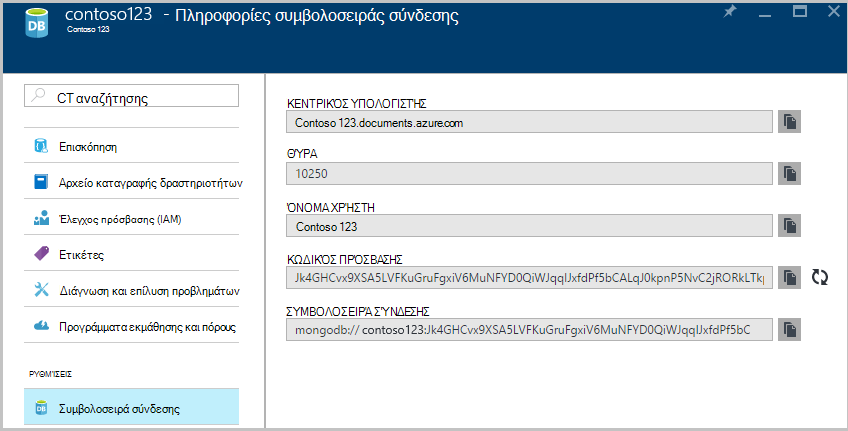

2. Κάντε κλικ στην επιλογή **σύνδεση** για να ανοίξετε τη Διαχείριση σύνδεσης και, στη συνέχεια, κάντε κλικ στην επιλογή **Νέα σύνδεση**

    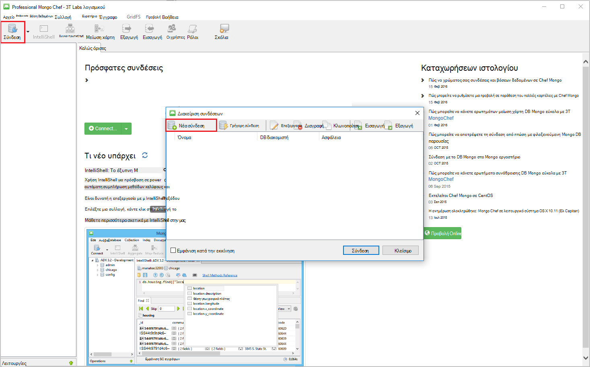
    
2. Στο παράθυρο **Νέας σύνδεσης** , στην καρτέλα **διακομιστή** , εισαγάγετε το HOST (FQDN) του λογαριασμού DocumentDB με πρωτόκολλο υποστήριξη για MongoDB και τη ΘΎΡΑ.
    
    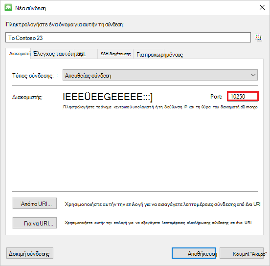

3. Στο παράθυρο **Νέας σύνδεσης** , στην καρτέλα **Έλεγχος ταυτότητας** , επιλέξτε λειτουργία ελέγχου ταυτότητας **Τυπική (MONGODB CR ή SCARM-SHA-1)** και πληκτρολογήστε το όνομα ΧΡΉΣΤΗ και τον κωδικό ΠΡΌΣΒΑΣΗΣ.  Αποδεχτείτε το προεπιλεγμένο db ελέγχου ταυτότητας (διαχειριστές) ή πληκτρολογήστε τη δική σας τιμή.

    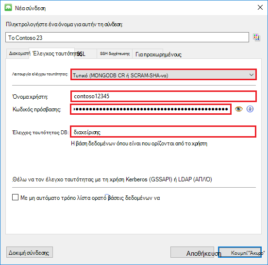

4. Στο παράθυρο **Νέας σύνδεσης** , στην καρτέλα **SSL** , επιλέξτε το πλαίσιο ελέγχου **χρήση SSL πρωτόκολλο για να συνδεθείτε** και το κουμπί επιλογής **Αποδοχή αυτο-υπογεγραμμένο πιστοποιητικά SSL** .

    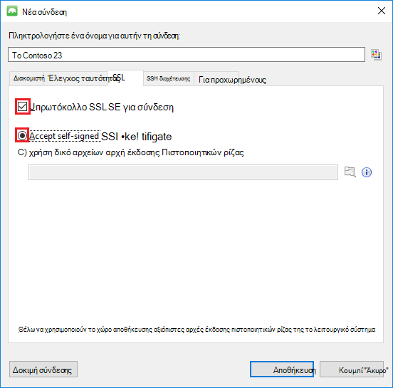

5. Κάντε κλικ στο κουμπί **Έλεγχος σύνδεσης** για να επικυρώσετε τις πληροφορίες σύνδεσης, κάντε κλικ στο **κουμπί OK** για να επιστρέψετε στο παράθυρο νέας σύνδεσης και, στη συνέχεια, κάντε κλικ στην επιλογή **Αποθήκευση**.

    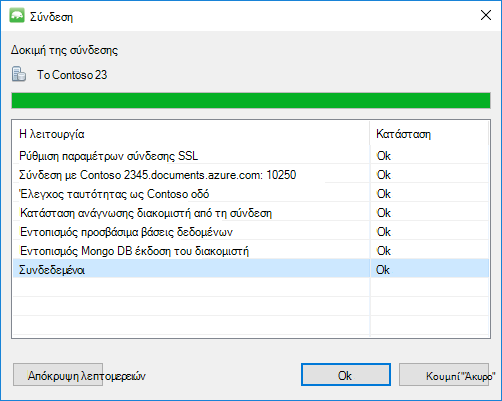

## Χρήση MongoChef για τη δημιουργία μιας βάσης δεδομένων, τη συλλογή και έγγραφα  

Για να δημιουργήσετε μια βάση δεδομένων, συλλογή και έγγραφα χρησιμοποιώντας MongoChef, ακολουθήστε τα παρακάτω βήματα.

1. Στη **Διαχείριση σύνδεσης**, επισημάνετε τη σύνδεση και κάντε κλικ στην επιλογή **σύνδεση**.

    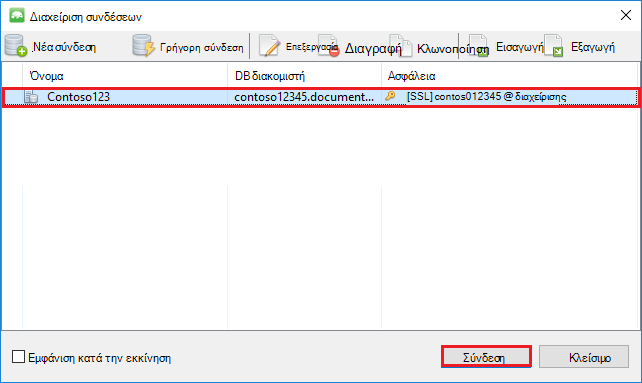

2. Κάντε δεξί κλικ στον κεντρικό υπολογιστή και επιλέξτε **Προσθήκη βάσης δεδομένων**.  Δώστε ένα όνομα βάσης δεδομένων και κάντε κλικ στο **κουμπί OK**.
    
    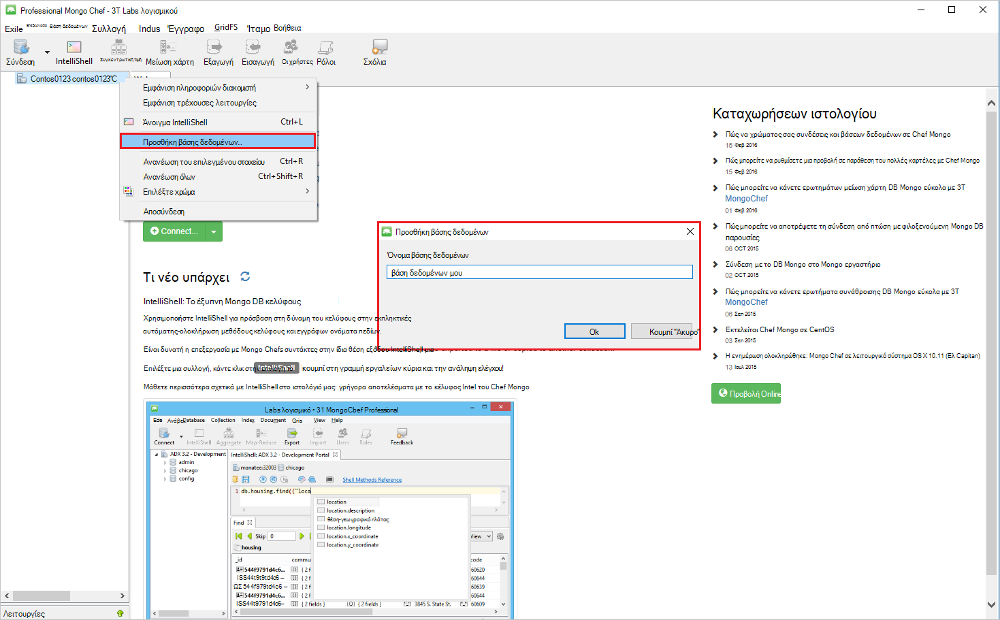

3. Κάντε δεξί κλικ στη βάση δεδομένων και επιλέξτε **Προσθήκη συλλογής**.  Δώστε ένα όνομα συλλογής και κάντε κλικ στην επιλογή **Δημιουργία**.

    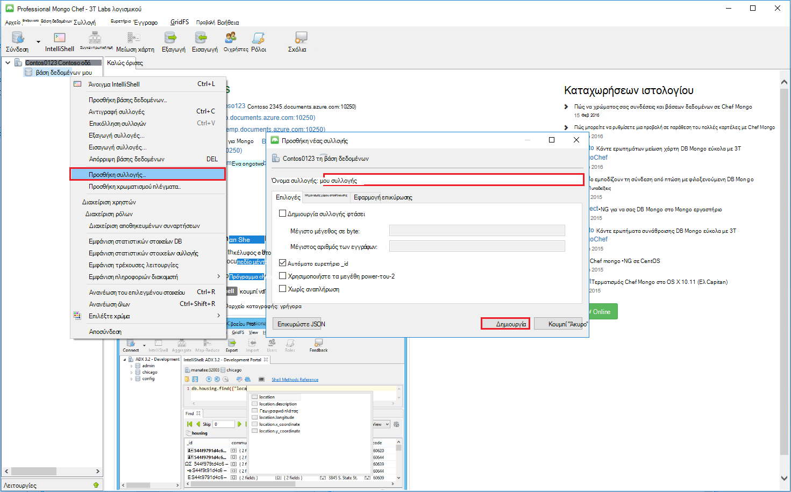

4. Κάντε κλικ στο στοιχείο μενού **συλλογής** και, στη συνέχεια, κάντε κλικ στην επιλογή **Προσθήκη εγγράφου**.

    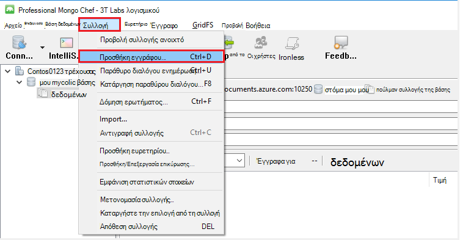

5. Στο παράθυρο διαλόγου Προσθήκη εγγράφου, επικολλήστε την παρακάτω και, στη συνέχεια, κάντε κλικ στην επιλογή **Προσθήκη εγγράφου**.

        {
        "_id": "AndersenFamily",
        "lastName": "Andersen",
        "parents": [
            { "firstName": "Thomas" },
            { "firstName": "Mary Kay"}
        ],
        "children": [
        {
            "firstName": "Henriette Thaulow", "gender": "female", "grade": 5,
            "pets": [{ "givenName": "Fluffy" }]
        }
        ],
        "address": { "state": "WA", "county": "King", "city": "seattle" },
        "isRegistered": true
        }

    
6. Προσθέστε ένα άλλο έγγραφο, αυτήν τη στιγμή με το παρακάτω περιεχόμενο.

        {
        "_id": "WakefieldFamily",
        "parents": [
            { "familyName": "Wakefield", "givenName": "Robin" },
            { "familyName": "Miller", "givenName": "Ben" }
        ],
        "children": [
            {
                "familyName": "Merriam", 
                "givenName": "Jesse", 
                "gender": "female", "grade": 1,
                "pets": [
                    { "givenName": "Goofy" },
                    { "givenName": "Shadow" }
                ]
            },
            { 
                "familyName": "Miller", 
                "givenName": "Lisa", 
                "gender": "female", 
                "grade": 8 }
        ],
        "address": { "state": "NY", "county": "Manhattan", "city": "NY" },
        "isRegistered": false
        }

7. Εκτέλεση ενός ερωτήματος δείγμα. Για παράδειγμα, αναζήτηση για οικογένειες με το τελευταίο όνομα 'Andersen' και να επιστρέψετε το γονικά και τα πεδία κατάσταση.

    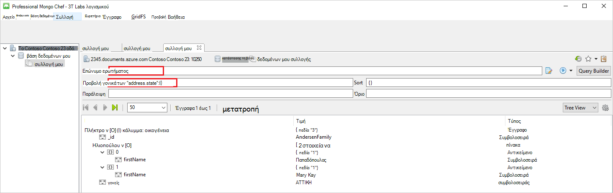
    

## Επόμενα βήματα

- Εξερευνήστε DocumentDB με πρωτόκολλο υποστήριξη για MongoDB [δείγματα](documentdb-mongodb-samples.md).

 
