<properties
    pageTitle="Παρακολούθηση προσκλήσεων DocumentDB και αποθήκευσης | Microsoft Azure"
    description="Μάθετε πώς μπορείτε να παρακολουθείτε το λογαριασμό σας DocumentDB για μετρικών απόδοσης, όπως αιτήσεις και σφάλματα διακομιστή, και μετρήσεις χρήσης, όπως κατανάλωση χώρου αποθήκευσης."
    services="documentdb"
    documentationCenter=""
    authors="mimig1"
    manager="jhubbard"
    editor="cgronlun"/>

<tags
    ms.service="documentdb"
    ms.workload="data-services"
    ms.tgt_pltfrm="na"
    ms.devlang="na"
    ms.topic="article"
    ms.date="10/17/2016"
    ms.author="mimig"/>

# Παρακολούθηση προσκλήσεων DocumentDB, χρήσης και αποθήκευσης

Μπορείτε να παρακολουθείτε τους λογαριασμούς σας Azure DocumentDB στην [πύλη του Azure](https://portal.azure.com/). Για κάθε λογαριασμό DocumentDB, και οι δύο μετρήσεις επιδόσεων, όπως αιτήσεις και σφάλματα διακομιστή και μετρήσεις χρήσης, όπως κατανάλωση χώρου αποθήκευσης, είναι διαθέσιμες.

Μπορείτε να αναθεωρήσετε τις μετρήσεις στο blade το λογαριασμό ή το το νέο blade μετρήσεις.

## Προβολή μετρικών απόδοσης σε το blade μετρικά

1. Σε ένα νέο παράθυρο, ανοίξτε την [πύλη του Azure](https://portal.azure.com/), κάντε κλικ στην επιλογή **Περισσότερες υπηρεσίες**, κάντε κλικ στην επιλογή **DocumentDB (NoSQL)**και, στη συνέχεια, κάντε κλικ στο όνομα του λογαριασμού DocumentDB για την οποία θέλετε να προβάλετε μετρικών απόδοσης.
2. Στο μενού πόρων, κάντε κλικ στην επιλογή **μετρήσεις**.

Ανοίγει το blade μετρικά και μπορείτε να επιλέξετε τη συλλογή για να αναθεωρήσετε. Μπορείτε να ελέγξετε μετρικά διαθεσιμότητα, αιτήσεις, μετάδοσης και χώρου αποθήκευσης και να συγκρίνετε με το SLA DocumentDB.

## Προβολή μετρικών απόδοσης σε blade το λογαριασμό
1.  Σε ένα νέο παράθυρο, ανοίξτε την [πύλη του Azure](https://portal.azure.com/), κάντε κλικ στην επιλογή **Περισσότερες υπηρεσίες**, κάντε κλικ στην επιλογή **DocumentDB (NoSQL)**και, στη συνέχεια, κάντε κλικ στο όνομα του λογαριασμού DocumentDB για την οποία θέλετε να προβάλετε μετρικών απόδοσης.

2.  Ο φακός **παρακολούθησης** εμφανίζει τα πλακίδια παρακάτω από προεπιλογή:
    *   Το σύνολο των αιτήσεων για την τρέχουσα ημέρα.
    *   Χώρος αποθήκευσης που χρησιμοποιείται.

    Εάν ο πίνακας εμφανίζει **δεν υπάρχουν διαθέσιμα δεδομένα** και πιστεύετε ότι υπάρχει δεδομένα στη βάση δεδομένων σας, ανατρέξτε στην ενότητα [Αντιμετώπιση προβλημάτων](#troubleshooting) .

    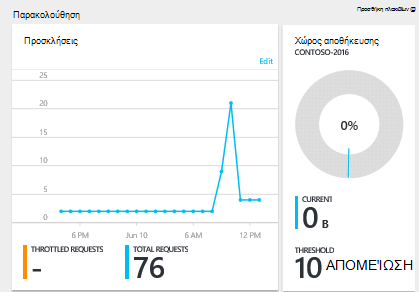

3.  Κάνοντας κλικ στην επιλογή στον **αιτήσεις** ή το **χώρο αποθήκευσης στο** πλακίδιο ανοίγει μια λεπτομερή blade **μετρικό σύστημα** .
4.  Το blade **μετρικό σύστημα** εμφανίζει λεπτομέρειες σχετικά με τα μετρικά που έχετε επιλέξει.  Στο επάνω μέρος του blade είναι ένα γράφημα με απεικόνιση σε γράφημα ωριαία αιτήσεις και που ακολουθεί πίνακας που εμφανίζει τις τιμές συνάθροισης για αιτήσεις επιτάχυνσης και σύνολο.  Το μετρικό blade εμφανίζει επίσης τη λίστα των ειδοποιήσεων που έχουν οριστεί, φιλτραρισμένο για τα μετρικά που εμφανίζονται στην την τρέχουσα μετρικό blade (αυτόν τον τρόπο, εάν έχετε έναν αριθμό ειδοποιήσεις, θα βλέπετε μόνο σχετικές αυτά που παρουσιάζονται εδώ).   

    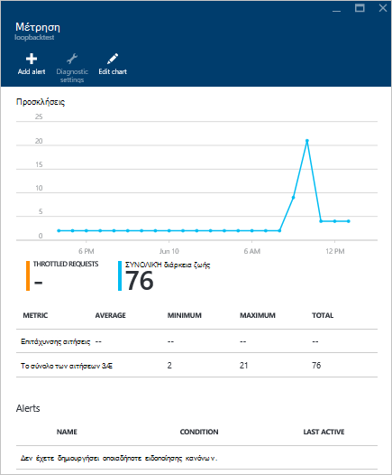

## Προσαρμογή προβολών μετρικό επιδόσεων στην πύλη

1.  Για να προσαρμόσετε τα μετρικά που εμφανίζονται σε ένα συγκεκριμένο γράφημα, κάντε κλικ στο γράφημα για να το ανοίξετε στο το blade **μετρικό σύστημα** και, στη συνέχεια, κάντε κλικ στην επιλογή **Επεξεργασία γραφήματος**.  
    

2.  Στην την **Επεξεργασία γραφήματος** blade, υπάρχουν επιλογές για την τροποποίηση των μετρικών που εμφανίζονται στο γράφημα, καθώς και το χρονικό διάστημα.  
    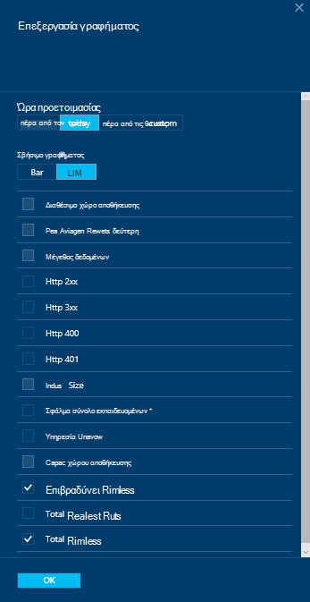

3.  Για να αλλάξετε τα μετρικά εμφάνισης στο τμήμα, απλώς επιλέξτε ή καταργήστε την επιλογή των μετρικών διαθέσιμη απόδοσης και, στη συνέχεια, κάντε κλικ στο **κουμπί OK** στο κάτω μέρος του blade.  
4.  Για να αλλάξετε την περιοχή ώρα, επιλέξτε μια διαφορετική περιοχή (για παράδειγμα, **Προσαρμογή**) και, στη συνέχεια, κάντε κλικ στο **κουμπί OK** στο κάτω μέρος του blade.  

    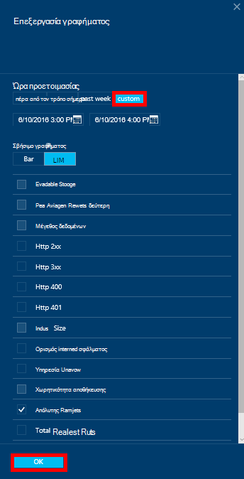

## Δημιουργία γραφημάτων δίπλα-δίπλα στην πύλη
Πύλη του Azure σάς επιτρέπει να δημιουργήσετε γραφήματα μετρικό σε παράθεση.  

1.  Πρώτα, κάντε δεξί κλικ στο γράφημα που θέλετε να αντιγράψετε και να επιλέξετε **Προσαρμογή**.

    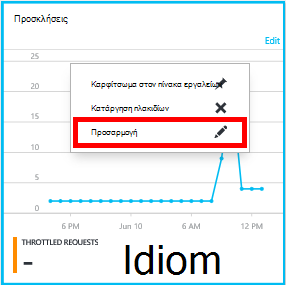

2.  Κάντε κλικ στην επιλογή **αντιγραφής** από το μενού για να αντιγράψετε το τμήμα και, στη συνέχεια, κάντε κλικ στην επιλογή **Προσαρμογή την εργασία**.

    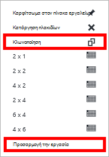  

Μπορείτε τώρα μπορεί να αντιμετωπίσει αυτό το τμήμα ως οποιοδήποτε άλλο τμήμα μετρικό, προσαρμογή της περιοχής μετρικά και την ώρα που εμφανίζεται στο τμήμα.  Με αυτόν τον τρόπο, μπορείτε να δείτε δύο διαφορετικές μετρικά γραφήματος δίπλα-δίπλα την ίδια στιγμή.  
    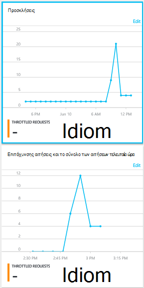  

## Ρύθμιση ειδοποιήσεων στην πύλη
1.  Στην [πύλη του Azure](https://portal.azure.com/), κάντε κλικ στην επιλογή **Περισσότερες υπηρεσίες**, κάντε κλικ στην επιλογή **DocumentDB (NoSQL)**και, στη συνέχεια, κάντε κλικ στο όνομα του λογαριασμού DocumentDB για την οποία θέλετε να ρύθμιση επιδόσεων και μετρικό ειδοποιήσεις.

2.  Στο μενού πόρων, κάντε κλικ στην επιλογή **Κανόνες ειδοποίησης** για να ανοίξετε το blade ειδοποίησης κανόνων.  
    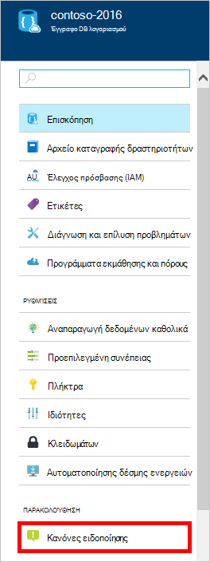

3.  Στο το blade **ειδοποίησης κανόνες** , κάντε κλικ στην επιλογή **Προσθήκη ειδοποίησης**.  
    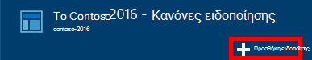

4.  Στο blade **Προσθήκη κανόνα ειδοποίησης** , καθορίστε:
    *   Το όνομα της ειδοποίησης κανόνα που ορίζετε.
    *   Μια περιγραφή του νέου κανόνα ειδοποίησης.
    *   Τη μέτρηση για τον κανόνα ειδοποίησης.
    *   Η συνθήκη, όριο και περίοδο που καθορίζουν όταν ενεργοποιεί την ειδοποίηση. Για παράδειγμα, ένα σφάλμα διακομιστή καταμέτρηση μεγαλύτερο από 5 πάνω από την τελευταία 15 λεπτά.
    *   Εάν το διαχειριστή της υπηρεσίας και coadministrators είναι με ηλεκτρονικό ταχυδρομείο όταν ενεργοποιείται την ειδοποίηση.
    *   Επιπλέον διευθύνσεων ηλεκτρονικού ταχυδρομείου για τις ειδοποιήσεις της ειδοποίησης.  
    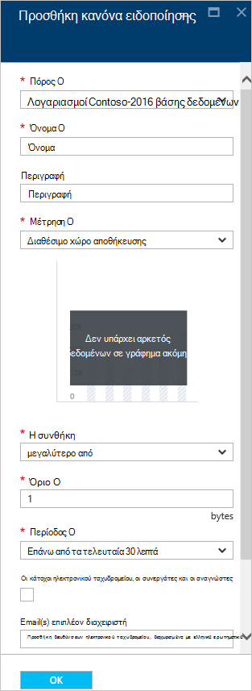

## Παρακολούθηση DocumentDB ορθογώνιο
Το λογαριασμό επιπέδου μετρικά διαθέσιμο στην πύλη του, όπως το λογαριασμό χώρου αποθήκευσης χρήση και σύνολο αιτήσεις, δεν είναι διαθέσιμα μέσω τα API DocumentDB. Ωστόσο, μπορείτε να ανακτήσετε δεδομένα χρήσης στο επίπεδο της συλλογής, χρησιμοποιώντας τα API DocumentDB. Για να ανακτήσετε δεδομένα επιπέδου συλλογής, κάντε τα εξής:

- Για να χρησιμοποιήσετε το REST API, [εκτελέστε μια ΛΉΨΗ στη συλλογή](https://msdn.microsoft.com/library/mt489073.aspx). Οι πληροφορίες ορίου και η χρήση της συλλογής επιστρέφεται στις κεφαλίδες x-ms--ορίου πόρων και x-ms--χρήση πόρων στην απάντηση.
- Για να χρησιμοποιήσετε το .NET SDK, χρησιμοποιήστε τη μέθοδο [DocumentClient.ReadDocumentCollectionAsync](https://msdn.microsoft.com/library/microsoft.azure.documents.client.documentclient.readdocumentcollectionasync.aspx) , η οποία επιστρέφει μια [ResourceResponse](https://msdn.microsoft.com/library/dn799209.aspx) που περιέχει έναν αριθμό ιδιοτήτων χρήση όπως **CollectionSizeUsage**, **DatabaseUsage**, **DocumentUsage**και πολλά άλλα.

Για να αποκτήσετε πρόσβαση σε πρόσθετες μετρήσεις, χρησιμοποιήστε το [Azure οθόνη SDK](https://www.nuget.org/packages/Microsoft.Azure.Insights). Διαθέσιμες μετρικό ορισμών μπορεί να ανακτηθεί με κλήση:

    https://management.azure.com/subscriptions/{SubscriptionId}/resourceGroups/{ResourceGroup}/providers/Microsoft.DocumentDb/databaseAccounts/{DocumentDBAccountName}/metricDefinitions?api-version=2015-04-08

Ερωτήματα για την ανάκτηση μεμονωμένα μετρικά χρησιμοποιήστε την εξής μορφή:

    https://management.azure.com/subscriptions/{SubecriptionId}/resourceGroups/{ResourceGroup}/providers/Microsoft.DocumentDb/databaseAccounts/{DocumentDBAccountName}/metrics?api-version=2015-04-08&$filter=%28name.value%20eq%20%27Total%20Requests%27%29%20and%20timeGrain%20eq%20duration%27PT5M%27%20and%20startTime%20eq%202016-06-03T03%3A26%3A00.0000000Z%20and%20endTime%20eq%202016-06-10T03%3A26%3A00.0000000Z

Για περισσότερες πληροφορίες, ανατρέξτε στο θέμα [Ανάκτηση μετρικά πόρων μέσω του Azure οθόνη REST API](https://blogs.msdn.microsoft.com/cloud_solution_architect/2016/02/23/retrieving-resource-metrics-via-the-azure-insights-api/). Σημειώστε ότι μετονομάστηκε "Azure Inights" "οθόνη Azure".  Αυτή η καταχώρηση ιστολογίου που αναφέρεται σε το παλαιότερο όνομα.

## Αντιμετώπιση προβλημάτων
Εάν παρακολούθησης πλακιδίων εμφανίζει το μήνυμα **δεν υπάρχουν διαθέσιμα δεδομένα** και πρόσφατα πραγματοποιήσατε αιτήσεις ή προσθήκη δεδομένων στη βάση δεδομένων, μπορείτε να επεξεργαστείτε το πλακίδιο για να απεικονίσει τη χρήση πρόσφατα.

### Επεξεργαστείτε ένα πλακίδιο για την ανανέωση τρέχοντα δεδομένα
1.  Για να προσαρμόσετε τα μετρικά που εμφανίζονται σε ένα συγκεκριμένο τμήμα, κάντε κλικ στο γράφημα για να ανοίξετε το blade **μετρικό σύστημα** και, στη συνέχεια, κάντε κλικ στην επιλογή **Επεξεργασία γραφήματος**.  
    

2.  Στην το blade **Επεξεργασία γραφήματος** , στην ενότητα **Χρονικό διάστημα** , κάντε κλικ στην επιλογή **μετά ώρα**και, στη συνέχεια, κάντε κλικ στο κουμπί **OK**.  
    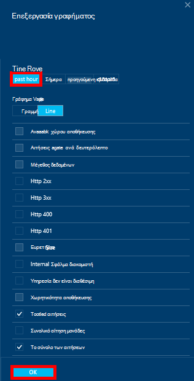

3.  Το πλακίδιο πρέπει τώρα να ανανεώσετε που εμφανίζει τον τρέχοντα δεδομένα και η χρήση.  
    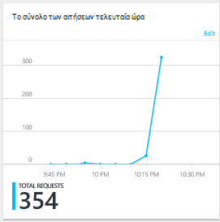

## Επόμενα βήματα
Για να μάθετε περισσότερα σχετικά με τη δυνατότητα DocumentDB, ανατρέξτε στο θέμα [Διαχείριση DocumentDB χωρητικότητα](documentdb-manage.md).
