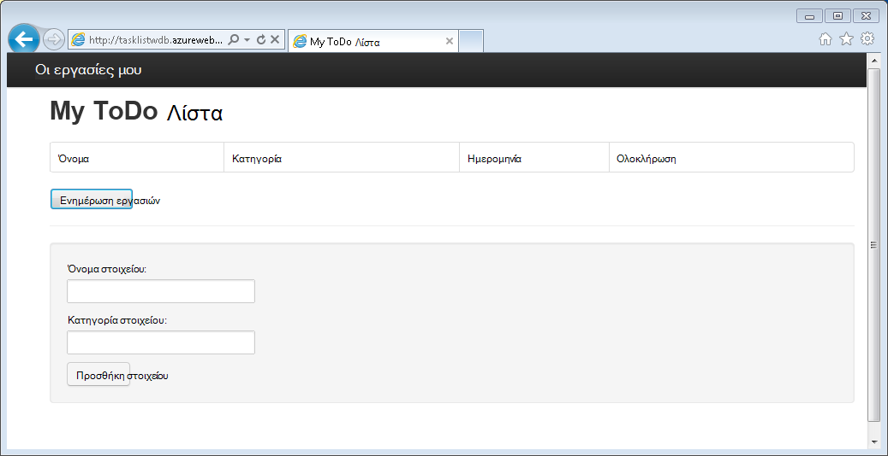
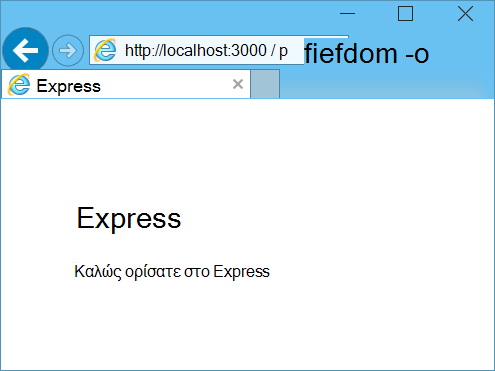
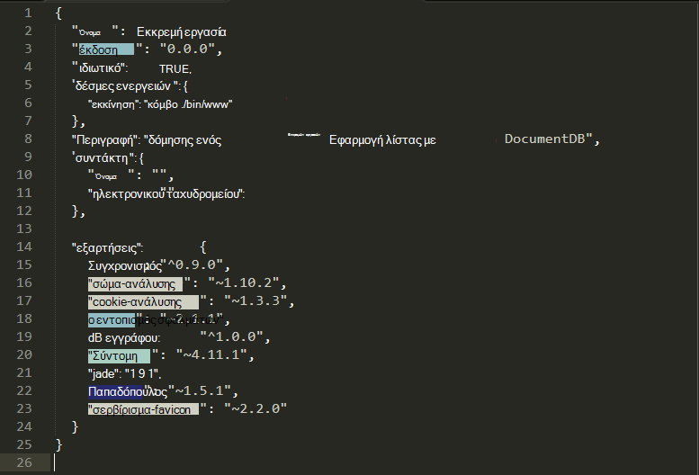
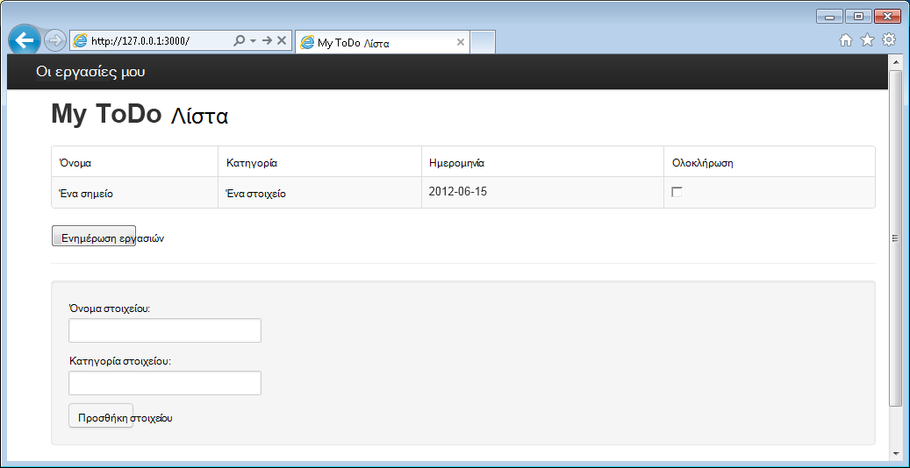

<properties 
    pageTitle="Μάθετε Node.js - πρόγραμμα εκμάθησης Node.js DocumentDB | Microsoft Azure" 
    description="Μάθετε Node.js! Πρόγραμμα εκμάθησης εξετάζει τον τρόπο χρήσης του Microsoft Azure DocumentDB για την αποθήκευση και πρόσβαση σε δεδομένα από μια εφαρμογή web Node.js Express φιλοξενούνται σε τοποθεσίες Web Azure." 
    keywords="Ανάπτυξη της εφαρμογής, εκμάθηση βάσης δεδομένων, μάθετε node.js, node.js το πρόγραμμα εκμάθησης, documentdb, azure, Microsoft azure"
    services="documentdb" 
    documentationCenter="nodejs" 
    authors="syamkmsft" 
    manager="jhubbard" 
    editor="cgronlun"/>

<tags 
    ms.service="documentdb" 
    ms.workload="data-services" 
    ms.tgt_pltfrm="na" 
    ms.devlang="nodejs" 
    ms.topic="hero-article" 
    ms.date="08/25/2016" 
    ms.author="syamk"/>

# Δημιουργία μιας εφαρμογής web Node.js χρησιμοποιώντας DocumentDB

> [AZURE.SELECTOR]
- [.NET](documentdb-dotnet-application.md)
- [Node.js](documentdb-nodejs-application.md)
- [Java](documentdb-java-application.md)
- [Python](documentdb-python-application.md)

Αυτό το πρόγραμμα εκμάθησης Node.js σας δείχνει πώς μπορείτε να χρησιμοποιήσετε την υπηρεσία Azure DocumentDB για την αποθήκευση και δεδομένων της access από μια εφαρμογή Node.js Express φιλοξενούνται σε τοποθεσίες Web Azure.

Συνιστάται να γρήγορα αποτελέσματα, παρακολουθώντας βίντεο που ακολουθεί, όπου θα μάθετε πώς να προμήθεια λογαριασμού Azure DocumentDB βάσης δεδομένων και να αποθηκεύσετε έγγραφα JSON στην εφαρμογή σας Node.js. 

> [AZURE.VIDEO azure-demo-getting-started-with-azure-documentdb-on-nodejs-in-linux]

Στη συνέχεια, επιστρέψετε σε αυτό το πρόγραμμα εκμάθησης Node.js, όπου θα μάθετε τις απαντήσεις στις ακόλουθες ερωτήσεις:

- Πώς μπορώ να εργαστώ με χρήση της λειτουργικής μονάδας npm documentdb DocumentDB;
- Πώς μπορώ να αναπτύξω της εφαρμογής web σε τοποθεσίες Web Azure;

Ακολουθώντας αυτό το πρόγραμμα εκμάθησης βάσης δεδομένων, θα μπορείτε να δημιουργήσετε μια εφαρμογή απλό βασίζεται στο web-Διαχείριση εργασιών που επιτρέπει τη δημιουργία, την ανάκτηση και την ολοκλήρωση των εργασιών. Οι εργασίες θα αποθηκευτούν ως JSON εγγράφων στο Azure DocumentDB.

Δεν έχετε χρόνο για να ολοκληρωθεί το πρόγραμμα εκμάθησης και απλώς θέλετε να λάβετε την ολοκληρωμένη λύση; Δεν ένα πρόβλημα, μπορείτε να λάβετε τη λύση ολοκληρωμένο δείγμα από [GitHub][].

## Προαπαιτούμενα στοιχεία

> [AZURE.TIP] Αυτό το πρόγραμμα εκμάθησης Node.js προϋποθέτει ότι έχετε ορισμένες εκ των προτέρων εμπειρία χρήσης Node.js και τοποθεσίες Web Azure.

Πριν να ακολουθήσετε τις οδηγίες σε αυτό το άρθρο, θα πρέπει να εξασφαλίσετε ότι έχετε τα εξής:

- Λογαριασμού Azure active. Εάν δεν έχετε ένα λογαριασμό, μπορείτε να δημιουργήσετε ένα δωρεάν λογαριασμό της δοκιμαστικής έκδοσης σε λίγα λεπτά. Για λεπτομέρειες, ανατρέξτε στο θέμα [Azure δωρεάν δοκιμαστικής έκδοσης](https://azure.microsoft.com/pricing/free-trial/).
- V0.10.29 έκδοση [node.js][] ή νεότερη έκδοση.
- [Γεννήτρια Express](http://www.expressjs.com/starter/generator.html) (μπορείτε να εγκαταστήσετε αυτό μέσω `npm install express-generator -g`)
- [Git][].

## Βήμα 1: Δημιουργία λογαριασμού DocumentDB βάσης δεδομένων

Ας ξεκινήσουμε με τη δημιουργία ενός λογαριασμού DocumentDB. Εάν έχετε ήδη ένα λογαριασμό, μπορείτε να μεταβείτε στο [βήμα 2: Δημιουργία νέας εφαρμογής Node.js](#_Toc395783178).

[AZURE.INCLUDE [documentdb-create-dbaccount](../../includes/documentdb-create-dbaccount.md)]

[AZURE.INCLUDE [documentdb-keys](../../includes/documentdb-keys.md)]

## Βήμα 2: Μάθετε πώς μπορείτε να δημιουργήσετε μια νέα εφαρμογή Node.js

Τώρα ας μάθουμε για τη δημιουργία ενός βασικού έργου Hello World Node.js χρησιμοποιώντας το πλαίσιο [Express](http://expressjs.com/) .

1. Άνοιγμα του τερματικού αγαπημένες σας.

2. Χρησιμοποιήστε τη ρητή γεννήτρια για να δημιουργήσετε μια νέα εφαρμογή ονομάζεται **todo**.

        express todo

3. Ανοίξτε το νέο κατάλογο **todo** και εγκαταστήστε εξαρτήσεις.

        cd todo
        npm install

4. Εκτελέστε τη νέα εφαρμογή.

        npm start

5. Μπορείτε να προβάλετε τη νέα εφαρμογή, μεταβαίνοντας στο πρόγραμμα περιήγησης να [http://localhost:3000](http://localhost:3000).

    

## Βήμα 3: Εγκαταστήστε πρόσθετες λειτουργικές μονάδες

Το αρχείο **package.json** είναι ένα από τα αρχεία που έχουν δημιουργηθεί με το ριζικό κατάλογο του έργου. Αυτό το αρχείο περιέχει μια λίστα με τις πρόσθετες λειτουργικές μονάδες που απαιτούνται για την εφαρμογή σας Node.js. Αργότερα, κατά την ανάπτυξη αυτής της εφαρμογής σε μια τοποθεσίες Web Azure, αυτό το αρχείο χρησιμοποιείται για να προσδιορίσετε ποια λειτουργικές μονάδες πρέπει να είναι εγκατεστημένο στον Azure να υποστηρίζει την εφαρμογή σας. Εξακολουθεί να πρέπει να εγκαταστήσετε δύο περισσότερες πακέτων για αυτό το πρόγραμμα εκμάθησης.

1. Επιστροφή στο το terminal, εγκαταστήσετε τη λειτουργική μονάδα **ασύγχρονης** μέσω npm.

        npm install async --save

1. Εγκαταστήστε τη λειτουργική μονάδα **documentdb** μέσω npm. Πρόκειται για τη λειτουργική μονάδα όπου όλα η μαγεία DocumentDB συμβαίνει.

        npm install documentdb --save

3. Ένα γρήγορο έλεγχο του αρχείου **package.json** της εφαρμογής θα πρέπει να εμφανίζουν τις πρόσθετες λειτουργικές μονάδες. Αυτό το αρχείο θα σας ενημερώσει Azure ποια πακέτα για να κάνετε λήψη και εγκατάσταση όταν εκτελείται η εφαρμογή σας. Αυτό θα πρέπει να μοιάζει με το παρακάτω παράδειγμα.

    

    Αυτό σας ενημερώνει κόμβου (και νεότερες εκδόσεις Azure) ότι η εφαρμογή σας εξαρτάται από αυτές τις επιπλέον λειτουργικές μονάδες.

## Βήμα 4: Με την υπηρεσία DocumentDB σε μια εφαρμογή κόμβου

Που αναλαμβάνει όλες τις αρχική εγκατάσταση και ρύθμιση παραμέτρων, τώρα ας λήψη προς τα κάτω για να γιατί είμαστε εδώ και που είναι να γράψετε ορισμένες κώδικα χρησιμοποιώντας Azure DocumentDB.

### Δημιουργία του μοντέλου

1. Στον κατάλογο του έργου, δημιουργήστε έναν νέο κατάλογο που ονομάζεται **μοντέλα**.
2. Στον κατάλογο **μοντέλα** , δημιουργήστε ένα νέο αρχείο με το όνομα **taskDao.js**. Αυτό το αρχείο θα περιέχει το μοντέλο για τις εργασίες που δημιουργείται από την εφαρμογή.
3. Στον ίδιο κατάλογο **μοντέλα** , δημιουργήστε μια άλλη νέο αρχείο με το όνομα **docdbUtils.js**. Αυτό το αρχείο θα περιέχει ορισμένες χρήσιμες, με δυνατότητα επανάληψης χρήσης, κώδικα που θα χρησιμοποιήσουμε σε ολόκληρη την εφαρμογή. 
4. Αντιγράψτε τον παρακάτω κώδικα στο για να **docdbUtils.js**

        var DocumentDBClient = require('documentdb').DocumentClient;
            
        var DocDBUtils = {
            getOrCreateDatabase: function (client, databaseId, callback) {
                var querySpec = {
                    query: 'SELECT * FROM root r WHERE r.id= @id',
                    parameters: [{
                        name: '@id',
                        value: databaseId
                    }]
                };
        
                client.queryDatabases(querySpec).toArray(function (err, results) {
                    if (err) {
                        callback(err);
        
                    } else {
                        if (results.length === 0) {
                            var databaseSpec = {
                                id: databaseId
                            };
        
                            client.createDatabase(databaseSpec, function (err, created) {
                                callback(null, created);
                            });
        
                        } else {
                            callback(null, results[0]);
                        }
                    }
                });
            },
        
            getOrCreateCollection: function (client, databaseLink, collectionId, callback) {
                var querySpec = {
                    query: 'SELECT * FROM root r WHERE r.id=@id',
                    parameters: [{
                        name: '@id',
                        value: collectionId
                    }]
                };             
                
                client.queryCollections(databaseLink, querySpec).toArray(function (err, results) {
                    if (err) {
                        callback(err);
        
                    } else {        
                        if (results.length === 0) {
                            var collectionSpec = {
                                id: collectionId
                            };
                            
                            client.createCollection(databaseLink, collectionSpec, function (err, created) {
                                callback(null, created);
                            });
        
                        } else {
                            callback(null, results[0]);
                        }
                    }
                });
            }
        };
                
        module.exports = DocDBUtils;

    > [AZURE.TIP] createCollection λαμβάνει μια παράμετρο προαιρετικό requestOptions που μπορούν να χρησιμοποιηθούν για να καθορίσετε τον τύπο προσφορά για τη συλλογή. Εάν δεν υπάρχει τιμή requestOptions.offerType παρέχεται, στη συνέχεια, η συλλογή θα δημιουργηθούν χρησιμοποιώντας το προεπιλεγμένο τύπο προσφορά.
    >
    > Για περισσότερες πληροφορίες σχετικά με τους τύπους προσφέρουν DocumentDB, ανατρέξτε στα [επίπεδα επιδόσεων στο DocumentDB](documentdb-performance-levels.md) 
        
3. Αποθηκεύστε και κλείστε το αρχείο **docdbUtils.js** .

4. Στην αρχή του αρχείου **taskDao.js** , προσθέστε τον παρακάτω κώδικα στο αναφοράς του **DocumentDBClient** και **docdbUtils.js** που δημιουργήσαμε παραπάνω:

        var DocumentDBClient = require('documentdb').DocumentClient;
        var docdbUtils = require('./docdbUtils');

4. Στη συνέχεια, θα μπορείτε να προσθέσετε κώδικα για να ορίσετε και να εξαγάγετε το αντικείμενο εργασίας. Αυτό είναι υπεύθυνος για την προετοιμασία μας αντικειμένου εργασίας και τη ρύθμιση της βάσης δεδομένων και τη συλλογή εγγράφων, θα χρησιμοποιήσουμε.

        function TaskDao(documentDBClient, databaseId, collectionId) {
          this.client = documentDBClient;
          this.databaseId = databaseId;
          this.collectionId = collectionId;
        
          this.database = null;
          this.collection = null;
        }
        
        module.exports = TaskDao;

5. Στη συνέχεια, προσθέστε τον ακόλουθο κώδικα για να ορίσετε πρόσθετες μεθόδους στο αντικείμενο εργασίας, που επιτρέπουν αλληλεπιδράσεις με δεδομένα που είναι αποθηκευμένα στο DocumentDB.

        TaskDao.prototype = {
            init: function (callback) {
                var self = this;
        
                docdbUtils.getOrCreateDatabase(self.client, self.databaseId, function (err, db) {
                    if (err) {
                        callback(err);
                    } else {
                        self.database = db;
                        docdbUtils.getOrCreateCollection(self.client, self.database._self, self.collectionId, function (err, coll) {
                            if (err) {
                                callback(err);
        
                            } else {
                                self.collection = coll;
                            }
                        });
                    }
                });
            },
        
            find: function (querySpec, callback) {
                var self = this;
        
                self.client.queryDocuments(self.collection._self, querySpec).toArray(function (err, results) {
                    if (err) {
                        callback(err);
        
                    } else {
                        callback(null, results);
                    }
                });
            },
        
            addItem: function (item, callback) {
                var self = this;
        
                item.date = Date.now();
                item.completed = false;
        
                self.client.createDocument(self.collection._self, item, function (err, doc) {
                    if (err) {
                        callback(err);
        
                    } else {
                        callback(null, doc);
                    }
                });
            },
        
            updateItem: function (itemId, callback) {
                var self = this;
        
                self.getItem(itemId, function (err, doc) {
                    if (err) {
                        callback(err);
        
                    } else {
                        doc.completed = true;
        
                        self.client.replaceDocument(doc._self, doc, function (err, replaced) {
                            if (err) {
                                callback(err);
        
                            } else {
                                callback(null, replaced);
                            }
                        });
                    }
                });
            },
        
            getItem: function (itemId, callback) {
                var self = this;
        
                var querySpec = {
                    query: 'SELECT * FROM root r WHERE r.id = @id',
                    parameters: [{
                        name: '@id',
                        value: itemId
                    }]
                };
        
                self.client.queryDocuments(self.collection._self, querySpec).toArray(function (err, results) {
                    if (err) {
                        callback(err);
        
                    } else {
                        callback(null, results[0]);
                    }
                });
            }
        };

6. Αποθηκεύστε και κλείστε το αρχείο **taskDao.js** . 

### Δημιουργία του ελεγκτή

1. Στον κατάλογο **δρομολογεί** του έργου σας, δημιουργήστε ένα νέο αρχείο με το όνομα **tasklist.js**. 
2. Προσθέστε τον παρακάτω κώδικα **tasklist.js**. Αυτό φορτώνει τις DocumentDBClient και ασύγχρονης λειτουργικές μονάδες, που χρησιμοποιούνται από **tasklist.js**. Αυτό επίσης που καθορίζονται από τη συνάρτηση **TaskList** , που μεταβιβάζεται μια παρουσία του αντικειμένου **εργασίας** ορίσαμε παλαιότερη έκδοση:

        var DocumentDBClient = require('documentdb').DocumentClient;
        var async = require('async');
        
        function TaskList(taskDao) {
          this.taskDao = taskDao;
        }
        
        module.exports = TaskList;

3. Συνεχίστε να προσθέτετε στο αρχείο **tasklist.js** , προσθέτοντας τις μεθόδους που χρησιμοποιούνται για να **showTasks addTask**και **completeTasks**:
        
        TaskList.prototype = {
            showTasks: function (req, res) {
                var self = this;
        
                var querySpec = {
                    query: 'SELECT * FROM root r WHERE r.completed=@completed',
                    parameters: [{
                        name: '@completed',
                        value: false
                    }]
                };
        
                self.taskDao.find(querySpec, function (err, items) {
                    if (err) {
                        throw (err);
                    }
        
                    res.render('index', {
                        title: 'My ToDo List ',
                        tasks: items
                    });
                });
            },
        
            addTask: function (req, res) {
                var self = this;
                var item = req.body;
        
                self.taskDao.addItem(item, function (err) {
                    if (err) {
                        throw (err);
                    }
        
                    res.redirect('/');
                });
            },
        
            completeTask: function (req, res) {
                var self = this;
                var completedTasks = Object.keys(req.body);
        
                async.forEach(completedTasks, function taskIterator(completedTask, callback) {
                    self.taskDao.updateItem(completedTask, function (err) {
                        if (err) {
                            callback(err);
                        } else {
                            callback(null);
                        }
                    });
                }, function goHome(err) {
                    if (err) {
                        throw err;
                    } else {
                        res.redirect('/');
                    }
                });
            }
        };

4. Αποθηκεύστε και κλείστε το αρχείο **tasklist.js** .
 
### Προσθήκη config.js

1. Στον κατάλογο του έργου σας, δημιουργήστε ένα νέο αρχείο με το όνομα **config.js**.
2. Προσθέστε τα ακόλουθα **config.js**. Αυτό ορίζει ρυθμίσεις παραμέτρων και τις τιμές που χρειάζονται για την εφαρμογή.

        var config = {}
        
        config.host = process.env.HOST || "[the URI value from the DocumentDB Keys blade on http://portal.azure.com]";
        config.authKey = process.env.AUTH_KEY || "[the PRIMARY KEY value from the DocumentDB Keys blade on http://portal.azure.com]";
        config.databaseId = "ToDoList";
        config.collectionId = "Items";
        
        module.exports = config;

3. Στο αρχείο **config.js** , ενημερώστε τις τιμές του κεντρικού ΥΠΟΛΟΓΙΣΤΉ και AUTH_KEY χρησιμοποιώντας τις τιμές που βρίσκονται στο τα πλήκτρα blade του λογαριασμού σας DocumentDB στην [Πύλη του Microsoft Azure](https://portal.azure.com):

4. Αποθηκεύστε και κλείστε το αρχείο **config.js** .
 
### Τροποποίηση app.js

1. Στον κατάλογο του έργου, ανοίξτε το αρχείο **app.js** . Αυτό το αρχείο δημιουργήθηκε νωρίτερα κατά τη δημιουργία της εφαρμογής web Express.
2. Προσθέστε τον ακόλουθο κώδικα στο επάνω μέρος της **app.js**
    
        var DocumentDBClient = require('documentdb').DocumentClient;
        var config = require('./config');
        var TaskList = require('./routes/tasklist');
        var TaskDao = require('./models/taskDao');

3. Αυτός ο κωδικός καθορίζει το αρχείο ρύθμισης παραμέτρων που θα χρησιμοποιηθεί, και συνεχίζει να διαβάσετε τιμές εκτός αυτού του αρχείου σε ορισμένες μεταβλητές, θα χρησιμοποιήσουμε σύντομα.
4. Αντικαταστήστε τις ακόλουθες δύο γραμμές στο αρχείο **app.js** :

        app.use('/', routes);
        app.use('/users', users); 

      με το παρακάτω τμήμα κώδικα:

        var docDbClient = new DocumentDBClient(config.host, {
            masterKey: config.authKey
        });
        var taskDao = new TaskDao(docDbClient, config.databaseId, config.collectionId);
        var taskList = new TaskList(taskDao);
        taskDao.init();
        
        app.get('/', taskList.showTasks.bind(taskList));
        app.post('/addtask', taskList.addTask.bind(taskList));
        app.post('/completetask', taskList.completeTask.bind(taskList));
        app.set('view engine', 'jade');

6. Αυτές οι γραμμές Ορισμός νέας παρουσίας του αντικειμένου μας **TaskDao** , με μια νέα σύνδεση με DocumentDB (χρησιμοποιώντας τις τιμές ανάγνωση από το **config.js**), η προετοιμασία του αντικειμένου εργασίας και, στη συνέχεια, συνδέστε ενέργειες φόρμας μεθόδους στον ελεγκτή μας **TaskList** . 

7. Τέλος, αποθηκεύστε και κλείστε το αρχείο **app.js** , θα σας σχεδόν είστε έτοιμοι.
 
## Βήμα 5: Δημιουργήστε ένα περιβάλλον εργασίας χρήστη

Τώρα ας ενεργοποιήστε την προσοχή μας για τη δημιουργία του περιβάλλοντος εργασίας χρήστη, ώστε να ενός χρήστη στην πραγματικότητα να αλληλεπιδράτε με την εφαρμογή. Η εφαρμογή Express που δημιουργήσαμε χρησιμοποιεί **Jade** ως το μηχανισμό προβολή. Για περισσότερες πληροφορίες σχετικά με Νεφρίτης ανατρέξτε [http://jade-lang.com/](http://jade-lang.com/).

1. Το αρχείο **layout.jade** στον κατάλογο **προβολές** χρησιμοποιείται ως καθολικό πρότυπο για άλλα αρχεία **.jade** . Σε αυτό το βήμα θα τροποποιήσετε ώστε να χρησιμοποιεί [Εκκίνησης του Twitter](https://github.com/twbs/bootstrap), που είναι ένα κιτ εργαλείων που διευκολύνει την σχεδίαση ωραία εμφάνιση τοποθεσίας Web. 
2. Ανοίξτε το αρχείο **layout.jade** βρίσκεται στο φάκελο **προβολές** και αντικαταστήστε τα περιεχόμενα με τα εξής:
    
        doctype html
        html
          head
            title= title
            link(rel='stylesheet', href='//ajax.aspnetcdn.com/ajax/bootstrap/3.3.2/css/bootstrap.min.css')
            link(rel='stylesheet', href='/stylesheets/style.css')
          body
            nav.navbar.navbar-inverse.navbar-fixed-top
              div.navbar-header
                a.navbar-brand(href='#') My Tasks
            block content
            script(src='//ajax.aspnetcdn.com/ajax/jQuery/jquery-1.11.2.min.js')
            script(src='//ajax.aspnetcdn.com/ajax/bootstrap/3.3.2/bootstrap.min.js')

    Αποτελεσματική αυτό σας ενημερώνει για το μηχανισμό **Jade** για την απόδοση ορισμένες HTML για την εφαρμογή και δημιουργεί ένα **μπλοκ** που ονομάζεται **περιεχομένου** όπου θα σας να παρέχετε τη διάταξη για μας σελίδες περιεχομένου.
    Αποθηκεύστε και κλείστε αυτό το αρχείο **layout.jade** .

4. Τώρα Ανοίξτε το αρχείο **index.jade** , στην προβολή που θα χρησιμοποιηθεί από την εφαρμογή και αντικαταστήστε το περιεχόμενο του αρχείου με τα εξής:

        extends layout
        
        block content
          h1 #{title}
          br
        
          form(action="/completetask", method="post")
            table.table.table-striped.table-bordered
              tr
                td Name
                td Category
                td Date
                td Complete
              if (typeof tasks === "undefined")
                tr
                  td
              else
                each task in tasks
                  tr
                    td #{task.name}
                    td #{task.category}
                    - var date  = new Date(task.date);
                    - var day   = date.getDate();
                    - var month = date.getMonth() + 1;
                    - var year  = date.getFullYear();
                    td #{month + "/" + day + "/" + year}
                    td
                      input(type="checkbox", name="#{task.id}", value="#{!task.completed}", checked=task.completed)
            button.btn(type="submit") Update tasks
          hr
          form.well(action="/addtask", method="post")
            label Item Name:
            input(name="name", type="textbox")
            label Item Category:
            input(name="category", type="textbox")
            br
            button.btn(type="submit") Add item

    Αυτή η διάταξη επεκτείνει και παρέχει περιεχόμενο για το σύμβολο κράτησης θέσης **περιεχομένου** που θα σας είδατε προηγουμένως στο αρχείο **layout.jade** .
    
    Σε αυτήν τη διάταξη που δημιουργήσαμε δύο φόρμες HTML. 
    Η πρώτη φόρμα περιέχει έναν πίνακα για τα δεδομένα και ένα κουμπί που σας επιτρέπει να ενημερώσετε τα στοιχεία από καταχώρηση μέθοδο **/completetask** μας ελεγκτή.
    Η δεύτερη φόρμα περιέχει δύο πεδία εισαγωγής και ένα κουμπί που σας επιτρέπει να δημιουργήσετε ένα νέο στοιχείο δημοσιεύοντας μέθοδο **/addtask** μας ελεγκτή.
    
    Αυτό πρέπει να είναι το μόνο που χρειαζόμαστε για τη λειτουργία της εφαρμογής.

5. Ανοίξτε το αρχείο **style.css** στον κατάλογο **public\stylesheets** και να αντικαταστήσετε τον κωδικό με τα εξής:

        body {
          padding: 50px;
          font: 14px "Lucida Grande", Helvetica, Arial, sans-serif;
        }
        a {
          color: #00B7FF;
        }
        .well label {
          display: block;
        }
        .well input {
          margin-bottom: 5px;
        }
        .btn {
          margin-top: 5px;
          border: outset 1px #C8C8C8;
        }

    Αποθηκεύστε και κλείστε αυτό το αρχείο **style.css** .

## Βήμα 6: Εκτέλεση της εφαρμογής σας τοπικά

1. Για να ελέγξετε την εφαρμογή στον τοπικό υπολογιστή σας, εκτελέστε `npm start` σε μια terminal για να εκκινήσετε την εφαρμογή σας και την εκκίνηση ενός προγράμματος περιήγησης με μια σελίδα που εμφανίζεται ως η εικόνα που ακολουθεί:

    

2. Χρησιμοποιήστε τα πεδία που παρέχονται για το στοιχείο, όνομα στοιχείου και κατηγορία για να εισαγάγετε πληροφορίες και, στη συνέχεια, κάντε κλικ στην επιλογή **Προσθήκη στοιχείου**.

3. Πρέπει να ενημερώσετε τη σελίδα για να εμφανίσετε το στοιχείο που έχουν δημιουργηθεί πρόσφατα στη λίστα ToDo.

    

4. Για να ολοκληρώσετε μια εργασία, απλώς επιλέξτε το πλαίσιο ελέγχου στη στήλη ολοκλήρωσης και, στη συνέχεια, κάντε κλικ στην επιλογή **Ενημέρωση εργασιών**.

## Βήμα 7: Ανάπτυξη του έργου ανάπτυξης εφαρμογών σε τοποθεσίες Web Azure

1. Εάν δεν το έχετε κάνει ήδη, ενεργοποιήστε ένα αποθετήριο git για την τοποθεσία Web του Azure. Μπορείτε να βρείτε οδηγίες σχετικά με τον τρόπο για να το κάνετε αυτό στο θέμα [Τοπικό Git ανάπτυξης για να Azure εφαρμογής υπηρεσίας](../app-service-web/app-service-deploy-local-git.md) .

2. Προσθέστε την τοποθεσία Web του Azure ως μια απομακρυσμένη git.

        git remote add azure https://username@your-azure-website.scm.azurewebsites.net:443/your-azure-website.git

3. Ανάπτυξη πατώντας στον απομακρυσμένο.

        git push azure master

4. Σε μερικά δευτερόλεπτα, git θα λήξης δημοσίευσης της εφαρμογής web και εκκίνηση ενός προγράμματος περιήγησης όπου μπορείτε να δείτε εύχρηστο εργασίας εκτελείται στο Azure!

## Επόμενα βήματα

Συγχαρητήρια! Έχετε μόλις δημιουργηθεί το πρώτο Node.js Express εφαρμογής Web με χρήση Azure DocumentDB και τη δημοσίευσή του Azure τοποθεσίες Web.

Ο κωδικός προέλευσης για την εφαρμογή ολοκληρωμένη αναφορά μπορούν να ληφθούν από [GitHub][].

Για περισσότερες πληροφορίες, ανατρέξτε στο [Κέντρο για προγραμματιστές του Node.js](https://azure.microsoft.com/develop/nodejs/).

[Node.js]: http://nodejs.org/
[Git]: http://git-scm.com/
[Github]: https://github.com/Azure-Samples/documentdb-node-todo-app
 
