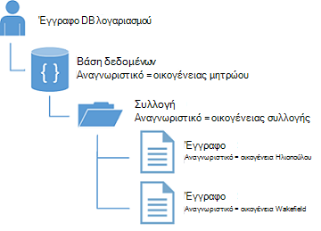
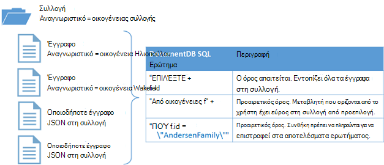

<properties
  pageTitle="Πρόγραμμα εκμάθησης NoSQL Node.js για DocumentDB | Microsoft Azure"
  description="Ένα πρόγραμμα εκμάθησης NoSQL Node.js που δημιουργεί έναν κόμβο βάσης δεδομένων και κονσόλας εφαρμογή χρησιμοποιώντας το SDK Node.js DocumentDB. DocumentDB είναι μια βάση δεδομένων NoSQL για JSON."
    keywords="πρόγραμμα εκμάθησης node.js, βάση δεδομένων κόμβου"
  services="documentdb"
  documentationCenter="node.js"
  authors="AndrewHoh"
  manager="jhubbard"
  editor="monicar"/>

<tags
  ms.service="documentdb"
  ms.workload="data-services"
  ms.tgt_pltfrm="na"
  ms.devlang="node"
  ms.topic="hero-article"
  ms.date="08/11/2016"
  ms.author="anhoh"/>

# <a name="nosql-nodejs-tutorial-documentdb-nodejs-console-application"></a>Πρόγραμμα εκμάθησης NoSQL Node.js: εφαρμογή κονσόλας DocumentDB Node.js  

> [AZURE.SELECTOR]
- [.NET](documentdb-get-started.md)
- [Node.js](documentdb-nodejs-get-started.md)

Καλώς ορίσατε για το πρόγραμμα εκμάθησης Node.js για το SDK Node.js DocumentDB Azure! Μετά την εκτέλεση αυτού του προγράμματος εκμάθησης, θα έχετε μια εφαρμογή κονσόλας που δημιουργεί και ερωτήματα DocumentDB πόρους, όπως μια βάση δεδομένων κόμβο.

Θα ασχοληθούμε με:

- Δημιουργία και τη σύνδεση σε ένα λογαριασμό DocumentDB
- Ρύθμιση της εφαρμογής σας
- Δημιουργία μιας βάσης δεδομένων κόμβου
- Δημιουργία μιας συλλογής
- Δημιουργία εγγράφων JSON
- Υποβολή ερωτημάτων στη συλλογή
- Αντικατάσταση ενός εγγράφου
- Διαγραφή ενός εγγράφου
- Διαγραφή της βάσης δεδομένων κόμβου

Δεν έχετε το χρόνο; Μην ανησυχείς! Η ολοκληρωμένη λύση είναι διαθέσιμη στο [GitHub](https://github.com/Azure-Samples/documentdb-node-getting-started). Για γρήγορη οδηγίες, ανατρέξτε στο θέμα [γρήγορα την ολοκληρωμένη λύση](#GetSolution) .

Αφού έχετε ολοκληρώσει το πρόγραμμα εκμάθησης Node.js, χρησιμοποιήστε τα κουμπιά εκλογής στο επάνω και στο κάτω μέρος αυτής της σελίδας για να στείλτε μας τα σχόλιά. Εάν θέλετε να επικοινωνήσουμε μαζί σας απευθείας, μην διστάσεις να συμπεριλάβετε τη διεύθυνση ηλεκτρονικού ταχυδρομείου στο τα σχόλιά σας.

Τώρα ας ξεκινήσουμε!

## <a name="prerequisites-for-the-nodejs-tutorial"></a>Προαπαιτούμενα στοιχεία για το πρόγραμμα εκμάθησης Node.js

Βεβαιωθείτε ότι έχετε τα εξής:

- Λογαριασμού Azure active. Εάν δεν έχετε, μπορείτε να εγγραφείτε για μια [Δωρεάν δοκιμαστική έκδοση Azure](https://azure.microsoft.com/pricing/free-trial/).
- V0.10.29 έκδοση [node.js](https://nodejs.org/) ή νεότερη έκδοση.

## <a name="step-1-create-a-documentdb-account"></a>Βήμα 1: Δημιουργία λογαριασμού DocumentDB

Ας δημιουργήσουμε ένα λογαριασμό DocumentDB. Εάν έχετε ήδη ένα λογαριασμό που θέλετε να χρησιμοποιήσετε, μπορείτε να μεταβείτε στο μέλλον να [εγκαταστήσετε την εφαρμογή σας Node.js](#SetupNode).

[AZURE.INCLUDE [documentdb-create-dbaccount](../../includes/documentdb-create-dbaccount.md)]

## <a id="SetupNode"></a>Βήμα 2: Ρύθμιση εφαρμογή σας Node.js

1. Άνοιγμα του τερματικού αγαπημένες σας.
2. Εντοπίστε το φάκελο ή τον κατάλογο όπου θέλετε να αποθηκεύσετε την εφαρμογή σας Node.js.
3. Δημιουργήστε δύο κενά αρχεία JavaScript με τις παρακάτω εντολές:
  - Windows:
      * ```fsutil file createnew app.js 0```
        * ```fsutil file createnew config.js 0```
  - Linux/OS χ:
      * ```touch app.js```
        * ```touch config.js```
4. Εγκαταστήστε τη λειτουργική μονάδα documentdb μέσω npm. Χρησιμοποιήστε την ακόλουθη εντολή:
    * ```npm install documentdb --save```

Μεγάλο! Τώρα που έχετε ολοκληρώσει τη ρύθμιση, ας ξεκινήσουμε να γράφετε ορισμένες κώδικα.

## <a id="Config"></a>Βήμα 3: Ρύθμιση παραμέτρων της εφαρμογής σας

Άνοιγμα ```config.js``` στο πρόγραμμα επεξεργασίας κειμένου Αγαπημένα.

Στη συνέχεια, αντιγραφή και επικόλληση το τμήμα κώδικα παρακάτω και να ορίσετε ιδιότητες ```config.endpoint``` και ```config.primaryKey``` στην DocumentDB τελικού σημείου uri και πρωτεύον κλειδί. Μπορείτε να βρείτε και οι δύο αυτές τις ρυθμίσεις παραμέτρων στην [Πύλη του Azure](https://portal.azure.com).

![Πρόγραμμα εκμάθησης node.js - στιγμιότυπο οθόνης από την πύλη Azure, που εμφανίζει ένα λογαριασμό DocumentDB, με την ΕΝΕΡΓΉ ενότητα επισήμανση, το κουμπί ΚΛΕΙΔΙΆ με επισήμανση στις το blade λογαριασμό DocumentDB και τις τιμές URI, ΠΡΩΤΕΎΟΝ ΚΛΕΙΔΊ και ΔΕΥΤΕΡΕΎΟΝ ΚΛΕΙΔΊ με επισήμανση στις τα πλήκτρα blade - κόμβου βάσης δεδομένων][keys]

    // ADD THIS PART TO YOUR CODE
    var config = {}

    config.endpoint = "~your DocumentDB endpoint uri here~";
    config.primaryKey = "~your primary key here~";

Αντιγράψτε και επικολλήστε το ```database id```, ```collection id```, και ```JSON documents``` για να σας ```config``` αντικείμενο κάτω όπου το ορίσατε σας ```config.endpoint``` και ```config.authKey``` ιδιότητες. Εάν έχετε ήδη δεδομένα που θέλετε να αποθηκεύσετε στη βάση δεδομένων σας, μπορείτε να χρησιμοποιήσετε DocumentDB του [εργαλείου μετεγκατάστασης δεδομένων](documentdb-import-data.md) αντί να προσθέσετε τους ορισμούς εγγράφου.

    config.endpoint = "~your DocumentDB endpoint uri here~";
    config.primaryKey = "~your primary key here~";

    // ADD THIS PART TO YOUR CODE
    config.database = {
        "id": "FamilyDB"
    };

    config.collection = {
        "id": "FamilyColl"
    };

    config.documents = {
        "Andersen": {
            "id": "Anderson.1",
            "lastName": "Andersen",
            "parents": [{
                "firstName": "Thomas"
            }, {
                    "firstName": "Mary Kay"
                }],
            "children": [{
                "firstName": "Henriette Thaulow",
                "gender": "female",
                "grade": 5,
                "pets": [{
                    "givenName": "Fluffy"
                }]
            }],
            "address": {
                "state": "WA",
                "county": "King",
                "city": "Seattle"
            }
        },
        "Wakefield": {
            "id": "Wakefield.7",
            "parents": [{
                "familyName": "Wakefield",
                "firstName": "Robin"
            }, {
                    "familyName": "Miller",
                    "firstName": "Ben"
                }],
            "children": [{
                "familyName": "Merriam",
                "firstName": "Jesse",
                "gender": "female",
                "grade": 8,
                "pets": [{
                    "givenName": "Goofy"
                }, {
                        "givenName": "Shadow"
                    }]
            }, {
                    "familyName": "Miller",
                    "firstName": "Lisa",
                    "gender": "female",
                    "grade": 1
                }],
            "address": {
                "state": "NY",
                "county": "Manhattan",
                "city": "NY"
            },
            "isRegistered": false
        }
    };


Η βάση δεδομένων, συλλογή και ορισμούς εγγράφου θα ενεργήσει ως σας DocumentDB ```database id```, ```collection id```, και τα δεδομένα των εγγράφων.

Τέλος, εξαγωγή σας ```config``` αντικείμενο, ώστε να μπορείτε να αναφέρετε το εντός του ```app.js``` αρχείου.

            },
            "isRegistered": false
        }
    };

    // ADD THIS PART TO YOUR CODE
    module.exports = config;

##<a id="Connect"></a>Βήμα 4: Σύνδεση με ένα λογαριασμό DocumentDB

Ανοίξτε το άδειασμα ```app.js``` αρχείο στο πρόγραμμα επεξεργασίας κειμένου. Αντιγράψτε και επικολλήστε τον κώδικα παρακάτω για να εισαγάγετε το ```documentdb``` λειτουργική μονάδα και σας που έχουν δημιουργηθεί πρόσφατα ```config``` λειτουργική μονάδα.

    // ADD THIS PART TO YOUR CODE
    "use strict";

    var documentClient = require("documentdb").DocumentClient;
    var config = require("./config");
    var url = require('url');

Αντιγράψτε και επικολλήστε τον κώδικα για να χρησιμοποιήσετε την έκδοση είχε αποθηκευτεί προηγουμένως ```config.endpoint``` και ```config.primaryKey``` για να δημιουργήσετε μια νέα DocumentClient.

    var config = require("./config");
    var url = require('url');

    // ADD THIS PART TO YOUR CODE
    var client = new documentClient(config.endpoint, { "masterKey": config.primaryKey });

Τώρα που έχετε τον κωδικό για την προετοιμασία του υπολογιστή-πελάτη documentdb, ας ρίξουμε μια ματιά στην εργασία με πόρους DocumentDB.

## <a name="step-5-create-a-node-database"></a>Βήμα 5: Δημιουργία βάσης δεδομένων κόμβου
Αντιγράψτε και επικολλήστε τον κώδικα παρακάτω για να ορίσετε την κατάσταση HTTP για δεν βρέθηκε η διεύθυνση url της βάσης δεδομένων και τη διεύθυνση url της συλλογής. Αυτές οι διευθύνσεις URL είναι πώς θα βρείτε το πρόγραμμα-πελάτη DocumentDB τη σωστή βάση δεδομένων και τη συλλογή.

    var client = new documentClient(config.endpoint, { "masterKey": config.primaryKey });

    // ADD THIS PART TO YOUR CODE
    var HttpStatusCodes = { NOTFOUND: 404 };
    var databaseUrl = `dbs/${config.database.id}`;
    var collectionUrl = `${databaseUrl}/colls/${config.collection.id}`;

Μια [βάση δεδομένων](documentdb-resources.md#databases) μπορούν να δημιουργηθούν με χρήση της συνάρτησης [createDatabase](https://azure.github.io/azure-documentdb-node/DocumentClient.html) της κλάσης **DocumentClient** . Μια βάση δεδομένων είναι το λογικό κοντέινερ χώρου αποθήκευσης εγγράφων διαμερίσματα σε συλλογές.

Αντιγράψτε και επικολλήστε τη συνάρτηση **getDatabase** για τη δημιουργία νέας βάσης δεδομένων στο αρχείο app.js με το ```id``` καθορίζονται στο το ```config``` αντικειμένου. Η συνάρτηση θα Ελέγξτε αν η βάση δεδομένων με το ίδιο ```FamilyRegistry``` αναγνωριστικό δεν υπάρχει ήδη. Εάν υπάρχει, θα σας θα επιστρέψει αυτήν τη βάση δεδομένων αντί να δημιουργήσετε ένα νέο.

    var collectionUrl = `${databaseUrl}/colls/${config.collection.id}`;

    // ADD THIS PART TO YOUR CODE
    function getDatabase() {
        console.log(`Getting database:\n${config.database.id}\n`);

        return new Promise((resolve, reject) => {
            client.readDatabase(databaseUrl, (err, result) => {
                if (err) {
                    if (err.code == HttpStatusCodes.NOTFOUND) {
                        client.createDatabase(config.database, (err, created) => {
                            if (err) reject(err)
                            else resolve(created);
                        });
                    } else {
                        reject(err);
                    }
                } else {
                    resolve(result);
                }
            });
        });
    }

Αντιγράψτε και επικολλήστε τον κώδικα κάτω από το σημείο όπου μπορείτε να ορίσετε τη συνάρτηση **getDatabase** για να προσθέσετε τη βοηθητική εφαρμογή του συνάρτηση **Έξοδος από** που θα εκτυπωθεί το μήνυμα Έξοδος και την κλήση σε συνάρτηση **getDatabase** .

                } else {
                    resolve(result);
                }
            });
        });
    }

    // ADD THIS PART TO YOUR CODE
    function exit(message) {
        console.log(message);
        console.log('Press any key to exit');
        process.stdin.setRawMode(true);
        process.stdin.resume();
        process.stdin.on('data', process.exit.bind(process, 0));
    }

    getDatabase()
    .then(() => { exit(`Completed successfully`); })
    .catch((error) => { exit(`Completed with error ${JSON.stringify(error)}`) });

Στο terminal σας, εντοπίστε το ```app.js``` αρχείων και εκτελέστε την εντολή:```node app.js```

Συγχαρητήρια! Έχετε δημιουργήσει με επιτυχία μια βάση δεδομένων DocumentDB.

##<a id="CreateColl"></a>Βήμα 6: Δημιουργία συλλογής  

> [AZURE.WARNING] **CreateDocumentCollectionAsync** θα δημιουργήσει μια νέα συλλογή, η οποία περιλαμβάνει τις τιμές συνέπειες. Για περισσότερες λεπτομέρειες, επισκεφθείτε την τοποθεσία μας [τις τιμές σελίδας](https://azure.microsoft.com/pricing/details/documentdb/).

Μια [συλλογή](documentdb-resources.md#collections) μπορούν να δημιουργηθούν με χρήση της συνάρτησης [createCollection](https://azure.github.io/azure-documentdb-node/DocumentClient.html) της κλάσης **DocumentClient** . Μια συλλογή είναι ένα κοντέινερ JSON εγγράφων και σχετικές λογική εφαρμογής JavaScript.

Αντιγράψτε και επικολλήστε τη συνάρτηση **getCollection** κάτω από τη συνάρτηση **getDatabase** για τη δημιουργία της νέας συλλογής με το ```id``` καθορίζονται στο το ```config``` αντικειμένου. Ξανά, θα ελέγχεται για να βεβαιωθείτε ότι μια συλλογή με το ίδιο ```FamilyCollection``` αναγνωριστικό δεν υπάρχει ήδη. Εάν υπάρχει, θα σας θα επιστρέψει αυτήν τη συλλογή αντί να δημιουργήσετε ένα νέο.

                } else {
                    resolve(result);
                }
            });
        });
    }

    // ADD THIS PART TO YOUR CODE
    function getCollection() {
        console.log(`Getting collection:\n${config.collection.id}\n`);

        return new Promise((resolve, reject) => {
            client.readCollection(collectionUrl, (err, result) => {
                if (err) {
                    if (err.code == HttpStatusCodes.NOTFOUND) {
                        client.createCollection(databaseUrl, config.collection, { offerThroughput: 400 }, (err, created) => {
                            if (err) reject(err)
                            else resolve(created);
                        });
                    } else {
                        reject(err);
                    }
                } else {
                    resolve(result);
                }
            });
        });
    }

Αντιγράψτε και επικολλήστε τον κώδικα κάτω από την κλήση σε **getDatabase** για την εκτέλεση της συνάρτησης **getCollection** .

    getDatabase()

    // ADD THIS PART TO YOUR CODE
    .then(() => getCollection())
    // ENDS HERE

    .then(() => { exit(`Completed successfully`); })
    .catch((error) => { exit(`Completed with error ${JSON.stringify(error)}`) });

Στο terminal σας, εντοπίστε το ```app.js``` αρχείων και εκτελέστε την εντολή:```node app.js```

Συγχαρητήρια! Έχετε δημιουργήσει με επιτυχία μια συλλογή DocumentDB.

##<a id="CreateDoc"></a>Βήμα 7: Δημιουργία εγγράφου
Ένα [έγγραφο](documentdb-resources.md#documents) μπορούν να δημιουργηθούν με χρήση της συνάρτησης [createDocument](https://azure.github.io/azure-documentdb-node/DocumentClient.html) της κλάσης **DocumentClient** . Τα έγγραφα είναι (αυθαίρετο) περιεχόμενο JSON ορίζονται από το χρήστη. Μπορείτε τώρα να εισαγάγετε ένα έγγραφο στο DocumentDB.

Αντιγράψτε και επικολλήστε τη συνάρτηση **getFamilyDocument** κάτω από τη συνάρτηση **getCollection** για τη δημιουργία των εγγράφων που περιέχει τα δεδομένα JSON που έχουν αποθηκευτεί στο το ```config``` αντικειμένου. Και πάλι, θα σας θα Ελέγξτε για να βεβαιωθείτε ότι δεν υπάρχει ήδη ένα έγγραφο με το ίδιο αναγνωριστικό.

                } else {
                    resolve(result);
                }
            });
        });
    }

    // ADD THIS PART TO YOUR CODE
    function getFamilyDocument(document) {
        let documentUrl = `${collectionUrl}/docs/${document.id}`;
        console.log(`Getting document:\n${document.id}\n`);

        return new Promise((resolve, reject) => {
            client.readDocument(documentUrl, { partitionKey: document.district }, (err, result) => {
                if (err) {
                    if (err.code == HttpStatusCodes.NOTFOUND) {
                        client.createDocument(collectionUrl, document, (err, created) => {
                            if (err) reject(err)
                            else resolve(created);
                        });
                    } else {
                        reject(err);
                    }
                } else {
                    resolve(result);
                }
            });
        });
    };

Αντιγράψτε και επικολλήστε τον κώδικα κάτω από την κλήση σε **getCollection** για την εκτέλεση της συνάρτησης **getFamilyDocument** .

    getDatabase()
    .then(() => getCollection())

    // ADD THIS PART TO YOUR CODE
    .then(() => getFamilyDocument(config.documents.Andersen))
    .then(() => getFamilyDocument(config.documents.Wakefield))
    // ENDS HERE

    .then(() => { exit(`Completed successfully`); })
    .catch((error) => { exit(`Completed with error ${JSON.stringify(error)}`) });

Στο terminal σας, εντοπίστε το ```app.js``` αρχείων και εκτελέστε την εντολή:```node app.js```

Συγχαρητήρια! Έχετε δημιουργήσει με επιτυχία μια DocumentDB έγγραφα.



##<a id="Query"></a>Βήμα 8: Ερωτήματος DocumentDB πόροι

DocumentDB υποστηρίζει JSON έγγραφα που είναι αποθηκευμένα σε κάθε συλλογή [εμπλουτισμένου ερωτήματα](documentdb-sql-query.md) . Το παρακάτω δείγμα κώδικα εμφανίζει ένα ερώτημα που μπορείτε να εκτελέσετε σε σχέση με τα έγγραφα στη συλλογή σας.

Αντιγράψτε και επικολλήστε τη συνάρτηση **queryCollection** κάτω από τη συνάρτηση **getFamilyDocument** . DocumentDB υποστηρίζει ερωτήματα SQL μορφή, όπως φαίνεται παρακάτω. Για περισσότερες πληροφορίες σχετικά με τη δημιουργία σύνθετων ερωτημάτων, ανατρέξτε στο θέμα το [Ερώτημα Αναδειχτείτε](https://www.documentdb.com/sql/demo) και την [τεκμηρίωση του ερωτήματος](documentdb-sql-query.md).

                } else {
                    resolve(result);
                }
            });
        });
    }

    // ADD THIS PART TO YOUR CODE
    function queryCollection() {
        console.log(`Querying collection through index:\n${config.collection.id}`);

        return new Promise((resolve, reject) => {
            client.queryDocuments(
                collectionUrl,
                'SELECT VALUE r.children FROM root r WHERE r.lastName = "Andersen"'
            ).toArray((err, results) => {
                if (err) reject(err)
                else {
                    for (var queryResult of results) {
                        let resultString = JSON.stringify(queryResult);
                        console.log(`\tQuery returned ${resultString}`);
                    }
                    console.log();
                    resolve(results);
                }
            });
        });
    };


Το παρακάτω διάγραμμα παρουσιάζει τον τρόπο τη σύνταξη του ερωτήματος DocumentDB SQL ονομάζεται σε σχέση με τη συλλογή που δημιουργήσατε.



Τη λέξη-κλειδί [από](documentdb-sql-query.md#from-clause) είναι προαιρετική στο ερώτημα, επειδή τα ερωτήματα DocumentDB ήδη περιορίζονται σε μια ενιαία συλλογή. Επομένως, "Από οικογένειες f" μπορεί να γίνει αντιμετάθεση με "Από το ριζικό κατάλογο r" ή άλλα οποιαδήποτε μεταβλητή όνομα που επιλέξτε. DocumentDB θα υπολογίσει που οικογένειες, ρίζας ή το όνομα της μεταβλητής που επιλέξατε, αναφορά της τρέχουσας συλλογής από προεπιλογή.

Αντιγράψτε και επικολλήστε τον κώδικα κάτω από την κλήση σε **getFamilyDocument** για την εκτέλεση της συνάρτησης **queryCollection** .

    .then(() => getFamilyDocument(config.documents.Andersen))
    .then(() => getFamilyDocument(config.documents.Wakefield))

    // ADD THIS PART TO YOUR CODE
    .then(() => queryCollection())
    // ENDS HERE

    .then(() => { exit(`Completed successfully`); })
    .catch((error) => { exit(`Completed with error ${JSON.stringify(error)}`) });

Στο terminal σας, εντοπίστε το ```app.js``` αρχείων και εκτελέστε την εντολή:```node app.js```

Συγχαρητήρια! Που έχουν ερώτημα με επιτυχία DocumentDB έγγραφα.

##<a id="ReplaceDocument"></a>Βήμα 9: Αντικατάσταση ενός εγγράφου
DocumentDB υποστηρίζει αντικατάσταση JSON έγγραφα.

Αντιγράψτε και επικολλήστε τη συνάρτηση **replaceDocument** κάτω από τη συνάρτηση **queryCollection** .

                    }
                    console.log();
                    resolve(result);
                }
            });
        });
    }

    // ADD THIS PART TO YOUR CODE
    function replaceFamilyDocument(document) {
        let documentUrl = `${collectionUrl}/docs/${document.id}`;
        console.log(`Replacing document:\n${document.id}\n`);
        document.children[0].grade = 6;

        return new Promise((resolve, reject) => {
            client.replaceDocument(documentUrl, document, (err, result) => {
                if (err) reject(err);
                else {
                    resolve(result);
                }
            });
        });
    };

Αντιγράψτε και επικολλήστε τον κώδικα κάτω από την κλήση σε **queryCollection** για την εκτέλεση της συνάρτησης **replaceDocument** . Επίσης, προσθέστε τον κώδικα για να καλέσετε **queryCollection** ξανά για να επιβεβαιώσετε ότι το έγγραφο είχε μεταβληθεί με επιτυχία.

    .then(() => getFamilyDocument(config.documents.Andersen))
    .then(() => getFamilyDocument(config.documents.Wakefield))
    .then(() => queryCollection())

    // ADD THIS PART TO YOUR CODE
    .then(() => replaceFamilyDocument(config.documents.Andersen))
    .then(() => queryCollection())
    // ENDS HERE

    .then(() => { exit(`Completed successfully`); })
    .catch((error) => { exit(`Completed with error ${JSON.stringify(error)}`) });

Στο terminal σας, εντοπίστε το ```app.js``` αρχείων και εκτελέστε την εντολή:```node app.js```

Συγχαρητήρια! Έχετε αντικαταστήσει ένα έγγραφο DocumentDB με επιτυχία.

##<a id="DeleteDocument"></a>Βήμα 10: Διαγραφή εγγράφου
DocumentDB υποστηρίζει τη διαγραφή JSON έγγραφα.

Αντιγράψτε και επικολλήστε τη συνάρτηση **deleteDocument** κάτω από τη συνάρτηση **replaceDocument** .

                else {
                    resolve(result);
                }
            });
        });
    };

    // ADD THIS PART TO YOUR CODE
    function deleteFamilyDocument(document) {
        let documentUrl = `${collectionUrl}/docs/${document.id}`;
        console.log(`Deleting document:\n${document.id}\n`);

        return new Promise((resolve, reject) => {
            client.deleteDocument(documentUrl, (err, result) => {
                if (err) reject(err);
                else {
                    resolve(result);
                }
            });
        });
    };

Αντιγράψτε και επικολλήστε τον κώδικα κάτω από την κλήση σε το δεύτερο **queryCollection** για την εκτέλεση της συνάρτησης **deleteDocument** .

    .then(() => queryCollection())
    .then(() => replaceFamilyDocument(config.documents.Andersen))
    .then(() => queryCollection())

    // ADD THIS PART TO YOUR CODE
    .then(() => deleteFamilyDocument(config.documents.Andersen))
    // ENDS HERE

    .then(() => { exit(`Completed successfully`); })
    .catch((error) => { exit(`Completed with error ${JSON.stringify(error)}`) });

Στο terminal σας, εντοπίστε το ```app.js``` αρχείων και εκτελέστε την εντολή:```node app.js```

Συγχαρητήρια! Έχετε διαγράψει ένα έγγραφο DocumentDB με επιτυχία.

##<a id="DeleteDatabase"></a>Βήμα 11: Διαγραφή της βάσης δεδομένων κόμβου

Διαγραφή της βάσης δεδομένων που έχουν δημιουργηθεί θα καταργήσει τη βάση δεδομένων και όλους τους πόρους θυγατρικά στοιχεία (συλλογές, έγγραφα, κ.λπ.).

Αντιγράψτε και επικολλήστε το εξής τμήμα κώδικα (συνάρτηση **Εκκαθάριση**) για να καταργήσετε τη βάση δεδομένων και όλους τους πόρους θυγατρικά στοιχεία.

                else {
                    resolve(result);
                }
            });
        });
    };

    // ADD THIS PART TO YOUR CODE
    function cleanup() {
        console.log(`Cleaning up by deleting database ${config.database.id}`);

        return new Promise((resolve, reject) => {
            client.deleteDatabase(databaseUrl, (err) => {
                if (err) reject(err)
                else resolve(null);
            });
        });
    }

Αντιγράψτε και επικολλήστε τον κώδικα κάτω από την κλήση σε **deleteDocument** για την εκτέλεση της συνάρτησης **Εκκαθάριση** .

    .then(() => deleteFamilyDocument(config.documents.Andersen))

    // ADD THIS PART TO YOUR CODE
    .then(() => cleanup())
    // ENDS HERE

    .then(() => { exit(`Completed successfully`); })
    .catch((error) => { exit(`Completed with error ${JSON.stringify(error)}`) });

##<a id="Run"></a>Βήμα 12: Εκτέλεση εφαρμογή σας Node.js όλα μαζί!

Εντελώς, την ακολουθία για κλήση συναρτήσεων σας θα πρέπει να μοιάζει ως εξής:

    getDatabase()
    .then(() => getCollection())
    .then(() => getFamilyDocument(config.documents.Andersen))
    .then(() => getFamilyDocument(config.documents.Wakefield))
    .then(() => queryCollection())
    .then(() => replaceFamilyDocument(config.documents.Andersen))
    .then(() => queryCollection())
    .then(() => deleteFamilyDocument(config.documents.Andersen))
    .then(() => cleanup())
    .then(() => { exit(`Completed successfully`); })
    .catch((error) => { exit(`Completed with error ${JSON.stringify(error)}`) });

Στο terminal σας, εντοπίστε το ```app.js``` αρχείων και εκτελέστε την εντολή:```node app.js```

Θα πρέπει να μπορείτε να δείτε το αποτέλεσμα της εφαρμογής γρήγορα αποτελέσματα. Το αποτέλεσμα θα πρέπει να συμφωνεί με το παρακάτω παράδειγμα κείμενο.

    Getting database:
    FamilyDB

    Getting collection:
    FamilyColl

    Getting document:
    Anderson.1

    Getting document:
    Wakefield.7

    Querying collection through index:
    FamilyColl
        Query returned [{"firstName":"Henriette Thaulow","gender":"female","grade":5,"pets":[{"givenName":"Fluffy"}]}]

    Replacing document:
    Anderson.1

    Querying collection through index:
    FamilyColl
        Query returned [{"firstName":"Henriette Thaulow","gender":"female","grade":6,"pets":[{"givenName":"Fluffy"}]}]

    Deleting document:
    Anderson.1

    Cleaning up by deleting database FamilyDB
    Completed successfully
    Press any key to exit

Συγχαρητήρια! Έχετε δημιουργήσει που έχετε ολοκληρώσει το πρόγραμμα εκμάθησης Node.js και έχουν την πρώτη εφαρμογή κονσόλας DocumentDB!

## <a id="GetSolution"></a>Αποκτήστε την πλήρη λύση προγραμμάτων εκμάθησης Node.js
Για να δημιουργήσετε τη λύση GetStarted που περιέχει όλα τα δείγματα σε αυτό το άρθρο, θα χρειαστείτε τα εξής:

-   [Λογαριασμός DocumentDB][documentdb-create-account].
-   Η λύση [GetStarted](https://github.com/Azure-Samples/documentdb-node-getting-started) διαθέσιμα σε GitHub.

Εγκαταστήστε τη λειτουργική μονάδα **documentdb** μέσω npm. Χρησιμοποιήστε την ακόλουθη εντολή:
* ```npm install documentdb --save```

Επόμενο, στην την ```config.js``` αρχείων, ενημερώστε τις τιμές config.endpoint και config.authKey, όπως περιγράφεται στο [βήμα 3: ρύθμιση παραμέτρων της εφαρμογής σας](#Config).

## <a name="next-steps"></a>Επόμενα βήματα

-   Θέλετε ένα πιο σύνθετες δείγμα Node.js; Ανατρέξτε στο θέμα [Δημιουργία μιας εφαρμογής web Node.js χρησιμοποιώντας DocumentDB](documentdb-nodejs-application.md).
-  Μάθετε πώς μπορείτε να [οθόνη ένα λογαριασμό DocumentDB](documentdb-monitor-accounts.md).
-  Εκτέλεση ερωτημάτων σε σχέση με μας δείγμα dataset στο το [Ερώτημα Αναδειχτείτε](https://www.documentdb.com/sql/demo).
-  Μάθετε περισσότερα σχετικά με το μοντέλο προγραμματισμού στην ενότητα ανάπτυξη της [σελίδας τεκμηρίωση DocumentDB](https://azure.microsoft.com/documentation/services/documentdb/).

[documentdb-create-account]: documentdb-create-account.md
[documentdb-manage]: documentdb-manage.md

[keys]: media/documentdb-nodejs-get-started/node-js-tutorial-keys.png
