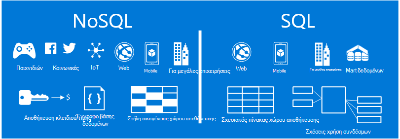
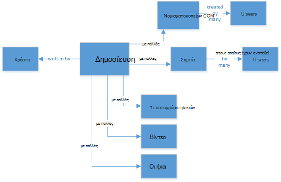
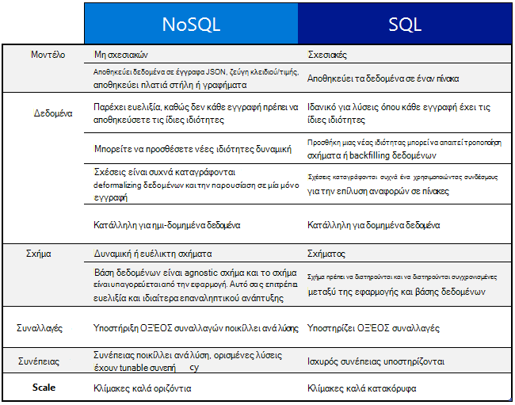
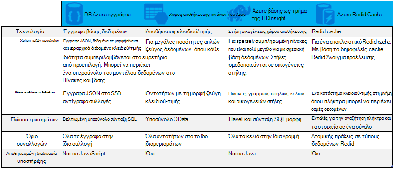

<properties
    pageTitle="Πότε να χρησιμοποιήσετε και στο NoSQL SQL | Microsoft Azure"
    description="Συγκρίνετε τα οφέλη της χρήσης NoSQL μη σχεσιακών λύσεις έναντι SQL λύσεις. Μάθετε εάν μία από τις υπηρεσίες του Microsoft Azure NoSQL ή SQL Server βέλτιστη χωράει το σενάριό σας."
    keywords="nosql και στο sql, πότε να χρησιμοποιήσετε NoSQL, nosql και στο sql"
    services="documentdb"
    documentationCenter=""
    authors="mimig1"
    manager="jhubbard"
    editor=""/>

<tags
    ms.service="documentdb"
    ms.workload="data-services"
    ms.tgt_pltfrm="na"
    ms.devlang="dotnet"
    ms.topic="article" 
    ms.date="06/24/2016"
    ms.author="mimig"/>

# Σύγκριση NoSQL SQL

SQL Server και σχεσιακές βάσεις δεδομένων (RDBMS) έχουν τη μετάβαση σε βάσεις δεδομένων για περισσότερα από 20 χρόνια. Ωστόσο, την αυξημένη χρειάζεται να επεξεργαστεί υψηλότερη όγκους και ποικιλιών δεδομένα με γρήγορη ταχύτητα έχει τροποποιηθεί τη φύση ανάγκες αποθήκευσης δεδομένων για προγραμματιστές εφαρμογών. Για να ενεργοποιήσετε αυτό το σενάριο, NoSQL βάσεις δεδομένων που επιτρέπουν την αποθήκευση των δεδομένων σε κλίμακα μη δομημένα και ετερογενή έχουν που αποκτήθηκε κατά δημοτικότητας. 

NoSQL είναι μια κατηγορία των βάσεων δεδομένων που έχουν διαφορετικά από βάσεις δεδομένων SQL. NoSQL χρησιμοποιείται συχνά για να ανατρέξετε στις συστημάτων διαχείρισης δεδομένων που είναι "Δεν SQL" ή προσέγγισης στη Διαχείριση δεδομένων που περιλαμβάνει το "Not μόνο SQL". Υπάρχουν αρκετά τεχνολογιών στην κατηγορία NoSQL, όπως βάσεις δεδομένων εγγράφου, αποθηκεύει τιμή του κλειδιού, στήλη οικογένειας αποθηκεύει και βάσεις δεδομένων γραφήματος, που είναι δημοφιλή με παιχνιδιών, κοινωνικές, και IoT εφαρμογές.

Ο στόχος αυτού του άρθρου είναι να σας βοηθήσει να μάθετε περισσότερα σχετικά με τις διαφορές μεταξύ NoSQL και SQL και παρέχει μια εισαγωγή σχετικά με το NoSQL και SQL προσφορές από τη Microsoft.  

## Πότε να χρησιμοποιήσετε NoSQL;

Ας φανταστείτε δημιουργείτε μια νέα τοποθεσία κοινωνικής δέσμευση. Οι χρήστες να δημιουργήσετε δημοσιεύσεις και να προσθέσετε εικόνες, βίντεο και μουσικής σε αυτά. Οι άλλοι χρήστες μπορούν να σχολιάσουν τις δημοσιεύσεις και δώστε σημεία (μου αρέσει) για να αξιολογήσετε τις δημοσιεύσεις. Η σελίδα προορισμού θα έχει μια τροφοδοσία των δημοσιεύσεων που οι χρήστες μπορούν να κάνουν κοινή χρήση και να αλληλεπιδράσετε με. 

Πώς μπορείτε να αποθηκεύσετε αυτά τα δεδομένα; Εάν είστε εξοικειωμένοι με την SQL, μπορείτε να ξεκινήσετε τη σχεδίαση κάπως έτσι:

Εδώ, καλά, αλλά τώρα σκεφτείτε τη δομή μίας μόνο δημοσίευσης και τον τρόπο για να το εμφανίσετε. Εάν θέλετε να εμφανίσετε την καταχώρηση και την συσχετισμένες εικόνες, ήχο, βίντεο, σχόλια, σημεία και πληροφορίες χρήστη σε μια τοποθεσία Web ή μια εφαρμογή, θα πρέπει να εκτελέσετε ένα ερώτημα με οκτώ σύνδεσμοι πίνακα μόνο για την ανάκτηση του περιεχομένου. Τώρα φανταστείτε μια ροή των δημοσιεύσεων που δυναμικά φόρτωση και εμφανίζεται στην οθόνη και μπορείτε εύκολα να πρόβλεψης ότι πρόκειται να απαιτούν χιλιάδων ερωτημάτων και πολλά συνδέσμους για να ολοκληρώσετε την εργασία.

Τώρα μπορείτε να χρησιμοποιήσετε μια σχεσιακή λύση όπως SQL Server για την αποθήκευση των δεδομένων - αλλά υπάρχει μια άλλη επιλογή, μια επιλογή NoSQL που απλοποιεί την προσέγγιση. Με τη μετατροπή τη δημοσίευση σε ένα έγγραφο JSON όπως τα εξής και αποθηκεύοντάς τα σε DocumentDB, μια υπηρεσία Azure NoSQL εγγράφου βάσης δεδομένων, μπορείτε να αυξήσετε τις επιδόσεις και να ανακτήσετε τη ολόκληρη δημοσίευση με ένα ερώτημα και χωρίς συνδέσμους. Είναι ένα απλούστερο, πιο απλό και περισσότερες performant έχει ως αποτέλεσμα.

    {
        "id":"ew12-res2-234e-544f",
        "title":"post title",
        "date":"2016-01-01",
        "body":"this is an awesome post stored on NoSQL",
        "createdBy":User,
        "images":["http://myfirstimage.png","http://mysecondimage.png"],
        "videos":[
            {"url":"http://myfirstvideo.mp4", "title":"The first video"},
            {"url":"http://mysecondvideo.mp4", "title":"The second video"}
        ],
        "audios":[
            {"url":"http://myfirstaudio.mp3", "title":"The first audio"},
            {"url":"http://mysecondaudio.mp3", "title":"The second audio"}
        ]
    }

Επιπλέον, αυτά τα δεδομένα να είναι διαμερίσματα με αναγνωριστικό καταχώρησης παρέχει τα δεδομένα για να κλιμακωθεί ομαλά ανάληψη και επωφεληθείτε από NoSQL κλίμακα χαρακτηριστικά. Επίσης NoSQL συστήματα επιτρέπουν στους προγραμματιστές χαλάρωση συνέπειας και παρέχουν ιδιαίτερα διαθέσιμων εφαρμογών.  Τέλος, αυτή η λύση δεν απαιτεί στους προγραμματιστές να ορίζουν, να διαχειριστείτε και να διατηρήσετε σχήματος στο επίπεδο δεδομένων επιτρέπει τη γρήγορη διαδοχικών προσεγγίσεων.

Στη συνέχεια, μπορείτε να δημιουργήσετε αυτήν τη λύση με άλλες υπηρεσίες του Azure:

- [Azure αναζήτησης](https://azure.microsoft.com/services/search/) μπορεί να χρησιμοποιηθεί μέσω της εφαρμογής web για να επιτρέψετε στους χρήστες για να αναζητήσετε δημοσιεύσεις.
- [Azure εφαρμογή υπηρεσιών](https://azure.microsoft.com/services/app-service/) μπορεί να χρησιμοποιηθεί για τη φιλοξενία των εφαρμογών και διεργασίες παρασκηνίου.
- [Χώρος αποθήκευσης αντικειμένων Blob του Azure](https://azure.microsoft.com/services/storage/) μπορεί να χρησιμοποιηθεί για την αποθήκευση προφίλ πλήρους χρηστών, συμπεριλαμβανομένων των εικόνων.
- [Βάση δεδομένων SQL Azure](https://azure.microsoft.com/services/sql-database/) μπορεί να χρησιμοποιηθεί για την αποθήκευση τεράστιες ποσότητες δεδομένων, όπως οι πληροφορίες σύνδεσης και δεδομένων για ανάλυση χρήσης.
- [Azure μηχανικής εκμάθησης](https://azure.microsoft.com/services/machine-learning/) μπορεί να χρησιμοποιηθεί για τη δημιουργία γνώσεων και πληροφοριών που μπορεί να παρέχετε σχόλια για τη διαδικασία και να κάνουν το σωστό περιεχόμενο στους χρήστες δεξιά.

Αυτή η τοποθεσία κοινωνικής δέσμευση είναι απλώς ένα ένα σενάριο στο οποίο NoSQL βάση δεδομένων είναι το μοντέλο δεδομένων δεξιά για το έργο. Εάν σας ενδιαφέρει ανάγνωσης περισσότερα σχετικά με αυτό το σενάριο και πώς μπορείτε να του μοντέλου δεδομένων σας για DocumentDB σε εφαρμογές μέσα κοινωνικής δικτύωσης, ανατρέξτε στο θέμα [μεταβαίνοντας κοινωνικών με DocumentDB](documentdb-social-media-apps.md). 

## Σύγκριση SQL και στο NoSQL

Ο παρακάτω πίνακας συγκρίνει τις κύριες διαφορές μεταξύ NoSQL και SQL. 

Εάν μια βάση δεδομένων NoSQL καλύτερα ταιριάζει με τις απαιτήσεις σας, συνεχίστε με την επόμενη ενότητα για να μάθετε περισσότερα σχετικά με τις υπηρεσίες NoSQL που είναι διαθέσιμα από το Azure. Διαφορετικά, εάν μια βάση δεδομένων SQL καλύτερα τις ανάγκες σας, μεταβείτε στο [Τι είναι οι προσφορές του Microsoft SQL;](#what-are-the-microsoft-sql-offerings)

## Τι είναι το Microsoft Azure NoSQL προσφορές;

Azure περιλαμβάνει τέσσερις υπηρεσίες NoSQL πλήρης διαχείριση: 

- [Azure DocumentDB](https://azure.microsoft.com/services/documentdb/)
- [Χώρος αποθήκευσης πινάκων του Azure](https://azure.microsoft.com/services/storage/)
- [Azure HBase ως μέρος της HDInsight](https://azure.microsoft.com/services/hdinsight/)
- [Azure Redis Cache](https://azure.microsoft.com/services/cache/)

Το παρακάτω γράφημα σύγκρισης χαρτών εκτός του κλειδιού παράγοντες διαφοροποίησης για κάθε υπηρεσία. Μία που περιγράφει με μεγαλύτερη ακρίβεια τις ανάγκες της εφαρμογής σας; 

Εάν μία ή περισσότερες από αυτές τις υπηρεσίες ενδέχεται να καλύπτει τις ανάγκες της εφαρμογής σας, μάθετε περισσότερα σχετικά με τους ακόλουθους πόρους: 

- [Διαδρομή εκμάθησης DocumentDB](https://azure.microsoft.com/documentation/learning-paths/documentdb/) και [DocumentDB περιπτώσεις χρήσης](documentdb-use-cases.md)
- [Γρήγορα αποτελέσματα με το χώρο αποθήκευσης πινάκων του Azure](../storage/storage-dotnet-how-to-use-tables.md)
- [Τι είναι το HBase στο HDInsight](../hdinsight/hdinsight-hbase-overview.md)
- [Redis Cache διαδρομή εκμάθησης](https://azure.microsoft.com/documentation/learning-paths/redis-cache/)

Στη συνέχεια, μεταβείτε στο [επόμενα βήματα](#next-steps) για πληροφορίες δωρεάν δοκιμαστικής έκδοσης.

## Τι είναι οι προσφορές του Microsoft SQL;

Η Microsoft έχει πέντε προσφορές SQL: 

- [Βάση δεδομένων SQL Azure](https://azure.microsoft.com/services/sql-database/)
- [SQL Server σε εικονικές μηχανές οι Azure](https://azure.microsoft.com/services/virtual-machines/sql-server/)
- [SQL Server](https://www.microsoft.com/server-cloud/products/sql-server-2016/)
- [Αποθήκη δεδομένων του Azure SQL (έκδοση Preview)](https://azure.microsoft.com/services/sql-data-warehouse/)
- [Σύστημα αναλύσεων πλατφόρμα (συσκευή εσωτερικής εγκατάστασης)](https://www.microsoft.com/en-us/server-cloud/products/analytics-platform-system/)

Εάν σας ενδιαφέρει SQL Server σε μια εικονική μηχανή ή μια βάση δεδομένων SQL, στη συνέχεια, διαβάστε το θέμα [Επιλέξτε μια επιλογή SQL Server στο cloud: βάση δεδομένων SQL Azure (PaaS) ή του SQL Server σε Azure VM (IaaS)](../sql-database/sql-database-paas-vs-sql-server-iaas.md) για να μάθετε περισσότερα σχετικά με τις διαφορές μεταξύ των δύο.

Εάν σας αρέσει η καλύτερη επιλογή SQL ήχους, στη συνέχεια, μεταβείτε στο [SQL Server](https://www.microsoft.com/server-cloud/products/) για να μάθετε περισσότερα σχετικά με το ποια προϊόντα του Microsoft SQL και τις υπηρεσίες μας έχει για την προσφορά.

Στη συνέχεια, μεταβείτε στα [επόμενα βήματα](#next-steps) δωρεάν δοκιμαστική έκδοση και την αξιολόγηση συνδέσεις.

## Επόμενα βήματα

Σας προσκαλούμε να μάθετε περισσότερα σχετικά με τα προϊόντα μας SQL και NoSQL, δοκιμάζοντας τις δωρεάν. 

- Για όλες τις υπηρεσίες Azure, να εγγραφείτε για μια [δωρεάν δοκιμαστική έκδοση ενός μήνα](https://azure.microsoft.com/pricing/free-trial/) και να λαμβάνετε $200 να ξοδεύετε σε οποιαδήποτε από τις υπηρεσίες του Azure.
    - [Azure DocumentDB](https://azure.microsoft.com/services/documentdb/)
    - [Azure HBase ως μέρος της HDInsight](https://azure.microsoft.com/services/hdinsight/)
    - [Azure Redis Cache](https://azure.microsoft.com/services/cache/)
    - [Αποθήκη δεδομένων του Azure SQL (έκδοση Preview)](https://azure.microsoft.com/services/sql-data-warehouse/)
    - [Βάση δεδομένων SQL Azure](https://azure.microsoft.com/services/sql-database/)
    - [Χώρος αποθήκευσης πινάκων του Azure](https://azure.microsoft.com/services/storage/)

- Μπορείτε να αυξομείωσης μια [δοκιμαστική έκδοση του SQL Server 2016 σε εικονικό μηχάνημα](https://azure.microsoft.com/marketplace/partners/microsoft/sqlserver2016ctp33evaluationwindowsserver2012r2/) ή να λάβετε μια [δοκιμαστική έκδοση του SQL Server](https://www.microsoft.com/en-us/evalcenter/evaluate-sql-server-2016).
    - [SQL Server](https://www.microsoft.com/server-cloud/products/sql-server-2016/)
    - [SQL Server σε εικονικές μηχανές οι Azure](https://azure.microsoft.com/services/virtual-machines/sql-server/)

