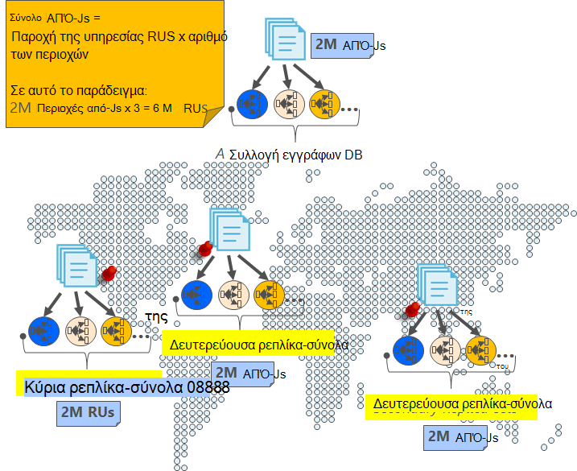
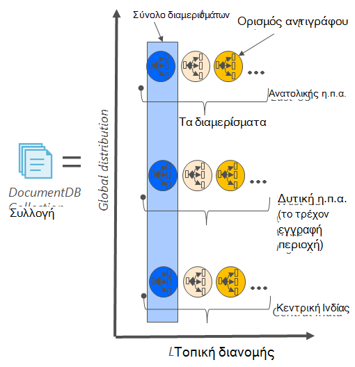
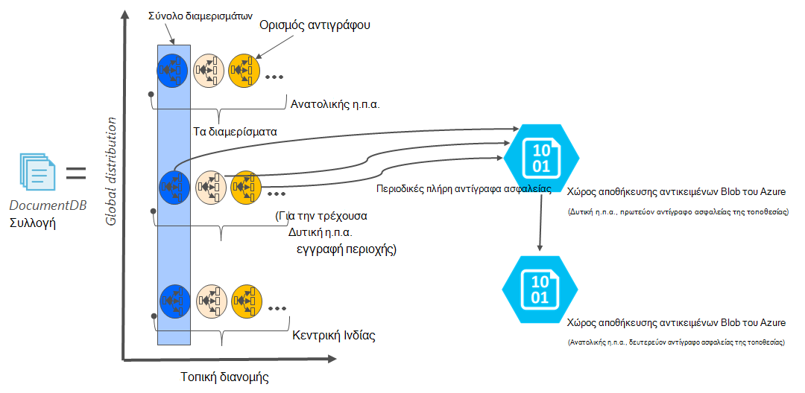

<properties
    pageTitle="Online αντιγράφων ασφαλείας και επαναφοράς με DocumentDB | Microsoft Azure"
    description="Μάθετε πώς να εκτελείτε την αυτόματη δημιουργία αντιγράφων ασφαλείας και επαναφορά των βάσεων δεδομένων NoSQL με Azure DocumentDB."
    keywords="Δημιουργία αντιγράφων ασφαλείας και επαναφορά, online δημιουργίας αντιγράφων ασφαλείας"
    services="documentdb"
    documentationCenter=""
    authors="RahulPrasad16"
    manager="jhubbard"
    editor="monicar"/>

<tags
    ms.service="documentdb"
    ms.workload="data-services"
    ms.tgt_pltfrm="na"
    ms.devlang="multiple"
    ms.topic="article"
    ms.date="09/23/2016"
    ms.author="raprasa"/>

# Αυτόματη online δημιουργία αντιγράφων ασφαλείας και επαναφορά με DocumentDB 

Azure DocumentDB λαμβάνει αυτόματα αντίγραφα ασφαλείας όλων των δεδομένων σας σε τακτά χρονικά διαστήματα. Η αυτόματη δημιουργία αντιγράφων ασφαλείας λαμβάνονται χωρίς να επηρεάζεται η απόδοση ή διαθεσιμότητα σας NoSQL λειτουργιών της βάσης δεδομένων. Όλα τα αντίγραφα ασφαλείας αποθηκεύονται ξεχωριστά σε άλλη υπηρεσία αποθήκευσης και αυτά τα αντίγραφα ασφαλείας αναπαράγονται καθολικά για υποστηρίζεται σε σχέση με τοπικές καταστροφές. Η αυτόματη δημιουργία αντιγράφων ασφαλείας προορίζονται για σενάρια, όταν διαγράψετε κατά λάθος τη συλλογή DocumentDB και νεότερες εκδόσεις απαιτούν ανάκτηση δεδομένων ή μια λύση αποκατάστασης από καταστροφή.  

Σε αυτό το άρθρο ξεκινά με ένα γρήγορο recap του πλεονασμού δεδομένων και διαθεσιμότητα στο DocumentDB και, στη συνέχεια, περιγράφεται η δημιουργία αντιγράφων ασφαλείας. 

## Υψηλή διαθεσιμότητα με DocumentDB - μια recap

DocumentDB έχει σχεδιαστεί για να [καθολικά κατανεμημένο](documentdb-distribute-data-globally.md) – σάς επιτρέπει να κλιμακωθεί μετάδοσης σε πολλές περιοχές Azure μαζί με την πολιτική βάσει ανακατεύθυνσης και διαφανές υποστήριξη πολλών δικτύων WebSite API του Yammer. Ως ένα σύστημα βάσης δεδομένων σας δίνει τη δυνατότητα [99,99% διαθεσιμότητα SLA](https://azure.microsoft.com/support/legal/sla/documentdb/v1_0/), όλες οι εγγραφές στο DocumentDB είναι παγιώνεται να τοπικών δίσκων από απαρτία αντίγραφα μέσα σε ένα κέντρο τοπικών δεδομένων προτού επιβεβαιώσει στον υπολογιστή-πελάτη. Σημειώστε ότι η υψηλή διαθεσιμότητα DocumentDB βασίζεται σε τοπική αποθήκευση και δεν εξαρτάται από τις τεχνολογίες εξωτερικού χώρου αποθήκευσης. Επιπλέον, εάν ο λογαριασμός σας βάση δεδομένων είναι συσχετισμένη με περισσότερες από μία περιοχή Azure, αναπαράγονται σε άλλες περιοχές καθώς και τις εγγραφές. Για να κλιμακωθεί τα δεδομένα σας μετάδοσης και την πρόσβαση στο χαμηλής των αδρανειών, μπορείτε να έχετε πολλές Διαβάστε τις περιοχές που σχετίζεται με το λογαριασμό σας βάση δεδομένων, όπως θέλετε. Σε κάθε περιοχή ανάγνωσης, τα δεδομένα (από αναπαραγωγή) είναι σταθερές κατάταξή σε ένα σύνολο αντιγράφου.  

Όπως φαίνεται στο ακόλουθο διάγραμμα, είναι μια ενιαία συλλογή DocumentDB [Οριζόντια διαμερίσματα](documentdb-partition-data.md). Μια "διαμερίσματα" δηλώνεται από έναν κύκλο στο παρακάτω διάγραμμα και κάθε partition διατίθεται ιδιαίτερα μέσω ενός συνόλου αντιγράφου. Αυτή είναι η τοπική κατανομή μέσα σε μία μόνο περιοχή Azure (δηλώνεται από τον άξονα X). Επιπλέον, κάθε διαμερίσματα (με το αντίστοιχο σύνολο ρεπλίκα), στη συνέχεια, κατανέμεται καθολικά σε πολλές περιοχές που σχετίζεται με το λογαριασμό βάσης δεδομένων (για παράδειγμα, στο αυτό περιοχές εικόνα τα τρία – Ανατολικής η.π.α., Δυτική η.π.α. και κεντρική Ινδίας). "Σύνολο διαμερισμάτων" είναι ένα καθολικά κατανεμημένο οντότητα που περιλαμβάνει πολλών αντιγράφων των δεδομένων σας σε κάθε περιοχή (δηλώνεται από τον άξονα Y). Μπορείτε να αντιστοιχίσετε προτεραιότητα στις περιοχές που σχετίζεται με το λογαριασμό σας βάσης δεδομένων και DocumentDB με διαφάνεια θα ανακατεύθυνση στην επόμενη περιοχή σε περίπτωση καταστροφής. Μπορείτε να προσομοιώσετε επίσης με μη αυτόματο τρόπο ανακατεύθυνσης για να ελέγξετε τη διαθεσιμότητα λήξης στο τέλος της εφαρμογής σας.  

Η παρακάτω εικόνα παρουσιάζει το υψηλό επίπεδο πλεονασμού με DocumentDB.

## Πλήρης, αυτόματη, online δημιουργίας αντιγράφων ασφαλείας

Λυπάμαι, έχω διαγράψει τη συλλογή ή βάση δεδομένων μου! Με DocumentDB, όχι μόνο τα δεδομένα σας, αλλά τα αντίγραφα ασφαλείας των δεδομένων σας πραγματοποιούνται επίσης ιδιαίτερα πλεονάζοντα και είναι ανθεκτικά για τοπικές καταστροφές. Αυτές οι αυτόματη δημιουργία αντιγράφων ασφαλείας λαμβάνονται τη συγκεκριμένη στιγμή κάθε τέσσερις ώρες περίπου. 

Η δημιουργία αντιγράφων ασφαλείας λαμβάνονται χωρίς να επηρεάζεται η απόδοση ή της διαθεσιμότητας των τις λειτουργίες της βάσης δεδομένων. DocumentDB μεταφέρει το αντίγραφο ασφαλείας στο παρασκήνιο χωρίς την προμήθεια του φακέλου RUs κατανάλωση ή που επηρεάζουν τις επιδόσεις και χωρίς να επηρεαστούν τη διαθεσιμότητα της βάσης δεδομένων σας NoSQL. 

Σε αντίθεση με τα δεδομένα σας που είναι αποθηκευμένο στο εσωτερικό DocumentDB, την αυτόματη δημιουργία αντιγράφων ασφαλείας αποθηκεύονται στο χώρο αποθήκευσης Blob του Azure υπηρεσίας. Για να εξασφαλίσετε την κατώτερη λανθάνων χρόνος/αποτελεσματική αποστολής, το στιγμιότυπο του αντιγράφου ασφαλείας σας αποστέλλεται σε μια παρουσία του χώρο αποθήκευσης αντικειμένων Blob του Azure στην ίδια περιοχή ως της τρέχουσας περιοχής εγγραφής του λογαριασμού σας DocumentDB βάσης δεδομένων. Για υποστηρίζεται σε σχέση με τις τοπικές ρυθμίσεις από καταστροφή, κάθε στιγμιότυπο των αντιγράφων ασφαλείας των δεδομένων σας στο χώρο αποθήκευσης Blob του Azure αναπαράγεται ξανά μέσω παν πλεονάζοντα αποθήκευσης (Εξοπλισμό) σε μια άλλη περιοχή. Το παρακάτω διάγραμμα δείχνει ότι το ολόκληρη η συλλογή DocumentDB (με όλα τρία πρωτεύοντα διαμερίσματα στη δυτική η.π.α., σε αυτό το παράδειγμα) είναι αντίγραφα ασφαλείας σε απομακρυσμένο λογαριασμό χώρο αποθήκευσης Blob του Azure στη δυτική η.π.α. και, στη συνέχεια, Εξοπλισμό αναπαραχθούν σε Ανατολικής ΗΠΑ. 

Η παρακάτω εικόνα παρουσιάζει περιοδικό πλήρη αντίγραφα ασφαλείας όλων των οντοτήτων DocumentDB στο χώρο αποθήκευσης Azure Εξοπλισμό.

## Περίοδος διατήρησης για μια δεδομένη στιγμιότυπο

Όπως περιγράφεται παραπάνω, κάνουμε περιοδικά στιγμιότυπα των δεδομένων σας και ανά μας κανονισμών συμμόρφωσης, θα σας κρατήσει την πιο πρόσφατη στιγμιότυπο προς τα επάνω στις 90 ημέρες πριν να το εμφανίσει λαμβάνει εκκαθάριση. Εάν ένα λογαριασμό ή μια συλλογή διαγράφεται, DocumentDB αποθηκεύει το τελευταίο αντίγραφο ασφαλείας για 90 ημέρες.

## Επαναφορά βάσης δεδομένων από το αντίγραφο ασφαλείας online

Σε περίπτωση που διαγράψετε κατά λάθος τα δεδομένα σας, μπορείτε να [ένα δελτίο υποστήριξης για το αρχείο](https://portal.azure.com/?#blade/Microsoft_Azure_Support/HelpAndSupportBlade) ή να [καλέσετε την υποστήριξη του Azure](https://azure.microsoft.com/support/options/) για να επαναφέρετε τα δεδομένα από την τελευταία αυτόματη δημιουργία αντιγράφων ασφαλείας. Για ένα συγκεκριμένο στιγμιότυπο του αντιγράφου ασφαλείας σας να γίνει επαναφορά, DocumentDB απαιτεί ότι τα δεδομένα ήταν τουλάχιστον διαθέσιμες μαζί μας στη διάρκεια του κύκλου αντιγράφου ασφαλείας για αυτό το στιγμιότυπο.

## Επόμενα βήματα

Για να αναπαραγάγετε τη βάση δεδομένων NoSQL σε πολλά κέντρα δεδομένων, ανατρέξτε στο θέμα [διανομή των δεδομένων σας καθολικά με DocumentDB](documentdb-distribute-data-globally.md). 

Αρχείο επαφή Azure υποστήριξη, [αρχείο δελτίου από την πύλη του Azure](https://portal.azure.com/?#blade/Microsoft_Azure_Support/HelpAndSupportBlade).