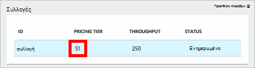
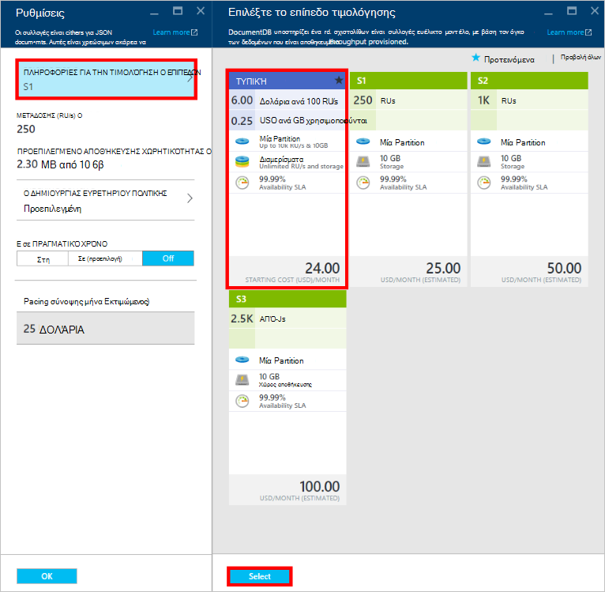
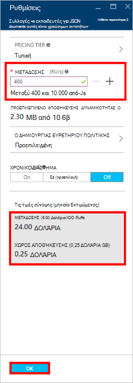
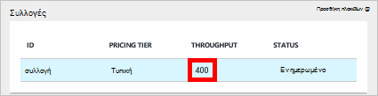

<properties
    pageTitle="Επίπεδα επιδόσεων στο DocumentDB | Microsoft Azure"
    description="Μάθετε περισσότερα σχετικά με τον τρόπο απόδοσης επίπεδα στο DocumentDB σάς επιτρέπουν να κράτηση μετάδοσης σε βάση ανά συλλογή."
    services="documentdb"
    authors="mimig1"
    manager="jhubbard"
    editor="monicar"
    documentationCenter=""/>

<tags
    ms.service="documentdb"
    ms.workload="data-services"
    ms.tgt_pltfrm="na"
    ms.devlang="na"
    ms.topic="article"
    ms.date="08/26/2016"
    ms.author="mimig"/>

# Επίπεδα επιδόσεων στο DocumentDB

Σε αυτό το άρθρο παρέχει μια επισκόπηση των επιπέδων επιδόσεων στο [Microsoft Azure DocumentDB](https://azure.microsoft.com/services/documentdb/).

Μετά την ανάγνωση αυτό το άρθρο, θα έχετε τη δυνατότητα να απαντούν στα παρακάτω ερωτήματα:  

-   Τι είναι ένα επίπεδο επιδόσεων;
-   Πώς είναι δεσμευμένο απόδοσης για ένα λογαριασμό της βάσης δεδομένων;
-   Πώς μπορώ να εργαστώ με επίπεδα επιδόσεων;
-   Πώς πραγματοποιώ να χρεωθεί για επίπεδα επιδόσεων;

## Εισαγωγή στις επιδόσεις

Κάθε συλλογή DocumentDB δημιουργηθεί κάτω από έναν τυπικό λογαριασμό παρέχεται με επίπεδο συσχετισμένη επιδόσεων. Κάθε συλλογή σε μια βάση δεδομένων μπορεί να έχει ένα επίπεδο διαφορετικών επιδόσεων επιτρέποντάς σας για να καθορίσετε περισσότερες μετάδοσης για τις συλλογές συχνά πρόσβαση και λιγότερο μετάδοσης για τις συλλογές συχνά πρόσβαση. DocumentDB υποστηρίζει δύο επίπεδα επιδόσεων που ορίζονται από το χρήστη και προ-που ορίζονται από το επίπεδο των επιδόσεων.  

Κάθε επίπεδο επιδόσεων έχει ένα όριο επιτόκιο συσχετισμένη [αίτηση μονάδας (RU)](documentdb-request-units.md) . Αυτή είναι η μετάδοση την οποία θα δεσμευτεί για μια συλλογή με βάση το επίπεδο επιδόσεων και είναι διαθέσιμη για χρήση από αυτήν τη συλλογή αποκλειστικά.

<table border="0" cellspacing="0" cellpadding="0">
    <tbody>
        <tr>
            <td valign="top">

</td>
            <td valign="top">
Λεπτομέρειες
</td>
            <td valign="top">
Όρια μετάδοσης
</td>
            <td valign="top">
Όρια χώρου αποθήκευσης
</td>
            <td valign="top">
Έκδοση
</td>
            <td valign="top">
APIs
</td>            
        </tr>
        <tr>
            <td valign="top">
Επιδόσεις που ορίζονται από το χρήστη
</td>
            <td valign="top">
Χώρος αποθήκευσης με βάση τη χρήση βάσει χρήση στο GB.

Μετάδοση σε μονάδες 100 RU/s
</td>
            <td valign="top">
Απεριόριστος χώρος. 400 - 250.000 αίτηση μονάδες/s από προεπιλογή (υψηλότερα από αίτηση)
</td>
            <td valign="top">
Απεριόριστος χώρος. 250 GB από προεπιλογή (υψηλότερα από αίτηση) 
</td>
            <td valign="top">
V2
</td>
            <td valign="top">
API 2015-12-16 και νεότερη έκδοση
</td>  
        </tr>
        <tr>
            <td valign="top">
Προκαθορισμένες επιδόσεων
</td>
            <td valign="top">
Δεσμευμένες και 10 GB χώρου αποθήκευσης.

S1 = 250 RU/s, S2 = 1000 RU/s, S3 = 2500 RU/s
</td>
            <td valign="top">
2500 RU/s
</td>
            <td valign="top">
10 GB
</td>
            <td valign="top">
V1
</td>
            <td valign="top">
Οποιαδήποτε
</td>  
        </tr>        
    </tbody>
</table>                

DocumentDB επιτρέπει για μια σειρά λειτουργιών βάσης δεδομένων, συμπεριλαμβανομένων των ερωτημάτων, ερωτημάτων με τις συναρτήσεις που ορίζονται από το χρήστη (UDF), αποθηκευμένες διαδικασίες και εναύσματα. Το κόστος επεξεργασίας που σχετίζονται με κάθε μία από αυτές τις λειτουργίες θα ποικίλλουν ανάλογα με το CPU, εισόδου/ΕΞΌΔΟΥ και μνήμη που απαιτείται για την ολοκλήρωση της λειτουργίας. Αντί για αυτό σκέφτεται και τη Διαχείριση πόροι υλικού, μπορείτε να θεωρήσετε μια μονάδα αίτηση ως μία μέτρηση για τους πόρους που απαιτείται για να εκτελέσετε διάφορες λειτουργίες βάσης δεδομένων και υπηρεσιών αίτησης εφαρμογής.

Συλλογές μπορούν να δημιουργηθούν μέσω του [Microsoft Azure πύλη](https://portal.azure.com), το [REST API](https://msdn.microsoft.com/library/azure/mt489078.aspx) ή οποιοδήποτε από τα [DocumentDB SDK](https://msdn.microsoft.com/library/azure/dn781482.aspx). Τα API DocumentDB σάς επιτρέπουν να καθορίσετε το επίπεδο επιδόσεων μιας συλλογής.

> [AZURE.NOTE] Το επίπεδο επιδόσεων μιας συλλογής μπορούν να ρυθμιστούν μέσω τα API ή του [Microsoft Azure πύλη](https://portal.azure.com/). Αλλαγές σε επίπεδο επιδόσεων είναι αναμενόμενο για να ολοκληρωθεί εντός 3 λεπτά.

## Ρύθμιση των επιπέδων επιδόσεων για τις συλλογές
Όταν δημιουργηθεί μια συλλογή, την πλήρη κατανομή των RUs με βάση το επίπεδο που έχει οριστεί ως απόδοσης είναι δεσμευμένο για τη συλλογή.

Σημειώστε ότι με δύο επίπεδα που ορίζονται από το χρήστη και προκαθορισμένες επιδόσεων, DocumentDB λειτουργεί με βάση δέσμευσης μεταγωγή. Με τη δημιουργία μιας συλλογής, μια εφαρμογή έχει δεσμευμένη και χρέωσης για το δεσμευμένο μετάδοσης ανεξάρτητα από τον όγκο της μετάδοσης που χρησιμοποιείται ενεργά. Με τα επίπεδα που ορίζονται από το χρήστη επιδόσεων, χώρου αποθήκευσης είναι με βάση τη χρήση που βασίζεται σε κατανάλωση, αλλά με προκαθορισμένες επιδόσεις, 10 GB χώρου αποθήκευσης είναι δεσμευμένο τη στιγμή της Δημιουργία συλλογής.  

Μετά τη δημιουργία συλλογών, μπορείτε να τροποποιήσετε το επίπεδο απόδοσης μέσω του SDK DocumentDB ή μέσω της πύλης κλασική Azure.

> [AZURE.IMPORTANT] Συλλογές DocumentDB τυπικής χρέωσης στο Ωριαία χρέωση και κάθε συλλογή δημιουργείτε θα χρεωθείτε για μια ελάχιστη και μία ώρα της χρήσης.

Εάν ρυθμίσετε το επίπεδο επιδόσεων μιας συλλογής μέσα σε μία ώρα, θα χρεώνεστε για το υψηλότερο επίπεδο επιδόσεων ρύθμιση κατά την ώρα. Για παράδειγμα, αν αυξήσετε το επίπεδο απόδοσης για μια συλλογή στις 8:53 ΠΜ που θα χρεωθεί για το νέο επίπεδο ξεκινώντας από 8:00 ΠΜ. Παρομοίως, εάν μπορείτε να μειώσετε το επίπεδο επιδόσεων στις 8:53 ΠΜ, τη νέα ταχύτητα θα εφαρμοστεί στις 9:00 ΠΜ.

Αίτηση μονάδες προορίζονται για κάθε συλλογή με βάση το σύνολο απόδοσης επιπέδου. Αίτηση μονάδας κατανάλωση αξιολογείται ως ένα ανά δεύτερο επιτόκιο. Εφαρμογές που υπερβαίνουν το ρυθμό μονάδας προμήθεια του φακέλου αίτησης (ή επίπεδο επιδόσεων) σε μια συλλογή θα να επιβραδύνει μέχρι το επιτόκιο αποθέτει κάτω από το επίπεδο δεσμευμένη για αυτήν τη συλλογή. Εάν η εφαρμογή σας απαιτεί υψηλότερο επίπεδο μετάδοσης, μπορείτε να αυξήσετε το επίπεδο απόδοσης για κάθε συλλογή.

> [AZURE.NOTE] Όταν η εφαρμογή σας υπερβαίνει επιπέδων επιδόσεων για μία ή πολλές συλλογές, θα να επιβραδύνει προσκλήσεις σε βάση ανά συλλογή. Αυτό σημαίνει ότι ορισμένες αιτήσεις εφαρμογής μπορεί να επιτύχει ενώ άλλοι μπορεί να επιβραδύνει. Καλό είναι να προσθέσετε ένα μικρό αριθμό των επαναλήψεων όταν επιβραδύνει προκειμένου να χειριστείτε αιχμές στην πρόσκληση σε κίνηση.

## Εργασία με επίπεδα επιδόσεων
DocumentDB συλλογές σάς επιτρέπουν να ομαδοποιήσετε τα δεδομένα σας με βάση το ερώτημα και τα μοτίβα επιδόσεων ανάγκες της εφαρμογής σας. Με DocumentDB της αυτόματης δημιουργίας ευρετηρίου και υποστήριξη ερωτημάτων, είναι αρκετά κοινά και για collocate ετερογενή εγγράφων μέσα στην ίδια συλλογή. Τα βασικά ζητήματα στο αποφασίζετε εάν θα πρέπει να χρησιμοποιείται ξεχωριστή συλλογές περιλαμβάνουν τα εξής:

- Ερωτήματα – μια συλλογή είναι το εύρος για την εκτέλεση του ερωτήματος. Εάν πρέπει να υποβολή ερωτήματος σε ένα σύνολο εγγράφων, τα πιο αποδοτικό Διαβάστε μοτίβα προέρχονται από collocating εγγράφων σε μια ενιαία συλλογή.
- Συναλλαγές – όλες οι συναλλαγές περιορίζονται σε μέσα σε μια μεμονωμένη συλλογή. Εάν έχετε τα έγγραφα που πρέπει να ενημερωθούν μέσα σε μια μεμονωμένη αποθηκευμένη διαδικασία ή έναυσμα, πρέπει να αποθηκεύονται μέσα στην ίδια συλλογή. Πιο συγκεκριμένα, έναν αριθμό-κλειδί partition μέσα σε μια συλλογή είναι το όριο συναλλαγή. Ανατρέξτε στο θέμα [διαμέριση στο DocumentDB](documentdb-partition-data.md) για περισσότερες λεπτομέρειες.
- Απόδοση απομόνωσης – μια συλλογή έχει ένα επίπεδο συσχετισμένη επιδόσεων. Αυτό εξασφαλίζει ότι κάθε συλλογή έχει μια προβλέψιμα απόδοση μέσω δεσμευμένη RUs. Δεδομένα μπορεί να εκχωρηθεί σε διαφορετικές συλλογές, με διαφορετικό επιδόσεις, με βάση συχνότητα πρόσβασης.

> [AZURE.IMPORTANT] Είναι σημαντικό να κατανοήσετε θα χρεώνεστε στην πλήρη τυπικές χρεώσεις με βάση τον αριθμό των συλλογών που δημιουργήθηκε από την εφαρμογή σας.

Συνιστάται να ότι η εφαρμογή σας κάνει χρήση της ένα μικρό αριθμό των συλλογών, εκτός αν έχετε μεγάλο απαιτήσεις αποθήκευσης ή μετάδοσης. Βεβαιωθείτε ότι μπορείτε έχει εύκολα κατανοητή διαδικασία εφαρμογής μοτίβα για τη δημιουργία νέων συλλογών. Μπορείτε να επιλέξετε να δεσμεύσετε Δημιουργία συλλογής ως ενέργεια διαχείρισης χειρισμού έξω από την εφαρμογή σας. Ομοίως, προσαρμόζοντας το επίπεδο απόδοσης για μια συλλογή θα αλλάξει το Ωριαία χρέωση, την οποία είναι χρεώθηκε για τη συλλογή. Θα πρέπει να μπορείτε να παρακολουθείτε συλλογής επιδόσεις, εάν η εφαρμογή σας προσαρμόζει αυτά τα δυναμικά.

## Αλλαγή από S1, S2, S3 σε επιδόσεων που ορίζονται από το χρήστη

Ακολουθήστε τα παρακάτω βήματα για να αλλάξετε από τη χρήση των επιπέδων προκαθορισμένες μετάδοσης στα επίπεδα που ορίζονται από το χρήστη μετάδοσης στην πύλη του Azure. Με τη χρήση μετάδοσης που ορίζονται από το χρήστη επίπεδα, μπορείτε να προσαρμόσετε την απόδοση για τις ανάγκες σας. Και αν εξακολουθείτε να χρησιμοποιείτε ένα λογαριασμό S1, μπορείτε να αυξήσετε την προεπιλεγμένη μετάδοσης από 250 RU/s σε 400 RU/s με λίγα μόνο κλικ.

Για περισσότερες πληροφορίες σχετικά με την ταχύτητα μεταγωγής σχετικά με την καθορισμένη από το χρήστη και προκαθορισμένες τιμολόγησης αλλαγές, ανατρέξτε στην καταχώρηση ιστολογίου [DocumentDB: όλα όσα πρέπει να γνωρίζετε σχετικά με τη χρήση των νέων επιλογών του τιμολόγησης](https://azure.microsoft.com/blog/documentdb-use-the-new-pricing-options-on-your-existing-collections/).

> [AZURE.VIDEO changedocumentdbcollectionperformance]

1. Στο πρόγραμμα περιήγησης, μεταβείτε στην [**πύλη του Azure**](https://portal.azure.com).
2. Κάντε κλικ στην επιλογή **Αναζήτηση** -> **DocumentDB λογαριασμούς**, στη συνέχεια, επιλέξτε το λογαριασμό DocumentDB για να τροποποιήσετε.   
3. Στο το φακό **βάσεις δεδομένων** , επιλέξτε τη βάση δεδομένων για να τροποποιήσετε και, στη συνέχεια, στο blade τη **βάση δεδομένων** , επιλέξτε τη συλλογή για να τροποποιήσετε. Οι λογαριασμοί που χρησιμοποιούν προκαθορισμένες μετάδοσης έχετε τις πληροφορίες τιμολόγησης επίπεδο του S1, S2 ή S3.

      

4. Στο το blade **συλλογές** , κάντε κλικ στην επιλογή **περισσότερα**, στη συνέχεια, **Ρυθμίσεις** στην επάνω γραμμή.   
5. Στο το blade **Ρυθμίσεις** , κάντε κλικ στην επιλογή **Σειρά τις τιμές** και παρατηρήστε ότι η μηνιαία εκτίμηση κόστους για κάθε πρόγραμμα εμφανίζεται στο το blade **Επιλέξτε το επίπεδο τις πληροφορίες τιμολόγησης** . Για να αλλάξετε μετάδοσης που ορίζονται από το χρήστη, κάντε κλικ στην επιλογή **Τυπική**και, στη συνέχεια, κάντε κλικ στο κουμπί **επιλογή** για να αποθηκεύσετε την αλλαγή.

      

6. Πίσω στο το blade **Ρυθμίσεις** , η **Σειρά τις τιμές** έχει αλλάξει σε **Τυπική** και το πλαίσιο **μετάδοσης (RU/s)** εμφανίζεται με προεπιλεγμένη τιμή 400. Ρύθμιση της ταχύτητας μετάδοσης μεταξύ 400 έως 10.000 [αίτηση μονάδες](documentdb-request-units.md)/second (RU/s). Η **Τιμολόγηση σύνοψης** στο κάτω μέρος της σελίδας ενημερώνεται αυτόματα για την παροχή μια εκτίμηση της το μηνιαίο κόστος. Κάντε κλικ στο **κουμπί OK** για να αποθηκεύσετε τις αλλαγές σας.

    

7. Επιστρέψτε στην blade τη **βάση δεδομένων** , μπορείτε να επαληθεύσετε τη νέα απόδοση της συλλογής.

    

Εάν αποφασίσετε ότι χρειάζεστε περισσότερες μετάδοσης (μεγαλύτερο από 10.000 RU/s) ή περισσότερο χώρο αποθήκευσης (μεγαλύτερο από 10GB) μπορείτε να δημιουργήσετε μια συλλογή διαμερίσματα. Για να δημιουργήσετε μια συλλογή διαμερίσματα, ανατρέξτε στο θέμα [Δημιουργία μιας συλλογής](documentdb-create-collection.md).

>[AZURE.NOTE] Αλλάζοντας τα επίπεδα των επιδόσεων μιας συλλογής ενδέχεται να χρειαστούν έως και 2 λεπτά.

## Αλλαγή των επιπέδων απόδοσης χρησιμοποιώντας το .NET SDK

Μια άλλη επιλογή για να αλλάξετε τις συλλογές επιδόσεις είναι μέσω μας SDK. Αυτή η ενότητα καλύπτει μόνο αλλάζοντας μια συλλογή επίπεδο επιδόσεων χρησιμοποιώντας το [.NET SDK](https://msdn.microsoft.com/library/azure/dn948556.aspx), αλλά η διαδικασία είναι παρόμοια για τα άλλα [SDK](https://msdn.microsoft.com/library/azure/dn781482.aspx). Εάν είστε εξοικειωμένοι με το .NET SDK, επισκεφθείτε το [πρόγραμμα εκμάθησης για γρήγορα αποτελέσματα](documentdb-get-started.md).

Ακολουθεί ένα τμήμα κώδικα για την αλλαγή της ταχύτητας μετάδοσης της προσφοράς σε 50.000 αίτηση μονάδες ανά δευτερόλεπτο:

    //Fetch the resource to be updated
    Offer offer = client.CreateOfferQuery()
                      .Where(r => r.ResourceLink == collection.SelfLink)    
                      .AsEnumerable()
                      .SingleOrDefault();

    // Set the throughput to 5000 request units per second
    offer = new OfferV2(offer, 5000);

    //Now persist these changes to the database by replacing the original resource
    await client.ReplaceOfferAsync(offer);

    // Set the throughput to S2
    offer = new Offer(offer);
    offer.OfferType = "S2";

    //Now persist these changes to the database by replacing the original resource
    await client.ReplaceOfferAsync(offer);

> [AZURE.NOTE] Συλλογές παρασχεθεί με 10.000 στην περιοχή αίτηση μονάδες ανά δεύτερο μπορείτε να μετεγκαταστήσετε το μεταξύ των προσφορών με μεταγωγή που ορίζονται από το χρήστη και προκαθορισμένες μετάδοσης (S1, S2, S3) ανά πάσα στιγμή. Συλλογές που έχουν παρασχεθεί με επάνω από 10.000 αίτηση μονάδες ανά δεύτερο δεν μπορεί να μετατραπεί σε επίπεδα προκαθορισμένες μετάδοσης.

Επισκεφτείτε το [MSDN](https://msdn.microsoft.com/library/azure/microsoft.azure.documents.client.documentclient.aspx) για να δείτε περισσότερα παραδείγματα και να μάθετε περισσότερα σχετικά με τις μεθόδους μας προσφορά:

- [**ReadOfferAsync**](https://msdn.microsoft.com/library/azure/microsoft.azure.documents.client.documentclient.readofferasync.aspx)
- [**ReadOffersFeedAsync**](https://msdn.microsoft.com/library/azure/microsoft.azure.documents.client.documentclient.readoffersfeedasync.aspx)
- [**ReplaceOfferAsync**](https://msdn.microsoft.com/library/azure/microsoft.azure.documents.client.documentclient.replaceofferasync.aspx)
- [**CreateOfferQuery**](https://msdn.microsoft.com/library/azure/microsoft.azure.documents.linq.documentqueryable.createofferquery.aspx)

## Αλλαγή της ταχύτητας μετάδοσης της συλλογής

Εάν χρησιμοποιείτε ήδη επιδόσεων που ορίζονται από το χρήστη, μπορείτε να αλλάξετε την ταχύτητα της συλλογής, κάνοντας τα εξής. Εάν θέλετε να αλλάξετε από ένα επίπεδο επιδόσεων S1, S2 ή S3 (προκαθορισμένες επιδόσεις) σε επιδόσεων που ορίζονται από το χρήστη, ανατρέξτε στο θέμα [Αλλαγή από S1, S2, S3 στις επιδόσεις που ορίζονται από το χρήστη](#changing-performance-levels-using-the-azure-portal).

1. Στο πρόγραμμα περιήγησης, μεταβείτε στην [**πύλη του Azure**](https://portal.azure.com).
2. Κάντε κλικ στην επιλογή **Αναζήτηση** -> **DocumentDB λογαριασμούς**, στη συνέχεια, επιλέξτε το λογαριασμό DocumentDB για να τροποποιήσετε.   
3. Στην το **λογαριασμό DocumentDB** blade, στο τον φακό **βάσεις δεδομένων** , επιλέξτε τη βάση δεδομένων για να τροποποιήσετε και, στη συνέχεια, στο blade τη **βάση δεδομένων** , επιλέξτε τη συλλογή για να τροποποιήσετε.
4. Στο το blade **συλλογές** , κάντε κλικ στην επιλογή **Ρυθμίσεις** στην επάνω γραμμή.   
5. Στο το blade **Ρυθμίσεις** , αυξήστε την τιμή στο πλαίσιο **μετάδοσης (RU/s)** και, στη συνέχεια, κάντε κλικ στο **κουμπί OK** για να αποθηκεύσετε την αλλαγή. Η **Τιμολόγηση σύνοψης** στο κάτω μέρος των ενημερώσεων blade για να εμφανίσετε το νέο εκτιμώμενη μηνιαίο κόστος αυτήν τη συλλογή σε μία μόνο περιοχή.

    

Εάν δεν είστε βέβαιοι πόσο για να αυξήσετε την ταχύτητα, ανατρέξτε στο θέμα [πρέπει Estimating μετάδοσης](documentdb-request-units.md#estimating-throughput-needs) και την [αίτηση Αριθμομηχανής μονάδα](https://www.documentdb.com/capacityplanner).

## Επόμενα βήματα

Για να μάθετε περισσότερα σχετικά με τις τιμές και διαχείριση δεδομένων με Azure DocumentDB, εξερευνήστε αυτούς τους πόρους:

- [Τις τιμές DocumentDB](https://azure.microsoft.com/pricing/details/documentdb/)
- [Διαχείριση DocumentDB δυναμικότητα](documentdb-manage.md)
- [Μοντελοποίηση δεδομένων στο DocumentDB](documentdb-modeling-data.md)
- [Δημιουργία διαμερισμάτων δεδομένων σε DocumentDB](documentdb-partition-data.md)
- [Αίτηση μονάδες](http://go.microsoft.com/fwlink/?LinkId=735027)

Για να μάθετε περισσότερα σχετικά με το DocumentDB, ανατρέξτε στην Azure DocumentDB [τεκμηρίωση](https://azure.microsoft.com/documentation/services/documentdb/).

Για να ξεκινήσετε με κλίμακα και επιδόσεων δοκιμών με DocumentDB, ανατρέξτε στο θέμα [επιδόσεις και την κλίμακα δοκιμών με Azure DocumentDB](documentdb-performance-testing.md).

[1]: ./media/documentdb-performance-levels/documentdb-change-collection-performance7-9.png
[2]: ./media/documentdb-performance-levels/documentdb-change-collection-performance10-11.png
