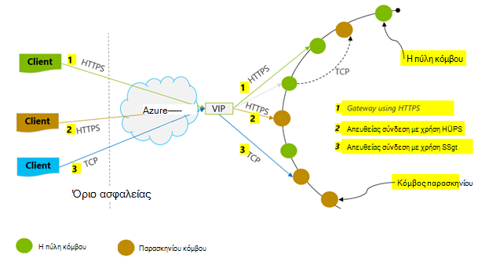
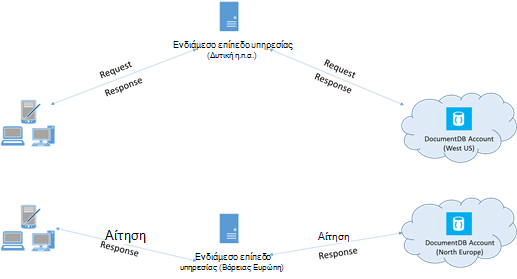

<properties 
    pageTitle="Συμβουλές επιδόσεων DocumentDB | Microsoft Azure" 
    description="Μάθετε τις επιλογές ρύθμισης παραμέτρων προγράμματος-πελάτη για βελτίωση της απόδοσης του Azure DocumentDB βάσης δεδομένων"
    keywords="πώς μπορείτε να βελτιώσετε την απόδοση της βάσης δεδομένων"
    services="documentdb" 
    authors="mimig1" 
    manager="jhubbard" 
    editor="" 
    documentationCenter=""/>

<tags 
    ms.service="documentdb" 
    ms.workload="data-services" 
    ms.tgt_pltfrm="na" 
    ms.devlang="na" 
    ms.topic="article" 
    ms.date="10/17/2016" 
    ms.author="mimig"/>

# Συμβουλές απόδοσης για DocumentDB

Azure DocumentDB είναι μια γρήγορη και ευέλικτη κατανεμημένη βάση δεδομένων που κλιμακώνει απρόσκοπτα με εγγυημένη λανθάνων χρόνος και απόδοση. Δεν χρειάζεται να κύρια αρχιτεκτονική αλλαγές ή να γράψετε σύνθετες κώδικα για να κλιμακωθεί τη βάση δεδομένων με DocumentDB. Κλιμάκωση προς τα επάνω ή προς τα κάτω είναι τόσο εύκολη όσο η πραγματοποίηση μια μεμονωμένη API κλήση ή μια [κλήση μεθόδου SDK](documentdb-performance-levels.md#changing-performance-levels-using-the-net-sdk). Ωστόσο, επειδή DocumentDB είναι πρόσβαση μέσω του δικτύου κλήσεις υπάρχουν βελτιστοποιήσεις πλευρά του προγράμματος-πελάτη που μπορείτε να κάνετε για να επιτύχετε μέγιστη απόδοση.

Έτσι εάν ζητάτε "Πώς μπορώ να βελτιώσω μου απόδοση της βάσης δεδομένων;" λάβετε υπόψη τις ακόλουθες επιλογές:

## Δικτύωση

1. **Πολιτική σύνδεσης: χρήση της κατάστασης λειτουργίας απευθείας σύνδεση**
    
    Πώς ένας υπολογιστής-πελάτης συνδέεται με Azure DocumentDB έχει σημαντικές συνέπειες επιδόσεις, ιδίως όσον αφορά παρατηρούμενη λανθάνων χρόνος πλευρά του προγράμματος-πελάτη. Υπάρχουν δύο βασικές ρυθμίσεις που είναι διαθέσιμες για τη ρύθμιση παραμέτρων προγράμματος-πελάτη πολιτικής σύνδεσης – η *λειτουργία* σύνδεσης και το [σύνδεσης *πρωτόκολλο*](#connection-protocol).  Τα δύο διαθέσιμα είναι:

    1. Κατάσταση πύλης (προεπιλογή)
    2. Άμεση λειτουργία

    Επειδή το DocumentDB είναι ένα σύστημα κατανεμημένες αποθήκευσης, δημιουργούνται διαμερίσματα DocumentDB πόρους, όπως συλλογές σε πολλά μηχανές και κάθε partition αναπαράγεται για υψηλή διαθεσιμότητα. Η λογική για μετάφραση ταχυδρομική διεύθυνση διατηρείται σε έναν πίνακα δρομολόγησης, που είναι επίσης διαθέσιμη εσωτερικά ως πόρο.

    Στη λειτουργία πύλης, οι υπολογιστές πύλης DocumentDB εκτέλεση αυτήν τη δρομολόγηση, επιτρέποντας κωδικός προγράμματος-πελάτη για να είναι απλή και συμπαγής. Μια εφαρμογή προγράμματος-πελάτη ζητήματα αιτήματα στα μηχανήματα πύλης DocumentDB, ποιες μετάφραση η λογική URI της αίτησης για την ταχυδρομική διεύθυνση του κόμβου παρασκηνίου και προώθηση της αίτησης σωστά.  Αντίθετα, σε άμεση λειτουργία προγράμματα-πελάτες πρέπει να διατηρήσετε – και περιοδική ανανέωση – ένα αντίγραφο του πίνακα δρομολόγησης, και, στη συνέχεια, συνδεθείτε απευθείας με τους κόμβους DocumentDB παρασκηνίου.

    Κατάσταση πύλης υποστηρίζεται σε όλες τις πλατφόρμες SDK και είναι η προεπιλεγμένη ρύθμιση παραμέτρων.  Εάν η εφαρμογή σας εκτελείται σε ένα εταιρικό δίκτυο με περιορισμούς αυστηρών τείχος προστασίας, πύλη λειτουργία είναι η καλύτερη επιλογή επειδή χρησιμοποιεί την τυπική θύρα HTTPS και ένα μεμονωμένο τελικό σημείο. Η ανταλλαγή επιδόσεων, ωστόσο, είναι ότι λειτουργία πύλης περιλαμβάνει μια μεταπήδηση επιπλέον δικτύου κάθε φορά που ανάγνωση ή εγγραφή σε DocumentDB δεδομένων.   Αυτόν το λόγο, άμεση λειτουργία προσφέρει καλύτερη απόδοση λόγω λιγότερες μεταπηδήσεις δικτύου.

2. **Πολιτική σύνδεσης: Χρησιμοποιήστε το πρωτόκολλο TCP**

    Όταν αξιοποίηση άμεση λειτουργία, υπάρχουν δύο επιλογές πρωτόκολλο που είναι διαθέσιμες:

    - TCP
    - HTTPS

    DocumentDB προσφέρει μια απλή και ανοίξτε το μοντέλο RESTful προγραμματισμού μέσω HTTPS. Επιπλέον, προσφέρει μια αποτελεσματική πρωτόκολλο TCP, το οποίο είναι επίσης RESTful στο το μοντέλο επικοινωνίας και είναι διαθέσιμες μέσω του προγράμματος-πελάτη .NET SDK. Άμεση TCP και HTTPS Χρησιμοποιήστε SSL για το αρχικό ελέγχου ταυτότητας και κρυπτογράφησης κίνηση. Για καλύτερες επιδόσεις, χρησιμοποιήστε το πρωτόκολλο TCP όταν είναι δυνατό. 

    Όταν χρησιμοποιείτε TCP σε λειτουργία πύλης, TCP θύρα 443 είναι η θύρα DocumentDB και 10250 είναι η θύρα MongoDB API. Όταν χρησιμοποιείτε TCP σε άμεση λειτουργία, εκτός από τις θύρες πύλης, θα πρέπει να βεβαιωθείτε ότι η θύρα μεταξύ των 10000 και 20000 είναι ανοιχτό, επειδή DocumentDB χρησιμοποιεί δυναμικές θύρες TCP. Εάν αυτές οι θύρες δεν είναι ανοιχτό και προσπαθήσετε να χρησιμοποιήσετε TCP, θα λάβετε ένα σφάλμα 503 υπηρεσία δεν είναι διαθέσιμη. 

    Η λειτουργία σύνδεσης έχει ρυθμιστεί κατά την κατασκευή της παρουσίας του DocumentClient με την παράμετρο ConnectionPolicy. Εάν χρησιμοποιείται άμεση λειτουργία, το πρωτόκολλο μπορεί επίσης να οριστεί εντός της παραμέτρου ConnectionPolicy.

        var serviceEndpoint = new Uri("https://contoso.documents.net");
        var authKey = new "your authKey from Azure Mngt Portal";
        DocumentClient client = new DocumentClient(serviceEndpoint, authKey, 
        new ConnectionPolicy
        {
            ConnectionMode = ConnectionMode.Direct,
            ConnectionProtocol = Protocol.Tcp
        });

    Επειδή το TCP υποστηρίζεται μόνο σε άμεση λειτουργία, εάν η λειτουργία πύλης χρησιμοποιείται, στη συνέχεια, το πρωτόκολλο HTTPS χρησιμοποιείται πάντα για την επικοινωνία με την πύλη και την τιμή πρωτόκολλο στο το ConnectionPolicy παραβλέπεται.

    

3. **Κλήση OpenAsync για να αποφύγετε λανθάνων χρόνος εκκίνησης στην πρώτη αίτηση**

    Από προεπιλογή, την πρώτη πρόσκληση θα έχει μια υψηλότερη λανθάνων χρόνος επειδή έχει για τη λήψη του πίνακα δρομολόγησης διεύθυνση. Για να αποφύγετε αυτό λανθάνων χρόνος εκκίνησης στην πρώτη αίτηση, θα πρέπει να καλέσετε OpenAsync() μία φορά κατά την προετοιμασία, ως εξής.

        await client.OpenAsync();

4. **Collocate πελάτη στο ίδιο Azure περιοχής για τις επιδόσεις**

    Όταν είναι δυνατό, τοποθετήστε τις εφαρμογές που καλούν DocumentDB στην ίδια περιοχή με τη βάση δεδομένων DocumentDB. Για μια σύγκριση κατά προσέγγιση, κλήσεις σε DocumentDB μέσα στην ίδια περιοχή ολοκληρώθηκε εντός ms 1-2, αλλά είναι το λανθάνοντος χρόνου μεταξύ του Δυτική και ανατολική ακτή της Ηνωμένες Πολιτείες > 50 ms. Ο λανθάνων χρόνος αυτό πιθανώς μπορεί να διαφέρει από αίτηση για να ζητήσετε ανάλογα με τη διαδρομή που λαμβάνονται από την αίτηση καθώς περνά από το πρόγραμμα-πελάτη στο όριο Azure κέντρου δεδομένων. Το μικρότερο πιθανές λανθάνων χρόνος είναι δυνατό, εξασφαλίζοντας την εφαρμογή κλήσης βρίσκεται μέσα στην ίδια περιοχή Azure ως την προμήθεια του φακέλου τελικό σημείο DocumentDB. Για μια λίστα των περιοχών διαθέσιμη, ανατρέξτε στο θέμα [Azure περιοχές](https://azure.microsoft.com/regions/#services).

    

5. **Αύξηση του αριθμού νήματα/εργασιών**

    Επειδή το κλήσεων στο DocumentDB γίνονται μέσω του δικτύου, ίσως χρειαστεί να διαφέρουν βαθμού παραλληλισμό των αιτήσεων σας ώστε να την εφαρμογή-πελάτη καταναλώνει ένα ένα πολύ μικρό χρόνου μεταξύ των αιτήσεων σε αναμονή. Για παράδειγμα, εάν χρησιμοποιείτε. Της Καθαρής [Παράλληλες βιβλιοθήκη εργασιών](https://msdn.microsoft.com//library/dd460717.aspx), δημιουργία στη σειρά εκατοντάδες εργασίες ανάγνωση ή την εγγραφή για να DocumentDB.

## Χρήση SDK

1. **Εγκαταστήστε το πιο πρόσφατο SDK**

    Το SDK DocumentDB είναι που βελτιωμένες συνεχώς να δώσετε τις καλύτερες επιδόσεις. Δείτε τις σελίδες [DocumentDB SDK](documentdb-sdk-dotnet.md) για να προσδιορίσετε το πιο πρόσφατο SDK και εξετάστε βελτιώσεις. 

2. **Χρησιμοποιήστε ένα πρόγραμμα-πελάτη DocumentDB singleton για τη διάρκεια ζωής της εφαρμογής σας**
  
    Σημειώστε ότι κάθε παρουσία DocumentClient ασφάλεια και εκτελεί Διαχείριση της σύνδεσης αποτελεσματική και διεύθυνση προσωρινή αποθήκευση όταν σε άμεση λειτουργία. Για να επιτρέψετε την αποτελεσματική σύνδεση διαχείρισης και καλύτερη απόδοση από DocumentClient, συνιστάται να χρησιμοποιήσετε μια μεμονωμένη περίοδο λειτουργίας του DocumentClient ανά AppDomain για τη διάρκεια ζωής της εφαρμογής.

3. **Αυξήστε το μέγιστο αριθμό System.Net ανά κεντρικού υπολογιστή**

    Οι αιτήσεις DocumentDB πραγματοποιούνται μέσω HTTPS/ΥΠΌΛΟΙΠΟ από προεπιλογή και υπόκεινται σε το προεπιλεγμένο όριο σύνδεσης ανά όνομα κεντρικού υπολογιστή ή τη διεύθυνση IP. Ίσως χρειαστεί να ορίσετε το μέγιστο αριθμό σε υψηλότερη τιμή (100-1000), έτσι ώστε στη βιβλιοθήκη του προγράμματος-πελάτη μπορούν να χρησιμοποιούν πολλές συνδέσεις ταυτόχρονα, για να DocumentDB. Με το .NET SDK 1.8.0 και παραπάνω, η προεπιλεγμένη τιμή για το [ServicePointManager.DefaultConnectionLimit](https://msdn.microsoft.com/library/system.net.servicepointmanager.defaultconnectionlimit.aspx) είναι 50 και για να αλλάξετε την τιμή, μπορείτε να ορίσετε το [Documents.Client.ConnectionPolicy.MaxConnectionLimit](https://msdn.microsoft.com/en-us/library/azure/microsoft.azure.documents.client.connectionpolicy.maxconnectionlimit.aspx) σε υψηλότερη τιμή.  

4. **Παράλληλες ερωτημάτων για συλλογές διαμερίσματα της ρύθμισης**

     DocumentDB .NET SDK έκδοση 1.9.0 και παραπάνω παράλληλες ερωτημάτων υποστήριξης, τα οποία σας επιτρέπουν να ερωτήματος μια συλλογή διαμερίσματα παράλληλα (ανατρέξτε στο θέμα [εργασία με το SDK](documentdb-partition-data.md#working-with-the-sdks) και τα σχετικά [δείγματα κώδικα](https://github.com/Azure/azure-documentdb-dotnet/blob/master/samples/code-samples/Queries/Program.cs) για περισσότερες πληροφορίες). Παράλληλες ερωτήματα έχουν σχεδιαστεί για να βελτιώσετε λανθάνων χρόνος ερωτήματος και απόδοση πάνω από το αντίστοιχο σειρά. Παράλληλες ερωτήματα παρέχουν δύο παραμέτρους που οι χρήστες μπορούν να ακρίβεια προσαρμοσμένη-Προσαρμογή τις απαιτήσεις, τους MaxDegreeOfParallelism (α): για να ελέγξετε το μέγιστο αριθμό των διαμερισμάτων από αυτές μπορούν να αναζητηθούν στο παράλληλα και MaxBufferedItemCount (b): για να ελέγξετε τον αριθμό των αποτελεσμάτων προ-ληφθεί. 
    
    (α) ***ρύθμισης MaxDegreeOfParallelism\: *** 
    παράλληλο ερωτήματος λειτουργεί κατά την υποβολή ερωτημάτων πολλά διαμερίσματα παράλληλα. Ωστόσο, δεδομένα από μια συλλογή μεμονωμένα διαμερίσματα έχει ληφθεί σειριακά σε σχέση με το ερώτημα. Έτσι, τη ρύθμιση του MaxDegreeOfParallelism στον αριθμό των διαμερισμάτων που έχει το μέγιστο ευκαιρία την επίτευξη περισσότερες ερώτημα performant, υπό την προϋπόθεση όλες τις άλλες συνθήκες συστήματος παραμένουν ίδιες. Εάν δεν γνωρίζετε τον αριθμό των διαμερισμάτων, μπορείτε να ορίσετε το MaxDegreeOfParallelism σε μεγαλύτερο αριθμό και το σύστημα θα επιλέξετε το ελάχιστο (αριθμός διαμερίσματα, εισαγωγή από το χρήστη που παρέχονται) ως το MaxDegreeOfParallelism. 
    
    Είναι σημαντικό να λάβετε υπόψη ότι παράλληλες ερωτήματα δημιουργήσουν τα καλύτερα πλεονεκτήματα εάν τα δεδομένα είναι ομοιόμορφα κατανεμημένη σε όλα τα διαμερίσματα σε σχέση με το ερώτημα. Εάν η συλλογή διαμερίσματα έχει διαμερίσματα έτσι ώστε όλα ή ένα μεγαλύτερο μέρος των τα δεδομένα που επιστρέφονται από ένα ερώτημα είναι πυκνό σε ορισμένα διαμερίσματα (ένα διαμερίσματα σε χειρότερες περίπτωση) και, στη συνέχεια, τις επιδόσεις του ερωτήματος θα είναι προβλήματα κυκλοφοριακής συμφόρησης από αυτά τα διαμερίσματα. 
    
    (β) ***ρύθμισης MaxBufferedItemCount\: *** 
    παράλληλες ερώτημα έχει σχεδιαστεί για τη προ-λήψη αποτελέσματα κατά την επεξεργασία της τρέχουσας δέσμης των αποτελεσμάτων από το πρόγραμμα-πελάτη. Η προ-λήψη βοηθά στη συνολική βελτίωσης λανθάνων χρόνος ερωτήματος. MaxBufferedItemCount είναι η παράμετρος για να περιορίσετε την ποσότητα των προ-ληφθεί αποτελεσμάτων. Ορισμός MaxBufferedItemCount στον αριθμό αναμενόμενα αποτελέσματα που επιστρέφονται (ή μεγαλύτερο αριθμό) επιτρέπει το ερώτημα για να λαμβάνετε μέγιστο όφελος από προ-λήψη. 
    
    Σημειώστε ότι προ-λήψη λειτουργεί με τον ίδιο τρόπο ανεξάρτητα από το MaxDegreeOfParallelism και υπάρχει ένα μεμονωμένο buffer για τα δεδομένα από όλα τα διαμερίσματα.  

5. **Ενεργοποιήστε την επιλογή καθολικός Κατάλογος πλευρά του διακομιστή**
    
    Μείωση της συχνότητας των εσφαλμένων μπορεί να σας βοηθήσουν σε ορισμένες περιπτώσεις. Στο .NET, ορίστε [gcServer](https://msdn.microsoft.com/library/ms229357.aspx) στην τιμή true.

6. **Υλοποίηση διπλασιασμών σε RetryAfter χρονικά διαστήματα**
 
    Κατά τις δοκιμές επιδόσεων, θα πρέπει να αυξήσετε φόρτωσης μέχρι να επιβραδύνει μικρές χρέωσης των αιτήσεων. Εάν επιβραδύνει, την εφαρμογή-πελάτη θα πρέπει να διπλασιασμών στην επιτάχυνση για το χρονικό διάστημα που καθορίζονται από διακομιστή "Επανάληψη". Την τήρηση των το διπλασιασμών εξασφαλίζει ότι που αφιερώνετε ελάχιστες αναμονή χρόνου μεταξύ των επαναλήψεων. Υποστήριξη πολιτικής "Επανάληψη" περιλαμβάνεται στην έκδοση 1.8.0 και παραπάνω των DocumentDB [.NET](documentdb-sdk-dotnet.md) και [Java](documentdb-sdk-java.md)και έκδοση 1.9.0 και παραπάνω [Node.js](documentdb-sdk-node.md) και [Python](documentdb-sdk-python.md). Για περισσότερες πληροφορίες, ανατρέξτε στο θέμα [Exceeding δεσμευμένη μετάδοσης τα όρια](documentdb-request-units.md#exceeding-reserved-throughput-limits) και [RetryAfter](https://msdn.microsoft.com/library/microsoft.azure.documents.documentclientexception.retryafter.aspx).

7. **Κλιμάκωση εκτός του προγράμματος-πελάτη-φόρτου εργασίας σας**

    Εάν κάνετε δοκιμές σε επίπεδα υψηλής απόδοσης (> 50.000 RU/s), την εφαρμογή-πελάτη μπορεί να γίνει η συμφόρηση λόγω του υπολογιστή ανωτάτου ορίου ανάληψη στη χρήση της CPU ή στο δίκτυο. Εάν φτάσετε αυτό το σημείο, μπορείτε να συνεχίσετε για να προωθήσετε το λογαριασμό DocumentDB περαιτέρω την κλίμακα ανάληψη σας εφαρμογές προγράμματος-πελάτη σε πολλούς διακομιστές.

8. **Cache εγγράφων URIs για κάτω λανθάνων χρόνος ανάγνωσης**

    Cache εγγράφων URIs όποτε είναι δυνατό για καλύτερες επιδόσεις ανάγνωσης.

9. **Με ακρίβεια το μέγεθος σελίδας για ερωτήματα/ανάγνωση τροφοδοσιών για καλύτερες επιδόσεις**

    Όταν εκτελέσετε μια μαζική ανάγνωση των εγγράφων με χρήση ανάγνωση τροφοδοσίας λειτουργίες (π.χ., ReadDocumentFeedAsync) ή όταν δημιουργείτε ένα ερώτημα DocumentDB SQL, τα αποτελέσματα επιστρέφονται με τμηματική τρόπο, εάν το σύνολο των αποτελεσμάτων είναι πολύ μεγάλο. Από προεπιλογή, τα αποτελέσματα επιστρέφονται στο μπλοκ 100 στοιχείων ή 1 MB, όριο πατήσετε πρώτα. 

    Για να μειώσετε τον αριθμό των δικτύου στρογγυλοποίηση ταξίδια που απαιτούνται για την ανάκτηση όλων των αποτελεσμάτων που εφαρμόζονται, μπορείτε να αυξήσετε το μέγεθος της σελίδας χρησιμοποιώντας κεφαλίδα αίτησης x-ms-max--πλήθος των στοιχείων σε 1000 προς τα επάνω. Στις περιπτώσεις όπου θέλετε να εμφανίσετε μόνο μερικά αποτελέσματα, π.χ., εάν API περιβάλλοντος εργασίας ή της εφαρμογής σας χρήστη επιστρέφει την τιμή 10 μόνο τα αποτελέσματα μιας ώρας, μπορείτε, επίσης, να μειώσετε το μέγεθος της σελίδας σε 10 για να μειώσετε την ταχύτητα μεταγωγής που καταναλώθηκε για διαβάζει και τα ερωτήματα.

    Μπορείτε επίσης να θέσετε το μέγεθος της σελίδας χρησιμοποιώντας το διαθέσιμο SDK DocumentDB.  Για παράδειγμα:
    
        IQueryable<dynamic> authorResults = client.CreateDocumentQuery(documentCollection.SelfLink, "SELECT p.Author FROM Pages p WHERE p.Title = 'About Seattle'", new FeedOptions { MaxItemCount = 1000 });

10. **Αύξηση του αριθμού νήματα/εργασιών**

    Ανατρέξτε στο θέμα [Αύξηση αριθμό νήματα/εργασιών](#increase-threads) στην ενότητα δικτύωσης.

## Δημιουργία ευρετηρίου πολιτικής

1. **Χρήση τεμπέλη δημιουργίας ευρετηρίου για ταχύτερη χρεώσεις κατάποσης ώρα κορύφωσης**

    DocumentDB σάς επιτρέπει να καθορίσετε – στο επίπεδο της συλλογής-μια πολιτική δημιουργίας ευρετηρίου, η οποία σας επιτρέπει να επιλέξετε εάν θέλετε τα έγγραφα σε μια συλλογή ώστε να είναι αυτόματα στο ευρετήριο ή όχι.  Επιπλέον, μπορείτε επίσης να επιλέξετε μεταξύ σύγχρονη (συνεπής) και ασύγχρονης ενημερώσεις ευρετηρίου (αργό). Από προεπιλογή, το ευρετήριο ενημερώνεται σύγχρονη σε κάθε εισαγωγή, αντικατάσταση ή διαγραφή ενός εγγράφου στη συλλογή. Σύγχρονη λειτουργία επιτρέπει τα ερωτήματα να εκτελέσει το ίδιο [επίπεδο συνέπειας](documentdb-consistency-levels.md) με το έγγραφο διαβάζει χωρίς καθυστέρηση για το ευρετήριο για "να ενημερωθείτε".
    
    Μπορεί να θεωρηθεί τεμπέλη δημιουργίας ευρετηρίου για σενάρια όπου δεδομένων είναι γραμμένο σε καταιγισμό και θέλετε να amortize τις εργασίες που απαιτούνται για το ευρετήριο περιεχομένου σε έναν εκτεταμένο χρονικό διάστημα. Τεμπέλη ευρετηρίου σας επιτρέπει επίσης να χρησιμοποιήσετε την προμήθεια του φακέλου μετάδοσης αποτελεσματική και λειτουργήσει αιτήσεις εγγραφής κορύφωσης φορές με ελάχιστους λανθάνοντα χρόνο. Είναι σημαντικό να λάβετε υπόψη, ωστόσο, ότι όταν είναι ενεργοποιημένη η δημιουργία ευρετηρίου τεμπέλη, αποτελέσματα του ερωτήματος θα εμφανίσει συνεπή ανεξάρτητα από το επίπεδο συνέπειας έχει ρυθμιστεί για το λογαριασμό DocumentDB.

    Επομένως, συνεπή κατάσταση λειτουργίας δημιουργίας ευρετηρίου (IndexingPolicy.IndexingMode έχει οριστεί σε συνεπής) των περιλαμβάνει την υψηλότερη χρέωση μονάδας αίτηση ανά εγγραφής, κατά τη δημιουργία ευρετηρίου λειτουργία (IndexingPolicy.IndexingMode έχει οριστεί σε αργό) και χωρίς τη δημιουργία ευρετηρίου αργό (IndexingPolicy.Automatic έχει οριστεί σε False) έχουν μηδενικό δημιουργίας ευρετηρίου κόστος τη στιγμή της εγγραφής.

2. **Εξαίρεση διαδρομές που δεν χρησιμοποιείται από τη δημιουργία ευρετηρίου για ταχύτερη εγγραφές**

    Πολιτική δημιουργίας ευρετηρίου της DocumentDB επίσης σάς επιτρέπει να καθορίσετε ποιες διαδρομές εγγράφου για να συμπεριλάβετε ή να εξαιρέσετε από το ευρετήριο, αξιοποίηση διαδικασίες δημιουργίας ευρετηρίου (IndexingPolicy.IncludedPaths και IndexingPolicy.ExcludedPaths). Η χρήση της δημιουργίας ευρετηρίου διαδρομές μπορεί να προσφέρει επιδόσεις βελτιωμένη εγγραφής και αποθήκευσης κατώτατου ευρετηρίου για σενάρια όπου τα μοτίβα ερωτήματος είναι γνωστό εκ των προτέρων, δημιουργίας ευρετηρίου κόστους απευθείας συσχετίζονται με τον αριθμό των μοναδικών διαδρομές σε ευρετήριο.  Για παράδειγμα, ο ακόλουθος κώδικας δείχνει πώς μπορείτε να αποκλείσετε μια ολόκληρη ενότητα των εγγράφων (ρομποτική ένα δευτερεύον δέντρο) από δημιουργίας ευρετηρίου με χρήση του "*" μπαλαντέρ.

        var collection = new DocumentCollection { Id = "excludedPathCollection" };
        collection.IndexingPolicy.IncludedPaths.Add(new IncludedPath { Path = "/*" });
        collection.IndexingPolicy.ExcludedPaths.Add(new ExcludedPath { Path = "/nonIndexedContent/*");
        collection = await client.CreateDocumentCollectionAsync(UriFactory.CreateDatabaseUri("db"), excluded);

    Για περισσότερες πληροφορίες, ανατρέξτε στο θέμα [DocumentDB πολιτικές δημιουργίας ευρετηρίου](documentdb-indexing-policies.md).

## Μετάδοσης

1. **Μέτρηση και την ακρίβεια για κάτω αίτηση μονάδες/δευτερόλεπτο χρήση**

    DocumentDB προσφέρει μια σειρά λειτουργιών βάσης δεδομένων, συμπεριλαμβανομένων των σχεσιακών και ιεραρχικών ερωτημάτων με UDF, αποθηκευμένων διαδικασιών και εναυσμάτων – λειτουργικές στα έγγραφα μέσα σε μια συλλογή βάσης δεδομένων. Το κόστος που συσχετίζεται με κάθε μία από αυτές τις λειτουργίες ποικίλλουν ανάλογα με το CPU εισόδου/ΕΞΌΔΟΥ και μνήμης που απαιτείται για την ολοκλήρωση της λειτουργίας. Αντί να σκέφτεστε και τη Διαχείριση πόροι υλικού, μπορείτε να θεωρήσετε μια μονάδα αίτηση (RU) ως μία μέτρηση για τους πόρους που απαιτούνται για να εκτελέσετε διάφορες λειτουργίες βάσης δεδομένων και υπηρεσιών αίτησης εφαρμογής.

    [Αίτηση μονάδες](documentdb-request-units.md) έχουν παρασχεθεί για κάθε λογαριασμό βάσης δεδομένων με βάση τον αριθμό μονάδων χωρητικότητας που αγοράσατε. Πρόσκληση σε μονάδα κατανάλωση αξιολογείται ως ένα ποσοστό ανά δευτερόλεπτο. Εφαρμογές που υπερβαίνουν το επιτόκιο μονάδας προμήθεια του φακέλου αίτησης για λογαριασμό τους περιορίζεται μέχρι το επιτόκιο αποθέτει κάτω από το επίπεδο δεσμευμένη για το λογαριασμό. Εάν η εφαρμογή σας απαιτεί υψηλότερο επίπεδο μετάδοσης, μπορείτε να αγοράσετε επιπλέον χωρητικότητα μονάδες.

    Την πολυπλοκότητα του ερωτήματος επηρεάζει τον αριθμό των μονάδων αίτηση είναι που καταναλώθηκε για μια λειτουργία. Ο αριθμός των κατηγορήματα, φύση τα κατηγορήματα, αριθμός UDF και το μέγεθος του συνόλου δεδομένων προέλευσης όλα επηρεάζει το κόστος των λειτουργιών ερωτημάτων.

    Για να μετρήσετε το επιβάρυνσης οποιαδήποτε λειτουργίας (δημιουργία, ενημέρωση ή διαγραφή), έλεγχος κεφαλίδα x ms-αίτηση-χρέωση (ή η ισοδύναμη ιδιότητα RequestCharge στο ResourceResponse<T> ή FeedResponse<T> στο .NET SDK) για να μετρήσετε τον αριθμό των μονάδων αίτηση που καταναλώνεται από αυτές τις λειτουργίες.

        // Measure the performance (request units) of writes
        ResourceResponse<Document> response = await client.CreateDocumentAsync(collectionSelfLink, myDocument);
        Console.WriteLine("Insert of document consumed {0} request units", response.RequestCharge);
        // Measure the performance (request units) of queries
        IDocumentQuery<dynamic> queryable = client.CreateDocumentQuery(collectionSelfLink, queryString).AsDocumentQuery();
        while (queryable.HasMoreResults)
             {
                  FeedResponse<dynamic> queryResponse = await queryable.ExecuteNextAsync<dynamic>();
                  Console.WriteLine("Query batch consumed {0} request units", queryResponse.RequestCharge);
             }
        
    Το φορτίο αίτηση επιστρέφονται στο αυτή η κεφαλίδα είναι ένα κλάσμα από την προμήθεια του φακέλου μετάδοσης (π.χ., RUs 2000 / δεύτερο). Για παράδειγμα, εάν το παραπάνω ερώτημα επιστρέφει 1000 1KB έγγραφα, το κόστος της εργασίας θα είναι 1000. Ως εκ τούτου, μέσα σε ένα δεύτερο, ο διακομιστής τηρεί μόνο δύο αυτές τις αιτήσεις πριν περιορισμού οι επακόλουθες απαιτήσεις. Για περισσότερες πληροφορίες, ανατρέξτε στο θέμα [αίτηση μονάδες](documentdb-request-units.md) και την [αίτηση μονάδας Αριθμομηχανής](https://www.documentdb.com/capacityplanner).

2. **Λαβή επιτόκιο περιορισμός αίτηση επιτόκιο πολύ μεγάλο**

    Όταν ένας υπολογιστής-πελάτης επιχειρεί να υπερβαίνει το δεσμευμένο απόδοσης για ένα λογαριασμό, υπάρχουν χωρίς υποβάθμιση επιδόσεων στο διακομιστή και χωρίς χρήση μετάδοσης χωρητικότητας πέρα από το δεσμευμένο επίπεδο. Ο διακομιστής preemptively θα τερματίσετε την αίτηση με RequestRateTooLarge (HTTP κωδικός κατάστασης 429) και να επιστρέψετε στην κεφαλίδα x-ms-"Επανάληψη"-μετά από-ms που υποδεικνύει το χρονικό διάστημα, σε χιλιοστά του δευτερολέπτου, ο χρήστης πρέπει να αναμονής πριν από την reattempting την αίτηση.
 
        HTTP Status 429,
        Status Line: RequestRateTooLarge
        x-ms-retry-after-ms :100

    Το SDK όλα ρητά Ενημερωθείτε αυτή η απόκριση τήρηση καθοριστεί διακομιστής "Επανάληψη"-μετά την κεφαλίδα και προσπαθήστε ξανά. Εκτός εάν ο λογαριασμός σας γίνεται πρόσβαση ταυτόχρονα από πολλούς υπολογιστές-πελάτες, θα ολοκληρωθεί με επιτυχία η επόμενη "Επανάληψη".

    Εάν έχετε περισσότερους από έναν υπολογιστή-πελάτη αθροιστικά λειτουργικό με συνέπεια επάνω από το επιτόκιο αίτηση, το πλήθος των επαναλήψεων προεπιλεγμένη προς το παρόν οριστεί στην τιμή 9 εσωτερικά από το πρόγραμμα-πελάτη ενδέχεται να μην αρκεί; σε αυτήν την περίπτωση, ο υπολογιστής-πελάτης παρουσιάζει ένα DocumentClientException με κωδικό κατάστασης 429 στην εφαρμογή. Το πλήθος των επαναλήψεων προεπιλογή μπορεί να αλλάξει, ορίζοντας την RetryOptions στην παρουσία ConnectionPolicy. Από προεπιλογή, το DocumentClientException με κωδικό κατάστασης 429 επιστρέφεται μετά από χρόνο αθροιστική Περιμένετε 30 δευτερόλεπτα, εάν η πρόσκληση σε εξακολουθεί να λειτουργούν πάνω από το επιτόκιο αίτηση. Αυτό συμβαίνει ακόμα και όταν το τρέχον πλήθος των επαναλήψεων είναι μικρότερος από το μέγιστο αριθμό των επαναλήψεων, είτε πρόκειται για την προεπιλεγμένη 9 ή μια τιμή που ορίζονται από το χρήστη.

    Ενώ η συμπεριφορά αυτόματης επανάληψης συμβάλλει στη βελτίωση υποστηρίζεται και χρηστικότητας για τις περισσότερες εφαρμογές, μπορεί να προκύψουν σε odds όταν κάνουν οι μετρήσεις επιδόσεων, ιδίως κατά τη μέτρηση λανθάνοντος χρόνου.  Το λανθάνων χρόνος προγράμματος-πελάτη παρατηρούμενη θα αιχμή εάν επισκέψεις η επιτάχυνση διακομιστή και έχει ως αποτέλεσμα το πρόγραμμα-πελάτη SDK για να επαναλάβετε την παρέμβαση του χρήστη. Για να αποφύγετε αιχμές λανθάνων χρόνος κατά τη διάρκεια της απόδοσης δοκιμές, μετρήστε την χρέωση που επιστρέφονται από κάθε λειτουργίας και βεβαιωθείτε ότι τα αιτήματα λειτουργούν κάτω από το επιτόκιο δεσμευμένη αίτηση. Για περισσότερες πληροφορίες, ανατρέξτε στο θέμα [αίτηση μονάδες](documentdb-request-units.md).
   
3. **Σχεδίαση για μικρότερες έγγραφα για την υψηλότερη μετάδοσης**

    Την αίτηση χρέωση (δηλαδή επεξεργασία πρόσκλησης σε κόστος) μιας δεδομένης λειτουργίας απευθείας είναι συσχετισμένη με το μέγεθος του εγγράφου. Λειτουργίες σε μεγάλα έγγραφα κοστίζουν περισσότερο από λειτουργίες για μικρές έγγραφα.

## Επίπεδα συνέπειας

1. **Χρήση πιο ασθενείς συνέπειας επίπεδα για βελτίωση των αδρανειών ανάγνωσης**

    Ένας άλλος σημαντικός παράγοντας για να λάβετε υπόψη κατά την απόδοση των εφαρμογών DocumentDB της ρύθμισης είναι επίπεδο συνέπειας. Η επιλογή του επιπέδου συνέπειας έχει επιπτώσεις στην απόδοση για ανάγνωσης και εγγραφής. Μπορείτε να ρυθμίσετε το προεπιλεγμένο επίπεδο συνέπειας στο λογαριασμό βάσης δεδομένων και το επίπεδο επιλογής συνέπειας, στη συνέχεια, ισχύει για όλες τις συλλογές (σε όλες τις βάσεις δεδομένων) στο λογαριασμό DocumentDB. Όσον αφορά τις λειτουργίες εγγραφής, την επίδραση της αλλαγής επιπέδου συνέπειας παρατηρείται ως λανθάνων χρόνος αίτησης. Καθώς χρησιμοποιούνται ισχυρότερο συνέπειας επίπεδα, θα αυξήσετε των αδρανειών εγγραφής. Από την άλλη πλευρά, την επίδραση των επίπεδο συνέπειας στις λειτουργίες ανάγνωσης παρατηρείται όσον αφορά την απόδοση. Πιο ασθενείς συνέπειας επίπεδα επιτρέπουν υψηλότερη Διαβάστε μετάδοσης για να πραγματοποιείται από το πρόγραμμα-πελάτη.

    Από προεπιλογή, όλα διαβάζει και τα ερωτήματα που εκδίδονται σε σχέση με τους πόρους που ορίζονται από το χρήστη θα χρησιμοποιήσει το προεπιλεγμένο επίπεδο συνέπειας που καθορίζεται στον λογαριασμό βάσης δεδομένων. Ωστόσο, μπορείτε να, μειώσετε το επίπεδο συνέπειας της πρόσκλησης σε συγκεκριμένο ανάγνωση/ερώτημα, καθορίζοντας την κεφαλίδα x ms-συνέπειας-επιπέδου αίτησης. Για περισσότερες πληροφορίες, ανατρέξτε στο θέμα [συνέπειας επίπεδα στο DocumentDB](documentdb-consistency-levels.md).

## Επόμενα βήματα

Για μια εφαρμογή δείγματος που χρησιμοποιούνται για την αξιολόγηση DocumentDB για σενάρια υψηλών επιδόσεων σε μερικά υπολογιστές-πελάτες, ανατρέξτε στο θέμα [επιδόσεις και την κλίμακα δοκιμών με Azure DocumentDB](documentdb-performance-testing.md).

Επίσης, για να μάθετε περισσότερα σχετικά με τη σχεδίαση της εφαρμογής για κλίμακα και υψηλών επιδόσεων, ανατρέξτε στο θέμα [διαμέριση και κλίμακας στο Azure DocumentDB](documentdb-partition-data.md).
