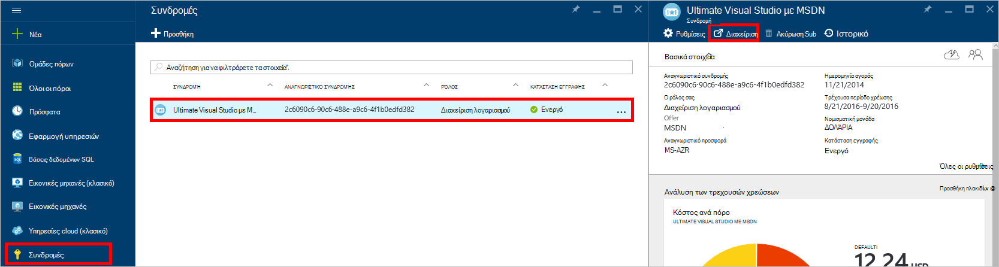
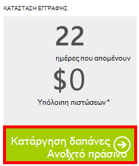

<properties
    pageTitle="Αντιμετώπιση προβλημάτων πύλης DocumentDB | Microsoft Azure"
    description="Μάθετε περισσότερα για την επίλυση προβλημάτων στην πύλη του DocumentDB Azure." 
    services="documentdb"
    documentationCenter=""
    authors="mimig1"
    manager="jhubbard"
    editor="monicar"/>

<tags
    ms.service="documentdb"
    ms.workload="data-services"
    ms.tgt_pltfrm="na"
    ms.devlang="na"
    ms.topic="article"
    ms.date="08/29/2016"
    ms.author="mimig"/>

# Azure DocumentDB πύλη συμβουλές αντιμετώπισης προβλημάτων

Σε αυτό το άρθρο περιγράφει τον τρόπο για να επιλύσετε θέματα DocumentDB στην πύλη του Azure. 

## Λείπουν οι πόροι

**Σύμπτωμα**: βάσεις δεδομένων ή συλλογές λείπουν από το λεπίδες πύλης.

**Λύση**: κάτω χρήση εφαρμογών για τη λειτουργία στην περιοχή του ορίου μέγιστη ταχύτητα μετάδοσης για τη συλλογή. 

**Επεξήγηση**: Η πύλη είναι μια εφαρμογή όπως οποιαδήποτε άλλη, πραγματοποίηση κλήσεων στις DocumentDB βάσης δεδομένων και τη συλλογή. Εάν σας αιτήσεις είναι αυτήν τη στιγμή που επιβραδύνει λόγω κλήσεις που γίνονται από μια ξεχωριστή εφαρμογή, την πύλη μπορεί να επίσης να επιβραδύνει, προκαλεί πόρους που δεν θα εμφανίζονται στην πύλη. Για να επιλύσετε το ζήτημα, διεύθυνση η αιτία της χρήσης υψηλής απόδοσης και, στη συνέχεια, ανανεώστε το πύλης blade. Μπορείτε να βρείτε πληροφορίες σχετικά με το πώς μπορείτε να μετρήσετε και η χρήση lower μετάδοσης στην ενότητα [μετάδοσης](documentdb-performance-tips.md#throughput) αυτού του άρθρου [συμβουλές επιδόσεων](documentdb-performance-tips.md) .
 
## Σελίδες ή λεπίδες δεν θα φορτώνεται

**Σύμπτωμα**: σελίδες και λεπίδες στην πύλη δεν εμφανίζονται.

**Λύση**: κάτω χρήση εφαρμογών για τη λειτουργία στην περιοχή του ορίου μέγιστη ταχύτητα μετάδοσης για τη συλλογή. 

**Επεξήγηση**: Η πύλη είναι μια εφαρμογή όπως οποιαδήποτε άλλη, πραγματοποίηση κλήσεων στις DocumentDB βάσης δεδομένων και τη συλλογή. Εάν σας αιτήσεις είναι αυτήν τη στιγμή που επιβραδύνει λόγω κλήσεις που γίνονται από μια ξεχωριστή εφαρμογή, την πύλη μπορεί να επίσης να επιβραδύνει, προκαλεί πόρους που δεν θα εμφανίζονται στην πύλη. Για να επιλύσετε το ζήτημα, διεύθυνση η αιτία της χρήσης υψηλής απόδοσης και, στη συνέχεια, ανανεώστε το πύλης blade. Μπορείτε να βρείτε πληροφορίες σχετικά με το πώς μπορείτε να μετρήσετε και η χρήση lower μετάδοσης στην ενότητα [μετάδοσης](documentdb-performance-tips.md#throughput) αυτού του άρθρου [συμβουλές επιδόσεων](documentdb-performance-tips.md) .

## Προσθήκη κουμπιού συλλογής είναι απενεργοποιημένη

**Σύμπτωμα**: στην blade τη βάση δεδομένων, το κουμπί **Προσθήκη συλλογής** είναι απενεργοποιημένο.

**Επεξήγηση**: Εάν τη συνδρομή σας στο Azure σχετίζεται με πιστώσεων οφέλη, όπως προσφέρεται δωρεάν πιστώσεων από μια συνδρομή στο MSDN και έχετε χρησιμοποιήσει όλες τις πιστώσεων του μήνα, δεν είναι δυνατή η δημιουργία τυχόν πρόσθετες συλλογές στο DocumentDB.

**Λύση**: καταργήστε το όριο εξόδων από το λογαριασμό σας.

1. Στην πύλη Azure, με το Jumpbar, κάντε κλικ στην επιλογή **συνδρομές**, κάντε κλικ στην επιλογή τη συνδρομή που σχετίζεται με τη βάση δεδομένων DocumentDB και, στη συνέχεια, στο blade τη **συνδρομή** , κάντε κλικ στην επιλογή **Διαχείριση**. 
    

2. Στο νέο παράθυρο του προγράμματος περιήγησης, θα δείτε ότι έχετε πλέον άλλες μονάδες. Κάντε κλικ στο κουμπί **Κατάργηση εξόδων ορίου** για να καταργήσετε το δαπάνες για την τρέχουσα περίοδο χρέωσης ή απεριόριστο χρονικό διάστημα. Στη συνέχεια, ολοκληρώστε τον οδηγό για να προσθέσετε ή να επιβεβαιώσετε τις πληροφορίες της πιστωτικής κάρτας. 
    

 
## Ολοκλήρωση της Εξερεύνησης ερώτημα με σφάλματα

Ανατρέξτε στο θέμα [Αντιμετώπιση προβλημάτων Explorer ερωτήματος](documentdb-query-collections-query-explorer.md#troubleshoot).

## Δεν υπάρχουν διαθέσιμα στην παρακολούθηση των πλακιδίων δεδομένα

Ανατρέξτε στο θέμα [Αντιμετώπιση προβλημάτων παρακολούθησης πλακίδια](documentdb-monitor-accounts.md#troubleshooting).

## Δεν υπάρχουν έγγραφα που επιστρέφονται στην Εξερεύνηση των εγγράφων

Ανατρέξτε στο θέμα [Αντιμετώπιση προβλημάτων Εξερεύνηση εγγράφων](documentdb-view-json-document-explorer.md#troubleshoot).

## Επόμενα βήματα

Εάν εξακολουθείτε να αντιμετωπίζετε προβλήματα στην πύλη, στείλτε μήνυμα ηλεκτρονικού ταχυδρομείου [askdocdb@microsoft.com](mailto:askdocdb@microsoft.com) για βοήθεια, αρχείο ή μια αίτηση τεχνικής υποστήριξης στην πύλη, κάνοντας κλικ στην επιλογή **Αναζήτηση**, **Βοήθεια + υποστήριξης**, και, στη συνέχεια, κάνοντας κλικ στην επιλογή **Δημιουργία αίτηση υποστήριξης**.
