<properties
    pageTitle="Πρόγραμμα εκμάθησης του Power BI για γραμμή σύνδεσης DocumentDB | Microsoft Azure"
    description="Χρησιμοποιήστε αυτό το πρόγραμμα εκμάθησης Power BI για να εισαγάγετε JSON, δημιουργία αναφορών έξυπνες και οπτικοποίηση δεδομένων, χρησιμοποιώντας τη γραμμή σύνδεσης DocumentDB και το Power BI."
    keywords="Power bi πρόγραμμα εκμάθησης, απεικόνιση δεδομένων, power bi γραμμής σύνδεσης"
    services="documentdb"
    authors="h0n"
    manager="jhubbard"
    editor="mimig"
    documentationCenter=""/>

<tags
    ms.service="documentdb"
    ms.workload="data-services"
    ms.tgt_pltfrm="na"
    ms.devlang="na"
    ms.topic="article"
    ms.date="09/22/2016"
    ms.author="hawong"/>

# Πρόγραμμα εκμάθησης του Power BI για DocumentDB: απεικόνιση δεδομένων χρησιμοποιώντας τη γραμμή σύνδεσης του Power BI

[PowerBI.com](https://powerbi.microsoft.com/) είναι μια ηλεκτρονική υπηρεσία, όπου μπορείτε να δημιουργήσετε και να κάνετε κοινή χρήση πινάκων εργαλείων και αναφορές με δεδομένα που είναι σημαντικά για εσάς και την εταιρεία σας.  Power BI Desktop είναι ένα αποκλειστικό εργαλείο που σας επιτρέπει να ανακτήσετε δεδομένα από διάφορες προελεύσεις δεδομένων, συγχώνευση και Μετασχηματισμός των δεδομένων, δημιουργία ισχυρών αναφορών και απεικονίσεων και δημοσιεύστε τις αναφορές στο Power BI σύνταξης αναφορών.  Με την πιο πρόσφατη έκδοση του Power BI Desktop, μπορείτε τώρα να συνδεθείτε στο λογαριασμό σας DocumentDB μέσω του DocumentDB connector για το Power BI.   

Σε αυτό το πρόγραμμα εκμάθησης Power BI, θα σας ακολουθήστε τα βήματα για να συνδεθείτε με ένα λογαριασμό DocumentDB στο Power BI Desktop, μεταβείτε σε μια συλλογή όπου θέλουμε να εξαγάγετε τα δεδομένα χρησιμοποιώντας το πρόγραμμα περιήγησης, μετασχηματισμός JSON δεδομένων σε μορφή πίνακα με χρήση του Power BI Desktop πρόγραμμα επεξεργασίας ερωτήματος, και δημιουργία και δημοσίευση έκθεσης στο PowerBI.com.

Μετά την ολοκλήρωση αυτού του προγράμματος εκμάθησης Power BI, θα έχετε τη δυνατότητα να απαντούν στα παρακάτω ερωτήματα:  

-   Πώς μπορώ να δημιουργήσω αναφορές με δεδομένα από DocumentDB χρήση του Power BI Desktop;
-   Πώς μπορώ να συνδεθώ σε ένα λογαριασμό DocumentDB στο Power BI Desktop;
-   Πώς μπορώ να ανακτήσετε δεδομένα από μια συλλογή στο Power BI Desktop;
-   Πώς μπορώ να μπορούν να μεταμορφώσουν ένθετη JSON δεδομένων στο Power BI Desktop;
-   Πώς μπορώ να δημοσιεύσετε και κοινή χρήση αναφορών μου στο PowerBI.com;

## Προαπαιτούμενα στοιχεία

Πριν να ακολουθήσετε τις οδηγίες σε αυτό το πρόγραμμα εκμάθησης Power BI, βεβαιωθείτε ότι έχετε τα εξής:

- [Η πιο πρόσφατη έκδοση του Power BI Desktop](https://powerbi.microsoft.com/desktop).
- Πρόσβαση σε μας επίδειξη λογαριασμό ή δεδομένων στο λογαριασμό σας Azure DocumentDB.
    - Ο λογαριασμός επίδειξη συμπληρώνεται με τα δεδομένα ηφαίστειο που εμφανίζονται σε αυτό το πρόγραμμα εκμάθησης. Αυτός ο λογαριασμός επίδειξη δεν είναι συνδεδεμένο με οποιαδήποτε SLA και προορίζεται για σκοπούς επίδειξης μόνο.  Αλλά θα σας διατηρεί το δικαίωμα να κάντε τροποποιήσεις σε αυτό το λογαριασμό επίδειξη συμπεριλαμβανομένων ενδεικτικά, τον τερματισμό του λογαριασμού, αλλάζοντας τον αριθμό-κλειδί, ο περιορισμός πρόσβασης, αλλαγή και να διαγράψετε τα δεδομένα, ανά πάσα στιγμή, χωρίς προειδοποίηση ή το λόγο για τον.
        - Διεύθυνση URL: https://analytics.documents.azure.com
        - Μόνο για ανάγνωση κλειδί: MSr6kt7Gn0YRQbjd6RbTnTt7VHc5ohaAFu7osF0HdyQmfR + YhwCH2D2jcczVIR1LNK3nMPNBD31losN7lQ/fkw ==
    - Εναλλακτικά, για να δημιουργήσετε το δικό σας λογαριασμό, ανατρέξτε στο θέμα [Δημιουργία λογαριασμού DocumentDB βάσης δεδομένων με την πύλη Azure](https://azure.microsoft.com/documentation/articles/documentdb-create-account/). Στη συνέχεια, για να ηφαίστειο δείγμα δεδομένων που είναι παρόμοιο με το τι χρησιμοποιείται σε αυτό το πρόγραμμα εκμάθησης (αλλά δεν περιέχει τα μπλοκ GeoJSON), ανατρέξτε στην [τοποθεσία NOAA](https://www.ngdc.noaa.gov/nndc/struts/form?t=102557&s=5&d=5) και, στη συνέχεια, εισαγάγετε τα δεδομένα χρησιμοποιώντας το [εργαλείο μετεγκατάστασης δεδομένων DocumentDB](https://azure.microsoft.com/documentation/articles/documentdb-import-data/).

Για να μοιραστείτε τις αναφορές στο PowerBI.com, πρέπει να έχετε ένα λογαριασμό στο PowerBI.com.  Για να μάθετε περισσότερα σχετικά με το Power BI για το δωρεάν και το Power BI Pro, επισκεφθείτε την τοποθεσία [https://powerbi.microsoft.com/pricing](https://powerbi.microsoft.com/pricing).

## Ας ξεκινήσουμε
Σε αυτό το πρόγραμμα εκμάθησης, ας φανταστείτε ότι ένα geologist μελέτη ηφαίστειο όλο τον κόσμο.  Τα δεδομένα ηφαίστειο είναι αποθηκευμένο σε ένα λογαριασμό DocumentDB και δείτε τα έγγραφα JSON όπως το παρακάτω.

    {
        "Volcano Name": "Rainier",
        "Country": "United States",
        "Region": "US-Washington",
        "Location": {
            "type": "Point",
            "coordinates": [
            -121.758,
            46.87
            ]
        },
        "Elevation": 4392,
        "Type": "Stratovolcano",
        "Status": "Dendrochronology",
        "Last Known Eruption": "Last known eruption from 1800-1899, inclusive"
    }

Θέλετε να ανακτήσετε τα δεδομένα ηφαίστειο από το λογαριασμό DocumentDB και την απεικόνιση δεδομένων σε μια διαδραστική αναφορά Power BI όπως κάτω από αυτό.

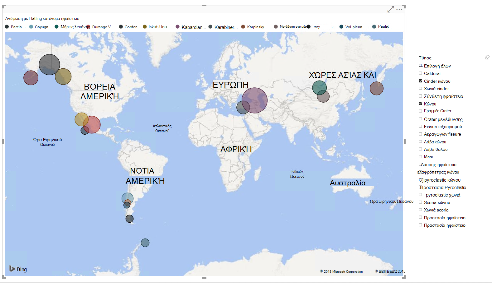

Είστε έτοιμοι να δοκιμάστε; Ας ξεκινήσουμε.

1. Εκτελέστε το Power BI Desktop στην σας σταθμούς εργασίας.
2. Όταν εκκινείται το Power BI Desktop, εμφανίζεται μια οθόνη *υποδοχής* .

    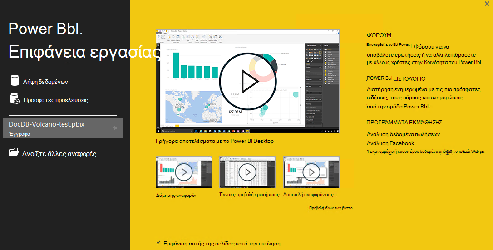

3. Μπορείτε να **Λάβετε δεδομένων**, ανατρέξτε στο θέμα **Πρόσφατες προελεύσεις**ή **Άνοιγμα άλλων αναφορών** απευθείας από την οθόνη *υποδοχής* .  Κάντε κλικ στο X στην επάνω δεξιά γωνία για να κλείσετε την οθόνη. Εμφανίζεται η προβολή **αναφοράς** του Power BI Desktop.

    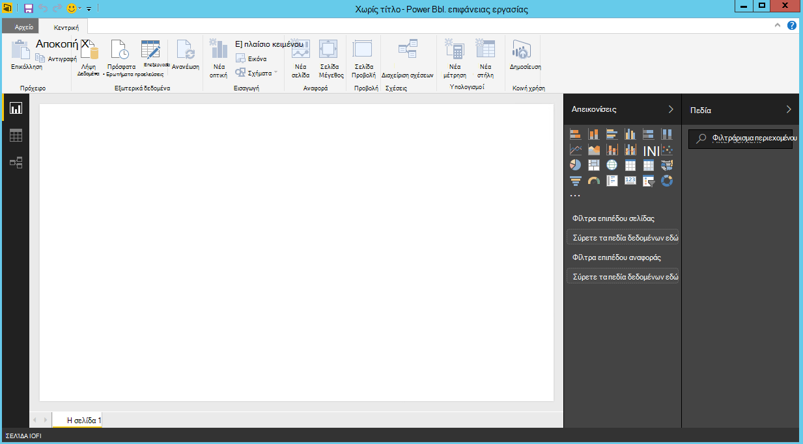

4. Επιλέξτε την κορδέλα **για οικιακή χρήση** και, στη συνέχεια, κάντε κλικ στο **Λήψη δεδομένων**.  Θα πρέπει να εμφανίζεται το παράθυρο **Γρήγορα δεδομένα** .

5. Κάντε κλικ στο **Azure**, επιλέξτε **Microsoft Azure DocumentDB (Beta)**και, στη συνέχεια, κάντε κλικ στην επιλογή **σύνδεση**.  Θα πρέπει να εμφανίζεται το παράθυρο του **Microsoft Azure DocumentDB σύνδεση** .

    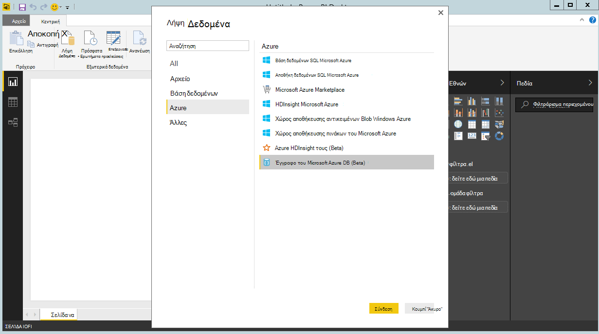

6. Καθορίστε τη διεύθυνση URL τελικό σημείο του DocumentDB λογαριασμού, που θέλετε να ανακτήσετε τα δεδομένα, όπως φαίνεται παρακάτω και, στη συνέχεια, κάντε κλικ στο κουμπί **OK**. Μπορείτε να ανακτήσετε τη διεύθυνση URL από το πλαίσιο URI blade τα **[πλήκτρα](documentdb-manage-account.md#keys)** του Azure πύλη ή μπορείτε να χρησιμοποιήσετε το λογαριασμό επίδειξη, οπότε είναι η διεύθυνση URL `https://analytics.documents.azure.com`. 

    Αφήστε το όνομα της βάσης δεδομένων, το όνομα συλλογής και πρότασης SQL κενό όπως αυτά τα πεδία είναι προαιρετικό.  Αντί για αυτό, θα χρησιμοποιήσουμε το πρόγραμμα περιήγησης για να επιλέξετε τη βάση δεδομένων και τη συλλογή για να προσδιορίσετε από πού προέρχονται τα δεδομένα.

    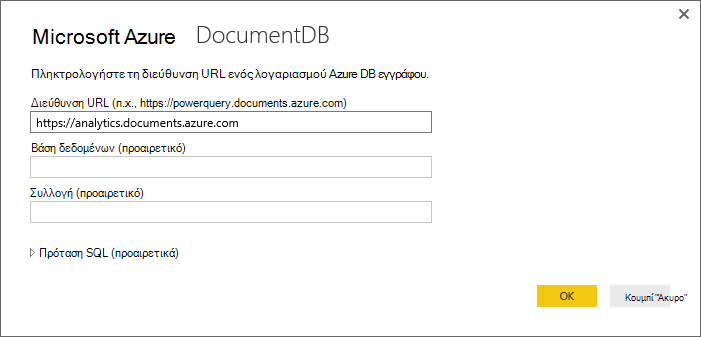

7. Εάν συνδέεστε σε αυτό το τελικό σημείο για πρώτη φορά, θα σας ζητηθεί για το κλειδί λογαριασμού.  Μπορείτε να ανακτήσετε τον αριθμό-κλειδί από το πλαίσιο **Πρωτεύον κλειδί** το blade **[πλήκτρα μόνο για ανάγνωση](documentdb-manage-account.md#keys)** του Azure πύλη, ή μπορείτε να χρησιμοποιήσετε το λογαριασμό επίδειξη, στις οποίες είναι πεζών-κεφαλαίων τον αριθμό-κλειδί `RcEBrRI2xVnlWheejXncHId6QRcKdCGQSW6uSUEgroYBWVnujW3YWvgiG2ePZ0P0TppsrMgscoxsO7cf6mOpcA==`. Εισαγάγετε τον αριθμό-κλειδί λογαριασμού και κάντε κλικ στην επιλογή **σύνδεση**.

    Συνιστάται να χρησιμοποιήσετε το κλειδί μόνο για ανάγνωση κατά τη δημιουργία αναφορών.  Αυτό θα εμποδίσει περιττές έκθεση του πρωτεύοντος κλειδιού για πιθανούς κινδύνους ασφαλείας. Το κλειδί μόνο για ανάγνωση είναι διαθέσιμη από το blade [πλήκτρα](documentdb-manage-account.md#keys) της πύλης Azure ή μπορείτε να χρησιμοποιήσετε τις πληροφορίες λογαριασμού επίδειξη που παρέχεται παραπάνω.

    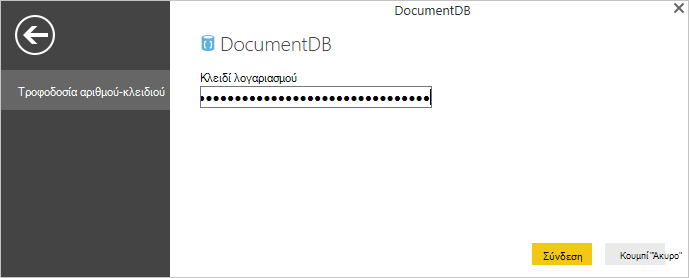

8. Όταν ο λογαριασμός είναι συνδεδεμένο με επιτυχία, θα εμφανιστεί το **πρόγραμμα περιήγησης** .  Το **πρόγραμμα περιήγησης** θα εμφανιστεί μια λίστα των βάσεων δεδομένων με το λογαριασμό.
9. Κάντε κλικ στην επιλογή και αναπτύξτε το στοιχείο από τη βάση δεδομένων των δεδομένων για την αναφορά θα από πού προέρχονται τα, εάν χρησιμοποιείτε το λογαριασμό επίδειξη, επιλέξτε **volcanodb**.   

10. Τώρα, επιλέξτε μια συλλογή που θα μπορείτε να ανακτήσετε τα δεδομένα από. Εάν χρησιμοποιείτε το λογαριασμό επίδειξη, επιλέξτε **volcano1**.

    Το παράθυρο προεπισκόπησης εμφανίζει μια λίστα στοιχείων **εγγραφής** .  Ένα έγγραφο εμφανίζεται ως τύπο **εγγραφής** στο Power BI. Ομοίως, μια ένθετη μπλοκ JSON μέσα σε ένα έγγραφο είναι επίσης μια **εγγραφή**.

    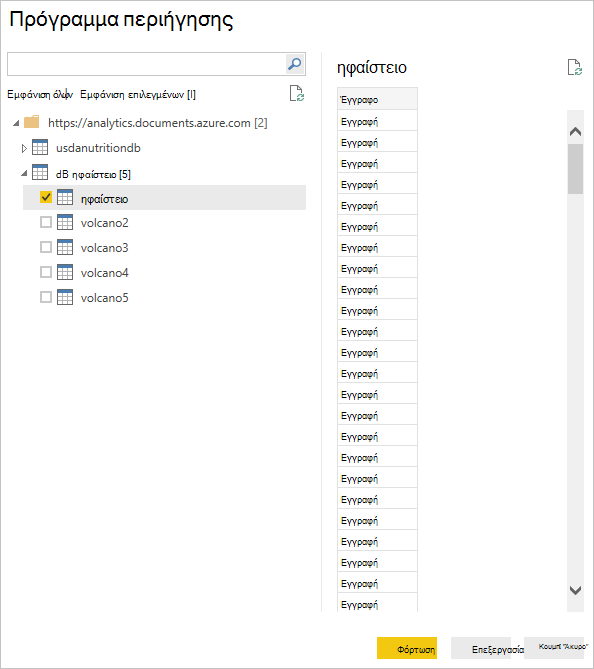

11. Κάντε κλικ στην επιλογή **Επεξεργασία** για να ξεκινήσετε το πρόγραμμα επεξεργασίας ερωτήματος, ώστε να σας μπορεί να μετασχηματισμός των δεδομένων.

## Ισοπέδωση και το μετασχηματισμό JSON εγγράφων
1. Στο πρόγραμμα Power BI επεξεργασίας ερωτήματος, θα πρέπει να βλέπετε μια στήλη **εγγράφου** στο κεντρικό τμήμα του παραθύρου.
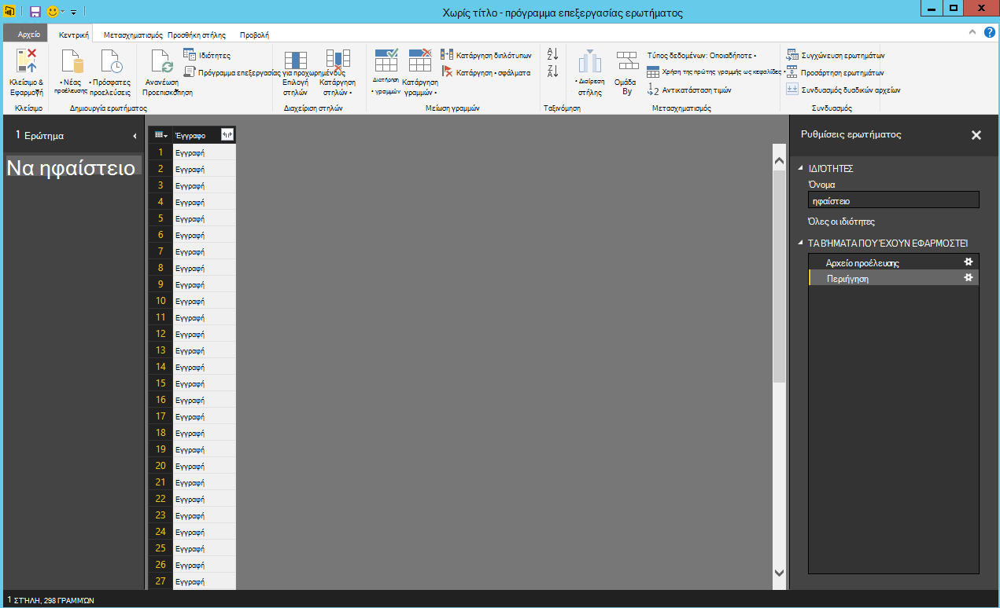

2. Κάντε κλικ στο το ανάπτυξης βρίσκεται στη δεξιά πλευρά της κεφαλίδας στήλης **εγγράφου** .  Θα εμφανιστεί το μενού περιβάλλοντος με μια λίστα πεδίων.  Επιλέξτε τα πεδία που χρειάζεστε για την αναφορά σας, για παράδειγμα, ηφαίστειο όνομα, χώρα, περιοχή, θέση, ανύψωση, τύπος, κατάσταση και τελευταία έκρηξη γνωρίζετε, και, στη συνέχεια, κάντε κλικ στο κουμπί **OK**.

    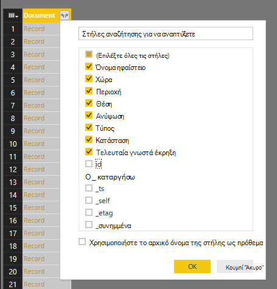

3. Το κεντρικό παράθυρο θα εμφανίζεται μια προεπισκόπηση του αποτελέσματος με τα επιλεγμένα πεδία.

    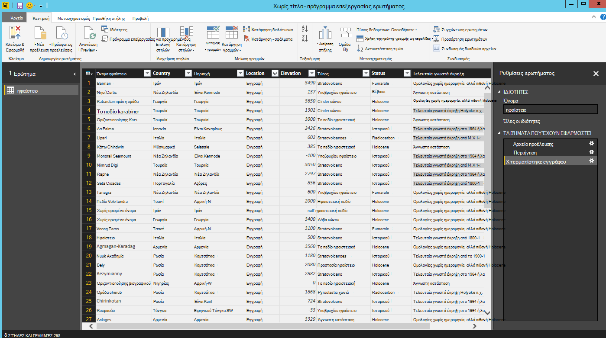

4. Στο παράδειγμά μας, η ιδιότητα θέση είναι ένα μπλοκ GeoJSON σε ένα έγγραφο.  Όπως μπορείτε να δείτε, θέση αποδίδεται με τον τύπο **εγγραφής** στο Power BI Desktop.  
5. Κάντε κλικ στο το ανάπτυξης βρίσκεται στη δεξιά πλευρά της κεφαλίδας στήλης θέση.  Το μενού περιβάλλοντος με τύπο και τις συντεταγμένες πεδία θα εμφανίζονται.  Ας επιλέξτε το πεδίο συντεταγμένων και κάντε κλικ στο κουμπί **OK**.

    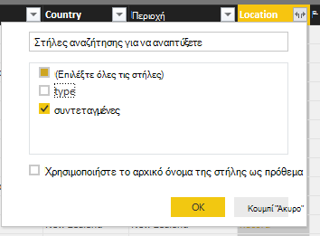

6. Το κεντρικό παράθυρο εμφανίζει τώρα μια στήλη συντεταγμένες τύπο **λίστας** .  Όπως φαίνεται στην αρχή του προγράμματος εκμάθησης, τα δεδομένα GeoJSON σε αυτό το πρόγραμμα εκμάθησης είναι τύπου σημείου με καταγράφονται στον πίνακα συντεταγμένες γεωγραφικού πλάτους και τιμές.

    Το στοιχείο συντεταγμένες [0] αντιπροσωπεύει γεωγραφικού ενώ συντεταγμένες [1] αντιπροσωπεύει γεωγραφικό πλάτος.
    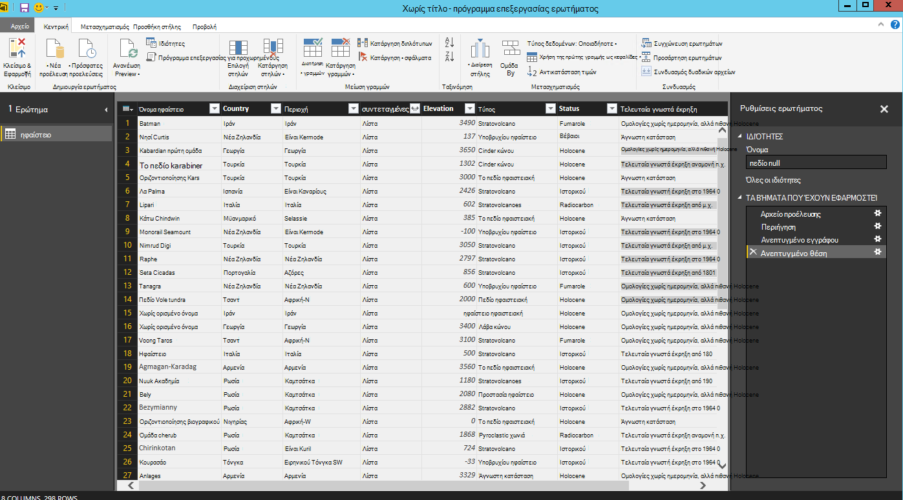

7. Για να ισοπεδώσετε συντεταγμένες έναν πίνακα, θα δημιουργήσουμε μια **Προσαρμοσμένη στήλη** που ονομάζεται LatLong.  Επιλέξτε την κορδέλα **Προσθήκη στήλης** και κάντε κλικ στην εντολή **Προσθήκη προσαρμοσμένης στήλης**.  Θα πρέπει να εμφανίζεται το παράθυρο **Προσθήκη προσαρμοσμένης στήλης** .

8. Δώστε ένα όνομα για τη νέα στήλη, π.χ. LatLong.

9. Στη συνέχεια, καθορίστε τον προσαρμοσμένο τύπο για τη νέα στήλη.  Για παράδειγμά μας, θα σας θα concatenate τις γεωγραφικού πλάτους και τιμές διαχωρισμένες με κόμμα, όπως φαίνεται παρακάτω χρησιμοποιώντας τον ακόλουθο τύπο: `Text.From([Document.Location.coordinates]{1})&","&Text.From([Document.Location.coordinates]{0})`. Κάντε κλικ στο **κουμπί OK**.

    Για περισσότερες πληροφορίες σε συμπεριλαμβανομένων συναρτήσεων DAX τη παραστάσεις ανάλυσης δεδομένων (DAX), επισκεφθείτε την τοποθεσία [Βασικές DAX στο Power BI Desktop](https://support.powerbi.com/knowledgebase/articles/554619-dax-basics-in-power-bi-desktop).

    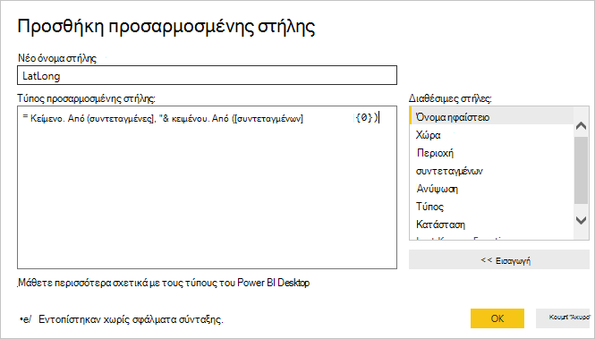

10. Τώρα, το κεντρικό παράθυρο θα εμφανίσει τη νέα στήλη LatLong συμπληρωμένη με τις γεωγραφικού πλάτους και τιμές διαχωρισμένες με κόμμα.

    

    Εάν λάβετε ένα μήνυμα σφάλματος στη νέα στήλη, βεβαιωθείτε ότι τα βήματα που έχουν εφαρμοστεί στην περιοχή ρυθμίσεις ερωτήματος ταιριάζουν στην παρακάτω εικόνα:

    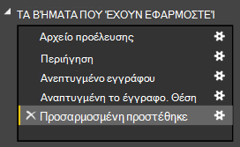

    Εάν τα βήματα διαφέρουν, διαγράψτε τα επιπλέον βήματα και προσπαθήστε ξανά να προσθέσετε την προσαρμοσμένη στήλη. 

11. Τώρα, θα σας έχουν ολοκληρωθεί ισοπέδωση τα δεδομένα σε μορφή πίνακα.  Μπορείτε να αξιοποιήσετε όλες τις δυνατότητες που είναι διαθέσιμες στο πρόγραμμα επεξεργασίας ερωτήματος στο σχήμα και Μετασχηματισμός των δεδομένων σε DocumentDB.  Εάν χρησιμοποιείτε το δείγμα, αλλάξτε τον τύπο δεδομένων για προβιβασμό **ακέραιο** αριθμό, αλλάζοντας τον **Τύπο δεδομένων** στην κορδέλα **για οικιακή χρήση** .

    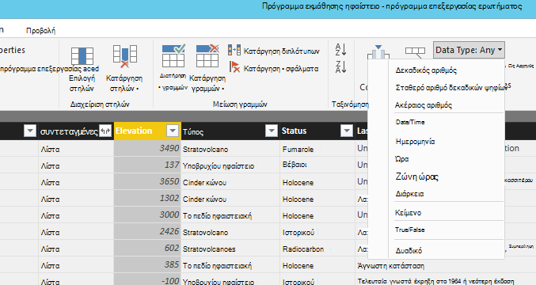

12. Κάντε κλικ στο κουμπί **Κλείσιμο και εφαρμογή** για να αποθηκεύσετε το μοντέλο δεδομένων.

    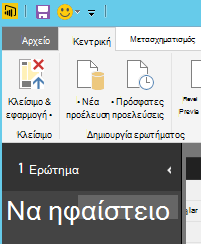

## Δημιουργήστε τις αναφορές
Power BI Desktop αναφοράς view είναι όπου μπορείτε να ξεκινήσετε τη δημιουργία αναφορών για την απεικόνιση δεδομένων.  Μπορείτε να δημιουργήσετε αναφορές με μεταφορά και απόθεση πεδίων σε τον καμβά **αναφοράς** .

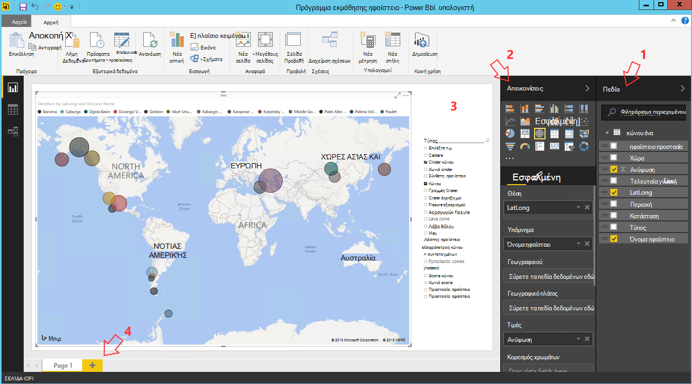

Στην προβολή έκθεσης, πρέπει να βρείτε:

 1. Τμήμα παραθύρου **πεδία** , αυτό είναι το σημείο όπου θα δείτε μια λίστα με τα μοντέλα δεδομένων με πεδία που μπορείτε να χρησιμοποιήσετε για τις αναφορές σας.

 2. Το παράθυρο **Απεικονίσεις** . Μια αναφορά μπορεί να περιέχει μία ή πολλές απεικονίσεις.  Επιλέξτε τους τύπους οπτική προσαρμόζοντας τις ανάγκες σας από το παράθυρο **Απεικονίσεις** .

 3. Ο καμβάς **αναφοράς** , αυτό είναι το σημείο όπου θα δημιουργήσετε τα οπτικά εφέ για την αναφορά σας.

 4. Σελίδα της **αναφοράς** . Μπορείτε να προσθέσετε πολλές σελίδες αναφοράς στο Power BI Desktop.

Η ακόλουθη εικόνα δείχνει τα βασικά βήματα τη δημιουργία μιας απλής έκθεσης αλληλεπιδραστική Προβολή χάρτη.

1. Για παράδειγμά μας, δημιουργούμε μια προβολή χάρτη που εμφανίζει τη θέση του κάθε ηφαίστειο.  Στο παράθυρο **Απεικονίσεις** , κάντε κλικ στον τύπο οπτική αντιστοίχιση με επισήμανση στο στιγμιότυπο οθόνης παραπάνω.  Θα πρέπει να βλέπετε στον τύπο του χάρτη οπτική χρωματισμένα στον καμβά **αναφοράς** .  Το παράθυρο **απεικόνισης** πρέπει να εμφανίζουν επίσης ένα σύνολο ιδιοτήτων που σχετίζονται με τον τύπο οπτική χάρτη.

2. Στη συνέχεια, σύρετε και αποθέστε το πεδίο LatLong από το παράθυρο " **πεδία** " στην ιδιότητα **θέση** στο τμήμα παραθύρου **Απεικονίσεις** .
3. Στη συνέχεια, σύρετε και αποθέστε το πεδίο Όνομα ηφαίστειο στην ιδιότητα **Υπόμνημα** .  

4. Στη συνέχεια, σύρετε και αποθέστε το πεδίο ανύψωση στην ιδιότητα **μέγεθος** .  

5. Τώρα θα πρέπει να βλέπετε το χάρτη οπτική που εμφανίζει ένα σύνολο Φυσαλίδες που υποδεικνύει τη θέση του κάθε ηφαίστειο με το μέγεθος της φυσαλίδας αντιστοιχίας σε ανύψωση ηφαίστειο.

6. Τώρα έχετε δημιουργήσει μια βασική αναφορά.  Μπορείτε να προσαρμόσετε περαιτέρω την αναφορά, προσθέτοντας περισσότερες απεικονίσεις.  Σε περίπτωση μας, έχουμε προσθέσει ένας αναλυτής ηφαίστειο τύπο για να κάνετε την αναφορά αλληλεπιδραστικών.  

    

## Δημοσίευση και κοινή χρήση της αναφοράς
Για να κάνετε κοινή χρήση της αναφοράς, πρέπει να έχετε ένα λογαριασμό στο PowerBI.com.

1. Στην επιφάνεια εργασίας του Power BI, κάντε κλικ στην κορδέλα **για οικιακή χρήση** .
2. Κάντε κλικ στο κουμπί **Δημοσίευση**.  Θα σας ζητηθεί να εισαγάγετε το όνομα χρήστη και τον κωδικό πρόσβασης για το λογαριασμό σας PowerBI.com.
3. Όταν τα διαπιστευτήρια που έχει γίνει έλεγχος ταυτότητας, η αναφορά είναι Δημοσιευμένος τον προορισμό που επιλέξατε.
4. Κάντε κλικ στην επιλογή **Άνοιγμα 'PowerBITutorial.pbix' στο Power BI** για να δείτε και να κάνετε κοινή χρήση της αναφοράς στο PowerBI.com.

    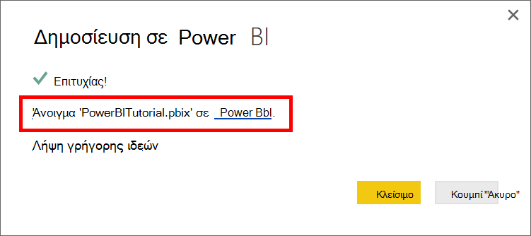

## Δημιουργία ενός πίνακα εργαλείων στο PowerBI.com

Τώρα που έχετε μια αναφορά, επιτρέπει την κοινή χρήση στο PowerBI.com

Όταν δημοσιεύετε αναφοράς από το Power BI Desktop, για να PowerBI.com, δημιουργεί μια **αναφορά** και ένα **σύνολο δεδομένων** στο μισθωτή σας PowerBI.com. Για παράδειγμα, αφού έχετε δημοσιεύσει μια έκθεση που ονομάζεται **PowerBITutorial** σε PowerBI.com, θα δείτε PowerBITutorial στις ενότητες τόσο τις **αναφορές** και **συνόλων δεδομένων** σε PowerBI.com.

   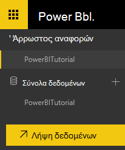

Για να δημιουργήσετε έναν πίνακα εργαλείων δυνατότητα κοινής χρήσης, κάντε κλικ στο κουμπί **Καρφίτσωμα Live σελίδας** στην έκθεση PowerBI.com.

   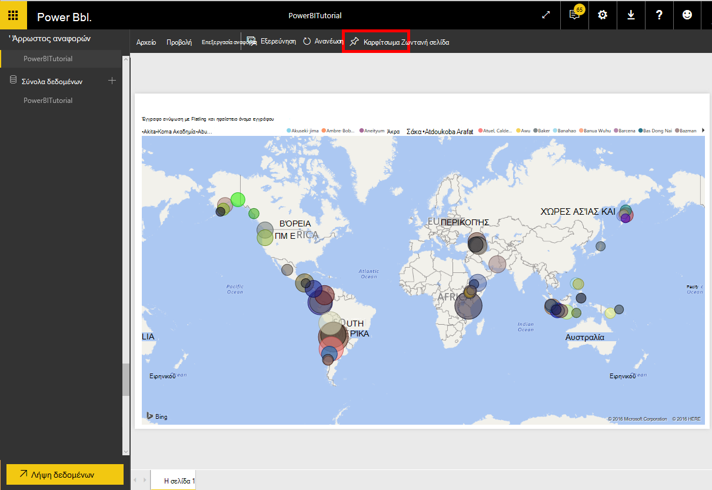

Στη συνέχεια, ακολουθήστε τις οδηγίες στο θέμα [Pin ένα πλακίδιο από μια έκθεση](https://powerbi.microsoft.com/documentation/powerbi-service-pin-a-tile-to-a-dashboard-from-a-report/#pin-a-tile-from-a-report) για να δημιουργήσετε έναν νέο πίνακα εργαλείων. 

Μπορείτε επίσης να κάνετε ad hoc τροποποιήσεις αναφοράς πριν από τη δημιουργία ενός πίνακα εργαλείων. Ωστόσο, συνιστάται να χρησιμοποιήσετε Power BI Desktop για να εκτελέσετε τις τροποποιήσεις και δημοσιεύστε ξανά την αναφορά και να PowerBI.com.

## Ανανέωση δεδομένων σε PowerBI.com

Υπάρχουν δύο τρόποι για την ανανέωση δεδομένων, ad hoc και προγραμματισμένη.

Για μια ad hoc ανανέωση, απλώς κάντε κλικ στην εντολή το eclipses (...) από το **σύνολο δεδομένων**, π.χ. PowerBITutorial. Θα πρέπει να μπορείτε να δείτε μια λίστα ενεργειών όπως **Ανανέωση τώρα**. Κάντε κλικ στην επιλογή **Ανανέωση τώρα** για να ανανεώσετε τα δεδομένα.

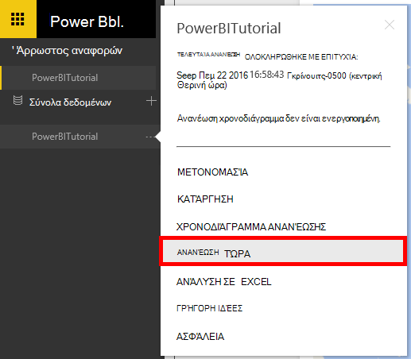

Για μια προγραμματισμένη ανανέωση, κάντε τα εξής.

1. Κάντε κλικ στην επιλογή **Προγραμματισμός ανανέωσης** στη λίστα ενεργειών. 
    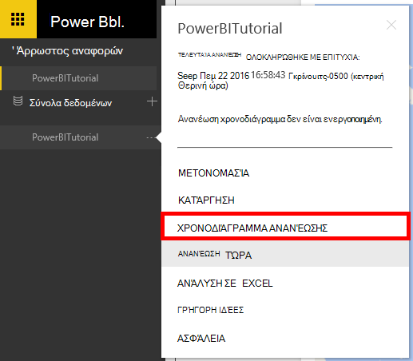

2. Στη σελίδα **Ρυθμίσεις** , αναπτύξτε το στοιχείο **διαπιστευτηρίων προέλευσης δεδομένων**. 

3. Κάντε κλικ στην εντολή **Επεξεργασία διαπιστευτήρια**. 

    Εμφανίζεται το αναδυόμενο παράθυρο Ρύθμιση παραμέτρων. 

4. Πληκτρολογήστε το κλειδί για να συνδεθείτε με το λογαριασμό DocumentDB για το συγκεκριμένο σύνολο δεδομένων και, στη συνέχεια, κάντε κλικ στην επιλογή **Είσοδος**. 

5. Αναπτύξτε το στοιχείο **Προγραμματισμός ανανέωσης** και να ρυθμίσετε το χρονοδιάγραμμα που θέλετε για την ανανέωση του συνόλου δεδομένων. 
  
6. Κάντε κλικ στην επιλογή **εφαρμογή** και να ολοκληρώσετε τη ρύθμιση του η προγραμματισμένη ανανέωση.

## Επόμενα βήματα
- Για να μάθετε περισσότερα σχετικά με το Power BI, ανατρέξτε στο θέμα [Γρήγορα αποτελέσματα με το Power BI](https://powerbi.microsoft.com/documentation/powerbi-service-get-started/).
- Για να μάθετε περισσότερα σχετικά με το DocumentDB, ανατρέξτε στην [τεκμηρίωση DocumentDB σελίδα προορισμού](https://azure.microsoft.com/documentation/services/documentdb/).
