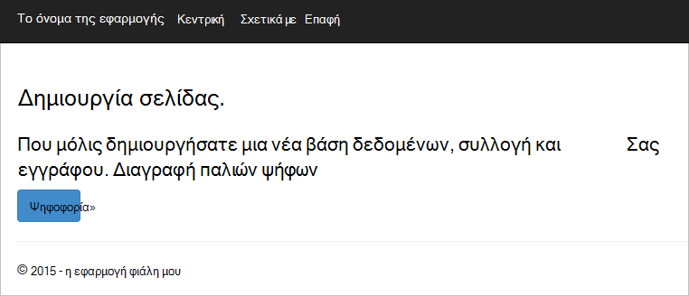

<properties
    pageTitle="Ανάπτυξη εφαρμογών Web φιάλη Python με DocumentDB | Microsoft Azure"
    description="Ελέγξτε ένα πρόγραμμα εκμάθησης βάσης δεδομένων σχετικά με τη χρήση DocumentDB για την αποθήκευση και την πρόσβαση σε δεδομένα από μια εφαρμογή web φιάλη Python φιλοξενούνται σε Azure. Βρείτε λύσεις ανάπτυξης εφαρμογής." 
    keywords="Ανάπτυξη εφαρμογών, εκμάθηση βάσης δεδομένων, φιάλη python, εφαρμογή web python, ανάπτυξη web python, documentdb, azure, Microsoft azure"
    services="documentdb"
    documentationCenter="python"
    authors="syamkmsft"
    manager="jhubbard"
    editor="cgronlun"/>

<tags
    ms.service="documentdb"
    ms.workload="data-management"
    ms.tgt_pltfrm="na"
    ms.devlang="python"
    ms.topic="hero-article"
    ms.date="08/25/2016"
    ms.author="syamk"/>

# <a name="python-flask-web-application-development-with-documentdb"></a>Ανάπτυξη εφαρμογών Web φιάλη Python με DocumentDB

> [AZURE.SELECTOR]
- [.NET](documentdb-dotnet-application.md)
- [Node.js](documentdb-nodejs-application.md)
- [Java](documentdb-java-application.md)
- [Python](documentdb-python-application.md)

Αυτό το πρόγραμμα εκμάθησης σας δείχνει πώς μπορείτε να χρησιμοποιήσετε Azure DocumentDB για την αποθήκευση και δεδομένων της access από μια Python φιλοξενούνται σε Azure εφαρμογή web και προϋποθέτει ότι έχετε κάποια εμπειρία εκ των προτέρων χρησιμοποιώντας Python και Azure τοποθεσίες Web που διαθέτετε.

Καλύπτει αυτό το πρόγραμμα εκμάθησης βάσης δεδομένων:

1. Τη δημιουργία και την προμήθεια ενός λογαριασμού DocumentDB.
2. Δημιουργία μιας εφαρμογής Python MVC.
3. Σύνδεση με και τη χρήση Azure DocumentDB από την εφαρμογή web.
4. Για την ανάπτυξη της εφαρμογής web σε τοποθεσίες Web Azure.

Ακολουθώντας αυτό το πρόγραμμα εκμάθησης, θα μπορείτε να δημιουργήσετε μια απλή εφαρμογή ψηφοφορίας που σας επιτρέπει να ψηφίσετε για μια ψηφοφορία.


## <a name="database-tutorial-prerequisites"></a>Προαπαιτούμενα στοιχεία προγραμμάτων εκμάθησης βάσης δεδομένων

Πριν να ακολουθήσετε τις οδηγίες σε αυτό το άρθρο, θα πρέπει να βεβαιωθείτε ότι έχετε εγκαταστήσει τα εξής:

- Λογαριασμού Azure active. Εάν δεν έχετε ένα λογαριασμό, μπορείτε να δημιουργήσετε ένα δωρεάν λογαριασμό της δοκιμαστικής έκδοσης σε λίγα λεπτά. Για λεπτομέρειες, ανατρέξτε στο θέμα [Azure δωρεάν δοκιμαστικής έκδοσης](https://azure.microsoft.com/pricing/free-trial/).
- [Visual Studio 2013](http://www.visualstudio.com/) ή νεότερη έκδοση, ή [Visual Studio Express](), η οποία είναι η δωρεάν έκδοση. Τις οδηγίες σε αυτό το πρόγραμμα εκμάθησης έχουν συνταχθεί ειδικά για Visual Studio 2015. 
- Εργαλεία Python για το Visual Studio από [GitHub](http://microsoft.github.io/PTVS/). Αυτό το πρόγραμμα εκμάθησης χρησιμοποιεί Python εργαλεία για ΣΎΓΚΡΙΣΗ 2015. 
- Azure Python SDK για το Visual Studio, έκδοση 2,4 ή νεότερη έκδοση διαθέσιμη από [azure.com](https://azure.microsoft.com/downloads/). Χρησιμοποιήσαμε Microsoft Azure SDK για Python 2.7.
- Python 2.7 από [python.org][2]. Χρησιμοποιήσαμε Python 2.7.11. 

> [AZURE.IMPORTANT] Εάν εγκαθιστάτε Python 2.7 για πρώτη φορά, βεβαιωθείτε ότι στην οθόνη Προσαρμογή Python 2.7.11, επιλέγετε **Προσθήκη python.exe στη διαδρομή**.
> 
>    

- Πρόγραμμα μεταγλώττισης Microsoft Visual C++ για Python 2.7 από το [Κέντρο λήψης της Microsoft][3].

## <a name="step-1-create-a-documentdb-database-account"></a>Βήμα 1: Δημιουργία λογαριασμού DocumentDB βάσης δεδομένων

Ας ξεκινήσουμε με τη δημιουργία ενός λογαριασμού DocumentDB. Εάν έχετε ήδη ένα λογαριασμό, μπορείτε να μεταβείτε στο [βήμα 2: Δημιουργία νέας εφαρμογής web φιάλη Python](#step-2:-create-a-new-python-flask-web-application).

[AZURE.INCLUDE [documentdb-create-dbaccount](../../includes/documentdb-create-dbaccount.md)]

<br/>
Τώρα θα θα καθοδηγήσουμε με τη διαδικασία για να δημιουργήσετε μια νέα εφαρμογή web Python φιάλη από το μηδέν προς τα επάνω.

## <a name="step-2-create-a-new-python-flask-web-application"></a>Βήμα 2: Δημιουργία νέας εφαρμογής web Python φιάλη

1. Στο Visual Studio, στο μενού **αρχείο** , επιλέξτε **Δημιουργία**και, στη συνέχεια, κάντε κλικ στην επιλογή **έργο**.

    Εμφανίζεται το παράθυρο διαλόγου **Νέο έργο** .

2. Στο αριστερό παράθυρο, αναπτύξτε **πρότυπα** και, στη συνέχεια, **Python**και, στη συνέχεια, κάντε κλικ στην επιλογή **Web**. 

3. Επιλέξτε **Project Web φιάλη** στο κεντρικό παράθυρο, στη συνέχεια, στην **όνομα** πλαίσιο τύπου **πρόγραμμα εκμάθησης**, και, στη συνέχεια, κάντε κλικ στο κουμπί **OK**. Να θυμάστε ότι Python πακέτου ονόματα πρέπει να είναι όλα πεζά, όπως περιγράφεται στον [Οδηγό στυλ Python κώδικα](https://www.python.org/dev/peps/pep-0008/#package-and-module-names).

    Για αυτά τα νέα Python φιάλη, είναι ένα πλαίσιο εργασίας ανάπτυξης εφαρμογών web που σας βοηθά να δημιουργήσετε εφαρμογές web στο Python πιο γρήγορα.

    

4. Στο παράθυρο **Εργαλείων Python για το Visual Studio** , κάντε κλικ στην επιλογή **εγκατάσταση σε ένα εικονικό περιβάλλον**. 

    

5. Στο παράθυρο **Προσθήκη εικονικό περιβάλλον** , μπορείτε να αποδεχτείτε τις προεπιλογές και να χρησιμοποιήσετε Python 2.7 ως του βασικού περιβάλλοντος, επειδή η PyDocumentDB δεν υποστηρίζει τη συγκεκριμένη στιγμή Python 3.x, και, στη συνέχεια, κάντε κλικ στην επιλογή **Δημιουργία**. Αυτό ρυθμίζει το απαιτούμενο εικονικό περιβάλλον Python για το έργο σας.

    

    Στο παράθυρο εξόδου εμφανίζει `Successfully installed Flask-0.10.1 Jinja2-2.8 MarkupSafe-0.23 Werkzeug-0.11.5 itsdangerous-0.24 'requirements.txt' was installed successfully.` όταν εγκαταστάθηκε με επιτυχία το περιβάλλον.

## <a name="step-3-modify-the-python-flask-web-application"></a>Βήμα 3: Τροποποίηση της εφαρμογής web Python φιάλη

### <a name="add-the-python-flask-packages-to-your-project"></a>Προσθέστε τα πακέτα φιάλη Python στο έργο σας

Αφού ρυθμιστεί το έργο σας, θα χρειαστεί να προσθέσετε τα απαιτούμενα πακέτα φιάλη στο έργο σας, συμπεριλαμβανομένων των pydocumentdb, το πακέτο Python για DocumentDB.

1. Στην Εξερεύνηση λύσεων, ανοίξτε το αρχείο με το όνομα **requirements.txt** και αντικαταστήστε τα περιεχόμενα με τα εξής:

        flask==0.9
        flask-mail==0.7.6
        sqlalchemy==0.7.9
        flask-sqlalchemy==0.16
        sqlalchemy-migrate==0.7.2
        flask-whooshalchemy==0.55a
        flask-wtf==0.8.4
        pytz==2013b
        flask-babel==0.8
        flup
        pydocumentdb>=1.0.0

2. Αποθηκεύστε το αρχείο **requirements.txt** . 
3. Στην Εξερεύνηση λύσεων, κάντε δεξί κλικ **φάκελος** και κάντε κλικ στην επιλογή **εγκατάσταση από requirements.txt**.

    

    Μετά την επιτυχή εγκατάσταση, στο παράθυρο εξόδου εμφανίζει τα εξής:

        Successfully installed Babel-2.3.2 Tempita-0.5.2 WTForms-2.1 Whoosh-2.7.4 blinker-1.4 decorator-4.0.9 flask-0.9 flask-babel-0.8 flask-mail-0.7.6 flask-sqlalchemy-0.16 flask-whooshalchemy-0.55a0 flask-wtf-0.8.4 flup-1.0.2 pydocumentdb-1.6.1 pytz-2013b0 speaklater-1.3 sqlalchemy-0.7.9 sqlalchemy-migrate-0.7.2

    > [AZURE.NOTE] Στην περίπτωση αυτή, μπορεί να δείτε μια αποτυχία στο παράθυρο εξόδου. Εάν συμβαίνει αυτό, ελέγξτε εάν το σφάλμα σχετίζεται με την εκκαθάριση. Μερικές φορές η εκκαθάριση αποτυγχάνει, αλλά η εγκατάσταση θα εξακολουθούν να είναι επιτυχής (κύλιση προς τα επάνω στο παράθυρο εξόδου για να το επαληθεύσετε). Μπορείτε να ελέγξετε την εγκατάσταση του με [Επαλήθευση το εικονικό περιβάλλον](#verify-the-virtual-environment). Εάν η εγκατάσταση απέτυχε, αλλά η επαλήθευση είναι επιτυχής, είναι OK για να συνεχίσετε.

### <a name="verify-the-virtual-environment"></a>Επιβεβαιώστε το εικονικό περιβάλλον

Ας βεβαιωθείτε ότι όλα τα στοιχεία έχει εγκατασταθεί σωστά.

1. Δημιουργία της λύσης, πατώντας το **συνδυασμό πλήκτρων Ctrl**+**Shift**+**B**.
2. Μόλις το build ολοκληρωθεί με επιτυχία, ξεκινήστε την τοποθεσία Web, πατώντας το πλήκτρο **F5**. Αυτό ανοίγει ο διακομιστής ανάπτυξης φιάλη και ξεκινά το πρόγραμμα περιήγησης web. Θα πρέπει να βλέπετε στην επόμενη σελίδα.

    

3. Διακόψετε τον εντοπισμό σφαλμάτων στην τοποθεσία Web, πατώντας το **πλήκτρο Shift**+**F5** στο Visual Studio.

### <a name="create-database-collection-and-document-definitions"></a>Δημιουργία βάσης δεδομένων, τη συλλογή και ορισμούς εγγράφου

Τώρα ας δημιουργήσουμε εκλογής εφαρμογή σας, προσθέτοντας νέα αρχεία και να ενημερώσετε άλλα άτομα.

1. Στην Εξερεύνηση λύσεων, κάντε δεξί κλικ στο έργο **το πρόγραμμα εκμάθησης** , κάντε κλικ στην επιλογή **Προσθήκη**και, στη συνέχεια, κάντε κλικ στην επιλογή **Νέο στοιχείο**. Επιλέξτε **Κενό αρχείο Python** και ονομάστε το αρχείο **forms.py**.  
2. Προσθέστε τον ακόλουθο κώδικα στο αρχείο forms.py και, στη συνέχεια, αποθηκεύστε το αρχείο.

```python
from flask.ext.wtf import Form
from wtforms import RadioField

class VoteForm(Form):
    deploy_preference  = RadioField('Deployment Preference', choices=[
        ('Web Site', 'Web Site'),
        ('Cloud Service', 'Cloud Service'),
        ('Virtual Machine', 'Virtual Machine')], default='Web Site')
```


### <a name="add-the-required-imports-to-viewspy"></a>Προσθήκη των απαιτούμενων εισαγωγών views.py

1. Στην Εξερεύνηση λύσεων, αναπτύξτε το φάκελο του **προγράμματος εκμάθησης** και ανοίξτε το αρχείο **views.py** . 
2. Προσθέστε τα εξής εισαγωγή δηλώσεις στο επάνω μέρος του αρχείου **views.py** , στη συνέχεια, αποθηκεύστε το αρχείο. Αυτά τα εισαγωγή του DocumentDB PythonSDK και τα πακέτα φιάλη.

    ```python
    from forms import VoteForm
    import config
    import pydocumentdb.document_client as document_client
    ```


### <a name="create-database-collection-and-document"></a>Δημιουργία βάσης δεδομένων, τη συλλογή και εγγράφου

- Ενώ βρίσκεστε ακόμη στο **views.py**, προσθέστε τον ακόλουθο κώδικα στο τέλος του αρχείου. Αναλαμβάνει τη δημιουργία της βάσης δεδομένων που χρησιμοποιούνται από τη φόρμα. Μην διαγράφετε οποιαδήποτε από τον υπάρχοντα κωδικό στο **views.py**. Απλώς Προσάρτηση αυτό μέχρι το τέλος.

```python
@app.route('/create')
def create():
    """Renders the contact page."""
    client = document_client.DocumentClient(config.DOCUMENTDB_HOST, {'masterKey': config.DOCUMENTDB_KEY})

    # Attempt to delete the database.  This allows this to be used to recreate as well as create
    try:
        db = next((data for data in client.ReadDatabases() if data['id'] == config.DOCUMENTDB_DATABASE))
        client.DeleteDatabase(db['_self'])
    except:
        pass

    # Create database
    db = client.CreateDatabase({ 'id': config.DOCUMENTDB_DATABASE })

    # Create collection
    collection = client.CreateCollection(db['_self'],{ 'id': config.DOCUMENTDB_COLLECTION })

    # Create document
    document = client.CreateDocument(collection['_self'],
        { 'id': config.DOCUMENTDB_DOCUMENT,
          'Web Site': 0,
          'Cloud Service': 0,
          'Virtual Machine': 0,
          'name': config.DOCUMENTDB_DOCUMENT 
        })

    return render_template(
       'create.html',
        title='Create Page',
        year=datetime.now().year,
        message='You just created a new database, collection, and document.  Your old votes have been deleted')
```

> [AZURE.TIP] Η μέθοδος **CreateCollection** λαμβάνει μια προαιρετική **RequestOptions** ως η τρίτη παράμετρος. Αυτό μπορεί να χρησιμοποιηθεί για να καθορίσετε τον τύπο προσφορά για τη συλλογή. Εάν δεν υπάρχει τιμή offerType παρέχεται, στη συνέχεια, στη συλλογή θα δημιουργηθούν χρησιμοποιώντας το προεπιλεγμένο τύπο προσφορά. Για περισσότερες πληροφορίες σχετικά με τους τύπους προσφέρουν DocumentDB, ανατρέξτε στο θέμα [επιδόσεις επίπεδα στο DocumentDB](documentdb-performance-levels.md).


### <a name="read-database-collection-document-and-submit-form"></a>Ανάγνωση βάσης δεδομένων, τη συλλογή, εγγράφων και υποβολή της φόρμας

- Ενώ βρίσκεστε ακόμη στο **views.py**, προσθέστε τον ακόλουθο κώδικα στο τέλος του αρχείου. Αυτό αναλαμβάνει ρύθμιση της φόρμας, ανάγνωσης τη βάση δεδομένων, συλλογή και εγγράφου. Μην διαγράφετε οποιαδήποτε από τον υπάρχοντα κωδικό στο **views.py**. Απλώς Προσάρτηση αυτό μέχρι το τέλος.

```python
@app.route('/vote', methods=['GET', 'POST'])
def vote(): 
    form = VoteForm()
    replaced_document ={}
    if form.validate_on_submit(): # is user submitted vote  
        client = document_client.DocumentClient(config.DOCUMENTDB_HOST, {'masterKey': config.DOCUMENTDB_KEY})

        # Read databases and take first since id should not be duplicated.
        db = next((data for data in client.ReadDatabases() if data['id'] == config.DOCUMENTDB_DATABASE))

        # Read collections and take first since id should not be duplicated.
        coll = next((coll for coll in client.ReadCollections(db['_self']) if coll['id'] == config.DOCUMENTDB_COLLECTION))

        # Read documents and take first since id should not be duplicated.
        doc = next((doc for doc in client.ReadDocuments(coll['_self']) if doc['id'] == config.DOCUMENTDB_DOCUMENT))

        # Take the data from the deploy_preference and increment our database
        doc[form.deploy_preference.data] = doc[form.deploy_preference.data] + 1
        replaced_document = client.ReplaceDocument(doc['_self'], doc)

        # Create a model to pass to results.html
        class VoteObject:
            choices = dict()
            total_votes = 0

        vote_object = VoteObject()
        vote_object.choices = {
            "Web Site" : doc['Web Site'],
            "Cloud Service" : doc['Cloud Service'],
            "Virtual Machine" : doc['Virtual Machine']
        }
        vote_object.total_votes = sum(vote_object.choices.values())

        return render_template(
            'results.html', 
            year=datetime.now().year, 
            vote_object = vote_object)

    else :
        return render_template(
            'vote.html', 
            title = 'Vote',
            year=datetime.now().year,
            form = form)
```


### <a name="create-the-html-files"></a>Δημιουργήστε τα αρχεία HTML

1. Στην Εξερεύνηση λύσεων, στο φάκελο **πρόγραμμα εκμάθησης** , κάντε δεξί κλικ στο φάκελο **προτύπων** , κάντε κλικ στην επιλογή **Προσθήκη**και, στη συνέχεια, κάντε κλικ στην επιλογή **Νέο στοιχείο**. 
2. Επιλέξτε **Σελίδα HTML**και, στη συνέχεια, στο πλαίσιο όνομα, πληκτρολογήστε **create.html**. 
3. Επαναλάβετε τα βήματα 1 και 2 για να δημιουργήσετε δύο επιπλέον αρχεία HTML: results.html και vote.html.
4. Προσθέστε τον παρακάτω κώδικα **create.html** στο το `<body>` στοιχείο. Εμφανίζεται ένα μήνυμα που αναφέρει ότι που δημιουργήσαμε μια νέα βάση δεδομένων, συλλογή και εγγράφου.

    ```html
    
    
    <h2>{{ title }}.</h2>
    <h3>{{ message }}</h3>
    <p><a href="{{ url_for('vote') }}" class="btn btn-primary btn-large">Vote &raquo;</a></p>
    
    ```

5. Προσθέστε τον παρακάτω κώδικα **results.html** στο το `<body`> στοιχείο. Εμφανίζει τα αποτελέσματα της ψηφοφορίας.

    ```html
    
    
    <h2>Results of the vote</h2>
        <br />
        
    
    <div class="row">
        <div class="col-sm-5">{{choice}}</div>
            <div class="col-sm-5">
                <div class="progress">
                    <div class="progress-bar" role="progressbar" aria-valuenow="{{vote_object.choices[choice]}}" aria-valuemin="0" aria-valuemax="{{vote_object.total_votes}}" style="width: {{(vote_object.choices[choice]/vote_object.total_votes)*100}}%;">
                                {{vote_object.choices[choice]}}
                </div>
            </div>
            </div>
    </div>
    
    
    <br />
    <a class="btn btn-primary" href="{{ url_for('vote') }}">Vote again?</a>
    
    ```

6. Προσθέστε τον παρακάτω κώδικα **vote.html** στο το `<body`> στοιχείο. Εμφανίζει την ψηφοφορία και αποδέχεται ψήφων. Σχετικά με την καταχώρηση ψήφων, το στοιχείο ελέγχου μεταβιβάζεται views.py όπου θα αναγνωρίζουν την ψήφο cast και προσάρτηση αναλόγως του εγγράφου.

    ```html
    
    
    <h2>What is your favorite way to host an application on Azure?</h2>
    <form action="" method="post" name="vote">
        {{form.hidden_tag()}}
            {{form.deploy_preference}}
            <button class="btn btn-primary" type="submit">Vote</button>
    </form>
    
    ```

7. Στο φάκελο " **πρότυπα** ", αντικαταστήστε τα περιεχόμενα του **index.html** με τα εξής. Αυτό λειτουργεί ως τη σελίδα υποδοχής για την εφαρμογή σας.
    
    ```html
    
    
    <h2>Python + DocumentDB Voting Application.</h2>
    <h3>This is a sample DocumentDB voting application using PyDocumentDB</h3>
    <p><a href="{{ url_for('create') }}" class="btn btn-primary btn-large">Create/Clear the Voting Database &raquo;</a></p>
    <p><a href="{{ url_for('vote') }}" class="btn btn-primary btn-large">Vote &raquo;</a></p>
    
    ```

### <a name="add-a-configuration-file-and-change-the-initpy"></a>Προσθέστε ένα αρχείο ρύθμισης παραμέτρων και αλλάξτε το \_ \_προετοιμασία\_\_.py

1. Στην Εξερεύνηση λύσεων, κάντε δεξί κλικ στο έργο **το πρόγραμμα εκμάθησης** , κάντε κλικ στην επιλογή **Προσθήκη**, κάντε κλικ στην επιλογή **Νέο στοιχείο**, επιλέξτε **Κενό αρχείο Python**και στη συνέχεια, ονομάστε το αρχείο **config.py**. Αυτό το αρχείο ρύθμισης παραμέτρων απαιτείται από φόρμες σε φιάλη. Μπορείτε να το χρησιμοποιήσετε για την παροχή καθώς και ένα μυστικό κλειδί. Αυτό το κλειδί δεν είναι απαραίτητη για αυτό το πρόγραμμα εκμάθησης μέσω.

2. Προσθέστε τον ακόλουθο κώδικα σε config.py, θα χρειαστεί να τροποποιήσετε τις τιμές του **DOCUMENTDB\_HOST** και **DOCUMENTDB\_ΚΛΕΙΔΊ** στο επόμενο βήμα.

    ```python
    CSRF_ENABLED = True
    SECRET_KEY = 'you-will-never-guess'
    
    DOCUMENTDB_HOST = 'https://YOUR_DOCUMENTDB_NAME.documents.azure.com:443/'
    DOCUMENTDB_KEY = 'YOUR_SECRET_KEY_ENDING_IN_=='
    
    DOCUMENTDB_DATABASE = 'voting database'
    DOCUMENTDB_COLLECTION = 'voting collection'
    DOCUMENTDB_DOCUMENT = 'voting document'
    ```

3. Στην [πύλη του Azure](https://portal.azure.com/), μεταβείτε σε τα **πλήκτρα** blade κάνοντας κλικ στην επιλογή **Αναζήτηση**, **DocumentDB λογαριασμοί**, κάντε διπλό κλικ στο όνομα του λογαριασμού για να χρησιμοποιήσετε και, στη συνέχεια, κάντε κλικ στο κουμπί **πλήκτρα** στην περιοχή **βασικά στοιχεία** . Στην τα **πλήκτρα** blade, αντιγράψτε την τιμή **URI** και επικολλήστε τον στο αρχείο **config.py** , ως η τιμή για το **DOCUMENTDB\_HOST** την ιδιότητα. 
4. Επιστροφή στην πύλη Azure, με τα **πλήκτρα** blade, αντιγράψτε την τιμή του **Πρωτεύοντος κλειδιού** ή το **Δευτερεύον κλειδί**και επικολλήστε το στο αρχείο **config.py** , ως η τιμή για το **DOCUMENTDB\_ΚΛΕΙΔΊ** την ιδιότητα.
5. Στο το ** \_ \_προετοιμασία\_\_.py** αρχείου, προσθέστε την ακόλουθη γραμμή. 

        app.config.from_object('config')

    Έτσι ώστε το περιεχόμενο του αρχείου είναι:

    ```python
    from flask import Flask
    app = Flask(__name__)
    app.config.from_object('config')
    import tutorial.views
    ```

6. Αφού προσθέσετε όλα τα αρχεία, Εξερεύνηση λύσεων θα πρέπει να μοιάζει ως εξής:

    


## <a name="step-4-run-your-web-application-locally"></a>Βήμα 4: Εκτέλεση τοπικά την εφαρμογή web

1. Δημιουργία της λύσης, πατώντας το **συνδυασμό πλήκτρων Ctrl**+**Shift**+**B**.
2. Μόλις το build ολοκληρωθεί με επιτυχία, ξεκινήστε την τοποθεσία Web, πατώντας το πλήκτρο **F5**. Θα πρέπει να βλέπετε τα εξής στην οθόνη σας.

    

3. Κάντε κλικ στην επιλογή **Δημιουργία/κατάργηση της βάσης δεδομένων εκλογής** για τη δημιουργία της βάσης δεδομένων.

    

4. Στη συνέχεια, κάντε κλικ στην επιλογή **ψηφοφορία** και κάντε την επιλογή σας.

    

5. Για κάθε ψηφοφορία που απόκλιση, αυξάνεται το κατάλληλο μετρητή.

    

6. Διακοπή εντοπισμού του έργου, πατώντας το συνδυασμό πλήκτρων Shift + F5.

## <a name="step-5-deploy-the-web-application-to-azure-websites"></a>Βήμα 5: Ανάπτυξη της εφαρμογής web σε τοποθεσίες Web Azure

Τώρα που έχετε εγκαταστήσει την πλήρη εφαρμογή λειτουργεί σωστά σε σχέση με DocumentDB, θα κάνουμε για να αναπτύξετε αυτό σε τοποθεσίες Web Azure.

1. Κάντε δεξί κλικ στο έργο στην Εξερεύνηση λύσεων (βεβαιωθείτε ότι δεν είστε εξακολουθεί να εκτελείται τοπικά) και επιλέξτε **Δημοσίευση**.  

    

2. Στο παράθυρο " **Δημοσίευση Web** ", επιλέξτε **Microsoft Azure Web Apps**και, στη συνέχεια, κάντε κλικ στο κουμπί **Επόμενο**.

    

3. Στο παράθυρο του **Microsoft Azure Web εφαρμογές του παραθύρου** , κάντε κλικ στην επιλογή **Δημιουργία**.

    

4. Στο παράθυρο **Δημιουργία τοποθεσίας στο Microsoft Azure** , πληκτρολογήστε ένα **όνομα εφαρμογής Web**, **σχέδιο παροχής υπηρεσιών εφαρμογής**, **ομάδα πόρων**και **περιοχής**και, στη συνέχεια, κάντε κλικ στην επιλογή **Δημιουργία**.

    

5. Στο παράθυρο " **Δημοσίευση Web** ", κάντε κλικ στο κουμπί **Δημοσίευση**.

    

3. Σε μερικά δευτερόλεπτα, Visual Studio θα λήξης δημοσίευσης της εφαρμογής web και εκκίνηση ενός προγράμματος περιήγησης όπου μπορείτε να δείτε εύχρηστο εργασίας εκτελείται στο Azure!

## <a name="troubleshooting"></a>Αντιμετώπιση προβλημάτων

Εάν αυτή είναι η πρώτη εφαρμογή Python έχετε εκτελέσει στον υπολογιστή σας, βεβαιωθείτε ότι τους παρακάτω φακέλους (ή τις θέσεις ισοδύναμη εγκατάστασης) συμπεριλαμβάνονται στο τη μεταβλητή PATH:

    C:\Python27\site-packages;C:\Python27\;C:\Python27\Scripts;

Εάν λάβετε ένα σφάλμα στη σελίδα σας ψηφοφορία και με χαρακτήρα διάφορο του **προγράμματος εκμάθησης**το έργο σας, βεβαιωθείτε ότι έχετε ** \_ \_προετοιμασία\_\_.py** αναφέρεται το όνομα του έργου σωστή στη γραμμή: `import tutorial.view`.

## <a name="next-steps"></a>Επόμενα βήματα

Συγχαρητήρια! Μόλις ολοκληρώσετε την πρώτη εφαρμογής web Python με χρήση Azure DocumentDB και τη δημοσίευσή του Azure τοποθεσίες Web.

Μας ενημερώνετε και να βελτιώνετε αυτό το θέμα συχνά με βάση τα σχόλιά σας.  Αφού έχετε ολοκληρώσει το πρόγραμμα εκμάθησης, επικοινωνήστε χρησιμοποιώντας τα κουμπιά εκλογής στο επάνω και στο κάτω μέρος αυτής της σελίδας και θα πρέπει να συμπεριλάβετε τα σχόλιά σας από το τι έγιναν βελτιώσεις που θέλετε να δείτε. Εάν θέλετε να επικοινωνήσουμε μαζί σας απευθείας, μην διστάσεις να συμπεριλάβετε τη διεύθυνση ηλεκτρονικού ταχυδρομείου στο τα σχόλιά σας.

Για να προσθέσετε πρόσθετες λειτουργίες στην εφαρμογή web σας, εξετάστε τα διαθέσιμα στο [DocumentDB Python SDK](documentdb-sdk-python.md)API.

Για περισσότερες πληροφορίες σχετικά με το Azure, Visual Studio και Python, ανατρέξτε στο [Κέντρο για προγραμματιστές Python](https://azure.microsoft.com/develop/python/). 

Για πρόσθετες φιάλη Python προγραμμάτων εκμάθησης, ανατρέξτε στο θέμα [η φιάλη Mega-το πρόγραμμα εκμάθησης, τμήμα I: Hello, World!](http://blog.miguelgrinberg.com/post/the-flask-mega-tutorial-part-i-hello-world). 

  [Visual Studio Express]: http://www.visualstudio.com/products/visual-studio-express-vs.aspx
  [2]: https://www.python.org/downloads/windows/
  [3]: https://www.microsoft.com/download/details.aspx?id=44266
  [Microsoft Web Platform Installer]: http://www.microsoft.com/web/downloads/platform.aspx
  [Azure portal]: http://portal.azure.com
