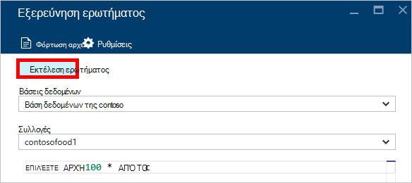

<properties
    pageTitle="Εξερεύνηση DocumentDB ερωτήματος: Μια SQL πρόγραμμα επεξεργασίας ερωτήματος | Microsoft Azure"
    description="Μάθετε περισσότερα σχετικά με την Εξερεύνηση ερωτήματος DocumentDB, ένα πρόγραμμα επεξεργασίας ερωτήματος SQL στην πύλη του Azure για την εγγραφή ερωτήματα SQL και εκτέλεσή τους σε σχέση με μια συλλογή NoSQL DocumentDB."
    keywords="η σύνταξη ερωτήματα sql, πρόγραμμα επεξεργασίας ερωτήματος sql"
    services="documentdb"
    authors="kirillg"
    manager="jhubbard"
    editor="monicar"
    documentationCenter=""/>

<tags
    ms.service="documentdb"
    ms.workload="data-services"
    ms.tgt_pltfrm="na"
    ms.devlang="na"
    ms.topic="article"
    ms.date="08/30/2016"
    ms.author="kirillg"/>

# Σύνταξη, επεξεργασία και εκτέλεση ερωτημάτων SQL για DocumentDB χρησιμοποιώντας την Εξερεύνηση των ερωτημάτων 

Σε αυτό το άρθρο παρέχει μια επισκόπηση της Εξερεύνησης ερωτήματος του [Microsoft Azure DocumentDB](https://azure.microsoft.com/services/documentdb/) , ένα εργαλείο πύλης Azure που σας επιτρέπει να γράψετε, επεξεργασία και εκτέλεση ερωτημάτων SQL σε σχέση με μια [συλλογή DocumentDB](documentdb-create-collection.md).

1. Στην πύλη Azure, με το Jumpbar, κάντε κλικ στην επιλογή **DocumentDB (NoSQL)**. Εάν **DocumentDB (NoSQL)** δεν είναι ορατό, κάντε κλικ στην επιλογή **Περισσότερες υπηρεσίες** και, στη συνέχεια, κάντε κλικ στην επιλογή **DocumentDB (NoSQL)**.

2. Στο μενού πόρων, κάντε κλικ στην επιλογή **Εξερεύνηση ερωτήματος**. 

    

3. Στο το blade **Explorer ερωτήματος** , επιλέξτε τις **βάσεις δεδομένων** και τις **συλλογές** ερώτημα από τις αναπτυσσόμενες λίστες και πληκτρολογήστε το ερώτημα για να εκτελέσετε. 

    Αναπτυσσόμενες λίστες **βάσεις δεδομένων** και **συλλογές** είναι ήδη συμπληρωμένα ανάλογα με το περιεχόμενο στο οποίο εκκινείτε Explorer ερωτήματος. 

    Ένα προεπιλεγμένο ερώτημα των `SELECT TOP 100 * FROM c` παρέχεται.  Μπορείτε να αποδεχτείτε το προεπιλεγμένο ερώτημα ή να δημιουργήσετε το δικό σας ερώτημα με χρήση της γλώσσας ερωτήματος SQL που περιγράφονται σε του [ερωτήματος SQL πλήκτρα φύλλο](documentdb-sql-query-cheat-sheet.md) ή στο άρθρο του [ερωτήματος SQL και σύνταξη SQL](documentdb-sql-query.md) .

    Κάντε κλικ στην επιλογή **Εκτέλεση ερωτήματος** για να προβάλετε τα αποτελέσματα.

    

4. Τα **αποτελέσματα** blade εμφανίζει το αποτέλεσμα του ερωτήματος. 

    

## Εργασία με αποτελέσματα

Από προεπιλογή, Explorer ερώτημα επιστρέφει αποτελέσματα σε σύνολα 100.  Εάν το ερώτημά σας παράγει λιγότερα από 100 αποτελέσματα, απλώς χρησιμοποιήστε τις εντολές **επόμενη σελίδα** και **προηγούμενη σελίδα** για να μεταβείτε από το σύνολο αποτελεσμάτων.

Για ερωτήματα με επιτυχία, το παράθυρο **πληροφοριών** περιέχει μετρικά όπως την αίτηση χρέωση, ο αριθμός των διαδρομών κάνει το ερώτημα, το σύνολο αποτελεσμάτων αυτήν τη στιγμή που εμφανίζεται, και αν υπάρχουν περισσότερα αποτελέσματα, τα οποία, στη συνέχεια, είναι δυνατή η πρόσβαση μέσω της εντολής **επόμενη σελίδα** , όπως προαναφέρθηκε.

## Χρήση πολλών ερωτημάτων

Εάν χρησιμοποιείτε πολλών ερωτημάτων και θέλετε να κάνετε γρήγορη εναλλαγή μεταξύ τους, να εισαγάγετε όλα τα ερωτήματα στο πλαίσιο κειμένου ερωτήματος από το **Ερώτημα Explorer** blade, στη συνέχεια, επισήμανσης που θέλετε να εκτελέσετε αυτήν και, στη συνέχεια, κάντε κλικ στην επιλογή **Εκτέλεση ερωτήματος** για να προβάλετε τα αποτελέσματα.

## Προσθήκη ερωτημάτων από ένα αρχείο στο πρόγραμμα επεξεργασίας ερωτήματος SQL

Μπορείτε να φορτώσετε τα περιεχόμενα ενός υπάρχοντος αρχείου χρησιμοποιώντας την εντολή **Φόρτωση του αρχείου** .

## Αντιμετώπιση προβλημάτων

Εάν ολοκληρωθεί ένα ερώτημα με σφάλματα, το ερώτημα Explorer εμφανίζει μια λίστα με σφάλματα που μπορεί να σας βοηθήσει με την αντιμετώπιση προβλημάτων προσπάθειες.

## Εκτέλεση DocumentDB SQL ερωτημάτων έξω από την πύλη

Εξερεύνηση του ερωτήματος στην πύλη του Azure είναι μόνο ένας τρόπος για να εκτελεστεί ερωτήματα SQL σε DocumentDB. Μπορείτε επίσης να εκτελέσετε ερωτήματα SQL χρησιμοποιώντας το [REST API](https://msdn.microsoft.com/library/azure/dn781481.aspx) ή τον [υπολογιστή-πελάτη SDK](documentdb-sdk-dotnet.md). Για περισσότερες πληροφορίες σχετικά με αυτές τις άλλες μεθόδους, ανατρέξτε στο θέμα [ερωτήματα SQL εκτέλεση](documentdb-sql-query.md#executing-sql-queries)

## Επόμενα βήματα

Για να μάθετε περισσότερα σχετικά με τη σύνταξη DocumentDB SQL υποστηρίζεται στην Εξερεύνηση των ερωτημάτων, ανατρέξτε στο άρθρο του [ερωτήματος SQL και σύνταξη SQL](documentdb-sql-query.md) ή εκτυπώσετε το [ερώτημα SQL πλήκτρα φύλλου](documentdb-sql-query-cheat-sheet.md).
Μπορείτε επίσης ενδέχεται να απολαύσουν δοκιμές με το [Ερώτημα Αναδειχτείτε](https://www.documentdb.com/sql/demo) όπου μπορείτε να δοκιμάσετε ανάληψη ερωτήματα ηλεκτρονικά με ένα σύνολο δεδομένων δείγματος.
