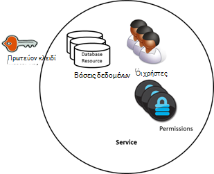
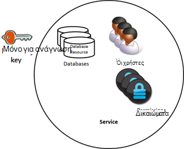
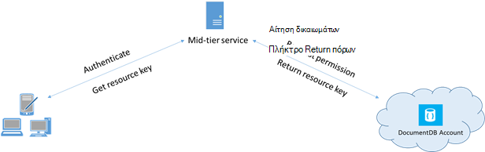

<properties 
    pageTitle="Μάθετε πώς μπορείτε να ασφαλή πρόσβαση σε δεδομένα σε DocumentDB | Microsoft Azure" 
    description="Μάθετε σχετικά με τις έννοιες στο στοιχείο ελέγχου πρόσβασης σε DocumentDB, συμπεριλαμβανομένων των πρωτεύοντα κλειδιά, πλήκτρα μόνο για ανάγνωση, οι χρήστες και δικαιώματα." 
    services="documentdb" 
    authors="kiratp" 
    manager="jhubbard" 
    editor="monicar" 
    documentationCenter=""/>

<tags 
    ms.service="documentdb" 
    ms.workload="data-services" 
    ms.tgt_pltfrm="na" 
    ms.devlang="na" 
    ms.topic="article" 
    ms.date="09/19/2016" 
    ms.author="kipandya"/>

# Ασφάλεια των πρόσβαση στα δεδομένα DocumentDB

Σε αυτό το άρθρο παρέχει μια επισκόπηση της διαδικασίας ασφάλισης πρόσβαση σε δεδομένα που είναι αποθηκευμένα στο [Microsoft Azure DocumentDB](https://azure.microsoft.com/services/documentdb/).

Μετά την ανάγνωση επισκόπηση αυτή, θα έχετε τη δυνατότητα να απαντούν στα παρακάτω ερωτήματα:  

-   Τι είναι οι DocumentDB πρωτεύοντα κλειδιά;
-   Τι είναι τα πλήκτρα DocumentDB μόνο για ανάγνωση;
-   Τι είναι τα διακριτικά πόρων DocumentDB;
-   Πώς μπορώ να χρησιμοποιήσω DocumentDB χρήστες και δικαιώματα για ασφαλή πρόσβαση σε δεδομένα DocumentDB;

## Έννοιες στο στοιχείο ελέγχου πρόσβασης DocumentDB

DocumentDB παρέχει πρώτης κλάσης έννοιες προκειμένου να ελέγχετε την πρόσβαση σε DocumentDB πόρους.  Για τους σκοπούς αυτού του θέματος, DocumentDB πόροι ομαδοποιούνται σε δύο κατηγορίες:

- Πόροι διαχείρισης
    - Λογαριασμός
    - Βάση δεδομένων
    - Χρήστη
    - Δικαιωμάτων
- Πόρους εφαρμογής
    - Συλλογή
    - Προσφορά
    - Έγγραφο
    - Συνημμένο
    - Αποθηκευμένη διαδικασία
    - Έναυσμα
    - Συνάρτηση που ορίζεται από το χρήστη

Στο πλαίσιο από αυτές τις δύο κατηγορίες, DocumentDB υποστηρίζει τρεις τύπους φανταστικά πρόσωπα ελέγχου πρόσβασης: λογαριασμού διαχειριστή, διαχειριστής μόνο για ανάγνωση και χρήστες της βάσης δεδομένων.  Τα δικαιώματα για κάθε άτομο ελέγχου πρόσβασης είναι:
 
- Λογαριασμός διαχειριστή: πλήρης πρόσβαση σε όλους τους πόρους (διαχείρισης και εφαρμογή) μέσα σε ένα συγκεκριμένο λογαριασμό DocumentDB.
- Μόνο για ανάγνωση διαχειριστή: πρόσβαση μόνο για ανάγνωση για όλους τους πόρους (διαχείρισης και εφαρμογής μέσα σε ένα συγκεκριμένο λογαριασμό DocumentDB. 
- Χρήστες της βάσης δεδομένων: το DocumentDB χρήστη πόρου που σχετίζεται με ένα συγκεκριμένο σύνολο DocumentDB πόρους βάσεων δεδομένων (π.χ., συλλογές, έγγραφα, δέσμες ενεργειών).  Μπορεί να υπάρχουν μία ή περισσότερες πόρων χρήστη που σχετίζεται με μια βάση δεδομένων και κάθε πόρο χρήστη ενδέχεται να έχετε μία ή περισσότερες δικαιώματα που σχετίζονται με το.

Με το εν λόγω κατηγορίες και πόρους υπόψη, το μοντέλο ελέγχου πρόσβασης DocumentDB ορίζει τρεις τύποι δομές access:

- Πρωτεύοντα κλειδιά: κατά τη δημιουργία ενός λογαριασμού DocumentDB, δημιουργούνται δύο πρωτεύοντα κλειδιά (κύριας και δευτερεύουσας).  Τα πλήκτρα Ενεργοποίηση διαχείρισης πλήρη πρόσβαση σε όλους τους πόρους στο λογαριασμό DocumentDB.

- Πλήκτρα μόνο για ανάγνωση: κατά τη δημιουργία ενός λογαριασμού DocumentDB, δημιουργούνται δύο μόνο για ανάγνωση κλειδιά (κύριας και δευτερεύουσας).  Τα πλήκτρα επιτρέπουν την πρόσβαση μόνο για ανάγνωση σε όλους τους πόρους στο λογαριασμό DocumentDB.

- Διακριτικά πόρων: ενός πόρου διακριτικού σχετίζεται με έναν πόρο δικαιωμάτων DocumentDB και καταγράφει τη σχέση μεταξύ του χρήστη μιας βάσης δεδομένων και το δικαίωμα αυτός ο χρήστης έχει για ένα συγκεκριμένο πόρο εφαρμογής DocumentDB (π.χ., συλλογή, έγγραφο).

## Εργασία με πλήκτρα DocumentDB κύρια και μόνο για ανάγνωση

Όπως προαναφέρθηκε, DocumentDB πρωτεύοντα κλειδιά παρέχουν διαχείρισης πλήρη πρόσβαση σε όλους τους πόρους μέσα σε ένα λογαριασμό DocumentDB, ενώ μόνο για ανάγνωση πλήκτρα ενεργοποιεί την πρόσβαση ανάγνωσης σε όλους τους πόρους στο λογαριασμό.  Το παρακάτω τμήμα κώδικα παρουσιάζει πώς μπορείτε να χρησιμοποιήσετε ένα τελικό σημείο DocumentDB λογαριασμό και το πρωτεύον κλειδί για να ξεκινήσει μια DocumentClient και να δημιουργήσετε μια νέα βάση δεδομένων. 

    //Read the DocumentDB endpointUrl and authorization keys from config.
    //These values are available from the Azure Classic Portal on the DocumentDB Account Blade under "Keys".
    //NB > Keep these values in a safe and secure location. Together they provide Administrative access to your DocDB account.
    
    private static readonly string endpointUrl = ConfigurationManager.AppSettings["EndPointUrl"];
    private static readonly SecureString authorizationKey = ToSecureString(ConfigurationManager.AppSettings["AuthorizationKey"]);
        
    client = new DocumentClient(new Uri(endpointUrl), authorizationKey);
    
    // Create Database
    Database database = await client.CreateDatabaseAsync(
        new Database
        {
            Id = databaseName
        });

## Επισκόπηση των DocumentDB πόρων διακριτικά

Μπορείτε να χρησιμοποιήσετε ένα διακριτικό πόρου (δημιουργώντας DocumentDB χρηστών και δικαιωμάτων) που θέλετε να παρέχουν πρόσβαση στους πόρους στο λογαριασμό σας στο DocumentDB ένα πρόγραμμα-πελάτη που δεν είναι αξιόπιστο με το πρωτεύον κλειδί. Τα κύρια κλειδιά DocumentDB περιλαμβάνει τόσο ένα κλειδί κύριας και δευτερεύουσας, κάθε μία από τις οποίες εκχωρεί δικαιώματα πρόσβασης διαχειριστή για το λογαριασμό σας και όλους τους πόρους σε αυτό. Ένα από τα κύρια κλειδιά εκθέσετε ανοίγει το λογαριασμό σας για να την πιθανότητα των κακόβουλος ή αμελείας χρήση. 

Παρομοίως, DocumentDB μόνο για ανάγνωση κλειδιά παρέχουν πρόσβαση για ανάγνωση σε όλους τους πόρους - εκτός από τους πόρους δικαιωμάτων, φυσικά - μέσα σε ένα λογαριασμό DocumentDB και δεν μπορούν να χρησιμοποιηθούν για την παροχή πιο λεπτομερές πρόσβαση σε συγκεκριμένη DocumentDB πόρους.

Διακριτικά πόρων DocumentDB παρέχουν μια ασφαλής εναλλακτική λύση που επιτρέπει στους υπολογιστές-πελάτες για ανάγνωση, εγγραφή και διαγραφή πόρων στο λογαριασμό σας DocumentDB σύμφωνα με τα δικαιώματα εκχωρήσει και χωρίς να χρειάζεται μια κύρια ή ανάγνωση μόνο κλειδιού.

Ακολουθεί ένα μοτίβο τυπικές σχεδίασης με την οποία διακριτικά πόρων μπορεί να είναι η ζητήθηκε, που δημιουργούνται και παραδόθηκε στους υπολογιστές-πελάτες:

1. Μια υπηρεσία στο μέσο μιας σειράς έχει ρυθμιστεί ώστε να εξυπηρετούν μιας κινητής εφαρμογής για να μοιραστείτε φωτογραφίες χρήστη.
2. Η υπηρεσία ενδιάμεσο επίπεδο διαθέτει το πρωτεύον κλειδί του λογαριασμού DocumentDB.
3. Η εφαρμογή φωτογραφία έχει εγκατασταθεί σε κινητές συσκευές τελικού χρήστη. 
4. Σύνδεση, η εφαρμογή φωτογραφία δημιουργεί την ταυτότητα του χρήστη με την υπηρεσία ενδιάμεσο επίπεδο. Αυτός ο μηχανισμός ταυτότητα εγκατάστασης είναι καθαρά έως και την εφαρμογή.
5. Όταν δημιουργηθεί η ταυτότητα, την υπηρεσία ενδιάμεσο επίπεδο αιτήσεις δικαιωμάτων με βάση την ταυτότητα.
6. Η υπηρεσία ενδιάμεσο επίπεδο αποστέλλει ένα διακριτικό πόρων προς την εφαρμογή του τηλεφώνου.
7. Η εφαρμογή phone να συνεχίσετε να χρησιμοποιείτε το διακριτικό πόρων για απευθείας πρόσβαση σε πόρους DocumentDB με τα δικαιώματα που καθορίζονται από το διακριτικό πόρων και για το χρονικό διάστημα που επιτρέπεται από το διακριτικό πόρου. 
8. Όταν λήξει το διακριτικό πόρων, οι επόμενες αιτήσεις θα λάβουν μια εξαίρεση 401 μη εξουσιοδοτημένη.  Σε αυτό το σημείο, την εφαρμογή του τηλεφώνου δημιουργεί εκ νέου την ταυτότητα και τις αιτήσεις έναν νέο κωδικό πόρου.

## Εργασία με DocumentDB χρήστες και δικαιώματα
Ένας πόρος χρήστη DocumentDB είναι συσχετισμένη με μια βάση δεδομένων DocumentDB.  Κάθε βάση δεδομένων μπορεί να περιέχει κανέναν ή περισσότερους χρήστες DocumentDB.  Το παρακάτω τμήμα κώδικα δείχνει πώς μπορείτε να δημιουργήσετε έναν πόρο DocumentDB χρήστη.

    //Create a user.
    User docUser = new User
    {
        Id = "mobileuser"
    };

    docUser = await client.CreateUserAsync(UriFactory.CreateDatabaseUri("db"), docUser);

> [AZURE.NOTE] Κάθε χρήστης DocumentDB έχει μια ιδιότητα PermissionsLink που μπορεί να χρησιμοποιηθεί για την ανάκτηση της λίστας των δικαιωμάτων που σχετίζονται με το χρήστη.

Ένας πόρος δικαιωμάτων DocumentDB είναι συσχετισμένη με ένα χρήστη DocumentDB.  Κάθε χρήστης μπορεί να περιέχει κανέναν ή περισσότερους DocumentDB δικαιώματα.  Ένας πόρος δικαιωμάτων παρέχει πρόσβαση σε έναν κωδικό ασφαλείας που χρειάζεται ο χρήστης όταν προσπαθείτε να αποκτήσετε πρόσβαση σε μια συγκεκριμένη εφαρμογή του πόρου.
Υπάρχουν δύο επίπεδα διαθέσιμη, η access που παρέχονται από έναν πόρο δικαιωμάτων:

- Όλα: Ο χρήστης έχει δικαίωμα πλήρους στον πόρο
- Ανάγνωση: Ο χρήστης μπορεί να διαβάσει μόνο τα περιεχόμενα του πόρου, αλλά δεν μπορεί να εκτελέσει εγγραφής, ενημέρωση ή διαγραφή λειτουργίες στον πόρο.

> [AZURE.NOTE] Για να εκτελέσετε DocumentDB αποθηκευμένες διαδικασίες ο χρήστης πρέπει να έχετε το δικαίωμα "όλα" στη συλλογή στην οποία θα εκτελεστεί την αποθηκευμένη διαδικασία.

Το παρακάτω τμήμα κώδικα δείχνει πώς μπορείτε να δημιουργήσετε έναν πόρο δικαιωμάτων, διαβάστε το διακριτικό πόρου του πόρου δικαιωμάτων και συσχετίσετε τα δικαιώματα με το χρήστη που δημιουργήθηκε παραπάνω.

    // Create a permission.
    Permission docPermission = new Permission
    {
        PermissionMode = PermissionMode.Read,
        ResourceLink = documentCollection.SelfLink,
        Id = "readperm"
    };
            
  docPermission = αναμένει προγράμματος-πελάτη. CreatePermissionAsync (UriFactory.CreateUserUri ("db", "χρήστης"), docPermission) Console.WriteLine (docPermission.Id + "έχει διακριτικό από:" + docPermission.Token);
  
Εάν έχετε καθορίσει έναν αριθμό-κλειδί διαμερίσματα για τη συλλογή, στη συνέχεια, το δικαίωμα για τη συλλογή, πόροι εγγράφου και συνημμένου επίσης πρέπει να περιλαμβάνουν το ResourcePartitionKey εκτός από το συνδέσεις.

Για να αποκτήσετε εύκολα όλους τους πόρους δικαιωμάτων που σχετίζονται με ένα συγκεκριμένο χρήστη, DocumentDB κάνει διαθέσιμη μια δικαιωμάτων τροφοδοσίας για κάθε αντικείμενο χρήστη.  Το παρακάτω τμήμα κώδικα δείχνει πώς μπορείτε να ανακτήσετε τα δικαιώματα που σχετίζονται με το χρήστη που δημιουργήσατε παραπάνω, δημιουργήσετε μια λίστα δικαιωμάτων και δημιουργία μιας νέας DocumentClient εκ μέρους του χρήστη.

    //Read a permission feed.
    FeedResponse<Permission> permFeed = await client.ReadPermissionFeedAsync(
      UriFactory.CreateUserUri("db", "myUser"));

    List<Permission> permList = new List<Permission>();
      
    foreach (Permission perm in permFeed)
    {
        permList.Add(perm);
    }
            
    DocumentClient userClient = new DocumentClient(new Uri(endpointUrl), permList);

> [AZURE.TIP] Διακριτικά πόρων έχει ένα προεπιλεγμένο χρονικό διάστημα έγκυρη 1 ώρα.  Διάρκεια ζωής διακριτικού, ωστόσο, μπορεί να είναι καθορίζεται ρητά, έως και 5 ωρών.

## Επόμενα βήματα

- Για να μάθετε περισσότερα σχετικά με την DocumentDB, κάντε κλικ [εδώ](http://azure.com/docdb).
- Για να μάθετε περισσότερα σχετικά με τη Διαχείριση πλήκτρα κύρια και μόνο για ανάγνωση, κάντε κλικ [εδώ](documentdb-manage-account.md).
- Για να μάθετε πώς μπορείτε να δημιουργήσετε DocumentDB εξουσιοδότησης διακριτικά, κάντε κλικ [εδώ](https://msdn.microsoft.com/library/azure/dn783368.aspx)
 
