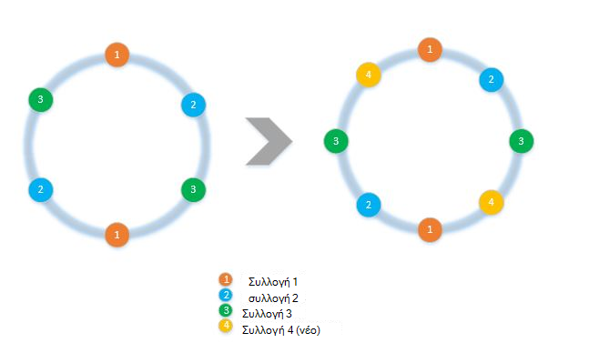
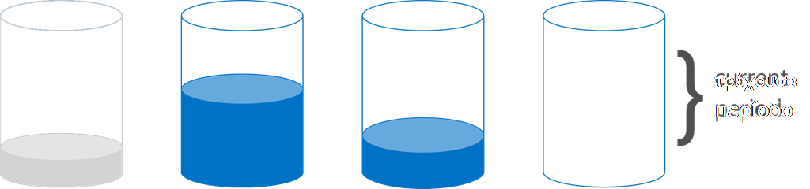

<properties 
    pageTitle="Πώς μπορείτε να υλοποιήσετε προγράμματος-πελάτη πλευρά διαμερισμάτων με το SDK | Microsoft Azure" 
    description="Μάθετε πώς να χρησιμοποιείτε το Azure SDK DocumentDB σε αιτήσεις δεδομένων και δρομολόγηση διαμερίσματα (shard) σε πολλές συλλογές" 
    services="documentdb" 
    authors="arramac" 
    manager="jhubbard" 
    editor="cgronlun" 
    documentationCenter=""/>

<tags 
    ms.service="documentdb" 
    ms.workload="data-services" 
    ms.tgt_pltfrm="na" 
    ms.devlang="na" 
    ms.topic="article" 
    ms.date="10/27/2016" 
    ms.author="arramac"/>

# <a name="how-to-partition-data-using-client-side-support-in-documentdb"></a>Πώς μπορείτε να δημιουργήσετε διαμερίσματα δεδομένων με υποστήριξη πλευρά του προγράμματος-πελάτη DocumentDB

Azure DocumentDB υποστηρίζει [Αυτόματη δημιουργία διαμερισμάτων συλλογών](documentdb-partition-data.md). Ωστόσο, υπάρχουν περιπτώσεις χρήσης όπου είναι προτιμότερο να έχουν εξαιρετική κοκκώδης έλεγχο διαμερισμάτων συμπεριφορά. Για να μειώσετε το λέβητα πλάκα κώδικα που απαιτείται για τη δημιουργία διαμερισμάτων εργασίες, Προσθέσαμε λειτουργικότητα στο το .NET, Node.js και SDK Java που σας διευκολύνει να δημιουργήσετε εφαρμογές που είναι κλιμάκωση ανάληψη σε πολλές συλλογές.

Σε αυτό το άρθρο θα σας θα δούμε τις κλάσεις και διασυνδέσεων στο το .NET SDK και πώς μπορείτε να τα χρησιμοποιήσετε για να αναπτύξετε διαμερίσματα εφαρμογές. Άλλες SDK όπως Java, Node.js και Python υποστηρίζει παρόμοια μεθόδους και διασυνδέσεων για τη δημιουργία διαμερισμάτων πλευρά του προγράμματος-πελάτη.

## <a name="client-side-partitioning-with-the-documentdb-sdk"></a>Δημιουργία διαμερισμάτων πλευρά του προγράμματος-πελάτη με το SDK DocumentDB

Πριν από την μας βαθύτερη σε διαμερισμάτων, ας recap ορισμένες βασικές έννοιες DocumentDB που σχετίζονται με τη δημιουργία διαμερισμάτων. Για κάθε λογαριασμό βάσης δεδομένων Azure DocumentDB αποτελείται από ένα σύνολο των βάσεων δεδομένων, κάθε μία που περιέχει πολλές συλλογές, κάθε μία από τις οποίες μπορούν να περιέχουν αποθηκευμένες διαδικασίες, εναύσματα, UDF, εγγράφων και σχετικές συνημμένα. Συλλογές μπορεί να διαμερισμάτων μίας ή διαμερίσματα τον εαυτό τους και να έχουν τις ακόλουθες ιδιότητες:

- Συλλογές προσφέρουν απομόνωσης επιδόσεων. Επομένως υπάρχει ένα πλεονέκτημα επιδόσεων στο ταξινόμησης παρόμοια έγγραφα μέσα στην ίδια συλλογή. Για παράδειγμα, για χρόνο σειρά δεδομένων, ενδέχεται να θέλετε να τοποθετήσετε δεδομένων για τον τελευταίο μήνα, το οποίο είναι συχνά το ερώτημα, μέσα σε μια συλλογή με υψηλότερη προμήθεια του φακέλου μεταγωγή ότι παλαιότερων δεδομένων τοποθετείται μέσα σε συλλογές με χαμηλή απόδοση προμήθεια του φακέλου.
- Συναλλαγές ΟΞΈΟΣ δηλαδή αποθηκευμένες διαδικασίες και εναύσματα δεν είναι δυνατό να εκτείνεται σε μια συλλογή. Συναλλαγές περιορίζονται μέσα σε μια τιμή κλειδιού διαμερίσματα μόνο μέσα σε μια συλλογή.
- Συλλογές επιβάλλει ένα σχήμα, ώστε να μπορούν επίσης να χρησιμοποιηθούν για έγγραφα JSON του ίδιου τύπου ή διαφορετικούς τύπους.

Ξεκινώντας με την έκδοση [1.5.x από το Azure SDK DocumentDB](documentdb-sdk-dotnet.md), μπορείτε να εκτελέσετε λειτουργίες εγγράφων απευθείας σε μια βάση δεδομένων. Εσωτερικά το [DocumentClient](https://msdn.microsoft.com/library/azure/microsoft.azure.documents.client.documentclient.aspx) χρησιμοποιεί το PartitionResolver που έχετε ορίσει για τη βάση δεδομένων σε αιτήσεις δρομολόγηση κατάλληλη συλλογή.

>[AZURE.NOTE] [Δημιουργία διαμερισμάτων διακομιστή](documentdb-partition-data.md) στην REST API 2015-12-16 και SDK 1.6.0+ deprecates η προσέγγιση επίλυσης partition πλευρά του προγράμματος-πελάτη για περιπτώσεις χρήσης απλό. Ωστόσο διαμερισμάτων πλευρά του προγράμματος-πελάτη είναι πιο ευέλικτη και σας επιτρέπει να ελέγχετε απομόνωσης επιδόσεων σε αριθμούς-κλειδιά διαμερισμάτων, έλεγχος βαθμού παραλληλισμό κατά την ανάγνωση αποτελέσματα από πολλά διαμερίσματα και να χρησιμοποιήσετε περιοχή/χώρου διαμερισμάτων προσεγγίσεις έναντι κατακερματισμός.

Για παράδειγμα, στο .NET, κάθε κατηγορία PartitionResolver είναι μια συγκεκριμένη υλοποίηση της ένα περιβάλλον εργασίας [IPartitionResolver](https://msdn.microsoft.com/library/azure/microsoft.azure.documents.client.ipartitionresolver.aspx) που έχει τρεις μέθοδοι - [GetPartitionKey](https://msdn.microsoft.com/library/azure/microsoft.azure.documents.client.ipartitionresolver.getpartitionkey.aspx), [ResolveForCreate](https://msdn.microsoft.com/library/azure/microsoft.azure.documents.client.ipartitionresolver.resolveforcreate.aspx) και [ResolveForRead](https://msdn.microsoft.com/library/azure/microsoft.azure.documents.client.ipartitionresolver.resolveforread.aspx). Ερωτήματα LINQ και οι επαναλήπτες ReadFeed Χρησιμοποιήστε τη μέθοδο ResolveForRead εσωτερικά για τη συνεχή επανάληψη όλων των συλλογών που ταιριάζει με το κλειδί διαμερίσματα για την αίτηση. Ομοίως, δημιουργία λειτουργίες Χρησιμοποιήστε τη μέθοδο ResolveForCreate για τη δρομολόγηση δημιουργεί για τα διαμερίσματα δεξιά. Δεν υπάρχουν αλλαγές απαιτείται για την αντικατάσταση, διαγραφή και διαβάστε επειδή μπορούν να χρησιμοποιήσουν έγγραφα, που περιέχουν ήδη την αναφορά στην αντίστοιχη συλλογή.

Το SDK περιλαμβάνει επίσης δύο κλάσεις που υποστηρίζουν τις δύο κανονικής διαμερισμού τεχνικές, ο κατακερματισμός και περιοχή αναζητήσεις, μέσω ενός [HashPartitionResolver](https://msdn.microsoft.com/library/azure/microsoft.azure.documents.partitioning.hashpartitionresolver.aspx) και μια [RangePartitionResolver](https://msdn.microsoft.com/library/azure/mt126047.aspx). Μπορείτε να χρησιμοποιήσετε αυτές τις κατηγορίες για να προσθέσετε εύκολα λογική δημιουργίας διαμερισμάτων στην εφαρμογή σας.  

## <a name="add-partitioning-logic-and-register-the-partitionresolver"></a>Προσθήκη λογική δημιουργίας διαμερισμάτων και καταχώρηση του PartitionResolver 

Ακολουθεί ένα απόκομμα που δείχνει πώς να δημιουργήσετε ένα [HashPartitionResolver](https://msdn.microsoft.com/library/azure/microsoft.azure.documents.partitioning.hashpartitionresolver.aspx) και να καταχωρήσετε με το DocumentClient για μια βάση δεδομένων.

```cs
// Create some collections to partition data.
DocumentCollection collection1 = await client.CreateDocumentCollectionAsync(...);
DocumentCollection collection2 = await client.CreateDocumentCollectionAsync(...);

// Initialize a HashPartitionResolver using the "UserId" property and the two collection self-links.
HashPartitionResolver hashResolver = new HashPartitionResolver(
    u => ((UserProfile)u).UserId, 
    new string[] { collection1.SelfLink, collection2.SelfLink });

// Register the PartitionResolver with the database.
this.client.PartitionResolvers[database.SelfLink] = hashResolver;

```

## <a name="create-documents-in-a-partition"></a>Δημιουργία εγγράφων στο ένα διαμερίσματα  

Όταν το PartitionResolver έχει καταχωρηθεί, μπορείτε να εκτελέσετε δημιουργεί και εκτελεί ερωτήματα απευθείας με τη βάση δεδομένων, όπως φαίνεται παρακάτω. Σε αυτό το παράδειγμα, το SDK χρησιμοποιεί το PartitionResolver για να εξαγάγετε το αναγνωριστικό χρήστη, ο κατακερματισμός του και, στη συνέχεια, χρησιμοποιήστε αυτήν την τιμή για να δρομολογήσετε η λειτουργία δημιουργίας στη σωστή συλλογή.

```cs
Document johnDocument = await this.client.CreateDocumentAsync(
    database.SelfLink, new UserProfile("J1", "@John", Region.UnitedStatesEast));
Document ryanDocument = await this.client.CreateDocumentAsync(
    database.SelfLink, new UserProfile("U4", "@Ryan", Region.AsiaPacific, UserStatus.AppearAway));
```

## <a name="create-queries-against-partitions"></a>Δημιουργία ερωτημάτων σε σχέση με τα διαμερίσματα  

Μπορείτε να υποβάλετε ερώτημα χρησιμοποιώντας τη μέθοδο [CreateDocumentQuery](https://msdn.microsoft.com/library/azure/microsoft.azure.documents.linq.documentqueryable.createdocumentquery.aspx) περνώντας στο τη βάση δεδομένων και έναν αριθμό-κλειδί διαμερίσματα. Το ερώτημα επιστρέφει ένα σύνολο αποτελεσμάτων πάνω από όλες τις συλλογές μέσα στη βάση δεδομένων που αντιστοίχιση με τον αριθμό-κλειδί διαμερίσματα.  

```cs
// Query for John's document by ID - uses PartitionResolver to restrict the query to the partitions 
// containing @John. Again the query uses the database self link, and relies on the hash resolver 
// to route the appropriate collection.
var query = this.client.CreateDocumentQuery<UserProfile>(
    database.SelfLink, null, partitionResolver.GetPartitionKey(johnProfile))
    .Where(u => u.UserName == "@John");
johnProfile = query.AsEnumerable().FirstOrDefault();
```

## <a name="create-queries-against-all-collections-in-the-database"></a>Δημιουργία ερωτημάτων σε σχέση με όλες τις συλλογές στη βάση δεδομένων 

Επίσης, μπορείτε να ερωτήματος όλες τις συλλογές μέσα στη βάση δεδομένων και να απαρίθμηση τα αποτελέσματα όπως εμφανίζονται παρακάτω, παραλείποντας το όρισμα κλειδιού διαμερίσματα.

```cs
// Query for all "Available" users. Here since there is no partition key, the query is serially executed 
// across each partition/collection and returns a single result-set. 
query = this.client.CreateDocumentQuery<UserProfile>(database.SelfLink)
    .Where(u => u.Status == UserStatus.Available);
foreach (UserProfile activeUser in query)
{
    Console.WriteLine(activeUser);
}
```

## <a name="hash-partition-resolver"></a>Ο κατακερματισμός Partition επίλυσης
Με κατακερματισμός διαμερισμάτων, τα διαμερίσματα εκχωρούνται με βάση την τιμή της συνάρτησης κατακερματισμός, επιτρέποντάς σας την ομοιόμορφη κατανομή των αιτήσεων και δεδομένων σε έναν αριθμό από τα διαμερίσματα. Αυτή η προσέγγιση χρησιμοποιείται συνήθως για διαμερίσματα δεδομένων που παράγεται ή καταναλώνεται από μεγάλου αριθμού διακριτών προγράμματα-πελάτες και είναι χρήσιμη για την αποθήκευση των προφίλ χρηστών, τα στοιχεία στον κατάλογο και δεδομένα τηλεμετρίας IoT ("Internet του πράγματα"). Δημιουργία διαμερισμάτων κατακερματισμός χρησιμοποιείται επίσης από την υποστήριξη του DocumentDB διαμερισμού διακομιστή μέσα σε μια συλλογή.

**Η διαμέριση κατακερματισμός:**


Απλό κατακερματισμός συνδυασμό διαμερισμάτων σε συλλογές *N* είναι να μεταφέρετε οποιοδήποτε έγγραφο, υπολογιστική *hash(d) mod N* για να προσδιορίσετε ποια συλλογής του έχει τοποθετηθεί στο. Αλλά ένα πρόβλημα με αυτήν την απλή τεχνική είναι ότι δεν λειτουργεί σωστά όταν προσθέτετε νέες συλλογές ή κατάργηση συλλογές με αυτό απαιτείται σχεδόν όλα τα δεδομένα για να λάβετε reshuffled. [Συνεπή ο κατακερματισμός] (http://citeseerx.ist.psu.edu/viewdoc/summary?doi=10.1.1.23.3738) είναι ένας γνωστός αλγόριθμος που αντιμετωπίζει αυτό το θέμα με την εφαρμογή ο συνδυασμός κλειδώματος που ελαχιστοποιεί την ποσότητα δεδομένων κίνηση απαιτείται κατά την προσθήκη ή την κατάργηση συλλογών.

Η κλάση [HashPartitionResolver](https://msdn.microsoft.com/library/azure/microsoft.azure.documents.partitioning.hashpartitionresolver.aspx) υλοποιεί λογικής για να δημιουργήσετε μια συνεπή κατακερματισμός κλήση μέσω της συνάρτησης κατακερματισμός που καθορίζεται στο περιβάλλον εργασίας [IHashGenerator](https://msdn.microsoft.com/library/azure/microsoft.azure.documents.partitioning.ihashgenerator.aspx) . Από προεπιλογή, το HashPartitionResolver χρησιμοποιεί μια συνάρτηση κατακερματισμός MD5, αλλά μπορείτε να κάνετε εναλλαγή αυτό εκτός με το δικό σας κλειδώματος υλοποίηση. Το HashPartitionResolver εσωτερικά δημιουργεί 16 Κατακερματισμοί ή "εικονικό κόμβους" μέσα κατακερματισμός κουδουνίσματος για κάθε συλλογή για να επιτύχετε μια πιο ομοιόμορφη κατανομή των εγγράφων κατά μήκος των συλλογών, αλλά μπορείτε να διαφοροποιήσετε αυτού του αριθμού για εμπορικές απενεργοποίηση ασυμμετρία δεδομένων με το μέγεθος του κατά τον υπολογισμό πλευρά του προγράμματος-πελάτη.

**Ο κατακερματισμός συνεπή με HashPartitionResolver:**


## <a name="range-partition-resolver"></a>Περιοχή Partition επίλυσης

Στην περιοχή Δημιουργία διαμερισμάτων, τα διαμερίσματα εκχωρούνται με βάση αν το κλειδί διαμερίσματα είναι μέσα σε συγκεκριμένο εύρος. Χρησιμοποιείται συνήθως για τη δημιουργία διαμερισμάτων με τις ιδιότητες σήμανση χρόνου (π.χ., eventTime μεταξύ 1 Απρ 2015 και 14 Απρ 2015). Η κλάση [RangePartitionResolver](https://msdn.microsoft.com/library/azure/mt126047.aspx) σάς βοηθά να διατηρείτε μια αντιστοίχιση ανάμεσα σε μια περιοχή\<T\> και συλλογή αυτο-σύνδεση. 

[Περιοχή\<T\> ](https://msdn.microsoft.com/library/azure/mt126048.aspx) είναι μια απλή κλάση που διαχειρίζεται περιοχές τυχόν τύπους που το IComparable\<T\> και IEquatable\<T\> , όπως συμβολοσειρές ή αριθμών. Για διαβάζει και δημιουργεί, μπορείτε να περάσετε οποιαδήποτε αυθαίρετη περιοχής και η επίλυση προσδιορίζει όλων των συλλογών υποψηφίου, προσδιορίζοντας τις περιοχές των διαμερισμάτων που τέμνονται με την περιοχή που ζητήθηκε. Αυτή η λειτουργία μπορεί να είναι χρήσιμες κατά την εκτέλεση ερωτήματα περιοχής ώρας σειράς δεδομένων.

**Περιοχή διαμερισμάτων:**  

  

Μια ειδική περίπτωση των διαμερισμάτων περιοχή είναι όταν η περιοχή είναι απλώς μια μεμονωμένη διακριτό τιμή, μερικές φορές ονομάζεται "διαμερισμάτων αναζήτησης". Αυτό χρησιμοποιείται συνήθως για τη δημιουργία διαμερισμάτων ανά περιοχή (π.χ., τα διαμερίσματα για Σκανδιναβία περιέχει Νορβηγία, Δανίας και Σουηδίας) ή για τη δημιουργία διαμερισμάτων μισθωτές σε μια εφαρμογή πολλών μισθωτή.

## <a name="samples"></a>Δείγματα 

Ρίξτε μια ματιά το [project Github δείγματα διαμερισμάτων DocumentDB](https://github.com/Azure/azure-documentdb-dotnet/tree/287acafef76ad223577759b0170c8f08adb45755/samples/code-samples/Partitioning) που περιέχει τμήματα κώδικα σχετικά με τον τρόπο για να χρησιμοποιήσετε αυτές τις PartitionResolvers και επέκταση τους για να υλοποιήσετε το δικό σας σύνδεση ώστε να χωρά χρήση συγκεκριμένες περιπτώσεις, όπως τα εξής: 

* Πώς μπορείτε να ορίσετε μια παράσταση αυθαίρετο λάμδα για GetPartitionKey και χρησιμοποιήστε το για να υλοποιήσετε σύνθετων διαμερισμού κλειδιών ή για να δημιουργήσετε διαφορετικά διαμερίσματα διαφορετικοί τύποι αντικειμένων.
* Μάθετε πώς μπορείτε να δημιουργήσετε ένα απλό [LookupPartitionResolver](https://github.com/Azure/azure-documentdb-dotnet/blob/287acafef76ad223577759b0170c8f08adb45755/samples/code-samples/Partitioning/Partitioners/LookupPartitionResolver.cs) που χρησιμοποιεί έναν πίνακα μη αυτόματης αναζήτησης για να εκτελέσετε διαμερισμάτων. Αυτό το μοτίβο χρησιμοποιείται συνήθως για τη δημιουργία διαμερισμάτων που βασίζεται σε διακριτές τιμές όπως περιοχής, το Αναγνωριστικό μισθωτή ή εφαρμογή ονομάτων.
* Μάθετε πώς μπορείτε να δημιουργήσετε ένα [ManagedPartitionResolver](https://github.com/Azure/azure-documentdb-dotnet/blob/287acafef76ad223577759b0170c8f08adb45755/samples/code-samples/Partitioning/Partitioners/ManagedHashPartitionResolver.cs) που δημιουργεί αυτόματα με βάση ένα πρότυπο που καθορίζει έναν συνδυασμό ονομάτων, IndexingPolicy και αποθηκευμένες διαδικασίες που πρέπει να καταχωρηθούν σε σχέση με νέες συλλογές συλλογές.
* Μάθετε πώς μπορείτε να δημιουργήσετε ένα συνδυασμό λιγότερο [SpilloverPartitionResolver](https://github.com/Azure/azure-documentdb-dotnet/blob/287acafef76ad223577759b0170c8f08adb45755/samples/code-samples/Partitioning/Partitioners/SpilloverPartitionResolver.cs) που δημιουργεί απλώς νέες συλλογές, όπως το παλιό συλλογές Συμπλήρωση προς τα επάνω.
* Πώς να σειριοποίηση και αποσειριοποίηση την κατάσταση PartitionResolver ως JSON, έτσι ώστε να μπορείτε να κάνετε κοινή χρήση μεταξύ των διαδικασιών και σε τερματισμούς. Μπορείτε να παραμένει αυτά σε αρχεία ρύθμισης παραμέτρων ή ακόμη και σε μια συλλογή DocumentDB.
* Μια κλάση [DocumentClientHashPartitioningManager](https://github.com/Azure/azure-documentdb-dotnet/blob/287acafef76ad223577759b0170c8f08adb45755/samples/code-samples/Partitioning/Util/DocumentClientHashPartitioningManager.cs) για δυναμική Προσθήκη και κατάργηση τα διαμερίσματα με μια βάση δεδομένων διαμερίσματα με βάση συνεπή ο κατακερματισμός. Εσωτερικά χρησιμοποιεί μια [TransitionHashPartitionResolver](https://github.com/Azure/azure-documentdb-dotnet/blob/287acafef76ad223577759b0170c8f08adb45755/samples/code-samples/Partitioning/Partitioners/TransitionHashPartitionResolver.cs) να διαβάζει δρομολόγηση και συντάσσει κατά τη διάρκεια της μετεγκατάστασης χρησιμοποιώντας μία από τις τέσσερις λειτουργίες - ανάγνωση από το παλιό συνδυασμού διαμερισμού (ReadCurrent), της νέας εφαρμογής (ReadNext), συγχώνευση αποτελέσματα από δύο (ReadBoth) ή να μην είναι διαθέσιμες κατά τη διάρκεια της μετεγκατάστασης (καμία).

Άνοιγμα αρχείου προέλευσης είναι τα δείγματα και σας προτείνουμε να υποβάλετε αιτήσεις ελκυστική με συνεισφορά που μπορούν να επωφεληθούν άλλους προγραμματιστές DocumentDB. Ανατρέξτε στην οι [οδηγίες συνεισφορά](https://github.com/Azure/azure-documentdb-net/blob/master/Contributing.md) για οδηγίες σχετικά με τον τρόπο για να συνεισφέρετε.  

>[AZURE.NOTE] Συλλογή δημιουργεί είναι επιτόκιο-περιορίζεται από DocumentDB, ώστε να ορισμένες από τις μεθόδους δείγμα φαίνεται εδώ ενδέχεται να χρειαστούν μερικά λεπτά για να ολοκληρωθεί.

##<a name="faq"></a>ΣΥΝΉΘΕΙΣ ΕΡΩΤΉΣΕΙΣ
**DocumentDB υποστηρίζει διαμερισμάτων πλευρά του διακομιστή;**

Ναι, DocumentDB υποστηρίζει [διαμερισμάτων πλευρά του διακομιστή](documentdb-partition-data.md). DocumentDB υποστηρίζει επίσης την πλευρά του προγράμματος-πελάτη διαμερισμάτων μέσω επίλυσης partition πλευρά του προγράμματος-πελάτη για πιο σύνθετες περιπτώσεις χρήσης.

**Πότε πρέπει να χρησιμοποιώ διακομιστή έναντι διαμερισμάτων πλευρά του προγράμματος-πελάτη;**
Για το μεγαλύτερο μέρος των περιπτώσεων χρήσης, συνιστούμε τη χρήση του διακομιστή διαμερισμάτων εφόσον χειρίζεται τις εργασίες διαχείρισης των διαμερισμάτων δεδομένων και τη δρομολόγηση αιτήσεις. Ωστόσο, εάν χρειάζεστε περιοχής διαμερισμάτων ή έχετε μια υπόθεση χρήσης εξειδικευμένες για επιδόσεων απομόνωσης μεταξύ διαφορετικές τιμές του αριθμούς-κλειδιά διαμερισμάτων, στη συνέχεια, διαμερισμάτων πλευρά του προγράμματος-πελάτη μπορεί να είναι η καλύτερη προσέγγιση.

**Πώς Προσθήκη ή κατάργηση μιας συλλογής μου διαμερισμού συνδυασμό;**

Ρίξτε μια ματιά την εφαρμογή της DocumentClientHashPartitioningManager του έργου δείγματα ένα παράδειγμα για το πώς μπορείτε να υλοποιήσετε επανάληψη του διαμερισμού.

**Πώς παραμένει ή κοινή χρήση μου διαμερισμού ρύθμισης παραμέτρων με άλλα προγράμματα-πελάτες;**

Μπορείτε να την κατάσταση partitioner ως JSON σειριοποίηση και να αποθηκεύσετε σε αρχεία ρύθμισης παραμέτρων ή ακόμη και σε συλλογές DocumentDB. Ρίξτε μια ματιά τη μέθοδο RunSerializeDeserializeSample του έργου δείγματα για ένα παράδειγμα.

**Πώς να ποδηλάτου διάφορες τεχνικές διαμερισμού;**

Να συνδέετε PartitionResolvers εφαρμόζοντας τη δική σας IPartitionResolver που χρησιμοποιεί εσωτερικά μία ή περισσότερες υπάρχουσες επίλυσης. Ρίξτε μια ματιά στο TransitionHashPartitionResolver του έργου δείγματα για ένα παράδειγμα.

##<a name="references"></a>Αναφορές
* [Πλευρά του διακομιστή διαμερισμάτων στο DocumentDB](documentdb-partition-data.md)
* [Συλλογές DocumentDB και επιδόσεων](documentdb-performance-levels.md)
* [Δημιουργία διαμερισμάτων δείγματα κώδικα στην Github](https://github.com/Azure/azure-documentdb-dotnet/tree/287acafef76ad223577759b0170c8f08adb45755/samples/code-samples/Partitioning)
* [Τεκμηρίωση SDK .NET DocumentDB στο MSDN](https://msdn.microsoft.com/library/azure/dn948556.aspx)
* [Δείγματα DocumentDB .NET](https://github.com/Azure/azure-documentdb-net)
* [Όρια DocumentDB](documentdb-limits.md)
* [Συμβουλές ιστολογίου DocumentDB στις επιδόσεις](https://azure.microsoft.com/blog/2015/01/20/performance-tips-for-azure-documentdb-part-1-2/)
 
