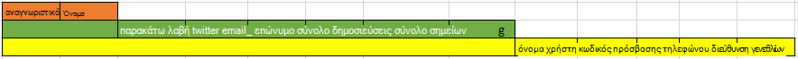
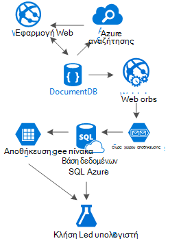

<properties 
    pageTitle="Μοτίβο σχεδίαση DocumentDB: εφαρμογές μέσα κοινωνικής δικτύωσης | Microsoft Azure" 
    description="Μάθετε σχετικά με ένα μοτίβο σχεδίασης για κοινωνικά δίκτυα, αξιοποίηση την ευελιξία χώρου αποθήκευσης της DocumentDB και άλλες υπηρεσίες του Azure." 
    keywords="εφαρμογές μέσα κοινωνικής δικτύωσης"
    services="documentdb" 
    authors="ealsur" 
    manager="jhubbard" 
    editor="" 
    documentationCenter=""/>

<tags 
    ms.service="documentdb" 
    ms.workload="data-services" 
    ms.tgt_pltfrm="na" 
    ms.devlang="na" 
    ms.topic="article" 
    ms.date="09/27/2016" 
    ms.author="mimig"/>

# Συνεχής χρήση κοινωνικών με DocumentDB

Ζουν σε μια ένωση μαζικά-συνδέονται μεταξύ τους σημαίνει ότι, σε κάποιο σημείο κατά τη διάρκεια ζωής, θα γίνετε μέρος ενός **κοινωνικού δικτύου**. Χρησιμοποιούμε κοινωνικά δίκτυα, να κρατήσετε επαφή με φίλους, συνεργάτες, συγγενείς ή μερικές φορές για να μοιραστείτε μας πάθος με άτομα με κοινά ενδιαφέροντα.

Ως μηχανικών ή προγραμματιστές, η θα σας ενδέχεται να έχετε αναρωτηθεί και πώς αυτά τα δίκτυα αποθήκευση και διασύνδεση δεδομένα μας, ή μπορεί να έχετε ακόμη και έχουν ανατεθεί για να δημιουργήσετε ή να αρχιτεκτονική ένα νέο κοινωνικό δίκτυο για μια συγκεκριμένη niche αγορά μόνοι σας. Που είναι όταν μεγάλο τίθεται: Τρόπος αποθήκευσης όλα αυτά τα δεδομένα;

Ας υποθέσουμε ότι δημιουργείτε ένα νέο και φωτεινά κοινωνικό δίκτυο, όπου μας οι χρήστες μπορούν να δημοσιεύσουν άρθρα με σχετικές πολυμέσων, όπως εικόνες, βίντεο ή ακόμα και μουσική. Οι χρήστες μπορούν να σχολιάσετε δημοσιεύσεις και δώστε σημεία για τους χαρακτηρισμούς. Θα υπάρξει τροφοδοσία δημοσιεύσεις που θα βλέπουν οι χρήστες και θα μπορείτε να αλληλεπιδράσετε με στη σελίδα προορισμού κύρια τοποθεσία Web. Αυτό δεν ήχος πραγματικά πολύπλοκη (την πρώτη), αλλά λόγους απλούστευσης διακοπή ας εκεί (θα μπορούσε να μας του delve σε τροφοδοσίες προσαρμοσμένου χρήστη που επηρεάζονται από σχέσεις, αλλά υπερβαίνει το στόχο αυτού του άρθρου).

Επομένως, πώς θα σας να αποθηκεύετε αυτό και πού;

Πολλοί από εσάς μπορεί να αντιμετωπίσετε προβλήματα σε βάσεις δεδομένων SQL ή να έχετε τουλάχιστον έννοια των [σχεσιακών μοντελοποίηση δεδομένων](https://en.wikipedia.org/wiki/Relational_model) και ίσως έχετε την τάση να ξεκινήσετε τη σχεδίαση κάπως έτσι:

 

Δομή δεδομένων τέλεια κανονικοποιημένη και όμορφη... που δεν κλίμακα. 

Δεν λαμβάνετε εμένα λάθος, να έχετε εργαστεί με βάσεις δεδομένων SQL ζωή μου, είναι καλό, αλλά όπως κάθε πλατφόρμα μοτίβο, πρακτικής εξάσκησης και λογισμικό, δεν είναι ιδανική για κάθε σενάριο.

Γιατί δεν είναι SQL η καλύτερη επιλογή σε αυτό το σενάριο; Ας δούμε τη δομή του μια μεμονωμένη δημοσίευση, εάν να αποφασίσατε για να εμφανίσετε αυτήν τη δημοσίευση σε μια τοποθεσία Web ή μια εφαρμογή, θα πρέπει να κάνετε ένα ερώτημα με... 8 πίνακα συνδέσμους (!) μόνο για να εμφανίσετε ένα μεμονωμένο δημοσίευση, στη συνέχεια, εικόνα μια ροή των δημοσιεύσεων που δυναμικά φόρτωση και εμφανίζονται στην οθόνη και που ενδέχεται να δείτε πού θα.

Θα μπορούσε να, φυσικά, χρησιμοποιούμε μια humongous παρουσία SQL με αρκετές power για την επίλυση χιλιάδων ερωτημάτων με αυτές τις πολλές σύνδεσμοι για να εξυπηρετήσει μας περιεχόμενο, αλλά πραγματικά, γιατί θα σας όταν υπάρχει μια λύση απλούστερο;

## Το θέμα NoSQL

Υπάρχουν ειδικές graph βάσεις δεδομένων που μπορούν να [εκτελεστούν σε Azure](http://neo4j.com/developer/guide-cloud-deployment/#_windows_azure) αλλά δεν είναι οικονομικό και απαιτούν υπηρεσίες IaaS (υποδομή-ως-a-υπηρεσία, εικονικές μηχανές κυρίως) και τη συντήρηση. Θα στόχος χαμηλότερο κόστος λύσης που λειτουργούν σε αυτό το άρθρο για τα περισσότερα σενάρια, εκτελείται σε βάση δεδομένων NoSQL του Azure [DocumentDB](https://azure.microsoft.com/services/documentdb/). Χρησιμοποιώντας μια [NoSQL](https://en.wikipedia.org/wiki/NoSQL) προσέγγιση, την αποθήκευση των δεδομένων σε μορφή JSON και εφαρμόζοντας [denormalization](https://en.wikipedia.org/wiki/Denormalization), μας προηγουμένως περίπλοκη δημοσίευση μπορούν να μετατραπούν σε ένα μεμονωμένο [έγγραφο](https://en.wikipedia.org/wiki/Document-oriented_database):

    {
        "id":"ew12-res2-234e-544f",
        "title":"post title",
        "date":"2016-01-01",
        "body":"this is an awesome post stored on NoSQL",
        "createdBy":User,
        "images":["http://myfirstimage.png","http://mysecondimage.png"],
        "videos":[
            {"url":"http://myfirstvideo.mp4", "title":"The first video"},
            {"url":"http://mysecondvideo.mp4", "title":"The second video"}
        ],
        "audios":[
            {"url":"http://myfirstaudio.mp3", "title":"The first audio"},
            {"url":"http://mysecondaudio.mp3", "title":"The second audio"}
        ]
    }

Και μπορείτε να αποκτήσετε με ένα ερώτημα, και δεν υπάρχει σύνδεσμοι. Αυτό είναι πολύ πιο απλές και απλές και, budget-wise, απαιτεί λιγότερους πόρους για την επίτευξη καλύτερων αποτέλεσμα.

Azure DocumentDB διασφαλίζει ότι όλες οι ιδιότητες είναι στο ευρετήριο με την [Αυτόματη δημιουργία ευρετηρίου](documentdb-indexing.md), που μπορούν να ακόμα και να [προσαρμοστεί](documentdb-indexing-policies.md). Η προσέγγιση σχήμα χωρίς μας επιτρέπει να αποθηκεύσετε έγγραφα με διαφορετικούς και δυναμική δομές, ίσως αύριο θέλουμε να έχετε μια λίστα κατηγοριών ή hashtags που σχετίζονται με τις δημοσιεύσεις, DocumentDB θα χειρίζεται τα νέα έγγραφα με τα χαρακτηριστικά που προστέθηκαν με χωρίς επιπλέον εργασίας απαιτείται από εμάς.

Σχόλια σε μια δημοσίευση να αντιμετωπίζεται ως απλώς άλλες δημοσιεύσεις με μια ιδιότητα γονικού (απλοποιεί μας αντιστοίχισης αντικείμενο). 

    {
        "id":"1234-asd3-54ts-199a",
        "title":"Awesome post!",
        "date":"2016-01-02",
        "createdBy":User2,
        "parent":"ew12-res2-234e-544f"
    }

    {
        "id":"asd2-fee4-23gc-jh67",
        "title":"Ditto!",
        "date":"2016-01-03",
        "createdBy":User3,
        "parent":"ew12-res2-234e-544f"
    }

Και όλες τις κοινωνικές αλληλεπιδράσεις μπορούν να αποθηκευτούν σε ένα ξεχωριστό αντικείμενο ως μετρητές:

    {
        "id":"dfe3-thf5-232s-dse4",
        "post":"ew12-res2-234e-544f",
        "comments":2,
        "likes":10,
        "points":200
    }

Τη δημιουργία τροφοδοσιών είναι απλώς θέμα τη δημιουργία εγγράφων που μπορεί να περιέχει μια λίστα των αναγνωριστικών δημοσίευση με μια σειρά που δίνεται συνάφειας:

    [
        {"relevance":9, "post":"ew12-res2-234e-544f"},
        {"relevance":8, "post":"fer7-mnb6-fgh9-2344"},
        {"relevance":7, "post":"w34r-qeg6-ref6-8565"}
    ]

Θα μπορούσε να έχουμε μια ροή "τελευταία" με καταχωρήσεις σύμφωνα με την ημερομηνία δημιουργίας, μια "πιο καυτά" ροή με αυτές τις καταχωρήσεις με πιο αρέσει τις τελευταίες 24 ώρες, ακόμα και θα σας θα μπορούσε να υλοποιήσετε μια προσαρμοσμένη ροή για κάθε χρήστη που βασίζεται σε λογική όπως ακόλουθοι και τα ενδιαφέροντά σας και θα είναι μια λίστα με καταχωρήσεις. Αυτό είναι το θέμα Πώς να δημιουργείτε αυτές τις λίστες, αλλά οι επιδόσεις ανάγνωσης παραμένει απρόσκοπτη. Αφού μας αποκτήσετε μία από αυτές τις λίστες, θα σας θεμάτων ένα ερώτημα για να DocumentDB χρήση [τελεστής IN](documentdb-sql-query.md#where-clause) για να αποκτήσετε σελίδες των δημοσιεύσεων κάθε φορά.

Ήταν δυνατή η δημιουργία τροφοδοσίας ροών χρησιμοποιώντας διαδικασίες φόντου [Azure εφαρμογή υπηρεσιών](https://azure.microsoft.com/services/app-service/) : [Webjobs](../app-service-web/web-sites-create-web-jobs.md). Όταν δημιουργηθεί μια καταχώρηση, επεξεργασία στο παρασκήνιο μπορεί να ενεργοποιηθεί χρησιμοποιώντας το [Χώρο αποθήκευσης Azure](https://azure.microsoft.com/services/storage/) [ουρές](../storage/storage-dotnet-how-to-use-queues.md) και Webjobs ενεργοποίησε χρησιμοποιώντας το [Azure Webjobs SDK](../app-service-web/websites-dotnet-webjobs-sdk.md), την καταχώρηση της μεταβίβασης μέσα ροών με βάση τη δική μας προσαρμοσμένη λογική εφαρμογής. 

Σημεία και μου αρέσει πάνω από μια καταχώρηση μπορεί να υποβάλλονται σε επεξεργασία αναβολή χρησιμοποιώντας αυτήν την ίδια τεχνική για να δημιουργήσετε ένα περιβάλλον τελικά συνεπή τρόπο.

Ακόλουθοι είναι trickier. DocumentDB έχει όριο μεγέθους εγγράφου 512Kb, ώστε να μπορεί να σκέφτεστε σχετικά με την αποθήκευση ακόλουθοι ως έγγραφο με αυτή τη δομή:

    {
        "id":"234d-sd23-rrf2-552d",
        "followersOf": "dse4-qwe2-ert4-aad2",
        "followers":[
            "ewr5-232d-tyrg-iuo2",
            "qejh-2345-sdf1-ytg5",
            //...
            "uie0-4tyg-3456-rwjh"
        ]
    }

Αυτό μπορεί να λειτουργεί για ένα χρήστη με μερικά χιλιάδων παρακολουθούν, αλλά εάν ορισμένα φήμης ενώνει μας ταξινομεί, αυτό θα προσέγγιση τελικά πατήσετε το καπέλο μέγεθος εγγράφου.

Για να επιλύσετε αυτό το πρόβλημα, μπορούμε να χρησιμοποιήσουμε μια μεικτή προσέγγιση. Μπορείτε να αποθηκεύσετε τον αριθμό των ακόλουθοι ως μέρος του εγγράφου στατιστικά στοιχεία χρήστη:

    {
        "id":"234d-sd23-rrf2-552d",
        "user": "dse4-qwe2-ert4-aad2",
        "followers":55230,
        "totalPosts":452,
        "totalPoints":11342
    }

Και το πραγματικό γράφημα της ακόλουθοι μπορούν να αποθηκευτούν σε Azure χώρος αποθήκευσης πινάκων χρησιμοποιώντας την [επέκταση](https://github.com/richorama/AzureStorageExtensions#azuregraphstore) που επιτρέπει την απλή "A-εξής-B" Αποθήκευση και ανάκτηση. Με αυτόν τον τρόπο που θα σας να αναθέσετε τη διαδικασία ανάκτησης ακριβή ακόλουθοι λίστα (όταν χρειαζόμαστε) στους πίνακες Azure χώρου αποθήκευσης, αλλά για την αναζήτηση μιας γρήγορης αριθμών, θα σας συνεχίσετε να χρησιμοποιείτε DocumentDB.

## Η "Κλίμακα" Επανάληψη μοτίβου και δεδομένων

Όπως μπορείτε ίσως έχετε παρατηρήσει στο έγγραφο JSON που αναφέρεται σε μια δημοσίευση, υπάρχουν πολλές εμφανίσεις ενός χρήστη. Και μπορείτε να έχετε μαντέψει δεξιά, αυτό σημαίνει ότι οι πληροφορίες που αντιπροσωπεύει ένα χρήστη, δεδομένο αυτό denormalization, μπορεί να υπάρχουν σε περισσότερα από ένα σημείο.

Για να επιτρέψετε για ταχύτερη ερωτήματα, θα σας αναλαμβάνει διπλότυπα δεδομένα. Το πρόβλημα με αυτό το εφέ πλευρά είναι ότι εάν από κάποια ενέργεια, αλλαγές στα δεδομένα ενός χρήστη, πρέπει να βρείτε όλες τις δραστηριότητες ποτέ έχει αλλάξει και ενημερώστε τις όλες. Δεν ήχος πολύ πρακτικές, δεξιά;

Βάσεις δεδομένων γραφήματος την επίλυση με τις δικές τους τρόπο, θα την επίλυση, προσδιορίζοντας τα χαρακτηριστικά του αριθμού-κλειδιού του χρήστη που θα σας δείξουμε στην εφαρμογή μας για κάθε δραστηριότητα. Εάν θα σας οπτικά εμφάνιση μια δημοσίευση στην εφαρμογή και να εμφανίσετε μόνο το δημιουργό ονόματος και εικόνας, γιατί αποθήκευση όλων των δεδομένων του χρήστη στο χαρακτηριστικό "createdBy"; Εάν για κάθε σχόλιο δείξουμε μόνο την εικόνα του χρήστη, θα σας δεν χρειάζεται πραγματικά τις υπόλοιπες πληροφορίες του. Που είναι κάτι να καλέσετε το μοτίβο"ιεραρχία" μπορεί να βοηθήσει σε αναπαραγωγή.

Ας ρίξουμε πληροφορίες χρήστη ως παράδειγμα:

    {
        "id":"dse4-qwe2-ert4-aad2",
        "name":"John",
        "surname":"Doe",
        "address":"742 Evergreen Terrace",
        "birthday":"1983-05-07",
        "email":"john@doe.com",
        "twitterHandle":"@john",
        "username":"johndoe",
        "password":"some_encrypted_phrase",
        "totalPoints":100,
        "totalPosts":24
    }
    
Εξετάζοντας αυτές τις πληροφορίες, θα σας μπορούν να εντοπίσουν γρήγορα που είναι σημαντικές πληροφορίες και που δεν είναι, δημιουργώντας μια "κλίμακα":

Το μικρότερο βήμα ονομάζεται μια UserChunk, το ελάχιστο καταδείξετε κάποια πληροφορία που προσδιορίζει ένα χρήστη και χρησιμοποιείται για αναπαραγωγή δεδομένων. Μειώνοντας το μέγεθος των διπλότυπων δεδομένων σε μόνο τις πληροφορίες που θα σας θα "Εμφάνιση", μπορούμε να μειώσουμε την πιθανότητα των μαζικών ενημερώσεις.

Στο μεσαίο βήμα ονομάζεται στο χρήστη, είναι τα πλήρη δεδομένα που θα χρησιμοποιηθεί σε περισσότερα ερωτήματα εξαρτάται από την απόδοση στην DocumentDB, η πιο πρόσβαση και κρίσιμη. Περιλαμβάνει τις πληροφορίες που αντιπροσωπεύονται από μια UserChunk.

Το μεγαλύτερο διάστημα είναι ο χρήστης επεκταθεί. Περιλαμβάνει όλες τις πληροφορίες χρήστη κρίσιμες μαζί με άλλα δεδομένα που δεν απαιτούν πραγματικά να διαβαστεί γρήγορα ή της χρήσης είναι ενδεχόμενη (όπως η διαδικασία σύνδεσης). Αυτά τα δεδομένα μπορούν να αποθηκευτούν εκτός DocumentDB, σε βάση δεδομένων SQL Azure ή Azure χώρος αποθήκευσης πινάκων.

Γιατί θα σας θα διαιρέσετε το χρήστη και να ακόμα και αποθηκεύστε τις πληροφορίες σε διαφορετικές θέσεις; Επειδή είναι [δεν απεριόριστο](documentdb-limits.md) χώρο αποθήκευσης στο DocumentDB και από μια επιδόσεων σημείο της προβολής, τόσο μεγαλύτερο τα έγγραφα, το costlier τα ερωτήματα. Διατήρηση μικρού μεγέθους, με τις σωστές πληροφορίες για να κάνετε όλα τα ερωτήματά σας εξαρτάται από την απόδοση για το κοινωνικό σας δίκτυο, και αποθηκεύονται οι επιπλέον πληροφορίες για ενδεχόμενη σενάρια, όπως αλλαγές πλήρη προφίλ, συνδέσεις, ακόμα και εξόρυξης δεδομένων για ανάλυση χρήσης και πρωτοβουλίες Big Data έγγραφα. Θα σας πραγματικά δεν σας πειράζει εάν τα δεδομένα τη συγκέντρωση για εξόρυξης δεδομένων είναι πιο αργά, επειδή εκτελείται σε βάση δεδομένων SQL Azure, θα σας έχουν αφορούν μέσω μας οι χρήστες να έχουν μια εμπειρία γρήγορη και μικρού μεγέθους. Ένας χρήστης, είναι αποθηκευμένο στο DocumentDB, θα μοιάζει κάπως έτσι:

    {
        "id":"dse4-qwe2-ert4-aad2",
        "name":"John",
        "surname":"Doe",
        "username":"johndoe"
        "email":"john@doe.com",
        "twitterHandle":"@john"
    }

Και μια δημοσίευση έχει τη μορφή:

    {
        "id":"1234-asd3-54ts-199a",
        "title":"Awesome post!",
        "date":"2016-01-02",
        "createdBy":{
            "id":"dse4-qwe2-ert4-aad2",
            "username":"johndoe"
        }
    }

Και κατά την επεξεργασία ενός προκύψει όπου ένα από τα χαρακτηριστικά του μπλοκ επηρεάζεται, είναι εύκολο να βρείτε τα έγγραφα που επηρεάζεται χρησιμοποιώντας ερωτήματα που οδηγεί το ευρετήριο χαρακτηριστικά (ΕΠΙΛΟΓΉ * από τις δημοσιεύσεις p p.createdBy.id ΠΟΎ == "edited_user_id") και, στη συνέχεια, ενημερώνοντας το μπλοκ.

## Στο πλαίσιο αναζήτησης

Οι χρήστες θα δημιουργήσει Ευτυχώς πολύ περιεχόμενο. Και θα σας πρέπει να είναι σε θέση να παρέχουν τη δυνατότητα να πραγματοποιήσετε αναζήτηση και εύρεση περιεχομένου που ενδέχεται να μην είναι απευθείας από τις ροές περιεχομένου, ίσως επειδή δεν θα σας, ακολουθήστε τους δημιουργούς ή μήπως θα σας προσπαθείτε απλώς για να βρείτε ότι παλιά δημοσίευση κάναμε πριν από 6 μήνες.

Thankfully, και επειδή χρησιμοποιούμε Azure DocumentDB, θα σας μπορούν να εφαρμόσουν εύκολα μια μηχανή αναζήτησης χρήση [Azure αναζήτηση](https://azure.microsoft.com/services/search/) σε μερικά λεπτά και χωρίς να πληκτρολογούν μία γραμμή του κώδικα (εκτός από εμφανώς, η διαδικασία αναζήτησης και περιβάλλον εργασίας Χρήστη).

Γιατί είναι τόσο εύκολη αυτό;

Azure αναζήτησης υλοποιεί τι καλούν [Οι δεικτοδότες](https://msdn.microsoft.com/library/azure/dn946891.aspx), διεργασίες παρασκηνίου που συνδέσετε σας αποθετηρίων δεδομένων και automagically Προσθήκη, ενημέρωση ή κατάργηση τα αντικείμενα στα ευρετήρια. Που υποστηρίζουν μια [βάση δεδομένων SQL Azure Οι δεικτοδότες](https://blogs.msdn.microsoft.com/kaevans/2015/03/06/indexing-azure-sql-database-with-azure-search/), [Οι δεικτοδότες αντικείμενα BLOB Azure](../search/search-howto-indexing-azure-blob-storage.md) και thankfully, [Οι δεικτοδότες Azure DocumentDB](../documentdb/documentdb-search-indexer.md). Τη μετάβαση των πληροφοριών από DocumentDB Azure αναζήτησης είναι άμεση, ως δύο πληροφορίες του χώρου αποθήκευσης σε μορφή JSON, χρειαζόμαστε για να [δημιουργήσετε το ευρετήριο](../search/search-create-index-portal.md) και ποια χαρακτηριστικά από μας έγγραφα θέλουμε χάρτη σε ευρετήριο και που είναι, σε λίγα λεπτά (εξαρτάται από το μέγεθος των δεδομένων μας), όλο το περιεχόμενο θα είναι διαθέσιμο για να γίνει αναζήτηση κατά, η καλύτερη λύση ως-a-υπηρεσίας αναζήτησης της υποδομής cloud. 

Για περισσότερες πληροφορίες σχετικά με το Azure αναζήτησης, μπορείτε να επισκεφθείτε το [Hitchhiker του οδηγού για την αναζήτηση](https://blogs.msdn.microsoft.com/mvpawardprogram/2016/02/02/a-hitchhikers-guide-to-search/).

## Το υποκείμενο γνώσεων

Μετά την αποθήκευση αυτό όλο το περιεχόμενο που αναπτύσσεται και μεγαλώσει καθημερινά, θα σας ενδέχεται να βρεθήκαμε υπόψη: Τι μπορώ να κάνω με όλα αυτή η ροή των πληροφοριών από τους χρήστες μου;

Η απάντηση είναι απλή: τοποθέτηση ώστε να λειτουργούν και για να μάθετε από αυτή.

Όμως, τι να μας μάθετε; Μερικά παραδείγματα εύκολο συμπερίληψη [άποψη ανάλυσης](https://en.wikipedia.org/wiki/Sentiment_analysis), περιεχομένου συστάσεις με βάση τις προτιμήσεις χρήστη ή ακόμη και ένα αυτοματοποιημένο περιεχομένου επόπτη που εξασφαλίζει ότι όλο το περιεχόμενο που δημοσιεύτηκε από το κοινωνικό δίκτυο είναι ασφαλείς για την οικογένεια προγραμμάτων.

Τώρα που έλαβα που είναι συνδεδεμένα, θα πιθανώς πιστεύετε ότι χρειάζεστε ορισμένες PhD στο science μαθηματικών για να εξαγάγετε αυτά τα μοτίβα και πληροφορίες από το απλό βάσεις δεδομένων και αρχεία, αλλά μπορείτε να είναι εσφαλμένο.

[Azure μηχανικής εκμάθησης](https://azure.microsoft.com/services/machine-learning/), μέρος την [Οικογένεια προγραμμάτων πληροφοριών Cortana](https://www.microsoft.com/en/server-cloud/cortana-analytics-suite/overview.aspx), είναι το μια υπηρεσία cloud πλήρως διαχειριζόμενων που σας επιτρέπει να δημιουργήσετε ροές εργασίας χρησιμοποιώντας αλγόριθμους σε μια απλή διασύνδεση μεταφοράς και απόθεσης, κωδικός τη δική σας αλγορίθμους σε [R](https://en.wikipedia.org/wiki/R_(programming_language)) ή χρησιμοποιήστε ορισμένες από τις ήδη δημιουργηθεί και είστε έτοιμοι να χρησιμοποιήσετε όπως APIs: [Ανάλυση κειμένου](https://gallery.cortanaanalytics.com/MachineLearningAPI/Text-Analytics-2), [Επόπτη περιεχομένου](https://www.microsoft.com/moderator) ή [συστάσεις](https://gallery.cortanaanalytics.com/MachineLearningAPI/Recommendations-2).

Για να κάνετε οτιδήποτε από τα παρακάτω σενάρια μηχανικής εκμάθησης, χρησιμοποιούμε να [Azure λίμνης δεδομένων](https://azure.microsoft.com/services/data-lake-store/) για να ingest τις πληροφορίες από διαφορετικές προελεύσεις, και χρησιμοποιήστε [U-SQL](https://azure.microsoft.com/documentation/videos/data-lake-u-sql-query-execution/) για να επεξεργαστείτε τις πληροφορίες και να παράγει ένα αποτέλεσμα που μπορεί να υποστεί επεξεργασία από Azure μηχανικής εκμάθησης.

Διαθέσιμη μια άλλη επιλογή είναι να χρησιμοποιήσετε [Γνωστική υπηρεσίες της Microsoft](https://www.microsoft.com/cognitive-services) για την ανάλυση μας περιεχομένου στους χρήστες. όχι μόνο να μας Κατανόηση τους καλύτερη (έως την ανάλυση να γράψει με [API ανάλυση κειμένου](https://www.microsoft.com/cognitive-services/en-us/text-analytics-api)), αλλά εντοπίζουμε μπορεί επίσης ανεπιθύμητα ή ώριμη περιεχόμενο και ενεργούν ανάλογα με [Τον υπολογιστή API προβλήματα όρασης](https://www.microsoft.com/cognitive-services/en-us/computer-vision-api). Γνωστική υπηρεσίες περιλαμβάνουν πολλές λύσεις εκτός του πλαισίου που δεν απαιτούν οποιοδήποτε είδος μηχανικής εκμάθησης γνώσεων για να χρησιμοποιήσετε.

## Ολοκλήρωση

Σε αυτό το άρθρο προσπαθεί να έσοδα ορισμένες light σε τις εναλλακτικές δημιουργίας εντελώς κοινωνικά δίκτυα στο Azure με υπηρεσίες χαμηλού κόστους και παρέχοντας εξαιρετικές αποτελέσματα από ενθαρρύνει τη χρήση μιας πολυεπίπεδη αποθήκευσης λύσης και δεδομένα κατανομής, που ονομάζεται "Κλίμακα".

Αλήθειας είναι ότι δεν υπάρχει καμία silver κουκκίδας για αυτό το είδος σενάρια, είναι η συνέργεια δημιουργείται από το συνδυασμό εξαιρετική των υπηρεσιών που επιτρέπουν μας για να δημιουργήσετε εξαιρετικές εμπειρίες: της ταχύτητας και του ελευθερίας του Azure DocumentDB να παρέχουν μια εξαιρετική εφαρμογή κοινωνικών, το ευφυΐας πίσω από μια λύση κορυφαία αναζήτησης όπως Azure αναζήτηση, την ευελιξία Azure υπηρεσιών εφαρμογής στον κεντρικό υπολογιστή δεν ακόμα και εφαρμογές agnostic γλώσσα αλλά διεργασίες παρασκηνίου ισχυρές και το επεκτάσιμη αποθήκευσης Azure και βάση δεδομένων SQL Azure για Αποθήκευση τεράστιες ποσότητες δεδομένων και την αναλυτική δύναμη του Azure μηχανικής εκμάθησης για να δημιουργήσετε γνώσεων και ευφυΐας που μπορούν να παρέχουν σχολίων για να μας διαδικασίες και βοήθεια μας να κάνουν το σωστό περιεχόμενο στους χρήστες δεξιά.

## Επόμενα βήματα

Μάθετε περισσότερα σχετικά με μοντελοποίηση διαβάζοντας το άρθρο [μοντελοποίηση δεδομένων στο DocumentDB](documentdb-modeling-data.md) δεδομένων. Εάν σας ενδιαφέρει άλλες περιπτώσεις χρήσης για DocumentDB, ανατρέξτε στο θέμα [Συνήθεις DocumentDB περιπτώσεις χρήσης](documentdb-use-cases.md).

Ή να μάθετε περισσότερα σχετικά με το DocumentDB, ακολουθώντας τη [Διαδικασία εκμάθησης DocumentDB](https://azure.microsoft.com/documentation/learning-paths/documentdb/).
