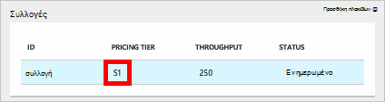
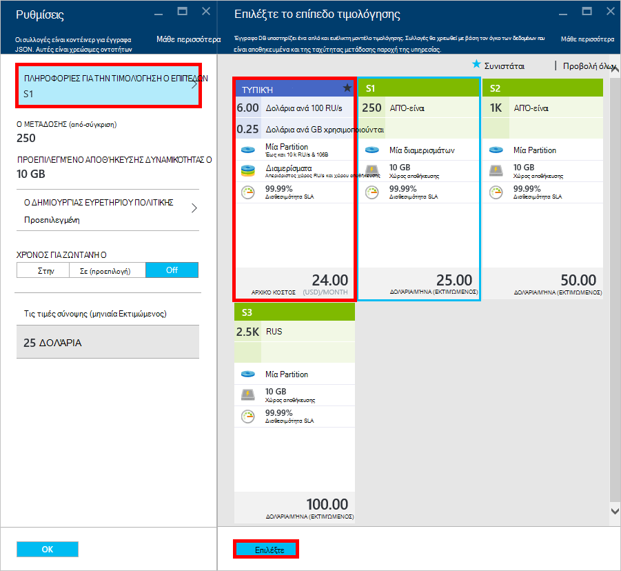
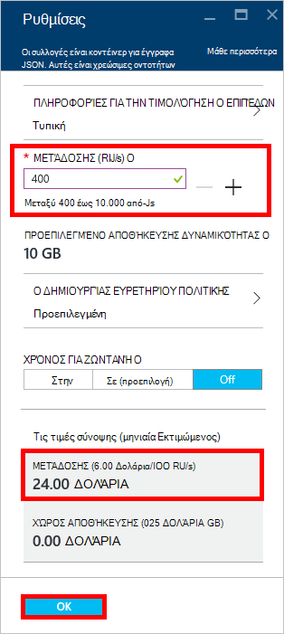
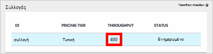

<properties 
    pageTitle="Supercharge το λογαριασμό σας DocumentDB S1 | Microsoft Azure" 
    description="Εκμεταλλευτείτε αυξημένη μετάδοσης στο λογαριασμό σας DocumentDB S1, καθιστώντας μερικές απλές αλλαγές στην πύλη του Azure." 
    services="documentdb" 
    authors="mimig1" 
    manager="jhubbard" 
    editor="monicar" 
    documentationCenter=""/>

<tags 
    ms.service="documentdb" 
    ms.workload="data-services" 
    ms.tgt_pltfrm="na" 
    ms.devlang="na" 
    ms.topic="article" 
    ms.date="08/25/2016" 
    ms.author="mimig"/>

# Ο λογαριασμός σας DocumentDB supercharge

Ακολουθήστε τα παρακάτω βήματα για να επωφεληθείτε από αυξημένη απόδοση για το λογαριασμό σας Azure DocumentDB S1. Με μικρή χωρίς πρόσθετο κόστος, μπορείτε να αυξήσετε την ταχύτητα μεταγωγής υπάρχοντα λογαριασμό S1 από 250 [RU/s](documentdb-request-units.md) για να 400 RU/s ή περισσότερα!  

> [AZURE.VIDEO changedocumentdbcollectionperformance]

## Αλλαγή σε επιδόσεων που ορίζονται από το χρήστη στην πύλη του Azure

1. Στο πρόγραμμα περιήγησης, μεταβείτε στην [**πύλη του Azure**](https://portal.azure.com). 
2. Κάντε κλικ στην επιλογή **Αναζήτηση** -> **DocumentDB (NoSQL)**, στη συνέχεια, επιλέξτε το λογαριασμό DocumentDB για να τροποποιήσετε.   
3. Στο το φακό **βάσεις δεδομένων** , επιλέξτε τη βάση δεδομένων για να τροποποιήσετε και, στη συνέχεια, στο blade τη **βάση δεδομένων** , επιλέξτε τη συλλογή με τη σειρά S1 τις πληροφορίες τιμολόγησης.

      

4. Στο blade τη **συλλογή** , κάντε κλικ στην επιλογή **περισσότερα**και, στη συνέχεια, κάντε κλικ στην επιλογή **Ρυθμίσεις**.   
5. Στο το blade **Ρυθμίσεις** , κάντε κλικ στην επιλογή **Σειρά τις τιμές** και παρατηρήστε ότι εμφανίζεται το μηνιαίο εκτίμηση κόστους για κάθε πρόγραμμα. Στο blade την **επιλογή σας τιμολόγησης επίπεδο** , κάντε κλικ στην επιλογή **Τυπική**και, στη συνέχεια, κάντε κλικ στο κουμπί **επιλογή** για να αποθηκεύσετε την αλλαγή.

      

6. Πίσω στο το blade **Ρυθμίσεις** , η **Σειρά τις τιμές** έχει αλλάξει σε **Τυπική** και το πλαίσιο **μετάδοσης (RU/s)** εμφανίζεται με προεπιλεγμένη τιμή 400. Κάντε κλικ στο **κουμπί OK** για να αποθηκεύσετε τις αλλαγές σας. 

    > [AZURE.NOTE] Μπορείτε να ορίσετε τη μετάδοση μεταξύ 400 έως 10.000 [αίτηση μονάδες](../articles/documentdb/documentdb-request-units.md)/second (RU/s). Η **Τιμολόγηση σύνοψης** στο κάτω μέρος της σελίδας ενημερώνεται αυτόματα για την παροχή μια εκτίμηση της το μηνιαίο κόστος.
    
    

8. Επιστρέψτε στην blade τη **βάση δεδομένων** , μπορείτε να επαληθεύσετε το υπερτροφοδότηση μετάδοσης της συλλογής. 

    

Για περισσότερες πληροφορίες σχετικά με τις αλλαγές που σχετίζονται με καθορισμένη από το χρήστη και προκαθορισμένες μετάδοσης, ανατρέξτε στην καταχώρηση ιστολογίου [DocumentDB: όλα όσα πρέπει να γνωρίζετε σχετικά με τη χρήση των νέων επιλογών του τιμολόγησης](https://azure.microsoft.com/blog/documentdb-use-the-new-pricing-options-on-your-existing-collections/).

## Επόμενα βήματα

Εάν αποφασίσετε ότι χρειάζεστε περισσότερες μετάδοσης (μεγαλύτερο από 10.000 RU/s) ή περισσότερο χώρο αποθήκευσης (μεγαλύτερο από 10GB) μπορείτε να δημιουργήσετε μια συλλογή διαμερίσματα. Για να δημιουργήσετε μια συλλογή διαμερίσματα, ανατρέξτε στο θέμα [Δημιουργία μιας συλλογής](documentdb-create-collection.md).