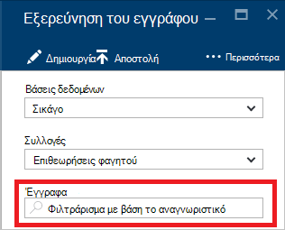
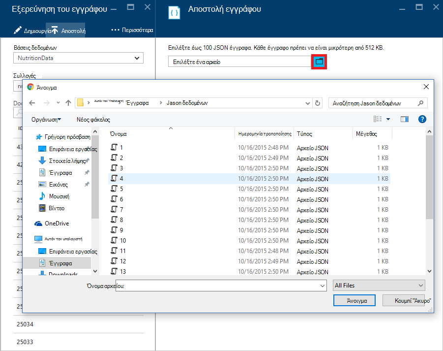

<properties
    pageTitle="Εξερεύνηση εγγράφων DocumentDB, για να προβάλετε JSON | Microsoft Azure"
    description="Μάθετε περισσότερα σχετικά με την Εξερεύνηση εγγράφου DocumentDB, ένα εργαλείο Azure πύλη για να προβάλετε JSON, επεξεργασία, δημιουργία και αποστολή εγγράφων JSON με DocumentDB, μια βάση δεδομένων NoSQL εγγράφου."
        keywords="Προβολή json"
    services="documentdb"
    authors="kirillg"
    manager="jhubbard"
    editor="monicar"
    documentationCenter=""/>

<tags
    ms.service="documentdb"
    ms.workload="data-services"
    ms.tgt_pltfrm="na"
    ms.devlang="na"
    ms.topic="article"
    ms.date="08/30/2016"
    ms.author="kirillg"/>

# Προβολή, επεξεργασία, δημιουργία και αποστολή εγγράφων JSON χρησιμοποιώντας την Εξερεύνηση των DocumentDB εγγράφου

Σε αυτό το άρθρο παρέχει μια επισκόπηση της Εξερεύνησης εγγράφου του [Microsoft Azure DocumentDB](https://azure.microsoft.com/services/documentdb/) , ένα εργαλείο πύλης Azure που σας επιτρέπει να προβάλετε, επεξεργασία, δημιουργία, κάντε αποστολή και το φιλτράρισμα JSON έγγραφα με DocumentDB. 

Σημειώστε ότι δεν είναι ενεργοποιημένη η Εξερεύνηση εγγράφων DocumentDB λογαριασμούς με πρωτόκολλο υποστήριξη για MongoDB. Αυτή η σελίδα θα ενημερωθεί όταν αυτή η δυνατότητα είναι ενεργοποιημένη.

## Εκκίνηση Εξερεύνηση εγγράφων

1. Στην πύλη Azure, με το Jumpbar, κάντε κλικ στην επιλογή **DocumentDB (NoSQL)**. Εάν **DocumentDB (NoSQL)** δεν είναι ορατό, κάντε κλικ στην επιλογή **Περισσότερες υπηρεσίες** και, στη συνέχεια, κάντε κλικ στην επιλογή **DocumentDB (NoSQL)**.

2. Επιλέξτε το όνομα του λογαριασμού. 

3. Στο μενού πόρων, κάντε κλικ στην επιλογή **Εξερεύνηση εγγράφων**. 
 
    

    Στο το blade **Εξερεύνηση εγγράφων** , **βάσεις δεδομένων** και **συλλογών** αναπτυσσόμενες λίστες είναι εκ των προτέρων ανάλογα με το περιεχόμενο στο οποίο ξεκινήσατε το Εξερεύνηση εγγράφων. 

## Δημιουργία εγγράφου

1. [Εκκίνηση Εξερεύνηση εγγράφων](#launch-document-explorer).

2. Στο το blade **Εξερεύνηση εγγράφων** , κάντε κλικ στην επιλογή **Δημιουργία εγγράφου**. 

    Ένα ελάχιστο απόκομμα JSON παρέχονται στο blade το **έγγραφο** .

    

2. Στο blade του **εγγράφου** , πληκτρολογήστε ή επικολλήστε το περιεχόμενο του εγγράφου JSON που θέλετε να δημιουργήσετε και, στη συνέχεια, κάντε κλικ στο κουμπί **Αποθήκευση** για να δεσμεύσετε το έγγραφό σας στη βάση δεδομένων και τη συλλογή που καθορίζεται στο το blade **Εξερεύνηση εγγράφων** .

    

    > [AZURE.NOTE] Εάν δεν παρέχεται μια ιδιότητα "αναγνωριστικό", στη συνέχεια, Εξερεύνηση εγγράφων αυτόματα προσθέτει μια ιδιότητα αναγνωριστικό και δημιουργεί ένα GUID ως η τιμή αναγνωριστικό.

    Εάν έχετε ήδη δεδομένα από JSON αρχείων, MongoDB, SQL Server, αρχεία CSV, χώρος αποθήκευσης πινάκων του Azure, Amazon DynamoDB, HBase, ή από άλλες συλλογές DocumentDB, μπορείτε να χρησιμοποιήσετε DocumentDB του [εργαλείου μετεγκατάστασης δεδομένων](documentdb-import-data.md) για να εισαγάγετε γρήγορα τα δεδομένα σας.

## Επεξεργασία ενός εγγράφου

1. [Εκκίνηση Εξερεύνηση εγγράφων](#launch-document-explorer).

2. Για να επεξεργαστείτε ένα υπάρχον έγγραφο, επιλέξτε την από την **Εξερεύνηση εγγράφων** blade, επεξεργαστείτε το έγγραφο στο blade το **έγγραφο** και, στη συνέχεια, κάντε κλικ στην επιλογή **Αποθήκευση**.

    

    Εάν επεξεργάζεστε ένα έγγραφο και αποφασίσετε ότι θέλετε να απορρίψετε το τρέχον σύνολο αλλαγές, απλώς κάντε κλικ στην επιλογή **Απόρριψη** στο blade το **έγγραφο** , επιβεβαιώσετε την ενέργεια Απόρριψη και φορτώνεται στην προηγούμενη κατάσταση του εγγράφου.

    

## Διαγραφή εγγράφου

1. [Εκκίνηση Εξερεύνηση εγγράφων](#launch-document-explorer).

2. Επιλέξτε το έγγραφο στην **Εξερεύνηση των εγγράφων**, κάντε κλικ στην επιλογή **Διαγραφή**και, στη συνέχεια, να επιβεβαιώσετε τη διαγραφή. Μετά την επιβεβαίωση, το έγγραφο καταργείται αμέσως από τη λίστα Εξερεύνηση εγγράφων.

    

## Εργασία με έγγραφα JSON

Εξερεύνηση εγγράφων επαληθεύει ότι οποιαδήποτε νέα ή επεξεργασμένη έγγραφο περιέχει έγκυρη JSON.  Μπορείτε να κάνετε ακόμη και Προβολή σφαλμάτων JSON τοποθετώντας επάνω από την εσφαλμένη ενότητα για λεπτομέρειες σχετικά με το σφάλμα επικύρωσης.

Επιπλέον, Εξερεύνηση εγγράφων εμποδίζει να αποθηκεύετε ένα έγγραφο με το περιεχόμενο δεν είναι έγκυρη JSON.

Τέλος, Εξερεύνηση εγγράφων σάς επιτρέπει να εύκολα να προβάλετε τις ιδιότητες συστήματος το έγγραφο έχει φορτωθεί αυτήν τη στιγμή, κάνοντας κλικ στην εντολή **Ιδιότητες** .

> [AZURE.NOTE] Η ιδιότητα χρονικής σήμανσης (_ts) εσωτερικά αποδίδεται με χρονική σήμανση χρόνου, αλλά Εξερεύνηση εγγράφων εμφανίζει την τιμή σε αναγνώσιμη Γκρίνουιτς μορφή.

## Φιλτράρισμα εγγράφων
Εξερεύνηση εγγράφων υποστηρίζει αρκετές επιλογές περιήγηση και ρυθμίσεις για προχωρημένους.

Από προεπιλογή, η Εξερεύνηση εγγράφων φορτώνει προς τα επάνω στα πρώτα 100 έγγραφα στη συλλογή επιλεγμένο, από την ημερομηνία που έχουν δημιουργηθεί από το νωρίτερο προς το αργότερο.  Μπορείτε να φορτώσετε πρόσθετα έγγραφα (σε δέσμες 100) με την επιλογή **Φόρτωση περισσότερων** στο κάτω μέρος του blade Εξερεύνηση εγγράφων. Μπορείτε να επιλέξετε ποια έγγραφα για να φορτώσετε μέσω της εντολής **φίλτρου** .

1. [Εκκίνηση Εξερεύνηση εγγράφων](#launch-document-explorer).

2. Στο επάνω μέρος του blade **Εξερεύνηση εγγράφων** , κάντε κλικ στην επιλογή **φίλτρο**.  

    
  
3.  Οι ρυθμίσεις φίλτρου εμφανίζονται κάτω από τη γραμμή εντολών. Στις ρυθμίσεις φίλτρου, παρέχουν μια πρόταση WHERE ή/και όρο ORDER BY και, στη συνέχεια, κάντε κλικ στην επιλογή **φίλτρο**.

    

    Εξερεύνηση εγγράφων ανανεώνει αυτόματα τα αποτελέσματα με έγγραφα που ταιριάζουν με το ερώτημα φίλτρου. Διαβάστε περισσότερα σχετικά με τη σύνταξη DocumentDB SQL στο [ερώτημα SQL και σύνταξη SQL](documentdb-sql-query.md) άρθρο ή να εκτυπώσετε ένα αντίγραφο του [ερωτήματος SQL πλήκτρα φύλλου](documentdb-sql-query-cheat-sheet.md).

    Τα πλαίσια αναπτυσσόμενης λίστας **βάσης δεδομένων** και **τη συλλογή** μπορεί να χρησιμοποιηθεί για να αλλάξετε εύκολα τη συλλογή από την οποία έγγραφα αυτήν τη στιγμή που προβάλλονται χωρίς να χρειάζεται να κλείσετε και να ξεκινήσετε ξανά το Εξερεύνηση εγγράφων.  

    Εξερεύνηση εγγράφων υποστηρίζει επίσης φιλτράρισμα το ανοιγμένο σύνολο εγγράφων από την ιδιότητα αναγνωριστικό.  Απλώς να πληκτρολογήσετε στο φίλτρο έγγραφα από το πλαίσιο αναγνωριστικό.

    

    Τα αποτελέσματα στην Εξερεύνηση του εγγράφου είναι φιλτραρισμένη λίστα με βάση τα κριτήρια που παρέχεται.

    

    > [AZURE.IMPORTANT] Τα φίλτρα μόνο Εξερεύνηση εγγράφων φίλτρο λειτουργικότητα από την ***τρέχουσα*** φόρτωση του συνόλου εγγράφων και δεν εκτελεί ένα ερώτημα σε σχέση με επιλεγμένη τη συγκεκριμένη στιγμή στη συλλογή.

4. Για να ανανεώσετε τη λίστα των εγγράφων που έχουν φορτωθεί από Εξερεύνηση εγγράφων, κάντε κλικ στο κουμπί " **Ανανέωση** " στο επάνω μέρος του blade.

    

## Μαζική προσθήκη εγγράφων

Εξερεύνηση εγγράφων υποστηρίζει μαζικής πρόσληψη του μία ή περισσότερες υπάρχουσες JSON έγγραφα, έως και 100 αρχεία JSON ανά λειτουργία αποστολής.  

1. [Εκκίνηση Εξερεύνηση εγγράφων](#launch-document-explorer).

2. Για να ξεκινήσετε τη διαδικασία αποστολής, κάντε κλικ στην επιλογή **Αποστολή εγγράφου**.

    

    Ανοίγει το blade **Αποστολή εγγράφου** . 

2. Κάντε κλικ στο κουμπί Αναζήτηση για να ανοίξετε ένα παράθυρο της Εξερεύνησης αρχείων, επιλέξτε ένα ή περισσότερα έγγραφα JSON για την αποστολή και, στη συνέχεια, κάντε κλικ στην επιλογή **Άνοιγμα**.

    

    > [AZURE.NOTE] Εξερεύνηση εγγράφων υποστηρίζει επί του παρόντος έως 100 έγγραφα JSON ανά λειτουργία μεμονωμένα αποστολής.

3. Όταν είστε ικανοποιημένοι με την επιλογή σας, κάντε κλικ στο κουμπί **Αποστολή** .  Τα έγγραφα που προστίθενται αυτόματα στο πλέγμα Εξερεύνηση εγγράφων και εμφανίζονται τα αποτελέσματα της αποστολής καθώς εξελίσσεται η λειτουργία. Εισαγωγή αποτυχιών αναφέρονται για μεμονωμένα αρχεία.

    

4. Μόλις ολοκληρωθεί η λειτουργία, μπορείτε να επιλέξετε έως και μια άλλη 100 έγγραφα για την αποστολή.

## Εργασία με έγγραφα JSON έξω από την πύλη

Εξερεύνηση του εγγράφου στην πύλη του Azure είναι μόνο ένας τρόπος για να εργαστείτε με έγγραφα σε DocumentDB. Μπορείτε επίσης να εργαστείτε με έγγραφα χρησιμοποιώντας το [REST API](https://msdn.microsoft.com/library/azure/mt489082.aspx) ή τον [υπολογιστή-πελάτη SDK](documentdb-sdk-dotnet.md). Για παράδειγμα κώδικα, ανατρέξτε στο θέμα τα [παραδείγματα εγγράφου .NET SDK](documentdb-dotnet-samples.md#document-examples) και τα [παραδείγματα εγγράφου Node.js SDK](documentdb-nodejs-samples.md#document-examples).

Εάν θέλετε να εισαγάγετε ή να μετεγκαταστήσετε αρχεία από άλλη προέλευση (JSON αρχεία, MongoDB, SQL Server, CSV αρχεία, πίνακα Azure χώρου αποθήκευσης, Amazon DynamoDB ή HBase), μπορείτε να χρησιμοποιήσετε το DocumentDB [εργαλείου μετεγκατάστασης δεδομένων](documentdb-import-data.md) για να εισαγάγετε γρήγορα τα δεδομένα σας στη DocumentDB.

## Αντιμετώπιση προβλημάτων

**Σύμπτωμα**: Εξερεύνηση εγγράφων επιστρέφει **δεν βρέθηκαν έγγραφα**.

**Λύση**: Βεβαιωθείτε ότι έχετε επιλέξει τη σωστή συνδρομή, βάση δεδομένων και συλλογή στην οποία εισήχθησαν τα έγγραφα. Επίσης, ελέγξτε για να βεβαιωθείτε ότι θα λειτουργούν εντός του ορίου μεταγωγή. Εάν εργάζεστε στο σας μέγιστη ταχύτητα μετάδοσης επιπέδου και λήψη επιβραδύνει, κάτω χρήση εφαρμογών για τη λειτουργία στην περιοχή του ορίου μέγιστη ταχύτητα μετάδοσης για τη συλλογή.

**Επεξήγηση**: Η πύλη είναι μια εφαρμογή όπως οποιαδήποτε άλλη, πραγματοποίηση κλήσεων στις DocumentDB βάσης δεδομένων και τη συλλογή. Εάν σας αιτήσεις είναι αυτήν τη στιγμή που επιβραδύνει λόγω κλήσεις που γίνονται από μια ξεχωριστή εφαρμογή, την πύλη μπορεί να επίσης να επιβραδύνει, προκαλεί πόρους που δεν θα εμφανίζονται στην πύλη. Για να επιλύσετε το ζήτημα, διεύθυνση η αιτία της χρήσης υψηλής απόδοσης και, στη συνέχεια, ανανεώστε το πύλης blade. Μπορείτε να βρείτε πληροφορίες σχετικά με το πώς μπορείτε να μετρήσετε και η χρήση lower μετάδοσης στην ενότητα [μετάδοσης](documentdb-performance-tips.md#throughput) αυτού του άρθρου [συμβουλές επιδόσεων](documentdb-performance-tips.md) .

## Επόμενα βήματα

Για να μάθετε περισσότερα σχετικά με τη σύνταξη DocumentDB SQL στην Εξερεύνηση των εγγράφων που υποστηρίζονται, ανατρέξτε στο άρθρο του [ερωτήματος SQL και σύνταξη SQL](documentdb-sql-query.md) ή εκτυπώσετε το [ερώτημα SQL πλήκτρα φύλλου](documentdb-sql-query-cheat-sheet.md).

Η [διαδικασία εκμάθησης](https://azure.microsoft.com/documentation/learning-paths/documentdb/) είναι επίσης χρήσιμο πόρου για να σας καθοδηγήσει καθώς μαθαίνετε περισσότερα σχετικά με το DocumentDB. 
