<properties
    pageTitle="Εξερεύνηση δέσμης ενεργειών DocumentDB, ένα πρόγραμμα επεξεργασίας JavaScript | Microsoft Azure"
    description="Μάθετε περισσότερα σχετικά με την Εξερεύνηση δέσμης ενεργειών DocumentDB, ένα εργαλείο Azure πύλη για τη Διαχείριση DocumentDB διακομιστή προγραμματισμού αντικείμενα όπως αποθηκευμένες διαδικασίες, εναύσματα και συναρτήσεων που ορίζονται από το χρήστη."
    keywords="Επεξεργαστής JavaScript"
    services="documentdb"
    authors="kirillg"
    manager="jhubbard"
    editor="monicar"
    documentationCenter=""/>

<tags
    ms.service="documentdb"
    ms.workload="data-services"
    ms.tgt_pltfrm="na"
    ms.devlang="na"
    ms.topic="article"
    ms.date="08/30/2016"
    ms.author="kirillg"/>

# Δημιουργία και εκτέλεση αποθηκευμένες διαδικασίες, εναύσματα και συναρτήσεις που ορίζονται από το χρήστη χρησιμοποιώντας την Εξερεύνηση DocumentDB δέσμης ενεργειών

Σε αυτό το άρθρο παρέχει μια επισκόπηση της Εξερεύνησης δέσμης ενεργειών του [Microsoft Azure DocumentDB](https://azure.microsoft.com/services/documentdb/) , η οποία είναι ένα πρόγραμμα επεξεργασίας JavaScript στην πύλη του Azure που σας επιτρέπει να προβάλετε και να εκτελέσει DocumentDB διακομιστή προγραμματισμού αντικείμενα όπως αποθηκευμένες διαδικασίες, εναύσματα και συναρτήσεων που ορίζονται από το χρήστη. Διαβάστε περισσότερα για τον προγραμματισμό διακομιστή DocumentDB στο άρθρο [αποθηκευμένες διαδικασίες, εναύσματα βάσης δεδομένων, και UDF](documentdb-programming.md) .

## Εκκίνηση Explorer δέσμης ενεργειών

1. Στην πύλη Azure, με το Jumpbar, κάντε κλικ στην επιλογή **DocumentDB (NoSQL)**. Εάν **DocumentDB λογαριασμοί** δεν είναι ορατό, κάντε κλικ στην επιλογή **Περισσότερες υπηρεσίες** και, στη συνέχεια, κάντε κλικ στην επιλογή **DocumentDB (NoSQL)**.

2. Στο μενού "Πόροι", κάντε κλικ στην επιλογή **Εξερεύνηση δέσμης ενεργειών**.

    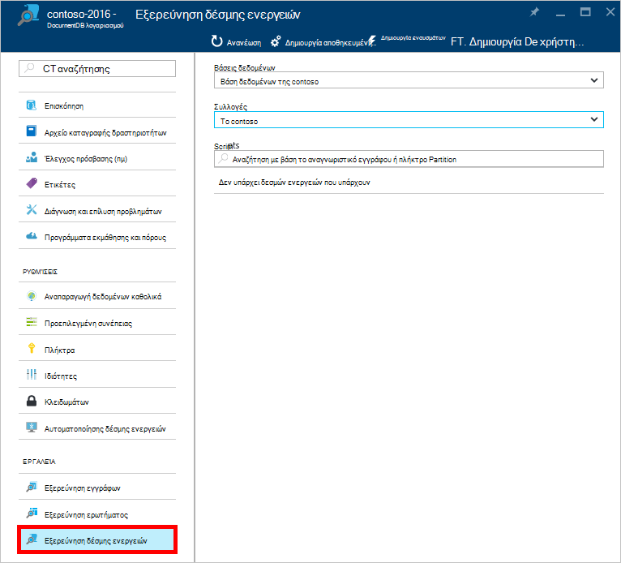
 
    Τα πλαίσια αναπτυσσόμενης λίστας **βάσης δεδομένων** και **τη συλλογή** προ-συμπληρώνονται ανάλογα με το περιεχόμενο στο οποίο εκκινείτε Explorer δέσμης ενεργειών.  Για παράδειγμα, εάν εκκίνηση από μια βάση δεδομένων blade, στη συνέχεια, στην τρέχουσα βάση δεδομένων είναι ήδη συμπληρωμένα.  Εάν εκκίνηση από μια συλλογή blade, στη συνέχεια, στην τρέχουσα συλλογή είναι ήδη συμπληρωμένα.

4.  Χρησιμοποιήστε τα πλαίσια αναπτυσσόμενης λίστας **βάσης δεδομένων** και τη **συλλογή** για να αλλάξετε εύκολα τη συλλογή από την οποία δέσμες ενεργειών αυτήν τη στιγμή που προβάλλονται χωρίς να χρειάζεται να κλείσετε και να ξεκινήσετε εκ νέου το Explorer δέσμης ενεργειών.  

5. Δέσμη ενεργειών Explorer υποστηρίζει επίσης φιλτράρισμα το ανοιγμένο σύνολο των δεσμών ενεργειών από την ιδιότητα αναγνωριστικό.  Απλώς πληκτρολογήστε στο πλαίσιο φίλτρο και τα αποτελέσματα στη λίστα Explorer δέσμης ενεργειών φιλτράρονται με βάση τα κριτήρια που παρέχεται.

    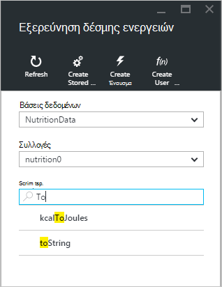

    > [AZURE.IMPORTANT] Η Εξερεύνηση δέσμης ενεργειών φιλτράρισμα λειτουργίες μόνο φίλτρα από το σύνολο ***αυτήν τη στιγμή*** η φόρτωση των δεσμών ενεργειών και δεν ανανεώνει αυτόματα τη συλλογή επιλεγμένη τη συγκεκριμένη στιγμή.

5. Για να ανανεώσετε τη λίστα των δεσμών ενεργειών φορτώνεται από την Εξερεύνηση δέσμης ενεργειών, απλώς κάντε κλικ στην εντολή **Ανανέωση** στο επάνω μέρος του blade.

    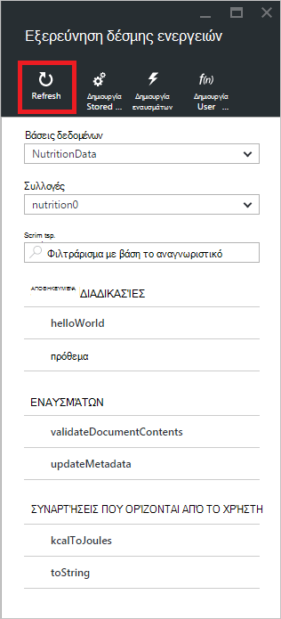

## Δημιουργία, προβολή και επεξεργασία αποθηκευμένες διαδικασίες, εναύσματα και συναρτήσεις που ορίζονται από το χρήστη

Δέσμη ενεργειών Explorer σάς επιτρέπει να εύκολα εκτελούν λειτουργίες CRUD σε DocumentDB διακομιστή προγραμματισμού αντικείμενα.  

- Για να δημιουργήσετε μια δέσμη ενεργειών, απλώς κάντε κλικ στο στοιχείο το εφαρμοστέο δημιουργία εντολή μέσα explorer δέσμης ενεργειών, δώστε ένα αναγνωριστικό, εισαγάγετε τα περιεχόμενα της δέσμης ενεργειών και κάντε κλικ στην επιλογή **Αποθήκευση**.

    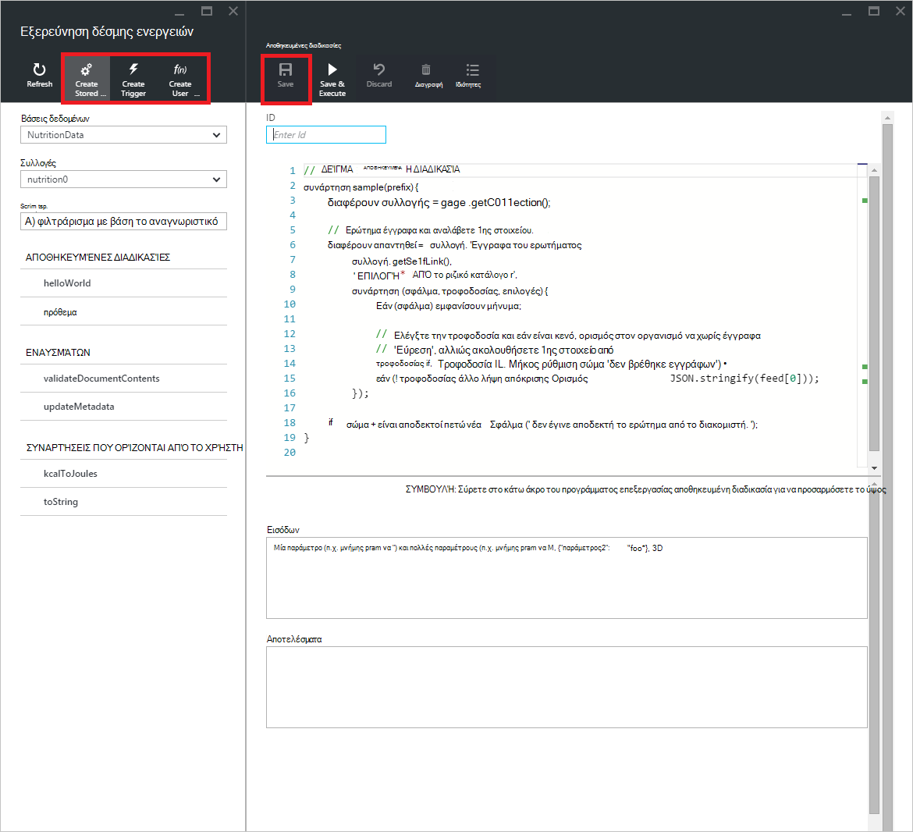

- Όταν δημιουργείτε ένα έναυσμα, πρέπει επίσης να καθορίσετε τη λειτουργία εναύσματος και έναυσμα τύπων

    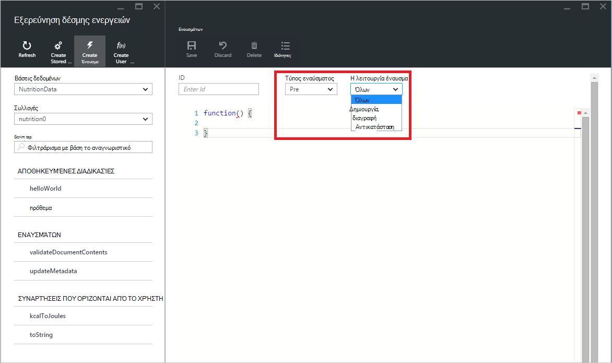

- Για να προβάλετε μια δέσμη ενεργειών, απλώς κάντε κλικ στην επιλογή τη δέσμη ενεργειών που σας ενδιαφέρει.

    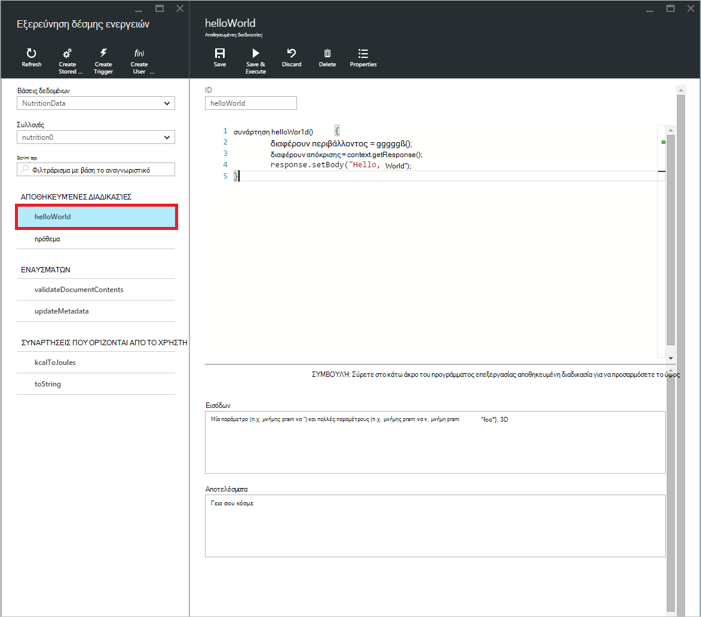

- Για να επεξεργαστείτε μια δέσμη ενεργειών, απλώς κάντε τις επιθυμητές αλλαγές στο JavaScript το πρόγραμμα επεξεργασίας και κάντε κλικ στην επιλογή **Αποθήκευση**.

    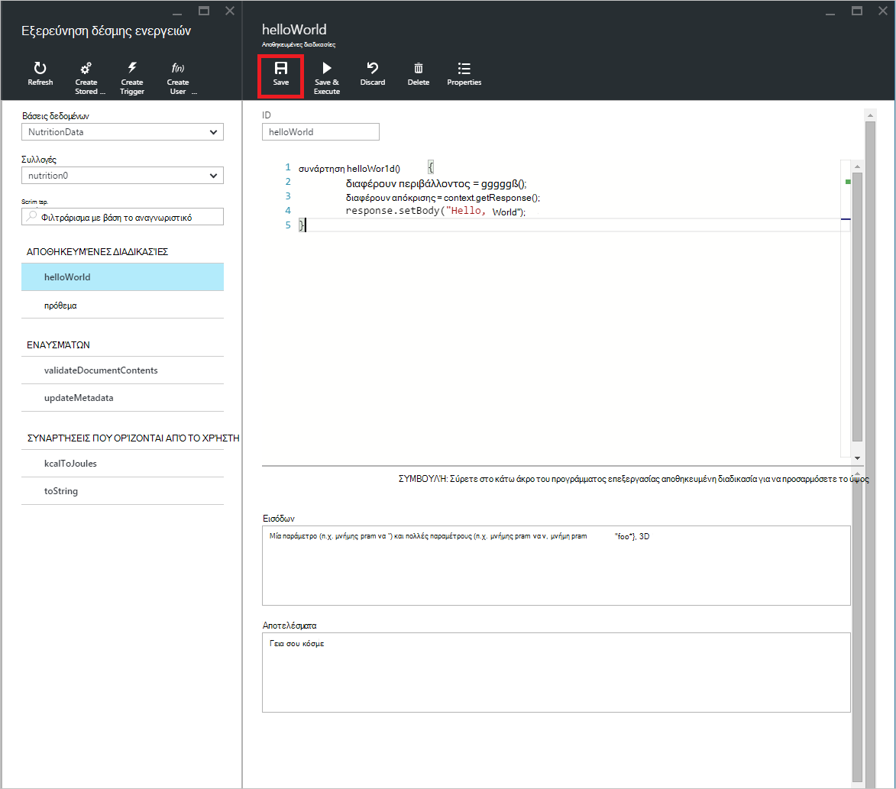

- Για να απορρίψετε τις αλλαγές σε εκκρεμότητα σε μια δέσμη ενεργειών, απλώς κάντε κλικ στην εντολή **Απόρριψη** .

    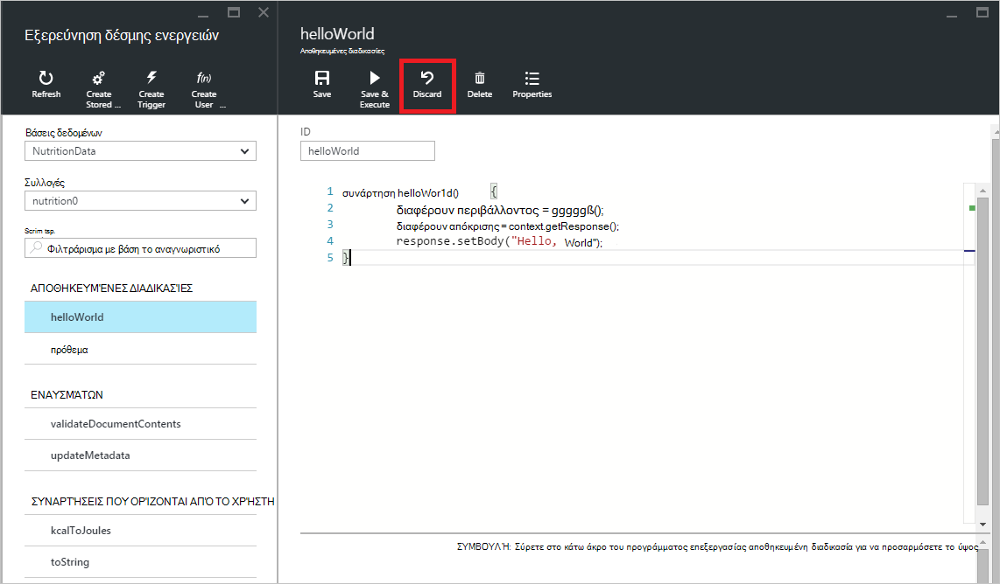

- Εξερεύνηση δέσμης ενεργειών επίσης σάς επιτρέπει να βλέπετε εύκολα τις ιδιότητες συστήματος της ανοιγμένο δέσμης ενεργειών, κάνοντας κλικ στην εντολή **Ιδιότητες** .

    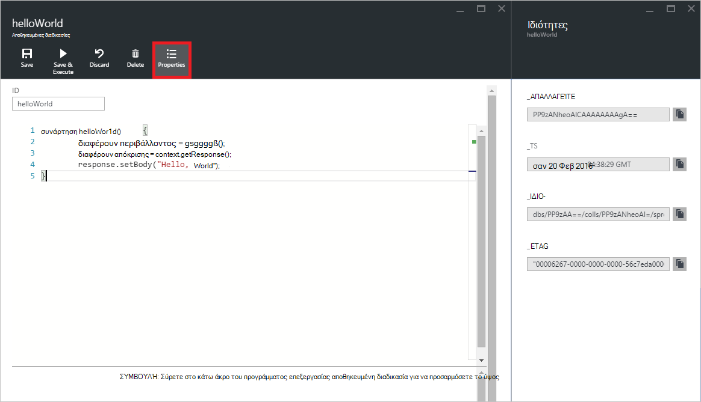

    > [AZURE.NOTE] Η ιδιότητα χρονικής σήμανσης (_ts) εσωτερικά αποδίδεται με χρονική σήμανση χρόνου, αλλά Explorer δέσμης ενεργειών εμφανίζει την τιμή σε αναγνώσιμη Γκρίνουιτς μορφή.

- Για να διαγράψετε μια δέσμη ενεργειών, επιλέξτε το στην Εξερεύνηση δέσμης ενεργειών και κάντε κλικ στην εντολή **Διαγραφή** .

    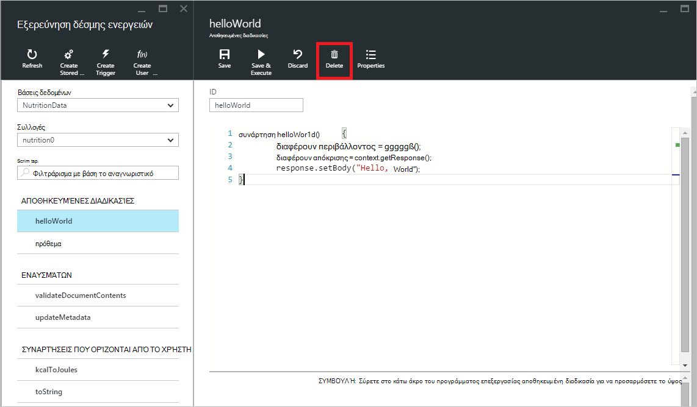

- Επιβεβαιώστε την ενέργεια διαγραφής, κάνοντας κλικ στην επιλογή **Ναι** ή να ακυρώσετε την ενέργεια διαγραφής, κάνοντας κλικ στην επιλογή **όχι**.

    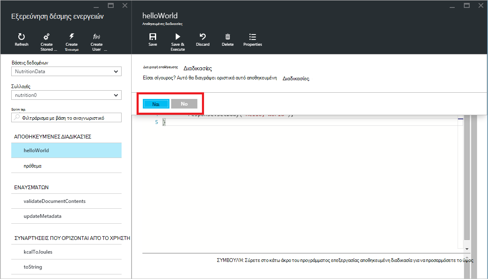

## Εκτέλεση μιας αποθηκευμένης διαδικασίας

> [AZURE.WARNING] Εκτέλεση αποθηκευμένων διαδικασιών στην Εξερεύνηση δέσμης ενεργειών δεν ακόμη υποστηρίζεται για τις συλλογές πλευρά διαμερίσματα διακομιστή. Για περισσότερες πληροφορίες, επισκεφθείτε [διαμέριση και κλίμακας στο DocumentDB](documentdb-partition-data.md).

Εξερεύνηση δέσμης ενεργειών σάς επιτρέπει να εκτελέσει αποθηκευμένες διαδικασίες διακομιστή από την πύλη του Azure.

- Όταν ανοίγετε ένα νέο blade διαδικασία δημιουργία αποθηκευμένο, θα δώσει ήδη μια προεπιλεγμένη δέσμη ενεργειών (*πρόθεμα*). Για να εκτελέσετε τη δέσμη ενεργειών *πρόθεμα* ή τη δική σας δέσμη ενεργειών, προσθέστε ένα *αναγνωριστικό* και *εισροές*. Για αποθηκευμένες διαδικασίες που αποδέχονται πολλές παραμέτρους, όλα τα δεδομένα εισόδου πρέπει να είναι μέσα σε έναν πίνακα (π.χ. *["foo", "γραμμή"]*).

    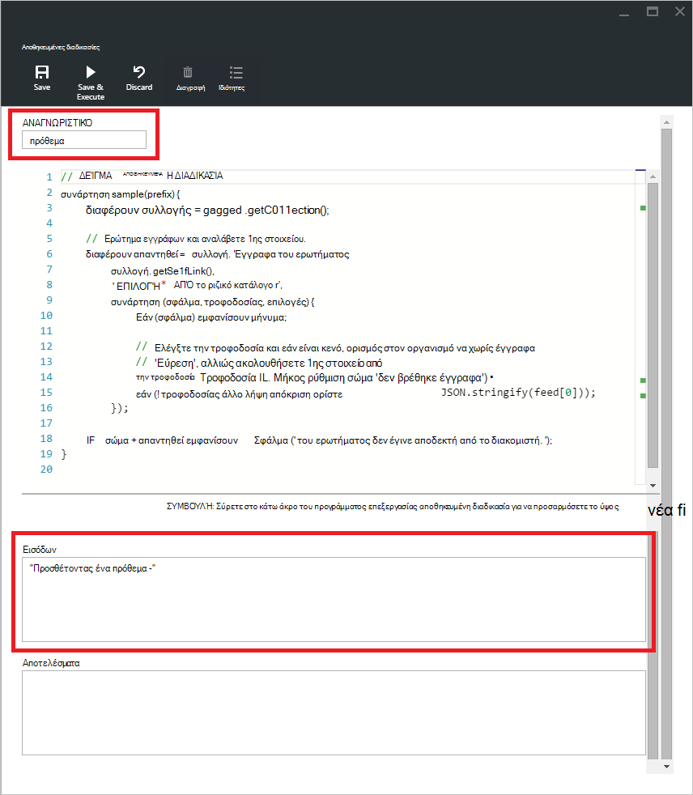

- Για να εκτελέσετε μια αποθηκευμένη διαδικασία, απλά κάντε κλικ στην εντολή **Αποθήκευση & εκτέλεση** μέσα σε παράθυρο του προγράμματος επεξεργασίας δέσμης ενεργειών.

    > [AZURE.NOTE] Η εντολή **Αποθήκευση & εκτέλεση** θα αποθηκεύσει την αποθηκευμένη διαδικασία πριν από την εκτέλεση, γεγονός που σημαίνει ότι θα αντικαταστήσει την έκδοση είχε αποθηκευτεί προηγουμένως της αποθηκευμένης διαδικασίας.

- Επιτυχής αποθηκευμένη διαδικασία εκτελέσεις θα έχει μια κατάσταση *με επιτυχία αποθηκευτεί και να εκτελεστεί η αποθηκευμένη διαδικασία* και τα αποτελέσματα επιστρέφονται θα συμπληρώνεται στο παράθυρο *αποτελεσμάτων* .

    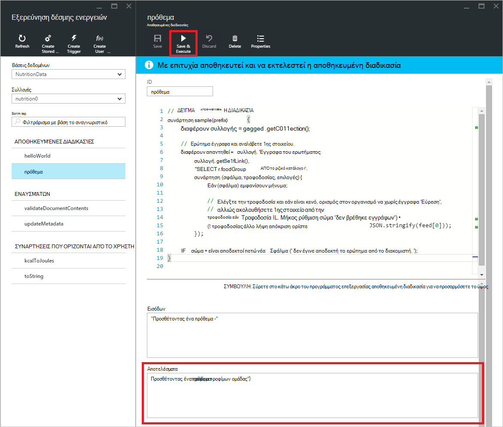

- Αν η εκτέλεση παρουσιάσει σφάλμα, το σφάλμα θα συμπληρώνεται στο παράθυρο *αποτελεσμάτων* .

    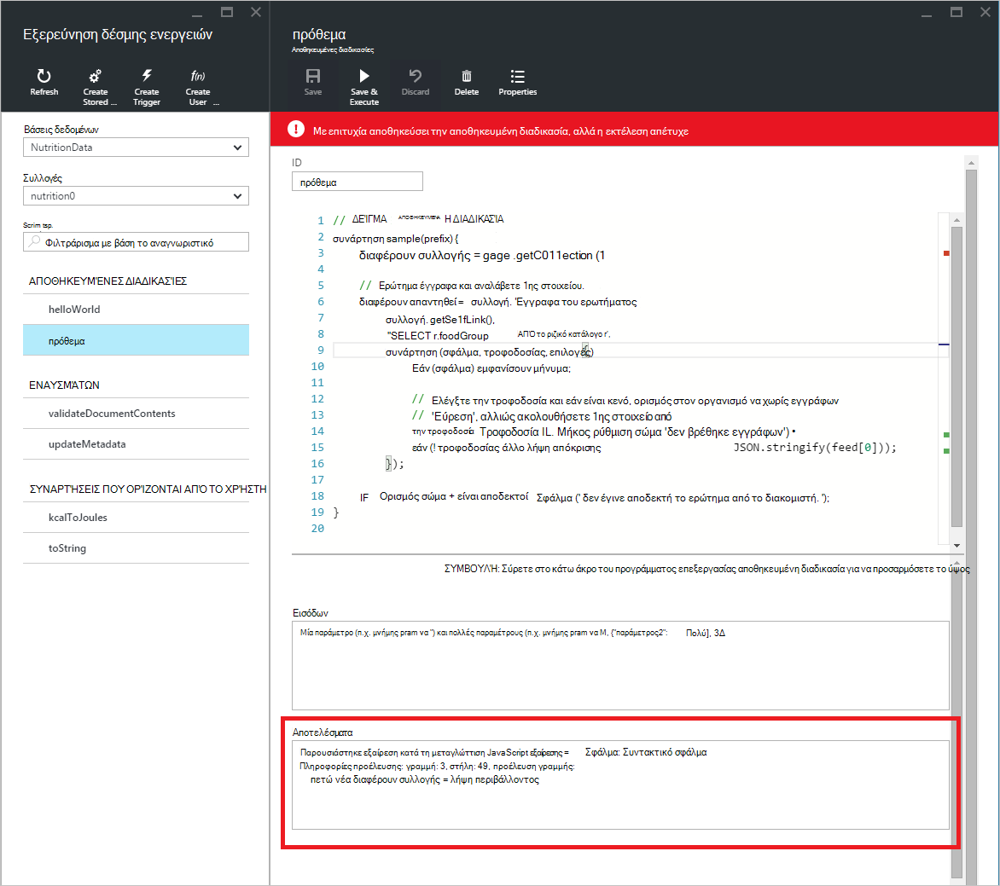

## Εργασία με δέσμες ενεργειών έξω από την πύλη

Η Εξερεύνηση δέσμης ενεργειών στην πύλη του Azure είναι μόνο ένας τρόπος για να εργαστείτε με αποθηκευμένες διαδικασίες, εναύσματα και συναρτήσεων που ορίζονται από το χρήστη στο DocumentDB. Μπορείτε επίσης να εργαστείτε με δέσμες ενεργειών με χρήση του το REST API και του [προγράμματος-πελάτη SDK](documentdb-sdk-dotnet.md). Η τεκμηρίωση REST API περιλαμβάνει δείγματα για την εργασία με [αποθηκευμένες διαδικασίες χρησιμοποιώντας τα ΥΠΌΛΟΙΠΑ](https://msdn.microsoft.com/library/azure/mt489092.aspx), [συναρτήσεις χρησιμοποιώντας ΥΠΌΛΟΙΠΑ ορίζονται από το χρήστη](https://msdn.microsoft.com/library/azure/dn781481.aspx)και [εναύσματα χρήση ΥΠΌΛΟΙΠΟ](https://msdn.microsoft.com/library/azure/mt489116.aspx). Δείγματα είναι επίσης διαθέσιμες που δείχνει πώς μπορείτε να [εργαστείτε με δέσμες ενεργειών με χρήση C#](documentdb-dotnet-samples.md#server-side-programming-examples) και να [εργαστείτε με δέσμες ενεργειών με χρήση Node.js](documentdb-nodejs-samples.md#server-side-programming-examples).

## Επόμενα βήματα

Μάθετε περισσότερα για τον προγραμματισμό διακομιστή DocumentDB στο άρθρο [αποθηκευμένες διαδικασίες, εναύσματα βάσης δεδομένων, και UDF](documentdb-programming.md) .

Η [διαδικασία εκμάθησης](https://azure.microsoft.com/documentation/learning-paths/documentdb/) είναι επίσης χρήσιμο πόρου για να σας καθοδηγήσει καθώς μαθαίνετε περισσότερα σχετικά με το DocumentDB.  
