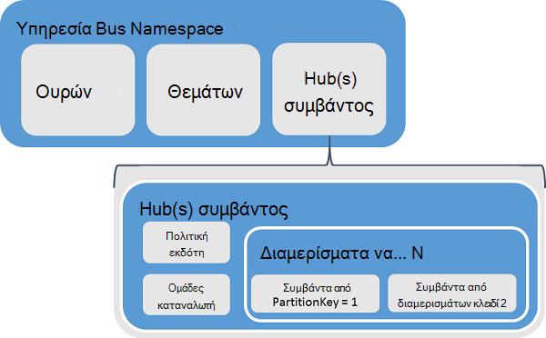
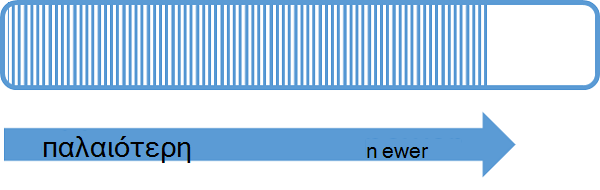
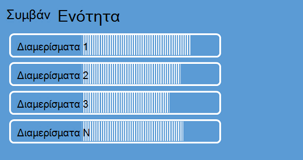
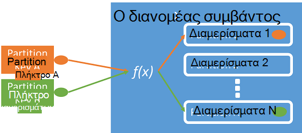
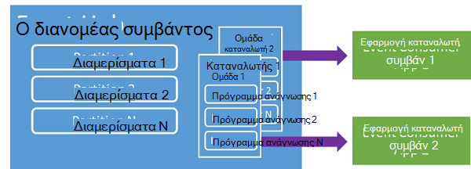
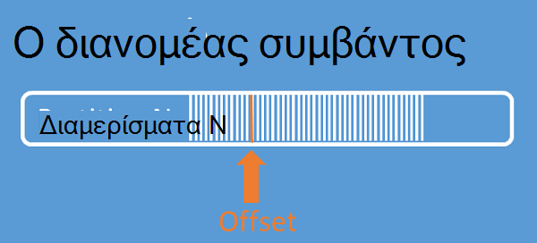
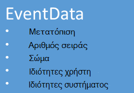

<properties 
    pageTitle="Επισκόπηση του Azure συμβάν διανομείς | Microsoft Azure"
    description="Εισαγωγή και Επισκόπηση της Azure συμβάν διανομείς."
    services="event-hubs"
    documentationCenter="na"
    authors="sethmanheim"
    manager="timlt"
    editor="" />
<tags 
    ms.service="event-hubs"
    ms.devlang="na"
    ms.topic="get-started-article"
    ms.tgt_pltfrm="na"
    ms.workload="na"
    ms.date="08/16/2016"
    ms.author="sethm" />

# Επισκόπηση Azure διανομείς συμβάντος

Πολλές λύσεις σύγχρονο σκοπεύετε να παρέχουν εμπειρίες προσαρμόσιμη πελατών ή να τη βελτίωση των προϊόντων μέσω συνεχής σχόλια και αυτοματοποιημένη τηλεμετρίας. Οι λύσεις είναι Αντιμέτωπος με το δύσκολο σχετικά με τον τρόπο και με ασφάλεια και αξιοπιστία διαδικασίας πολύ μεγάλες ποσότητες πληροφορίες από πολλούς ταυτόχρονες εκδότες. Microsoft Azure συμβάν διανομείς είναι μια υπηρεσία διαχειριζόμενων πλατφόρμα που παρέχει μια βάση για την πρόσληψη δεδομένων ευρείας κλίμακας σε μια ευρεία ποικιλία σενάρια. Παραδείγματα τέτοιων σεναρίων είναι συμπεριφορά παρακολούθησης σε εφαρμογές για κινητές συσκευές, την κυκλοφορία πληροφοριών από το web συμπλεγμάτων, καταγραφή συμβάντων στο παιχνίδι στην κονσόλα αγώνων, ή τηλεμετρίας δεδομένα που συλλέγονται από βιομηχανικού μηχανές ή συνδεδεμένοι οχήματα. Ο ρόλος κοινές που αναπαράγεται διανομείς συμβάν στο αρχιτεκτονικές λύσης είναι ότι λειτουργεί ως το "εμπρός πόρτας" για μια διαδικασία συμβάντος, συχνά ονομάζεται ένα *συμβάν ingestor*. Ένα συμβάν ingestor είναι ένα στοιχείο ή υπηρεσία, το οποίο βρίσκεται μεταξύ εκδότες συμβάντων και καταναλωτές συμβάντων να ξεχωρίζουμε την παραγωγή ροή ενός συμβάντος από την κατανάλωση από αυτά τα συμβάντα.

Azure διανομείς συμβάν είναι ένα συμβάν υπηρεσία που παρέχει το συμβάν και τηλεμετρίας εισόδου στο cloud σε μεγάλους κλίμακα, με χαμηλή λανθάνοντα χρόνο και την υψηλή αξιοπιστία επεξεργασίας. Αυτή η υπηρεσία, χρησιμοποιείται με άλλες υπηρεσίες ροής, είναι ιδιαίτερα χρήσιμη σε εφαρμογή οργάνων, χρήστη εμπειρία ή ροής εργασίας επεξεργασίας και σενάρια Internet πράγματα (IoT). Διανομείς συμβάν παρέχει μια ροή μήνυμα χειρισμός δυνατοτήτων και αν και ένα συμβάν διανομέα είναι παρόμοια με ουρές και θέματα οντότητα, που έχει χαρακτηριστικά που είναι πολύ διαφορετικές από παραδοσιακά enterprise μηνυμάτων. Σενάρια για μεγάλες επιχειρήσεις ανταλλαγής μηνυμάτων απαιτούν συνήθως εξελιγμένες δυνατότητες, όπως ακολουθίας, νεκρού γραμμάτων, υποστήριξη συναλλαγών και διασφαλίσεις ισχυρό παράδοσης, ενώ το δεσπόζουσας ενδιαφέρον για πρόσληψη συμβάν είναι υψηλής απόδοσης και την επεξεργασία ευελιξία για ροές συμβάν. Γι ' αυτό, δυνατότητες διανομείς συμβάν διαφέρουν από θέματα υπηρεσίας Bus σε που είναι αυτά με έμφαση συνιστάται ιδιαίτερα για την επίτευξη υψηλής απόδοσης και Επεξεργασία σεναρίων συμβάν. Ως εκ τούτου, διανομείς συμβάν υλοποιεί ορισμένες από τις δυνατότητες ανταλλαγής μηνυμάτων που είναι διαθέσιμες για τα θέματα. Εάν χρειάζεστε αυτές τις δυνατότητες, τα θέματα παραμένουν η βέλτιστη επιλογή.

Ένα συμβάν διανομέα δημιουργείται στο συμβάν διανομείς χώρος ονομάτων επίπεδο, παρόμοια με την υπηρεσία Bus ουρές και θέματα. Συμβάν διανομείς χρησιμοποιεί AMQP και HTTP ως την κύρια διασυνδέσεων API. Το παρακάτω διάγραμμα παρουσιάζει τη σχέση μεταξύ των συμβάντων διανομείς και Bus υπηρεσίας.

## Επισκόπηση

Συμβάν διανομείς παρέχει μήνυμα ροής μέσω ένα μοτίβο διαμερίσματα καταναλωτών. Ουρές και θέματα χρησιμοποιούν ένα μοντέλο [Κάθε καταναλωτή](https://msdn.microsoft.com/library/dn568101.aspx) στην οποία κάθε καταναλωτής προσπαθεί να διαβάσει από την ίδια ουρά ή τον πόρο. Αυτό ανταγωνισμό για τους πόρους τελικά ως αποτέλεσμα πολυπλοκότητα και τα όρια κλίμακα για ροή επεξεργασίας εφαρμογές. Συμβάν διανομείς χρησιμοποιεί ένα μοτίβο διαμερίσματα καταναλωτή στην οποία κάθε καταναλωτή μόνο διαβάζει ένα συγκεκριμένο υποσύνολο ή διαμερίσματα της ροής μήνυμα. Αυτό το μοτίβο επιτρέπει την οριζόντια κλίμακα για επεξεργασία συμβάντος και παρέχει άλλες δυνατότητες εστίαση ροής που δεν είναι διαθέσιμες σε ουρές και θέματα.

### Τα διαμερίσματα

Ένα διαμερίσματα είναι μια ταξινομημένη ακολουθία συμβάντα που διατηρείται σε ένα συμβάν διανομέα. Με την άφιξη νέων νεότερη συμβάντα, προστίθενται στο τέλος της αυτήν τη σειρά. Ένα διαμερίσματα μπορεί να θεωρηθεί ως "log ολοκλήρωσης".

Τα διαμερίσματα διατηρούν δεδομένα για μια ώρα ρυθμισμένο διατήρησης που έχει οριστεί στο επίπεδο διανομέα συμβάν. Αυτή η ρύθμιση εφαρμόζεται σε όλα τα διαμερίσματα συμβάντων διανομέα. Συμβάντα λήξει με βάση το χρόνο; ρητά, δεν μπορείτε να διαγράψετε τους. Ένα συμβάν διανομέα περιέχει περισσότερα από ένα διαμερίσματα. Κάθε διαμερίσματα είναι ανεξάρτητο και περιλαμβάνει το δικό της σειρά δεδομένων. Ως αποτέλεσμα, τα διαμερίσματα συχνά μεγέθυνση διαφορετικά επιτόκια.

Ο αριθμός των διαμερισμάτων που καθορίζεται κατά το χρόνο δημιουργίας συμβάντος διανομέα και πρέπει να είναι μεταξύ 2 και 32 (η προεπιλογή είναι 4). Τα διαμερίσματα είναι ένας μηχανισμός εταιρεία δεδομένων και πιο σχετίζονται με βαθμού ροής παραλληλισμό απαιτείται σε από άλλα προγράμματα από σε συμβάν διανομείς μετάδοσης. Έτσι, η επιλογή του αριθμού των διαμερισμάτων σε ένα συμβάν διανομέα απευθείας που σχετίζονται με τον αριθμό των ταυτόχρονες οι αναγνώστες δεν σκοπεύετε να έχουν. Μετά τη δημιουργία του συμβάντος διανομέα, το πλήθος διαμερισμάτων δεν έχει δυνατότητα αλλαγής; πρέπει να λάβετε υπόψη αυτόν τον αριθμό όσον αφορά μακροπρόθεσμες αναμενόμενο κλίμακα. Μπορείτε να αυξήσετε το όριο 32 διαμερίσματα με επικοινωνία με την ομάδα των υπηρεσιών Bus.

Ενώ τα διαμερίσματα είναι αναγνωρίσιμα και μπορούν να σταλούν στον απευθείας, είναι καλύτερα να αποφύγετε την αποστολή δεδομένων σε συγκεκριμένα τα διαμερίσματα. Αντί για αυτό, μπορείτε να χρησιμοποιήσετε ανώτερο επίπεδο δομές Παρουσιάστηκε στις ενότητες [εκδότη συμβάντος](#event-publisher) και [Πολιτική εκδότη](#capacity-and-security) .

Στο πλαίσιο συμβάν διανομείς, μηνύματα αναφέρονται ως *δεδομένα συμβάντων*. Τα δεδομένα συμβάντων περιέχει στο κυρίως σώμα του συμβάντος, μια ορίζονται από το χρήστη ιδιότητα τσάντα και διάφορες μετα-δεδομένα σχετικά με το συμβάν όπως τη μετατόπιση στο τα διαμερίσματα και τον αριθμό της ακολουθίας ροής. Τα διαμερίσματα συμπληρώνονται με μια σειρά δεδομένων συμβάν.

## Ο publisher συμβάντος

Κάθε οντότητα που στέλνει συμβάντα ή δεδομένων σε ένα συμβάν διανομέα είναι ένα *συμβάν publisher*. Συμβάν εκδότες να δημοσιεύσετε συμβάντα χρησιμοποιώντας το HTTPS ή AMQP 1.0. Συμβάν εκδότες Χρησιμοποιήστε ένα διακριτικό θέσει σε κοινή χρήση Access υπογραφή (συσχετισμών Ασφαλείας) για να προσδιορίσετε τον εαυτό τους σε ένα συμβάν διανομέα, και να έχει μια μοναδική ταυτότητα, ή να χρησιμοποιήσετε ένα κοινό διακριτικό συσχετισμών Ασφαλείας, ανάλογα με τις απαιτήσεις του σεναρίου.

Για περισσότερες πληροφορίες σχετικά με την εργασία με συσχετισμούς Ασφαλείας, ανατρέξτε στο θέμα [Θέσει σε κοινή χρήση Access υπογραφή τον έλεγχο ταυτότητας με Bus υπηρεσίας](../service-bus-messaging/service-bus-shared-access-signature-authentication.md).

### Κοινές εργασίες publisher

Αυτή η ενότητα περιγράφει συνήθεις εργασίες για το συμβάν εκδότες.

#### Απόκτηση ενός διακριτικού συσχετισμών Ασφαλείας

Συσχετίσεις κοινόχρηστο Access υπογραφή (Ασφαλείας) είναι το μηχανισμό ελέγχου ταυτότητας για διανομείς συμβάν. Υπηρεσία Bus παρέχει πολιτικές συσχετισμών Ασφαλείας σε επίπεδο συμβάν διανομέας και χώρο ονομάτων. Ενός διακριτικού συσχετισμών Ασφαλείας δημιουργείται από έναν αριθμό-κλειδί συσχετισμών Ασφαλείας και είναι ένα Κατακερματισμός SHA μιας διεύθυνσης URL, κωδικοποιημένη σε συγκεκριμένη μορφή. Χρησιμοποιώντας το όνομα του κλειδιού (πολιτική) και το διακριτικό, υπηρεσία Bus να αναδημιουργήσετε ο κατακερματισμός και, επομένως, τον έλεγχο ταυτότητας του αποστολέα. Κανονικά, τα διακριτικά συσχετισμών Ασφαλείας για το συμβάν εκδότες δημιουργούνται με μόνο **Αποστολή** τα δικαιώματα σε ένα συγκεκριμένο διανομέα συμβάν. Ο μηχανισμός συσχετισμών Ασφαλείας διακριτικού διεύθυνση URL είναι η βάση για τον publisher αναγνώριση στην η πολιτική του publisher. Για περισσότερες πληροφορίες σχετικά με την εργασία με συσχετισμούς Ασφαλείας, ανατρέξτε στο θέμα [Θέσει σε κοινή χρήση Access υπογραφή τον έλεγχο ταυτότητας με Bus υπηρεσίας](../service-bus-messaging/service-bus-shared-access-signature-authentication.md).

#### Δημοσίευση ενός συμβάντος

Μπορείτε να δημοσιεύσετε ένα συμβάν μέσω AMQP 1.0 ή HTTPS. Υπηρεσία Bus παρέχει μια κλάση [EventHubClient](https://msdn.microsoft.com/library/microsoft.servicebus.messaging.eventhubclient.aspx) για συμβάντα δημοσίευσης με ένα διανομέα συμβάν από προγράμματα-πελάτες του .NET. Για άλλες χρόνους εκτέλεσης και πλατφόρμες, μπορείτε να χρησιμοποιήσετε οποιοδήποτε πρόγραμμα-πελάτη AMQP 1.0, όπως [Apache Qpid](http://qpid.apache.org/). Μπορείτε να δημοσιεύσετε συμβάντα μεμονωμένα ή μαζικής. Μια μεμονωμένη δημοσίευση (παρουσία δεδομένων συμβάντων) έχει όριο 256KB, ανεξάρτητα από το εάν είναι ένα μεμονωμένο συμβάν ή μια δέσμη. Δημοσίευση συμβάντα που είναι μεγαλύτερα από αυτό έχει ως αποτέλεσμα σφάλμα. Είναι βέλτιστη πρακτική για εκδότες για να γνωρίζει τα διαμερίσματα μέσα σε ενότητα συμβάντων και για να καθορίσετε μόνο ένα *διαμερίσματα αριθμού-κλειδιού* (Παρουσιάστηκε στην επόμενη ενότητα) ή την ταυτότητα μέσω τους διακριτικό συσχετισμών Ασφαλείας.

Η επιλογή για να χρησιμοποιήσετε AMQP ή HTTPS είναι συγκεκριμένη για το σενάριο χρήσης. AMQP απαιτεί τη δημιουργία μιας υποδοχής μόνιμη διπλής κατεύθυνσης επιπλέον για τη μεταφορά ασφάλεια σε επίπεδο (TLS) ή SSL/TLS. Αυτό μπορεί να είναι μια λειτουργία δαπανηρές όσον αφορά την κίνηση του δικτύου, αλλά μόνο συμβαίνει στην αρχή μιας περιόδου λειτουργίας AMQP. HTTPS περιλαμβάνει ένα κάτω αρχικό επιβάρυνσης, αλλά απαιτεί επιπλέον SSL επιβάρυνσης για κάθε αίτηση. Για εκδότες που συχνά δημοσίευση συμβάντα, AMQP προσφέρει σημαντική επιδόσεις, λανθάνων χρόνος και μετάδοσης εξοικονόμησης.

### Πλήκτρο partition

Ένα κλειδί διαμερίσματα είναι μια τιμή που χρησιμοποιείται για την αντιστοίχιση εισερχόμενων δεδομένων συμβάντος σε συγκεκριμένες διαμερίσματα για τους σκοπούς της εταιρείας δεδομένων. Το κλειδί διαμερίσματα είναι μια τιμή που παρέχονται από τον αποστολέα που εισήχθησαν σε ένα συμβάν διανομέα. Υποβάλλεται σε επεξεργασία μέσω μια στατική συνάρτηση κλειδώματος, το αποτέλεσμα της οποίας δημιουργεί διαμερίσματα ανάθεσης. Εάν δεν καθορίσετε έναν αριθμό-κλειδί διαμερίσματα κατά τη δημοσίευση ενός συμβάντος, χρησιμοποιείται μια ανάθεση round robin. Όταν χρησιμοποιείτε αριθμούς-κλειδιά διαμερισμάτων, τον εκδότη συμβάν είναι μόνο υπόψη του κλειδιού διαμερίσματα, δεν τα διαμερίσματα στο οποίο δημοσιεύονται τα συμβάντα. Αυτό αποσύνδεσης των κλειδί και διαμερίσματα απομονώνουν τον αποστολέα από το να χρειάζεται να γνωρίζω πάρα πολύ για μετάδοση επεξεργασίας και αποθήκευσης των συμβάντων. Αριθμούς-κλειδιά διαμερισμάτων είναι σημαντικά για την οργάνωση δεδομένων για επεξεργασία ροής, αλλά είναι ουσιαστικά σχετίζεται με τα διαμερίσματα τον εαυτό τους. Μια ανά συσκευή ή ένα μοναδικό ταυτότητας αποτελεί καλό partition κλειδί, αλλά επίσης να επιλέξετε άλλα χαρακτηριστικά όπως Γεωγραφία χρήστη να χρησιμοποιηθεί για να ομαδοποιήσετε σχετικά συμβάντα σε ένα μεμονωμένο διαμερίσματα. Η παρακάτω εικόνα εμφανίζει αποστολείς συμβάν με αριθμούς-κλειδιά διαμερισμάτων για να καρφιτσώσετε σε διαμερίσματα.

Συμβάν διανομείς εξασφαλίζει ότι κάθε συμβάντα κοινής χρήσης την ίδια τιμή κλειδιού partition παραδίδονται στη σειρά και να την ίδια διαμερίσματα. Σημαντικό είναι ότι εάν αριθμούς-κλειδιά διαμερισμάτων που χρησιμοποιούνται με τις πολιτικές publisher, που περιγράφονται στην επόμενη ενότητα, στη συνέχεια, την ταυτότητα του εκδότη και την τιμή του αριθμού-κλειδιού partition πρέπει να συμφωνεί με. Διαφορετικά, παρουσιάζεται σφάλμα.

### Καταναλωτής συμβάντων

Κάθε οντότητα που διαβάζει δεδομένα συμβάν από μια ενότητα συμβάν είναι ένας καταναλωτής συμβάντων. Όλες οι καταναλωτές συμβάν ανάγνωση της ροής συμβάν έως τα διαμερίσματα σε μια ομάδα καταναλωτών. Κάθε διαμερίσματα θα πρέπει να έχετε μόνο μία ενεργό πρόγραμμα ανάγνωσης κάθε φορά. Όλες οι καταναλωτές διανομείς συμβάν σύνδεση μέσω της περιόδου λειτουργίας AMQP 1.0, στις οποίες τα συμβάντα παραδίδονται μόλις αυτές είναι διαθέσιμες. Ο υπολογιστής-πελάτης δεν χρειάζεται να ψηφοφορία για διαθεσιμότητα δεδομένων.

#### Ομάδες καταναλωτή

Το μηχανισμό δημοσίευση/εγγραφή του συμβάντος διανομείς είναι ενεργοποιημένη στις ομάδες καταναλωτών. Η ομάδα καταναλωτή είναι μια προβολή (κατάσταση, θέση ή offset) μια ολόκληρη ενότητα συμβάντων. Ενεργοποίηση ομάδες καταναλωτή πολλών καταναλώνει εφαρμογές σε κάθε έχουν μια ξεχωριστή προβολή της ροής συμβάντων και ανάγνωση της ροής ανεξάρτητα με το δικό τους ρυθμό και με τις δικές τους μετατοπίσεις. Σε μια ροή επεξεργασίας αρχιτεκτονική, κάθε εφαρμογή ισούται με μια ομάδα καταναλωτών. Εάν θέλετε να γράψετε συμβάν δεδομένων με το χώρο αποθήκευσης μακροπρόθεσμες, στη συνέχεια, αυτή η εφαρμογή δημιουργίας χώρου αποθήκευσης είναι μια ομάδα καταναλωτή. Επεξεργασία σύνθετων συμβάν γίνεται με μια άλλη, ξεχωριστές καταναλωτή ομάδας. Μπορείτε μόνο να αποκτήσετε πρόσβαση διαμερίσματα μέσω μιας ομάδας καταναλωτή. Υπάρχει πάντα μια προεπιλεγμένη ομάδα καταναλωτή από μια ενότητα συμβάντων και μπορείτε να δημιουργήσετε έως και 20 καταναλωτή ομάδες για μια τυπική σειρά συμβάντων διανομέα.

Ακολουθούν παραδείγματα της σύμβασης URI ομάδα καταναλωτή:

    //<my namespace>.servicebus.windows.net/<event hub name>/<Consumer Group #1>
    //<my namespace>.servicebus.windows.net/<event hub name>/<Consumer Group #2>

Η παρακάτω εικόνα εμφανίζει τους καταναλωτές συμβάν μέσα σε ομάδες καταναλωτών.

#### Ροή μετατοπίσεις

Μετατόπιση είναι η θέση του συμβάντος μέσα σε ένα διαμερίσματα. Μπορείτε να θεωρήσετε μια μετατόπιση ως δρομέα προγράμματος-πελάτη. Η μετατόπιση είναι ένα byte αρίθμηση του συμβάντος. Αυτή η δυνατότητα επιτρέπει ένας καταναλωτής συμβάντων (ανάγνωσης) για να καθορίσετε ένα σημείο ροή συμβάντων από την οποία θέλετε να ξεκινήσετε την ανάγνωση συμβάντα. Μπορείτε να καθορίσετε τη μετατόπιση ως μια χρονική σήμανση ή μια τιμή μετατόπισης. Οι καταναλωτές είναι υπεύθυνος για την αποθήκευση τις δικές τους τιμές μετατόπισης εκτός της υπηρεσίας συμβάν διανομείς.

Μέσα σε ένα διαμερίσματα, κάθε συμβάντος περιλαμβάνει μια μετατόπιση. Μετατόπιση αυτό χρησιμοποιείται από τους καταναλωτές για να εμφανίσετε τη θέση στη σειρά συμβάντων για μια δεδομένη διαμερίσματα. Μετατοπίσεις μπορούν να περάσουν ενότητα συμβάν ως είτε έναν αριθμό ή μια τιμή χρονικής σήμανσης όταν συνδέεται ένα πρόγραμμα ανάγνωσης.

#### Σημείων ελέγχου

*Σημείων ελέγχου* είναι μια διαδικασία με την οποία οι αναγνώστες σήμανση ή ολοκλήρωση τη θέση τους μέσα σε μια ακολουθία συμβάντων διαμερίσματα. Σημείων ελέγχου είναι ευθύνη του προγράμματος-πελάτη και παρουσιάζεται σε βάση ανά διαμερισμάτων μέσα σε μια ομάδα καταναλωτών. Αυτό σημαίνει ότι για κάθε ομάδα καταναλωτή, κάθε πρόγραμμα ανάγνωσης partition πρέπει να παρακολούθηση των την τρέχουσα θέση συμβάντων ροή και μπορεί να σας ενημερώσει για την υπηρεσία όταν κρίνει ολοκλήρωσης της ροής δεδομένων. Εάν ένα πρόγραμμα ανάγνωσης αποσυνδέεται από ένα διαμερίσματα, όταν συνδέεται ξανά το αρχίζει ανάγνωσης στο το σημείο ελέγχου που είχαν υποβληθεί προηγουμένως από το τελευταίο πρόγραμμα ανάγνωσης των διαμερισμάτων που στη συγκεκριμένη ομάδα καταναλωτών. Όταν συνδέεται το πρόγραμμα ανάγνωσης, μεταβιβάζει αυτό offset για να την ενότητα συμβάντων για να καθορίσετε τη θέση στην οποία θέλετε να ξεκινήσετε να διαβάζετε. Με αυτόν τον τρόπο, μπορείτε να χρησιμοποιήσετε σημείων ελέγχου σε δύο συμβάντα σήμανση "ολοκληρώθηκε" μετάδοση εφαρμογές και για την παροχή υποστηρίζεται σε περίπτωση ανακατεύθυνσης μεταξύ τους αναγνώστες να εκτελείται σε διαφορετικούς υπολογιστές. Επειδή το συμβάν δεδομένα διατηρούνται για το χρονικό διάστημα διατήρησης καθοριστεί κάθε φορά που δημιουργείται ενότητα συμβάντων, είναι δυνατή η επιστροφή σε παλαιότερες δεδομένα καθορίζοντας μια μετατόπιση κάτω από αυτήν τη διαδικασία σημείων ελέγχου. Μέσω αυτού του μηχανισμού, σημείων ελέγχου επιτρέπει ανοχή ανακατεύθυνσης και της αναπαραγωγής ροή ελεγχόμενο συμβάν.

#### Κοινές εργασίες καταναλωτή

Αυτή η ενότητα περιγράφει συνήθεις εργασίες για καταναλωτές συμβάντων διανομείς συμβάν ή οι αναγνώστες. Όλες οι καταναλωτές διανομείς συμβάν σύνδεση μέσω AMQP 1.0. AMQP 1.0 είναι μια περίοδο λειτουργίας και καναλιού επικοινωνιών κατάσταση υπόψη διπλής κατεύθυνσης. Κάθε διαμερίσματα έχει μια περίοδο λειτουργίας με σύνδεση AMQP 1.0 που διευκολύνει τη μεταφορά των συμβάντων διαχωριστούν με διαμερίσματα.

##### Σύνδεση με ένα διαμερίσματα

Για να εκμετάλλευση συμβάντα από ένα συμβάν διανομέα, πρόγραμμα-πελάτη πρέπει να συνδεθείτε με ένα διαμερίσματα. Όπως προαναφέρθηκε, πάντα έχετε πρόσβαση σε διαμερίσματα από μια ομάδα καταναλωτών. Ως μέρος του μοντέλου διαμερίσματα καταναλωτή, μόνο ένα μεμονωμένο πρόγραμμα ανάγνωσης πρέπει να είναι ενεργό στην ένα διαμερίσματα κάθε φορά μέσα σε μια ομάδα καταναλωτών. Είναι κοινή πρακτική κατά τη σύνδεση απευθείας με τα διαμερίσματα για να χρησιμοποιήσετε το μηχανισμό μίσθωσης προκειμένου να συντονίσετε ανάγνωσης συνδέσεων σε συγκεκριμένα τα διαμερίσματα. Με αυτόν τον τρόπο, είναι δυνατή για κάθε διαμερίσματα σε μια ομάδα καταναλωτή για να έχετε μόνο ένα πρόγραμμα ανάγνωσης ενεργό. Διαχείριση της θέσης σε την ακολουθία για ένα πρόγραμμα ανάγνωσης είναι μια σημαντική εργασίας που είναι δυνατό μέσω σημείων ελέγχου. Αυτή η λειτουργία έχει απλοποιηθεί, χρησιμοποιώντας την κλάση [EventProcessorHost](https://msdn.microsoft.com/library/microsoft.servicebus.messaging.eventprocessorhost.aspx) για προγράμματα-πελάτες του .NET. [EventProcessorHost](https://msdn.microsoft.com/library/microsoft.servicebus.messaging.eventprocessorhost.aspx) είναι παράγοντας έξυπνη καταναλωτή και περιγράφεται στην επόμενη ενότητα.

##### Διαβάστε συμβάντα

Αφού ανοίξει μια περίοδο λειτουργίας AMQP 1.0 και σύνδεση για ένα συγκεκριμένο διαμερίσματα, συμβάντα παραδίδονται στον υπολογιστή-πελάτη AMQP 1.0 από την υπηρεσία συμβάν διανομείς. Αυτός ο μηχανισμός παράδοσης επιτρέπει μεγαλύτερη ταχύτητα μετάδοσης και κάτω λανθάνοντος χρόνου από μηχανισμοί ελκυστική όπως HTTP GET. Καθώς αποστέλλονται συμβάντων στον υπολογιστή-πελάτη, κάθε παρουσία δεδομένων συμβάντος περιέχει σημαντικά μετα-δεδομένων όπως τον αριθμό offset και ακολουθίας που χρησιμοποιούνται για τη διευκόλυνση σημείων ελέγχου στη ακολουθία συμβάντων.

Είναι δική σας ευθύνη για τη Διαχείριση αυτό μετατόπιση με τον τρόπο που καλύτερα επιτρέπει τη διαχείριση της προόδου κατά την επεξεργασία της ροής.

## Χωρητικότητα και ασφάλεια

Διανομείς συμβάν είναι μια ιδιαίτερα με παράλληλη αρχιτεκτονική για ροή εισόδου. Ως εκ τούτου, υπάρχουν αρκετές βασικές πτυχές για να λάβετε υπόψη κατά την αλλαγή μεγέθους και κλίμακας μιας λύσης που βασίζεται σε συμβάν διανομείς. Το πρώτο από αυτά τα στοιχεία ελέγχου χωρητικότητα ονομάζεται *μονάδες μετάδοσης*, που περιγράφονται στην επόμενη ενότητα.

### Μονάδες μετάδοσης

Η δυναμικότητα μετάδοσης των συμβάντων διανομείς ελέγχεται από μονάδες μετάδοσης. Μονάδες μετάδοσης προ-έχουν αγοραστεί μονάδες της ικανότητας. Μια μονάδα μία μετάδοσης περιλαμβάνει τα εξής:

- Εισόδου: Έως 1 MB ανά δεύτερη ή 1000 συμβάντα ανά δευτερόλεπτο.

- Εξόδου: Έως 2 MB ανά δευτερόλεπτο.

Για να την ποσότητα που παρέχεται από τον αριθμό των αγορασμένων μονάδων μετάδοσης δυναμικότητας είναι επιβραδύνει εισόδου. Αποστολή δεδομένων επάνω από αυτό ποσό αποτελέσματα σε μια εξαίρεση "υπέρβαση του ορίου". Αυτό το ποσό είναι είτε 1 MB ανά δεύτερη ή 1000 συμβάντα ανά δευτερόλεπτο, όποιο βρεθεί πρώτα. Εξόδου δεν παράγει επιτάχυνσης εξαιρέσεις, αλλά περιορίζεται στο ποσό των μεταφορά δεδομένων που προβλέπονται από τις μονάδες αγορά μετάδοσης: 2 MB ανά δευτερόλεπτο ανά μονάδα μετάδοσης. Αν λαμβάνετε δημοσίευσης εξαιρέσεις επιτόκιο ή περιμένετε για να δείτε υψηλότερο εξόδου, φροντίστε να ελέγξετε τον αριθμό των μονάδων μετάδοσης που έχετε αγοράσει για το χώρο ονομάτων με την οποία δημιουργήθηκε το συμβάν διανομέα. Για να αποκτήσετε περισσότερες μονάδες μετάδοσης, μπορείτε να προσαρμόσετε τη ρύθμιση στη σελίδα " **οι χώροι ονομάτων** " στην καρτέλα **κλίμακα** στην [πύλη του Azure κλασική][]. Μπορείτε επίσης να αλλάξετε αυτήν τη ρύθμιση χρησιμοποιώντας τα API Azure.

Ενώ τα διαμερίσματα είναι μια έννοια εταιρεία δεδομένων, μονάδες απόδοσης είναι καθαρά μια έννοια χωρητικότητα. Μονάδες μετάδοσης χρέωσης ανά ώρα και είναι προ-αγορά. Αφού αγοράσετε, μονάδες απόδοσης χρέωσης για τουλάχιστον μία ώρα. Έως και 20 μετάδοσης μονάδες μπορεί να αγοραστεί για ένα συμβάν διανομείς χώρο ονομάτων και δεν υπάρχει ένα όριο λογαριασμός Azure 20 μονάδες μετάδοσης. Αυτές οι μονάδες μετάδοσης είναι κοινόχρηστες σε όλους τους διανομείς συμβάν σε ένα συγκεκριμένο πεδίο ονομάτων.

Μονάδες μετάδοσης έχουν παρασχεθεί με βάση τη βέλτιστη προσπάθειας και ενδέχεται να μην είναι πάντα διαθέσιμη για άμεση αγορά. Εάν χρειάζεστε μια συγκεκριμένη δυνατότητα, καλό είναι να αγοράσετε αυτές τις μονάδες μετάδοσης εκ των προτέρων. Εάν χρειάζεστε περισσότερες από 20 μονάδες μετάδοσης, μπορείτε να επικοινωνήσετε Azure υποστήριξη για να αγοράσετε περισσότερες μονάδες απόδοσης με βάση δέσμευσης σε μπλοκ 20, έως το πρώτο μονάδες 100 μεταγωγή. Πέρα από αυτό, μπορείτε επίσης να αγοράσετε μπλοκ 100 τεμάχια μεταγωγή.

Συνιστάται να τα υπόλοιπο προσεκτικά μονάδες απόδοσης και τα διαμερίσματα για την επίτευξη Βέλτιστη κλίμακα με διανομείς συμβάν. Ένα μεμονωμένο διαμερίσματα έχει μέγιστη κλίμακα μία μετάδοσης μονάδα. Ο αριθμός των μονάδων μετάδοσης πρέπει να είναι μικρότερη ή ίση με τον αριθμό των διαμερισμάτων σε ένα συμβάν διανομέα.

Για λεπτομερείς πληροφορίες για τις τιμές, ανατρέξτε στο θέμα [Τις τιμές για το συμβάν διανομείς](https://azure.microsoft.com/pricing/details/event-hubs/).

### Πολιτική εκδότη

Συμβάν διανομείς επιτρέπει λεπτομερούς έλεγχο συμβάντων εκδότες μέσω των *πολιτικών του publisher*. Οι πολιτικές Publisher είναι ένα σύνολο δυνατοτήτων χρόνου εκτέλεσης που έχει σχεδιαστεί ώστε να διευκολύνετε τη μεγάλου αριθμού εκδότες ανεξάρτητο συμβάν. Με τις πολιτικές publisher, κάθε publisher χρησιμοποιεί το δικό της μοναδικό αναγνωριστικό κατά τη δημοσίευση συμβάντα σε ένα συμβάν διανομέα, χρησιμοποιώντας τον παρακάτω μηχανισμό:

    //<my namespace>.servicebus.windows.net/<event hub name>/publishers/<my publisher name>

Δεν χρειάζεται να δημιουργήσετε ονόματα publisher βρίσκεστε μπροστά από το χρόνο, αλλά πρέπει να ταιριάζουν το διακριτικό συσχετισμών Ασφαλείας που χρησιμοποιείται κατά τη δημοσίευση ενός συμβάντος, προκειμένου να διασφαλίσετε ταυτότητες ανεξάρτητη publisher. Για περισσότερες πληροφορίες σχετικά με συσχετισμούς Ασφαλείας, ανατρέξτε στο θέμα [Θέσει σε κοινή χρήση Access υπογραφή τον έλεγχο ταυτότητας με Bus υπηρεσίας](../service-bus-messaging/service-bus-shared-access-signature-authentication.md). Όταν χρησιμοποιείτε τον publisher πολιτικές, η τιμή **PartitionKey** έχει οριστεί στο όνομα του publisher. Για να λειτουργήσει σωστά, πρέπει να συμφωνεί με αυτές τις τιμές.

## Σύνοψη

Azure διανομείς συμβάν παρέχει ένα συμβάν hyper κλίμακας και τηλεμετρίας υπηρεσία που μπορούν να χρησιμοποιηθούν για κοινά εφαρμογής και χρήστη τη ροή εργασίας παρακολούθησης σε οποιαδήποτε κλίμακα επεξεργασίας. Με τη δυνατότητα να παρέχουν δημοσίευσης εγγραφής δυνατότητες με χαμηλή λανθάνοντα χρόνο και σε μεγάλους κλίμακα, διανομείς συμβάν χρησιμοποιηθεί ως το "Ενεργοποίηση κεκλιμένο επίπεδο" για μεγάλο δεδομένα. Με ταυτότητας με βάση τον publisher και λίστες ανάκλησης, αυτές οι δυνατότητες επεκτείνονται σε κοινά σενάρια Internet των στοιχείων. Για περισσότερες πληροφορίες σχετικά με την ανάπτυξη εφαρμογών διανομείς συμβάντος, ανατρέξτε στον [Οδηγό προγραμματισμού συμβάντων διανομείς](event-hubs-programming-guide.md).

## Επόμενα βήματα

Τώρα που μάθατε σχετικά με το συμβάν διανομείς έννοιες, μπορείτε να μετακινήσετε σε στα ακόλουθα σενάρια:

- Γρήγορα αποτελέσματα με ένα [πρόγραμμα εκμάθησης συμβάν διανομείς].
- Μια ολοκληρωμένη [δείγμα εφαρμογής που χρησιμοποιεί το συμβάν διανομείς].

[Azure κλασική πύλη]: http://manage.windowsazure.com
[Πρόγραμμα εκμάθησης διανομείς συμβάντος]: event-hubs-csharp-ephcs-getstarted.md
[δείγμα εφαρμογής που χρησιμοποιεί το συμβάν διανομείς]: https://code.msdn.microsoft.com/windowsazure/Service-Bus-Event-Hub-286fd097
