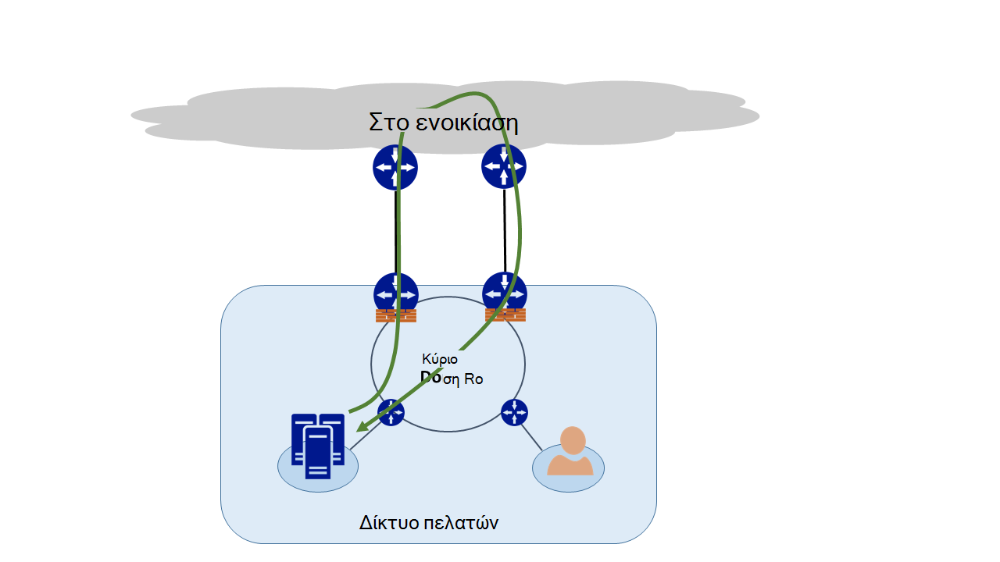
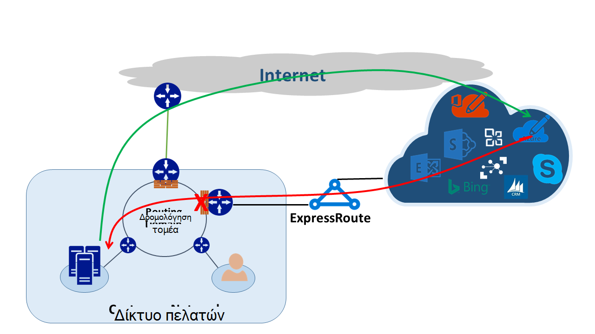
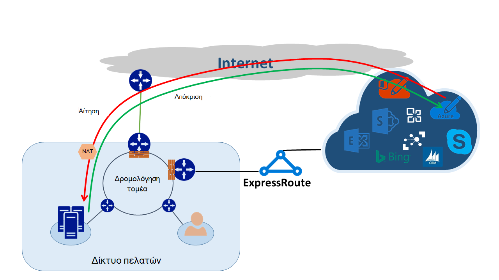

<properties
   pageTitle="Δρομολόγηση ασύμμετρη | Microsoft Azure"
   description="Σε αυτό το άρθρο σάς καθοδηγεί σε τα προβλήματα που μπορεί να κάνει έναν πελάτη με ασύμμετρη τη δρομολόγηση σε ένα δίκτυο που έχει πολλές συνδέσεις σε έναν προορισμό."
   documentationCenter="na"
   services="expressroute"
   authors="osamazia"
   manager="carmonm"
   editor=""/>
<tags
   ms.service="expressroute"
   ms.devlang="na"
   ms.topic="get-started-article"
   ms.tgt_pltfrm="na"
   ms.workload="infrastructure-services"
   ms.date="10/10/2016"
   ms.author="osamazia"/>

# Δρομολόγηση ασύμμετρη με πολλές διαδρομές δικτύου

Σε αυτό το άρθρο εξηγεί πώς προς τα εμπρός και επιστροφή κίνηση του δικτύου μπορεί να διαρκέσει διαφορετικές διαδρομές όταν πολλές διαδρομές είναι διαθέσιμες μεταξύ δικτύου προέλευσης και προορισμού.

Είναι σημαντικό να κατανοήσετε τις έννοιες δύο για να κατανοήσετε τη δρομολόγηση ασύμμετρη. Ένα είναι το εφέ από πολλές διαδρομές δικτύου. Το άλλο είναι πώς συσκευές, όπως ένα τείχος προστασίας, διατηρείτε κατάσταση. Αυτοί οι τύποι συσκευών ονομάζονται κατάστασης συσκευές. Ένας συνδυασμός των δύο αυτών παραγόντων δημιουργεί σενάρια στο το δίκτυο στο οποίο κίνηση καταργείται από μια συσκευή με κατάσταση, επειδή η κατάσταση συσκευής δεν εντοπίσει ότι κίνηση δημιουργήθηκε με την ίδια τη συσκευή.

## Πολλές διαδρομές δικτύου

Όταν ένα εταιρικό δίκτυο έχει μόνο μία σύνδεση στο Internet με την υπηρεσία παροχής Internet, όλη την κυκλοφορία από το Internet και διανύει την ίδια διαδρομή. Συχνά, εταιρείες αγοράς πολλών κυκλώματα, ως πλεονάζοντα διαδρομές, για να βελτιώσετε συνεχούς δικτύου. Όταν συμβαίνει αυτό, είναι πιθανό ότι κυκλοφορία που γίνεται μετάβαση εκτός του δικτύου, στο Internet, μέσω μιας σύνδεσης και την κυκλοφορία επιστροφής, έχετε μια διαφορετική σύνδεση. Αυτό συνήθως είναι γνωστό ως ασύμμετρη δρομολόγηση. Στο ασύμμετρη δρομολόγηση, αντίστροφη κίνηση του δικτύου σας μεταφέρει μια διαφορετική διαδρομή από το αρχικό ροής.

Παρόλο που προκύπτει κυρίως στο Internet, ασύμμετρη δρομολόγηση επίσης ισχύει για άλλους συνδυασμούς από πολλές διαδρομές. Ισχύει, για παράδειγμα, τόσο σε μια διαδρομή Internet και μια διαδρομή ιδιωτικό που οδηγούν σε τον ίδιο προορισμό, καθώς και σε πολλές διαδρομές ιδιωτικό που οδηγούν σε τον ίδιο προορισμό.

Κάθε δρομολογητή κατά τον τρόπο, από την προέλευση στον προορισμό, υπολογίζει την καλύτερη διαδρομή για την επίτευξη προορισμού. Προσδιορισμός του δρομολογητή της καλύτερη δυνατή διαδρομή βασίζεται σε δύο βασικοί παράγοντες:

-   Δρομολόγηση μεταξύ εξωτερικών δικτύων βασίζεται σε ένα πρωτόκολλο δρομολόγησης, το πρωτόκολλο πρωτόκολλο πύλης περίγραμμα (BGP). Το πρωτόκολλο BGP λαμβάνει διαφημίσεις από γειτόνων και εκτελεί τους μέσω μιας σειράς βημάτων για να προσδιορίσετε την καλύτερη διαδρομή στον προβλεπόμενο προορισμό. Αποθηκεύει την καλύτερη διαδρομή σε δικό του πίνακα δρομολόγησης.
-   Το μήκος της μια μάσκα υποδικτύου που σχετίζεται με μια διαδρομή επηρεάζει δρομολόγησης διαδρομές. Εάν ένας δρομολογητής λαμβάνει πολλές διαφημίσεις για την ίδια διεύθυνση IP, αλλά με διαφορετικό υποδίκτυο μάσκες, το δρομολογητή προτιμά την κοινοποίηση με μεγαλύτερες μάσκα υποδικτύου επειδή να θεωρείται μια πιο συγκεκριμένη δρομολόγηση.

## Ρύθμιση συσκευών

Δρομολογητές εξετάστε την κεφαλίδα IP ενός πακέτου για σκοπούς δρομολόγησης. Ορισμένες συσκευές είναι ακόμα βαθύτερη μέσα στο πακέτο. Συνήθως, δείτε αυτές τις συσκευές Layer4 (Transmission Control Protocol, ή TCP; ή πρωτόκολλο διάγραμμα χρήστη ή UDP), ή ακόμα και Layer7 κεφαλίδες (επίπεδα εφαρμογών). Τα παρακάτω είδη συσκευών είναι συσκευές ασφαλείας ή σε συσκευές βελτιστοποίηση εύρους ζώνης. 

Τείχος προστασίας είναι ένα συνηθισμένο παράδειγμα μια συσκευή με κατάσταση. Τείχος προστασίας επιτρέπει ή αποτρέπει ένα πακέτο να περάσει από τις διασυνδέσεις που βασίζονται σε διάφορα πεδία, όπως το πρωτόκολλο, θύρες TCP/UDP και κεφαλίδες διεύθυνση URL. Αυτό το επίπεδο επιθεώρησης πακέτων τοποθετεί μια χοντρό επεξεργασίας φόρτωσης στη συσκευή. Για να βελτιώσετε τις επιδόσεις, το τείχος προστασίας ελέγχει το πρώτο πακέτο μιας ροής. Εάν επιτρέπεται το πακέτο για να συνεχίσετε, διατηρεί τις πληροφορίες ροής στον πίνακα την κατάσταση. Όλες οι επόμενες πακέτα που σχετίζονται με αυτήν τη ροή επιτρέπονται με βάση τον αρχικό προσδιορισμό. Ένα πακέτο που είναι μέρος μιας υπάρχουσας ροής μπορεί να παραδίδεται στο τείχος προστασίας. Εάν το τείχος προστασίας δεν έχει εκ των προτέρων κατάσταση πληροφορίες σχετικά με αυτό, το τείχος προστασίας προσθέτει το πακέτο.

## Ασύμμετρη δρομολόγηση με ExpressRoute

Όταν συνδέεστε στη Microsoft μέσω Azure ExpressRoute, τις αλλαγές του δικτύου σας ως εξής:

-   Έχετε πολλές συνδέσεις στη Microsoft. Μία σύνδεση είναι της υπάρχουσας σύνδεσης στο Internet και το άλλο είναι μέσω ExpressRoute. Ορισμένες κυκλοφορία στη Microsoft ενδέχεται να μεταβείτε μέσω του Internet, αλλά επιστρέψει μέσω ExpressRoute ή το αντίστροφο.
-   Λάβετε την πιο συγκεκριμένες διευθύνσεις IP μέσω ExpressRoute. Επομένως, για την κίνηση από το δίκτυό σας Microsoft για τις υπηρεσίες που παρέχεται μέσω ExpressRoute, δρομολογητές πάντα προτιμάτε ExpressRoute.

Για να κατανοήσετε την επίδραση που έχουν αυτές τις δύο αλλαγές σε ένα δίκτυο, ας δούμε ορισμένα σενάρια. Ως παράδειγμα, έχετε μόνο μία κυκλώματος στο Internet και κατανάλωση όλων των υπηρεσιών της Microsoft μέσω του Internet. Η κίνηση από το δίκτυό σας στη Microsoft και πίσω διέλευσης ο την ίδια σύνδεση στο Internet και μεταβιβάζει μέσω του τείχους προστασίας. Το τείχος προστασίας των εγγραφών της ροής, όπως αυτό που βλέπει το πρώτο πακέτο και πακέτα επιστροφής επιτρέπονται, επειδή η ροή υπάρχει στον πίνακα "κατάσταση".

Στη συνέχεια, ενεργοποιήστε το ExpressRoute και κατανάλωση υπηρεσίες που παρέχεται από τη Microsoft μέσω ExpressRoute. Όλες οι άλλες υπηρεσίες από τη Microsoft είναι που καταναλώθηκε μέσω του Internet. Μπορείτε να αναπτύξετε ένα ξεχωριστό τείχος προστασίας στο το άκρο που είναι συνδεδεμένα σε ExpressRoute. Microsoft Εμφανίζει κοινοποιήσεις πιο συγκεκριμένες προθέματα στο δίκτυό σας μέσω ExpressRoute για συγκεκριμένες υπηρεσίες. Υποδομή δρομολόγησης επιλέγει ExpressRoute ως την προτιμώμενη διαδρομή για αυτά τα προθέματα. Εάν έχετε δεν διαφήμιση σας δημόσιες διευθύνσεις IP στη Microsoft μέσω ExpressRoute, Microsoft επικοινωνεί με τις δημόσιες διευθύνσεις IP μέσω του Internet. Κίνηση προς τα εμπρός από το δίκτυό σας στη Microsoft χρησιμοποιεί ExpressRoute και αντίστροφη κίνηση από τη Microsoft χρησιμοποιεί το Internet. Όταν το τείχος προστασίας στην άκρη εντοπίσει ένα πακέτο ανταπόκρισης για μια ροή που δεν εντοπίσει στον πίνακα νομό, αποθέτει την κίνηση του αποστολέα.

Εάν επιλέξετε να χρησιμοποιήσετε το ίδιο σύνολο μετάφραση (NAT) διευθύνσεων δικτύου για ExpressRoute και για πρόσβαση στο Internet, θα δείτε παρόμοια προβλήματα με τα προγράμματα-πελάτες στο δίκτυό σας σε ιδιωτικών διευθύνσεων IP. Αιτήσεις για υπηρεσίες όπως το Windows Update μεταβείτε μέσω του Internet, επειδή δεν έχουν κοινοποιηθεί διευθύνσεις IP για αυτές τις υπηρεσίες μέσω ExpressRoute. Ωστόσο, η κυκλοφορία επιστροφής πίσω διατίθεται μέσω ExpressRoute. Εάν η Microsoft λαμβάνει μια διεύθυνση IP με το ίδιο μάσκα υποδικτύου από το Internet και ExpressRoute, προτιμά ExpressRoute μέσω του Internet. Εάν ένα τείχος προστασίας ή άλλη συσκευή κατάστασης που βρίσκεται στο άκρο του δικτύου και αντικριστές ExpressRoute δεν έχει εκ των προτέρων πληροφορίες σχετικά με τη ροή, προσθέτει τα πακέτα που ανήκουν σε αυτήν τη ροή.

## Ασύμμετρη δρομολόγησης λύσεων

Έχετε δύο επιλογές κύριο για να επιλύσετε το πρόβλημα ασύμμετρη δρομολόγησης. Ένα είναι μέσω δρομολόγηση και το άλλο είναι χρησιμοποιώντας βασίζεται σε προέλευση NAT (SNAT).

### Δρομολόγηση

Βεβαιωθείτε ότι έχουν κοινοποιηθεί σας δημόσια διευθύνσεις IP στις κατάλληλες ευρύτερο δίκτυο (WAN) συνδέσεις. Για παράδειγμα, εάν θέλετε να χρησιμοποιήσετε το Internet για την κυκλοφορία ελέγχου ταυτότητας και ExpressRoute για κυκλοφορία αλληλογραφίας σας, μπορείτε δεν θα πρέπει να κοινοποιήσετε τις υπηρεσίες Active Directory Federation Services (AD FS) δημόσιες διευθύνσεις IP μέσω ExpressRoute. Ομοίως, βεβαιωθείτε ότι δεν εκθέτει μια εσωτερική διακομιστή AD FS στις διευθύνσεις IP που λαμβάνει το δρομολογητή μέσω ExpressRoute. Δρομολογεί λαμβάνονται μέσω ExpressRoute είναι πιο συγκεκριμένες ώστε να κάνουν ExpressRoute την προτιμώμενη διαδρομή για κυκλοφορία ελέγχου ταυτότητας στη Microsoft. Αυτό προκαλεί τη δρομολόγηση ασύμμετρη.

Εάν θέλετε να χρησιμοποιήσετε ExpressRoute για τον έλεγχο ταυτότητας, βεβαιωθείτε ότι έχετε που διαφήμιση AD FS δημόσιες διευθύνσεις IP μέσω ExpressRoute χωρίς NAT. Με αυτόν τον τρόπο, η κίνηση που προέρχεται από τη Microsoft και μεταβαίνει σε μια εσωτερική διακομιστής υπηρεσιών AD FS καλύπτει ExpressRoute. Επιστροφή στο Microsoft χρησιμοποιεί ExpressRoute κίνηση από τον πελάτη, επειδή πρόκειται για την προτιμώμενη δρομολόγηση μέσω του Internet.

### NAT που βασίζεται σε προέλευση

Ένας άλλος τρόπος επίλυσης ασύμμετρη θέματα δρομολόγηση είναι χρησιμοποιώντας SNAT. Για παράδειγμα, που έχετε δεν κοινοποιείται στη δημόσια διεύθυνση IP ενός διακομιστή Simple Mail Transfer Protocol (SMTP) στην εσωτερική εγκατάσταση μέσω ExpressRoute επειδή πρόκειται να χρησιμοποιήσετε το Internet για αυτόν τον τύπο επικοινωνίας. Μια αίτηση που προέρχεται από τη Microsoft και, στη συνέχεια, μεταβαίνει σε διακομιστή SMTP εσωτερικής διέλευσης ο στο Internet. Που SNAT την εισερχόμενη αίτηση για μια εσωτερική διεύθυνση IP. Αντίστροφη κίνηση από το διακομιστή SMTP μεταβαίνει το άκρο τείχος προστασίας (το οποίο μπορείτε να χρησιμοποιήσετε για NAT) αντί μέσω ExpressRoute. Η κυκλοφορία επιστροφής επιστροφή μέσω του Internet.

## Ασύμμετρη ανίχνευση δρομολόγησης

Traceroute είναι ο καλύτερος τρόπος για να βεβαιωθείτε ότι το δίκτυό σας περνά μέσα από το αναμενόμενο path. Εάν θεωρείτε ότι κίνηση από το διακομιστή SMTP εσωτερικής στη Microsoft να ακολουθήσετε τη διαδρομή στο Internet, το αναμενόμενο traceroute είναι ο διακομιστής SMTP στο Office 365. Το αποτέλεσμα επαληθεύει ότι κίνηση στην πραγματικότητα κλείσετε το δίκτυό σας προς το Internet και όχι προς το ExpressRoute.
