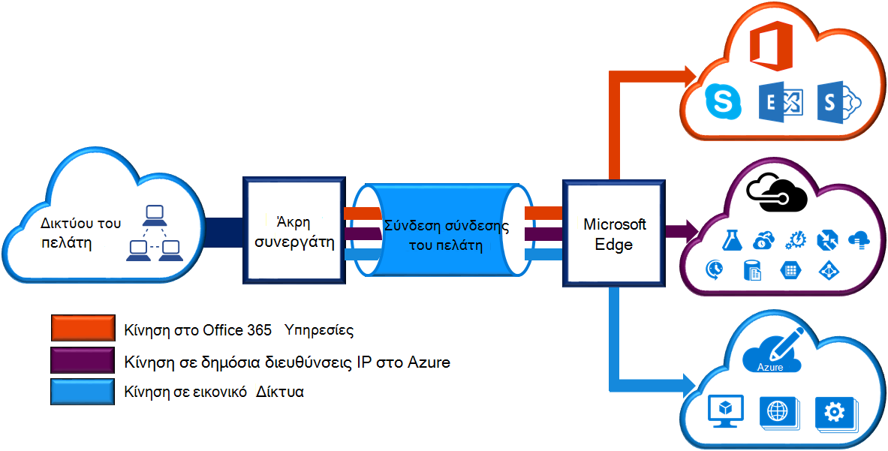
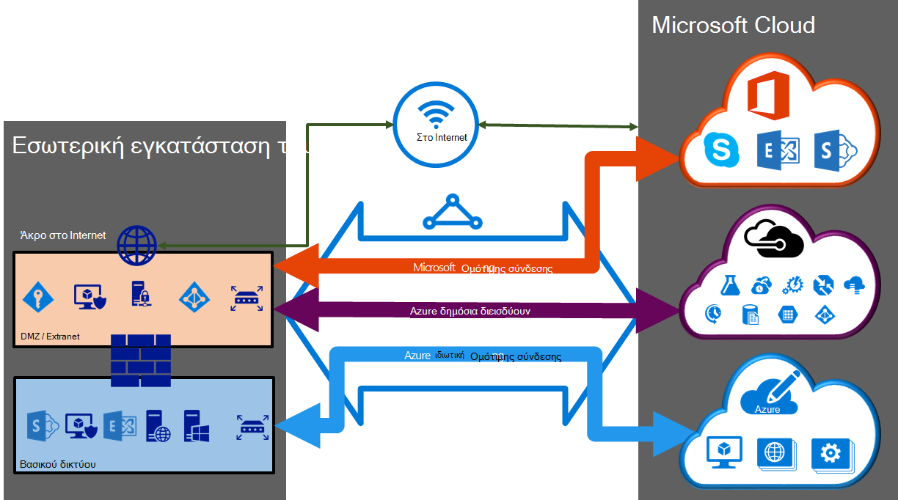

<properties 
   pageTitle="ExpressRoute κυκλώματα και τομείς δρομολόγησης | Microsoft Azure"
   description="Αυτή η σελίδα παρέχει μια επισκόπηση των ExpressRoute κυκλώματα και τους τομείς δρομολόγησης."
   documentationCenter="na"
   services="expressroute"
   authors="cherylmc"
   manager="carmonm"
   editor=""/>
<tags 
   ms.service="expressroute"
   ms.devlang="na"
   ms.topic="article" 
   ms.tgt_pltfrm="na"
   ms.workload="infrastructure-services" 
   ms.date="10/10/2016"
   ms.author="cherylmc"/>

# ExpressRoute κυκλώματα και τομείς δρομολόγησης

 Πρέπει να παραγγείλετε ένα *κύκλωμα ExpressRoute* για τη σύνδεση την υποδομή εσωτερικής σας στη Microsoft μέσω μια υπηρεσία παροχής σύνδεσης. Η παρακάτω εικόνα παρέχει μια λογική απεικόνιση της σύνδεσης μεταξύ του WAN και της Microsoft.

## Κυκλώματα ExpressRoute

Ένα *κύκλωμα ExpressRoute* αντιπροσωπεύει μια λογική σύνδεση μεταξύ την υποδομή εσωτερικής εγκατάστασης και υπηρεσίες cloud της Microsoft μέσω μια υπηρεσία παροχής σύνδεσης. Μπορείτε να τη διάταξη πολλών κυκλώματα ExpressRoute. Κάθε κύκλωμα μπορεί να είναι στις ίδιες ή σε διαφορετικές περιοχές και μπορεί να συνδεθεί με τους χώρους μέσω συνδεσιμότητας διαφορετικές υπηρεσίες παροχής. 

Κυκλώματα ExpressRoute αντιστοιχεί σε οποιαδήποτε φυσική οντοτήτων. Ένα κύκλωμα αναγνωρίζεται με μοναδικό τρόπο από ένα πρότυπο που ονομάζεται GUID ως έναν αριθμό-κλειδί υπηρεσίας (πλήκτρο s). Το κλειδί υπηρεσίας είναι η μοναδική πληροφορία των πληροφοριών που ανταλλάσσονται μεταξύ της Microsoft, η υπηρεσία παροχής σύνδεσης και μπορείτε. Το πλήκτρο s δεν είναι ένα μυστικό για λόγους ασφαλείας. Υπάρχει μια αντιστοίχιση 1:1 μεταξύ ένα κύκλωμα ExpressRoute και το πλήκτρο s.

Ένα κύκλωμα ExpressRoute μπορεί να έχει έως και τρεις ανεξάρτητες peerings: Azure ιδιωτική δημόσια, Azure και της Microsoft. Κάθε διεισδύουν είναι ένα ζεύγος ανεξάρτητη πρωτόκολλο BGP περίοδοι λειτουργίας κάθε τους έχει ρυθμιστεί περιττή για υψηλή διαθεσιμότητα. Υπάρχει μια 1: n (1 < = N < = 3) αντιστοίχιση μεταξύ ένα κύκλωμα ExpressRoute και δρομολόγηση τομείς. Ένα κύκλωμα ExpressRoute μπορεί να έχει ένα, δύο ή όλες τις τρεις peerings ενεργοποιημένο ανά ExpressRoute κυκλώματος.
 
Κάθε κύκλωμα έχει ένα σταθερό εύρος ζώνης (50 Mbp, 100 Mbps, 200 Mbps, 500 Mbps, 1 Gbps, 10 Gbps) και έχει αντιστοιχιστεί σε μια υπηρεσία παροχής σύνδεσης και μια θέση peering. Το εύρος ζώνης που επιλέγετε είναι κοινής χρήσης σε όλα τα peerings για το κύκλωμα. 

### Όρια, όρια και περιορισμοί

Προεπιλεγμένη όρια και περιορισμοί ισχύουν για κάθε κύκλωμα ExpressRoute. Ανατρέξτε στη σελίδα [συνδρομή Azure και όρια υπηρεσίας, όρια, και περιορισμούς](../azure-subscription-service-limits.md) για ενημερωμένες πληροφορίες σχετικά με τα όρια.

## ExpressRoute τομείς δρομολόγησης

Ένα κύκλωμα ExpressRoute έχει πολλούς τομείς δρομολόγησης που σχετίζεται με το: Azure ιδιωτική δημόσια, Azure και της Microsoft. Κάθε έναν από τους τομείς δρομολόγηση έχει ρυθμιστεί τον ίδιο τρόπο στο ένα ζεύγος δρομολογητές (σε κοινή χρήση φόρτωσης ή ενεργούς ρύθμισης παραμέτρων) για υψηλή διαθεσιμότητα. Azure υπηρεσίες κατηγοριοποιούνται ως *Azure δημόσια* και *ιδιωτικά Azure* για να αντιπροσωπεύει την συνδυασμούς διευθύνσεων IP.

### Ιδιωτική διεισδύουν

Azure τον υπολογισμό των υπηρεσιών, δηλαδή εικονικές μηχανές (IaaS) και τις υπηρεσίες cloud (PaaS), που έχουν αναπτυχθεί μέσα σε ένα εικονικό δίκτυο μπορούν να συνδέονται μέσω του ιδιωτικού peering τομέα. Το ιδιωτικό peering τομέα θεωρείται αξιόπιστη την επέκταση του δικτύου σας πυρήνα στο Microsoft Azure. Μπορείτε να ρυθμίσετε τη σύνδεση διπλής κατεύθυνσης μεταξύ του βασικού δικτύου και των Azure εικονικού δικτύων (VNets). Αυτό διεισδύουν σάς επιτρέπει να συνδεθείτε σε εικονικές μηχανές και υπηρεσίες απευθείας σε ιδιωτική διευθύνσεις IP στο cloud.  

Μπορείτε να συνδέσετε περισσότερα από ένα εικονικό δίκτυο στον ιδιωτικό peering τομέα. Ελέγξτε τη [σελίδα συνήθεις Ερωτήσεις](expressroute-faqs.md) για πληροφορίες σχετικά με όρια και περιορισμούς. Μπορείτε να επισκεφθείτε τη σελίδα [συνδρομή Azure και όρια υπηρεσίας, όρια, και περιορισμούς](../azure-subscription-service-limits.md) για ενημερωμένες πληροφορίες σχετικά με τα όρια.  Ανατρέξτε στη σελίδα [δρομολόγησης](expressroute-routing.md) για λεπτομερείς πληροφορίες σχετικά με παραμέτρους δρομολόγησης.

### Δημόσια διεισδύουν

Υπηρεσίες όπως το χώρο αποθήκευσης Azure, βάσεις δεδομένων SQL και τοποθεσίες Web παρέχεται σε δημόσια διευθύνσεις IP. Ιδιωτικά, μπορείτε να συνδεθείτε με τις υπηρεσίες που φιλοξενούνται σε δημόσια διευθύνσεις IP, συμπεριλαμβανομένων των VIPs των υπηρεσιών σας cloud, μέσω του δημόσια peering δρομολόγησης τομέα. Μπορείτε να συνδεθείτε δημόσια peering τομέα για να σας DMZ και να συνδεθείτε σε όλες τις υπηρεσίες Azure σε δημόσια διευθύνσεις IP από WAN σας χωρίς να χρειάζεται να συνδεθείτε μέσω του internet. 

Συνδεσιμότητα πάντα ξεκινά από το WAN με τις υπηρεσίες Microsoft Azure. Υπηρεσίες Microsoft Azure δεν θα μπορείτε να ξεκινήσετε συνδέσεις στο δίκτυό σας σε αυτόν τον τομέα δρομολόγησης. Μόλις ενεργοποιηθεί η δημόσια διεισδύουν, θα μπορείτε να συνδεθείτε σε όλες τις υπηρεσίες Azure. Θα σας δεν σας επιτρέπουν να επιλέξετε επιλεκτική για την οποία θα σας να κοινοποιήσετε διαδρομές για τις υπηρεσίες. Μπορείτε να δείτε τη λίστα των προθέματα μας κοινοποιήσετε σε εσάς μέσω αυτό διεισδύουν στη σελίδα [Περιοχές διευθύνσεων IP του Microsoft Azure κέντρου δεδομένων](http://www.microsoft.com/download/details.aspx?id=41653) . Η σελίδα ενημερώνεται κάθε εβδομάδα.

Μπορείτε να ορίσετε φίλτρα προσαρμοσμένη διαδρομή εντός του δικτύου σας για την εκμετάλλευση μόνο τις διαδρομές που χρειάζεστε. Ανατρέξτε στη σελίδα [δρομολόγησης](expressroute-routing.md) για λεπτομερείς πληροφορίες σχετικά με παραμέτρους δρομολόγησης. Μπορείτε να ορίσετε φίλτρα προσαρμοσμένη διαδρομή εντός του δικτύου σας για την εκμετάλλευση μόνο τις διαδρομές που χρειάζεστε. 

Ανατρέξτε στο θέμα [Συνήθεις ερωτήσεις για τη σελίδα](expressroute-faqs.md) για περισσότερες πληροφορίες σχετικά με τις υπηρεσίες που υποστηρίζονται από τη δημόσια peering δρομολόγηση τομέα. 
 
### Microsoft διεισδύουν

[AZURE.INCLUDE [expressroute-office365-include](../../includes/expressroute-office365-include.md)]

Σύνδεση με όλες τις άλλες Microsoft online υπηρεσίες (όπως υπηρεσίες του Office 365) θα είναι μέσω του Microsoft διεισδύουν. Θα σας επιτρέπουν διπλής κατεύθυνσης συνδεσιμότητα μεταξύ σας WAN και Microsoft υπηρεσίες cloud μέσω του Microsoft peering δρομολόγησης τομέα. Πρέπει να συνδέεστε με υπηρεσίες cloud της Microsoft μόνο μέσω δημόσιες διευθύνσεις IP που ανήκουν από εσάς ή από την υπηρεσία παροχής σύνδεσης και που πρέπει να συμμορφώνονται με τους καθορισμένους κανόνες. Δείτε τη σελίδα [τις προϋποθέσεις ExpressRoute](expressroute-prerequisites.md) για περισσότερες πληροφορίες.

Ανατρέξτε στο θέμα [Συνήθεις ερωτήσεις για τη σελίδα](expressroute-faqs.md) για περισσότερες πληροφορίες σχετικά με τις υπηρεσίες που υποστηρίζονται, κόστους και λεπτομέρειες ρύθμισης παραμέτρων. Ανατρέξτε στη σελίδα [Θέσεις ExpressRoute](expressroute-locations.md) για πληροφορίες στη λίστα των υπηρεσιών παροχής συνδεσιμότητας σας δίνει τη δυνατότητα διεισδύουν υποστήριξης της Microsoft.

## Δρομολόγηση τομέα σύγκρισης

Ο παρακάτω πίνακας συγκρίνει τους τρεις δρομολόγησης τομείς.

||**Ιδιωτική διεισδύουν**|**Δημόσια διεισδύουν**|**Microsoft διεισδύουν**|
|---|---|---|---|
|**MAX. υποστηρίζονται ανά διεισδύουν προθέματα #**|4000 από προεπιλογή, 10.000 με ExpressRoute Premium|200|200|
|**Περιοχές διευθύνσεων IP που υποστηρίζονται**|Οποιαδήποτε έγκυρη διεύθυνση IPv4 εντός του WAN.|Δημόσιες διευθύνσεις IPv4 που ανήκουν από εσάς ή από την υπηρεσία παροχής σύνδεσης.|Δημόσιες διευθύνσεις IPv4 που ανήκουν από εσάς ή από την υπηρεσία παροχής σύνδεσης.|
|**ΩΣ αριθμός απαιτήσεις**|Ιδιωτικές και δημόσιες ΩΣ αριθμοί. Πρέπει να είστε ο κάτοχος του κοινού ΩΣ αριθμός Εάν επιλέξετε να χρησιμοποιήσετε ένα. | Ιδιωτικές και δημόσιες ΩΣ αριθμοί. Ωστόσο, πρέπει να μπορείτε να αποδείξετε όσον αφορά την κατοχή δημόσιων διευθύνσεων IP.| Ιδιωτικές και δημόσιες ΩΣ αριθμοί. Ωστόσο, πρέπει να μπορείτε να αποδείξετε όσον αφορά την κατοχή δημόσιων διευθύνσεων IP.|
|**Δρομολόγηση διευθύνσεις IP του περιβάλλοντος εργασίας**|Διευθύνσεις IP δημόσια και RFC1918|Καταχωρηθεί σε εσάς στον δρομολόγησης μητρώα δημόσιων διευθύνσεων IP.| Καταχωρηθεί σε εσάς στον δρομολόγησης μητρώα δημόσιων διευθύνσεων IP.|
|**Υποστήριξη κατακερματισμός MD5**| Ναι|Ναι|Ναι|

Μπορείτε να επιλέξετε για να ενεργοποιήσετε ένα ή περισσότερα από τους τομείς δρομολόγησης ως μέρος τους κυκλώματος ExpressRoute. Μπορείτε να επιλέξετε να έχουν όλοι οι τομείς δρομολόγησης τοποθέτηση στο το ίδιο VPN, εάν θέλετε να συνδυάσετε σε ένα μεμονωμένο δρομολόγηση τομέα. Μπορείτε επίσης να τις τοποθετήσετε σε διαφορετικές δρομολόγησης τομείς, παρόμοια με το διάγραμμα. Η συνιστώμενη ρύθμιση παραμέτρων είναι ότι ιδιωτικό διεισδύουν είναι συνδεδεμένη απευθείας με το δίκτυο πυρήνα, και τα δημόσια και συνδέσεις διεισδύουν Microsoft είναι συνδεδεμένοι με το DMZ.
 
Εάν επιλέξετε να έχουν όλες οι τρεις peering περίοδοι λειτουργίας, πρέπει να έχετε τρεις ζεύγη των περιόδων λειτουργίας το πρωτόκολλο BGP (ένα ζεύγος για κάθε τύπο peering). Τα ζεύγη περιόδου λειτουργίας πρωτόκολλο BGP παρέχουν ιδιαίτερα διαθέσιμη σύνδεσης. Εάν πρόκειται να συνδεθείτε στις υπηρεσίες παροχής επιπέδου 2 συνδεσιμότητας, θα είναι υπεύθυνη για τη ρύθμιση των παραμέτρων και Διαχείριση δρομολόγησης. Μπορείτε να μάθετε περισσότερα, ελέγχοντας το [ροές εργασίας](expressroute-workflows.md) για τη ρύθμιση του ExpressRoute.

## Επόμενα βήματα

- Βρείτε μια υπηρεσία παροχής. Ανατρέξτε στο θέμα [ExpressRoute υπηρεσίες παροχής και τις θέσεις](expressroute-locations.md).
- Βεβαιωθείτε ότι πληρούνται όλες οι προϋποθέσεις. Ανατρέξτε στο θέμα [προαπαιτούμενα στοιχεία ExpressRoute](expressroute-prerequisites.md).
- Ρυθμίστε τις παραμέτρους της σύνδεσής σας ExpressRoute.
    - [Δημιουργήστε ένα κύκλωμα ExpressRoute](expressroute-howto-circuit-classic.md)
    - [Ρυθμίστε τις παραμέτρους δρομολόγησης (κυκλώματος peerings)](expressroute-howto-routing-classic.md)
    - [Σύνδεση ενός VNet με ένα κύκλωμα ExpressRoute](expressroute-howto-linkvnet-classic.md)
